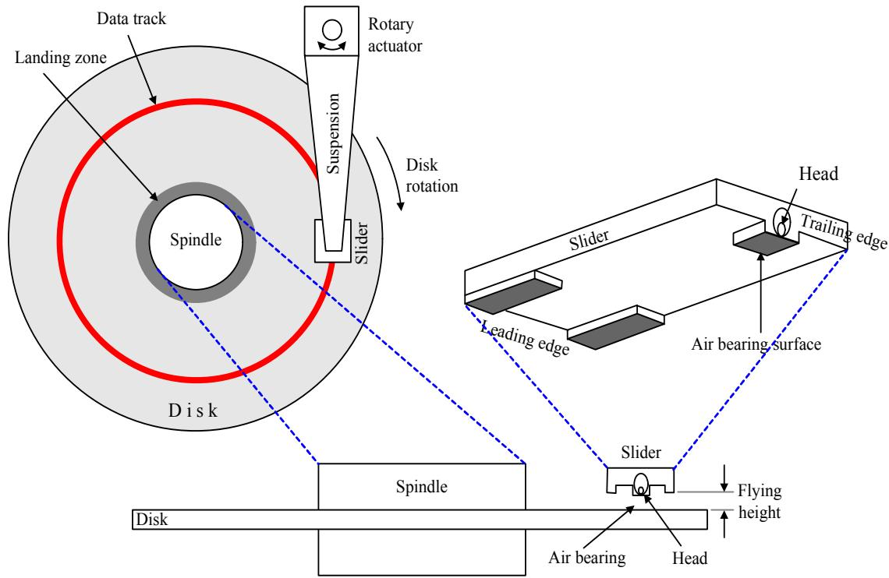
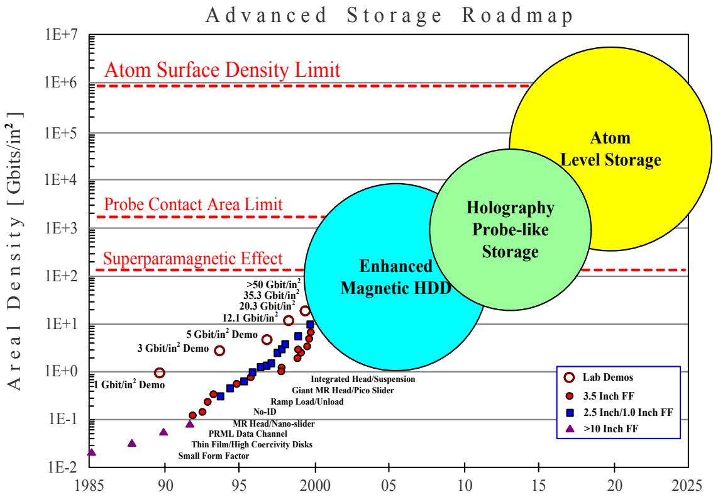

第 1 章

# 磁记录基础知识

本章将阐述数据记录系统的重要性，重点介绍硬盘驱动器（hard disk drive）。随后将介绍磁记录（magnetic recording）的历史，并解释磁记录的基础知识，例如硬盘驱动器中的数据存储结构、磁滞回线（Hysteresis loop）以及超顺磁性（superparamagnetic）等。最后将探讨未来用于硬盘驱动器以满足日益增长的数据存储需求的各种记录技术趋势。

## 1.1 引言

当前处于信息时代，因此需要高效、低成本且可靠的数据记录系统来存储海量数据。目前常用的数据记录设备包括磁软盘（magnetic floppy disk）、磁带（magnetic tape）、硬盘驱动器、光盘（CD: compact disc）和数字多功能光盘（DVD: digital versatile disc）等，这些设备在计算机内部被广泛使用。

  
图 1.1: 数据记录的分层结构 [1]

此外，当计算机能够连接到各种网络，如局域网（LAN: local area network）和互联网（Internet），以及万维网（WWW: World Wide Web）的出现，使得对数据存储的需求不断增加。

图 1.1 显示了计算机数据记录的分层结构。通常，计算机由微处理器（microprocessor）、半导体主存储器（semiconductor main memory）和数据记录设备组成。微处理器主要负责访问和存储在半导体主存储器（如 D-RAM: dynamic random access memory）中的数据，因为其访问速度极快（小于 100 纳秒）。然而，D-RAM 属于易失性存储器（volatile memory）且容量较小，因此需要额外的存储设备，如硬盘驱动器、磁软盘、磁带、CD 和 DVD 等。

## 1.2 磁记录历史

这些设备被认为是不可存储器（nonvolatile memory）。尽管这些记录设备的存储容量较高，但与 D-RAM 相比，其访问速度非常慢。总而言之，从图 1.1 可以看出，层级越高，访问速度越快，但价格也越高。也就是说，每 GB（gigabyte）的价格远高于普通记录设备。然而，综合考虑容量、价格、可靠性和性能等因素，硬盘驱动器被认为是性价比最高的数据存储设备。因此，本书将仅讨论硬盘驱动器的记录技术。

计算机早期的记录技术与纸张有关，采用打孔卡（punch card） 和纸带（paper tape）的形式，数据通过在纸上打孔或书写来存储 [2]。这种存储方式复杂且运行缓慢，且记录介质（media）不耐用。随后，磁带被引入用于替代纸张存储数据，磁带的读写过程与音乐录音带类似。磁带的主要缺点是数据访问是线性的（linear），即系统无法进行随机访问（random access）。随后，磁软盘被投入使用，实现了随机访问。然而，磁软盘容量有限且访问速度较慢。因此，进入了硬盘驱动器磁记录时代，它具有许多优点，如高存储容量、高访问速度、支持随机访问等。

磁记录由 Oberlin Smith [3] 在 1888 年发明，并由工程师 Valdemar Poulsen 在 1898 年以“电磁记录仪（Telegraphone）”的形式首次展示 [4]。Telegraphone 将模拟（analog）音频信号记录在绕在旋转滚筒（drum）上的钢琴线上。经过数十年的发展，磁记录系统最终进入市场。如今，计算机、手机、便携式音乐播放器和数字相机等电子设备对存储空间的需求不断增加。数字磁记录（digital magnetic recording）已成为许多记录设备（如磁软盘、磁带和硬盘驱动器）用于存储各类应用数据的主要方法。

第一台硬盘驱动器于 1956 年由 IBM 公司推出，名为“IBM 305 RAMAC” [5]，可存储 5 MB（megabyte）数据，使用了 50 张直径 24 英寸的磁碟（magnetic disk）。如今，硬盘驱动器的体积已大大缩小，例如高度小于 2 英寸，盘片直径小于 3.5 英寸，但可存储超过 100 GB 的数据。图 1.2 显示了“面密度（areal density）”的增长趋势，面密度是衡量记录介质单位面积上可存储比特（bit）量的指标，通常单位为 Gb/in²（gigabit per square inch）（面密度的详细定义见 1.4.3 节）。从图中可以看出，自 1956 年第一台硬盘驱动器上市以来，面密度增长了 5000 万倍以上。硬盘驱动器面密度的增长得益于各部件性能的提高，如磁头（magnetic head）、记录介质以及读通道芯片（read-channel chip）中的数字信号处理（digital signal processing）系统等。

从图 1.2 可以发现，在引入部分响应最大似然（PRML: partial-response maximum-likelihood）[8] 技术和 MR（magneto-resistive）磁头后，面密度的年复合增长率（CGR）从 30% 提高到 60%（1992 年之后）。随后，在 2000 年引入 GMR（giant magneto-resistive）磁头后，面密度实现了 100% 的 CGR。通过对硬盘驱动器各方面的改进，目前市售的硬盘驱动器其面密度和访问速度不断提高，而每 GB 的价格则持续下降。

## 1.3 什么是磁记录

磁记录是指将比特数据存储为记录介质中磁化强度（magnetization）变化的形式。它可以分为两种类型：模拟和数字。模拟磁记录将信号（signal）存储为连续变化的磁化强度，磁化强度与被存储信号的电平成正比，例如记录来自麦克风的音频信号。相反，数字磁记录利用某些材料的磁性，当这些材料达到饱和状态（saturated）时，其磁化方向将指向某个方向或相反方向。这种记录方式适用于存储具有两种状态（比特“1”和比特“0”）的数字数据，即“二进制数据（binary data）”。因此，这些材料被用于制造存储二进制数据的记录介质。

由于目前绝大多数数据（如计算机数据和通过互联网传输的数据）都以数字形式存在，且模拟数据可以通过脉冲编码调制（PCM: pulse code modulation）[9] 转换为数字形式以便于存储。因此，数字磁记录最适合当前的存储需求。在本书接下来的内容中，提到“磁记录”时均指数字磁记录，且仅关注硬盘驱动器的磁记录。

## 1.4 磁记录

磁记录是硬盘驱动器中用于存储数据的技术。本节将介绍硬盘驱动器的一般工作原理，并展示如何将硬盘驱动器模拟为数字通信系统（digital communication system），从而应用通信系统的各种理论来解释数据存储、磁头演进、磁滞回线（Hysteresis loop）的重要性以及超顺磁性（superparamagnetic）的含义。

## 1.4.1 硬盘驱动器的内部结构

图 1.3 展示了硬盘驱动器的内部结构，其一般工作原理如下：信号通过读写头（read/write heads）进出。各种电子元件位于安装在硬盘驱动器底部盖上的印刷电路板（printed circuit board）上。驱动器（drive）被严密密封，以防止外部污染物（contamination）影响内部元件。这些电子元件负责控制磁头、主轴电机（spindle motor）和执行器（actuator）的信号。

  
图 1.4: 硬盘驱动器的内部结构 [1]

执行器负责控制臂（actuator arm）的运动（如图 1.4 所示）。执行器围绕指定的轴心旋转，以控制磁头在盘片（disk）径向方向上的位置。磁头安装在滑块（slider）内部。在实际运行中，磁头在盘片表面上方飞行，飞行高度极低（小于 $10^{-6}$ 英寸）[1, 11]。同时，主轴电机在驱动器工作期间以恒定速度旋转盘片。当驱动器停止工作或进入睡眠模式（sleep mode）时，主轴停止旋转，执行器将磁头移动到加载区（landing zone），该区域位于盘片的内径区域或外径的斜坡区域，使磁头远离盘片表面。

  
图 1.5: 硬盘驱动器磁记录系统模型 [12]

## 1.4.2 硬盘驱动器的通信系统模型

硬盘驱动器的数据写读过程（write/read process）可以模拟为数字通信系统（如图 1.5 所示），由信源（source）、发送机（transmitter）、信道（channel）、接收机（receiver）和信宿（destination）组成。但对于硬盘驱动器，数据并非从一个地点发送到另一个地点，而是从一个时间点发送到另一个时间点。也就是说，数据在某个时间点写入记录介质，一段时间后，如果需要使用该数据，则从记录介质中将其读出。

如图 1.5 所示，数据序列 $\{ x_k \}$ 通过编码器（encoder）进行编码，以提高记录和解码效率。随后，编码后的数据序列 $\{ a_k \}$ 被发送至写驱动器（write driver），将二进制数据转换为电流，供给写头（write head）将其写入记录介质。当需要读取数据时，读头（read head）从记录介质中读取数据，输出电信号，称为“读回信号（read-back signal）”。该信号被送入读通道（read channel）模块，由其中的电子元件进行信号处理。随后，结果被送至检测器（detector）以判定发送的 $\{ a_k \}$ 是什么，最后由解码器（decoder）将 $a_k$ 解码，得出 $x_k$ 的估计值，记作 $\hat{x}_k$。因此，如果 $\hat{x}_k \neq x_k$，则系统发生了错误（error）。关于硬盘驱动器通信系统模型的详细内容，请参阅第 6 章。

  
图 1.6: 硬盘驱动器的数据存储结构

## 1.4.3 硬盘驱动器的数据存储结构

硬盘驱动器的数据存储结构如图 1.6 所示。硬盘驱动器将数据存储在称为“盘片（platter）”的圆形磁盘中。每个盘片两面都涂有磁性材料，数据沿着以中心为圆心的环形轨迹存储，称为“磁道（track）”。每个磁道又被分为多个“扇区（sector）”，每个扇区存储 512 字节（1 字节 = 8 比特，因此 512 字节 = 4096 比特）。

通常，用于描述硬盘驱动器存储容量的参数是面密度，定义为 [1]：

$$
A_d = L_d T_d \tag{1.1}
$$

其中 $A_d$ 是面密度，单位为比特/平方英寸（bits/in²）；$L_d$ 是线密度（linear density），单位为比特/英寸（bits/in）；$T_d$ 是道密度（track density），单位为磁道/英寸（tracks/in）。目前，硬盘驱动器的面密度已超过 100 Gb/in² [13]。

通过增加公式 (1.1) 中参数 $L_d$ 和 $T_d$ 的值可以提高硬盘驱动器的面密度（或存储容量）。例如，如果 $L_d$ 和 $T_d$ 同时增加一倍，面密度将增加到原来的四倍。然而，随着 $L_d$ 和 $T_d$ 的增加，用于存储一个比特的面积会减少，这将导致难以制造高质量的记录介质、磁头、读通道及其他设备，从而影响硬盘驱动器运行的可靠性。因此，硬盘驱动器采用了各种记录技术来增加存储容量并保持运行可靠性（详见 1.5 节）。

## 1.4.4 磁头的演进

硬盘驱动器中使用的磁头负责在电信号和磁信号之间进行相互转换。通常，一个磁头组件由两个磁头组成：写头和读头。随着磁头技术的演进，硬盘驱动器使用了多种类型的磁头，如图 1.7 所示。

早期的硬盘驱动器使用铁氧体（ferrite）磁头，通过线圈将电信号转换为磁信号。铁氧体磁头在作为写头时表现良好，因为增加线圈匝数可以增加磁场强度 [12]。然而，这种方法使得读取过程变得困难。因此，后来的硬盘驱动器在读取过程中使用了 MR（magneto-resistive）磁头，从而提高了存储面密度。由于 MR 磁头对磁场变化非常敏感，产生的读回信号幅度较大，因此易于进行信号处理。在那个阶段，硬盘驱动器在读写过程中使用不同类型的磁头：读取使用 MR 磁头，写入使用铁氧体磁头。随后，GMR（giant magneto-resistive）磁头于 2000 年投入使用，极大地增加了硬盘驱动器的存储容量 [2]。目前，TMR（tunneling magneto-resistive）磁头正变得流行，因为其性能优于其他类型的磁头 [1]。综上所述，磁头技术的不断改进使硬盘驱动器的存储容量日益增加，以满足未来日益增长的存储需求。

  
图 1.7: 硬盘驱动器磁头的演进（来源：日立公司网站 [14]）

## 1.4.5 磁滞回线

硬盘驱动器的磁滞回线（Hysteresis loop）[1, 5, 11] 是记录介质的磁化强度（medium magnetization）与施加磁场（applied magnetic field）之间关系的图表。磁滞回线告知系统需要向记录介质施加多少磁场，才能使存储在介质中的比特数据保持稳定。图 1.8 是显示记录介质磁化强度 $M$ 与施加磁场 $H$ 之间关系的磁滞回线。点 a 表示 $M = 0$ 且 $H = 0$。当向记录介质增加磁场 $H$ 时，$M$ 沿图中的路径增加，直到到达点 b。此后，无论 $H$ 如何增加，$M$ 也不再增加。点 b 被称为“饱和点（saturation point）”，此时记录介质的磁化强度为 $M_s$。随后，当将磁场 $H$ 降低至零时，$M$ 沿图示路径变化至点 c，此时记录介质的磁化强度为 $M_r$，称为“剩磁（remanent magnetization）”。

  
图 1.8: 磁滞回线

如果进一步降低 $H$ 的值，$M$ 将逐渐降低，直到在点 d 达到零，此时的磁场强度称为“矫顽力（coercivity）”，记为 $-\mathcal{H}_c$。如果继续降低 $H$，直到点 e，记录介质将达到负饱和（negative saturation），即磁化方向完全相反。随后，如果增加 $H$，则 $M$ 将依次经过点 f、点 g，最后回到点 b。由此可见，记录介质的磁化强度 $M$ 取决于过去和现在的磁场 $H$ 值。因此，利用磁滞回线原理可以在记录介质中存储数据：当施加磁场 $H$ 被设为零（或被擦除）时，记录介质仅有两种磁化状态，即：

$\pm M_r$

这取决于之前的施加磁场 $H$，与具有两种状态（比特 0 和比特 1）的数字记录相对应。比特 0 使记录介质的磁化方向指向一个方向，而比特 1 则使其指向相反方向。

## 磁性材料在记录介质和磁头中的选择

由不同磁性材料（magnetic material）制成的记录介质和磁头具有不同的磁滞回线。磁性材料可分为两种： “硬磁” 和 “软磁” [1, 11]。硬磁材料具有开环磁滞回线，即 $H_c \gg 0$，适合用于数字数据存储记录介质。因为硬磁材料能够长时间稳定地保持比特 0 或比特 1 的磁化状态，这是因为系统需要极强的磁场 $H$ 才能改变其磁化方向。而软磁材料具有闭环磁滞回线，即 $H_c$ 值较小，适合用于制造磁头。

在实际操作中，写头用于改变记录介质磁化方向的磁场强度 $H_c$ 必须处于饱和范围内，才能将数据记录在介质中。由于现代硬盘驱动器的存储容量增加，记录密度随之提高，导致磁道尺寸缩小。因此，磁道之间发生磁场干扰的可能性增加，因为来自写头的磁场扩散范围比目标磁道的宽度要宽，导致相邻磁道受到不需要的磁场影响。因此，在选择记录介质材料时，必须选择具有合适 $H_c$ 值的介质，以防止相邻磁道的磁场干扰。提高记录介质的 $H_c$ 值可以缓解此问题。然而，如果 $H_c$ 过高，则写入数据会变得困难。相反，如果 $H_c$ 过低，则更容易受到相邻磁道的干扰。因此，在选择记录介质的 $H_c$ 值时，必须在写入能力和防止相邻磁道干扰之间取得平衡。

表 1.1 显示了选择高 $H_c$ 值和低 $H_c$ 值记录介质的优缺点。

<table><tr><td rowspan=1 colspan=1>记录介质的 $H_c$ 值</td><td rowspan=1 colspan=1>优点</td><td rowspan=1 colspan=1>缺点</td></tr><tr><td rowspan=1 colspan=1>高值</td><td rowspan=1 colspan=1>能有效防止相邻磁道的磁场干扰</td><td rowspan=1 colspan=1>数据写入记录介质较为困难</td></tr><tr><td rowspan=1 colspan=1>低值</td><td rowspan=1 colspan=1>数据容易写入记录介质</td><td rowspan=1 colspan=1>容易受到相邻磁道的磁场干扰</td></tr></table>

因此，在实践中选择合适的 $H_c$ 值时，还必须考虑写头的特性。也就是说，如果写头能够很好地压缩磁场扩散范围（磁场方向窄），则无需过多担心写头引起的相邻磁道干扰。反之，如果写头性能较差（磁场扩散方向宽），则必须选择具有合适 $H_c$ 值的记录介质，以避免相邻磁道的磁场干扰问题。

## 1.4.6 超顺磁性

根据公式 (1.1)，若要增加硬盘驱动器的存储容量，可以增加 $L_d$ 和 $T_d$ 的值，这意味着存储一个比特所需的面积将减小。也就是说，硬盘驱动器的存储容量取决于在极小空间内存储一个比特的能力。存储一个比特的面积越小，硬盘驱动器的容量越大。在这种情况下，记录介质的晶粒粗糙度（grain granularity）成为一个重要因素，因为晶粒粗糙度是记录介质噪声（media noise）的主要来源。目前，具有细晶粒（grain）结构的磁性材料被用于需要高容量的硬盘驱动器记录介质，以减少介质噪声问题。

在物理层面，记录介质由大量微小晶粒组成，聚集形成体积为 $V$ 的颗粒（particle）。每个颗粒具有单轴各向异性系数（uniaxial anisotropy coefficient）$K_u$。如果 $K_u$ 值较大，则记录介质磁化方向改变的可能性较低（即稳定性较高）。通常，每个颗粒的各向异性能 $E_P$ 可由下式计算 [13]：

$$
E_P = K_u V \tag{1.2}
$$

该值用于衡量颗粒的稳定性。如果规定环境产生的热能（thermal energy）为：

$$
E_T = k_B T \tag{1.3}
$$

其中 $k_B$ 是玻尔兹曼常数（Boltzmann's constant），值为 $1.38 \times 10^{-23}$ 焦耳/开尔文（joules per kelvin），$T$ 是绝对温度，单位为开尔文（K: Kelvin）。因此，写入记录介质的比特数据要保持稳定，必须满足以下比率 [13]：

$$
\frac{E_P}{E_T} = \frac{K_u V}{k_B T} \ge M \tag{1.4}
$$

其中 $M$ 是一个较大的整数，例如 $M = 60$。公式 (1.4) 给出了一个通用的界限，称为“超顺磁极限（superparamagnetic limit）”[1, 5, 11, 15]。也就是说，如果公式 (1.4) 中的 $M$ 值过小（例如 $M = 2$，表示 $E_P$ 与 $E_T$ 的值相差不大），则比特 0 的磁化方向变为比特 1（或比特 1 变为比特 0）的可能性很高。这种现象被称为“超顺磁效应（superparamagnetic effect）”，它是记录技术的限制因素，导致硬盘驱动器的存储容量无法增加到超过超顺磁效应产生阈值的水平。

  
图 1.9: 硬盘驱动器采用技术的趋势 [16]

## 1.5 硬盘驱动器记录技术的趋势

本节将总结目前硬盘驱动器中使用以及未来计划采用的各种记录技术，以支持容量的增长，如图 1.9 所示。其重要细节如下：

  
图 1.10: 记录系统的读写过程：（上）纵向记录和（下）垂直记录（来源：日立公司网站 [17]）

### 1.5.1 纵向记录技术

目前市售的硬盘驱动器大多采用被称为“纵向记录（longitudinal recording）”的技术，其中记录介质的磁化方向与盘片平面平行。图 1.10（上）展示了纵向记录技术的读写过程（详细内容请参阅第 6 章）。

### 容量提升技术

由于存储需求不断增加，研究人员必须探索各种技术来提高硬盘驱动器的存储容量，例如降低磁头飞行高度（head flying height）、减小记录介质厚度以及使用高级数字信号处理系统等。然而，目前采用纵向记录技术的硬盘驱动器已接近超顺磁极限。例如，台式电脑使用的硬盘驱动器最高容量将低于 1 TB（terabyte）。因此，若要使硬盘驱动器达到 TB 级容量，必须引入新的记录技术，如垂直记录（perpendicular recording）、热辅助磁记录（HAMR: heat-assisted magnetic recording）、探针存储（probe storage）和全息记录（holography）等。具体细节如下：

### 1.5.2 垂直记录技术

提高面密度的一种方法是在增加 $K_u$ 的同时减小晶粒体积 $V$，以保持各向异性能 $E_P$ 不变，从而满足在给定温度 $T$ 下的公式 (1.4)。在实践中，$K_u$ 与记录介质的矫顽力 $H_c$ 成正比（见图 1.8）。这意味着增加 $K_u$ 也会导致 $H_c$ 增加，因此系统需要施加更强的磁场才能使晶粒的磁化方向与要写入的比特数据一致。“垂直记录（perpendicular recording）”能够提供比纵向记录强数倍的写入磁场 [13]，因此适合替代纵向记录技术。

垂直记录技术自 1984 年开始研究 [19]，其记录介质的磁化方向与盘片平面垂直，如图 1.10（下）所示。目前，采用垂直记录技术的硬盘驱动器已部分上市。与纵向记录相比，垂直记录的优点包括：

- 读写能力与盘片厚度相对独立，因此可以在不担心热稳定性的情况下提高面密度。
- 读头获得的读回信号能量更高，更易于进行信号处理。
- 写入数据的磁场强度更高，有助于减少噪声和错误。

然而，在决定从纵向记录转向垂直记录之前，需要考虑以下因素：

1) **记录介质**：用于垂直记录系统的记录介质由两层组成（如图 1.10 所示）。第一层是用于存储比特 0 和比特 1 的磁层，第二层称为“软磁底层（soft underlayer, SUL）”，负责将磁通量从磁层引导回磁头。目前，研究人员一直在提高 SUL 的质量，以支持高容量垂直记录系统的运行 [1, 11, 12]。

2) **磁头**：垂直记录系统中的写头涉及探针设计（probe design），以便能够写入垂直于盘片平面的窄磁道。此外，纵向记录系统中的某些磁头也可以在垂直记录系统中使用 [20]。

3) **信号处理**：众所周知，纵向记录和垂直记录的状态转移脉冲（transition pulse）是一对希尔伯特变换（Hilbert transform）[5]。因此，在垂直记录系统开发的早期，引入了希尔伯特变换和微分器（differentiator）将垂直记录的读回信号转换为可用于纵向记录信号处理系统的信号 [21]。然而，这种方法的整体性能低于直接为垂直记录系统设计的信号处理系统，例如在接收端电路中使用适用于垂直记录信道冲激响应的部分响应（PR: partial-response）目标 [22]。此外，纵向记录和垂直记录中经常出现的错误模式不同，因此必须设计适合相应错误模式的纠错码（code）（详见《数字存储信号处理 第 2 卷：接收电路设计》第 5 章 [6]）。

### 1.5.3 热辅助磁记录技术

热辅助磁记录（HAMR: heat-assisted magnetic recording）[23, 24, 25] 是一种可将面密度提高至 400 Gb/in² [25] 的技术。HAMR 技术也被称为“混合记录（hybrid recording）”，其工作模型如图 1.11 所示，基本原理如下：

1) 使用具有极高矫顽力 $H_c$（或极高 $K_u$）的记录介质，以确保即使晶粒体积 $V$ 较小，记录介质仍能满足超顺磁极限（见公式 (1.4)）。

2) 在写入过程中通过给记录介质加热（例如使用激光束加热记录介质）来降低其矫顽力。当记录介质被加热时，其矫顽力下降，使得可以使用较小的磁场轻松将数据写入介质。写入完成后，记录介质冷却回原状态，恢复高矫顽力（或高 $K_u$）值。这意味着比特数据改变磁化方向的可能性极低，从而避开了超顺磁极限。图 1.12 显示了记录介质在加热前后的磁滞回线。

  
图 1.11: HAMR 技术工作模型

可以看出，HAMR 技术的概念相对简单，但在实践中仍存在许多系统设计问题需要解决，才能在硬盘驱动器中真正实现（详见 [24]）。

### 1.5.4 探针存储技术

开发探针存储（probe storage）[26] 技术的动力是为了缩小半导体存储器与硬盘驱动器之间的物理特性差距。硬盘驱动器能提供高容量和低单价，但访问速度远低于具有高访问速度但每 GB 价格昂贵的半导体存储器。

通常，硬盘驱动器在每次从磁盘检索数据时仅使用一个读头。为了提高访问速度，出现了一种将多个读头并行排列成阵列（array）的想法，以减少搜索数据所需的时间。这是因为读头移动到目标位置的平均距离会减少。此外，由于有多个读头分布在盘片各处，访问方式也可以变为线性，且探针（probe）以并行方式工作，从而大大降低每个磁头的数据传输率（data rate），使得在单磁头时无法实现读写机制在实践中变得可行。

为探针存储技术设计读通道极具挑战性，因为涉及大量磁头的并行工作。此外，其读写机制与目前的记录技术不同。因此，研究人员必须在将探针存储技术真正应用于硬盘驱动器之前解决各种问题。例如，由于探针的并行工作，信道可以被视为“多输入多输出（MIMO: multi-input multi-output）”系统。因此，研究人员可以利用多个磁头之间输入数据与输出数据的相互作用（interaction）来提高系统的整体性能（详见 [26, 27]）。

### 1.5.5 全息记录技术

全息记录（holography）[1, 28] 同样能够像前述其他技术一样，将硬盘驱动器的存储容量提升至远超当前技术的水平。全息记录的特点是将数据记录在记录介质的内部（volume），而非像目前技术那样仅记录在盘片表面。因此，全息记录可以通过一次光照实现数百万个比特的并行读写，而纵向或垂直记录每次只能读写 1 个比特。因此，全息记录支持的数据传输率远高于光学存储设备（optical storage device）。

总之，全息记录被认为是一种极具前景的未来存储技术，因为它具有诸多优点，如高容量、高传输速率、介质耐用、可靠性高且介质成本低等。然而，在实践中，研究人员仍需解决许多问题才能在硬盘驱动器中实现全息记录（详见 [1, 28]）。

## 1.6 本章小结

由于计算机、手机、便携式音乐播放器和数字相机等电子设备的使用日益普及，产生了海量的数字数据需要存储。因此，对高效、低成本且可靠的记录系统的需求不可避免。目前有许多记录设备，包括磁软盘、磁带、硬盘驱动器等。然而，综合考虑容量、价格和性能等因素，硬盘驱动器被认为是性价比最高的数据存储设备。

硬盘驱动器的数据读写依赖于记录介质磁化强度的变化。纵向记录是目前硬盘驱动器采用的主要技术。然而，采用纵向记录的硬盘驱动器已接近超顺磁极限，导致无法进一步增加存储容量。为了突破这一限制，必须采用新的记录技术，如垂直记录、热辅助磁记录、探针存储和全息记录等。目前，采用垂直记录技术的硬盘驱动器已开始在市场上销售。

## 1.7 课后练习

1. 请阐述数字存储与模拟存储的区别。
2. 请阐述数字存储的重要性。
3. 请阐述磁记录的工作原理。
4. 请阐述硬盘驱动器读写过程的基本原理。
5. 请阐述图 1.8 中磁滞回线的含义及其作用。
6. 请阐述超顺磁现象产生的原因。
7. 请对比纵向记录与垂直记录的一般工作原理。
8. 请阐述热辅助磁记录技术的一般工作原理。
9. 请阐述探针存储技术的一般工作原理。
10. 请阐述全息记录技术的一般工作原理。
