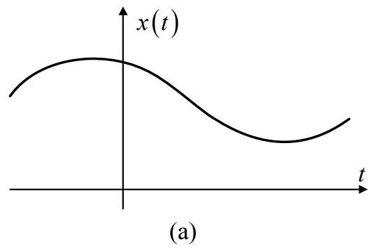
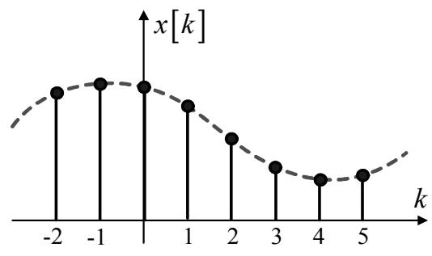
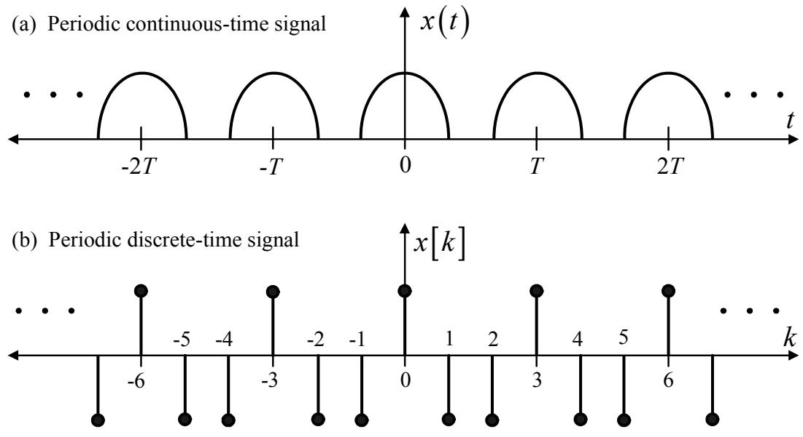
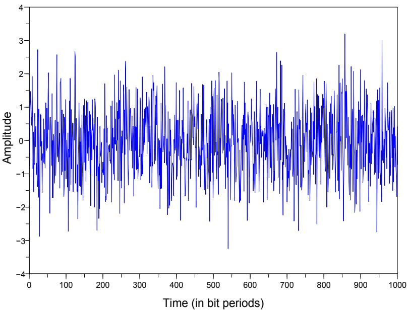
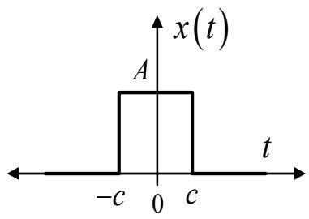
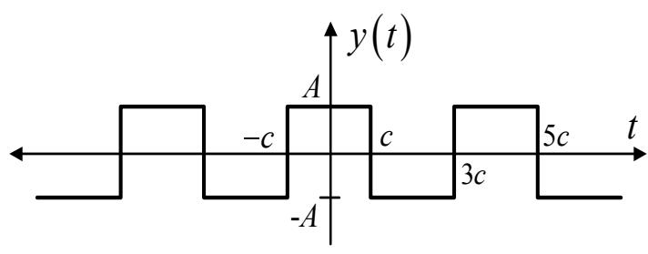

# 硬盘驱动器的数学基础

本章将介绍与硬盘驱动器信号处理系统相关的各项数学基础理论，首先将对信号进行分类，接着将解释数字信号的特性、卷积、系统以及相关性等，旨在为读者在后续章节中分析硬盘驱动器信号处理系统提供必要的数学准备。感兴趣的读者可以参考 [29, 32, 33, 34] 以获取更多详细信息。

## 2.1 信号的类型

信号 (signal) 是用于表示物理量的一种函数。在数学上，信号可以用一个独立变量的函数来表示。例如，信号 $f(t)$ 表示信号 $f$ 是独立变量 $t$ 的函数。通常，根据信号的特性，信号可以分为四大类 [29]：

(b)
图 2.1：示例 (a) 连续时间信号 和 (b) 离散时间信号

### 2.1.1 连续时间信号与离散时间信号

连续时间信号 (continuous-time signal) 是指随时间连续变化的信号。通常使用符号 $x(t)$ 来表示连续时间信号 $x$，其中 $t$ 是连续时间的独立变量（即变量 $t$ 可以取任何实数值）。因此，连续时间信号的值属于实数集或无限集。连续时间信号的例子包括语音和无线电波等。连续时间信号通常也被称为“模拟信号 (analog signal)”。

离散时间信号 (discrete-time signal) 是指不随时间连续变化的信号。在本书中，使用符号 $x[k]$ 或 $x_k$ 来表示离散时间信号 $x$，其中 $k$ 是离散时间的独立变量（即变量 $k$ 的取值是有限的）。因此，离散时间信号的值属于有限集。离散时间信号的例子包括泰国股票指数、硬盘驱动器的产量以及曼谷的人口数量等。图 2.1 展示了连续时间信号和离散时间信号的波形示例。

此外，离散时间信号 $x_k$ 可以通过对连续时间信号 $x(t)$ 在每个时间间隔 $t = kT_s$ 进行采样 (sampling) 而获得，其中 $k$ 为整数，$T_s$ 为采样周期 (sampling period)，而 $f_s = 1/T_s$ 为采样频率 (sampling frequency)。因此，通过采样获得的离散时间信号可以用以下数学公式表示（见图 2.1(b)）：

$$
x[k] = x_k = \left. x(t) \right|_{t=kT_s} = x(kT_s) \tag{2.1}
$$

这意味着每个数据点 $x_k$ 之间相隔 $T_s$ 个单位。

注：根据公式 (2.1)，如果采样频率符合采样定理 (sampling theorem)，离散时间信号 $x[k]$ 可以完美地代表连续时间信号 $x(t)$。该定理将在 5.5 节中详细讨论。

### 2.1.2 周期信号与非周期信号

周期信号 (periodic signal) 是指其波形在每个指定时间间隔后重复的信号，这个时间间隔被称为信号的周期 (period)。因此，连续时间周期信号 (periodic continuous-time signal) 是指可以找到一个正数周期 $T$，使得：

$$
x(t) = x(t + mT) \tag{2.2}
$$

对于所有 $t$ 值，其中 $m$ 为整数。图 2.2(a) 展示了连续时间周期信号的示例，在此示例中，可以认为信号 $x(t)$ 的周期为 $mT$ 个单位。然而，使等式 (2.2) 成立的最小正数 $T$ 被称为基波周期 (fundamental period)，用符号 $T_0$ 表示（即当 $m=1$ 时，$T_0 = T$）。而基波周期 $T_0$ 的倒数则是基波频率 $f_0$ (fundamental frequency)，其关系为：

$$
f_0 = \frac{1}{T_0} \tag{2.3}
$$

单位为赫兹 (Hz: hertz)。

图 2.2：示例 (a) 连续时间周期信号 和 (b) 离散时间周期信号

此外，离散时间信号也可以是周期信号，如果可以找到一个正整数周期 $N$，使得：

$$
x[k] = x[k + N] \tag{2.4}
$$

对于所有 $k$ 值，其中 $N$ 为整数。如图 2.2(b) 所示，在此示例中，信号 $x[k]$ 的周期为 $N, 2N, 3N, \dots$。同样地，基波周期 $N_0$ 是使等式 (2.4) 成立的最小正整数 $N$（在本例中 $N_0 = N$）。

周期信号具有一个重要特性：单个周期的信号包含了整个信号的所有特征。因此，在分析数据时，可以用一个周期来代表整个信号，而无需分析全部数据。不具备周期特性的信号被称为非周期信号 (aperiodic 或 nonperiodic signal)。

**示例 2.1**：给定 $x_1(t)$ 和 $x_2(t)$ 为周期分别为 $T_1$ 和 $T_2$ 的周期信号。请判断信号 $x(t) = x_1(t) + x_2(t)$ 是否为周期信号。

**解**：根据周期信号的特性，可得：
$$
\begin{array}{rcl}
x_1(t) & = & x_1(t + mT_1) \\
& & \\
x_2(t) & = & x_2(t + nT_2)
\end{array}
$$
其中 $m$ 和 $n$ 为任意整数。若令 $mT_1 = nT_2 = T$，则：
$$
\begin{array}{lll}
x(t) & = & x_1(t) + x_2(t) \\
& = & x_1(t + mT_1) + x_2(t + nT_2) \\
& = & x_1(t + T) + x_2(t + T) \\
& = & x(t + T)
\end{array}
$$
因此，信号 $x(t)$ 是周期信号，当且仅当比率 $T_1/T_2$ 为有理数时成立。此时 $x(t)$ 的周期等于 $T_1$ 和 $T_2$ 的最小公倍数 (least common multiple)。

**示例 2.2**：求正弦信号 (sinusoidal signal) $x(t) = \sin(0.4\pi t)$ 的基波周期 $T_0$。

**解**：信号 $x(t)$ 具有基波周期 $T_0$，当且仅当满足以下关系：
$$
\begin{array}{rcl}
x(t) & = & x(t + T_0) \\
& & \\
\sin(0.4\pi t) & = & \sin(0.4\pi [t + T_0]) \\
& & \\
& = & \sin(0.4\pi t + 0.4\pi T_0)
\end{array}
$$
由于 $\sin(\theta) = \sin(\theta + 2n\pi)$（$n$ 为任意整数），因此基波周期 $T_0$ 可由下式求得：
$$
0.4\pi T_0 = 2n\pi
$$
$$
T_0 = 5
$$
当 $n=1$ 时，即信号 $x(t)$ 的基波周期为 $T_0 = 5$ 个单位。

### 2.1.3 确定性信号与随机信号

确定性信号 (deterministic signal) 是指在任何时间点其值或属性都可以被精确确定的信号。因此，这类信号可以用时间的函数来表示。而随机信号 (random signal) 是指在任何时间点其值或属性都无法被精确确定的信号。

在通信系统中，常见的信号多为随机信号。它们可能以有用信息信号的形式出现，例如电话系统中的语音信号、卫星系统中的图像信号以及硬盘驱动器中存储的数据信号；也可能以不需要的噪声 (noise) 形式出现，例如由于电子运动引起的各种电子设备中的热噪声 (thermal noise)。图 2.3 展示了一个均值为零、方差为一的高斯随机信号 (Gaussian random signal) 示例。通常，热噪声的行为和特性与高斯随机信号相似。

注：本书使用 SCILAB [30] 软件绘制各种信号图表以及系统仿真结果。建议读者尝试自行绘制书中的图表，以加深对课程内容的理解。

图 2.3：均值为零、方差为一的高斯随机信号

### 2.1.4 能量信号与功率信号

在电路分析中，若设定 $v(t)$ 为电压（单位：伏特 V），$i(t)$ 为流经电阻 $R$（单位：欧姆 $\Omega$）的电流（单位：安培 A），则瞬时功率 (instantaneous power) 定义为：

$$
p(t) = v(t)i(t) = \frac{1}{R}v^2(t) \tag{2.5}
$$

因此，在时间段 $t_1 \le t \le t_2$ 内消耗的总能量 (total energy) 为：

$$
\int_{t_1}^{t_2} p(t) dt = \int_{t_1}^{t_2} \frac{1}{R}v^2(t) dt \tag{2.6}
$$

而在时间段 $t_1 \le t \le t_2$ 内的平均功率 (average power) 为：

$$
\frac{1}{t_2 - t_1} \int_{t_1}^{t_2} p(t) dt = \frac{1}{t_2 - t_1} \int_{t_1}^{t_2} \frac{1}{R}v^2(t) dt \tag{2.7}
$$

基于电路中的能量和功率定义，连续时间信号 $x(t)$ 在时间段 $t_1 \le t \le t_2$ 内的总能量定义为：

$$
\int_{t_1}^{t_2} |x(t)|^2 dt \tag{2.8}
$$

其中 $|x|$ 为 $x$ 的幅值。$x(t)$ 的时间平均功率 (time-averaged power) 为：

$$
\frac{1}{t_2 - t_1} \int_{t_1}^{t_2} |x(t)|^2 dt \tag{2.9}
$$

同样地，离散时间信号 $x[k]$ 在时间段 $k_1 \le k \le k_2$ 内的总能量定义为：

$$
\sum_{k=k_1}^{k_2} |x[k]|^2 \tag{2.10}
$$

其时间平均功率为：

$$
\frac{1}{k_2 - k_1 + 1} \sum_{k=k_1}^{k_2} |x[k]|^2 \tag{2.11}
$$

在实际应用中，通常关注无限时间段内的信号能量（即 $-\infty \le t \le \infty$ 或 $-\infty \le k \le \infty$）。在这种情况下，连续时间信号的总能量为：

$$
E = \lim_{T \to \infty} \int_{-T}^{T} |x(t)|^2 dt = \int_{-\infty}^{\infty} |x(t)|^2 dt \tag{2.12}
$$

离散时间信号的总能量为：

$$
E = \lim_{N \to \infty} \sum_{k=-N}^{N} |x[k]|^2 = \sum_{k=-\infty}^{\infty} |x[k]|^2 \tag{2.13}
$$

同样地，连续时间信号在无限时间段内的平均功率为：

$$
P = \lim_{T \to \infty} \frac{1}{2T} \int_{-T}^{T} |x(t)|^2 dt \tag{2.14}
$$

离散时间信号在无限时间段内的平均功率为：

$$
P = \lim_{N \to \infty} \frac{1}{2N + 1} \sum_{k=-N}^{N} |x[k]|^2 \tag{2.15}
$$

当信号的功率值有限（即 $0 < P < \infty$）时，该信号被称为功率信号 (power signal)。以下示例对此进行了说明：

**示例 2.3**：求信号 $x(t) = A \cos(\omega t + \phi)$ 的功率，其中 $\omega = 2\pi f$，$\phi$ 为相位常数。

**解**：由于 $x(t)$ 是周期为 $T_0$ 的周期信号，其功率可通过公式 (2.14) 计算，即：

$$
P = \frac{1}{T_0} \int_{0}^{T_0} |x(t)|^2 dt = \frac{1}{T_0} \int_{0}^{T_0} |A \cos(\omega t + \phi)|^2 dt
$$

$$
= \frac{A^2}{T_0} \int_{0}^{T_0} \frac{1 + \cos(2\omega t + 2\phi)}{2} dt
$$

$$
= \frac{A^2}{2T_0} \left\{ \int_{0}^{T_0} 1 dt + \int_{0}^{T_0} \cos(2\omega t + 2\phi) dt \right\}
$$

$$
= \frac{A^2}{2T_0} \{ T_0 + 0 \} = \frac{A^2}{2}
$$

因为 $\int_{0}^{T_0} \cos(2\omega t + 2\phi) dt = 0$。

从示例 2.3 可以发现，周期信号的功率可以通过分析单个周期来计算。即周期为 $T_0$ 的周期信号 $x(t)$ 的功率为：

$$
P = \frac{1}{T_0} \int_{0}^{T_0} |x(t)|^2 dt \tag{2.16}
$$

但周期信号的能量为无穷大（见公式 2.12）。因此，通常将周期信号视为功率信号。而对于非周期信号，在无限时间段内取平均值的结果通常为零，因此无法计算其功率，而需要使用“能量”定义。如果一个信号的能量值有限（即 $0 < E < \infty$），则称其为能量信号 (energy signal)。

**示例 2.4**：判断图 2.4 中的连续时间信号是功率信号还是能量信号（$c$ 为任意常数）。

(a)

(b)
图 2.4：示例 (a) 连续时间非周期信号 和 (b) 连续时间周期信号

**解**：
a) 根据图 2.4(a)，信号 $x(t)$ 的功率为：
$$
\begin{array}{lll}
P & = & \lim_{T \to \infty} \frac{1}{2T} \int_{-T}^{T} |x(t)|^2 dt \\
& = & \lim_{T \to \infty} \frac{1}{2T} \int_{-c}^{c} A^2 dt \\
& = & \lim_{T \to \infty} \frac{1}{2T} (2cA^2) \\
& = & 0
\end{array}
$$
其能量为：
$$
\begin{array}{lll}
E & = & \int_{-\infty}^{\infty} |x(t)|^2 dt \\
& = & \int_{-c}^{c} A^2 dt \\
& = & 2cA^2
\end{array}
$$
因此，图 2.4(a) 中的信号 $x(t)$ 是能量信号，因为 $0 < E < \infty$。

b) 根据图 2.4(b)，信号 $y(t)$ 的功率为：
$$
\begin{array}{lll}
P & = & \lim_{T \to \infty} \frac{1}{2T} \int_{-T}^{T} |y(t)|^2 dt \\
& = & \frac{1}{4c} \int_{-c}^{3c} |y(t)|^2 dt \\
& = & \frac{1}{4c} \left\{ \int_{-c}^{c} (A)^2 dt + \int_{c}^{3c} (-A)^2 dt \right\} \\
& = & \frac{1}{4c} \{ 2cA^2 + 2cA^2 \} \\
& = & A^2
\end{array}
$$
其能量为：
$$
\begin{array}{rcl}
E & = & \int_{-\infty}^{\infty} |y(t)|^2 dt \\
& = & \infty
\end{array}
$$
