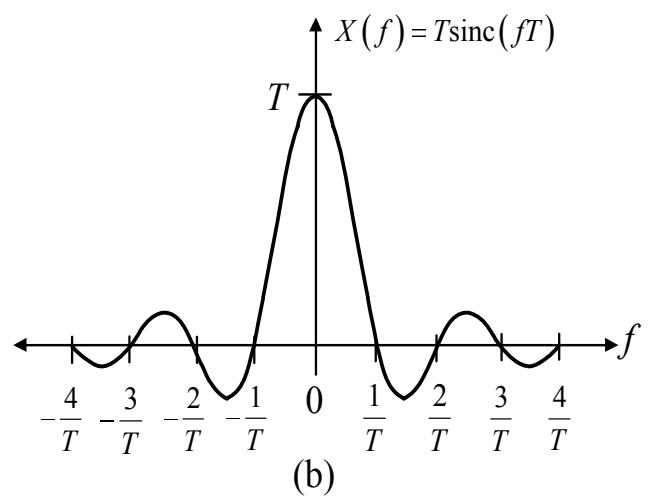
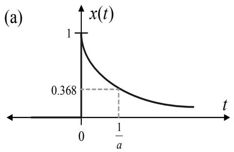
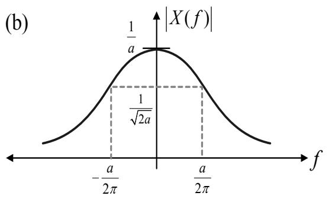
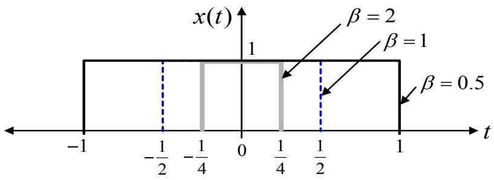
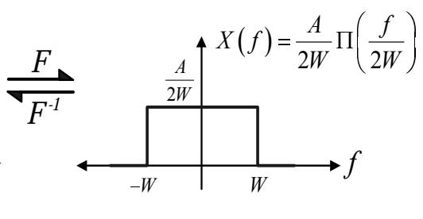
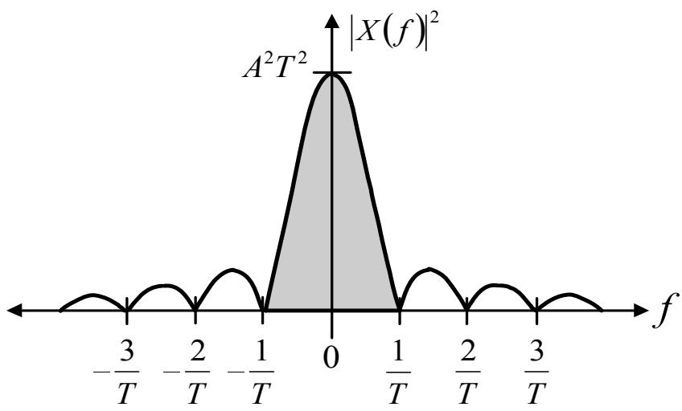
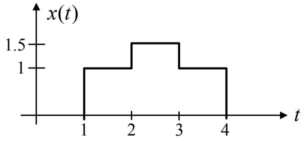
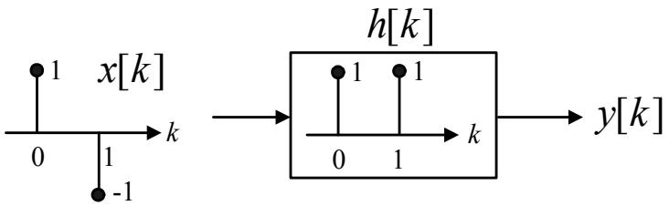
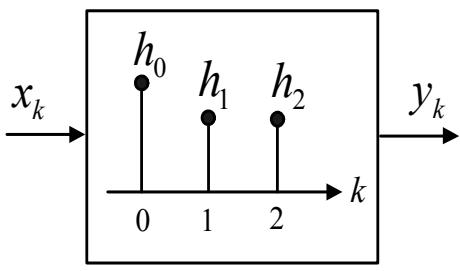
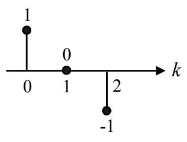

## 第 3 章

## 信号变换

在本章中，将介绍用于将时域（time domain）信号或时间函数转换为其他域信号的各种数学工具，包括频域（frequency domain）、Z 域和 D 域。将时域信号变换到这些域中可以简化信号和系统的分析。本章仅讲解分析硬盘驱动器信号处理系统所需的必要变换方法。有关每种变换方法的详细信息，可参考一般的信号处理教科书 [33, 35]。

## 3.1 傅里叶变换

傅里叶变换 [33, 34, 35]（Fourier transform）是一种数学工具，用于将时域信号转换为频域信号或频率函数，通常称为“频谱（spectrum）”。信号频谱对于设计各种通信系统设备非常有用，例如滤波器（filter）和均衡器（equalizer）等。在频域分析信号通常比在时域分析更容易。此外，频域信号还能提供信号的带宽（bandwidth）和频谱形状，从而有助于深入理解信号的特性。例如，不同类型的滤波器允许特定频段的信号通过，而对另一个频段的信号产生衰减（attenuation）。

傅里叶变换适用于非周期信号（aperiodic signal），而傅里叶级数（Fourier series）[33] 则适用于周期信号（periodic signal）。然而，在硬盘驱动器的信号处理系统中，最常见的信号形式是两种非周期信号：连续时间非周期信号（continuous-time aperiodic signal）和离散时间非周期信号（discrete-time aperiodic signal）。在本章中，将仅讨论适用于这两种信号的傅里叶变换，即连续时间傅里叶变换（continuous-time Fourier transform）和离散时间傅里叶变换（discrete-time Fourier transform）。

## 3.2 连续时间傅里叶变换

设 $x(t)$ 为连续时间非周期信号。信号 $x(t)$ 的连续时间傅里叶变换定义为：

$$
X(f) = \int_{-\infty}^{\infty} x(t) e^{-j 2 \pi f t} dt \tag{3.1}
$$

其中 $j = \sqrt{-1}$ 是虚数单位，$f$ 是频率，单位为赫兹（Hz: hertz）。同样地，如果想将频域信号 $X(f)$ 变换回时域信号 $x(t)$，可以使用连续时间傅里叶逆变换（continuous-time inverse Fourier transform），其定义为：

$$
x(t) = \int_{-\infty}^{\infty} X(f) e^{j 2 \pi f t} df \tag{3.2}
$$

为了方便描述连续时间傅里叶变换，使用以下符号：

$$
X(f) = \mathcal{F}[x(t)] \tag{3.3}
$$

以及

$$
x(t) = \mathcal{F}^{-1}[X(f)] \tag{3.4}
$$

其中 $\mathcal{F}[\cdot]$ 表示连续时间傅里叶变换符号，$\mathcal{F}^{-1}[\cdot]$ 表示连续时间傅里叶逆变换符号。此外，使用符号

$$
x(t) \Longleftrightarrow X(f) \tag{3.5}
$$

来表示 $x(t)$ 和 $X(f)$ 之间的傅里叶变换对（Fourier transform pair）关系。考察方程 (3.2) 可以发现，信号 $x(t)$ 可以表示为频率在 $(-\infty, \infty)$ 范围内的指数函数（exponential function）的连续叠加，其中每个频率分量 $f$ 的幅度由函数 $X(f)$ 决定。因此，傅里叶变换能够将信号 $x(t)$ 分解为覆盖所有频带的复指数分量的组合，而 $X(f)$ 的值则指示了每个频率分量 $f$ 的幅度。

此外，傅里叶变换结果 $X(f)$ 可以写成关于频率 $f$ 的复指数函数形式：

$$
X(f) = |X(f)| e^{j \angle X(f)} \tag{3.6}
$$

其中 $|X(f)|$ 是连续幅度谱（continuous amplitude spectrum），而

$$
\angle X(f) = \tan^{-1} \left( \frac{\mathrm{Im}[X(f)]}{\mathrm{Re}[X(f)]} \right) \tag{3.7}
$$

是信号 $x(t)$ 的连续相位谱（continuous phase spectrum）。其中 $\mathrm{Re}[\cdot]$ 表示取实部（real part），$\mathrm{Im}[\cdot]$ 表示取虚部（imaginary part）。由于硬盘驱动器信号处理系统中遇到的连续时间信号 $x(t)$ 通常是实值函数（real-valued function），因此存在以下关系：

$$
X(-f) = X^*(f) = |X(f)| e^{-j \angle X(f)} \tag{3.8}
$$

$$
|X(-f)| = |X(f)| \tag{3.9}
$$

$$
\angle X(-f) = -\angle X(f) \tag{3.10}
$$

其中 $X^*$ 是 $X$ 的共轭复数（complex conjugate）。由方程 (3.9) 和 (3.10) 可知， $|X(f)|$ 是偶函数（even function），而 $\angle X(f)$ 是奇函数（odd function）。此外，这两个函数共同被称为 $x(t)$ 的“傅里叶频谱（Fourier spectrum）”，它具有连续频谱（continuous spectrum）的特性，这与具有线谱（line spectrum）的傅里叶级数不同。

**示例 3.1** 使用傅里叶变换将图 3.1(a) 所示的矩形脉冲信号 $x(t)$ 转换为频域信号 $X(f)$。

**解：** 根据方程 (3.1)：

$$
\begin{array}{lll}
X(f) & = & \displaystyle \int_{-T/2}^{T/2} (1) e^{-j 2 \pi f t} dt \\
& = & \displaystyle \left. \frac{e^{-j 2 \pi f t}}{-j 2 \pi f} \right|_{t=-T/2}^{T/2} \\
& = & \displaystyle \frac{1}{j 2 \pi f} \left( e^{j 2 \pi f T/2} - e^{-j 2 \pi f T/2} \right) \\
& = & \displaystyle \frac{1}{\pi f} \sin(\pi f T) \\
& = & T \operatorname{sinc}(f T)
\end{array}
$$

其中 $\sin(\theta) = \frac{e^{j\theta} - e^{-j\theta}}{2j}$ 且 sinc 函数 $\operatorname{sinc}(\theta) = \frac{\sin(\pi \theta)}{\pi \theta}$。图 3.1(b) 展示了频域信号 $X(f)$ 的特性。

(a)

图 3.1: (a) 矩形脉冲信号 $x(t)$ 和 (b) sinc 信号 $X(f)$

在示例 3.1 中，如果时域中的矩形脉冲信号可以写成如下数学表达式：

$$
\Pi \left( \frac{t}{T} \right) = \begin{cases} 1, & -\frac{T}{2} \leq t \leq \frac{T}{2} \\ 0, & \text{else} \end{cases} \tag{3.11}
$$

那么该矩形脉冲信号的傅里叶变换结果为：

$$
X(f) = T \operatorname{sinc}(f T) \tag{3.12}
$$

因此，矩形脉冲信号的傅里叶变换对可以写为：

$$
\Pi \left( \frac{t}{T} \right) \Longleftrightarrow T \operatorname{sinc}(f T) \tag{3.13}
$$

如图 3.1 所示。考察方程 (3.13) 和图 3.1 可以发现，如果 $T$ 较小，脉冲信号 $x(t)$ 的宽度较窄，但信号 $X(f)$ 的宽度较大；反之，如果 $T$ 较大，脉冲信号 $x(t)$ 的宽度较宽，但 $X(f)$ 的宽度较窄。因此可以得出结论：

图 3.2: (a) 指数脉冲信号 $x(t)$，(b) $X(f)$ 的幅度谱，以及 (c) $X(f)$ 的相位谱

任何信号都不能既是时限信号（time-limited signal）又是带限信号（band-limited signal）。读者可以在 3.2.1 节中详细学习。

**示例 3.2** 求图 3.2(a) 所示指数脉冲（exponential pulse）信号 $x(t)$ 的傅里叶变换结果。

**解：** 根据图 3.2(a)，指数脉冲信号 $x(t)$ 可以写成如下数学表达式：

$$
x(t) = e^{-at} u(t), \quad a > 0
$$

其中 $u(t)$ 是单位阶跃函数，定义见方程 (2.18)。因此，$x(t)$ 的傅里叶变换结果为：

$$
\begin{array}{lll}
X(f) & = & \displaystyle \int_{0}^{\infty} e^{-at} e^{-j 2 \pi f t} dt \\
& = & \displaystyle \int_{0}^{\infty} e^{-(a + j 2 \pi f)t} dt \\
& = & \displaystyle \left\{ \frac{e^{-(a + j 2 \pi f)t}}{-(a + j 2 \pi f)} \right\} \Big|_{t=0}^{\infty} \\
& = & \displaystyle \frac{1}{a + j 2 \pi f}
\end{array}
$$

因此，指数脉冲信号的傅里叶变换对为：

$$
e^{-at} u(t) \Longleftrightarrow \frac{1}{a + j 2 \pi f} \tag{3.14}
$$

由于信号 $X(f)$ 为复数，因此通常将 $X(f)$ 的图形表示为幅度（magnitude）和相位（phase），计算方法如下：

$$
\begin{array}{rcl}
|X(f)| & = & \displaystyle \frac{1}{a^2 + (2 \pi f)^2} \\
\angle X(f) & = & -\tan^{-1} \left( \displaystyle \frac{2 \pi f}{a} \right)
\end{array}
$$

幅度谱 $|X(f)|$ 和相位谱 $\angle X(f)$ 分别如图 3.2(b) 和 3.2(c) 所示。通常幅度谱比相位谱更常被使用。在本书接下来的内容中，相位谱将在默认情况下被省略。

**注：** 只有当函数 $x(t)$ 满足以下狄利克雷条件（Dirichlet's conditions）时，才能求得其傅里叶变换 $X(f)$：

1) 在任何有限时间间隔内，$x(t)$ 必须是单值函数（single-valued function），且具有有限个极大值和极小值。
2) 在任何有限时间间隔内，$x(t)$ 的不连续点（discontinuities）数量必须有限。
3) $x(t)$ 必须是绝对可积的，即：

$$
\int_{-\infty}^{\infty} |x(t)| dt < \infty
$$

因此，任何满足这三个条件的时域函数都一定具有对应的傅里叶变换对。

## 3.2.1 傅里叶变换的有趣性质

本节将介绍傅里叶变换的一些有趣性质，以简化数字通信系统中的信号分析，具体如下：

1) 叠加性质（superposition）或线性性质（linearity）：

$$
\sum_{k} a_k x_k(t) \Longleftrightarrow \sum_{k} a_k X_k(f) \tag{3.15}
$$

该性质对于变换由多个已知变换对 $X_1(f), X_2(f), \dots, X_n(f)$ 的函数之和组成的函数 $x(t)$ 非常有用。

2) 时间尺度变换（time scaling）性质：

$$
x(\beta t) \Longleftrightarrow \frac{1}{|\beta|} X\left( \frac{f}{\beta} \right) \tag{3.16}
$$

其中 $\beta$ 为任意常数。该性质证实了任何信号不能同时是时限信号和带限信号。也就是说，如果 $\beta > 1$，函数 $x(\beta t)$ 是将信号 $x(t)$ 在时间轴上压缩 $\beta$ 倍，而 $X(f/\beta)$ 则是将信号 $X(f)$ 在频率轴上扩展 $\beta$ 倍。同理，如果 $0 < \beta < 1$，函数 $x(\beta t)$ 是将信号 $x(t)$ 在时间轴上扩展 $\beta$ 倍，而 $X(f/\beta)$ 则是将信号 $X(f)$ 在频率轴上压缩 $\beta$ 倍。

例如，根据方程 (3.13)，矩形脉冲 $\Pi(t)$ 的变换对为：

$$
\Pi(t) \longleftrightarrow \operatorname{sinc}(f)
$$

当 $T=1$ 时，如果定义 $x(t) = \Pi(\beta t)$，其中 $\beta$ 为任意常数，则 $x(t)$ 的傅里叶变换对为：

$$
\Pi(\beta t) \Longleftrightarrow \frac{1}{|\beta|} \operatorname{sinc}\left( \frac{f}{\beta} \right)
$$

图 3.3 展示了 $\beta$ 为 0.5, 1, 和 2 时的信号 $x(t)$ 及其幅度谱 $|X(f)|$，可见结果符合上述时间尺度变换性质。对于 $\beta = -1$ 的情况（即信号翻转），其傅里叶变换对为：

$$
x(-t) \Longleftrightarrow X(-f) \tag{3.17}
$$

也就是说，如果 $x(t)$ 的傅里叶变换为 $X(f)$，那么 $x(-t)$ 的傅里叶变换则为 $X(-f)$。

3) 对偶性（duality）性质：

如果定义 $x(t) \Longleftrightarrow X(f)$，则有：

$$
X(t) \Longleftrightarrow x(f) \tag{3.18}
$$

例如，根据方程 (3.13)，矩形脉冲信号可写为：

$$
\frac{A}{2W} \Pi \left( \frac{t}{2W} \right) \Longleftrightarrow A \operatorname{sinc}(2 W f) \tag{3.19}
$$

图 3.3: 矩形脉冲信号 $x(t) = \Pi(\beta t)$ 及其幅度谱 $|X(f)|$

其中 $A$ 和 $W$ 为实常数，如图 3.4 所示。因此，如果定义 $x(t) = A \operatorname{sinc}(2Wt)$，则 $x(t)$ 的傅里叶变换结果为：

$$
X(f) = \frac{A}{2W} \Pi \left( \frac{f}{2W} \right)
$$

如图 3.4 所示。

4) 时移（time shifting）性质：

$$
x(t - t_d) \Longleftrightarrow X(f) e^{-j 2 \pi f t_d} \tag{3.20}
$$

其中 $t_d$ 为实常数。时移性质表明，当将信号 $x(t)$ 在时间轴上平移 $t_d$ 个单位时，频域信号 $X(f)$ 会乘以一个复指数函数 $e^{-j 2 \pi f t_d}$。这意味着 $X(f)$ 的幅度保持不变，但其相位随频率线性变化，变化量为 $2 \pi f t_d$。

图 3.4: 根据对偶性得到的矩形脉冲变换对

5) 频移（frequency shifting）性质：

$$
e^{j 2 \pi f_c t} x(t) \Longleftrightarrow X(f - f_c) \tag{3.21}
$$

其中 $f_c$ 为实常数。频移性质表明，当信号 $x(t)$ 乘以复指数函数 $e^{j 2 \pi f_c t}$ 时，其频谱 $X(f)$ 会沿频率轴平移 $f_c$ 赫兹。因此，频移性质常用于通信系统中的调制（modulation）。可以注意到，方程 (3.20) 中的时移性质与方程 (3.21) 中的频移性质之间存在对偶关系。

6) 时域卷积（convolution in time）性质：

设 $x(t) \Longleftrightarrow X(f)$ 且 $h(t) \Longleftrightarrow H(f)$，则有：

$$
x(t) * h(t) \Longleftrightarrow X(f) H(f) \tag{3.22}
$$

其中 $*$ 为卷积运算符。也就是说，时域卷积等效于频域相乘。证明如下：

**证明：** 设 $y(t) = x(t) * h(t)$，则

$$
y(t) = x(t) * h(t) = \int_{-\infty}^{\infty} x(t - \tau) h(\tau) d\tau
$$

因此，$y(t)$ 的傅里叶变换为：

$$
\begin{array}{rcl}
\mathcal{F}[y(t)] & = & \displaystyle \int_{-\infty}^{\infty} y(t) e^{-j 2 \pi f t} dt \\
& = & \displaystyle \int_{-\infty}^{\infty} \left[ \int_{-\infty}^{\infty} x(t - \tau) h(\tau) d\tau \right] e^{-j 2 \pi f t} dt \\
& = & \displaystyle \int_{-\infty}^{\infty} x(t - \tau) e^{-j 2 \pi f (t - \tau)} dt \left[ \int_{-\infty}^{\infty} h(\tau) e^{-j 2 \pi f \tau} d\tau \right] \\
& = & \displaystyle X(f) \left[ \int_{-\infty}^{\infty} h(\tau) e^{-j 2 \pi f \tau} d\tau \right] \\
& = & \displaystyle X(f) H(f)
\end{array}
$$

由此可得 $x(t) * h(t) \Longleftrightarrow X(f) H(f)$，证毕。

7) 时域相乘（multiplication in time）性质：

设 $x(t) \Longleftrightarrow X(f)$ 且 $h(t) \Longleftrightarrow H(f)$，则有：

$$
x(t) h(t) \Longleftrightarrow X(f) * H(f) \tag{3.23}
$$

也就是说，时域相乘等效于频域卷积。可以注意到，时域卷积性质与时域相乘性质之间存在对偶关系。

8) 信号 $x(t)$ 曲线下方总面积：

$$
\int_{-\infty}^{\infty} x(t) dt = X(0) \tag{3.24}
$$

这意味着信号 $x(t)$ 的总面积等于其傅里叶变换 $X(f)$ 在频率 $f=0$ 处的值。通常，$X(0)$ 表示信号 $x(t)$ 中包含的直流分量（d.c. component）的大小。

9) 同样地：

$$
\int_{-\infty}^{\infty} X(f) df = x(0) \tag{3.25}
$$

这意味着信号 $X(f)$ 的总面积等于信号 $x(t)$ 在 $t=0$ 时刻的值。

10) 时间微分（time differentiation）：

假设 $x(t)$ 的微分的傅里叶变换存在且可求，则：

$$
\frac{d^n}{dt^n} x(t) \Longleftrightarrow (j 2 \pi f)^n X(f) \tag{3.26}
$$

其中 $\frac{d^n}{dt^n} x(t)$ 是信号 $x(t)$ 的 $n$ 阶导数。由方程 (3.26) 可知，时间微分会导致信号的高频分量被放大（值增加），这符合微分会导致信号变化更剧烈的物理事实。

11) 时间积分（time integration）性质：

$$
\int_{-\infty}^{t} x(\tau) d\tau \Longleftrightarrow \frac{1}{j 2 \pi f} X(f) + \frac{1}{2} X(0) \delta(f) \tag{3.27}
$$

其中方程 (3.27) 右侧的第二项表示由于积分产生的直流分量或平均值。此外，方程 (3.27) 表明时间积分会导致信号的高频分量被衰减，这符合积分能使信号波动减小的物理事实。

12) 共轭函数（conjugate function）：

若 $x(t)$ 为复值函数，则：

$$
x^*(t) \longleftrightarrow X^*(-f) \tag{3.28}
$$

其中 $(\cdot)^*$ 为共轭复数运算符。

13) 帕塞瓦尔关系（Parseval's relation）：

$$
\int_{-\infty}^{\infty} |x(t)|^2 dt = \int_{-\infty}^{\infty} |X(f)|^2 df \tag{3.29}
$$

其中 $|x(t)|^2 = x(t) x^*(t)$ 被称为随时间变化的“能量强度（energy intensity）”，而 $|X(f)|^2 = X(f) X^*(f)$ 被称为“能量谱密度（energy spectral density）”，单位为焦耳/赫兹（joules per hertz）。

## 3.2.2 瑞利能量定理

在 2.1.4 节中，已通过方程 (2.12) 展示了在时域计算信号能量的方法：

$$
E = \int_{-\infty}^{\infty} |x(t)|^2 dt \tag{3.30}
$$

此外，还可以利用“瑞利能量定理（Rayleigh's Energy Theorem）”在频域计算信号能量：

$$
E = \int_{-\infty}^{\infty} |X(f)|^2 df \tag{3.31}
$$

由于信号能量可通过方程 (3.30) 和 (3.31) 计算，因此瑞利能量定理与方程 (3.29) 的帕塞瓦尔关系一致。

例如，设 $x(t) \Longleftrightarrow X(f)$ 且 $X(f) = AT \operatorname{sinc}(fT)$，则能量谱密度 $|X(f)|^2$ 如图 3.5 所示。假设需要计算信号在频率范围 $( -1/T, 1/T )$ 内的能量，计算如下：

图 3.5: 信号 $X(f) = AT \operatorname{sinc}(fT)$ 的能量谱密度 $|X(f)|^2$

$$
\begin{array}{lll}
E & = & \displaystyle \int_{-1/T}^{1/T} |X(f)|^2 df \\
& = & \displaystyle \int_{-1/T}^{1/T} A^2 T^2 \operatorname{sinc}^2(fT) df \\
& \approx & 0.92 A^2 T
\end{array}
$$

这意味着约 92% 的信号能量集中在 $( -1/T, 1/T )$ 赫兹的频带内。因此，如果信号 $X(f)$ 在送入采样器（sampler）之前通过一个低通滤波器（lowpass filter），这些能量信息可用于设计低通滤波器的截止频率（cut-off frequency）。例如，如果规定只要通过低通滤波器的信号能量不低于总能量的 90%，系统即可高效运行，那么低通滤波器可以使用 $f = 1/T$ 作为截止频率，而无需使用 $f > 1/T$。这是因为较低的截止频率有助于减少通过低通滤波器进入系统的噪声（noise）。

 
图 3.6: 信号 $x(t) = e^{-a|t|}$

## 3.2.3 连续时间傅里叶变换的计算示例

本节将介绍一些信号分析的计算示例，利用 3.2.1 节中提到的各种傅里叶变换性质，具体如下：

**示例 3.3** 求双边指数信号的傅里叶变换：
$$
x(t) = e^{-a|t|}, \quad a > 0
$$
其中 $a$ 为实常数。

**解：** 给定信号 $x(t)$ 可以改写为：
$$
x(t) = e^{-a|t|} = \begin{cases} e^{-at}, & t > 0 \\ 1, & t = 0 \\ e^{at}, & t < 0 \end{cases}
$$
如图 3.6 所示。$x(t)$ 的傅里叶变换可以通过方程 (3.14) 并利用方程 (3.15) 的叠加性质求得：
$$
\begin{array}{lll}
X(f) & = & \displaystyle \frac{1}{a + j 2 \pi f} + \frac{1}{a - j 2 \pi f} \\
& = & \displaystyle \frac{(a - j 2 \pi f) + (a + j 2 \pi f)}{(a - j 2 \pi f)(a + j 2 \pi f)} \\
& = & \displaystyle \frac{2a}{a^2 + (2 \pi f)^2}
\end{array}
$$
因此，双边指数信号的傅里叶变换对为：
$$
e^{-a|t|} \Longleftrightarrow \frac{2a}{a^2 + (2 \pi f)^2}
$$

**示例 3.4** 求以下信号的傅里叶变换：
$$
x(t) = A \Pi \left( \frac{t - \frac{T}{2}}{T} \right)
$$
其中 $T$ 为实常数。

**解：** 根据方程 (3.13)，已知 $A \Pi \left( \frac{t}{T} \right) \Longleftrightarrow AT \operatorname{sinc}(f T)$。由于题目给定的信号 $x(t)$ 是将矩形脉冲信号延迟了 $T/2$ 秒，因此可以利用方程 (3.20) 的时移性质求得：
$$
X(f) = AT \operatorname{sinc}(f T) e^{-j \pi f T}
$$
如图 3.7 所示。或者也可以直接通过积分求得：
$$
\begin{array}{rl}
X(f) & = \displaystyle \int_{0}^{T} A e^{-j 2 \pi f t} dt \\
& = A \left\{ \frac{e^{-j 2 \pi f t}}{-j 2 \pi f} \right\} \Big|_{t=0}^{T} \\
& = -\frac{A}{j 2 \pi f} \left( e^{-j 2 \pi f T} - 1 \right) \\
& = \frac{A}{j 2 \pi f} e^{-j \pi f T} \left( e^{j \pi f T} - e^{-j \pi f T} \right) \\
& = \frac{A}{\pi f} e^{-j \pi f T} \sin(\pi f T) \\
& = AT e^{-j \pi f T} \operatorname{sinc}(f T)
\end{array}
$$
图 3.7 展示了延迟 $T/2$ 单位的矩形脉冲信号的傅里叶变换对。可以看到，信号 $x(t)$ 的幅度谱 $|X(f)| = AT |\operatorname{sinc}(f T)|$ 保持不变（因为 $|e^{j\theta}| = 1$），但相位谱发生了变化（此处省略）。

**示例 3.5** 求图 3.8 所示矩形脉冲信号 $x(t)$ 的傅里叶变换。

图 3.8：矩形脉冲信号 $x(t)$ 由信号 $x_1(t)$ 和 $x_2(t)$ 组成。

**解**：由图 3.8 可知，信号 $x(t)$ 可以写成信号 $x_1(t)$ 和 $x_2(t)$ 之和的形式：
$$x(t) = \frac{1}{2} x_1(t - 2.5) + x_2(t - 2.5)$$
由于矩形脉冲信号的傅里叶变换对如式 (3.13) 所示：
$$\Pi(t/T) \Longleftrightarrow T \operatorname{sinc}(f T)$$
因此，信号 $x_1(t)$ 和 $x_2(t)$ 的傅里叶变换分别为：
$$\begin{array}{rcl} \mathcal{F}[x_1(t)] & = & \operatorname{sinc}(f) \\ & & \\ \mathcal{F}[x_2(t)] & = & 3 \operatorname{sinc}(3f) \end{array}$$
利用式 (3.15) 的叠加特性和式 (3.20) 的时移特性：
 (a)

图 3.9：(a) 双极性脉冲信号 (doublet signal) 和 (b) 频谱。

由此可得信号 $x(t)$ 的傅里叶变换为：
$$\begin{array}{lll} X(f) & = & \displaystyle \frac{1}{2} \operatorname{sinc}(f) e^{-j 2 \pi f (2.5)} + 3 \operatorname{sinc}(3f) e^{-j 2 \pi f (2.5)} \\ & = & \displaystyle e^{-j 5 \pi f} \left\{ \frac{\operatorname{sinc}(f) + 6 \operatorname{sinc}(3f)}{2} \right\} \end{array}$$
证毕。

**示例 3.6** 求图 3.9(a) 所示双极性脉冲信号 (doublet signal) 的傅里叶变换。

**解**：由图 3.9(a) 可知，双极性脉冲信号 $x(t)$ 由两个矩形脉冲信号组成，即：
$$x(t) = A \Pi \left( \frac{t + \frac{T}{2}}{T} \right) - A \Pi \left( \frac{t - \frac{T}{2}}{T} \right)$$
分别求每个信号的傅里叶变换，并利用式 (3.15) 的叠加特性：

图 3.10：(a) 三角脉冲信号 和 (b) 幅度谱。

信号 $x(t)$ 的傅里叶变换为：
$$\begin{array}{lll} X(f) & = & A T \operatorname{sinc}(f T) e^{j \pi f T} - A T \operatorname{sinc}(f T) e^{-j \pi f T} \\ & = & A T \operatorname{sinc}(f T) \{ e^{j \pi f T} - e^{-j \pi f T} \} \\ & = & 2 j A T \operatorname{sinc}(f T) \sin(\pi f T) \end{array}$$
其中 $j = \sqrt{-1}$ 为虚数单位，信号 $j X(f)$ 的形状如图 3.9(b) 所示。

**示例 3.7** 求图 3.10(a) 所示三角脉冲信号的傅里叶变换，其数学表达式为：
$$\Lambda \left( \frac{t}{T} \right) = \begin{cases} 1 - \frac{|t|}{T}, & |t| < T \\ 0, & |t| \ge T \end{cases}$$

**解**：由于图 3.10(a) 中的三角脉冲信号是对图 3.9(a) 中双极性信号进行积分的结果，因此可以通过时域积分特性（式 3.27）来求三角脉冲信号的傅里叶变换：
$$\begin{array}{rcl} X(f) & = & \displaystyle \frac{1}{j 2 \pi f} \{ 2 j A T \operatorname{sinc}(f T) \sin(\pi f T) \} \\ & = & \displaystyle A T \frac{\sin(\pi f T)}{\pi f} \operatorname{sinc}(f T) \\ & = & \displaystyle A T^2 \operatorname{sinc}^2(f T) \end{array}$$
其幅度谱 $|X(f)|$ 如图 3.10(b) 所示。因此，三角脉冲信号的傅里叶变换对为：
$$\Lambda \left( \frac{t}{T} \right) \Longleftrightarrow T \operatorname{sinc}^2(f T)$$

## 3.2.4 周期信号的傅里叶变换

周期信号可以用复指数函数的级数形式来表示，这些函数是频率的函数，这种数学工具被称为“傅里叶级数 (Fourier series)” [33, 34]。然而，通过引入狄拉克 $\delta$ 函数，傅里叶变换同样可以应用于周期信号，具体说明如下：

设周期信号 $x_p(t)$ 的周期为 $T_0$，根据傅里叶级数公式可得：
$$x_p(t) = \sum_{n=-\infty}^{\infty} c_n e^{j 2 \pi n f_0 t} \tag{3.32}$$
其中 $n$ 为整数，$f_0 = 1/T_0$ 为基频 (fundamental frequency)，$c_n$ 为复傅里叶系数 (complex Fourier coefficient)，其计算公式为：
$$c_n = \frac{1}{T_0} \int_{-T_0/2}^{T_0/2} x_p(t) e^{-j 2 \pi n f_0 t} dt \tag{3.33}$$
其中 $f_0 = 1/T_0$ 是基频。

若定义 $x(t)$ 为一个连续时间非周期信号 (aperiodic continuous-time signal)，它仅在区间 $(-T_0/2 \le t \le T_0/2)$ 内有值，其余部分为零。设 $x(t)$ 的傅里叶变换对为 $x(t) \Longleftrightarrow X(f)$，则周期信号 $x_p(t)$ 可以通过对非周期信号 $x(t)$ 进行周期性延拓来构建，其关系如下：
$$x_p(t) = \sum_{m=-\infty}^{\infty} x(t - m T_0) \tag{3.34}$$
其中 $m$ 为整数。在这种函数表示法中，$x(t)$ 被称为“生成函数 (generating function)”。

通常，非周期信号 $x(t)$ 也可以被视为一种周期信号，其周期 $T_0 \to \infty$。因此，式 (3.33) 中的复傅里叶系数可以重新写为：
$$\begin{array}{lll} c_n & = & f_0 \displaystyle \int_{-\infty}^{\infty} x(t) e^{-j 2 \pi n f_0 t} dt \\ & = & f_0 X(n f_0) \end{array} \tag{3.35}$$
其中 $X(n f_0)$ 是 $x(t)$ 在频率 $n f_0$ 处的傅里叶变换结果。将式 (3.35) 的 $c_n$ 代入式 (3.32)，可得周期信号的表达式为：
$$x_p(t) = f_0 \sum_{n=-\infty}^{\infty} X(n f_0) e^{j 2 \pi n f_0 t} \tag{3.36}$$
结合式 (3.34) 和 (3.36)，可得：
$$\sum_{m=-\infty}^{\infty} x(t - m T_0) = f_0 \sum_{n=-\infty}^{\infty} X(n f_0) e^{j 2 \pi n f_0 t} \tag{3.37}$$
由于 $e^{j 2 \pi n f_0 t} \Longleftrightarrow \delta(f - n f_0)$，因此式 (3.37) 的傅里叶变换为：
$$\sum_{m=-\infty}^{\infty} x(t - m T_0) \Longleftrightarrow f_0 \sum_{n=-\infty}^{\infty} X(n f_0) \delta(f - n f_0) \tag{3.38}$$
该关系表明，周期信号的傅里叶变换由一系列出现在 $n f_0$ 频率处的狄拉克 $\delta$ 函数组成（$n$ 为整数），且每个 $\delta$ 函数的权重为 $X(n f_0)$。式 (3.38) 中的傅里叶变换对对于采样定理 (sampling theorem) 至关重要，将在第 5.5 节详细讨论。

**示例 3.8** 求理想采样函数 (ideal sampling function) 的傅里叶变换。该函数由一系列等间距的狄拉克 $\delta$ 信号组成，如图 3.11(a) 所示。

**解**：由图 3.11(a) 可知，理想采样函数可以写成如下数学表达式：
$$x(t) = \sum_{m=-\infty}^{\infty} \delta(t - m T_s)$$
其中 $T_s$ 为采样周期 (sampling period)。由于狄拉克 $\delta$ 函数的傅里叶变换对为 $\delta(t) \Longleftrightarrow 1$，因此 $x(t)$ 的傅里叶变换为：
$$X(f) = \frac{1}{T_s} \sum_{n=-\infty}^{\infty} \delta \left( f - \frac{n}{T_s} \right)$$
即：
$$\sum_{m=-\infty}^{\infty} \delta(t - m T_s) \Longleftrightarrow \frac{1}{T_s} \sum_{n=-\infty}^{\infty} \delta \left( f - \frac{n}{T_s} \right) \tag{3.39}$$
式 (3.s9) 表明，间距为 $T_s$ 秒的狄拉克 $\delta$ 脉冲串的傅里叶变换结果同样是一个 $\delta$ 函数串，其权重因子为 $1/T_s$，且每个 $\delta$ 函数之间的间距为 $1/T_s$ 赫兹。

**示例 3.9** 求周期矩形脉冲串 (periodic rectangular pulse train function) 的傅里叶变换，如图 3.12(a) 所示。

**解**：由图 3.12(a) 可知，信号 $x(t)$ 可以写成如下数学表达式：
$$x(t) = \sum_{m=-\infty}^{\infty} g(t - m T_0)$$
其中生成函数 $g(t) = \Pi(t/T)$ 是矩形脉冲信号，其傅里叶变换为：
$$G(f) = T \operatorname{sinc}(f T)$$
根据式 (3.38)，信号 $x(t)$ 的傅里叶变换为：
$$X(f) = f_0 \sum_{n=-\infty}^{\infty} T \operatorname{sinc}(n f_0 T) \delta(f - n f_0) \tag{3.40}$$
其中 $f_0 = 1/T_0$ 是基频，其频谱 $X(f)$ 如图 3.12(b) 所示。因此，周期矩形脉冲串的傅里叶变换对为：
$$\sum_{m=-\infty}^{\infty} \Pi \left( \frac{t - m T_0}{T} \right) \Longleftrightarrow f_0 \sum_{n=-\infty}^{\infty} T \operatorname{sinc}(n f_0 T) \delta(f - n f_0) \tag{3.41}$$

## 3.2.5 常用的傅里叶变换对

本节汇总了一些常用的傅里叶变换对，这些变换对将简化硬盘驱动器信号处理系统的分析工作，具体如表 3.1 所示。

## 3.3 离散时间傅里叶变换

设 $ 或 $ 为离散时间非周期信号。信号 $ 的离散时间傅里叶变换定义为：

1278
X(e^{j\omega}) = \sum_{k=-\infty}^{\infty} x[k] e^{-j\omega k} \tag{3.42}
1278

### 表 3.3 傅里叶变换常用对

<table><tr><td> (t)$ </td><td> (f)$ </td></tr><tr><td> $\delta(t)$ </td><td>1</td></tr><tr><td>1</td><td> $\delta(f)$ </td></tr><tr><td> $\delta(t - t_d)$ </td><td> ^{-j 2 \pi f t_d}$ </td></tr><tr><td>u(t)</td><td> $\displaystyle \frac{1}{j 2 \pi f} + \frac{1}{2} \delta(f)$ </td></tr><tr><td> ^{-j 2 \pi f_c t}$ </td><td> $\delta(f - f_c)$ </td></tr><tr><td> $\Pi \left( \frac{t}{T} \right)$ </td><td>  \operatorname{sinc}(f T)$ </td></tr><tr><td> $\operatorname{sinc}(2 W t)$ </td><td> $\frac{1}{2 W} \Pi \left( \frac{f}{2 W} \right)$ </td></tr><tr><td> $\Lambda \left( \frac{t}{T} \right)$ </td><td>  \operatorname{sinc}^2(f T)$ </td></tr><tr><td> ^{-at} u(t), a > 0$ </td><td></td></tr><tr><td> ^{at} u(-t), a > 0$ </td><td> $\frac{1}{a + j 2 \pi f}$ </td></tr><tr><td>  e^{-at} u(t), a > 0$ </td><td> $\frac{1}{a - j 2 \pi f}$ </td></tr><tr><td>  e^{-a|t|}, a > 0$ </td><td> $\frac{1}{(a + j 2 \pi f)^2}$ </td></tr><tr><td> ^{-\pi t^2}$ </td><td> $\frac{2 a}{a^2 + (2 \pi f)^2} e^{-\pi f^2}$ </td></tr><tr><td></td><td></td></tr><tr><td>|t|</td><td> $\frac{2}{(j 2 \pi f)^2}$ </td></tr><tr><td> $\cos(2 \pi f_c t)$ </td><td> $\frac{1}{2} \{ \delta(f - f_c) + \delta(f + f_c) \}$ </td></tr><tr><td> $\sin(2 \pi f_c t)$ </td><td> $\frac{1}{2 j} \{ \delta(f - f_c) - \delta(f + f_c) \}$ </td></tr><tr><td> $\sum_{m=-\infty}^{\infty} \delta(t - m T_0)$ </td><td> $\frac{1}{T_0} \sum_{n=-\infty}^{\infty} \delta(f - \frac{n}{T_0})$ </td></tr></table>

其中 $\omega = 2\pi f$ 为角频率（angular frequency），单位为弧度/秒（radian per second）。由方程 (3.42) 得到的信号 (e^{j\omega})$ 是一个周期信号，其周期为 \pi$ 弧度。同样地，如果需要将频域信号 (e^{j\omega})$ 变换回时域信号 $，可以使用离散时间傅里叶逆变换（discrete-time inverse Fourier transform），其定义为：

1278
x[k] = \frac{1}{2\pi} \int_{-\pi}^{\pi} X(e^{j\omega}) e^{j\omega k} d\omega \tag{3.43}
1278

为了方便描述离散时间傅里叶变换，使用以下符号：

1278
X(e^{j\omega}) = \mathcal{F}[x[k]] \tag{3.44}
1278

表示离散时间傅里叶变换的结果，以及

1278
x[k] = \mathcal{F}^{-1}[X(e^{j\omega})] \tag{3.45}
1278

表示离散时间傅里叶逆变换的结果。此外，使用符号

1278
x[k] \longleftrightarrow X(e^{j\omega}) \tag{3.46}
1278

来表示 $ 和 (e^{j\omega})$ 之间的傅里叶变换对关系。

图 3.13: 信道 (D) = 1 - D^2$ 的幅度谱

**示例 3.10** 求信道 (D) = 1 - D^2$ ( = 1, h_1 = 0, h_2 = -1$) 的频域信号。

**解：** 根据方程 (3.42) 可得：

1278
\begin{array}{lll}
H(e^{j\omega}) & = & \displaystyle \sum_{k=0}^{2} h_k e^{-j\omega k} \
& = & h_0 e^0 + h_1 e^{-j\omega} + h_2 e^{-j2\omega} \
& = & 1 + 0 + (-1) e^{-j2\omega} \
& = & 1 - e^{-j2\omega}
\end{array}
1278

或者也可以直接从 (D) = 1 - D^2$ 通过代入  = e^{-j\omega}$（详见 3.4.2 节）来求得 (e^{j\omega})$。图 3.13 展示了信道 (D)$ 的幅度谱，可见 (e^{j\omega})$ 是一个周期信号，其频率周期为  = 1$ 赫兹。

图 3.14: 离散时间 LTI 系统示例

**示例 3.11** 图 3.14 展示了一个离散时间线性时不变（LTI）系统。求 , h[k]$ 和 $ 的频域信号，并证明 (e^{j\omega}) = X(e^{j\omega}) H(e^{j\omega})$。

**解：** 根据给定的 LTI 系统，输出信号可通过  = x[k] * h[k]$ 求得，结果为 $\{y_0 = 1, y_1 = 0, y_2 = -1\}$。因此，, h[k]$ 和 $ 的频域信号如下：

1278
\begin{array}{rcl}
X(e^{j\omega}) & = & \displaystyle \sum_{k=0}^{1} x_k e^{-j\omega k} = (1) e^{-j\omega(0)} + (-1) e^{-j\omega(1)} \
& & = 1 - e^{-j\omega} \
H(e^{j\omega}) & = & \displaystyle \sum_{k=0}^{1} h_k e^{-j\omega k} = (1) e^{-j\omega(0)} + (1) e^{-j\omega(1)} \
& & = 1 + e^{-j\omega} \
Y(e^{j\omega}) & = & \displaystyle \sum_{k=0}^{2} y_k e^{-j\omega k} = (1) e^{-j\omega(0)} + (0) e^{-j\omega(1)} + (-1) e^{-j\omega(2)} \
& & = 1 - e^{-j2\omega}
\end{array}
1278

由于  - e^{-j 2 \omega} = (1 - e^{-j\omega})(1 + e^{-j\omega})$，因此可得 (e^{j\omega}) = X(e^{j\omega}) H(e^{j\omega})$。$|X(e^{j\omega})|, |H(e^{j\omega})|$ 和 $|Y(e^{j\omega})|$ 的幅度谱如图 3.15 所示。从图中可以看出，将 (e^{j\omega})$ 的曲线与 (e^{j\omega})$ 的曲线相乘，结果恰好等于 (e^{j\omega})$ 的曲线。

图 3.15: 图 3.14 中 LTI 系统中各信号的频谱

离散时间傅里叶变换的性质与 3.2.1 节中讨论的连续时间傅里叶变换的性质相同，只需将变量替换为适用于离散信号的形式即可。在硬盘驱动器信号处理系统的分析中，傅里叶变换（尤其是离散时间傅里叶变换）在设计各种系统组件时起着至关重要的作用。因此，读者在进入后续章节之前，应充分理解本章关于傅里叶变换的内容。

## 3.4 Z 变换与 D 变换

Z 变换 (Z transform) 和 D 变换 (D transform) 是用于将离散时间信号 (discrete-time signal) 转换为 Z 域和 D 域信号的数学工具，分别有助于简化信号分析。与傅里叶变换类似，它们可用于分析信号的频谱和带宽等。通常，Z 变换在数字信号处理相关领域应用广泛，而 D 变换在数字通信系统中更为常见。

## 3.4.1 Z 变换

若定义 $h[k]$ 为离散时间系统的冲激响应，则 $h[k]$ 的 Z 变换定义为 [33]：

$$
H(z) = \sum_{k=-\infty}^{\infty} h[k] z^{-k} \tag{3.47}
$$

其中 $z$ 是复变量 (complex variable)，$z^{-k}$ 是 $k$ 个单位的延迟算子。此外，为了方便描述，使用以下符号表示 Z 变换对：

$$
h[k] \Longleftrightarrow H(z) \tag{3.48}
$$

由于本书中较少使用逆 Z 变换 (inverse Z transform)，此处不再详细展开，感兴趣的读者可参考 [33]。

Z 变换的结果可以通过代入变量 $z = e^{j\omega}$ 转换为离散时间傅里叶变换的形式，即：

$$
H(e^{j\omega}) = \left. H(z) \right|_{z=e^{j\omega}} = \sum_{k=-\infty}^{\infty} h[k] e^{-j\omega k} \tag{3.49}
$$

## 3.4.2 D 变换

与 Z 变换类似，若定义 $h[k]$ 为离散时间系统的冲激响应，则 $h[k]$ 的 D 变换定义为：

$$
H(D) = \sum_{k=-\infty}^{\infty} h[k] D^{k} \tag{3.50}
$$

其中 $D$ 是单位延迟算子 (unit delay operator)。为了方便描述，使用以下符号表示 D 变换对：

$$
h[k] \Longleftrightarrow H(D) \tag{3.51}
$$

由方程 (3.47) 和 (3.50) 可见，D 变换的结果可以直接通过 Z 变换在 $z^{-1} = D$ 时地代入获得。由于符号 D 源自“延迟 (delay)”一词，因此 D 变换在数字通信系统中非常常用，因为它能更简单地描述信道模型 (channel model) 和分析数字通信系统，特别是在纠错编码 (error-correction coding) 方面。

同样地，D 变换结果可以通过代入变量 $D = e^{-j\omega}$ 转换为离散时间傅里叶变换的形式，即：

$$
H(e^{j\omega}) = \left. H(D) \right|_{D=e^{-j\omega}} = \sum_{k=-\infty}^{\infty} h[k] e^{-j\omega k} \tag{3.52}
$$

注：Z 变换和 D 变换在意义上等同于离散时间傅里叶变换，只是使用了不同的变量，具体取决于所应用的工程场景及其适用性。

**示例 3.12** 考虑图 3.16 所示的 LTI 系统。其中 $a_k$ 为输入比特数据，$h_k$ 为信道的冲激响应，$n_k$ 为噪声信号，$f_k$ 为均衡器的冲激响应，$z_k$ 为输出比特数据。若给定 $f_k = 1 / h_k$，求输出数据 $z_k$ 的 D 变换。

图 3.16: 离散时间 LTI 系统

对于所有 $k$ 值：

**解：** 根据图 3.16，均衡器的输出信号为：

$$
z_k = y_k * f_k
$$

由于

$$
y_k = a_k * h_k + n_k
$$

因此可得：

$$
z_k = \{ a_k * h_k + n_k \} * f_k
$$

随后使用 D 变换将上述方程转换为 D 域，得到：

$$
\begin{array}{lcl}
Z(D) & = & \{ A(D) H(D) + N(D) \} F(D) \\
& = & A(D) H(D) F(D) + N(D) F(D)
\end{array}
$$

其中 $z_k \Longleftrightarrow Z(D), a_k \Longleftrightarrow A(D), h_k \Longleftrightarrow H(D), f_k \Longleftrightarrow F(D)$，且 $n_k \Longleftrightarrow N(D)$。因此，当给定 $F(D) = 1 / H(D)$ 时，D 域中的输出数据 $z_k$ 等于：

$$
Z(D) = A(D) + \frac{N(D)}{H(D)}
$$

在实际应用中，这种类型的均衡器通常被称为“零强迫均衡器 (zero-forcing equalizer)”，其详细内容将在 5.6 节中讨论。

(a)

(b)
图 3.17: (a) 系统的冲激响应 和 (b) 信号传输的框图

## 3.5 输入信号与输出信号的关系

LTI 系统的一个重要特性是，其输出信号等于输入信号与系统冲激响应的卷积。考虑图 3.17(a) 所示的系统冲激响应，即系统在 $k=0$ 时刻的冲激响应为 $h_0$，在 $k=1$ 时刻为 $h_1$，在 $k=2$ 时刻为 $h_2$。通常，该系统的冲激响应可以用如下数学表达式表示：

$$
h_k = h_0 \delta[k] + h_1 \delta[k-1] + h_2 \delta[k-2]
$$

其中 $\delta[k]$ 是克罗内克 $\delta$ 函数（见 2.3.2 节）。同样地，该系统在 Z 域和 D 域中的冲激响应分别为：

$$
\begin{array}{rcl}
H(z) & = & h_0 + h_1 z^{-1} + h_2 z^{-2} \\
H(D) & = & h_0 + h_1 D + h_2 D^2
\end{array}
$$

可见，离散时间信号可以很容易地转换为其他域的信号，从而简化信号分析。

此外，系统的冲激响应还可以表示为信号传输的框图（block diagram），如图 3.17(b) 所示。其中 D 模块充当移位寄存器 (shift register) 或单位延迟算子。因此，当输入信号 $x_k$ 通过 D 模块时，结果为 $x_{k-1}$；当 $x_{k-1}$ 再次通过 D 模块时，结果为 $x_{k-2}$。因此，根据图 3.17(b)，输出信号 $y_k$ 可以写成关于输入信号 $x_k$ 的数学函数形式：

$$
y_k = h_0 x_k + h_1 x_{k-1} + h_2 x_{k-2}
$$

该公式可直接用于计算系统的输出信号（当已知冲激响应和输入数据序列时），而无需使用 2.5 节中描述的卷积法。

**示例 3.13** 给定输入信号 $x_k$ 进入 PR4 信道，其冲激响应为：

$$
H(D) = 1 - D^2
$$

得到输出信号 $y_k$。

ก) 请绘制系统的冲激响应 $h_k$ 和信号传输的框图。
ข) 请将输出信号 $y_k$ 表示为关于输入信号 $x_k$ 的数学表达式。
ค) 若 $\{x_0, x_1, x_2\} = \{1, 1, 0\}$，请计算 $k=0, 1, 2, 3, 4$ 时的输出信号 $y_k$。

**解：**
ก) 根据给定的信道，可绘制系统的冲激响应和信号传输框图，如图 3.18 所示。
ข) 根据图 3.18(b)，可以写出 $y_k$ 与 $x_k$ 之间关系的数学表达式如下：

$$
y_k = x_k - x_{k-2}
$$

ค) 因此，若 $\{x_0, x_1, x_2\} = \{1, 1, 0\}$，则输出信号 $y_k$ 为：

(a)

(b)
图 3.18: (a) PR4 信道的冲激响应 和 (b) 信号传输的框图

$$
\{y_0, y_1, y_2, y_3, y_4\} = \{1, 1, -1, -1, 0\}
$$

## 3.6 本章小结

傅里叶变换、Z 变换和 D 变换是用于将时域信号转换为频域、Z 域和 D 域信号的数学工具，分别有助于简化系统中的信号分析。此外，还展示了这三种变换方法之间存在较强的相关性。由于本书的内容将重点讨论硬盘驱动器信号处理系统的分析，因此读者在学习后续章节之前，应充分理解本章的内容。

## 3.7 课后练习

1. 求以下信号的傅里叶变换：
$$
x(t) = \frac{\sin(t) \sin(t/2)}{\pi t^2}
$$

2. 证明方程 (3.29) 中的帕塞瓦尔关系 (Parseval's relation)。

3. 求以下信号的傅里叶变换：
$$
x(t) = \begin{cases} \frac{A}{2} \{ 1 + \cos(\pi t / T) \}, & |t| < T \\ 0, & |t| > T \end{cases}
$$
其中 $A$ 为任意常数。

4. 设信号 $x(t)$ 为实值信号，其傅里叶变换对为 $X(f)$，请证明：
$$
\mathcal{F}[x(-t)] = X(-f) = X^*(f)
$$

5. 证明 sinc 函数曲线下的总面积等于 1，即：
$$
\int_{-\infty}^{\infty} \operatorname{sinc}(t) dt = 1
$$

6. 绘制信道 $H_1(D) = 1 - D^2$ 和 $H_2(D) = 1 + 2D + D^2$ 的幅度谱，并对比分析结果。

7. 设输入信号 $x_k$ 进入 PR2 信道，其冲激响应为：
$$
H(D) = 1 + 2D + D^2
$$
得到输出信号 $y_k$。
- a) 请绘制系统的冲激响应 $h_k$ 和信号传输的框图。
- b) 请将输出信号 $y_k$ 表示为关于输入信号 $x_k$ 的数学表达式。
- c) 若 $\{x_0, x_1, x_2\} = \{1, 0, 1\}$，请计算 $k=0, 1, 2, 3, 4$ 时的输出信号 $y_k$。

8. 设一个 LTI 系统的冲激响应为 $h(t) = e^{-at}u(t)$，其中 $a > 0$ 且 $u(t)$ 为单位阶跃函数。若输入信号为 $x(t) = e^{-bt}u(t)$（$b > 0$），求其频域中的输出信号。

9. 若一个 LTI 系统由以下方程定义：
$$
\frac{dy(t)}{dt} + ay(t) = x(t)
$$
其中 $a > 0$ 为常数，$x(t)$ 为输入信号，$y(t)$ 为输出信号。求该系统在频域中的冲激响应 $H(f)$，已知 $y(t) = x(t) * h(t)$。

