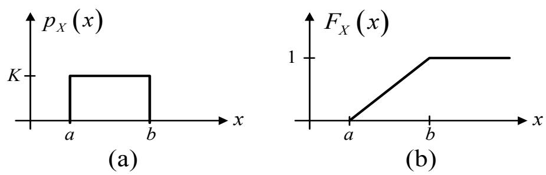
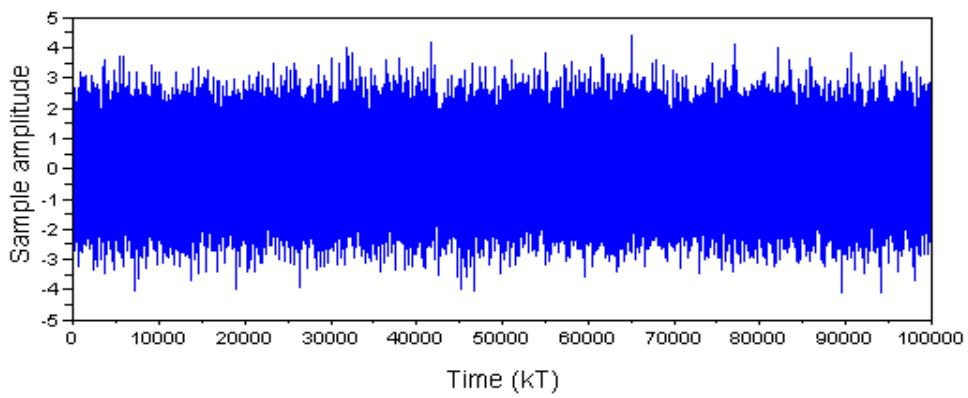
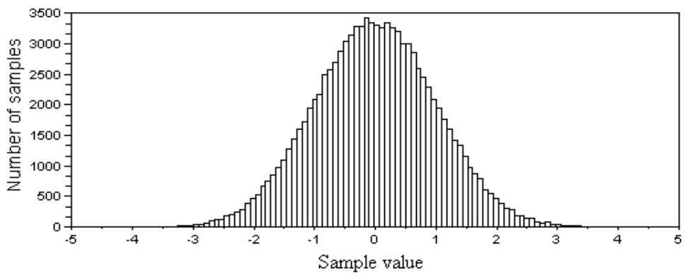
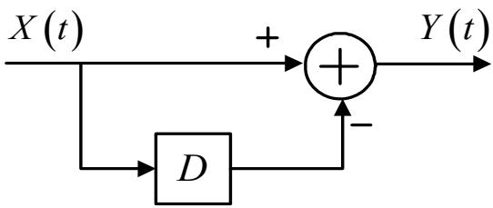

## 第 4 章

## 信号与随机过程

本章将介绍信号与随机过程的基础知识，例如随机变量、系综平均、矩、随机过程、遍历过程、功率谱密度，以及随机过程与线性时不变系统之间的关系等。目的是让读者能够理解如何分析和处理随机信号，因为硬盘驱动器信号处理系统中传输的各种信息具有随机信号的特性。因此，本章的内容将帮助读者更好地理解信号与随机过程的特性，从而使后续章节的内容更容易理解。感兴趣的读者可以参考 [9, 35, 36] 了解更多详情。

## 4.1 引言

通信系统的主要目的是将信息 (information) 从发送端 (transmitter) 通过信道 (channel) 发送到接收端 (receiver)。通常，通信系统中的各种信息信号具有“随机信号 (random signal)”的特性，即在任何给定时刻，无法确定该随机信号的具体属性。随机信号的例子包括信息信号 (message signal) 和噪声 (noise) 等。

在分析随机信号时，通常将其转换为具有确定性信号 (deterministic signal) 特性的形式，以便利用线性时不变 (LTI: linear time-invariant) 系统的各种原理和理论进行分析，并从随机信号中提取所需的信息。用于将随机信号转换为确定性信号的数学工具包括自相关函数 (auto-correlation)、协方差函数 (covariance) 和功率谱密度 (power spectral density) 等。这些函数使用所谓的“期望算子 (expectation operator)”进行计算。因此，可以说期望算子的作用是消除随机信号的不确定性 (uncertainty)。

## 4.2 随机变量

考虑抛一枚硬币的实验，结果有两种可能，即“正面 (head)”或“反面 (tail)”。如果连续抛很多次硬币，通常会期望出现“正面”的次数与出现“反面”的次数大致相等。也就是说，如果定义 $N$ 为抛硬币的总次数，$n_H$ 为出现“正面”的次数，$n_T$ 为出现“反面”的次数，则有：

$$
\frac { n _ { H } } { N } \approx 0 . 5 ; \frac { n _ { T } } { N } \approx 0 . 5
$$

这意味着，如果硬币没有被加权（即公正的），那么结果为“正面”或“反面”的概率相等。在数学上，这两个结果的概率可以表示为：

$$
\mathrm { P r } \{ H \} = 0 . 5 ; \mathrm { P r } \{ T \} = 0 . 5\tag{4.1}
$$

其中 $\operatorname* { P r } \{ x \}$ 是 $x$ 发生的概率，$H$ 表示结果为“正面”，$T$ 表示结果为“反面”。此外，一次实验中所有可能结果的集合称为“样本空间 (sample space)”，用符号 $\Omega$ 表示，其总概率始终等于 1。也就是说：

$$
\mathrm { P r } \{ \Omega \} = 1\tag{4.2}
$$

对于抛硬币实验，其样本空间为：

$$
\Omega = \{ H , T \}
$$

样本空间的子集称为“事件 (event)”，而事件中的每个成员被称为“基本事件 (elementary event)” [35]。对于抛硬币实验，它包含两个基本事件：

$$
\\omega _ { 1 } = \\{ H \\} \\quad ; \\quad \\omega _ { 2 } = \\{ T \\}
$$

如果定义一个实变量 $x$ 来代表抛硬币的结果，规定当结果为“正面”时 $x = 1$，当结果为“反面”时 $x = - 1$。那么，我们可以定义一个从结果集 $\\omega _ { i } \\in \\Omega$ 到实数集 $\\mathbb{R}$ 的映射 $f : \\Omega \\to \\mathbb{R}$，如下所示：

$$
\\begin{array} { r c l } { \\omega _ { 1 } } & { = } & { \\{ H \\} \\implies \\ x = 1 } \\\\ { } & { } & { } \\\\ { \\omega _ { 2 } } & { = } & { \\{ T \\} \\implies \\ x = - 1 } \\end{array}
$$

根据方程 (4.1) 对抛硬币结果赋予的概率，可知 $x = 1$ 或 $x = - 1$ 的概率相等，即：

$$
\\begin{array} { r c l } { { \\mathrm { P r } \\{ x = 1 \\} } } & { { = } } & { { 0 . 5 } } \\\\ { { } } & { { } } & { { } } \\\\ { { \\mathrm { P r } \\{ x = - 1 \\} } } & { { = } } & { { 0 . 5 } } \\end{array}\\tag{4.3}
$$

由于抛硬币的结果只有两种可能（正面或反面），因此变量 $x$ 可能取得的值仅为 1 和 -1。对于其他任何 $x$ 值，其概率均为零，即：

$$
\\operatorname* { P r } \\{ x = \\alpha \\} = 0
$$

其中 $\\alpha \\neq \\pm 1$。而变量 $x$ 取值为 1 或 -1 的总概率为：

$$
\\mathrm { P r } \\{ \\Omega \\} = \\mathrm { P r } \\{ x = \\pm 1 \\} = 1
$$

通过为样本空间 $\Omega$ 中的每个基本事件赋予概率，并将每个基本事件 $\omega _ { i } \in \Omega$ 转换为一个实数，从而定义了“随机变量 (random variable)”。换句话说，随机变量 $X(A)$ 将随机事件 $A$ 转换为一个实数。例如，在一次抛硬币实验中，可能的结果有两种：1（代表正面）和 -1（代表反面），因此 $X(A) \in \{ 1, - 1 \}$。或者在一次掷骰子实验中，可能的结果有六种：1, 2, 3, 4, 5, 6，因此 $X(A) \in \{ 1, 2, 3, 4, 5, 6 \}$。

为样本空间中的每个事件 $A$ 赋予概率（实数）必须符合以下三个公理 (axiom)：

1) $\\operatorname* { P r } \\{ A \\} \\geq 0$，对于所有事件 $A \\in \\Omega$。
2) $\\mathrm { P r } \\{ \\Omega \\} = 1$，对于必然事件。
3) 对于两个互不相容事件 (mutually exclusive events) $A_1$ 和 $A_2$，有：

$$
\\operatorname* { P r } \\{ A _ { 1 } \\cup A _ { 2 } \\} = \\operatorname* { P r } \\{ A _ { 1 } \\} + \\operatorname* { P r } \\{ A _ { 2 } \\}
$$

在定义了样本空间中事件的概率之后，可以定义随机变量 $X$ 的概率。通常，这表现为随机变量 $X$ 取某个特定值或落在某个给定范围内的概率，例如 $\\mathrm { P r } \\{ X = 1 \\}$、$\\operatorname* { P r } \\{ X \\ = \\ - 1 \\}$ 或 $\\operatorname* { P r } \\{ 0 < X \\leq 1 \\}$。在实际操作中，随机变量的概率通常直接通过“概率分布函数 (probability distribution function)”或称为“累积分布函数 (cumulative distribution function)”来定义，定义如下：

$$
F _ { X } ( x ) = \\operatorname* { P r } \\{ X \\leq x \\}\\tag{4.4}
$$

其中 $F_X(x)$ 是随机变量 $X$ 的值小于或等于实数 $x$ 的概率。累积分布函数的重要性质如下：

1) $0 \\leq F _ { X } ( x ) \\leq 1$
2) 当 $x_1 < x_2$ 时，$F _ { X } ( x _ { 1 } ) \\leq F _ { X } ( x _ { 2 } )$
3) $F _ { X } ( - \\infty ) = 0$
4) $F _ { X } ( + \\infty ) = 1$

此外，累积分布函数的导数等于“概率密度函数 (probability density function)”，即：

$$
p _ { X } ( x ) = \\frac { d F _ { X } ( x ) } { d x }\\tag{4.5}
$$

概率密度函数的重要性质如下：

1) $0 \\leq p _ { X } ( x ) \\leq 1$
2) $\\textstyle \\operatorname* { P r } \\{ a \\leq X \\leq b \\} = \\int _ { a } ^ { b } p _ { X } ( x ) d x$
3) $F _ { X } ( x ) = \\int _ { - \\infty } ^ { x } p _ { X } ( \\alpha ) d \\alpha$
4) $\\int _ { - \\infty } ^ { \\infty } p _ { X } ( x ) d x = F _ { X } ( + \\infty ) - F _ { X } ( - \\infty ) = 1$

**示例 4.1**：假设随机变量 $X$ 是信息通过信道所花费的时间，且 $X$ 是一个概率函数为以下形式的指数随机变量 (exponential random variable)：

$$
\\operatorname* { P r } \\{ X > x \\} = e ^ { - \\lambda x } , \\quad x > 0
$$

其中 $x$ 为任意实数，$\\lambda$ 为常数。请计算：

a) 累积分布函数 $F _ { X } ( x )$

图 4.1: (a) 累积分布函数 $F _ { X } ( x )$ 和 (b) 指数随机变量的概率密度函数 $p _ { X } ( x )$。

b) 当 $T = 1 / \\lambda$ 时，$\\operatorname* { P r } \\{ T < X \\leq 2 T \\}$ 的值。
c) 概率密度函数 $p _ { X } ( x )$。

**解**：
a) 累积分布函数可由以下方式求得：
$$
\\begin{array} { l l l } { F _ { X } ( x ) } & { = } & { \\operatorname* { P r } \\{ X \\leq x \\} } \\\\ & { = } & { 1 - \\operatorname* { P r } \\{ X > x \\} } \\\\ & { = } & { 1 - e ^ { - \\lambda x } } \\\\ & { = } & { \\left\\{ \\begin{array} { l l } { 0 , } & { x < 0 } \\\\ { 1 - e ^ { - \\lambda x } , } & { x \\geq 0 } \\end{array} \\right. } \\end{array}
$$
如图 4.1(a) 所示。

b) 根据累积分布函数的性质：
$$
{ \begin{array} { l l l } { \operatorname* { P r } \{ T < X \leq 2 T \} } & { = } & { \operatorname* { P r } \{ X < 2 T \} - \operatorname* { P r } \{ X < T \} } \\ & { = } & { ( 1 - e ^ { - \lambda 2 T } ) - ( 1 - e ^ { - \lambda T } ) } \\ & { = } & { e ^ { - \lambda T } - e ^ { - \lambda 2 T } } \end{array} }
$$

图 4.2: (a) 概率密度函数 $p _ { X } ( x )$ 和 (b) 均匀随机变量的累积分布函数 $F _ { X } ( x )$。

因此，当 $T = 1 / \lambda$ 时：
$$
\operatorname* { P r } \{ T < X \le 2 T \} = e ^ { - 1 } - e ^ { - 2 } \approx 0 . 2 3 3
$$

c) 由于 $F _ { X } ( x )$ 在所有 $x$ 值上都是连续的，因此除了 $x = 0$ 以外，其导数在所有 $x$ 处均存在。因此，概率密度函数 $p _ { X } ( x )$ 为：
$$
 p _ { X } ( x ) = \frac { d F _ { X } ( x ) } { d x } = \left\{ \begin{array} { l l } { 0 , } & { x < 0 } \\ { \lambda e ^ { - \lambda x } , } & { x > 0 } \end{array} \right.
$$
如图 4.1(b) 所示。

**示例 4.2**：假设均匀随机变量 (uniform random variable) $X$ 的概率密度函数为：
$$
p _ { X } ( x ) = { \left\{ \begin{array} { l l } { K , } & { a \leq x \leq b } \\ { 0 , } & { { \mathrm { e l s e } } } \end{array} \right. }
$$
如图 4.2(a) 所示。其中 $a$ 和 $b$ 为任意常数。请计算 $K$ 值及累积分布函数 $F _ { X } ( x )$。

**解**：$K$ 值可以通过利用概率密度函数的性质求得，即：
$$
\int _ { - \infty } ^ { \infty } p _ { X } ( x ) d x = 1
$$
$$
\int _ { a } ^ { b } K d x = 1
$$
$$
\begin{array} { l l l } { { K ( b - a ) } } & { { = } } & { { 1 } } \end{array}
$$
$$
\ K \ = \ { \frac { 1 } { b - a } }
$$

同理，累积分布函数可由以下方式求得：
$$
F _ { X } ( x ) = \int _ { - \infty } ^ { x } p _ { X } ( \alpha ) d \alpha
$$
其值为：
$$
F _ { X } ( x ) = { \left\{ \begin{array} { l l } { 0 , } & { x < a } \\ { { \frac { x - a } { b - a } } , } & { a \leq x \leq b } \\ { 1 , } & { x > b } \end{array} \right. }
$$
如图 4.2(b) 所示。

对于离散随机变量 (discrete random variable)，概率质量函数 (probability mass function) 将被用于替代概率密度函数，其定义为：

$$
p _ { X } ( x ) = \sum _ { i } { \mathrm { P r } } \{ x = x _ { i } \} \delta [ x - x _ { i } ]\tag{4.6}
$$

其中 $\delta [ \cdot ]$ 为克罗内克 $\delta$ 函数 (Kronecker delta function)。离散随机变量的累积分布函数可通过以下方式求得：

$$
F _ { X } ( x ) = \int _ { - \infty } ^ { x } p _ { X } ( y ) d y = \sum _ { i } \operatorname* { P r } \{ x = x _ { i } \} u [ x - x _ { i } ]\tag{4.7}
$$

图 4.3: (a) 累积分布函数 $F _ { X } ( x )$ 和 (b) 抛硬币实验的概率质量函数 $p _ { X } ( x )$。

其中 $u [ \cdot ]$ 为离散时间单位阶跃函数 (discrete-time unit step function)。例如，对于上述抛硬币实验，可得：

$$
F _ { X } ( x ) = { \left\{ \begin{array} { l l } { 0 , } & { x < - 1 } \\ { 0 . 5 , } & { - 1 \leq x < 1 } \\ { 1 , } & { x \geq 1 } \end{array} \right. }\tag{4.8}
$$

## 4.2.3 多个随机变量

假设 $X$ 和 $Y$ 是同一样本空间 (sample space) 中的随机变量。联合累积分布函数 (joint cumulative distribution function) 定义为：

$$
F_{XY}(x, y) = \operatorname{Pr}\{X \leq x, Y \leq y\}\tag{4.15}
$$

其重要性质如下：

1) $F_{XY}(x_1, y_1) \leq F_{XY}(x_2, y_2)$，若 $x_1 \leq x_2$ 且 $y_1 \leq y_2$。
2) $$
F_{XY}(-\infty, y) = F_{XY}(x, -\infty) = 0
$$

3) $F_{XY}(\infty, \infty) = 1$

4) $F_X(x) = F_{XY}(x, \infty)$

5) $F_Y(y) = F_{XY}(\infty, y)$

同样地，联合概率密度函数 (joint probability density function) 定义为：

$$
p_{XY}(x, y) = \frac{\partial^2}{\partial x \partial y} F_{XY}(x, y)\tag{4.16}
$$

其重要性质如下：

1) $F_{XY}(x, y) = \int_{-\infty}^{y} \int_{-\infty}^{x} p_{XY}(u, v) du dv$

2) $p_X(x) = \int_{-\infty}^{\infty} p_{XY}(x, y) dy$

3) $p_Y(y) = \int_{-\infty}^{\infty} p_{XY}(x, y) dx$

4) $\int_{-\infty}^{\infty} \int_{-\infty}^{\infty} p_{XY}(x, y) dx dy = 1$

此外，在给定随机变量 $Y = y$ 的条件下，随机变量 $X$ 的条件概率密度函数 (conditional probability density function) 定义为：

$$
p_{X|Y}(x|y) = \begin{cases} \frac{p_{XY}(x, y)}{p_Y(y)}, & p_Y(y) \neq 0 \\ 0, & \text{其他} \end{cases}\tag{4.17}
$$

如果随机变量 $X$ 和 $Y$ 统计独立 (statistically independent)，则有：

$$
p_{XY}(x, y) = p_X(x) p_Y(y)\tag{4.18}
$$

因此，方程 (4.17) 可简化为：

$$
p_{X|Y}(x|y) = p_X(x)\tag{4.19}
$$

若 $g(X, Y)$ 是随机变量 $X$ 和 $Y$ 的函数，则 $g(X, Y)$ 的期望值可通过以下方式计算：

$$
E[g(X, Y)] = \int_{-\infty}^{\infty} \int_{-\infty}^{\infty} g(X, Y) p_{XY}(x, y) dx dy\tag{4.20}
$$

## 4.2.4 随机变量之间的关系

假设 $X$ 和 $Y$ 是两个随机变量，其均值分别为 $m_X$ 和 $m_Y$，方差分别为 $\sigma_X^2$ 和 $\sigma_Y^2$。这两个随机变量之间的一些重要关系如下：

1) **相关度 (correlation)** 定义为：
$$
R_{XY} = E[XY] = \int_{-\infty}^{\infty} \int_{-\infty}^{\infty} xy p_{XY}(x, y) dx dy\tag{4.21}
$$

2) **协方差 (covariance)** 定义为：
$$
\begin{array}{lcl}
\operatorname{Cov}(X, Y) & = & E[(X - m_X)(Y - m_Y)] \\
& = & E[XY] - E[X m_Y] - E[m_X Y] + E[m_X m_Y] \\
& = & E[XY] - E[X] m_Y - m_X E[Y] + m_X m_Y \\
& = & E[XY] - m_X m_Y - m_X m_Y + m_X m_Y \\
& = & E[XY] - m_X m_Y
\end{array}\tag{4.22}
$$
这是因为 $E[X] = m_X$ 和 $E[Y] = m_Y$ 是常数。

3) **相关系数 (correlation coefficient)** 定义为：
$$
\rho_{XY} = \frac{\operatorname{Cov}(X, Y)}{\sigma_X \sigma_Y} = \frac{E[XY] - m_X m_Y}{\sigma_X \sigma_Y}\tag{4.23}
$$
其取值范围为：
$$
-1 \le \rho_{XY} \le 1
$$

根据上述三个定义，随机变量 $X$ 和 $Y$ 被称为**正交 (Orthogonal)**，当且仅当：
$$
E[XY] = 0\tag{4.24}
$$

同样地，随机变量 $X$ 和 $Y$ 被称为**不相关 (uncorrelated)**，当且仅当：
$$
\rho_{XY} = 0 \implies E[XY] = E[X] E[Y]\tag{4.25}
$$

不相关随机变量的一个重要性质是：若定义 $Z = X + Y$ 为两者的和，则 $Z$ 的方差等于 $X$ 和 $Y$ 的方差之和，即：
$$
\sigma_Z^2 = \sigma_X^2 + \sigma_Y^2\tag{4.26}
$$

此外，随机变量 $X$ 和 $Y$ 被认为是**统计独立 (statistically independent)** 的，当且仅当：
$$
p_{XY}(x, y) = p_X(x) p_Y(y) \implies E[XY] = E[X] E[Y]\tag{4.27}
$$

观察方程 (4.23) 可以发现，如果随机变量 $X$ 和 $Y$ 统计独立，则它们的相关系数 $\rho_{XY} = 0$ 是自动成立的。换句话说，统计独立必定导致不相关。但反之则不一定成立，即不相关并不一定意味着统计独立，除非 $X$ 和 $Y$ 是**联合高斯随机变量 (joint Gaussian random variable)** [36]。

## 4.2.5 高斯概率密度函数

高斯随机变量 (Gaussian random variable) 在通信系统的分析中被广泛使用，例如用于建模噪声和信息信号。高斯随机变量 $X$ 的概率密度函数如下：

$$
p_X(x) = \frac{1}{\sqrt{2\pi \sigma_X^2}} \exp \left( -\frac{(x - m_X)^2}{2\sigma_X^2} \right)\tag{4.28}
$$

其中 $\exp\{\cdot\}$ 为指数函数，$m_X$ 为 $X$ 的均值，$\sigma_X^2$ 为其方差，记作 $p_X(x) \sim \mathcal{N}(m_X, \sigma_X^2)$。

图 4.4: $\mathcal{N}(0, 1)$ 高斯随机变量的示例特性。

在实际应用中，高斯随机变量的概率密度函数完全由其均值 $m_X$ 和方差 $\sigma_X^2$ 决定。当 $m_X = 0$ 且 $\sigma_X^2 = 1$ 时，该概率密度函数 $\mathcal{N}(0, 1)$ 被称为“标准正态分布 (standard normal distribution)”。图 4.4 展示了 $\mathcal{N}(0, 1)$ 高斯随机变量的特性，从图 4.4(a) 的直方图可以看出，随机变量 $X$ 的大部分取值集中在零附近，这与 $m_X = 0$ 的均值相一致。

热噪声 (thermal noise) 存在于所有电子设备中，是由电子设备长时间运行产生的热量导致电子随机运动而产生的。因此，高斯随机变量常被用来模拟热噪声，这源于“中心极限定理 (central limit theorem)” [36]，该定理指出：大量独立随机变量之和的概率密度函数，在变量数量趋于无穷大时，将趋近于高斯概率密度函数。

对于概率密度函数为 $\mathcal{N}(m_X, \sigma_X^2)$ 的高斯随机变量，其累积分布函数 $F_X(x)$ 可表示为：

$$
\begin{array}{lcl}
F_X(x) & = & \operatorname{Pr}\{X \le x\} \\
& = & \displaystyle \int_{-\infty}^{x} p_X(\alpha) d\alpha \\
& = & 1 - \displaystyle \int_{x}^{+\infty} p_X(\alpha) d\alpha \\
& = & 1 - \displaystyle \frac{1}{\sqrt{2\pi \sigma_X^2}} \displaystyle \int_{x}^{+\infty} \exp \left( -\frac{(\alpha - m_X)^2}{2\sigma_X^2} \right) d\alpha
\end{array}\tag{4.29}
$$

令 $v = (\alpha - m_X) / \sigma_X$，则 $dv = d\alpha / \sigma_X$。于是方程 (4.29) 可改写为：

$$
\begin{array}{lcl}
F_X(x) & = & 1 - \frac{1}{\sqrt{2\pi}} \int_{\frac{x - m_X}{\sigma_X}}^{\infty} \exp \left( -\frac{v^2}{2} \right) dv \\
& = & 1 - Q\left( \frac{x - m_X}{\sigma_X} \right)
\end{array}\tag{4.30}
$$

其中 $Q(x)$ 函数定义为：
$$
Q(x) = \frac{1}{\sqrt{2\pi}} \int_{x}^{\infty} \exp \left\{ -\frac{v^2}{2} \right\} dv\tag{4.31}
$$

$Q(x)$ 表示高斯概率密度函数尾部的积分值。通常情况下，不同 $x$ 值的 $Q(x)$ 可以通过“查询表 (look-up table)”获得，方便实际应用（见附录 A）。但在 $x \gg 3$ 时，$Q(x)$ 可以近似为：
$$
Q(x) \approx \frac{1}{x \sqrt{2\pi}} \exp \left( -\frac{x^2}{2} \right)\tag{4.32}
$$

### 联合高斯随机变量

如果随机变量 $X$ 和 $Y$ 的联合概率密度函数为：
$$
\begin{array}{rcl}
p_{XY}(x, y) & = & \displaystyle \frac{1}{2\pi \sigma_X \sigma_Y \sqrt{1 - \rho_{XY}^2}} \exp \left\{ -\frac{1}{2(1 - \rho_{XY}^2)} \left[ \frac{(x - m_X)^2}{\sigma_X^2} - 2\rho_{XY} \frac{(x - m_X)(y - m_Y)}{\sigma_X \sigma_Y} + \frac{(y - m_Y)^2}{\sigma_Y^2} \right] \right\}
\end{array}\tag{4.33}
$$
则称 $X$ 和 $Y$ 为**联合高斯随机变量 (joint Gaussian random variable)**。其中 $m_X$ 和 $m_Y$ 分别为均值，$\sigma_X^2$ 和 $\sigma_Y^2$ 分别为方差，$\rho_{XY}$ 为相关系数。

高斯随机变量具有以下有趣特性 [35]：

1) 若 $X$ 和 $Y$ 是联合高斯随机变量，且 $a, b$ 为任意常数，则随机变量
$$
Z = aX + bY
$$
同样是一个高斯随机变量，其均值为：
$$
m_Z = am_X + bm_Y
$$
其方差为：
$$
\sigma_Z^2 = a^2 \sigma_X^2 + b^2 \sigma_Y^2 + 2ab \sigma_X \sigma_Y \rho_{XY}
$$

2) 若 $X$ 和 $Y$ 是联合高斯随机变量且不相关（即 $\rho_{XY} = 0$），则 $X$ 和 $Y$ 自动统计独立。

3) 若 $X$ 是高斯随机变量，则其 $n$ 阶矩为：
$$
E[X^n] = \begin{cases} 1 \times 3 \times 5 \times \dots \times (n-1) \sigma_X^2, & n \text{ 为偶数} \\ 0, & n \text{ 为奇数} \end{cases}
$$

## 4.2.6 重要离散随机变量

离散随机变量在许多涉及计数 (counting) 的实际应用中非常常见。在本节中，我们将重点介绍与硬盘驱动器信号处理系统相关的**伯努利随机变量 (Bernoulli random variable)** 和**二项随机变量 (binomial random variable)**。

### 伯努利随机变量

伯努利试验 (Bernoulli trial) 是一种随机试验，其结果只能分为两种互斥的情况：一种是符合要求的，称为“成功 (success)”，另一种是不符合要求的，称为“失败 (failure)”。例如，抛一次硬币，如果结果是“正面”则视为成功，如果结果是“反面”则视为失败；另一个例子是，将比特 0 和 1 从发送电路发送到接收电路，如果发生了错误，可以将其称为成功，如果没有错误发生，则称为失败。

如果令 $X$ 为伯努利试验的结果，则 $X$ 是一个伯努利随机变量，其可能的取值为 $\Omega = \{ 0, 1 \}$。通常规定 $X = 1$ 代表成功，$X = 0$ 代表失败。若定义 $q$ 为成功的概率 $(0 \le q \le 1)$，则伯努利随机变量的概率质量函数定义为：

$$
\mathrm{Pr}\{ X = 0 \} = 1 - q \tag{4.34}
$$

$$
\mathrm{Pr}\{ X = 1 \} = q \tag{4.35}
$$

当 $k \neq 0$ 且 $k \neq 1$ 时，$\mathrm{Pr}\{ X = k \} = 0$。对于伯努利随机变量，其均值为：

$$
E[X] = q \tag{4.36}
$$

其方差为：

$$
\operatorname{Var}(X) = q(1 - q) \tag{4.37}
$$

### 二项随机变量

考虑一个独立重复进行 $n$ 次的随机试验，且每次试验的结果只能分为成功或失败。如果定义 $Y$ 为在 $n$ 次试验中事件 $A$（成功）发生的次数，那么随机变量 $Y$ 的所有可能取值为 $\{ 0, 1, \dots, n \}$。例如，$Y$ 可以是抛 $n$ 次硬币中出现“正面”的次数。

由于每次试验的结果都可以看作一个伯努利随机变量 $X$，因此二项随机变量 (binomial random variable) $Y$ 定义为：

$$
Y = \sum_{i=1}^{n} X_i \tag{4.38}
$$

其中 $X_i \in \{ 0, 1 \}$ 是第 $i$ 次试验的结果。因此，二项随机变量 $Y$ 的概率质量函数为：

$$
\begin{array}{rcl}
\mathrm{Pr}\{ Y = k \} & = & \binom{n}{k} q^k (1 - q)^{n-k} \\
& = & \displaystyle \left( \frac{n!}{(n-k)! k!} \right) q^k (1 - q)^{n-k}
\end{array} \tag{4.39}
$$

其中 $k = 0, 1, \dots, n$，且 $n! = n \times (n - 1) \times \dots \times 2 \times 1$。对于二项随机变量，其均值为：

$$
E[Y] = nq \tag{4.40}
$$

其方差为：

$$
\operatorname{Var}(Y) = nq(1 - q) \tag{4.41}
$$

通常，二项随机变量广泛应用于结果仅有两种可能的情况，例如：正面/反面，正确比特/错误比特，合格零件/缺陷零件等。

**示例 4.6** 比特 0 和 1 通过一个有噪声的信道发送，导致接收端以 $0.00002$ 的概率做出错误判定。如果信息以数据块 (block) 形式发送，每个数据块包含 2000 个比特：
a) 求一个数据块中至少有一个比特出错的概率。
b) 如果一组信息包含 20 个数据块，求其中出错的数据块数量大于或等于 2 个的概率。

**解**
a) 令 $Y$ 表示一个数据块（2000 比特）中出错的比特数，$q = 0.00002$ 为接收端判定错误的概率。因此，一个数据块中 $Y \ge 1$ 的概率可通过方程 (4.39) 计算：

$$
\begin{array}{lll}
\mathrm{Pr}\{ Y \ge 1 \} & = & 1 - \mathrm{Pr}\{ Y = 0 \} \\
& = & 1 - \binom{2000}{0} (0.00002)^0 (1 - 0.00002)^{2000-0} \\
& = & 1 - (1)(1)(0.99998)^{2000} \\
& = & 0.03921
\end{array}
$$

b) 令 $Z$ 表示 20 个数据块中发生错误的数据块数量，$p$ 为单个数据块出错的概率，根据 (a) 部分， $p = 0.03921$。因此，$Z \ge 2$ 的概率为：

$$
\begin{array}{rcl}
\mathrm{Pr}\{ Z \ge 2 \} & = & 1 - \mathrm{Pr}\{ Z = 0 \} - \mathrm{Pr}\{ Z = 1 \} \\
& = & 1 - \binom{20}{0} (0.03921)^0 (1 - 0.03921)^{20} - \binom{20}{1} (0.03921)^1 (1 - 0.03921)^{19} \\
& = & 1 - (1)(1)(0.96079)^{20} - (20)(0.03921)(0.96079)^{19} \\
& = & 0.184
\end{array}
$$

## 4.3 随机过程

随机过程 (random process) $X(A, t)$ 可以被看作是两个随机变量的函数，即事件 $A$ 的随机变量和时间 $t$ 的随机变量。例如，假设我们将电压发生器开启 10 次，每次记录电压随时间的变化情况，如图 4.5 所示。其中 $A_n$ 表示第 $n$ 次开启的事件，其结果可能受到设备内部各种噪声的影响。

图 4.5: 每次开启电压发生器时随机过程的示例。

如果仅考虑第 $j$ 次开启电压发生器的事件 $A_j$，则 $X(A_j, t) = X_j(t)$ 被称为一个样本函数 (sample function)。所有样本函数的集合被称为统计集 (ensemble) [36]。同样地，如果在特定的时间点 $t_k$ 观察，则 $X(A, t_k)$ 是一个取决于事件 $A$ 的随机变量 $X(t_k)$。而如果在特定的事件 $A = A_j$ 和特定的时间 $t = t_k$ 下观察，则 $X(A_j, t_k)$ 将变成一个具体的数值 (number)。为了方便描述，我们通常使用符号 $X(t)$ 来代表随机过程 $X(A, t)$。

### 4.3.1 均值与自相关函数

与随机变量类似，随机过程必须被转换为确定性数值 (deterministic value) 才能方便地进行分析。在数学处理中，最常用的两种转换工具是均值 (mean) 和自相关函数 (auto-correlation function)。随机过程 $X(t)$ 在时间 $t = t_k$ 处的均值（或称为一阶统计量）定义为：

$$
\begin{array}{lll}
m_X(t_k) & = & E[X(t_k)] \\
& = & \displaystyle \int_{-\infty}^{\infty} x p_{X_k}(x) dx
\end{array} \tag{4.42}
$$

其中 $p_{X_k}(x)$ 是随机过程在时间 $t_k$ 处的统计集概率密度函数。

同样地，随机过程 $X(t)$ 的自相关函数（或称为二阶统计量）被定义为两个变量 $t_1$ 和 $t_2$ 的函数，如下所示：

$$
\begin{array}{lll}
R_X(t_1, t_2) & = & E[X(t_1) X(t_2)] \\
& = & \displaystyle \int_{-\infty}^{\infty} \int_{-\infty}^{\infty} xy p_{X_1 X_2}(x, y) dx dy
\end{array} \tag{4.43}
$$

其中 $X(t_1)$ 和 $X(t_2)$ 分别是随机过程 $X(t)$ 在时间 $t_1$ 和 $t_2$ 处的随机变量。自相关函数的作用是衡量来自同一个随机过程的两个不同时刻之间数据的相关程度。也就是说，如果自相关函数的值很大，则说明这两个时刻的随机变量之间存在很强的相关性。

此外，在某些情况下，需要计算随机过程 $X(t)$ 的“自协方差 (auto-covariance)” [36]，其定义为：

$$
\begin{array}{rlll}
C_X(t_1, t_2) & = & E[ \{X(t_1) - m_X(t_1)\} \{X(t_2) - m_X(t_2)\} ] & (4.44) \\
& = & E[X(t_1)X(t_2)] - E[X(t_1)] m_X(t_2) - m_X(t_1) E[X(t_2)] + m_X(t_1) m_X(t_2) \\
& = & R_X(t_1, t_2) - m_X(t_1) m_X(t_2) & (4.45)
\end{array}
$$

随机过程 $X(t)$ 的相关系数定义为 [36]：

$$
\rho_X(t_1, t_2) = \frac{C_X(t_1, t_2)}{\sqrt{C_X(t_1, t_1)} \sqrt{C_X(t_2, t_2)}} \tag{4.46}
$$

该系数可用于衡量在同一个随机过程中，利用其他随机变量的线性函数来预测某一时刻随机变量取值的能力。

**注意**：两个不同的随机过程可能具有相同的均值、自相关函数和自协方差函数。

**示例 4.7** 给定随机过程 $X(t) = A \cos(2\pi t)$，其中 $A$ 是一个随机变量。请计算该随机过程 $X(t)$ 的均值、自相关函数和自协方差函数。

**解** 根据方程 (4.42)，随机过程 $X(t)$ 的均值为：

$$
m_X(t) = E[A \cos(2\pi t)] = E[A] \cos(2\pi t)
$$

同样地，根据方程 (4.43)，$X(t)$ 的自相关函数为：

$$
\begin{array}{rcl}
R_X(t_1, t_2) & = & E[X(t_1) X(t_2)] \\
& = & E[A \cos(2\pi t_1) A \cos(2\pi t_2)] \\
& = & E[A^2] \cos(2\pi t_1) \cos(2\pi t_2)
\end{array}
$$

最后，根据方程 (4.45)，自协方差函数为：

$$
\begin{array}{llll}
C_X(t_1, t_2) & = & R_X(t_1, t_2) - m_X(t_1) m_X(t_2) \\
& = & \{E[A^2] - (E[A])^2\} \cos(2\pi t_1) \cos(2\pi t_2) \\
& = & \sigma_A^2 \cos(2\pi t_1) \cos(2\pi t_2)
\end{array}
$$

由此可见，随机过程 $X(t)$ 的均值 $m_X(t)$、自相关函数 $R_X(t_1, t_2)$ 和自协方差函数 $C_X(t_1, t_2)$ 均是关于时间 $t$ 的函数。

## 4.3.2 平稳性 (Stationarity)

任何随机过程，如果其所有阶的统计特性都不随时间而改变，则被称为具有“强平稳 (strict-sense stationary, SSS)”特性。因此，强平稳随机过程非常容易分析，但在实际中并不常见，因为在实际的通信系统中，大多数随机过程并不具备强平稳特性。同样地，如果一个随机过程仅其一阶和二阶统计特性不随时间而改变，则称该过程具有“宽平稳 (wide-sense stationary, WSS)”特性，即：
$$
E[X(t)] = m_X(t) = m_X \tag{4.47}
$$
其中 $m_X$ 为常数，且
$$
R_X(t_1, t_2) = R_X(t_1 - t_2) = R_X(\tau) = E[X(t + \tau)X(t)] \tag{4.48}
$$
其中 $\tau = t_1 - t_2$ 为时间差。因此，可以说 $R_X(t_1, t_2) = R_X(t_3, t_4)$ 当且仅当 $t_1 - t_2 = t_3 - t_4$。也就是说，自相关函数不取决于具体的时刻，而仅取决于时间差。宽平稳 (WSS) 的要求比强平稳 (SSS) 的要求更为宽松，这使得系统建模更加接近实际情况，同时仍能保持分析的简便性。

因此，任何强平稳 (SSS) 随机过程必定也是宽平稳 (WSS) 随机过程，但反之不一定成立。也就是说，一个宽平稳 (WSS) 随机过程不一定是强平稳 (SSS) 随机过程，除非该过程是宽平稳的高斯随机过程 (Gaussian random process)，此时它也必定是强平稳的 [36]。因此，在分析通信系统时，通常假设信息信号和噪声信号具有宽平稳 (WSS) 特性，以便于分析。

**注意**：尽管随机过程在整个时间轴上通常不具备平稳性，但在实际操作中，我们通常只关注其处于平稳状态的时间段，这对于分析数据已经足够。

## 4.3.3 宽平稳随机过程的自相关函数

与方差被用来衡量随机变量的随机性（randomness）一样，自相关函数被用来衡量随机过程的随机性。根据方程 (4.48)，自相关函数 $R_X(\tau)$

图 4.6: 系统模型示例

仅为时间差 $\tau = t_1 - t_2$ 的函数，其中 $-\infty < \tau < \infty$。

对于均值为零的宽平稳随机过程 $X(t)$，$R_X(\tau)$ 还可以揭示与该随机过程相关的频率响应（frequency response）。也就是说，如果 $R_X(\tau)$ 随 $\tau$ 从零开始增加而缓慢变化，则意味着随机过程 $X(t)$ 在时间区间 $t = t_1$ 到 $t = t_1 + \tau$ 内的样本值在平均意义上彼此接近。因此，如果将 $X(t)$ 变换到频域，所得到的频谱将集中在低频区域。相反，如果 $R_X(\tau)$ 随 $\tau$ 的增加而迅速下降，则可以预期随机过程 $X(t)$ 在时域中变化剧烈，其频谱将集中在高频区域。

自相关函数具有以下性质：
1) $R_X(\tau) = R_X(-\tau)$（关于 $\tau = 0$ 对称）
2) 对于所有 $\tau$， $|R_X(\tau)| \le R_X(0)$（柯西-施瓦茨不等式性质）
3) $|R_X(\tau)| \Longleftrightarrow G_X(f)$（傅里叶变换对）
4) $R_X(0) = E[X^2(t)]$（$X(t)$ 的平均功率）

**示例 4.8** 考虑图 4.6 中的模型。假设 $X(t)$ 是一个均值为 $m_X$ 且自相关函数为 $R_X(\tau)$ 的宽平稳随机过程。请计算随机过程 $Y(t)$ 的均值 $m_Y$ 和自相关函数 $R_Y(\tau)$。

**解** 根据图 4.6 所示的模型，可得：
$$
Y(t) = X(t) - X(t - T)
$$
其中 $T$ 是一个比特的周期时间。因此，均值 $m_Y$ 可由下式计算：
$$
\begin{array}{lll}
m_Y & = & E[Y(t)] \\
& = & E[X(t) - X(t - T)] \\
& = & E[X(t)] - E[X(t - T)] \\
& = & m_X - m_X \\
& = & 0
\end{array}
$$
同样地，自相关函数 $R_Y(\tau)$ 可由下式计算：
$$
\begin{array}{rcl}
R_Y(\tau) & = & E[Y(t + \tau) Y(t)] \\
& = & E[\{X(t + \tau) - X(t + \tau - T)\} \{X(t) - X(t - T)\}] \\
& = & E[X(t + \tau) X(t)] - E[X(t + \tau - T) X(t)] \\
& & - E[X(t + \tau) X(t - T)] + E[X(t + \tau - T) X(t - T)] \\
& = & R_X(\tau) - R_X(\tau - T) - R_X(\tau + T) + R_X(\tau) \\
& = & 2R_X(\tau) - R_X(\tau - T) - R_X(\tau + T)
\end{array}
$$
由于均值 $m_Y = 0$ 与时间无关，且自相关函数 $R_Y(\tau)$ 仅取决于时间差 $\tau$，因此 $Y(t)$ 同样是一个宽平稳随机过程。

