## 第 5 章

## 基础通信原理

本章将介绍与硬盘驱动器信号处理系统相关的基础通信原理，例如基带传输系统、脉冲编码调制 (PCM)、脉冲幅度调制 (PAM)、匹配滤波器、误码率计算、码间干扰 (ISI)、奈奎斯特定理、采样定理以及各种均衡器等。这是因为硬盘驱动器的信号处理系统可以被视为一种通信系统。因此，读者在理解本章内容后，将有助于更容易地理解后续章节的内容。有关本章中提到的各项理论的详细信息，可参考 [9, 34, 37, 38, 39, 40]。

## 5.1 引言

通信系统 (communication system) 是指将信息从一个点（发送端）传输到另一个点（接收端）的系统，例如无线电通信系统、高速光纤通信系统和移动电话系统等。或者也可以认为，通信系统是将信息从一个时间段（发送端）传输到另一个时间段（接收端）的系统，例如硬盘驱动器的数据记录系统等。也就是说，信息在某一时刻被存储在记录介质 (medium) 中，经过一段时间后，信息再次从记录介质中被读取出来以供使用。通常，通信系统中传输的信息可以是任何形式，如语音、图像、视频、音乐、电子邮件、网页等。通信系统的主要目标是使接收端电路 (receiver) 能够检测并解码出发送端电路 (transmitter) 所发送的信息。

通常，通信系统可分为两大类：模拟通信系统和数字通信系统。这两者之间最显著的区别在于接收端的处理目标不同。模拟通信系统的接收端旨在重建一个与发送端发送的波形尽可能一致的新波形，因此，衡量模拟通信系统性能的指标是信号重建的保真度 (fidelity)。而数字通信系统的接收端则旨在判断发送端发送的波形是什么（并不需要知道发送信号的具体波形形状），因此，衡量数字通信系统性能的指标是接收端在做出判决时产生错误的概率，即误码率 (probability of error)。

读者可能会好奇，为什么早期的通信系统大多采用模拟方式？数字通信系统在过去不受欢迎的主要原因是它需要消耗大量的“带宽 (bandwidth)”，且模拟信号转换为数字信号的过程成本较高（价格昂贵），尽管数字电路具有更高的稳定性。促使人们转向使用数字通信系统的关键因素是各项技术和算法的进步，例如：压缩算法 (compression algorithm) 可减少传输所需的比特数；纠错码 (ECC: error-correction code) 技术可在接收端自动修正错误；数字信号处理 (DSP) 技术以及集成电路 (IC: integrated circuit) 的发展，特别是超大规模集成电路 (VLSI: very large scale integration) 技术的出现，极大地降低了数字电路的生产成本。

如今，数字通信系统已成为各种通信标准的基石，包括局域网 (LAN: local area network)、移动电话、以及各种无线通信系统（如 Bluetooth, Wi-Fi 和 Wi-MAX 等）。这是因为数字信号相比模拟信号具有以下优点：

- 数字信号更容易实现信号重建 (signal reconstruction)。
- 数字信号对失真 (distortion) 和干扰 (interference) 具有更强的鲁棒性。
- 为数字信号设计的电子电路更灵活且成本更低。
- 基于时分复用 (TDM: time division multiplexing) 的数字信号聚合技术比基于频分复用 (FDM: frequency division multiplexing) 的模拟信号聚合技术复杂度更低。
- 语音、图像、音乐和电子邮件等各类信息都可以转换为数字信号，从而方便地进行聚合传输。
- 为支持数字信号而开发的新型处理技术（如纠错码和加密技术 encryption）极大地提升了传输效率和安全性。

尽管数字信号具有诸多优点，但其缺点也可总结如下：

- 数字传输系统需要复杂的同步过程，包括比特 (bit)、符号 (symbol)、帧 (frame) 等的同步，而实现同步的电路复杂度高且价格昂贵。
- 当系统运行在信号功率与噪声功率之比（即信噪比 SNR: signal-to-noise ratio）低于某个阈值 (threshold level) 时，数字通信系统的性能会迅速下降。与之相对，模拟通信系统在相同情况下的性能下降则较为平缓。
- 数字通信系统的中继器 (repeater) 比模拟通信系统的中继器更复杂且成本更高。

然而，从整体上看，数字通信系统的效率远高于模拟通信系统。此外，在带宽有限但对数据传输速率要求不断提高的背景下，采用数字通信系统已成为必然选择。

## 5.1.1 数字通信系统的性能指标

在实际应用中，用于比较数字通信系统性能的指标主要是信噪比 (SNR) 和误码率 (BER: bit-error rate)，具体细节如下：

### 信噪比 (SNR)

SNR 是一个可用于比较系统性能的指标。例如，假设两个系统在检测器 (detector) 输出端的 BER 相同，那么其中发送功率较低（即所需 SNR 较低）的系统被认为效率更高。

在实际操作中，SNR 的定义方式多种多样，具体取决于给定的条件，例如系统中测量 SNR 的参考点位置。此外，在硬盘驱动器信号处理系统的分析中，计算 SNR 时使用的噪声成分可能包含加性噪声 (additive noise) 和介质噪声 (medium noise) 的总和，这取决于具体应用的要求。

### 误码率 (BER)

BER 同样可以用作比较系统性能的指标。也就是说，在相同 SNR 条件下，BER 越低，系统性能越好。通常，BER 是 SNR 的函数，即随着 SNR 的增加，BER 会降低。然而，在实际应用中，不能盲目地要求系统在极高 SNR 下工作，因为这会带来巨大的成本。因此，能够使硬盘驱动器信号处理系统在较低 SNR 水平下正常工作的设计，相当于能够实现更高的数据存储密度。

通常，针对不同应用，BER 被用作确定系统可靠性的标准。例如：语音传输在 $\text{BER} \leq 10^{-3}$ 时质量良好；数据传输在 $\text{BER} \leq 10^{-5}$ 时质量良好；光纤传输在 $\text{BER} \leq 10^{-12}$ 时质量良好；而硬盘驱动器设备则要求 $\text{BER} \leq 10^{-20}$ 才能保证质量良好。

## 5.1.2 基带传输系统

硬盘驱动器的信号处理系统可以被视为一种“基带传输系统 (baseband transmission system)” [5]。其通用模型如图 5.1 所示。也就是说，来自信源 (source) 的信息 (message) 可能是数字信号、数字数据序列，或者是以模拟信号的形式存在。这些信息将被格式化为数字数据序列，其可能的幅度值为 $L$ 个。每个幅度值由 $k = \log_2(L)$ 比特的二进制数据 (binary data) 表示，每个比特的值为 0 或 1。在将比特序列发送至目的地时，发送端电路 (transmitter) 将从符号集 $\{m_i\}$ ($i = 1, 2, \dots, M$) 中选择一个符号 (symbol)，每个符号代表 $k$ 个比特，即 $M = 2^k$。当 $M=2$ 时，所得符号为二进制数据，每个符号称为一个“比特 (bit)”。当 $M > 2$ 时，所得符号为 M 进制数据 (M-ary data)。随后，数据序列 $m_i$ 与脉冲信号 (pulse signal) 进行调制 (modulation)，转换为基带模拟信号 $r_i(t)$，然后发送至通信信道 (communication channel)。通常，不同的通信信道具有不同的特性，这可以通过信道的带宽和频率响应来分析。表 5.1 给出了各种通信系统物理信道的示例。

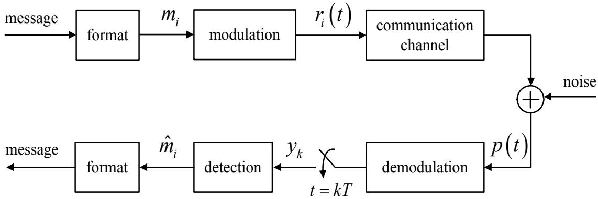
图 5.1: 基带传输系统模型

例 5.1: 在将消息 "PIYA" 发送到目的地时，系统将每个字符转换为 ASCII 码。如果使用 8 比特表示每个 ASCII 码，则发送的总比特数为 $4 \times 8 = 32$ 比特。在二进制系统（即 $M=2$）中，系统使用两种不同的信号来每次发送 $k = \log_2(M) = 1$ 比特的数据。例如，使用信号 $r_0(t)$ 表示比特 0，使用信号 $r_1(t)$ 表示比特 1。同样地，在 16-ary 系统（即 $M=16$）中，系统使用 16 种不同的信号来每次发送 $k = \log_2(16) = 4$ 比特的数据，如图 5.2 所示。

表 5.1: 各种通信系统的物理信道示例

<table><tr><td>通信系统</td><td>物理信道</td></tr><tr><td>家庭电话</td><td>电话线</td></tr><tr><td>移动电话</td><td>空气</td></tr><tr><td>卫星通信</td><td>空气, 大气层, 真空</td></tr><tr><td>互联网</td><td>电话线, 电缆, 光纤等</td></tr><tr><td>硬盘驱动器数据记录</td><td>磁记录盘</td></tr></table>

Binary system: $M=2, k=1$

16-ary system: $M=16, k=4$
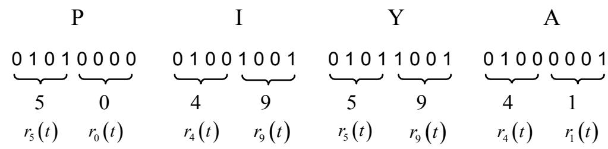
图 5.2: 每个字符转换为 ASCII 码的示例

通过信道传输的数据速率可通过“数据传输率 (data rate)” $R$ 来衡量，定义为：
$$
R = \frac{\log_2(M)}{T} = \frac{k}{T} \tag{5.1}
$$
单位为比特每秒 (bps: bit per second)，其中 $M = 2^k$ 是传输中使用的总符号数，$k$ 是代表一个符号的比特数，$T$ 是一个符号（$k$ 比特）的周期，单位为秒。传输通过信道的数据会受到噪声 (noise)、码间干扰 (IS: intersymbol interference) 以及信道带宽限制等因素的影响，导致接收端电路接收到的信号 $p(t)$ 波形与发送的信号 $r_i(t)$ 产生偏差。随后，在接收端，信号 $p(t)$ 经过解调 (demodulation) 和采样 (sampling)，将模拟信号转换为数字序列 $\{y_k\}$，然后发送至检测器，以决定符号 $m_i$ 的估计值（即求 $\hat{m}_i$）。最后，将符号估计值 $\hat{m}_i$ 重新格式化为所需的信息。

例 5.2: 假设一张数字图像的分辨率为 $800 \times 600$ 像素。每个像素由红、绿、蓝三原色组成，每种颜色有 64 个可能的亮度级。如果通过移动电话的 MMS 服务发送这张图像总共耗时 10 秒。
解：由于每个亮度级可以用 $k = \log_2(64) = 6$ 比特表示，因此每个像素总共需要 $3 \times 6 = 18$ 比特。由此，该数字图像总共需要 $800 \times 600 \times 18 = 8,640,000$ 比特。根据公式 (5.1)，该图像的数据传输率为：
$$
R = \frac{8,640,000}{10} = 864,000
$$
比特每秒，即 864 kbps (kilobit per second)。

## 5.1.3 信道容量

通常，数据传输率 $R$ 受多种参数限制，例如发送信号的平均功率、信道的失真 (distortion) 和干扰 (disturbance)、噪声的平均功率、误码率等。在信道不存在失真和干扰的情况下，系统可以用无限的数据传输率进行无误传输。

Claude Elwood Shannon [41] 提出了计算通信系统的信道容量 (channel capacity) $C$（即最大数据传输率）的方法。假设信道带宽限制为 $W$，且系统中仅存在加性高斯白噪声 (white Gaussian noise)，则信道容量 $C$ 可由下式计算 [9, 37, 41]：
$$
C = W \log_2(1 + \mathrm{SNR}) \tag{5.2}
$$
单位为比特每秒 (bps)。

香农定理 (Shannon's theorem) 指出：在设计数据传输率为 $R$ 的数字通信系统时，如果 $R < C$，则可以通过使用纠错码 (ECC) 将接收端电路的误码率 (BER) 降低到任意小的值（甚至为零）。相反，如果 $R > C$，则无法设计出无误的通信系统。

## 5.1.4 脉冲编码调制

参考图 5.1 中的模型，当信息为模拟信号（例如语音、图像等）时，需要通过“脉冲编码调制 (PCM: pulse code modulation)”或 PCM 过程 [9, 38] 将其转换为数字信息。该过程包含三个步骤：采样 (sampling)、量化 (quantization) 和编码 (encoding)，如图 5.3 所示。各步骤的一般工作原理如下：

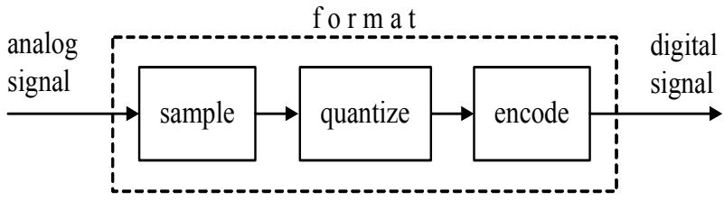
图 5.3: 脉冲编码调制 (PCM) 过程

### 采样 (Sampling)

采样是指将模拟信号转换为“数值序列 (numeric sequence)”的过程，也称为“模数转换 (analog-to-digital conversion)”。序列中的每个成员被称为一个“采样值 (sample)”，其值为实数。例如，若令 $x(t)$ 为模拟信号，则采样值可通过在每个时刻 $t = kT_s$ 对信号 $x(t)$ 进行采样获得，其中 $k$ 为整数，$T_s$ 为采样周期 (sampling period)。采样的输出结果可以用以下数学表达式表示：
$$
x[k] = x(t)|_{t=kT_s} = x(kT_s) \tag{5.3}
$$
即每个数据 $x[k]$ 之间的时间间隔为 $T_s$。

在实际应用中，用于信号采样的频率（称为采样频率 sampling frequency）$f_s = 1/T_s$ 必须符合“采样定理 (sampling theorem)”，以确保采样得到的数据能够等效地还原为原模拟信号。也就是说，若信号 $x(t)$ 的最高频率为 $f_{\max}$ 赫兹，则符合采样定理的采样频率应满足：
$$
f_s \geq 2 f_{\max} \tag{5.4}
$$

所使用的电子电路必须更加复杂，并且需要大量的寄存器 (register) 来存储采样值 $x[k]$。因此，必须通过一个将采样值 $x[k]$ 近似为有限取值范围的过程来降低电子电路的复杂度，这个过程称为**量化 (quantization)**。

### 量化 (Quantization)

量化是指将具有实数值的采样值近似为有限集合中某个值的过程。其中，每个采样值 $x[k]$ 将被近似为与其最接近的量化电平 (quantization level) 的值。量化后的输出数据称为量化采样值 (quantized sample) $x_q[k]$。通常，量化可分为两种类型：**均匀量化 (uniform quantization)** 和**非线性量化 (nonlinear quantization)**。

均匀量化将信号范围划分为多个等间距的电平，每个电平的间隔 $\Delta$ 相同，如图 5.4 所示。例如，如果使用 8 比特来表示一个采样值 $x_q[k]$，则量化电平总数为 $L = 2^8 = 256$ 个。若模拟信号的幅度在 $\pm V_p$ 伏特之间（即信号峰峰值 $V_{pp} = 2 V_p$），则量化间隔为 $\Delta = 2 V_p / 256 = V_p / 128$ 伏特。与之相反，非线性量化将信号范围划分为多个电平，但各电平的间隔不一定相同。

若信号 $x(t)$ 的幅度在 $\pm V_p$ 伏特范围内，均匀量化得到的采样值为：
$$
x_q[k] = x[k] + e[k] \tag{5.5}
$$
其中 $-\Delta/2 \le e[k] \le \Delta/2$ 称为量化误差 (quantization error)。如果信号 $x(t)$ 的幅度超出 $\pm V_p$ 伏特范围，量化误差将大于 $\Delta/2$，这在实际应用中应尽量避免。因为量化误差就像一种噪声，会干扰从量化采样值 $x_q[k]$ 还原模拟信号 $x(t)$ 的过程。由于量化误差 $e[k]$ 在 $-\Delta/2$ 到 $\Delta/2$ 之间呈均匀分布 (uniform distribution)，因此其概率密度函数 (probability density function) 可写为：
$$
p(e) = \frac{1}{\Delta} \tag{5.6}
$$

### 量化 (Quantization)

量化是指将具有实数值的采样值近似为有限集合中某个值的过程。其中，每个采样值 $x[k]$ 将被近似为与其最接近的量化电平 (quantization level) 的值。量化后的输出数据称为量化采样值 (quantized sample) $x_q[k]$。通常，量化可分为两种类型：**均匀量化 (uniform quantization)** 和**非线性量化 (nonlinear quantization)**。

均匀量化将信号范围划分为多个等间距的电平，每个电平的间隔 $\Delta$ 相同，如图 5.4 所示。例如，如果使用 8 比特来表示一个采样值 $x_q[k]$，则量化电平总数为 $L = 2^8 = 256$ 个。若模拟信号的幅度在 $\pm V_p$ 伏特之间（即信号峰峰值 $V_{pp} = 2 V_p$），则量化间隔为 $\Delta = 2 V_p / 256 = V_p / 128$ 伏特。与之相反，非线性量化将信号范围划分为多个电平，但各电平的间隔不一定相同。

若信号 $x(t)$ 的幅度在 $\pm V_p$ 伏特范围内，均匀量化得到的采样值为：
$$
x_q[k] = x[k] + e[k] \tag{5.5}
$$
其中 $-\Delta/2 \le e[k] \le \Delta/2$ 称为量化误差 (quantization error)。如果信号 $x(t)$ 的幅度超出 $\pm V_p$ 伏特范围，量化误差将大于 $\Delta/2$，这在实际应用中应尽量避免。因为量化误差就像一种噪声，会干扰从量化采样值 $x_q[k]$ 还原模拟信号 $x(t)$ 的过程。由于量化误差 $e[k]$ 在 $-\Delta/2$ 到 $\Delta/2$ 之间呈均匀分布 (uniform distribution)，因此其概率密度函数 (probability density function) 可写为：
$$
p(e) = \frac{1}{\Delta} \tag{5.6}
$$
因此，$e[k]$ 的平均值 (mean) 为：
$$
\begin{array}{lll} 
m_e & = & E[e] \\
& = & \displaystyle \int_{-\Delta/2}^{\Delta/2} e p(e) de \\
& = & \displaystyle \left. \frac{1}{\Delta} \left[ \frac{e^2}{2} \right]_{e=-\Delta/2}^{\Delta/2} \right. \\
& = & 0 
\end{array} \tag{5.7}
$$
而 $e[k]$ 的均方误差 (MSE: mean-squared error) 为：
$$
\begin{array}{rl} 
\sigma_e^2 & = E[(\epsilon - m_e)^2] \\
& = E[e^2] \\
& = \displaystyle \int_{-\Delta/2}^{\Delta/2} e^2 p(e) de \\
& = \frac{1}{\Delta} \left[ \frac{e^3}{3} \right]_{-\Delta/2}^{\Delta/2} \\
& = \frac{1}{\Delta} \left[ \frac{(\Delta^3) - (-\Delta^3)}{3(4)} \right] \\
& = \frac{\Delta^2}{12} 
\end{array} \tag{5.8}
$$
其中 $\sigma_e^2$ 即为量化噪声 (quantization noise) 的平均功率。

为了衡量量化误差导致的信号质量下降程度，使用“信号量化噪声比 (SQNR: signal-to-quantization noise ratio)”这一参数，定义为：
$$
\mathrm{SQNR} = 10 \log_{10} \left( \frac{\mathrm{signal\ power}}{\mathrm{quantization\ noise\ power}} \right) \tag{5.9}
$$
单位为分贝 (dB: decibel)。

**例 5.3**: 假设信号为正弦波 $x(t) = A \sin(2\pi ft)$，其中 $A$ 为信号幅度，使用 $m$ 比特量化器（即一个采样值由 $m$ 比特表示）。请证明：
$$
\mathrm{SQNR} \approx 1.8 + 6m \ \mathrm{(dB)}
$$
**解**: 由于信号 $x(t)$ 是周期为 $T_0$ 的周期信号，因此正弦波的平均功率可由（参考 21.4 节）计算得：
$$
\begin{array}{lll} 
P & = & \displaystyle \frac{1}{T_0} \int_0^{T_0} |A \sin(2\pi ft)|^2 dt \\
& = & \displaystyle A^2 \frac{1}{T_0} \int_0^{T_0} \{ 1 - \cos(4\pi ft) \} dt \\
& = & \displaystyle \frac{A^2}{2} 
\end{array}
$$
由于信号 $x(t)$ 的幅度范围在 $-A$ 到 $A$ 之间，若量化器使用 $L$ 个量化电平，则量化间隔为：
$$
\Delta = \frac{2A}{L}
$$
因此，量化噪声的平均功率可由公式 (5.8) 计算得：
$$
\sigma_e^2 = \frac{\Delta^2}{12} = \frac{4(A^2 / L^2)}{12} = \frac{A^2}{3L^2}
$$
于是，SQNR 为：
$$
\begin{array}{rcl} 
\operatorname{SQNR} & = & 10 \log_{10} \left( \frac{A^2 / 2}{A^2 / (3L^2)} \right) \\
& = & 10 \log_{10} \left( \frac{3L^2}{2} \right) \\
& = & 1.8 + 20 \log_{10}(L) 
\end{array}
$$
由于 $m$ 比特量化器的量化电平数 $L = 2^m$，将其代入上式得：
$$
\mathrm{SQNR} = 1.8 + 20 \log_{10}(2^m) \approx 1.8 + 6m
$$

在实际应用中，均匀量化器 (uniform quantizer) 仅在输入信号的概率密度函数呈均匀分布时才能提供较高的 SQNR。但如果输入信号具有其他概率密度函数，则量化器应在信号幅度较小（弱信号）的区域采用较小的量化间隔，并在信号幅度较大（强信号）的区域采用较大的量化间隔，这种量化间隔不等的量化器被称为**非线性量化器 (nonlinear quantizer)**。图 5.5 展示了均匀量化器和非线性量化器的工作特点。通常，非线性量化器能更有效地降低整体信号失真，且综合性能优于均匀量化器。有关量化器的更多详细信息，可参考 [9, 38]。

(a) 均匀量化器

(b) 非线性量化器
图 5.5: 量化器工作特点示例 (a) 均匀量化器 和 (b) 非线性量化器

### 编码 (Encoding)

在经过量化步骤后，每个量化采样值 $x_q[k]$ 将被进行编码，以转换为比特数据。每个采样值由 $k = \log_2(L)$ 个比特表示，其中 $L$ 是量化器中使用的量化电平数。所有这些比特数据的总称称为：

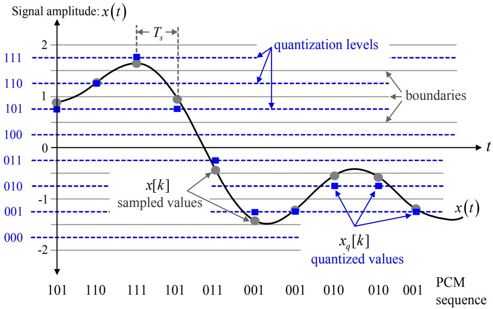
图 5.6: 脉冲编码调制 (PCM) 过程图

“PCM 序列 (PCM sequence)”。如果采样频率为 $f_s$ 赫兹/秒（或每秒 $f_s$ 个采样值），那么 PCM 序列的比特率 $R_b$（即数据传输率）为：
$$
R_b = \frac{1}{T_b} = k f_s \tag{5.10}
$$
单位为比特每秒 (bps)，其中 $T_b$ 为比特周期，$k$ 为每个采样值所用的比特数。图 5.6 展示了 PCM 过程的工作特点。

**例 5.4**: 在电话系统中，语音信号的采样频率为 8000 Hz，且每个采样值使用 7 比特量化。那么，电话信道中 PCM 序列的比特率是多少？
**解**: $R_b = 8000 \times 7 = 56,000$ 比特每秒。

接下来的步骤是将得到的 PCM 序列与脉冲信号进行调制，将其转换为 PCM 波形信号 (PCM waveform)。这一步骤通常被称为“线路编码 (line code)”。在实际应用中，PCM 波形有多种形式，例如：不归零码 (NRZ: non-return-to-zero)、差分不归零码 (NRZI: non-return-to-zero interleaved)、曼彻斯特编码 (Manchester) 等 [9]。每种形式都有其各自的优缺点，具体取决于所采用的应用场景。通常，选择某种 PCM 波形信号的衡量标准包括 [9]：

- 信号频谱特性：有助于了解功率谱密度和带宽。
- 比特同步能力。
- 错误检测能力。
- 对干扰和噪声的鲁棒性。
- 电路实现的成本 and 复杂度。

在硬盘驱动器的信号处理系统中，常用的波形格式是 NRZ 和 NRZI（详见 6.2.6 节）。

**例 5.5**: 将语音信号以 $R_b = 36,000$ bps 的比特率进行 PCM 传输。已知要采样的语音信号最高频率为 3200 Hz。请计算可能的采样频率、量化电平数以及每个采样值的比特数。
**解**: 根据采样定理，采样频率必须满足：
$$
f_s \geq 2 f_{\max} = 2(3200) = 6400 \ \mathrm{Hz}
$$
设每个采样值的比特数位 $k$，则有：
$$
k f_s \leq R_b = 36,000 \ \mathrm{bps}
$$
因此，实际采样频率和每个采样值的比特数可通过下式计算：
$$
k \leq \frac{R_b}{f_s} = \frac{36,000}{6,400} = 5.6
$$
假设系统采用 $k = 5$ 比特/采样值，则量化电平数 $L$ 为：
$$
L = 2^k = 2^5 = 32
$$
为了在每个采样值使用 5 比特的情况下达到此要求，采样频率应为：
$$
f_s = \frac{36,000}{5} = 7200 \ \mathrm{Hz}
$$

## 5.1.5 脉冲幅度调制

脉冲幅度调制 (PAM: pulse amplitude modulation) 是一种将数字数据与脉冲信号相结合的调制方法，其结果是一种被称为“PAM 信号 (PAM signal)”的模拟信号。其数学表达式如下：
$$
r(t) = \sum_{k=0}^{\infty} a_k g(t - kT) \tag{5.11}
$$
其中 $a_k \in \mathcal{A}$ 是属于集合 $\mathcal{A}$ 的数字数据，$\mathcal{A}$ 是所有可能数据值的集合，$g(t)$ 是用于调制的脉冲信号，$t$ 为时间，$T$ 为 $a_k$ 的周期。在硬盘驱动器的信号处理系统中，通常仅涉及二进制系统 (binary system)，因此 $|\mathcal{A}| = 2$，其中 $\mathcal{A} = \{0, 1\}$ 或 $\mathcal{A} = \{-1, 1\}$。

图 5.7 展示了脉冲幅度调制的示例。假设脉冲信号为：
$$
g(t) = A \frac{t}{T} \{ u(t) - u(t-T) \}
$$
其中 $u(t)$ 为单位阶跃函数，$A$ 为常数。若数据序列 $\{a_k\} = \{1, -1, 1, -1, -1, 1\}$，则得到的信号 $r(t)$ 形状如图 5.7 所示。在这种情况下，可以发现从波形中能够立即判断发送的是比特 -1 还是比特 1，且 $r(t)$ 没有发生失真。

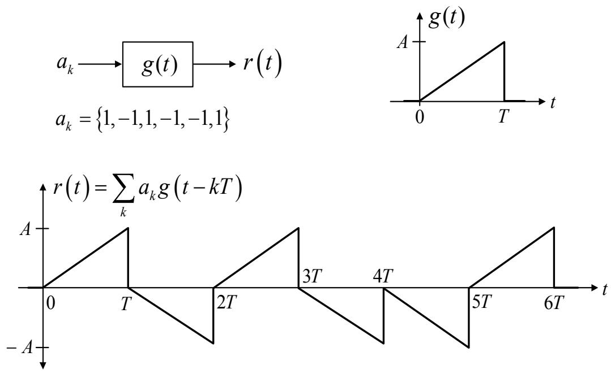
图 5.7: 脉冲幅度调制示例

## 5.1.6 噪声

噪声 (noise) 是系统不需要的信号，因为它会干扰接收端电路检测和解码信息的能力。因此，如果系统中的噪声过多，接收端电路产生的错误也会随之增加。通信系统中常见的噪声有多种类型，在本节中，我们将重点讨论白噪声 (white noise) 和有色噪声 (colored noise)，这两者在硬盘驱动器的信号处理系统中非常常见。

### 白噪声

在离散时间系统 (discrete-time system) 中，白噪声是指一个互不相关 (uncorrelated) 的随机变量序列 $\{n_k\}$，其自相关函数为 [35]：
$$
R_{nn}(k) = \frac{N_0}{2} \delta[k] = \begin{cases} N_0/2, & k=0 \\ 0, & \text{else} \end{cases} \tag{5.12}
$$
其中 $N_0/2$ 是噪声的双边功率谱密度 (two-sided power spectrum density)，单位为瓦特/赫兹 (W/Hz)，$\delta[k]$ 是克罗内克 $\delta$ 函数 (Kronecker delta function)，其傅里叶变换为：
$$
G_n(e^{j\omega}) = \mathscr{F}[R_{nn}(k)] = \sum_{k=-\infty}^{\infty} R_{nn}(k) e^{-j\omega k} = \frac{N_0}{2} \tag{5.13}
$$
其中 $G_n(e^{j\omega})$ 是 $n_k$ 的功率谱密度，$\omega = 2\pi f$ 是角频率，单位为弧度 (radian)。公式 (5.13) 表明 $G_n(e^{j\omega})$ 与频率无关，即对于所有 $-\infty < f < \infty$，都有 $G_n(e^{j\omega}) = N_0/2$。这意味着白噪声会对所有频带的通信系统产生影响，且噪声 $n_k$ 的总功率为无穷大。因此，通信系统的接收端电路必须使用低通滤波器 (low-pass filter) 来使噪声功率变得有限，即不允许截止频率 (cut-off frequency) 之外的噪声进入系统。虽然白噪声在通信系统中普遍存在，但由于其统计特性确定且固定，因此较为容易处理。

由于白噪声仅由公式 (5.12) 定义，因此一个互不相关的实数高斯随机变量序列也被视为一种白噪声过程 (white noise process)，通常被称为“加性高斯白噪声 (white Gaussian noise)”，其概率密度函数遵循公式 (4.28)。白噪声的一个典型例子是热噪声 (thermal noise)。

### 有色噪声

有色噪声是指任何不具备白噪声特性的噪声。有色噪声的重要特性是其各个采样值之间存在相关性 (correlation)。若令 $w_k$ 为有色噪声，其自相关函数为：
$$
R_{ww}(k) \neq 0, \quad \text{for } k \neq 0 \tag{5.14}
$$
这种相关性具有多种用途，例如可以帮助预测未来的采样值或辅助分析系统的响应（详见 2.7.3 节）。

有色噪声在硬盘驱动器的信号处理系统中非常普遍。因为当白噪声通过任何滤波器（如均衡器）时，输出结果将变为有色噪声，且其频谱与该滤波器的频谱相似。由于有色噪声对数据检测电路的影响极大，因此研究人员提出了许多处理方法。例如，在某些硬盘驱动器接收端电路中使用了噪声预测器 (noise predictor)，这种电路被称为“噪声预测最大似然 (NPML: noise-predictive maximum-likelihood) 检测器”，详见《数字数据存储信号处理 第 2 卷：接收端设计》一书的第 6 章 [6]。

## 5.1.7 无失真传输

无失真传输 (distortionless transmission) 发生在信道的输出信号仍保持与输入信号相同的“形状 (shape)”时，但输出信号的幅度可能会发生变化或出现时间延迟 [39]。通常，通信系统（如电话系统和无线通信系统）的信道可被视为一个带限线性滤波器 (band-limited linear filter)，其冲激响应为 $g(t)$，频率响应为：
$$
G(f) = |G(f)| \angle G(f) \tag{5.15}
$$
其中 $|G(f)|$ 是 $G(f)$ 的幅度谱，$\angle G(f)$ 是 $G(f)$ 的相位谱。因此可以得出结论，该信道不产生失真的条件是信道具有恒定的幅度谱和线性相位谱，即：
$$
|G(f)| = |K| \tag{5.16}
$$
$$
\angle G(f) = -2\pi t_d f \pm m 180^\circ \tag{5.17}
$$
其中 $K$ 和 $m$ 为常数，$t_d$ 为延迟量。

通常，信号在传输过程中会遇到失真，失真可分为：
1) **线性失真 (linear distortion)**，进一步分为：
   1.1) 幅度失真 (amplitude distortion)：当 $|G(f)| \neq |K|$ 时发生。
   1.2) 相位失真 (phase distortion)：当 $\angle G(f) \neq -2\pi t_d f \pm m 180^\circ$ 时发生。
2) **非线性失真 (nonlinear distortion)**：当系统中存在非线性电子元件或部件时发生。

在实际应用中，线性失真的影响可以通过使用均衡器 (equalizer) 来消除或减轻（详见 5.6 节），而处理非线性失真则需要采用更先进的技术 [39]。

**例 5.6**: 考虑一个无失真的基带模拟传输系统，系统中存在双边功率谱密度为 $N_0/2$ 的白噪声 $n(t)$，其中 $N_0 = 10^{-9}$ 瓦特/赫兹。发送的信号是带宽为 4000 赫兹的语音信号。接收端使用一个截止频率为 8000 赫兹的低通滤波器来减少噪声。假设该低通滤波器的频率响应为：
$$
H_{LP}(\omega) = \frac{1}{1 + j(\omega/\omega_0)}
$$

图 5.8: 低通滤波器的频率响应

当 $\omega_0 = 2\pi(8000)$ 弧度时（如图 5.8 所示），请计算该低通滤波器输出端的噪声功率。

**解**: 低通滤波器输出端的噪声功率可通过公式 (4.56) 计算，即：
$$
\begin{array}{rcl} 
P_n & = & E[n^2(t)] \\ 
& = & \displaystyle \frac{1}{2\pi} \int_{-\infty}^{\infty} \frac{N_0}{2} |H_{LP}(\omega)|^2 d\omega \\ 
& = & \displaystyle \frac{N_0}{2} \frac{1}{2\pi} \int_{-\infty}^{\infty} \frac{1}{1 + (\omega/\omega_0)^2} d\omega \\ 
& = & \displaystyle \frac{N_0}{2} \omega_0 \\ 
& = & \displaystyle \frac{10^{-9}}{2} \times 2\pi(8000) \\ 
& = & \displaystyle 25.132 \times 10^{-6} \ \mathrm{W} 
\end{array}
$$
因此，低通滤波器输出端的噪声功率为 $25.132 \times 10^{-6}$ 瓦特。

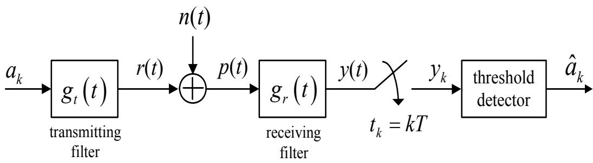
图 5.9: 加性高斯白噪声中的数据检测通信系统模型

## 5.2 加性高斯白噪声中的数据检测

本节将介绍在仅存在加性高斯白噪声 (AWGN: additive white Gaussian noise) 的通信系统中的数据检测 (data detection) 步骤，如图 5.9 所示。其中，$a_k \in \{a_0, a_1\}$ 为比特输入数据，比特周期为 $T$，$\{a_0, a_1\}$ 的取值为 $\{0, 1\}$ 或 $\{-1, 1\}$。$g_t(t)$ 为用于调制的脉冲信号（或可视为信道的冲激响应），其有效时间范围为 $0 \le t \le T$，这意味着不会产生码间干扰 (ISI)。因此，接收端电路接收到的信号为：
$$
p(t) = r(t) + n(t) \tag{5.18}
$$
其中 $r(t) = \sum_k a_k g_t(t - kT)$ 是发送的数据脉冲信号，$n(t)$ 是均值为零且双边功率谱密度为 $N_0/2$ 的加性高斯白噪声。随后，信号 $p(t)$ 通过一个冲激响应为 $g_r(t)$ 的滤波器，并在 $t = kT$（$k$ 为整数）时刻进行采样。采样得到的数值 $y_k$ 被发送至阈值检测器 (threshold detector)，用于对数据 $a_k$ 进行译码，即求出 $\hat{a}_k$。

### 5.2.1 匹配滤波器 (Matched Filter)

匹配滤波器 (matched filter) 是一种线性接收滤波器 (receiving filter)，其设计旨在与接收到的每种波形 (waveform) 相匹配，从而使滤波器输出端的信噪比 (SNR) 最大化。考虑仅发送单个脉冲 (isolated pulse) 的情况（即该脉冲仅与单个数据比特 $a_k$ 相对应），此时信号 $r(t)$ 可以用以下数学表达式表示：
$$
r(t) = \begin{cases} r_0(t), & 0 \leq t \leq T \quad \text{for } a_k = a_0 \\ r_1(t), & 0 \leq t \leq T \quad \text{for } a_k = a_1 \end{cases} \tag{5.19}
$$
根据图 5.9 的模型，在 $t = T$ 时刻，采样电路的输出数据为：
$$
y(T) = a(T) + n_0(T) \tag{5.20}
$$
为了方便在该节中进行阐述，可将其简写为：
$$
y = a_k + n_0 \tag{5.21}
$$
其中 $a_k = a(T)$ 是所需信号的分量，$n_0 = n_0(T)$ 是噪声分量。可以证明，$n_0$ 是一个均值为零、方差为 $\sigma^2$ 的高斯随机变量，即 $n_0 \sim \mathcal{N}(0, \sigma^2)$。因此，在 $t = T$ 时刻，采样电路输出端的信噪比 (SNR) 为：
$$
\mathrm{SNR}_T = \frac{a_k^2}{\sigma^2} \tag{5.22}
$$
其中 $a_k^2$ 是所需信号 $a(t)$ 在 $t = T$ 时刻的平均功率。因此，匹配滤波器 $g_r(t) = g_0(t)$ 即为使公式 (5.22) 中的 $\mathrm{SNR}_T$ 达到最大值的滤波器。

由于在采样电路之前的所需信号分量为：
$$
a(t) = \mathcal{F}^{-1} [R(f) G_0(f)] = \int_{-\infty}^{\infty} R(f) G_0(f) e^{j 2\pi f t} df \tag{5.23}
$$
其中 $R(f)$ 是信号 $r(t)$ 的傅里叶变换，$G_0(f)$ 是匹配滤波器 $g_0(t)$ 的傅里叶变换。因此，在 $t = T$ 时刻采样得到的所需信号值为：
$$
a_k = a(T) = \int_{-\infty}^{\infty} R(f) G_0(f) e^{j 2\pi f T} df \tag{5.24}
$$
同样地，噪声 $n_0$ 的平均功率为：
$$
\sigma^2 = \int_{-\infty}^{\infty} N(f) |G_0(f)|^2 df = \frac{N_0}{2} \int_{-\infty}^{\infty} |G_0(f)|^2 df \tag{5.25}
$$
其中 $N(f) = N_0/2$ 是噪声 $n(t)$ 的傅里叶变换。将公式 (5.24) 中的 $a_k$ 和公式 (5.25) 中的 $\sigma^2$ 代入公式 (5.22)，可得：
$$
\mathrm{SNR}_T = \frac{\left| \int_{-\infty}^{\infty} R(f) G_0(f) e^{j 2\pi f T} df \right|^2}{\frac{N_0}{2} \int_{-\infty}^{\infty} |G_0(f)|^2 df} \tag{5.26}
$$
根据施瓦茨不等式 (Schwarz's inequality) [9]：
$$
\left| \int_{-\infty}^{\infty} f_1(x) f_2(x) dx \right|^2 \le \int_{-\infty}^{\infty} |f_1(x)|^2 dx \int_{-\infty}^{\infty} |f_2(x)|^2 dx \tag{5.27}
$$
其中 $f_1(x)$ 和 $f_2(x)$ 是任意函数。当且仅当
$$
f_1(x) = K f_2^*(x) \tag{5.28}
$$
时，公式 (5.27) 等号成立。其中 $K$ 为常数，$(\cdot)^*$ 表示共轭复数 (complex conjugate) 操作。若令 $f_1(x) = G_0(f)$ 且 $f_2(x) = R(f) e^{j 2\pi f T}$，则有：
$$
\left| \int_{-\infty}^{\infty} R(f) G_0(f) e^{j 2\pi f T} df \right|^2 = \int_{-\infty}^{\infty} |R(f)|^2 df \int_{-\infty}^{\infty} |G_0(f)|^2 df \tag{5.29}
$$
当且仅当
$$
G_0(f) = K R^*(f) e^{-j 2\pi f T} \tag{5.30}
$$
随后，将公式 (5.29) 代入公式 (5.26)，可得 $\mathrm{SNR}_T$ 的最大值为：
$$
\begin{array}{rcl} 
\mathrm{SNR}_{T, \max} & = & \displaystyle \frac{\int_{-\infty}^{\infty} |R(f)|^2 df \int_{-\infty}^{\infty} |G_0(f)|^2 df}{\frac{N_0}{2} \int_{-\infty}^{\infty} |G_0(f)|^2 df} \\
& = & \displaystyle \frac{2}{N_0} \int_{-\infty}^{\infty} |R(f)|^2 df \\
& = & \displaystyle \frac{2E}{N_0} 
\end{array} \tag{5.31}
$$
其中
$$
E = \int_{-\infty}^{\infty} |R(f)|^2 df = \int_{-\infty}^{\infty} |R(t)|^2 dt \tag{5.32}
$$
是信号 $r(t)$ 的能量。可见，$\mathrm{SNR}_T$ 的最大值取决于信号能量和噪声的平均功率，而与脉冲信号 $r(t)$ 的形状无关。

因此，匹配滤波器的频率响应符合公式 (5.30)，其傅里叶逆变换为：
$$
g_0(t) = \mathcal{F}^{-1} [G_0(f)] = \mathcal{F}^{-1} [K R^*(f) e^{-j 2\pi f T}] \tag{5.33}
$$
由于信号 $r(t)$ 是实函数，因此公式 (5.33) 可以写为：
$$
g_0(t) = K r(T - t) = r(T - t) \tag{5.34}
$$
在不丢失信息的情况下，可设 $K = 1$。由此可见，匹配滤波器 $g_0(t)$ 即为将脉冲信号 $r(t)$ 进行折叠 (folding) 并延迟 $T$ 秒后的信号。图 5.10 展示了在给定信号 $r(t)$ 时如何求得匹配滤波器 $g_0(t)$ 的示例。对于二进制通信系统，使用匹配滤波器的接收端电路结构如图 5.11 所示。

### 5.2.2 相关器 (Correlator)

考虑图 5.9 中的模型，接收滤波器的输出信号 $y(t)$ 可以用以下数学表达式表示：
$$
y(t) = p(t) * g_r(t) = \int_{-\infty}^{\infty} p(\tau) g_r(t - \tau) d\tau \tag{5.35}
$$
其中 $*$ 为卷积运算符 (convolution operator)。如果系统使用匹配滤波器作为接收滤波器，即 $g_r(t) = g_0(t)$，将公式 (5.34) 中的 $g_0(t) = r(T - t)$ 代入公式 (5.35)，可得：
$$
y(t) = \int_{-\infty}^{\infty} p(\tau) r(T - [t - \tau]) d\tau \tag{5.36}
$$
在 $t = T$ 时刻，可得：
$$
y(T) = \int_{-\infty}^{\infty} p(\tau) r(\tau) d\tau \tag{5.37}
$$
公式 (5.37) 通常被称为 $p(t)$ 与 $r(t)$ 之间的相关计算 (correlation)。基于公式 (5.37) 构建的接收端电路被称为“相关器 (correlator)”。对于二进制通信系统，发送数据的信号有两种，即 $r_0(t)$ 和 $r_1(t)$。因此，使用相关器的接收端电路结构如图 5.12 所示。由此可见，匹配滤波器也可以构建为相关器的形式（对比图 5.11 和图 5.12）。

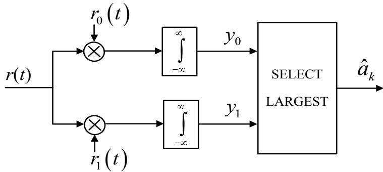
图 5.12: 使用相关器的二进制通信系统接收端电路结构

### 5.2.3 判定规则

根据图 5.9 中的通信系统模型，当匹配滤波器 $g_0(t)$ 被用作接收滤波器时，采样电路在 $t = T$ 时刻的输出数据将符合公式 (5.21)，即：
$$
y = a_k + n_0 \tag{5.38}
$$
其中 $a_k \in \{a_0, a_1\}$ 是所需的比特数据，$n_0 \sim \mathcal{N}(0, \sigma^2)$ 是加性高斯白噪声，其概率密度函数为：
$$
p(n) = \frac{1}{\sqrt{2\pi\sigma^2}} \exp \left\{ - \frac{n^2}{2\sigma^2} \right\} \tag{5.39}
$$
其中 $\exp\{\cdot\}$ 为指数函数。根据公式 (5.38)，在给定 $a_k$ 的条件下，$y$ 成为一个高斯随机变量，其均值为 $a_0$ 或 $a_1$，方差为 $\sigma^2$。因此，条件概率密度函数 (conditional probability density function) $p(y | r_0)$ 表示在给定符号 $r_0 = r_0(t)|_{t=T} = r_0(T)$ 被发送（对应于 $a_0$）的情况下，随机变量的概率密度函数，其值为：
$$
p(y | r_0) = \frac{1}{\sqrt{2\pi\sigma^2}} \exp \left[ - \frac{(y - a_0)^2}{2\sigma^2} \right] \tag{5.40}
$$

同样地，$p(y | r_1)$ 表示在给定符号 $r_1 = r_1(t)|_{t=T} = r_1(T)$ 被发送（对应于 $a_1$）的情况下，随机变量的概率密度函数，其值为：
$$
p(y | r_1) = \frac{1}{\sqrt{2\pi\sigma^2}} \exp \left[ - \frac{(y - a_1)^2}{2\sigma^2} \right] \tag{5.41}
$$

若定义：
- $H_0$ 为发送符号 $r_0 = r_0(T)$ 的假设（对应于 $a_k = a_0$）
- $H_1$ 为发送符号 $r_1 = r_1(T)$ 的假设（对应于 $a_k = a_1$）

阈值检测器将对数据 $y$ 进行解码，以根据以下判定规则决定发送端发送的比特数据是 $a_0$ 还是 $a_1$：
$$
y_k \stackrel{H_1}{\gtrless} \gamma \tag{5.42}
$$
其中 $\gamma$ 为阈值电平。在设计阈值检测器时，系统设计者的目标是寻找最佳的 $\gamma$ 值，以使检测器输出端的错误概率最小化，或者寻找使给定 $y$ 时 $r_i$（$i=0$ 或 1）的条件概率密度函数
$$
p(r_i | y)
$$
最大化的 $\gamma$。因此，阈值检测器采用的判定规则为：
$$
p(r_1 | y) \stackrel{H_1}{\gtrless} p(r_0 | y) \tag{5.43}
$$
采用公式 (5.43) 判定规则的检测器被称为“MAP（最大后验概率，maximum a-posteriori probability）检测器”。

根据贝叶斯定理 (Bayes' theorem)，即 $p(a | b) = p(b | a) p(a) / p(b)$，公式 (5.43) 可以重新写为：
$$
\frac{p(y | r_1) p(r_1)}{p(y)} \stackrel{H_1}{\gtrless} \frac{p(y | r_0) p(r_0)}{p(y)} \tag{5.44}
$$
其中 $p(r_0)$ 和 $p(r_1)$ 分别是发送符号 $r_0$ 和 $r_1$ 的先验概率密度函数 (a-priori probability density function)。公式 (5.44) 可整理为：
$$
\frac{p(y | r_1)}{p(y | r_0)} \stackrel{H_1}{\gtrless} \frac{p(r_0)}{p(r_1)} \tag{5.45}
$$
公式 (5.45) 中的判定规则通常被称为“似然比测试 (likelihood ratio test)”。

在 $p(r_0) = p(r_1)$ 的情况下，即发送端发送符号 $r_0$ 或 $r_1$ 的概率相等，公式 (5.45) 可简化为：
$$
p(y | r_1) \stackrel{H_1}{\gtrless} p(y | r_0) \tag{5.46}
$$
采用公式 (5.46) 判定规则的检测器被称为“ML（最大似然，maximum likelihood）检测器”。将公式 (5.40) 中的 $p(y | r_0)$ 和公式 (5.41) 中的 $p(y | r_1)$ 代入公式 (5.46)，得：
$$
\begin{array}{rl}
\frac{1}{\sqrt{2\pi\sigma^2}} \exp \left\{ - \frac{(y - a_1)^2}{2\sigma^2} \right\} & \stackrel{H_1}{\gtrless} \frac{1}{\sqrt{2\pi\sigma^2}} \exp \left\{ - \frac{(y - a_0)^2}{2\sigma^2} \right\} \\
\exp \left\{ - \frac{(y - a_1)^2}{2\sigma^2} \right\} & \stackrel{H_1}{\gtrless} \exp \left\{ - \frac{(y - a_0)^2}{2\sigma^2} \right\}
\end{array} \tag{5.47}
$$
对公式 (5.47) 两边取自然对数 $\ln(\cdot)$，得：
$$
\begin{array}{rl}
- \frac{(y - a_1)^2}{2\sigma^2} & \stackrel{H_1}{\gtrless} - \frac{(y - a_0)^2}{2\sigma^2} \\
- \frac{y^2 - 2ya_1 + a_1^2}{2\sigma^2} & \stackrel{H_1}{\gtrless} - \frac{y^2 - 2ya_0 + a_0^2}{2\sigma^2} \\
2y(a_1 - a_0) & \stackrel{H_1}{\gtrless} a_1^2 - a_0^2 \\
y & \stackrel{H_1}{\gtrless} \frac{a_1 + a_0}{2}
\end{array} \tag{5.48}
$$

(a) $p(r_0) = p(r_1)$
(b) $p(r_0) < p(r_1)$
图 5.13: 情况 (a) $p(r_0) = p(r_1)$ 和 (b) $p(r_0) < p(r_1)$ 时的阈值 $\gamma$

因此，使检测器输出端错误概率最小的最佳阈值 $\gamma$ 为：
$$
\gamma = \frac{a_0 + a_1}{2} \tag{5.49}
$$

在 $p(r_0) \neq p(r_1)$ 的情况下，最佳阈值 $\gamma$ 根据公式 (5.45) 还取决于 $p(r_0)$ 和 $p(r_1)$。图 5.13 展示了 $p(r_0) = p(r_1)$ 和 $p(r_0) < p(r_1)$ 时的阈值示例。从图 5.13(a) 可以看出，当 $p(r_0) = p(r_1)$ 时，$\gamma$ 正好位于 $a_0$ 和 $a_1$ 的正中间。而在图 5.13(b) 中，当 $p(r_0) < p(r_1)$ 时，意味着发送端发送符号 $r_1$ 的概率高于 $r_0$。因此，$\gamma$ 距离 $a_1$ 比距离 $a_0$ 更远，从而增加了 $y(T)$ 落在 $a_1$ 区域（即 $y(T) > \gamma$）的概率，使得阈值检测器更有可能判定 $y(T)$ 为 $a_1$。然而在实践中，通常假设通信系统发送数据的概率为 $p(r_0) = p(r_1)$，使数据具有随机变量的特性，从而简化系统分析。

### 5.2.4 概率误差计算

参考图 5.13(a)，当 $p(r_0) = p(r_1)$ 时，接收端在以下情况下会发生错误：系统发送信号 $r_0(t)$，但阈值检测器判定为发送了 $a_1$（即系统内部的噪声导致 $y(T) > \gamma$）。因此：
$$
p(e | r_0) = p(H_1 | r_0) = \int_{\gamma}^{\infty} p(y | r_0) dy \tag{5.50}
$$

同样地，如果系统发送信号 $r_1(t)$，但阈值检测器判定为发送了 $a_0$（即系统噪声导致 $y(T) < \gamma$），也会发生错误。此时的错误概率为：
$$
p(e | r_1) = p(H_0 | r_1) = \int_{-\infty}^{\gamma} p(y | r_1) dy \tag{5.51}
$$

因此，整个系统（对于二进制系统）的总错误概率，或称比特误码率 (Bit Error Rate, BER)，可由下式求得：
$$
P_e = \sum_{i=0}^{1} p(e | r_i) p(r_i) = p(e | r_0) p(r_0) + p(e | r_1) p(r_1) \tag{5.52}
$$

在 $p(r_0) = p(r_1)$ 的情况下，公式 (5.52) 可简化为：
$$
P_e = \frac{1}{2} p(e | r_0) + \frac{1}{2} p(e | r_1) \tag{5.53}
$$

由于概率密度函数的对称性，$p(e | r_0) = p(e | r_1)$，因此：
$$
P_e = p(e | r_1) = p(e | r_0) = \int_{\gamma}^{\infty} p(y | r_0) dy \tag{5.54}
$$

将公式 (5.49) 中的 $\gamma$ 和公式 (5.40) 中的 $p(y | r_0)$ 代入公式 (5.54)，得：
$$
P_e = \int_{\frac{a_0 + a_1}{2}}^{\infty} \frac{1}{\sqrt{2\pi\sigma^2}} \exp \left[ - \frac{(y - a_0)^2}{2\sigma^2} \right] dy \tag{5.55}
$$

通过变量代换 $u = (y - a_0) / \sigma$，则 $dy = \sigma du$，公式 (5.55) 可整理为：
$$
\begin{array}{lll}
P_e & = & \displaystyle \int_{\frac{a_1 - a_0}{2\sigma}}^{\infty} \frac{1}{\sqrt{2\pi}} \exp \left[ - \frac{u^2}{2} \right] du \\
& = & \displaystyle Q \left( \frac{a_1 - a_0}{2\sigma} \right)
\end{array} \tag{5.56}
$$
其中 $Q$ 函数定义为 $Q(x) = \frac{1}{\sqrt{2\pi}} \int_{x}^{\infty} e^{-u^2/2} du$ [9, 36, 37]，且 $\sigma^2 = N_0 / 2$。

根据公式 (5.56)，要降低 $P_e$，需要增大 $(a_1 - a_0) / \sigma$。这可以通过设计一个匹配 $r_1(t) - r_0(t)$ 信号的接收滤波器来实现。因此，$t = T$ 时刻的信噪比 (SNR) 可以写为：
$$
\mathrm{SNR}_T = \frac{(a_1 - a_0)^2}{\sigma^2} = \frac{2 E_d}{N_0} \tag{5.57}
$$
其中 $\sigma^2 = N_0 / 2$ 是采样电路输出端噪声的平均功率，$E_d$ 是发送信号之差的能量，定义为：
$$
E_d = \int_{-\infty}^{\infty} \{ r_1(t) - r_0(t) \}^2 dt \tag{5.58}
$$

因此，公式 (5.56) 中的错误概率可以重新写为：
$$
P_e = Q \left( \frac{1}{2} \sqrt{\mathrm{SNR}_T} \right) = Q \left( \sqrt{\frac{E_d}{2N_0}} \right) \tag{5.59}
$$

公式 (5.58) 中发送信号之差的能量 $E_d$ 可以展开为：
$$
E_d = \int_0^T r_1^2(t) dt + \int_0^T r_0^2(t) dt - 2 \int_0^T r_1(t) r_0(t) dt \tag{5.60}
$$

其中，公式 (5.60) 右侧的前两项分别是信号 $r_1(t)$ 和 $r_0(t)$ 的能量（即 $E_{r1}$ 和 $E_{r0}$）。在实践中，计算通常引用“平均比特能量 (average bit energy)” $E_b$，其定义为：
$$
E_b = \frac{1}{2} \left\{ \int_0^T r_1^2(t) dt + \int_0^T r_0^2(t) dt \right\} \tag{5.61}
$$

公式 (5.60) 右侧的最后一项与互相关系数 (cross-correlation coefficient) 相关，如下所示：
$$
\rho = \frac{1}{E_b} \int_0^T r_1(t) r_0(t) dt \tag{5.62}
$$

其中 $-1 \le \rho \le 1$。将公式 (5.61) 和 (5.62) 代入公式 (5.60)，可得：
$$
E_d = 2E_b - 2E_b \rho = 2E_b(1 - \rho) \tag{5.63}
$$

图 5.14: 对称信号 (Antipodal signal) 的位置

因此，公式 (5.59) 可以重新写为：
$$
P_e = Q \left( \sqrt{\frac{E_b(1 - \rho)}{N_0}} \right) \tag{5.64}
$$

## 对极信号的误码率 (BER)

如果二进制信号满足 $r_0(t) = -r_1(t)$（即 $a_0 = -a_1$），这种信号形式被称为“对极信号 (antipodal signal)”，如图 5.14 所示。在这种情况下，比特能量为 $E_{r0} = E_{r1} = \sqrt{E_b}$，且互相关系数 $\rho$ 为：
$$
\rho = \frac{1}{E_b} \int_0^T r_1(t) r_0(t) dt = - \frac{1}{E_b} \int_0^T r_1^2(t) dt = -1
$$
因此，根据公式 (5.64)，使用对极信号传输数据的通信系统的 BER 为：
$$
P_e = Q \left( \sqrt{\frac{E_b(1 - (-1))}{N_0}} \right) = Q \left( \sqrt{\frac{2E_b}{N_0}} \right) \tag{5.65}
$$
由公式 (5.65) 可以看出，系统的 BER 仅取决于 $E_b/N_0$ 的值，而与发送信号 $a_0$ 和 $a_1$ 的具体波形无关。

此外，BER 也可以用数据点 $a_0$ 和 $a_1$ 之间的距离来表示。如图 5.14 所示，数据点 $a_0$ 和 $a_1$ 之间的距离为 $d_{01} = 2\sqrt{E_b}$，因此 $E_b = d_{01}^2 / 4$。

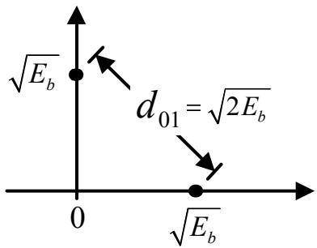
图 5.15: 正交信号的位置

将此 $E_b$ 代入公式 (5.65)，得：
$$
P_e = Q \left( \sqrt{\frac{d_{01}^2}{2N_0}} \right) = Q \left( \sqrt{\frac{E_d}{2N_0}} \right) \tag{5.66}
$$
其中 $d_{01}^2 = E_d = \int_{-\infty}^{\infty} \{ r_1(t) - r_0(t) \}^2 dt$。

## 正交信号的误码率 (BER)

正交信号 (orthogonal signal) 是指满足比特能量 $E_{r0} = E_{r1} = \sqrt{E_b}$ 且互相关系数 $\rho$ 为以下值的二进制信号 $r_0(t)$ 和 $r_1(t)$：
$$
\rho = \frac{1}{E_b} \int_0^T r_1(t) r_0(t) dt = 0
$$
如图 5.15 所示，这意味着两个信号之间成 $90^\circ$ 角。在这种情况下，$d_{01} = \sqrt{2E_b}$，因此使用正交信号传输数据的通信系统的 BER 为：
$$
P_e = Q \left( \sqrt{\frac{d_{01}^2}{2N_0}} \right) = Q \left( \sqrt{\frac{E_d}{2N_0}} \right) = Q \left( \sqrt{\frac{E_b}{N_0}} \right) \tag{5.67}
$$

## BER 计算示例

**示例 5.7** 考虑一个二进制通信系统，发送的信号 $r_0(t)$ 和 $r_1(t)$ 波形如图 5.16 所示。信号 $r(t)$ 受到双边功率谱密度为 $N_0/2$ 的 AWGN 干扰，并经过匹配滤波器过滤，最后在 $t = T$ 时刻进行采样。已知 $N_0 = 10^{-12} \text{ W/Hz}$，请计算该系统的 BER。

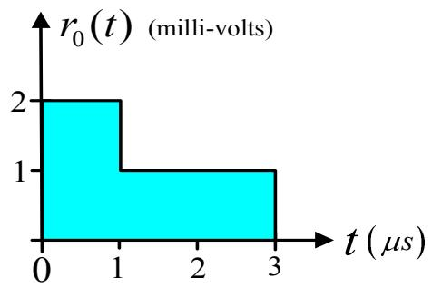
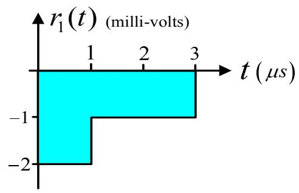
图 5.16: 通信系统中使用的信号 $r_0(t)$ 和 $r_1(t)$ 的波形

**解：** 从图 5.16 的信号波形可以看出，$r_0(t) = -r_1(t)$，这表明该通信系统使用了对极信号传输数据。由于对极信号的 BER 由公式 (5.65) 给出，即：
$$
P_e = Q \left( \sqrt{\frac{2E_b}{N_0}} \right)
$$
因此，在计算 $P_e$ 之前，需要先求出平均比特能量 $E_b$。首先计算信号 $r_0(t)$ 的能量：
$$
\begin{array}{lll} 
E_{r0} & = & \displaystyle \int_0^{3 \times 10^{-6}} |r_0(t)|^2 dt \\
& = & (2 \times 10^{-3})^2 (1 \times 10^{-6}) + (1 \times 10^{-3})^2 (2 \times 10^{-6}) \\
& = & 6 \times 10^{-12} \text{ Joules}
\end{array}
$$
由于 $r_0(t) = -r_1(t)$，因此信号 $r_1(t)$ 的能量与 $r_0(t)$ 相同，即 $E_{r1} = E_{r0}$。因此：
$$
E_b = \frac{E_{r0} + E_{r1}}{2} = 6 \times 10^{-12} \text{ Joules}
$$
将 $E_b$ 代入 $P_e$ 公式得：
$$
\begin{array}{lll} 
P_e & = & Q \left( \sqrt{\frac{2(6 \times 10^{-12})}{10^{-12}}} \right) \\
& = & Q(\sqrt{12}) \\
& = & 0.000266
\end{array}
$$
由此可见，系统的 BER 与信号 $r_0(t)$ 和 $r_1(t)$ 的具体波形无关。只要 $r_0(t)$ 和 $r_1(t)$ 的能量相等，无论其波形如何，系统的 BER 保持不变。

**示例 5.8** 考虑一个使用单极信号 (unipolar signaling) 的二进制通信系统，其中：
$$
\begin{array}{rcl} 
r_0(t) & = & 0, \quad 0 \le t \le T \\
r_1(t) & = & A, \quad 0 \le t \le T 
\end{array}
$$
其中 $A$ 为常数。图 5.17 展示了与数据序列 $\{1, 0, 1, 1, 0, 1, 0\}$ 相对应的信号 $r(t)$ 示例。信号 $r(t)$ 受到双边功率谱密度为 $N_0/2$ 的 AWGN 干扰，并经过匹配滤波器过滤，最后在 $t = T$ 时刻进行采样。请用 $Q$ 函数表示该系统的 BER。

图 5.17: 使用单极信号（或正交信号）时与数据序列 $\{1, 0, 1, 1, 0, 1, 0\}$ 相对应的信号 $r(t)$

**解：** 由于 $r_0(t)$ 和 $r_1(t)$ 满足 $\rho = \int_0^T r_1(t) r_0(t) dt = 0$，因此它们是正交信号。对于正交信号，其 BER 由公式 (5.67) 给出，即：
$$
P_e = Q \left( \sqrt{\frac{E_d}{2N_0}} \right) = Q \left( \sqrt{\frac{A^2 T}{2N_0}} \right)
$$
其中，发送信号之差的能量 $E_d$ 为：
$$
E_d = \int_0^T (A - 0)^2 dt = A^2 T
$$
同样地，BER 也可以通过平均比特能量 $E_b$ 来计算。根据公式 (5.67)：
$$
P_e = Q \left( \sqrt{\frac{E_b}{N_0}} \right) = Q \left( \sqrt{\frac{A^2 T}{2N_0}} \right)
$$
其中 $E_b = (E_{r0} + E_{r1}) / 2 = A^2 T / 2$，因为 $E_{r0} = 0$ 且 $E_{r1} = \int_0^T A^2 dt = A^2 T$。

**示例 5.9** 考虑一个使用双极信号 (bipolar signaling) 的二进制通信系统，其中：
$$
\begin{array}{rlr} 
r_0(t) & = & -A, \quad 0 \le t \le T \\
& & \\
r_1(t) & = & A, \quad 0 \le t \le T 
\end{array}
$$
其中 $A$ 为常数。图 5.18 展示了与数据序列 $\{1, 0, 1, 1, 0, 1, 0\}$ 相对应的信号 $r(t)$ 示例。信号 $r(t)$ 受到双边功率谱密度为 $N_0/2$ 的 AWGN 干扰，并经过匹配滤波器过滤，最后在 $t = T$ 时刻进行采样。请用 $Q$ 函数表示该系统的 BER。

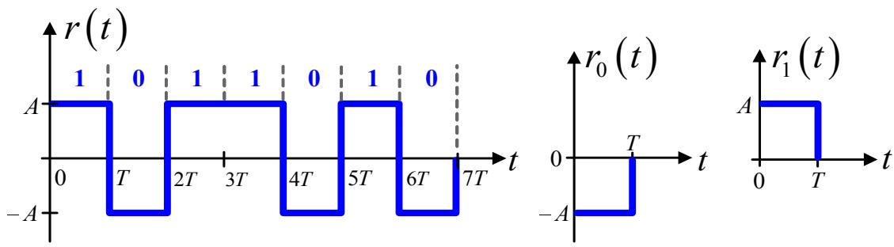
图 5.18: 使用双极信号（或对极信号）时与数据序列 $\{1, 0, 1, 1, 0, 1, 0\}$ 相对应的信号 $r(t)$

**解：** 由于 $r_0(t) = -r_1(t)$，因此这两个信号是对极信号。对极信号的 BER 可由公式 (5.66) 给出，即：
$$
P_e = Q \left( \sqrt{\frac{E_d}{2N_0}} \right) = Q \left( \sqrt{\frac{2A^2 T}{N_0}} \right)
$$
其中，发送信号之差的能量 $E_d$ 为：
$$
E_d = \int_0^T [A - (-A)]^2 dt = (2A)^2 T = 4A^2 T
$$
同样地，BER 也可以通过平均比特能量 $E_b$ 来计算。根据公式 (5.65)：
$$
P_e = Q \left( \sqrt{\frac{2E_b}{N_0}} \right) = Q \left( \sqrt{\frac{2A^2 T}{N_0}} \right)
$$
其中 $E_b = (E_{r0} + E_{r1}) / 2 = A^2 T$，因为 $E_{r0} = E_{r1} = \int_0^T A^2 dt = A^2 T$。

通过示例 5.8 和 5.9 可以看出，使用双极信号的通信系统（$P_e = Q(\sqrt{2E_b/N_0})$）比使用单极信号的系统（$P_e = Q(\sqrt{E_b/N_0})$）具有更好的 BER 性能。

如图 5.19 所示，这是因为单极信号（即正交信号）在图 5.15 中的位置与双极信号（即对极信号）在图 5.14 中的位置相比，后者的比特距离更大。对极信号的比特距离大于正交信号的比特距离，这意味着检测电路做出错误判断的可能性较低，因此双极信号系统的 BER 低于单极信号系统。

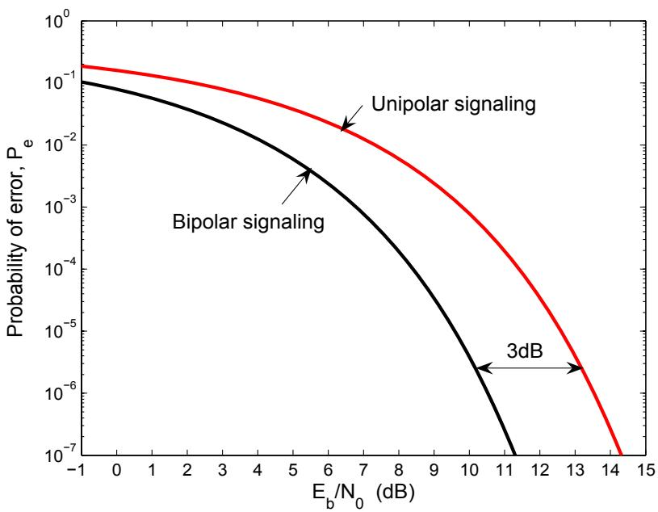
图 5.19: 使用单极信号和双极信号的二进制通信系统的 BER 性能对比

## 5.3 码间干扰

码间干扰 (ISI: intersymbol interference) 是指从发送端发送的第 $k$ 个脉冲信号对相邻脉冲信号（即第 $k-i$ 个脉冲信号，其中 $i$ 为非零整数）产生干扰或叠加的现象。要观察所使用的通信信道 (communication channel) 是否产生 ISI，可以通过向信道发送一个脉冲信号来实现。如果信道输出端的脉冲信号数量超过一个，则表明该信道产生了 ISI。

考虑图 5.20 中的离散时间信道模型。当具有比特周期 (bit period) $T$ 的输入数据序列 $a_k$ 通过由下式定义的信道 $H(D)$ 时：
$$ H(D) = \sum_{k=0}^\nu h_k D^k \tag{5.68} $$
其中 $h_k$ 是信道的第 $k$ 个系数，$\nu$ 是信道的记忆长度 (memory)（或 $\nu+1$ 为信道的抽头数 (tap)），$D$ 是 $T$ 单位的时间延迟运算符。信道的输出数据 $r_k$ 受到 AWGN $n_k$ 的干扰，其均值为零，方差为 $\sigma^2$，记作 $n_k \sim \mathcal{N}(0, \sigma^2)$。随后，检测电路将根据接收到的数据 $y_k$ 对输入数据 $a_k$ 进行估算，即求解 $\hat{a}_k$。

若规定信道 $H(D)$ 为线性时不变系统 (LTI 系统)，则信道输出 (channel output) $r_k$ 是输入数据 $a_k$ 与系统冲激响应 $h_k$ 卷积的结果，即：
$$ \begin{array}{l} r_k \\ \\ = \sum_{i=0}^\nu a_{k-i} h_i \\ = \underbrace{a_k h_0}_{\text{期望信号}} + \underbrace{a_{k-1} h_1 + \ldots + a_{k-\nu} h_\nu}_{\text{ISI}} \end{array} \tag{5.69} $$
由公式 (5.69) 可知，系统仅需要 $a_k h_0$ 项，而其他项则导致了 ISI。因此，可以说当信道的当前输出信号不仅是当前输入信号的函数，而且还是过去和未来输入信号的函数时，就会发生 ISI 现象。例如，由公式 (5.69) 可见，信道输出信号 $r_k$ 是当前输入 $a_k$ 和过去输入 $a_{k-i}$ 的函数。或者可以总结为：如果信道 $H(D)$ 没有记忆（即 $\nu = 0$），则信道输出信号将不存在 ISI。

例如，如图 5.7 所示，由于 $g(t)$ 是仅在 0 到 $T$ 时间段内有值的信道冲激响应（认为该信道没有记忆），当输入数据 $a_k$ 通过该信道时，所得信号 $r(t)$ 中不含 ISI。因此，通过观察信号 $r(t)$ 的波形，可以很容易地识别出在哪个时间段数据 $a_k$ 为比特 1 或比特 -1。但如果信道 $g(t)$ 的信号值超过了时间 $T$，则会导致产生 ISI，如图 5.21 所示。可以看出，由每个 $a_k$ 产生的脉冲信号相互重叠，使得合成信号（灰色曲线）发生畸变。因此，很难判断在哪个时间段输入数据 $a_k$ 的值是什么。

## 5.3.1 检查 ISI 的严重程度

通常，ISI 的严重程度可以通过“眼图 (eye diagram)”来观察。眼图是通过将需要显示的模拟信号在每个时间段内进行重叠绘制而成的，在硬盘驱动器领域，这被称为“比特单元 (bit cell)” $T$。如图 5.22 所示，其结果看起来像人的眼睛，因此被称为眼图。

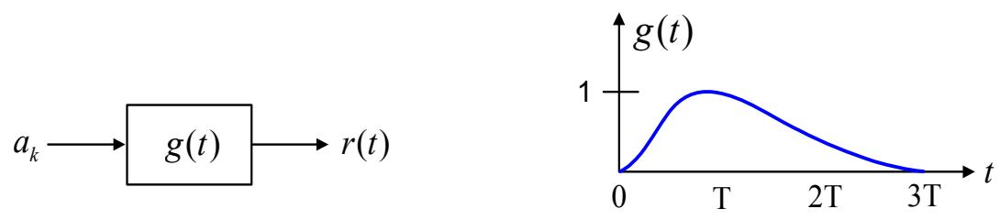

图 5.21: 符号间干扰 (ISI) 产生示例

图 5.22: 眼图构建示例

通过眼图可以了解噪声和 ISI 的严重程度。也就是说，如果眼睛看起来很窄或闭合，则表明噪声和 ISI 非常严重；相反，如果眼睛睁得很大，则表明噪声和 ISI 较轻。

图 5.23: 眼图详解

在实际应用中，眼图可以指示最佳采样时间 (optimum sampling time)、时间误差敏感度 (sensitivity timing error)、峰值畸变 (peak distortion)、噪声裕量 (noise margin) 以及零点交叉畸变 (distortion of zero crossings)，如图 5.23 [9] 所示。可以看到，最佳采样时间位于比特单元的中心点。图 5.24 展示了信道 $H(D) = 1 - D^2$ 在不同 $\text{SNR}$ 情况下的眼图示例（在检测电路的输入端测量），其中 $\text{SNR}$ 定义为：

$$
\mathrm{SNR} = 10 \log_{10} \left( \frac{E_b}{N_0} \right) \tag{5.70}
$$

单位为分贝 (dB: decibel)，其中 $E_b$ 是每比特信号能量，$\sigma^2 = N_0/2$ 是噪声功率。可以看出，当 $\text{SNR}$ 较小时，噪声非常严重，导致眼睛几乎闭合；相反，当系统的 $\text{SNR}$ 较大时，噪声较轻，使得眼睛睁得很大。

(a) 时间

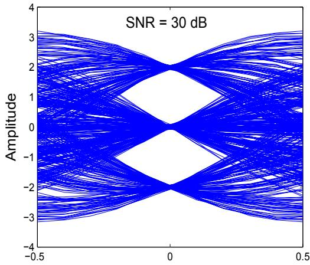
(b) 时间
图 5.24: 信道 $H(D) = 1 - D^2$ 在 (a) $\text{SNR} = 10 \text{ dB}$ 和 (b) $\text{SNR} = 30 \text{ dB}$ 时的眼图示例

## 5.3.2 ISI 严重程度的计算

除了利用眼图来考察 ISI 的严重程度外，信道引起的 ISI 严重程度也可以用数值计算得出。考虑图 5.20 中的通信系统模型，信道的输出数据 $r_k$ 可以通过数学方程表示，如式 (5.69) 所示，即：

$$
r_k = a_k * h_k = \sum_{i=0}^\nu a_{k-i} h_i
$$

因此，ISI 的严重程度可以通过以下公式计算：

$$
\xi = \frac{\sum_k |h_k| - \max_k |h_k|}{\max_k |h_k|} \tag{5.71}
$$

其中 $\max_k |h_k|$ 是 $h_k$ 可能的最大值。如果 $\xi = 0$，意味着信道不产生 ISI；如果 $\xi > 0$，则意味着信道会产生 ISI，且 $\xi$ 值越大，表示 ISI 的严重程度越高。

示例 5.10 请比较信道 $H_1(D) = 1 - D^2$ 和 $H_2(D) = 1 + D - D^2 - D^3$ 哪个产生的 ISI 更多。

解：根据题目给定条件，信道 $H_1(D)$ 的 $\xi_1$ 值为：

$$
\xi_1 = \frac{(|1| + |0| + |-1|) - |1|}{|1|} = 1
$$

而信道 $H_2(D)$ 的 $\xi_2$ 值为：

$$
\xi_2 = \frac{(|1| + |1| + |-1| + |-1|) - |1|}{|1|} = 3
$$

由于 $\xi_2 > \xi_1$，说明信道 $H_2(D)$ 产生的 ISI 比信道 $H_1(D)$ 更多。这可以用一个通用原理来解释：在两个信道能量相同的情况下，具有更多抽头（或记忆长度）的信道更有可能产生更多的 ISI。

## 5.3.3 ISI 对误码率的影响

在本节中，将探讨 ISI 对误码率 (BER) 的影响。考虑图 5.20 所示的通信系统模型。通常，随着系统 SNR 的增加，其在 BER 方面的整体性能会提高（即 BER 降低）。因此，假设系统 A 是一个没有 ISI 的系统，其 BER 性能遵循图 5.25 中的曲线 A。如果增加噪声强度，该系统的 BER 将变为曲线 B。这意味着，如果希望新系统的 BER 维持在与原系统相同的水平（例如 $\mathrm{BER} = 10^{-5}$），则必须增加新系统的 SNR，如图 5.25(a) 中箭头所示。然而，如果系统中存在 ISI（即 $\nu > 0$），系统的 BER 将变为曲线 C。这意味着当系统达到一定的 BER 水平时，无论如何增加 SNR，BER 也不再降低。这种现象被称为“误码平台 (error floor)”。

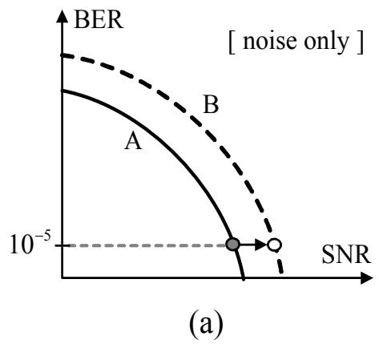

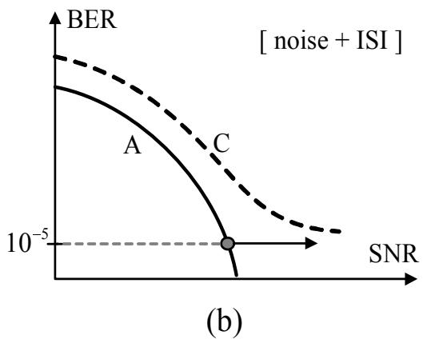  
图 5.25：(a) 仅有噪声系统和 (b) 同时具有噪声 and ISI 系统的误码率 (BER)

总之，如果系统仅受噪声干扰（没有 ISI），增加 SNR 将始终降低 BER。但如果系统中存在 ISI，随着 SNR 的增加，BER 仅降低到一定水平，之后无论如何增加 SNR，BER 也不再降低。因此，必须寻找方法尽可能地消除或减轻系统中的 ISI 影响，以提高系统在增加 SNR 时的整体效率。其中一种减轻 ISI 影响的方法是使用均衡器 (Equalizer)，这将在 5.6 节中详细讨论。

## 5.4 奈奎斯特定理

考虑图 5.26 中的实际信道模型 (realistic channel model)，其中 $a_k$ 是输入数据序列，$G_t(f)$ 是频域中的发送滤波器 (transmitting filter)，$G_c(f)$ 是频域中的信道，$G_r(f)$ 是频域中的接收滤波器 (receiving filter)，而 $n(t)$ 是噪声。定义：

$$
G(f) = G_t(f) G_c(f) G_r(f) \tag{5.72}
$$

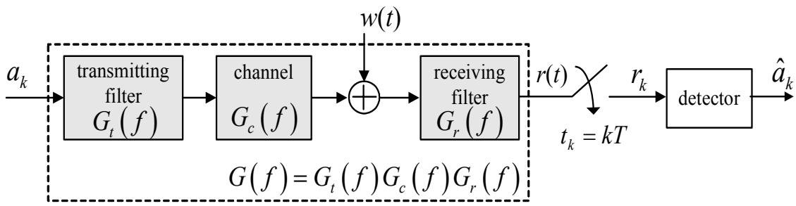
图 5.26: 实际信道模型

这是整个系统的总频率响应，其在时域中的傅里叶变换对为 $g(t)$，即 $g(t) \Longleftrightarrow G(f)$。于是，信号 $r(t)$ 可以表示为如下数学方程：

$$
r(t) = \sum_m a_m g(t - mT) + n(t) \tag{5.73}
$$

其中 $n(t)$ 是经过滤波的噪声，其傅里叶变换为 $N(f) = W(f) G_r(f)$，而 $W(f)$ 是 $w(t)$ 的傅里叶变换。

随后，采样电路 (sampler) 在时间 $t_k = kT$（其中 $k$ 为整数）对信号 $r(t)$ 进行采样，即：

$$
\begin{array}{lcl}
r_k = r(t)|_{t=kT} = r(kT) & = & \sum_m a_m g(kT - mT) + n(kT) \\
& = & a_k g(0) + \sum_{m \neq k} a_m g(kT - mT) + n(kT)
\end{array} \tag{5.74}
$$

其中 $n(kT)$ 是 $kT$ 时刻的噪声幅度。方程 (5.74) 右侧的第一项是系统所需的数据，而第二项则是系统产生的 ISI。在理想情况下，接收电路希望采样电路的输出信号 $r(kT)$ 等于 $a_k g(0) + n(kT)$（即没有 ISI），这样就可以使用简单的检测电路（如边沿检测电路）来对数据 $r_k$ 进行解码，从而降低检测电路的构建成本。然而，要实现 $r(kT) = a_k g(0) + n(kT)$，必须满足：

$$
g(kT) = \begin{cases} 1, & k = 0 \\ 0, & \text{else} \end{cases} \tag{5.75}
$$

因为这样可以使方程 (5.74) 右侧的第二项为零。

具有方程 (5.75) 特性的脉冲信号通常被称为“奈奎斯特脉冲 (Nyquist pulse)”。在通信系统中，比较重要的奈奎斯特脉冲可分为以下三种类型：

1) 理想奈奎斯特脉冲 (ideal Nyquist pulse)
2) RC 脉冲 (raised-cosine)
3) RRC 脉冲 (root-raised cosine)

详细内容如下。

## 5.4.1 理想奈奎斯特脉冲

理想奈奎斯特脉冲 $g_I(t)$ 定义为：

$$
g_I(t) = \operatorname{sinc}\left(\frac{t}{T}\right) = \frac{\sin(\pi t / T)}{\pi t / T} \tag{5.76}
$$

其中 $\operatorname{sinc}(t)$ 是 sinc 函数，其信号形状如图 5.27(左) 所示。可以看出，理想奈奎斯特脉冲 $g_I(t)$ 符合方程 (5.75) 的要求，即当 $k=0$ 时 $g_I(kT) = 1$，且当 $k$ 为任何不等于零的整数时 $g_I(kT) = 0$。如果使用连续时间傅里叶变换将信号 $g_I(t)$ 转换为频域信号，结果为：

$$
G_I(f) = T \Pi(fT) \tag{5.77}
$$

图 5.27: 理想奈奎斯特脉冲的傅里叶变换对

其中 $\Pi(fT)$ 是频域中的矩形脉冲，定义为：

$$
\Pi(fT) = \begin{cases} 1, & -\frac{1}{2T} \le f \le \frac{1}{2T} \\ 0, & \text{else} \end{cases} \tag{5.78}
$$

如图 5.27(右) 所示。

理想奈奎斯特脉冲在“模拟信号重建 (analog signal reconstruction)”中具有重要意义。例如，考虑图 5.28 中的三个模拟信号 A、B 和 C，其中 $T$ 为比特周期。如果在 $t = kT$ ($k = 1, 2, 3, 4$) 时对这三个模拟信号进行采样，将得到相同的 4 比特采样数据 $\{1, 1, -1, 1\}$（见图 5.28）。然而，如果尝试根据采样数据 $\{1, 1, -1, 1\}$ 重建模拟信号，则只有一种模拟信号能够被原样重建，这符合采样定理：[9, 38] “只有当采样频率大于或等于模拟信号最高频率的两倍时，采样得到的数据才与原模拟信号等效”。（详情见 5.5 节）。在实际操作中，可以通过将采样数据送入理想低通滤波器来重建模拟信号，这相当于将采样数据与 sinc 函数（理想奈奎斯特脉冲）进行卷积。图 5.29 展示了由采样数据 $\{1, 1, -1, 1\}$ 重建的模拟信号。可以看出，只要系统中不存在时间抖动 (timing jitter)，相邻比特产生的脉冲信号就不会在采样点处干扰所需比特的信号。

图 5.28: 三个在 $t = kT$ 采样后均得到采样数据 $\{1, 1, -1, 1\}$ 的模拟信号

图 5.29: 多个相隔一个比特单元的理想奈奎斯特脉冲之和

## 5.4.2 理论最小带宽

信号的带宽 (bandwidth) 是指幅度谱不为零的正频率范围，单位为赫兹 (Hz: hertz)。例如，根据图 5.30 可知，基带信号 (baseband signal) 的带宽为 $W = f_{\text{max}}$，而带通信号 (bandpass signal) 的带宽为 $W = 2 f_{\text{max}}$。此外，带宽有多种定义方式，具体取决于给定的条件，例如零点到零点带宽 (null-to-null bandwidth)、3 dB 带宽 (3-dB bandwidth) 或半功率带宽 (half-power bandwidth) 等。因此，在确定信号带宽之前，必须明确所需的带宽定义类型，因为不同类型的带宽数值有所不同。

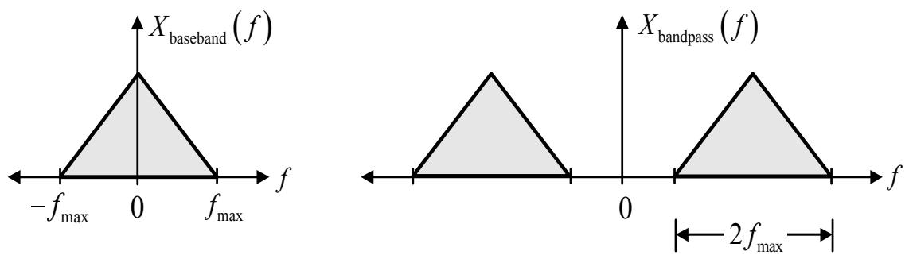
图 5.30: (左) 基带信号 和 (右) 带通信号 的带宽

本书仅考虑零点到零点带宽。考虑用于通信系统的脉冲信号（如图 5.27 所示），在理论上 [9]，以符号率 $R_s$ (symbols per second) 发送数据且无 ISI 时，所需的最小带宽 (minimum bandwidth) $W_0$ 为：

$$
W_0 = \frac{R_s}{2} \quad (\text{Hz}) \tag{5.79}
$$

其中 $R_s = 1/T$，$T$ 为符号周期 (symbol period)。此外，可以通过“带宽效率 (bandwidth efficiency)” $\eta$ 来衡量系统的带宽利用率，定义为：

$$
\eta = \frac{R_s}{W_0} \tag{5.80}
$$

单位为比特每秒每赫兹 (bits/second/hertz)。也就是说，$\eta$ 值越大，表明带宽利用率越高。例如，理想奈奎斯特脉冲的最小带宽为：

$$
W_0 = \frac{1}{2T} = \frac{R_s}{2} \quad (\text{Hz})
$$

其带宽效率为：

$$
\eta = \frac{R_s}{R_s/2} = 2 \quad (\text{bits/second/Hz})
$$

## 5.4.3 RC 脉冲

在实际应用中，理想奈奎斯特脉冲无法通过任何电子电路实现，因为其频域信号 $G_I(f)$ 存在突变，且时域信号 $g_I(t)$ 的有效时间范围为 $-\infty < t < \infty$，如图 5.27 所示。为了解决这个问题，可以允许 $G_I(f)$ 缓慢变化，这种信号被称为“RC 脉冲 (raised-cosine pulse)” $G_{RC}(f)$，其定义为：

$$
G_{RC}(f) = \begin{cases} 1, & |f| < 2W_0 - W \\ \cos^2 \left( \frac{\pi}{4} \frac{|f| + W - 2W_0}{W - W_0} \right), & 2W_0 - W < |f| < W \\ 0, & |f| > W \end{cases} \tag{5.81}
$$

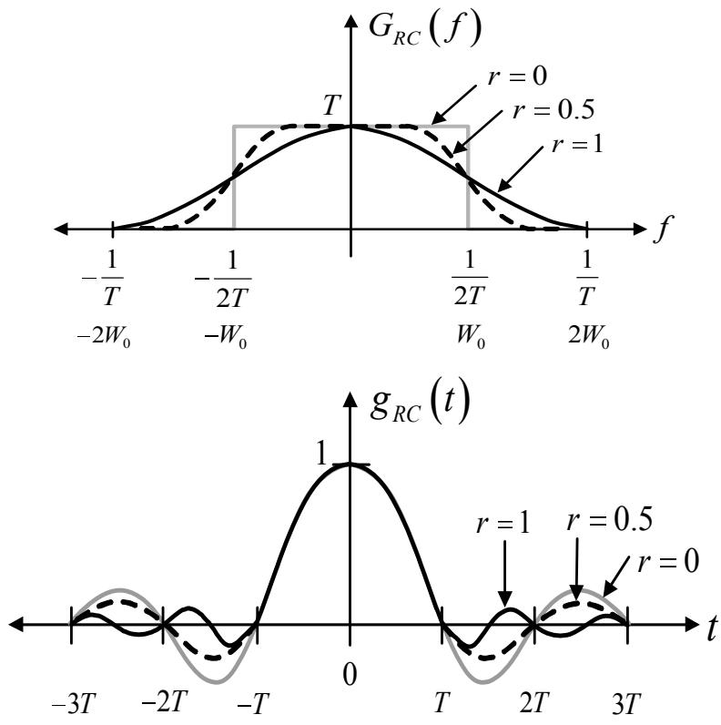
图 5.31: RC 脉冲的傅里叶变换对

其中 $W_0 = 1/(2T)$ 是奈奎斯特最小带宽，$W$ 是绝对带宽 (absolute bandwidth)，满足 $W_0 \le W \le 2W_0$；$W - W_0$ 是超额带宽 (excess bandwidth)，而 $r = (W - W_0)/W_0$ 是滚降系数 (roll-off factor)，取值范围为 $0 \le r \le 1$。

图 5.31(上) 展示了 $G_{RC}(f)$ 的波形。可以看出，当 $r = 0$ 时，其频谱为与理想奈奎斯特脉冲相同的矩形。此外，$G_{RC}(f)$ 的逆傅里叶变换结果为：

$$
g_{RC}(t) = 2 W_0 \operatorname{sinc}(2 W_0 t) \frac{\cos[2 \pi (W - W_0) t]}{1 - [4 (W - W_0) t]^2} \tag{5.82}
$$

其波形如图 5.31(下) 所示。对于 RC 脉冲，其绝对带宽为：

$$
W = \frac{R_s}{2} (1 + r) \quad (\text{Hz}) \tag{5.83}
$$

示例 5.11：一个电话系统传输带宽为 3500 Hz 的语音信号。若规定二进制信号（由语音信号转换为 PCM 序列后得到）采用 RC 脉冲形状且滚降系数 $r = 0.25$，求其数据传输率。

解：数据传输率 $R_s$ 可由方程 (5.83) 求得，即：

$$
R_s = \frac{1}{T} = \frac{2W}{1 + r} = \frac{2 (3500)}{1 + 0.25} = 5600 \quad \text{bps}
$$

## 5.4.4 RRC 脉冲

参考图 5.26，要使总频率响应 $G(f) = G_t(f) G_c(f) G_r(f)$ 等于 $G_I(f)$ 或 $G_{RC}(f)$ 在实际中很难实现，因为在实际操作中，无法准确获知信道 $G_c(f)$ 的频率响应。因此，可行的方案是设计 $G_t(f)$ 和 $G_r(f)$，使得：

$$
G_t(f) G_r(f) = G_{RC}(f) \tag{5.84}
$$

如果设定 $G_t(f) = G_r(f)$，则有：

$$
G_t(f) = G_r(f) = \sqrt{G_{RC}(f)} \tag{5.85}
$$

这通常被称为 RRC 脉冲的频率响应。

在设计好 $G_t(f) G_r(f) = G_{RC}(f)$ 之后，剩下的问题是处理信道 $G_c(f)$。为了使整个系统的总响应具有奈奎斯特脉冲的特性，实际中通常采用均衡器 (Equalizer) 来处理信道（详见 5.6 节），从而使 $G(f) = G_t(f) G_c(f) G_r(f)$ 等于奈奎斯特脉冲的频率响应。

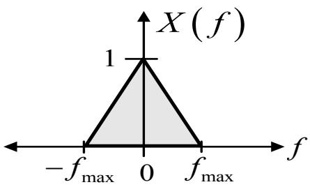
图 5.32: 带限信号的特性

## 5.5 采样定理

奈奎斯特采样定理 (Nyquist's sampling theorem) 阐述了在对模拟信号进行采样时，为了保证采样数据不丢失信息，从而能够无误地重建原始模拟信号而必须满足的条件。要实现这一点，模拟信号必须是“带限信号 (bandlimited signal)”，且采样频率必须大于或等于该模拟信号最高频率的两倍。

若定义 $x(t)$ 为一个实值模拟信号，其傅里叶变换为 $X(f)$，则当且仅当满足以下条件时，信号 $x(t)$ 被称为带限信号：

$$
X(f) = 0, \quad |f| > f_{\text{max}} \tag{5.86}
$$

其中 $f_{\text{max}}$ 是信号 $x(t)$ 的最高频率（如图 5.32 所示）。因此，为了使采样得到的数据与原模拟信号等效，必须以以下频率对信号 $x(t)$ 进行采样：

$$
f_s \ge 2 f_{\text{max}} \tag{5.87}
$$

其中 $f_s = 1/T_s$ 为采样频率，$T_s$ 为采样周期（相邻采样点之间的时间间隔）。也就是说，采样数据 $\{x_k\} = \{x(kT_s)\}$ 将与信号 $x(t)$ 等效。根据方程 (5.87)，最小采样频率被称为“奈奎斯特频率 (Nyquist frequency)”，即 $f_N = 2 f_{\text{max}}$。如果以 $f_s < 2 f_{\text{max}}$ 的频率对信号 $x(t)$ 进行采样，将会产生一个名为“混叠 (aliasing)”的现象，这在所有应用中都是不可取的，因为采样数据会丢失信息。具体而言，当采样频率 $f_s < 2 f_{\text{max}}$ 时重建出的模拟信号，其波形将与原信号产生偏差（详见 5.5.3 节）。

采样定理在许多领域都有应用，例如：
- **CD 数字音频系统**：所需记录的音频信号最高频率为 20 kHz，但系统采用了 44.1 kHz 的采样频率。由于奈奎斯特采样率仅为 $2 \times 20 = 40$ kHz，因此系统预留了 4.1 kHz 作为保护带宽 (guard band)。
- **电话系统**：语音信号 (speech signal) 的带宽为 3.4 kHz，电话系统采用 8 kHz 的采样频率。由于奈奎斯特采样率为 $2 \times 3.4 = 6.8$ kHz，因此系统预留了 1.2 kHz 作为保护带宽。

示例 5.12：给定信号 $x(t) = 10 \cos(2000\pi t) \cos(8000\pi t)$，求符合采样定理的最小采样频率。

解：信号 $x(t)$ 可以重新整理为：
$$
\begin{array}{lcl}
x(t) & = & 10 \cos(2000\pi t) \cos(8000\pi t) \\
& = & 5 \cos(6000\pi t) + 5 \cos(10000\pi t) \\
& = & 5 \cos(2\pi (3000) t) + 5 \cos(2\pi (5000) t)
\end{array}
$$
可以看出，信号 $x(t)$ 的最高频率为 5000 Hz。因此，最小采样频率（即奈奎斯特频率）为 $f_N = 2 f_{\text{max}} = 2 \times 5000 = 10000$ Hz。

## 5.5.1 采样过程

采样过程的工作原理可以通过以下数学方程来描述。对模拟信号 $x(t)$ 采样得到的采样数据 $\{x_k\}$ 可以写成信号 $x(t)$ 与 $\delta$ 脉冲串 (delta impulse train) 的乘积，即：

$$
\begin{array}{rcl}
\{x_k\} & = & \displaystyle x(t) \times \sum_{m=-\infty}^{\infty} \delta(t - mT_s) \\
& = & \displaystyle \sum_{m=-\infty}^{\infty} x(mT_s) \delta(t - mT_s)
\end{array} \tag{5.88}
$$

由于 $\delta$ 脉冲串的傅里叶变换对为：

$$
\sum_{m=-\infty}^{\infty} \delta(t - mT_s) \Longleftrightarrow \frac{1}{T_s} \sum_{k=-\infty}^{\infty} \delta(f - kf_s) \tag{5.89}
$$

其中 $T_s = 1/f_s$。根据时域相乘等于频域卷积的原理，采样结果的频谱为：

$$
X(e^{j\omega}) = X(f) * \frac{1}{T_s} \sum_{k=-\infty}^{\infty} \delta(f - kf_s) \tag{5.90}
$$

$$
= \frac{1}{T_s} \sum_{k=-\infty}^{\infty} X(f - kf_s) \tag{5.91}
$$

其中 $\omega = 2\pi f$ 为角频率。由方程 (5.91) 可知，采样结果的频谱 $X(e^{j\omega})$ 等于原信号频谱 $X(f)$ 经过 $1/T_s$ 加权后的周期性重复，重复间隔为 $f_s$ Hz。图 5.33 展示了模拟信号在时域和频域中的采样过程。

## 5.5.2 模拟信号重建过程

设定模拟信号 $x(t)$ 为带限信号，其傅里叶变换为 $X(f)$（如图 5.32 所示）。如果对信号 $x(t)$ 采用的采样频率满足 $f_s \ge 2 f_{\text{max}}$，则得到的采样数据 $\{x_k\}$ 的频谱为 $X(e^{j\omega})$（如图 5.34 所示）。

模拟信号重建过程 (signal reconstruction process) 是指根据采样数据 $\{x_k\}$ 重建模拟信号 $\tilde{x}(t)$ 的过程，如图 5.35 所示。如果采样频率 $f_s \ge 2 f_{\text{max}}$，则可以通过将采样数据 $\{x_k\}$ 送入一个理想低通滤波器来实现 $\tilde{x}(t) = x(t)$，该滤波器的冲激响应为：

$$
h_{\text{LP}}(t) = \operatorname{sinc}\left(\frac{\pi t}{T_s}\right) = \frac{\sin(\pi t / T_s)}{\pi t / T_s} \tag{5.92}
$$

其傅里叶变换为：

$$
H_{\text{LP}}(f) = T_s \Pi(T_s f) = \begin{cases} T_s, & |f| \le \frac{f_s}{2} \\ 0, & \text{else} \end{cases} \tag{5.93}
$$

也就是说，所使用的理想低通滤波器的截止频率必须为：

$$
f_c = f_s / 2 \quad (\text{Hz}) \tag{5.94}
$$

模拟信号重建过程在频域中的工作原理如下：只有当 $\tilde{x}(t) = x(t)$ 时，$\tilde{x}(t)$ 的傅里叶变换才等于 $X(f)$（如图 5.32 所示）。因此，必须使图 5.34 中的频谱 $X(e^{j\omega})$ 在乘以 $H_{\text{LP}}(f)$ 后等于 $X(f)$，即：

$$
X(f) = X(e^{j\omega}) \times H_{\text{LP}}(f) \tag{5.95}
$$

根据方程 (5.93)，$H_{\text{LP}}(f) = T_s \Pi(T_s f)$，且其逆傅里叶变换为方程 (5.92) 中的 $h_{\text{LP}}(t) = \sin(\pi t / T_s) / (\pi t / T_s)$。基于频域乘法等于时域卷积的原理，方程 (5.95) 的逆傅里叶变换结果为：

$$
\begin{array}{rcl}
x(t) & = & \displaystyle \sum_{m=-\infty}^{\infty} x(mT_s) \delta(t - mT_s) * \operatorname{sinc}(\pi t / T_s) \\
& = & \displaystyle \sum_{m=-\infty}^{\infty} x(mT_s) \operatorname{sinc}\left(\frac{\pi (t - mT_s)}{T_s}\right) \tag{5.96}
\end{array}
$$

方程 (5.96) 意味着将采样数据 $\{x_k\}$ 送入理想低通滤波器后，输出信号为 $x(t)$（如图 5.35 所示）。换言之，$x(t)$ 是由采样数据 $\{x_k\}$ 与理想低通滤波器的冲激响应进行卷积而得。方程 (5.96) 也被称为“奈奎斯特-香农插值公式 (Nyquist-Shannon interpolation formula)”，其物理含义是：每个采样点都被乘以一个 sinc 函数，且 sinc 函数的中心随采样时间移动，最后将所有这些信号叠加在一起，结果如图 5.29 所示。

## 5.5.3 混叠

混叠 (aliasing) 是由于采样频率 $f_s$ 低于模拟信号最高频率的两倍，或者采样频率低于奈奎斯特频率而产生的，即 $f_s < f_N$，其中 $f_N = 2 f_{\mathrm{max}}$。图 5.36 展示了由于使用采样频率 $f_s < 2 f_{\operatorname* { m a x } }$ 而产生的混叠现象。可以看出，当使用 $f_s < 2 f_{\operatorname* { m a x } }$ 时，采样信号的频谱会发生重叠，从而导致混叠。这将导致在尝试通过采样数据重建模拟信号时，如果采样频率 $f_s < 2 f_{\mathrm{max}}$，重建出的模拟信号波形将与原信号产生偏差。

图 5.37 展示了对信号 $x(t) = \cos(2\pi ft)$（其中 $f = 1$ 赫兹）在采样频率 $f_s = 1.5$ 赫兹和 $f_s = 4$ 赫兹下进行采样的示例。从图 5.37(a) 可以看出，如果使用 $f_s < 2 f_{\operatorname* { m a x } }$ 对信号进行采样，那么根据采样数据 $\{x_k\}$ 重建的模拟信号波形将与原信号不同（发生了混叠）。然而，如果使用 $f_s \ge 2 f_{\mathrm{max}}$ 进行采样，重建的模拟信号将与原信号相同，如图 5.37(b) 所示。因此，在所有应用中都必须避免混叠现象。通常，防止混叠的方法有多种，例如：

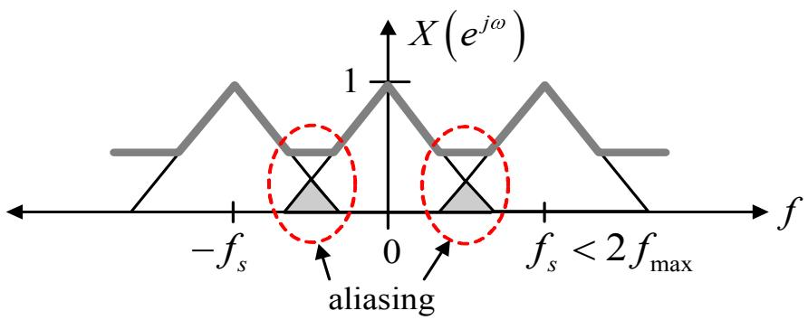
$f_s < 2 f_{\operatorname* { m a x } }$

模拟信号 $x(t) = \cos(2\pi f), f = 1 \text{ Hz}$

重建信号

图 5.37：信号 $x(t)$（频率为 1 赫兹）在采样频率为 (a) $f_s = 1.5$ 赫兹（发生混叠）和 (b) $f_s = 4$ 赫兹（未发生混叠）下的采样示例。

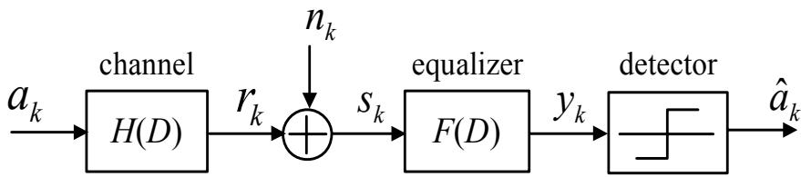
图 5.38：带有均衡器的信道模型

- 提高采样频率（增加 $f_s$）
- 使用抗混叠滤波器 (anti-aliasing filter)

**注**：在实际应用中，通用通信系统的接收端（包括硬盘驱动器）会使用一个截止频率为 $f_c$ 赫兹的低通滤波器，用于滤除带宽 $f_c$ 之外的噪声。此外，该低通滤波器还起到了限制接收信号带宽在 $f_c$ 之内的作用，从而能够确定合适的采样频率 $f_s$（即 $f_s \ge 2 f_c$），以防止在采样电路中产生混叠。

## 5.6 均衡器

均衡器 (Equalizer) 的功能多种多样，包括：帮助调整接收信号的形状或特性以满足系统的要求；减轻接收信号中潜藏的码间干扰 (ISI) 的影响；以及减轻由线性失真引起的影响等。考虑图 5.38 中的信道模型，并假设该系统具有宽平稳 (Wide-Sense Stationary, WSS) 特性，则接收端电路接收到的信号可以用数学方程表示为：

$$
s_k = a_k * h_k + n_k \tag{5.98}
$$

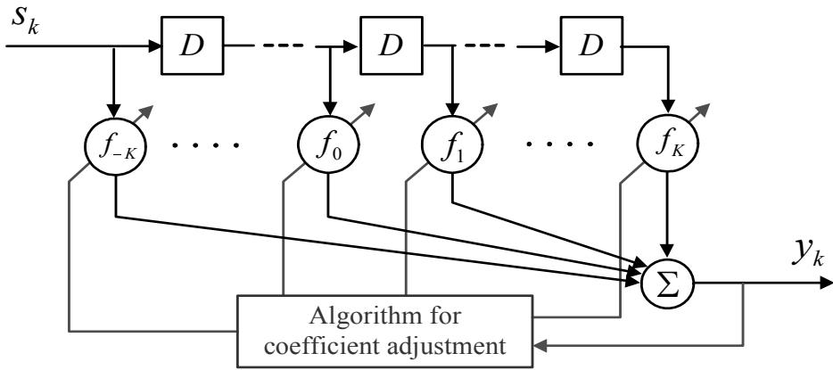
图 5.39：横截均衡器的结构 $\begin{array} { r } { F ( D ) = \sum _ { i = - K } ^ { K } f _ { i } D ^ { i } } \end{array}$

其中 $a_k$ 是具有高斯分布特性的输入比特数据，其能量为 $E_a$；$\begin{array} { r } { H ( D ) = \sum _ { k = 0 } ^ { \nu } h _ { k } D ^ { k } } \end{array}$ 是信道在 $D$ 域的冲激响应，$h_k$ 是信道的第 $k$ 阶系数；$n_k$ 是均值为零、方差为 $\sigma^2$ 的加性高斯白噪声 (AWGN)，即 $n_k \sim \mathcal{N}(0, \sigma^2)$。假设数据 $a_k$ 与噪声 $n_k$ 之间不存在相关性。

接收端电路的目标是从数据 $s_k$ 中恢复出 $a_k$。为了使检测电路更加简单且低成本，引入了均衡器 $F(D)$ 来调整 $s_k$ 的特性，使其变为适合系统的信号 $y_k$，从而便于进行数据解码。随后，将 $y_k$ 送入检测电路。若定义均衡器在 $D$ 域的响应为：

$$
F(D) = \sum_{k=-K}^{K} f_k D^k \tag{5.99}
$$

其中 $f_k$ 是均衡器的第 $k$ 阶系数，中心抽头 (center tap) 位于 $k=0$ 处。因此，均衡器 $F(D)$ 共有 $2K+1$ 个抽头 (tap)。通常，最常用的均衡器结构如图 5.39 所示，称为抽头延迟线均衡器 (tapped-delay-line equalizer, TDL) 或横截均衡器 (transversal equalizer)。

根据图 5.39，均衡器的输出数据 $y_k$ 可以用数学方程表示为：

$$
\begin{array} { l l l } { y_k } & { = } & { s_k * f_k } \\ & { = } & { \displaystyle \sum_{i=-K}^{K} s_{k-i} f_i } \\ & { = } & { \underbrace{ s_{k+K} f_{-K} + \ldots + s_{k+1} f_{-1} } _{\mathrm{ISI}} + \underbrace{ s_k f_0 } _{\mathrm{wanted~signal}} + \underbrace{ s_{k-1} f_1 + \ldots + s_{k-K} f_K } _{\mathrm{ISI}} } \end{array} \tag{5.100}
$$

由方程 (5.100) 可知，方程 (5.99) 中的均衡器会在系统中产生 $K$ 个单位的延迟。这意味着当输入数据 $s_0$（即序列 $s_k$ 的第 $k=0$ 项）进入均衡器时，不能立即获得输出数据 $y_0$。由于均衡器存在 $K$ 个单位的延迟，系统必须等待直到输入数据 $s_K$ 被送入均衡器（即需要等待 $K$ 个单位时间），均衡器才会输出 $y_0$（$y_0$ 对应于 $s_0$）。在硬盘驱动器的信号处理系统中，抽头数较多的均衡器更容易将信号形状调整为系统所需的状态，但缺点是会增加系统的延迟，从而影响定时恢复 (timing recovery) 系统的运行，即接收信号与采样电路之间的同步过程。

在将均衡器应用于通信系统之前，必须根据每个具体应用的需要，计算并确定均衡器各抽头的合适系数。在实际应用中，常见的均衡器有多种类型，本书将重点介绍以下几种：

1) 零强迫均衡器 (zero-forcing equalizer)
2) 最小均方误差均衡器 (minimum mean-square error equalizer, MMSE)
3) 判决反馈均衡器 (decision feedback equalizer, DFE)
4) 自适应均衡器 (adaptive equalizer)

## 5.6.1 零强迫均衡器

从方程 (5.100) 可以看出，均衡器的输出数据 $y_k$ 中混有 ISI。零强迫均衡器的作用是完全消除接收信号中的 ISI。零强迫均衡器的设计方法如下：将方程 (5.100) 写成矩阵形式：

$$
\left[ \begin{array} { c } { y_{-K} } \\ { y_{-K+1} } \\ { \vdots } \\ { y_0 } \\ { \vdots } \\ { \vdots } \\ { y_{K-1} } \\ { y_K } \\ { \vdots } \end{array} \right] = \left[ \begin{array} { c c c c c c c } { s_0 } & { s_{-1} } & { s_{-2} } & { \cdots } & { s_{-2K+1} } & { s_{-2K} } \\ { s_1 } & { s_0 } & { s_{-1} } & { \cdots } & { s_{-2K+2} } & { s_{-2K+1} } \\ { \vdots } & { \vdots } & { \ddots } & { \ddots } & { \ddots } & { \vdots } \\ { s_K } & { s_{K-1} } & { s_{K-2} } & { \cdots } & { s_{-K+1} } & { s_{-K} } \\ { \vdots } & { \vdots } & { \ddots } & { \ddots } & { \ddots } & { \vdots } \\ { s_{2K-1} } & { s_{2K-2} } & { s_{2K-3} } & { \cdots } & { s_0 } & { s_{-1} } \\ { s_{2K-1} } & { s_{2K-1} } & { s_{2K-2} } & { \cdots } & { s_1 } & { s_0 } \\ { s_{2K-1} } & { s_{2K-1} } & { s_{2K-2} } & { \cdots } & { s_1 } & { s_0 } \end{array} \right] \cdot \left[ \begin{array} { c } { f_{-K} } \\ { f_{-K+1} } \\ { \vdots } \\ { f_0 } \\ { \vdots } \\ { f_{K-1} } \\ { f_K } \end{array} \right] \tag{5.101}
$$

即：

$$
\mathbf{y} = \mathbf{S} \mathbf{f} \tag{5.102}
$$

如果矩阵 $\mathbf{S}$ 是方阵 (square matrix)，则可以通过求解方程 (5.102) 来计算均衡器的系数，结果为：

$$
\mathbf{f} = \mathbf{S}^{-1} \mathbf{y} \tag{5.103}
$$

零强迫均衡器通过选择合适的系数，使得在目标位置上的输出数据产生的由 ISI 引起的失真最小，而使均衡器在其他位置的输出数据为零。也就是说，均衡器的输出应满足：

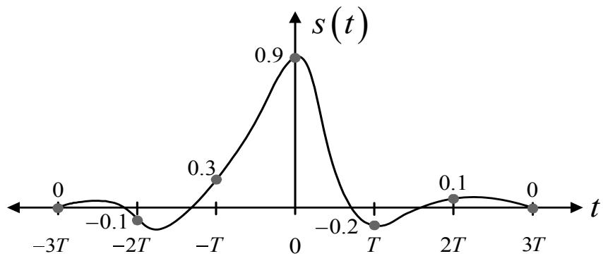
图 5.40：失真脉冲信号

均衡器必须满足：

$$
y_k = \left\{ \begin{array} { l l } { a_k + w_k , } & { k = 0 } \\ { 0 , } & { k = \pm 1 , \pm 2 , \ldots , \pm K } \end{array} \right. \tag{5.104}
$$

其中 $a_k$ 是输入比特数据（如图 5.38 所示），$w_k$ 是经过均衡器 $F(D)$ 滤波后的噪声 $n_k$。换言之，第 $k$ 个均衡器的输出数据 $y_k$ 等于第 $k$ 个输入比特数据 $a_k$ 加上经过滤波后的第 $k$ 个噪声 $w_k$。

**示例 5.13**：假设进入均衡器的输入数据序列 $\{s_k\}$ 为 $\{-0.1, 0.3, 0.9, -0.2, 0.1\}$，如图 5.40 所示。如果接收端使用如图 5.39 所示的 3 抽头均衡器，即 $\{f_{-1}, f_0, f_1\}$，请计算零强迫均衡器的系数，使得输出数据为 $\{y_{-1}, y_0, y_1\} = \{0, 1, 0\}$。

**解**：根据方程 (5.101)，输入数据与均衡器输出数据之间的关系可以用矩阵表示为：

$$
\begin{array} { r l } { \left[ \begin{array} { l } { 0 } \\ { 1 } \\ { 0 } \end{array} \right] } & = { \left[ \begin{array} { l l l } { s_0 } & { s_{-1} } & { s_{-2} } \\ { s_1 } & { s_0 } & { s_{-1} } \\ { s_2 } & { s_1 } & { s_0 } \end{array} \right] } { \left[ \begin{array} { l } { f_{-1} } \\ { f_0 } \\ { f_1 } \end{array} \right] } \\ = & { \left[ \begin{array} { l l l } { 0.9 } & { 0.3 } & { -0.1 } \\ { -0.2 } & { 0.9 } & { 0.3 } \\ { 0.1 } & { -0.2 } & { 0.9 } \end{array} \right] } { \left[ \begin{array} { l } { f_{-1} } \\ { f_0 } \\ { f_1 } \end{array} \right] } \end{array}
$$

根据方程 (5.103)，均衡器系数为：

$$
\left[ \begin{array} { r } { f_{-1} } \\ { f_0 } \\ { f_1 } \end{array} \right] = \left[ \begin{array} { r } { -0.2938 } \\ { 0.9636 } \\ { 0.2468 } \end{array} \right]
$$

因此，当输入数据序列 $\{s_k\} = \{-0.1, 0.3, 0.9, -0.2, 0.1\}$ 通过均衡器时，结果为：

$$
\{ y_{-3}, y_{-2}, y_{-1}, y_0, y_1, y_2, y_3 \} = \{ 0.0294, -0.1845, 0.0, 1.0, 0.0, 0.0470, 0.02468 \}
$$

可见，造成 ISI 影响最大的样本量为 0.1845，总 ISI 影响值为 0.2855。此外，可以发现 3 抽头均衡器试图强制目标样本相邻的样本值为零。因此，如果增加抽头数量，可能会使更多相邻样本的值趋近于零。

在实际应用中，可以通过选择使所有 ISI 项的均方误差 (MSE) 之和最小的均衡器系数，来进一步提高零强迫均衡器的效率（特别是在 ISI 和噪声较强的系统中）。

## 5.6.2 DFE 均衡器

DFE（决策反馈均衡器，Decision Feedback Equalizer）的开发是为了解决零强迫（Zero-Forcing）均衡器中噪声放大的问题。

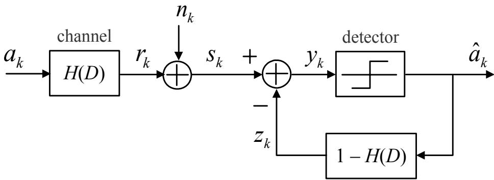
图 5.41：带 DFE 均衡器的信道模型

此时，输入到检测器的信号将不再包含 ISI，且噪声不会被放大。DFE 均衡器的工作原理如图 5.41 所示。

根据图 5.41，输入到检测器的信号 $y_k$ 可以用数学方程表示为：

$$
y_k = s_k - z_k \tag{5.110}
$$

由于 $s_k = (a_k * h_k) + n_k$ 且 $z_k = (1 - h_k) * \hat{a}_k$，将 $s_k$ 和 $z_k$ 代入方程 (5.110) 可得：

$$
\begin{array} { l l l } { y _ { k } } & { = } & { \left[ \left( a _ { k } * h _ { k } \right) + n _ { k } \right] - \left[ { \hat { a } } _ { k } * \left( 1 - h _ { k } \right) \right] } \\ & & { } \\ & { = } & { \left[ \left( a _ { k } - { \hat { a } } _ { k } \right) * h _ { k } \right] + n _ { k } + { \hat { a } } _ { k } } \end{array} \tag{5.111}
$$

如果假设 $a_k = \hat{a}_k$，则方程 (5.111) 可简化为：

$$
y_k = a_k + n_k \tag{5.112}
$$

对比方程 (5.108) 和 (5.112) 可以发现，方程 (5.112) 中的 DFE 均衡器输出 $y_k$ 不含 ISI 分量，且噪声没有被放大。

通常，DFE 均衡器的性能优于零强迫均衡器，但 DFE 均衡器的一个主要缺点是可能会导致“误差传播（error propagation）”问题。当对于某个 $k$ 值出现 $a_k \neq \hat{a}_k$ 时，即在时间 $k$ 的假设 $a_k = \hat{a}_k$ 不成立，那么当 $i > k$ 时，检测器的输出 $\hat{a}_i$ 都有可能出错。因此，在所有应用中都应尽量避免误差传播问题。

## 5.6.3 MMSE 均衡器

考虑图 5.38 中的信道模型。MMSE（最小均方误差）均衡器旨在权衡零强 fclose (zero-forcing) 均衡器和 DFE 均衡器的优缺点。MMSE 均衡器的设计目标是使接收到的数据 $y_k$ 与期望数据 $a_k$ 之间的均方误差最小化，或者可以说，MMSE 均衡器使以下值最小化：

$$
\mathrm{MSE} = E \left[ \left( y_k - a_{k-d} \right)^2 \right] \tag{5.113}
$$

其中 $E[\cdot]$ 是期望运算符，$d$ 是由均衡器引起的延迟量，并假设 $\hat{a}_{k-d} = a_{k-d}$。

由于均衡器引起的延迟量 $d$ 已被纳入方程 (5.113) 中，为了方便说明 MMSE 均衡器的设计方法，定义一个新的变量来表示均衡器的每个抽头系数，即 $c_k = f_{k-K}$。因此，定义均衡器为：

$$
\mathbf{c} = \begin{bmatrix} c_0 \\ c_1 \\ c_2 \\ \vdots \\ c_{N-1} \end{bmatrix} = \begin{bmatrix} f_{-K} \\ \vdots \\ f_0 \\ \vdots \\ f_K \end{bmatrix}
$$

其中 $N = 2K + 1$ 是均衡器的总抽头数，且向量 $\mathbf{\bar{s}} = [s_k, s_{k-1}, s_{k-2}, \dots, s_{k-N+1}]^{\mathrm{T}}$。因此，均衡器在时间 $k$ 的输出数据为：

$$
y_k = \mathbf{c}^{\mathrm{T}} \mathbf{s} = \mathbf{s}^{\mathrm{T}} \mathbf{c} \tag{5.114}
$$

考虑系统中所有传输数据均为实数的情况，方程 (5.113) 可以重新整理为：

$$
\mathrm{MSE} = E[y_k^2] - 2E[y_k a_{k-d}] + E[a_{k-d}^2] \tag{5.115}
$$

将方程 (5.114) 中的 $y_k$ 代入方程 (5.113) 中，可得：

$$
\begin{array}{lll}
\mathrm{MSE} & = & E[\mathbf{c}^{\mathrm{T}} \mathbf{s} \mathbf{s}^{\mathrm{T}} \mathbf{c}] - 2E[a_{k-d} \mathbf{c}^{\mathrm{T}} \mathbf{s}] + E_a \\
& = & \mathbf{c}^{\mathrm{T}} E[\mathbf{s} \mathbf{s}^{\mathrm{T}}] \mathbf{c} - 2 \mathbf{c}^{\mathrm{T}} E[a_{k-d} \mathbf{s}] + E_a \\
& = & \mathbf{c}^{\mathrm{T}} \mathbf{R}_{ss} \mathbf{c} - 2 \mathbf{c}^{\mathrm{T}} \mathbf{p} + E_a \\
& = & (\mathbf{c} - \mathbf{R}_{ss}^{-1} \mathbf{p})^{\mathrm{T}} \mathbf{R}_{ss} (\mathbf{c} - \mathbf{R}_{ss}^{-1} \mathbf{p}) - \mathbf{p}^{\mathrm{T}} \mathbf{R}_{ss}^{-1} \mathbf{p} + E_a
\end{array} \tag{5.116}
$$

当 $\mathbf{c}$ 为确定值时，$E_a = E[a_{k-d}^2] = E[a_k^2]$ 是输入比特数据 $a_k$ 的能量。数据 $\{s_k\}$ 的自相关矩阵为：

$$
\mathbf{R}_{ss} = E[\mathbf{s} \mathbf{s}^{\mathrm{T}}] \tag{5.118}
$$

而 $a_k$ 与 $\{s_k\}$ 之间的互相关向量为：

$$
\mathbf{p} = E[a_{k-d} \mathbf{s}] \tag{5.119}
$$

MMSE 均衡器的设计目标是使方程 (5.117) [注：原文如此，应指 (5.116)] 中的 MSE 值最小。由于方程 (5.118) 中的矩阵 $\mathbf{R}_{ss}$ 具有对称属性，即：

$$
\mathbf{R}_{ss}^{\mathrm{T}} = \mathbf{R}_{ss} \tag{5.120}
$$

且基于以下事实：

$$
\mathbf{b}^{\mathrm{T}} \mathbf{R}_{ss} \mathbf{b} \geq 0 \tag{5.121}
$$

对于任意向量 $\mathbf{b}$ [37]。因此，方程 (5.117) [注：原文如此，应指 (5.116)] 在以下条件时取得最小值：

$$
\mathbf{c} - \mathbf{R}_{ss}^{-1} \mathbf{p} = 0 \tag{5.122}
$$

因此，MMSE 均衡器的系数可由下式求得：

$$
\mathbf{c}_{\mathrm{MMSE}} = \mathbf{R}_{ss}^{-1} \mathbf{p} \tag{5.123}
$$

此时产生的最小 MSE 值为：

$$
\mathrm{MSE}_{\min} = E_a - \mathbf{p}^{\mathrm{T}} \mathbf{R}_{ss}^{-1} \mathbf{p} \tag{5.124}
$$

关于 MMSE 均衡器设计的一个观察是：所得均衡器是非自适应的（not adaptive），且在计算矩阵 $\mathbf{R}_{ss}$ 和向量 $\mathbf{p}$ 时，不需要使用实际的数据 $\{a_k\}$ 和 $\{s_k\}$，而仅需要 $\{a_k\}$ 和 $\{s_k\}$ 的统计特性，具体将在下一节中详细说明。

**在给定信道 $H(D)$ 时求解 $\mathbf{R}_{ss}$ 和 $\mathbf{p}$**

考虑图 5.38 中的信道模型。若给定信道 $H(D)$ 为：

$$
H(D) = \sum_{k=0}^{\nu} h_k D^k \tag{5.125}
$$

则接收端接收到的数据 $s_k$ 可以用矩阵形式表示为：

$$
\mathbf{s} = \mathbf{H} \mathbf{a} + \mathbf{n} \tag{5.127}
$$

其中 $\mathbf{H}$ 为信道矩阵，$\mathbf{a}$ 为发送数据向量，$\mathbf{n}$ 为噪声向量。

矩阵 $\mathbf{R}_{ss}$ 可通过将方程 (5.127) 中的 $\mathbf{s}$ 代入方程 (5.118) 得到：

$$
\begin{array}{rcl}
\mathbf{R}_{ss} & = & E[\mathbf{s} \mathbf{s}^{\mathrm{T}}] \\
& = & E[(\mathbf{H} \mathbf{a} + \mathbf{n})(\mathbf{H} \mathbf{a} + \mathbf{n})^{\mathrm{T}}] \\
& = & \mathbf{H} E[\mathbf{a} \mathbf{a}^{\mathrm{T}}] \mathbf{H}^{\mathrm{T}} + E[\mathbf{n} \mathbf{n}^{\mathrm{T}}]
\end{array} \tag{5.128}
$$

由于 $E[\mathbf{an}^{\mathrm{T}}] = E[\mathbf{na}^{\mathrm{T}}] = 0$（因为数据 $a_k$ 与噪声 $n_k$ 不相关），且矩阵 $E[\mathbf{aa}^{\mathrm{T}}]$ 和 $E[\mathbf{nn}^{\mathrm{T}}]$ 的第 $i$ 行第 $j$ 列元素分别为：

$$
E[\mathbf{a} \mathbf{a}^{\mathrm{T}}]_{(i,j)} = E[a_{k-i} a_{k-j}] = \begin{cases} 0, & i \neq j \\ E_a, & i = j \end{cases}
$$

以及

$$
E[\mathbf{n} \mathbf{n}^{\mathrm{T}}]_{(i,j)} = E[n_{k-i} n_{k-j}] = \begin{cases} 0, & i \neq j \\ \sigma^2, & i = j \end{cases}
$$

因此，方程 (5.128) 可以重新整理为：

$$
\mathbf{R}_{ss} = E_a \mathbf{H} \mathbf{H}^{\mathrm{T}} + \sigma^2 \mathbf{I} \tag{5.129}
$$

其中 $\mathbf{I}$ 是一个 $N \times N$ 的单位矩阵（identity matrix）。

同理，向量 $\mathbf{p}$ 也可以通过将方程 (5.127) 中的 $\mathbf{s}$ 代入方程 (5.119) 得到：

$$
\mathbf{p} = E[a_{k-d} (\mathbf{H} \mathbf{a} + \mathbf{n})] \tag{5.130}
$$

由于 $E[a_{k-d} \mathbf{n}] = 0$，且

$$
E[a_{k-d} \mathbf{a}] = E \begin{bmatrix} E[a_{k-d} a_k] \\ E[a_{k-d} a_{k-1}] \\ \vdots \\ E[a_{k-d} a_{k-d}] \\ \vdots \\ E[a_{k-d} a_{k-N+1}] \end{bmatrix} = E_a \mathbf{e}_d
$$

其中 $\mathbf{e}_d$ 是一个包含 $N$ 个元素的列向量，其元素定义如下：

$$
\mathbf{e}_d = [0, \dots, 0, \underbrace{1}_{(d+1)\text{-th}}, 0, \dots, 0]^{\mathrm{T}}
$$

即 $\mathbf{e}_d$ 中除第 $d+1$ 个元素为 1 以外，其余所有元素均为 0。因此，方程 (5.130) 可以整理为：

$$
\mathbf{p} = E_a \mathbf{H} \mathbf{e}_d \tag{5.131}
$$

在获得矩阵 $\mathbf{R}_{ss}$ 和向量 $\mathbf{p}$ 后，将其代入方程 (5.123)，即可求得 MMSE 均衡器的每个抽头系数。通常，MMSE 均衡器的性能优于零强迫均衡器和 DFE 均衡器，尤其是在噪声和 ISI 严重的情况下。关于用于硬盘驱动器信号处理系统的 MMSE 均衡器设计的更多细节，可参考书籍《数字数据存储信号处理 第 2 卷：读写信道设计》第 3 章 [6]。

## 5.6.4 自适应均衡器

在实际应用中，很难准确获知信道参数 $H$ 和噪声功率 $\sigma^2$。因此，实际使用的均衡器通常在接收新数据的过程中，实时调整均衡器的每个抽头系数。这种工作模式的均衡器被称为“自适应均衡器（adaptive equalizer）”。自适应均衡器的结构与 TDL 均衡器或横向滤波器（如图 5.39 所示）相同，但其内部引入了用于调整系数的算法，以补偿信道特性的不确定性。

### 最速下降法 (Steepest Descent Algorithm)

设 $f(x)$ 为一个关于独立变量 $x$ 的实值函数，其图像如图 5.42 所示。最速下降法（或称梯度算法）用于寻找使函数 $f(x)$ 达到最小值的 $x$ 值，其工作步骤如下：

1) 设置初始值 $x = x_0$，其中 $x_0$ 为任意常数。

2) 对于 $k = 1$ 到 $L$：
   $$ 2.1) \ x_{k+1} = x_k - \mu f'(x_k) $$

其中 $L$ 是迭代次数，$\mu$ 是步长（step size），取值范围为 $0 < \mu < 1$，而 $f'(x_k)$ 是函数 $f(x)$ 在 $x = x_k$ 处的导数。通常，最速下降法的性能取决于参数 $\mu$。也就是说：

- 若 $\mu$ 过小，将需要较长时间才能得到所需的 $x$ 值，即收敛速度（convergence rate）较慢。
- 若 $\mu$ 过大，可能会导致发散（divergence），从而无法获得所需的 $x$ 值。

**示例 5.14**：给定函数
$$ f(x) = 3 x e^{x^2} + \frac{3 x}{2 + x^2} - 5 $$
使用最速下降法计算 $k=2$ 时的 $x_k$ 值，已知 $x_0 = 0$ 且 $\mu = 0.2$。

**解**：对于给定的函数 $f(x)$，其导数为：
$$ f'(x) = \frac{df(x)}{dx} = (3x)e^{x^2}(2x) + e^{x^2}(3) + \frac{(2+x^2)(3) - (3x)(2x)}{(2+x^2)^2} $$

根据最速下降法，当 $k=0, 1, 2$ 时，$x_k$ 的值为：
$$ x_0 = 0 $$
$$ x_1 = x_0 - \mu f'(x_0) = 0 - (0.2) f'(0) = -0.9 $$
$$ x_2 = x_1 - \mu f'(x_1) = (-0.9) - (0.2) f'(-0.9) = -4.524 $$

因此，得到 $x_2 = -4.524$，证毕。

### N 维最速下降法

如果 $f$ 是多个独立变量的函数，即 $f(\mathbf{x})$，其中 $\mathbf{x} = [x_1, x_2, \dots, x_N]^{\mathrm{T}}$，则最速下降法仍可用于寻找使函数 $f(\mathbf{x})$ 最小的向量 $\mathbf{x}$，步骤如下：

1) 设置初始值 $\mathbf{x} = \mathbf{x}_0$，其中 $\mathbf{x}_0$ 为任意常数向量。

2) 对于 $k = 1$ 到 $L$：
   $$ 2.1) \ \mathbf{x}_{k+1} = \mathbf{x}_k - \mu \nabla f(\mathbf{x}_k) $$

其中 $\nabla$ 是梯度运算符（gradient operator），定义为：
$$ \nabla f(\mathbf{x}) = \left[ \begin{array}{c} \frac{\partial f(\mathbf{x})}{\partial x_1} \\ \frac{\partial f(\mathbf{x})}{\partial x_2} \\ \vdots \\ \frac{\partial f(\mathbf{x})}{\partial x_N} \end{array} \right] $$

同样地，N 维最速下降法的性能也取决于参数 $\mu$。

**示例 5.15**：给定
$$ f(x, y) = x^2 - y^2 - 3x + 3y + 2xy $$
使用 N 维最速下降法计算 $k=2$ 时的 $x_k$ 和 $y_k$ 值，已知 $x_0 = 0, y_0 = 0$，且 $\mu = 0.1$。

**解**：对于给定的 $f(x, y)$，其梯度为：
$$ \nabla f(x, y) = \left[ \begin{array}{l} \frac{\partial f(x, y)}{\partial x} \\ \frac{\partial f(x, y)}{\partial y} \end{array} \right] = \left[ \begin{array}{l} 2x - 3 + 2y \\ -2y + 3 + 2x \end{array} \right] $$

根据 N 维最速下降法，更新 $x_k$ 和 $y_k$ 的方程为：
$$ x_{k+1} = x_k - \mu \frac{\partial f(x_k, y_k)}{\partial x} = x_k - \mu (2x_k - 3 + 2y_k) $$
$$ y_{k+1} = y_k - \mu \frac{\partial f(x_k, y_k)}{\partial y} = y_k - \mu (-2y_k + 3 + 2x_k) $$

写成矩阵形式为：
$$ \underbrace{\left[ \begin{array}{l} x_{k+1} \\ y_{k+1} \end{array} \right]}_{\mathbf{x}_{k+1}} = \underbrace{\left[ \begin{array}{l} x_k \\ y_k \end{array} \right]}_{\mathbf{x}_k} - \mu \underbrace{\left[ \begin{array}{l} 2x_k - 3 + 2y_k \\ -2y_k + 3 + 2x_k \end{array} \right]}_{\nabla f(\mathbf{x}_k)} $$

因此，当 $k=0, 1, 2$ 时的 $x_k$ 和 $y_k$ 值为：

| $k$ | $x_k$ | $y_k$ |
|---|---|---|
| 0 | 0 | 0 |
| 1 | $0 - (0.1)(-3) = 0.3$ | $0 - (0.1)(3) = -0.3$ |
| 2 | $(0.3) - (0.1)[2(0.3) - 3 + 2(-0.3)] = 0.6$ | $-0.3 - (0.1)[-2(-0.3) + 3 + 2(0.3)] = -0.72$ |

因此，得到 $x_2 = 0.6$ 且 $y_2 = -0.72$，证毕。

### 与 MMSE 均衡器的关系

根据 5.6.3 节中 MMSE 均衡器的设计方法，MMSE 均衡器的每个抽头系数旨在使方程 (5.116) 中的 MSE 最小。因此，可以认为该目标函数（cost function）为：

$$ f(\mathbf{c}) = \mathrm{MSE} = \mathbf{c}^{\mathrm{T}} \mathbf{R}_{ss} \mathbf{c} - 2 \mathbf{c}^{\mathrm{T}} \mathbf{p} + E_a \tag{5.132} $$

该函数 $f(\mathbf{c})$ 的梯度为：

$$ \nabla f(\mathbf{c}) = 2 \mathbf{R}_{ss} \mathbf{c} - 2 \mathbf{p} \tag{5.133} $$

假设 $f(\mathbf{c})$ 是一个具有唯一最小值的二次函数（quadratic function），则最优系数 $\mathbf{c}_{\mathrm{opt}}$ 可通过令 $\nabla f(\mathbf{c}) = 0$ 求得：

$$ \mathbf{c}_{\mathrm{opt}} = \mathbf{R}_{ss}^{-1} \mathbf{p} \tag{5.134} $$

这与方程 (5.123) 中的 $\mathbf{c}_{\mathrm{MMSE}}$ 相同。因此，通过最速下降法最小化 $\nabla f(\mathbf{c})$ 来寻找均衡器系数，可以保证 $\mathbf{c}_{\mathrm{opt}}$ 在 $\mu$ 选择合适的情况下收敛至 $\mathbf{c}_{\mathrm{MMSE}}$。

### LMS 算法

根据最速下降法，为了使方程 (5.132) 中的 $f(\mathbf{c})$ 最小化，可以使用以下更新方程：

$$ \mathbf{c}_{k+1} = \mathbf{c}_k - \frac{\mu}{2} \nabla f(\mathbf{c}_k) \tag{5.135} $$

其中 $\nabla f(\mathbf{c}_k)$ 可通过将方程 (5.118) 的 $\mathbf{R}_{ss}$ 和方程 (5.119) 的 $\mathbf{p}$ 代入方程 (5.133) 得到：

$$ \begin{array}{lll} \nabla f(\mathbf{c}_k) & = & 2 (E[\mathbf{s}_k \mathbf{s}_k^{\mathrm{T}}] \mathbf{c}_k - E[\hat{a}_{k-d} \mathbf{s}_k]) \\ & = & 2 E[\mathbf{s}_k (\mathbf{s}_k^{\mathrm{T}} \mathbf{c}_k - \hat{a}_{k-d})] \\ & = & 2 E[\mathbf{s}_k (y_k - \hat{a}_{k-d})] \\ & = & 2 E[\mathbf{s}_k e_k] \end{array} \tag{5.136} $$

其中 $y_k = \mathbf{s}_k^{\mathrm{T}} \mathbf{c}_k$，且 $e_k = y_k - \hat{a}_{k-d}$ 是基于图 5.38 信道模型的误差。将 $\nabla f(\mathbf{c}_k)$ 代入方程 (5.135) 得：

$$ \mathbf{c}_{k+1} = \mathbf{c}_k - \mu E[e_k \mathbf{s}_k] \tag{5.137} $$

在实际应用中，直接计算期望值 $E[e_k \mathbf{s}_k]$ 非常困难。一种解决方法是使用样本平均值（sample mean）进行估计 [35]：

$$ \hat{E}[e_k \mathbf{s}_k] = \frac{1}{L_a} \sum_{i=0}^{L_a-1} e_{k-i} \mathbf{s}_{k-i} \tag{5.138} $$

其中 $L_a$ 为数据序列 $\{s_k\}$ 的总长度。将此估计值应用于最速下降法，方程 (5.137) 可改写为：

$$ \mathbf{c}_{k+1} = \mathbf{c}_k - \frac{\mu}{L_a} \sum_{i=0}^{L_a-1} e_{k-i} \mathbf{s}_{k-i} \tag{5.139} $$

此外，如果仅使用单点样本估计（即 $L_a = 1$），则有：

$$ \hat{E}[e_k \mathbf{s}_k] = e_k \mathbf{s}_k \tag{5.140} $$

因此，均衡器系数的更新方程变为：

$$ \mathbf{c}_{k+1} = \mathbf{c}_k - \mu \{ e_k \mathbf{s}_k \} \tag{5.141} $$

该方程通常被称为“最小均方（LMS: least mean square）算法”或简称“LMS 算法”。该算法在各种应用中非常流行，主要因为其具有以下优点：

1) LMS 算法无需事先知道输入数据和信道的特性即可运行。
2) 只要 $\mu$ 足够小，即可保证 LMS 算法得到的 $\mathbf{c}$ 值最终会收敛于 $\mathbf{c}_{\mathrm{MMSE}}$（尽管可能需要较长时间）。
3) 该算法具有良好的鲁棒性、稳定性，且易于实现为电子电路。

综上所述，若基于图 5.38 的系统模型使用 LMS 算法实现自适应均衡器，其工作步骤如下：

1) 初始化 $\mathbf{c}_0$ 为任意向量。
2) 对于 $k = 1$ 到 $L$（其中 $L \leq L_a$）：
   2.1) 计算误差 $e_k = y_k - \hat{a}_{k-d}$。
   2.2) 更新均衡器系数 $\mathbf{c}_{k+1} = \mathbf{c}_k - \mu \{ e_k \mathbf{s}_k \}$。

关于 LMS 算法的其他细节，如收敛条件等，可参考资料 [35]。

### 自适应均衡器的运行状态

自适应均衡器面临的一个主要问题是：在系数更新过程的初始阶段，系统并不知道一个理想的 $\mathbf{c}_0$ 应该是怎样的。因此，如果用于计算误差 $e_k$ 的 $\hat{a}_{k-d}$ 数据不可靠，LMS 算法可能会计算出错误的均衡器系数。相反，如果 $\hat{a}_{k-d}$ 是可靠的，LMS 算法将高效运行。因此，在实际应用中，传输的数据通常分为两个主要部分：

1) 第一部分是**测试信号**，称为**前导码（preamble）**。发送端和接收端均预先已知前导码的特征。通常前导码仅包含少量比特。
2) 第二部分是**实际数据（real data）**。这部分数据通常具有随机特性，包含大量比特（例如在硬盘驱动器中，这部分数据约为 4096 比特）。

因此，自适应均衡器根据数据的特性分为两种运行模式：

1) **捕获模式（acquisition mode）** 或 **训练模式（training mode）**：处于初始阶段，自适应均衡器利用前导码来计算合适的均衡器系数。由于已知前导码的具体内容，均衡器可以使用较大的 $\mu$（步长），以便尽可能快地获得合适的系数。
2) **跟踪模式（tracking mode）**：在此阶段，自适应均衡器利用实际数据来调整均衡器系数。由于实际数据具有随机性，均衡器无法保证 $\hat{a}_{k-d}$ 始终 100% 可靠。因此，均衡器应使用较小的 $\mu$ 来调整系数，以防止产生较大误差。

$\mu = 0.01$ 以及 (b) $\mu = 0.001$

考虑图 5.38 中的信道模型，设定 $H(D) = 1 - D^2$，并采用具有 11 个抽头的自适应均衡器（基于 LMS 算法），目标是使均衡器输出尽可能接近 $a_k$。图 5.43 显示了在步长 $\mu = 0.01$ 和 $\mu = 0.001$ 时，11 个抽头系数的变化情况。条件为：输入数据 $a_k \in \{\pm 1\}$ 共 4000 比特，运行在 $E_b/N_0 = 9\mathrm{dB}$ 环境下，且假设所有输入数据均为前导码（即均衡器仅在捕获模式下运行）。从图中可以看出，当使用较大的 $\mu$ 时，各抽头系数的变化较为剧烈（在跟踪模式下容易导致出错），但收敛速度较快（fast convergence）。相反，当 $\mu$ 较小时，抽头系数变化缓慢（在跟踪模式下产生的误差较少），但收敛速度较慢（slow convergence）。因此，在实际应用中，自适应均衡器在捕获模式下使用较大的 $\mu$，而在跟踪模式下使用较小的 $\mu$。

图 5.44: 硬盘驱动器信号处理系统的模型

## 5.6.4 自适应均衡器

在实际应用中，很难准确获知信道参数 $H$ 和噪声功率 $\sigma^2$。因此，实际使用的均衡器通常在接收新数据的过程中，实时调整均衡器的每个抽头系数。这种工作模式的均衡器被称为“自适应均衡器（adaptive equalizer）”。自适应均衡器的结构与 TDL 均衡器或横向滤波器（如图 5.39 所示）相同，但其内部引入了用于调整系数的算法，以补偿信道特性的不确定性。

### 最速下降法 (Steepest Descent Algorithm)

设 $f(x)$ 为一个关于独立变量 $x$ 的实值函数，其图像如图 5.42 所示。最速下降法（或称梯度算法）用于寻找使函数 $f(x)$ 达到最小值的 $x$ 值，其工作步骤如下：

1) 设置初始值 $x = x_0$，其中 $x_0$ 为任意常数。

2) 对于 $k = 1$ 到 $L$：
   $$ 2.1) \ x_{k+1} = x_k - \mu f'(x_k) $$

其中 $L$ 是迭代次数，$\mu$ 是步长（step size），取值范围为 $0 < \mu < 1$，而 $f'(x_k)$ 是函数 $f(x)$ 在 $x = x_k$ 处的导数。通常，最速下降法的性能取决于参数 $\mu$。也就是说：

- 若 $\mu$ 过小，将需要较长时间才能得到所需的 $x$ 值，即收敛速度（convergence rate）较慢。
- 若 $\mu$ 过大，可能会导致发散（divergence），从而无法获得所需的 $x$ 值。

**示例 5.14**：给定函数
$$ f(x) = 3 x e^{x^2} + \frac{3 x}{2 + x^2} - 5 $$
使用最速下降法计算 $k=2$ 时的 $x_k$ 值，已知 $x_0 = 0$ 且 $\mu = 0.2$。

**解**：对于给定的函数 $f(x)$，其导数为：
$$ f'(x) = \frac{df(x)}{dx} = (3x)e^{x^2}(2x) + e^{x^2}(3) + \frac{(2+x^2)(3) - (3x)(2x)}{(2+x^2)^2} $$

根据最速下降法，当 $k=0, 1, 2$ 时，$x_k$ 的值为：
$$ x_0 = 0 $$
$$ x_1 = x_0 - \mu f'(x_0) = 0 - (0.2) f'(0) = -0.9 $$
$$ x_2 = x_1 - \mu f'(x_1) = (-0.9) - (0.2) f'(-0.9) = -4.524 $$

因此，得到 $x_2 = -4.524$，证毕。

### N 维最速下降法

如果 $f$ 是多个独立变量的函数，即 $f(\mathbf{x})$，其中 $\mathbf{x} = [x_1, x_2, \dots, x_N]^{\mathrm{T}}$，则最速下降法仍可用于寻找使函数 $f(\mathbf{x})$ 最小的向量 $\mathbf{x}$，步骤如下：

1) 设置初始值 $\mathbf{x} = \mathbf{x}_0$，其中 $\mathbf{x}_0$ 为任意常数向量。

2) 对于 $k = 1$ 到 $L$：
   $$ 2.1) \ \mathbf{x}_{k+1} = \mathbf{x}_k - \mu \nabla f(\mathbf{x}_k) $$

其中 $\nabla$ 是梯度运算符（gradient operator），定义为：
$$ \nabla f(\mathbf{x}) = \left[ \begin{array}{c} \frac{\partial f(\mathbf{x})}{\partial x_1} \\ \frac{\partial f(\mathbf{x})}{\partial x_2} \\ \vdots \\ \frac{\partial f(\mathbf{x})}{\partial x_N} \end{array} \right] $$

同样地，N 维最速下降法的性能也取决于参数 $\mu$。

**示例 5.15**：给定
$$ f(x, y) = x^2 - y^2 - 3x + 3y + 2xy $$
使用 N 维最速下降法计算 $k=2$ 时的 $x_k$ 和 $y_k$ 值，已知 $x_0 = 0, y_0 = 0$，且 $\mu = 0.1$。

**解**：对于给定的 $f(x, y)$，其梯度为：
$$ \nabla f(x, y) = \left[ \begin{array}{l} \frac{\partial f(x, y)}{\partial x} \\ \frac{\partial f(x, y)}{\partial y} \end{array} \right] = \left[ \begin{array}{l} 2x - 3 + 2y \\ -2y + 3 + 2x \end{array} \right] $$

根据 N 维最速下降法，更新 $x_k$ 和 $y_k$ 的方程为：
$$ x_{k+1} = x_k - \mu \frac{\partial f(x_k, y_k)}{\partial x} = x_k - \mu (2x_k - 3 + 2y_k) $$
$$ y_{k+1} = y_k - \mu \frac{\partial f(x_k, y_k)}{\partial y} = y_k - \mu (-2y_k + 3 + 2x_k) $$

写成矩阵形式为：
$$ \underbrace{\left[ \begin{array}{l} x_{k+1} \\ y_{k+1} \end{array} \right]}_{\mathbf{x}_{k+1}} = \underbrace{\left[ \begin{array}{l} x_k \\ y_k \end{array} \right]}_{\mathbf{x}_k} - \mu \underbrace{\left[ \begin{array}{l} 2x_k - 3 + 2y_k \\ -2y_k + 3 + 2x_k \end{array} \right]}_{\nabla f(\mathbf{x}_k)} $$

因此，当 $k=0, 1, 2$ 时的 $x_k$ 和 $y_k$ 值为：

| $k$ | $x_k$ | $y_k$ |
|---|---|---|
| 0 | 0 | 0 |
| 1 | $0 - (0.1)(-3) = 0.3$ | $0 - (0.1)(3) = -0.3$ |
| 2 | $(0.3) - (0.1)[2(0.3) - 3 + 2(-0.3)] = 0.6$ | $-0.3 - (0.1)[-2(-0.3) + 3 + 2(0.3)] = -0.72$ |

因此，得到 $x_2 = 0.6$ 且 $y_2 = -0.72$，证毕。

### 与 MMSE 均衡器的关系

根据 5.6.3 节中 MMSE 均衡器的设计方法，MMSE 均衡器的每个抽头系数旨在使方程 (5.116) 中的 MSE 最小。因此，可以认为该目标函数（cost function）为：

$$ f(\mathbf{c}) = \mathrm{MSE} = \mathbf{c}^{\mathrm{T}} \mathbf{R}_{ss} \mathbf{c} - 2 \mathbf{c}^{\mathrm{T}} \mathbf{p} + E_a \tag{5.132} $$

该函数 $f(\mathbf{c})$ 的梯度为：

$$ \nabla f(\mathbf{c}) = 2 \mathbf{R}_{ss} \mathbf{c} - 2 \mathbf{p} \tag{5.133} $$

假设 $f(\mathbf{c})$ 是一个具有唯一最小值的二次函数（quadratic function），则最优系数 $\mathbf{c}_{\mathrm{opt}}$ 可通过令 $\nabla f(\mathbf{c}) = 0$ 求得：

$$ \mathbf{c}_{\mathrm{opt}} = \mathbf{R}_{ss}^{-1} \mathbf{p} \tag{5.134} $$

这与方程 (5.123) 中的 $\mathbf{c}_{\mathrm{MMSE}}$ 相同。因此，通过最速下降法最小化 $\nabla f(\mathbf{c})$ 来寻找均衡器系数，可以保证 $\mathbf{c}_{\mathrm{opt}}$ 在 $\mu$ 选择合适的情况下收敛至 $\mathbf{c}_{\mathrm{MMSE}}$。

### LMS 算法

根据最速下降法，为了使方程 (5.132) 中的 $f(\mathbf{c})$ 最小化，可以使用以下更新方程：

$$ \mathbf{c}_{k+1} = \mathbf{c}_k - \frac{\mu}{2} \nabla f(\mathbf{c}_k) \tag{5.135} $$

其中 $\nabla f(\mathbf{c}_k)$ 可通过将方程 (5.118) 的 $\mathbf{R}_{ss}$ 和方程 (5.119) 的 $\mathbf{p}$ 代入方程 (5.133) 得到：

$$ \begin{array}{lll} \nabla f(\mathbf{c}_k) & = & 2 (E[\mathbf{s}_k \mathbf{s}_k^{\mathrm{T}}] \mathbf{c}_k - E[\hat{a}_{k-d} \mathbf{s}_k]) \\ & = & 2 E[\mathbf{s}_k (\mathbf{s}_k^{\mathrm{T}} \mathbf{c}_k - \hat{a}_{k-d})] \\ & = & 2 E[\mathbf{s}_k (y_k - \hat{a}_{k-d})] \\ & = & 2 E[\mathbf{s}_k e_k] \end{array} \tag{5.136} $$

其中 $y_k = \mathbf{s}_k^{\mathrm{T}} \mathbf{c}_k$，且 $e_k = y_k - \hat{a}_{k-d}$ 是基于图 5.38 信道模型的误差。将 $\nabla f(\mathbf{c}_k)$ 代入方程 (5.135) 得：

$$ \mathbf{c}_{k+1} = \mathbf{c}_k - \mu E[e_k \mathbf{s}_k] \tag{5.137} $$

在实际应用中，直接计算期望值 $E[e_k \mathbf{s}_k]$ 非常困难。一种解决方法是使用样本平均值（sample mean）进行估计 [35]：

$$ \hat{E}[e_k \mathbf{s}_k] = \frac{1}{L_a} \sum_{i=0}^{L_a-1} e_{k-i} \mathbf{s}_{k-i} \tag{5.138} $$

其中 $L_a$ 为数据序列 $\{s_k\}$ 的总长度。将此估计值应用于最速下降法，方程 (5.137) 可改写为：

$$ \mathbf{c}_{k+1} = \mathbf{c}_k - \frac{\mu}{L_a} \sum_{i=0}^{L_a-1} e_{k-i} \mathbf{s}_{k-i} \tag{5.139} $$

此外，如果仅使用单点样本估计（即 $L_a = 1$），则有：

$$ \hat{E}[e_k \mathbf{s}_k] = e_k \mathbf{s}_k \tag{5.140} $$

因此，均衡器系数的更新方程变为：

$$ \mathbf{c}_{k+1} = \mathbf{c}_k - \mu \{ e_k \mathbf{s}_k \} \tag{5.141} $$

该方程通常被称为“最小均方（LMS: least mean square）算法”或简称“LMS 算法”。该算法在各种应用中非常流行，主要因为其具有以下优点：

1) LMS 算法无需事先知道输入数据和信道的特性即可运行。
2) 只要 $\mu$ 足够小，即可保证 LMS 算法得到的 $\mathbf{c}$ 值最终会收敛于 $\mathbf{c}_{\mathrm{MMSE}}$（尽管可能需要较长时间）。
3) 该算法具有良好的鲁棒性、稳定性，且易于实现为电子电路。

综上所述，若基于图 5.38 的系统模型使用 LMS 算法实现自适应均衡器，其工作步骤如下：

1) 初始化 $\mathbf{c}_0$ 为任意向量。
2) 对于 $k = 1$ 到 $L$（其中 $L \leq L_a$）：
   2.1) 计算误差 $e_k = y_k - \hat{a}_{k-d}$。
   2.2) 更新均衡器系数 $\mathbf{c}_{k+1} = \mathbf{c}_k - \mu \{ e_k \mathbf{s}_k \}$。

关于 LMS 算法的其他细节，如收敛条件等，可参考资料 [35]。

### 自适应均衡器的运行状态

自适应均衡器面临的一个主要问题是：在系数更新过程的初始阶段，系统并不知道一个理想的 $\mathbf{c}_0$ 应该是怎样的。因此，如果用于计算误差 $e_k$ 的 $\hat{a}_{k-d}$ 数据不可靠，LMS 算法可能会计算出错误的均衡器系数。相反，如果 $\hat{a}_{k-d}$ 是可靠的，LMS 算法将高效运行。因此，在实际应用中，传输的数据通常分为两个主要部分：

1) 第一部分是**测试信号**，称为**前导码（preamble）**。发送端和接收端均预先已知前导码的特征。通常前导码仅包含少量比特。
2) 第二部分是**实际数据（real data）**。这部分数据通常具有随机特性，包含大量比特（例如在硬盘驱动器中，这部分数据约为 4096 比特）。

因此，自适应均衡器根据数据的特性分为两种运行模式：

1) **捕获模式（acquisition mode）** 或 **训练模式（training mode）**：处于初始阶段，自适应均衡器利用前导码来计算合适的均衡器系数。由于已知前导码的具体内容，均衡器可以使用较大的 $\mu$（步长），以便尽可能快地获得合适的系数。
2) **跟踪模式（tracking mode）**：在此阶段，自适应均衡器利用实际数据来调整均衡器系数。由于实际数据具有随机性，均衡器无法保证 $\hat{a}_{k-d}$ 始终 100% 可靠。因此，均衡器应使用较小的 $\mu$ 来调整系数，以防止产生较大误差。

$\mu = 0.01$ 以及 (b) $\mu = 0.001$

考虑图 5.38 中的信道模型，设定 $H(D) = 1 - D^2$，并采用具有 11 个抽头的自适应均衡器（基于 LMS 算法），目标是使均衡器输出尽可能接近 $a_k$。图 5.43 显示了在步长 $\mu = 0.01$ 和 $\mu = 0.001$ 时，11 个抽头系数的变化情况。条件为：输入数据 $a_k \in \{\pm 1\}$ 共 4000 比特，运行在 $E_b/N_0 = 9\mathrm{dB}$ 环境下，且假设所有输入数据均为前导码（即均衡器仅在捕获模式下运行）。从图中可以看出，当使用较大的 $\mu$ 时，各抽头系数的变化较为剧烈（在跟踪模式下容易导致出错），但收敛速度较快（fast convergence）。相反，当 $\mu$ 较小时，抽头系数变化缓慢（在跟踪模式下产生的误差较少），但收敛速度较慢（slow convergence）。因此，在实际应用中，自适应均衡器在捕获模式下使用较大的 $\mu$，而在跟踪模式下使用较小的 $\mu$。

图 5.44: 硬盘驱动器信号处理系统的模型

## 5.7 硬盘驱动器与数字通信系统

本节将总结硬盘驱动器信号处理系统与数字通信系统之间的关系。通常情况下，硬盘驱动器信号处理系统的运行特性可以模拟为一个简单的数字通信系统，如图 5.44 所示。其中：

- $a_k$ 是希望记录在硬盘驱动器存储介质中的比特数据。
- 信道（channel）是读写头（read head）接收到的冲激响应。
- 噪声（noise）包括各种噪声，例如热噪声和介质噪声（media noise）等。
- 接收滤波器（received filter）：通常硬盘驱动器使用低通滤波器（lowpass filter）来限制接收信号的带宽，从而尽可能减少噪声的影响。

## 5.7 硬盘驱动器与数字通信系统

本节将总结硬盘驱动器信号处理系统与数字通信系统之间的关系。通常情况下，硬盘驱动器信号处理系统的运行特性可以模拟为一个简单的数字通信系统，如图 5.44 所示。其中：

- $a_k$ 是希望记录在硬盘驱动器存储介质中的比特数据。
- 信道（channel）是读写头（read head）接收到的冲激响应。
- 噪声（noise）包括各种噪声，例如热噪声和介质噪声（media noise）等。
- 接收滤波器（received filter）：通常硬盘驱动器使用低通滤波器（lowpass filter）来限制接收信号的带宽，从而尽可能减少噪声的影响。

## 5.8 本章小结

采样电路（sampler）负责将模拟信号转换为数字序列（digital sequence），然后将其发送至均衡器。

定时恢复（timing recovery）负责控制采样电路的工作，以实现采样电路与接收到的模拟信号之间的同步（synchronization），从而在进行下一步处理之前获取最佳的样本数据。

均衡器（equalizer）负责调整接收信号的形状或特性，使其符合系统的要求。

检测器（detector）负责对均衡器的输出数据进行解码，以判定发送端发送的比特数据 $a_k$ 是什么。

$\hat{a}_k$ 是由检测器得到的比特数据 $a_k$ 的估计值。

关于上述每个组件（component）的详细信息，可在第 6 章中学习。

硬盘驱动器信号处理系统可以被视为一个基带通信系统（baseband communication system）。因此，本章介绍了与通信系统相关的各种基础理论，例如：基带传输系统、脉冲编码调制、脉冲幅度调制、噪声特性、最佳滤波器、误码率计算、符号间干扰、奈奎斯特定理、采样定理以及各种均衡器等。这有助于读者理解数字通信系统的整体框架和工作原理，并揭示数字通信系统与硬盘驱动器信号处理系统之间的关系，从而为分析和设计硬盘驱动器信号处理系统提供帮助。

## 5.8 本章小结

采样电路（sampler）负责将模拟信号转换为数字序列（digital sequence），然后将其发送至均衡器。

定时恢复（timing recovery）负责控制采样电路的工作，以实现采样电路与接收到的模拟信号之间的同步（synchronization），从而在进行下一步处理之前获取最佳的样本数据。

均衡器（equalizer）负责调整接收信号的形状或特性，使其符合系统的要求。

检测器（detector）负责对均衡器的输出数据进行解码，以判定发送端发送的比特数据 $a_k$ 是什么。

$\hat{a}_k$ 是由检测器得到的比特数据 $a_k$ 的估计值。

关于上述每个组件（component）的详细信息，可在第 6 章中学习。

硬盘驱动器信号处理系统可以被视为一个基带通信系统（baseband communication system）。因此，本章介绍了与通信系统相关的各种基础理论，例如：基带传输系统、脉冲编码调制、脉冲幅度调制、噪声特性、最佳滤波器、误码率计算、符号间干扰、奈奎斯特定理、采样定理以及各种均衡器等。这有助于读者理解数字通信系统的整体框架和工作原理，并揭示数字通信系统与硬盘驱动器信号处理系统之间的关系，从而为分析和设计硬盘驱动器信号处理系统提供帮助。

## 5.9 本章习题

1. 计算下列信号 $x(t)$ 符合采样定理的最低采样频率：
   1.1) $x(t) = 2 \sin(100\pi t) \sin(1000\pi t)$
   1.2) $x(t) = 5 \sin(100\pi t) \cos(1000\pi t)$
   1.3) $x(t) = 10 \cos(100\pi t) \cos(1000\pi t)$

2. 某电话系统的脉冲编码调制 (PCM) 语音传输比特率为 56000 bps。已知待采样语音信号的带宽为 3200 Hz，请计算可能的采样频率、量化电平数以及每次采样的位数。

3. 证明若信号 $h(nT)$ 满足：
   $$ h(nT) = \begin{cases} \frac{1}{T}, & n = 0 \\ 0, & \text{otherwise} \end{cases} $$
   则其傅里叶变换 $\mathcal{H}(\omega)$ 满足以下条件：
   $$ \sum_{k=-\infty}^{\infty} \mathcal{H} \left( \omega + \frac{2\pi k}{T} \right) = 1 \quad \text{对于 } |\omega| \le \frac{\pi}{T} $$
   以此证明信号 $h(t)$ 具有奈奎斯特脉冲（Nyquist pulse）特性。

4. 一个二进制通信系统发送双极性信号 $r_0(t) = -1 \text{ V}$ 和 $r_1(t) = +1 \text{ V}$ ($0 \le t \le T$)，且 $E_{r_0} = E_{r_1} = 1 \text{ V}^2$。接收端接收到的信号受到双边功率谱密度为 $0.2 \text{ V}^2$ 的加性高斯白噪声干扰。信号在通过最佳滤波器并在 $t = T$ 时采样后，发送至阈值检测器。请计算最佳阈值 $\gamma$ 的值，已知发送数据的先验概率为：
   4.1) $p(r_0) = 0.2$
   4.2) $p(r_0) = 0.5$
   4.3) $p(r_0) = 0.8$

5. 使用最速下降法计算下列函数 $f(x)$ 在 $k=3$ 时的 $x_k$ 值，已知 $x_0 = 0$ 且 $\mu = 0.1$：
   5.1) $f(x) = x^2 + 3$
   5.2) $f(x) = \frac{3x}{2x - 3}$
   5.3) $f(x) = 2x^3 + 3xe^{2x}$
   5.4) $f(x) = 3x^2 - \frac{2x}{x^2 + 1} - 1$
   5.5) $f(x) = x^2 e^{3x} - 2x + 2$

6. 使用 N 维最速下降法计算下列函数 $f(x, y)$ 在 $k=3$ 时的 $x_k$ 和 $y_k$ 值，已知 $x_0 = 0, y_0 = 0$，且 $\mu = 0.1$：
   6.1) $f(x, y) = 2x^2 - 3y$
   6.2) $f(x, y) = (x + y)^2$
   6.3) $f(x, y) = x^2 + 2y^3 - 3xy + 2x$
   6.4) $f(x, y) = x^2 e^x - 3y^2 - xy + 2x - 3y$
   6.5) $f(x, y) = x^2 y^2 + 2e^x e^y + 3xy$
