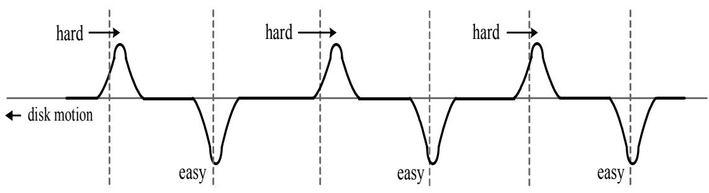
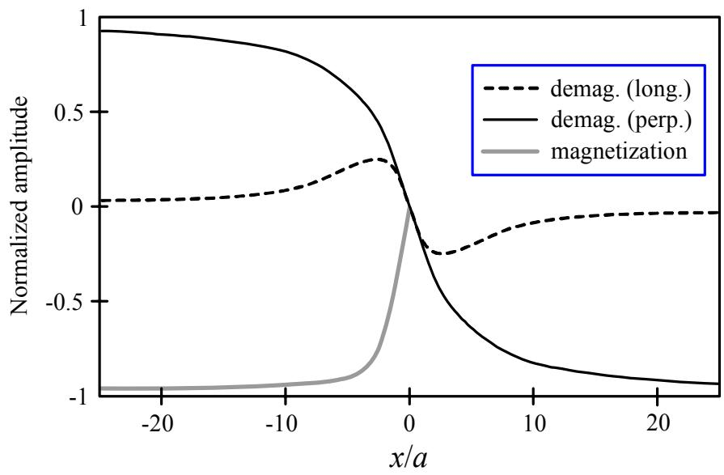
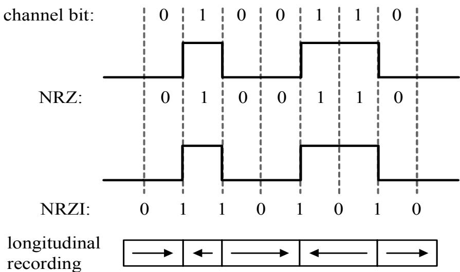
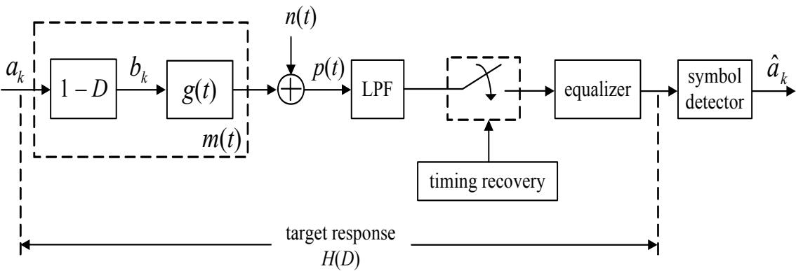
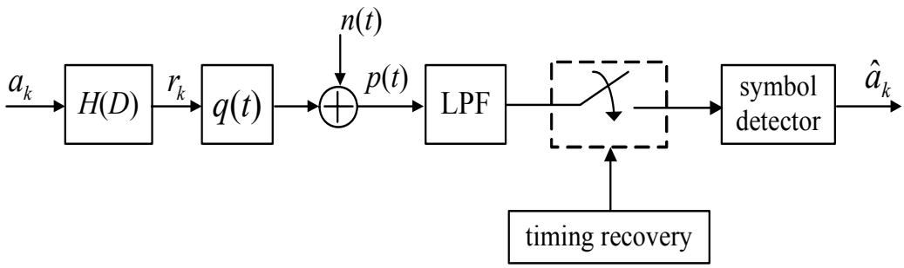
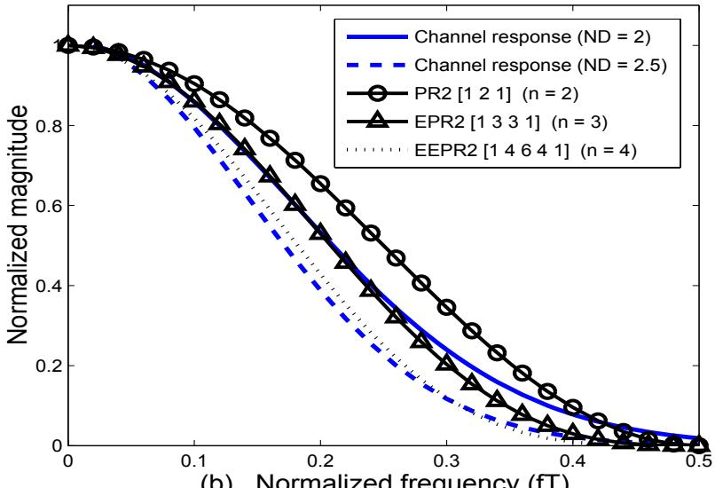
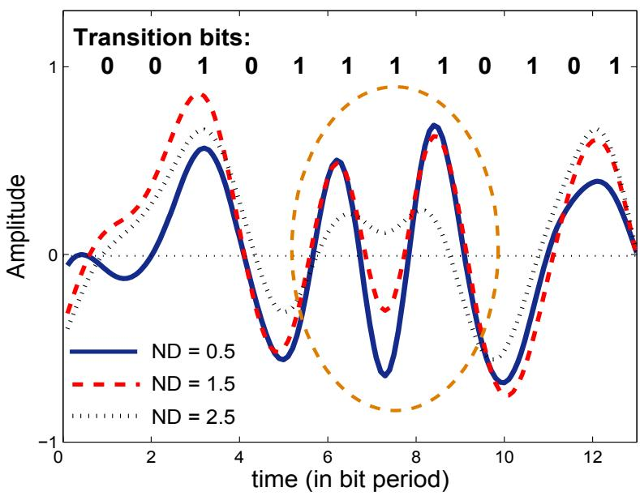

## 6.1 引言

如今，各种电子设备，如计算机、手机、便携式音乐播放器和数字相机等，对数据存储空间的需求日益增长。数字磁记录（digital magnetic recording）技术被认为是各种应用（application）中存储数据的主要方法，包括硬盘驱动器（hard disk drive）、软盘（floppy disk）和磁带（magnetic tape）。然而，所有这些应用都基于相同的基本工作原理，涉及读写头（read head）、写头（write head）和磁存储介质（magnetic media），如图 6.1 所示。其中，电感式读写头（inductive head）由具有低矫顽力（coercivity）和高磁导率（permeability）的磁性材料制成 [1]，周围绕有线圈；而存储介质通常由具有高矫顽力的磁性材料制成。

本书将重点讲解两种记录技术：纵向记录（longitudinal recording）和垂直记录（perpendicular recording）。纵向记录是过去硬盘驱动器所采用的技术，其存储介质的磁化方向与磁盘平面平行，如图 6.1 所示。而垂直记录技术已开始在目前的硬盘驱动器中采用，其存储介质的磁化方向与磁盘平面垂直。目前，垂直记录技术的研究进展迅速，因为与纵向记录技术相比，它可以将硬盘驱动器的存储容量提高数十倍 [19]。

硬盘驱动器中的数字数据存储系统（digital data storage system）可以用一个通用框图来模拟，如图 6.2 所示。信息比特（message bits）首先由“纠错码编码器（error-correction code (ECC) encoder）”进行编码，目前硬盘驱动器中常用的纠错码是 RS 码（Reed-Solomon code）[42, 43]。随后，编码后的数据再次通过“调制编码器（modulation encoder）”进行编码，以调整数据的特性使其适应硬盘驱动器的信道，例如使数据序列符合特定格式或消除直流分量（d.c. component）等。调制编码器中常用的编码方式是 RLL 码（run-length limited code）[44]。调制编码器的输出数据被视为将要写入存储介质的数据，称为“记录比特（recorded bit）”。之后，记录比特被发送至“调制器（modulator）”，将其转换为写电流波形（write current waveform），然后由写头将该波形写入存储介质中。

在读取数据阶段，当读写头移动到磁化方向发生变化的区域时（见图 6.1），读写头将从存储介质中读取数据，输出一个电压波形信号，称为“回读信号（read-back signal）”。关于写入和读取过程的详细说明将在 6.2 和 6.3 节中分别讨论。随后，回读信号被送入读取信道（read channel）进行处理，读取信道包含以下组件：低通滤波器（LPF: low-pass filter）、采样电路（sampler 或 analog-to-digital converter）、均衡器（equalizer）和检测器（detector）等。最终的输出数据由调制解码器（modulation decoder）和纠错码解码器（ECC decoder）进行解码，以恢复所需的原始信息比特。

  
图 6.2: 硬盘驱动器数字数据存储系统的通用模型

## 6.2 写过程

硬盘驱动器中写过程的详细信息可以用图 6.3 的框图表示，其中每个模块的工作原理如下：

## 6.2. 写过程

图 6.3: 写过程框图

  
(a) 单比特错误 (single bit error)

  
(b) 突发错误 (burst of errors)

图 6.4: 错误类型：(a) 单比特错误和 (b) 突发错误。其中虚线表示没有错误时的信号波形。

### 6.2.1 纠错码编码电路

在硬盘驱动器的信号处理系统中，经常出现的错误（error）主要可分为两类：单比特错误（single bit error）和突发错误（burst of errors），如图 6.4 所示。通常，单比特错误是由短时间内具有大振幅的噪声干扰引起的，这会导致产生额外的脉冲信号或使脉冲信号被衰减，如图 6.4(a) 所示，其中虚线表示无错误时的信号波形。而突发错误通常由存储介质的缺陷（defect）引起，例如介质上的划痕或污垢等，这会导致接收端电路（receiver）出现连续多个比特的错误，如图 6.4(b) 所示。在实际应用中，突发错误对系统整体性能的影响比单比特错误更为严重。

  
图 6.5: 纠错编码框图

纠错码（ECC: error-correction code）的作用是帮助修正系统中发生的错误。其中，RS 码（Reed-Solomon code）[44] 是一种从过去到现在被广泛应用于硬盘驱动器的 ECC 类型，这是因为 RS 码能够高效地修正突发错误。在发送端电路（transmitter）的编码步骤中，ECC 编码器（ECC encoder）每次对 $k$ 比特的记录块进行编码，并产生一个 $n$ 比特的输出块，如图 6.5 所示。其中，“码率（code rate）”定义为：

$$
R = \frac{k}{n} \tag{6.1}
$$

由于输出比特数总是大于或等于输入比特数，因此 $R \leq 1$ 始终成立。随后，在接收端电路，ECC 解码器（ECC decoder）负责对每块 $n$ 比特的数据进行解码，并恢复出 $k$ 比特的原始数据。通常，硬盘驱动器中的数字存储系统允许的比特误码率（BER: bit-error rate）在 ECC 解码器输入端测量时需满足 $\text{BER} < 10^{-9}$。

RS 码能够修正多少个连续比特的错误取决于 RS 码使用的参数 $(n, k)$。也就是说，RS 码能够：

- 检测（detect）长度不超过 $(n - k)$ 比特的突发错误。
- 修正（correct）长度不超过 $(n - k)/2$ 比特的突发错误。

例如，(31, 15) 类型的 RS 码能够检测长度不超过 $31 - 15 = 16$ 比特的突发错误，并能够修正长度不超过 $(31 - 15)/2 = 8$ 比特的突发错误。

总之，使用 ECC 编码的优点是能够减少系统错误，从而提高硬盘驱动器存储数据的可靠性。也就是说，ECC 解码器可以自动修正接收端电路中发生的错误。而 ECC 编码的缺点是输出比特数多于输入比特数，这些增加的比特被称为“冗余比特（redundant bit）”，它们并非用户想要存储的数据，而是用于辅助 ECC 解码器修正错误。因此，冗余比特会导致存储介质的存储空间被占用。例如，如果用户想存储 100 比特的信息，可能只能存储 90 比特，因为必须留出 10 比特的空间存储冗余比特，从而导致存储空间损失 10%。

### 为什么使用 ECC 码能增加硬盘驱动器的容量

读者可能会好奇，既然 ECC 编码会产生冗余比特并占用存储空间，为什么硬盘驱动器的信号处理系统仍然采用 ECC 编码？实际上，ECC 编码反而能增加硬盘驱动器的容量，解释如下：

考虑两个系统：使用 ECC 码的系统 A 和不使用 ECC 码的系统 B。假设系统 A 使用的 ECC 码能够修正每个 16 比特数据块中最多 1 个比特的错误，其中每个块包含 8 比特有用数据和 8 比特冗余比特。因此，只有当系统中出现 2 个或更多错误时，系统 A 才会发生错误。假设系统中的错误概率（probability of error）服从二项分布（binomial distribution），并用 $q_i$ 表示系统 $i$ 出现 1 比特错误的概率（其中 $i$ 为 A 或 B）。那么，系统 A 发生错误的概率可以通过式 (6.2) 计算：

$$
P_e \approx \binom{16}{2} q_A^2 (1 - q_A)^{16-2} = 120 q_A^2 (1 - q_A)^{14} \tag{6.2}
$$

如果规定 $\text{BER} = P_e = 10^{-9}$ 是硬盘驱动器能高效工作的水平，解式 (6.2) 可得 $q_A \approx 3 \times 10^{-6}$。这意味着，只有当单比特错误概率为 $3 \times 10^{-6}$ 时，系统 A 才会发生错误。同样地，由于系统 B 不使用 ECC 码，因此当单比特错误概率 $q_B = 10^{-9}$ 时，系统 B 就会发生错误。

假设系统中的 BER 仅由随机噪声（random noise）引起。那么，为了达到规定的 BER，系统所需的信噪比（SNR: signal-to-noise ratio）是可以计算的。例如，为了使系统 A 和 B 都能高效工作，系统 B（不使用 ECC）必须满足 $\text{BER} = q_B = 10^{-9}$，这需要系统 B 的 $\text{SNR} = 22$ 分贝 (dB)。同样，系统 A（使用 ECC）在 $q_A = 3 \times 10^{-6}$ 时可达到 $\text{BER} = 10^{-9}$，此时系统 A 仅需 $\text{SNR} = 19 \text{ dB}$（所需的 SNR 值取决于 $q_i$ 而非 BER）。因此，可以说系统 A 相比于系统 B 具有 3 dB 的增益。在实际应用中，通过使用 ECC 码获得的这种增益被称为“编码增益（coding gain）” [42, 43]。这种以 SNR 形式体现的编码增益可以增加硬盘驱动器中的“记录密度（recording density）”。

考虑系统中主要噪声为介质噪声（media noise）的情况。书中 [1] 提到：“将磁道宽度（track width）减半会导致系统损失 3 dB 的 SNR”。因此，尽管系统 A（使用 ECC）需要损失 50% 的存储空间用于冗余比特，但由于系统 A 具有 3 dB 的编码增益（相对于系统 B），因此可以将系统 A 的磁道宽度减半。这意味着系统 A 的存储空间增加了 100%。因此，使用 ECC 码带来的净增益是：硬盘驱动器的存储容量增加了约 $100\% - 50\% = 50\%$。由此可以得出结论，使用 ECC 码能有效增加存储容量。

### 未来 ECC 码的使用趋势

在目前的硬盘驱动器应用中，ECC 解码电路与符号检测电路（symbol detector）通常独立工作。然而，研究表明 [45]，如果将 ECC 解码电路与符号检测电路设计为协同工作，系统的整体性能将显著提升。因此，在未来的硬盘驱动器信号处理系统中，将 ECC 解码电路与符号检测电路结合使用的可能性很高。除了 RS 码之外，可能会采用的 ECC 码还包括 LDPC 码（low-density parity-check）[46] 或 Turbo 码（turbo code）[47] 等。

### 6.2.2 调制编码电路

通常，调制码（modulation code）的作用是处理信道畸变（distortion）以及在信号传输过程中产生的各种噪声。在磁记录系统（magnetic recording system）中，调制码发挥多种作用，包括：消除（或尽可能减少）直流分量、调整信号特性以使其适应信道从而最小化畸变、增加写入介质的“状态切换比特（transition bit）”之间的距离，以及减轻符号间干扰（ISI: intersymbol interference）的影响等。

硬盘驱动器中常用的调制码是 RLL 码（run-length limited）[44]。该码的作用是规定在写入介质的数据序列中，连续出现的状态切换比特、比特 “0” 和比特 “1”（基于 NRZ1 格式）的数量。通常，RLL 码由参数 $k/n (d, k)$ 定义，其中：

- 参数 $k$ 是每次编码的输入比特数。
- 参数 $n$ 是每次编码得到的输出比特数（码率 = $k/n$）。
- 参数 $d$ 是一个整数，规定两个比特 1 之间最少必须有 $d$ 个比特 0。

表 6.1：Miller 编码规则（当 $x=0$ 且前一比特为 1 时 $x=0$，否则 $x=1$）

<table><tr><td>输入比特</td><td>输出比特</td></tr><tr><td>0</td><td>x0</td></tr><tr><td>1</td><td>01</td></tr></table>

- 参数 $k$ 是一个整数，规定两个比特 1 之间最多可以有 $k$ 个比特 0。

由于写入介质的数据采用 NRZ1 格式，即比特 1 代表磁化方向发生状态切换（transition），当读头读取该部分时，会产生“状态切换脉冲信号（transition pulse）”。因此，参数 $d$ 有助于增加两个比特 1 之间的距离，从而减轻 ISI 的影响；而参数 $k$ 则保证写入介质的数据序列中能够定期出现状态切换比特，使定时恢复系统（timing recovery system）能够高效工作。

**示例 6.1**：考虑 Miller 1/2 (1, 3) 码，其编码规则见表 6.1。请使用 Miller 码对数据 $\{1, 0, 1, 1, 1, 0, 0, 1\}$ 进行编码。

## 6.2. 写过程

**解**：根据表 6.1，数据 $\{1, 0, 1, 1, 1, 0, 0, 1\}$ 经 Miller 编码后得到：

$$
\{ 0 1 \ 0 0 \ 0 1 \ 0 1 \ 0 1 \ 0 0 \ 1 0 \ 0 1 \}
$$

可见，输出数据符合参数 $d=1$ 和 $k=3$。由于 Miller 码的码率为 1/2，即 1 个输入比特产生 2 个输出比特。

从上述示例可以看出，使用 Miller 码会导致硬盘驱动器的有效存储空间损失 50%（可通过码率看出）。因此，Miller 码在目前已不再流行。总之，理想的 RLL 码其码率应尽可能接近 1，以最大限度地减少存储空间的损失。此外，通常 RLL 的编解码是通过“查找表（look-up table）”实现的。也就是说，每种 RLL 码都有相应的编码表和解码表（如表 6.1）。在编码（encoding）过程中，查看编码电路输入端的比特值并匹配查找表以输出对应的比特；在解码（decoding）过程中，查看解码电路输入端的比特值并匹配查找表以恢复原始比特。感兴趣的读者可以在《数字数据存储信号处理 第 2 卷：接收端电路设计》[6] 的第 8 章中学习 RLL 码的详细信息及简单设计方法。

### 6.2.3 预编码电路

均衡器（equalizer）的工作可分为两部分：一部分位于发送端电路，另一部分位于接收端电路。位于发送端的均衡器被称为“预编码器（precoder）”，它可以减轻接收端均衡器的工作负担。本节将总结预编码电路的工作原理。关于针对不同信道类型设计合适预编码电路的详细信息，可参考 [48]。

预编码器以另一种方式对数据进行编码，旨在防止写入介质的数据序列出现不希望出现的某种数据模式（data pattern），并增加编码后数据的欧几里得距离（Euclidean distance）[49]，从而降低系统的 BER。硬盘驱动器中常用的预编码电路具有如下传递函数（transfer function）：$P(D) = 1 / (1 \oplus D)$ 或 $P(D) = 1 / (1 \oplus D^2)$ 等。其中 $\oplus$ 表示 XOR（异或）运算符，其运算逻辑见表 6.2。预编码电路的操作非常简单，如下例所示：

表 6.2：XOR 运算符逻辑

<table><tr><td>运算</td><td>结果</td></tr><tr><td> $0 \oplus 0$ </td><td>0</td></tr><tr><td> $0 \oplus 1$ </td><td>1</td></tr><tr><td> $1 \oplus 0$ </td><td>1</td></tr><tr><td> $1 \oplus 1$ </td><td>0</td></tr></table>

  
图 6.6: 预编码电路 $P(D) = 1 / (1 \oplus D^2)$

**示例 6.2**：请使用预编码电路 $P(D) = 1 / (1 \oplus D^2)$ 对数据 $a_k = \{0, 1, 1, 0, 1, 0, 1, 0, 0, 1, 1\}$ 进行编码。

## 6.2. 写过程

**解**：预编码电路 $P(D) = 1 / (1 \oplus D^2)$ 可以表示为图 6.6 的框图，其输出数据 $b_k$ 可以用如下数学公式表示：

$$
b_k = a_k \oplus a_{k-2}
$$

当 $a_k = \{0, 1, 1, 0, 1, 0, 1, 0, 0, 1, 1\}$ 时，可得 $b_k = \{0, 1, 1, 1, 0, 1, 1, 1, 1, 0, 0\}$。

### 6.2.4 写过程中的非线性

在实际应用中，写过程的非线性（nonlinearity）比读过程更明显。然而，在分析硬盘驱动器的信号处理系统时，通常假设从读头获得的 read-back 信号具有叠加（superposition）特性，即 read-back 信号可以用状态切换脉冲的线性叠加之和来表示，这符合脉冲幅度调制（PAM: pulse amplitude modulation）理论。这使得 read-back 信号可以用数学公式来描述。但如果系统中出现非线性，read-back 信号的叠加特性将不再成立，这将导致接收端电路容易出现误码。因此，本节将介绍写过程中出现的四类非线性 [1, 5, 11, 43]：部分擦除（partial erasure）、硬状态切换偏移（HTS: hard transition shift）、覆盖写入（overwrite）以及非线性状态切换偏移（NLTS: nonlinear transition shift），详细说明如下：

#### 部分擦除

部分擦除（partial erasure）现象，也被称为“非线性幅度损失（nonlinear amplitude loss）”，是由存储介质中状态切换区域的磁粒子渗透（percolation）引起的，如图 6.7 所示。也就是说，磁道（track）

  
图 6.7: 部分擦除特征示例

的部分被擦除，这将导致读头在该点读取的脉冲信号幅度降低，这是由于磁道宽度（track width）变窄引起的，从而使 read-back 信号的线性叠加特性发生畸变。通常，这种部分擦除现象在硬盘驱动器存储容量较高时较为常见。

#### 硬状态切换偏移

在磁记录系统中，删除旧数据可以通过直接写入新数据来覆盖。当写头的磁场方向与存储介质中拟覆盖区域的剩余磁场（remanent magnetic field）方向相同时，会发生所谓的“易状态切换偏移（ETS: easy transition shift）”现象。而当写头磁场方向与介质中的剩余磁场方向相反时，则会发生“硬状态切换偏移（HTS: hard transition shift）”现象。通常，与 HTS 相比，ETS 带来的影响较小（可以忽略不计）。

  
图 6.8: 硬状态切换偏移 (HTS) 与易状态切换偏移 (ETS) 的特征示例

HTS 现象会使得向介质写入数据变得困难，因为写头必须产生比介质中剩余磁场强度大得多的磁场才能成功写入。因此，与 ETS 相比，HTS 会导致介质中状态切换的位置显著向后偏移，如图 6.8 所示。在写过程中，系统无法预先知道介质中剩余磁场的方向，因此无法通过“写前补偿（write precompensation）”技术来防止 HTS 的发生，该技术将在 6.2.5 节中讨论。

#### 覆盖写入

在向介质写入新数据以覆盖旧数据（即“覆盖写入 (overwrite)”）时，写头磁场必须大于介质中的剩余磁场，以确保不产生错误。为了衡量介质覆盖旧数据写入新数据的能力，定义了“覆盖比（OW: overwrite ratio）”参数。

（注：原文中此处存在部分乱码，根据上下文，描述的是通过写入特定频率信号来测量覆盖能力）

具体地，先将频率为 $f_1$ 的方波信号写入介质，然后写入频率为 $f_2$ 的方波信号以覆盖原数据（通常取 $f_2 = 2f_1$）。覆盖比 $\text{OW}$ 定义为新数据信号在 $f_1$ 处的电平 $V_{f_2}(f_1)$（源自残余的 $f_1$ 信号）与原信号电平 $V_{f_1}(f_1)$ 之比，即：

$$
\mathrm{OW} = 20 \log_{10} \left( \frac{V_{f_2}(f_1)}{V_{f_1}(f_1)} \right) \tag{6.3}
$$

单位为分贝 (dB)。在实际应用中，磁记录系统只有在 $\text{OW} < -30 \text{ dB}$ 时才能高效地进行读写 [1]。

#### 非线性状态切换偏移

非线性状态切换偏移（NLTS: nonlinear transition shift）是指介质中状态切换位置（transition position）的改变。其原因是此前写入介质的状态切换产生的静磁场（magnetostatic field）方向（或极性）与随后写入的下一个状态切换比特的写头磁场方向相反。NLTS 对系统整体性能有显著影响，尤其是在硬盘驱动器容量较高时。这是因为在高容量下，所有待写入的数据比特被挤在更小的空间内，导致发生 NLTS 现象的概率增加。

在实际应用中，只有当之前的状态切换产生的退磁场（demagnetizing field）$H_d$ 与写场（write field）$H_h$ 之和等于介质的矫顽力（coercivity）$H_c$ 时，状态切换比特才能被写入介质。其关系式如下 [11, 20]：

$$
H_d(x_0 - \epsilon) + H_h(x_0 - \epsilon) = H_c \tag{6.4}
$$

其中 $x_0$ 是拟写入状态切换比特的位置，$\epsilon$ 是状态切换偏移量（transition shift）。当 $\epsilon$ 非常小时，可以通过在 $x_0$ 点进行泰勒级数展开（Taylor series expansion）来计算 $\epsilon$ [20]：

$$
\epsilon \approx \frac{H_d(x_0)}{\left( \left. \frac{dH_h}{dx} \right|_{x=x_0} \right)} \tag{6.5}
$$

  
图 6.9: 纵向记录与垂直记录介质中的退磁场相对于写头磁场的分布 [50]

### 6.2.5 写前补偿

写前补偿（write precompensation）技术被用于减轻 NLTS 的影响。由于 NLTS 的严重程度取决于写入介质的数据模式，因此系统可以使用各种技术来计算状态切换位置的偏移量，例如通过分析提取出的脉冲形状（extracted pulse shape）[52] 或在频域中进行分析 [53] 等。

写前补偿的一般工作原理如下：对于纵向记录系统，当在介质中写入状态切换比特时，如果发生 NLTS，当前比特的状态切换位置会被推向前一个比特的状态切换位置。因此，可以通过在写入当前状态切换比特时引入一定的延迟来补偿这种影响。假设 $\epsilon$ 为状态切换位置的偏移量，写前补偿会将当前比特的状态切换位置向后推移 $\epsilon$ 的距离。这样，当 NLTS 发生时，最终的结果是当前比特的状态切换位置恰好回到所需的目标位置，即 $-\epsilon + \epsilon = 0$。有关写前补偿的详细信息和方法，可参考 [43, 52, 53]。

### 6.2.6 调制器电路

调制器（modulator）的作用是将比特数据转换为矩形电流波形（rectangular current waveform），称为“写电流（write current）”（见图 6.1）。随后，写电流被馈送到写头（write head）的线圈中，在写头与介质之间的间隙（gap）处产生写磁场（magnetic write field）。通常，写磁场的强度必须大于介质的矫顽力，以便使介质在相应区域的磁化方向与写磁场方向一致。此外，可以通过改变写磁场的方向（或写电流的方向）来实现介质磁化方向的状态切换，从而记录比特 0 和比特 1。

在实际应用中，硬盘驱动器数字存储系统采用“二进制记录（binary recording）”，即介质中的磁化方向仅有两种可能。或者说，系统仅能记录两种电平（或两个值）。这与 DVD 的记录方式不同，DVD 可以记录多个电平。这是因为硬盘的写过程具有较强的非线性，如果尝试记录两个以上的电平，非线性影响将更加严重，从而大幅降低系统整体性能 [5]。

#### 数据格式

在磁记录系统中，用于生成矩形电流波形的数据格式主要有两种：

1) **NRZ (non-return-to-zero)**：电流波形的幅度代表二进制比特。高幅度代表比特 “1”，低幅度代表比特 “0”。
2) **NRZI (non-return-to-zero interleaved)**：比特 “1” 表示电流波形发生状态切换，比特 “0” 表示电流波形不发生状态切换。

图 6.12 显示了 NRZ 和 NRZI 数据的示例。当信道比特（channel bit）为要写入介质的真实数据时，可以看到信道比特与 NRZ 数据相同，但与 NRZI 数据不同，尽管它们最终生成的电流波形均均为矩形波。

然而，在分析硬盘驱动器的信号处理系统时，通常使用 NRZI 来描述 read-back 信号的特性。也就是说，当读头移动到状态切换区域时，会感应出电压脉冲，称为“状态切换脉冲（transition pulse）”。这可以看作是将比特 1 与信道的状态切换响应（transition response）相乘。因此，介质中磁场发生状态切换的位置可以用比特 1 表示，而没有状态切换的位置用比特 0 表示（详见 6.3.3 节）。

  
图 6.12: NRZ 与 NRZI 数据的特征

  
图 6.13: NRZ 与 NRZI 数据关系的模型

**NRZ 与 NRZI 的关系**

通常，NRZ 和 NRZI 数据的关系如图 6.13 所示，可以用以下数学公式表示：

$$
\mathrm{NRZ} = \left( \frac{1}{1 \oplus D} \right) \mathrm{NRZI} \tag{6.6}
$$

或者

$$
\mathrm{NRZI} = (1 \oplus D) \mathrm{NRZ} \tag{6.7}
$$

其中 $D$ 是单位延迟运算符，$\oplus$ 是 XOR 运算符。

**示例 6.3**：根据图 6.13，如果 NRZ 数据为 $\{0, 1, 0, 0, 1, 1, 0\}$，请计算对应的 NRZI 数据。

**解**：设 $\{a_k\}$ 为 NRZ 数据，$\{b_k\}$ 为 NRZI 数据。根据式 (6.7)：

$$
b_k = (1 \oplus D) a_k = a_k \oplus a_{k-1}
$$

由于 $\{a_k\} = \{0, 1, 0, 0, 1, 1, 0\}$，则 NRZI 数据为 $\{b_k\} = \{0, 1, 1, 0, 1, 0, 1, 0\}$。

总之，NRZ 的比特 “1” 代表介质的一种磁化方向，比特 “0” 代表相反方向。而 NRZI 的比特 “1” 表示介质磁化方向发生状态切换，比特 “0” 表示不发生状态切换。

### 6.2.7 优质存储介质的特性

在为硬盘驱动器选择磁性材料作为存储介质时，需考虑以下特性 [1]：

- **高矫顽力 (coercivity)**：有助于实现快速的状态切换。
- **高剩余磁化强度 (remanent magnetization)** 且介质厚度较薄：有助于提高 read-back 信号的幅度并提升信号质量。
- **具有接近矩形的磁滞回线 (hysteresis loop)**：以便能够产生快速的状态切换，并获得良好的覆盖比 (Overwrite ratio)。
- **表面极其光滑 (smoothness)**。
- **具有细小且分布均匀的晶粒 (grain) 结构**：有助于减少进入 read-back 信号的介质噪声 (media noise)。

## 6.3 读过程

在读取数据过程中，读头负责检测介质中磁化方向切换位置处的磁通量（magnetic flux）变化。根据法拉第电磁感应定律（Faraday's Law），这种变化会在线圈中产生感应电压脉冲。对于孤立状态切换（isolated transition）区域，读头产生的电压脉冲被称为“状态切换脉冲（transition pulse）”。由于硬盘驱动器的读取过程可以近似地视为线性过程（这与写过程具有更强非线性不同），因此 read-back 信号可以表示为与状态切换比特相对应的状态切换脉冲的叠加之和。其中，相邻的状态切换脉冲具有相反的极性，详情将在 6.3.3 节中讨论。

### 6.3.1 读头类型

硬盘驱动器中的读头（read head）负责将磁通量转换为 read-back 信号形式的电压。常用的读头类型包括：

1) **铁氧体读头 (ferrite head)**：于 20 世纪 70 年代开始使用。作为写头时性能良好，但作为读头时性能较差，因为其产生的 read-back 信号幅度较低。
2) **MR 读头 (magneto-resistive head)**：于 20 世纪 90 年代开始使用。作为读头时性能优异，因为 MR 读头对磁场变化非常敏感，能产生高幅度的 read-back 信号。
3) **GMR 读头 (giant magneto-resistive head)**：于 1997 年开始使用，其性能比 MR 读头更高效。
4) **TMR 读头 (tunneling magneto-resistive head)** [1]：目前最主流的读头类型，效率高于其他所有类型的读头。

通常，读头的性能越好，系统的整体效率就越高。

### 6.3.2 干扰类型

在实际应用中，从读头获得的 read-back 信号会受到多种因素的影响而发生畸变（distort），包括噪声（noise）、畸变（distortion）和干扰（interference）。这些因素在磁记录系统中可总结如下：

#### 信号噪声

噪声（noise）由物理不确定性引起，必须使用统计方法进行处理。随着硬盘驱动器容量的增加，噪声的严重程度也会随之增加。常见的噪声来源包括：

1) **存储介质**：介质噪声（media noise）由介质中磁化状态的不确定性引起，是影响系统最严重的噪声，尤其是在垂直记录系统中。介质噪声主要分为三类：
   - **状态切换噪声 (transition noise)**：由介质中状态切换位置的磁化状态波动或不确定性引起。其严重程度取决于写入介质的数据模式。在薄膜盘（thin-film disk）中影响最大。随着硬盘容量增加，状态切换噪声也会增强。
   - **颗粒噪声 (granularity noise / particulate noise)**：由介质中磁颗粒（magnetic particle/grain）的随机分布引起。颗粒越粗糙，此类噪声越严重。它是磁带、软盘和薄膜盘中的主要噪声来源，且其严重程度与硬盘容量无关。
   - **带噪 (band noise)**：由介质磁化状态与记录状态之间的比例关系引起。它是薄膜盘中的主要噪声来源，通常随硬盘容量的增加而降低。

2) **读头**：读头噪声（head noise）由读头材料的物理特性引起。常见的有两种：Barkhausen 噪声和 Johnson 噪声 [1]。

3) **前置放大器**：电子噪声（electronics noise）由电子元件中电子的随机波动引起。电子设备运行一段时间后会产生热量，这种由电子运动产生的热能会导致电子噪声，也被称为“热噪声（thermal noise）”，通常表现为白噪声（white noise）。

#### 畸变

畸变（distortion）会导致 read-back 信号的叠加特性失效。畸变可分为：
- **写畸变 (write distortion)**：如硬状态切换偏移 (HTS) 和非线性状态切换偏移 (NLTS) 等。
- **读畸变 (read distortion)**：如部分擦除 (partial erasure) 和读头的非线性特性等。

#### 干扰

干扰（interference）会使 read-back 信号的形状偏离理想状态。硬盘驱动器中常见的干扰分为两类：轨道内干扰（on-track interference）和轨道间干扰（off-track interference）[1]。

### 6.3.3 Read-back 信号模型

当读头移动到介质中磁化方向发生切换的位置时，读头会产生一个状态切换脉冲，称为“状态切换响应（transition response）” $g(t)$ 或 $-g(t)$（正负号取决于磁化方向）（见图 6.1）。对于纵向记录系统，状态切换脉冲被称为“Lorentzian 脉冲”，其数学表达式为 [5]：

$$
g(t) = \frac{1}{1 + \left( \frac{2t}{\mathrm{PW}_{50}} \right)^2} \tag{6.8}
$$

其中 $\mathrm{PW}_{50}$ 是信号脉冲 $g(t)$ 在幅度为最大值一半处测得的宽度。对于垂直记录系统，状态切换脉冲的表达式为 [54]：

$$
g(t) = \mathrm{erf} \left( \frac{2t \sqrt{\ln 2}}{\mathrm{PW}_{50}} \right) \tag{6.9}
$$

其中 $\ln(\cdot)$ 为自然对数，$\mathrm{erf}(\cdot)$ 为误差函数，定义为 $\mathrm{erf}(x) = \frac{2}{\sqrt{\pi}} \int_0^x e^{-t^2} dt$，而 $\mathrm{PW}_{50}$ 是脉冲 $g'(t)$（即 $g(t)$ 的导数）在幅度为最大值一半处测得的宽度。

在硬盘驱动器记录系统中，归一化记录密度（ND: normalized recording density）定义为 [5]：

$$
\mathrm{ND} = \frac{\mathrm{PW}_{50}}{T} \tag{6.10}
$$

其中 $T$ 是一个比特的时间周期，称为“比特单元（bit cell）”。在实际应用中，ND 值决定了 $\mathrm{PW}_{50}$ 区域内可以存储多少个比特。因此，在 $T$ 为常数时，$\mathrm{PW}_{50}$ 或 ND 的增加意味着硬盘驱动器的存储容量增加。图 6.14 显示了不同 ND 水平下，纵向和垂直记录的状态切换响应。可见，两种系统的脉冲信号都会跨越多个比特单元。特别是当 ND 增加时，符号间干扰 (ISI) 会变得更加严重，因为相邻的状态切换脉冲更有可能相互重叠。图 6.15 显示了 ND 与 $\mathrm{PW}_{50}$ 之间的关系，符合式 (6.10)。

当读头移动到两个连续的状态切换位置时，产生的合成脉冲被称为“双比特脉冲（dibit pulse）”或“双比特响应（dibit response）” [5]，其表达式为：

$$
m(t) = g(t) - g(t - T) \tag{6.11}
$$

如图 6.16 所示。如果对 $m(t)$ 进行连续时间傅里叶变换（详见 3.2 节），则纵向记录系统的频率响应为：

$$
M(\Omega) = \exp \{ -\pi |\Omega| \mathrm{ND} \} (1 - \exp \{ -j 2 \pi \Omega \}) \tag{6.12}
$$

而垂直记录系统的频率响应为：

$$
M(\Omega) = \frac{T}{j \pi \Omega} \exp \left\{ -\frac{\pi^2 \Omega^2 \mathrm{ND}^2}{\ln 16} \right\} (1 - \exp \{ -j 2 \pi \Omega \}) \tag{6.13}
$$

其中 $\Omega = f T$ 是归一化频率 (normalized frequency)，$f$ 是频率（单位：赫兹 Hz），$|x|$ 表示绝对值，$j = \sqrt{-1}$ 是虚数单位。图 6.17 显示了双比特脉冲的频率响应。

从图 6.1 la  l l  l l (注：原图 6.17) 可以看出，随着 ND 的增加，两种双比特脉冲的频率响应都被压缩在低频区域。此外，纵向记录信道的频谱在 $f=0$ 处为零（spectral null），意味着没有直流分量；而垂直记录信道则包含直流分量。

### 6.3.4 用户密度

参考图 6.2 的模型，当信息比特（message bits）经过 ECC 编码器和调制编码器后，得到的结果称为“记录比特（recorded bits）”。记录比特的数量多于原始信息比特。在 $\mathrm{PW}_{50}$ 区域内写入的记录比特数量决定了归一化记录密度 ND（见式 6.10），该值也可称为“信道密度（channel density）”。ND 的取值会影响状态切换响应，如图 6.14 所示。

然而，在分析硬盘驱动器信号处理系统时，定义“用户密度（user density）”来指代在 $\mathrm{PW}_{50}$ 区域内实际存储的用户信息比特数（即不包括冗余比特的真实信息量）。设 $D_u$ 为用户密度，$R$ 为码率 (code rate)，则信道密度与用户密度的关系为：

$$
\mathrm{ND} = \frac{D_u}{R} \tag{6.14}
$$

由于 $R \leq 1$，因此 $\mathrm{ND} \geq D_u$ 始终成立。

## 6.4 磁记录信道模型

通常，磁记录系统的信道可以模拟为两种模型：真实信道模型（realistic channel model）和理想信道模型（ideal channel model）。

图 6.18：真实信道模型

其中，真实信道模型的工作特性与实际系统非常接近；而理想信道模型则常用于研究和分析硬盘驱动器信号处理系统的基础工作原理，因为该模型结构简单且易于理解。

### 6.4.1 真实信道模型

磁记录系统可以用数学模型表示，如图 6.18 所示。

当一个比特周期为 $T$ 的二进制输入数据序列 $a_k \in \{0, 1\}$ 通过理想微分器（ideal differentiator）$1 - D$ 时（其中 $D$ 是单位为 $T$ 的延迟算子），会产生一个状态转移序列 $b_k \in \{-1, 0, 1\}$。其中 $b_k = \pm 1$ 表示正向转移（positive transition）或反向转移（negative transition），而 $b_k = 0$ 表示没有发生状态转移。

状态转移序列 $b_k$ 将通过一个冲激响应为转移响应 $g(t)$ 的信道，并受到噪声信号 $n(t)$ 的干扰。读回信号（readback signal）$p(t)$ 将通过一个低通滤波器（LPF: low-pass filter）以消除带外噪声（out-of-band noise）。随后，由定时恢复（timing recovery）系统控制在特定时间点对信号进行采样。采样电路的输出数据将被发送至均衡器（equalizer）和符号检测器（symbol detector），以寻找最可能的输入序列（most likely input sequence），即求得 $a_k$ 的估计值 $\hat{a}_k$。

磁记录系统中常用的符号检测器是“维特比检测器（Viterbi detector）”[55]。然而，由于维特比检测器的复杂度会随着信道记忆（channel memory）数量的增加而呈指数级增长，因此必须使用均衡器来调整整个系统的总响应，使其符合所需的“目标响应（target response）”$H(D)$ [5]，从而降低维特比检测器的复杂度。（在《数字数据存储信号处理 第2卷：接收端电路设计》[6] 的第 3–4 章中详细介绍了目标响应和均衡器的设计 [56, 57, 58]，并证明了维特比检测器的复杂度为 $2^{L-1}$，其中 $L$ 是目标响应的抽头数，$L-1$ 表示目标响应的记忆长度）。这种将均衡器与维特比检测器结合使用的技术被称为“部分响应最大似然（PRML: partial-response maximum-likelihood）”技术，是硬盘驱动器信号处理系统中广泛采用的技术。

**注**：PRML 技术仍被用于水平记录和垂直记录系统的检测过程中，只是接收端电路中使用的参数有所不同。例如，水平记录系统使用的目标响应与垂直记录系统不同。因此，用户必须根据每个系统的信道选择合适的参数，以获得最高系统整体性能。

### 读回信号数学模型的来源

如图 6.18 所示，读回信号 $p(t)$ 的数学模型是通过实验室观察得出的。具体而言，研究人员首先将数据序列 $\{a_k\}$ 写入记录介质，其中 $\{a_k\}$ 根据 NRZ 格式转换为写入电流：比特 1 用高幅值电信号表示，比特 0 用低幅值电信号表示。随后，写入电流被馈入写头将数据写入介质。在读取过程中，每当读头经过介质磁化状态发生改变的区域时，就会产生一个转移脉冲 $g(t)$，最终形成如图 6.19 所示的读回信号 $p(t)$（假设系统中无噪声，即对于所有 $t$，$n(t) = 0$）。

图 6.19：读回信号数学模型来源示例

由于研究人员已知数据序列 $\{a_k\}$、脉冲信号 $g(t)$ 以及与 $\{a_k\}$ 相对应的读回信号 $p(t)$，因此尝试寻找这三者之间的关系。结论是：如果将数据序列 $\{a_k\}$ 通过 $1 - D$ 滤波器，将得到序列 $\{b_k\}$（如图 6.19 所示），即 $b_k = a_k - a_{k-1}$。随后，将序列 $\{b_k\}$ 与脉冲信号 $g(t)$ 根据“脉冲幅度调制（PAM: Pulse Amplitude Modulation）”原理进行调制，即可得到所需的读回信号。此外，为了使读回信号更真实，在图 6.18 的真实信道模型中加入了噪声信号 $n(t)$。值得注意的是，序列 $\{b_k\}$ 的绝对值正是 NRZI 格式下的状态转移序列（transition sequence）。

图 6.20：理想信道模型

### 6.4.2 理想信道模型

如果假设均衡过程是完美的（perfect equalization），图 6.18 中的模型可以简化为如图 6.20 所示的理想信道模型。在这种模型中，比特周期为 $T$ 的二进制输入数据序列 $a_k$ 将与理想奈奎斯特脉冲（ideal Nyquist pulse）$q(t) = \sin(\pi t / T) / (\pi t / T)$ [37] 进行调制，并受到噪声 $n(t)$ 的干扰。接收电路接收到的信号 $p(t)$ 将通过低通滤波器以消除带外噪声，随后由定时恢复系统控制进行采样。最后，采样电路的输出数据被发送至符号检测器，以寻找最可能的输入序列。

在水平记录中被广泛认可的部分响应目标响应（PR target）[59] 的数学表达式为 [5]：

$$
H(D) = (1 - D)(1 + D)^n \tag{6.15}
$$

$$
H(D) = (1 + D)^n \tag{6.16}
$$

其中 $n$ 是正整数。从方程 (6.16) 可以看出，垂直记录系统没有 $(1 - D)$ 项，这是因为垂直记录信道包含直流分量（见图 6.17）。图 6.21 比较了不同目标响应的频响特性，方括号 $[\cdot]$ 中的数字表示目标响应的每个抽头系数。例如，“PR4 $[1 \ 0 \ -1]$”表示 PR4（PR class-IV）目标响应，其 D 域传递函数为 $H(D) = 1 - D^2$；而 “EEPR2 $[1 \ 4 \ 6 \ 4 \ 1]$” 表示 EEPR2 目标响应，其 D 域传递函数为 $H(D) = 1 + 4D + 6D^2 + 4D^3 + D^4$。

从图 6.21 可以发现，当信道的 $\mathrm{ND}$ 值增加时，所使用的目标响应应具有更多的抽头（即 $L$ 值增加），以便目标响应的特性尽可能接近信道的实际响应，从而提高维特比检测器的运行效率（详见《数字数据存储信号处理 第2卷：接收端电路设计》[6] 的第 3 章）。此外，由方程 (6.15) 和 (6.16) 可知，所有 PR 目标响应的系数均为整数。然而，如果使用系数为实数的 target，称为“广义部分响应（GPR: generalized partial response）”或 GPR 目标响应，其系统整体性能将优于使用 PR 目标响应 [22, 56]。

## 6.5 读回信号中的符号间干扰

本节将讨论两个相邻的状态转移脉冲所产生的影响，如图 6.22 所示。两个相邻状态转移脉冲的叠加被称为“双比特响应（dibit response）”或“符号响应（symbol response）”。可以看出，随着 $\mathrm{ND}$ 的增加，双比特脉冲的幅值降低，且其峰值点偏离正常位置。这种现象被称为“符号间干扰（ISI: intersymbol interference）”，它是导致峰值检测过程（peak detection process）出现错误的主要原因，尤其是在 $\mathrm{ND}$ 较高的情况下。这是因为在 $\mathrm{ND}$ 较高时，状态转移脉冲会跨越多个比特单元（见图 6.22），从而使得两个状态转移脉冲相互重叠的可能性增大。当脉冲重叠严重时，ISI 的强度随之增加。因此可以总结为：$\mathrm{ND}$ 越高，读回信号中的 ISI 越严重。

(b) 归一化频率 ($f_T$)
图 6.21：磁记录信道不同目标响应的频响特性 (a) ...

图 6.22：$\mathrm{ND}=1$ 和 $\mathrm{ND}=3$ 时两个相邻状态转移脉冲的叠加结果

图 6.23：不同 $\mathrm{ND}$ 值下对应状态转移比特 $\{0, 0, 1, 0, 1, 1, 1, 1, 0, 1, 0, 1\}$ 的读回信号示例

图 6.23 展示了不同 $\mathrm{ND}$ 下的读回信号示例。由于读头在读取状态转移区域（对应状态转移比特值为 “1” 的位置）时会产生状态转移脉冲，因此通常状态转移比特 1 对应于信号的峰值或谷值位置。从图 6.23 可以观察到，在有多个连续状态转移比特的区域（虚线椭圆标记区域），$\mathrm{ND}$ 较大时的读回信号波形会发生严重畸变，导致使用峰值检测器（peak detector）难以对数据进行解码。

在实际应用中，处理读回信号中潜藏的 ISI 主要有两种方法：

1) **预防或避免 ISI 产生**：可以通过采用各种技术实现，例如预补偿（precompensation）、读信道均衡（read-channel equalization）或使用 RLL 编码等。

2) **直接处理 ISI**：在接收端电路中使用 PRML 技术，这是目前硬盘驱动器信号处理系统中广泛采用的方法。
