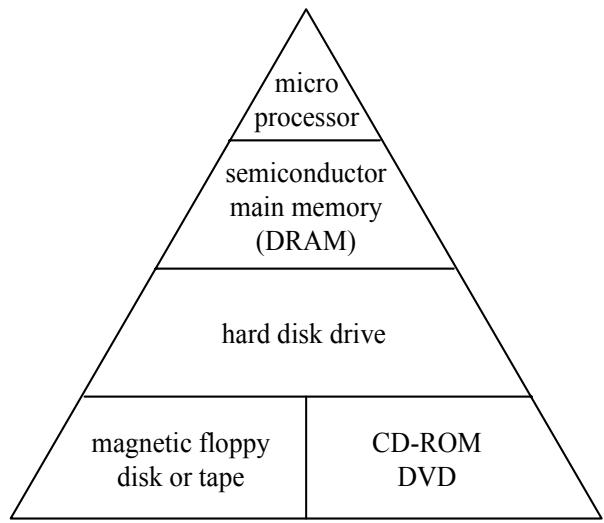
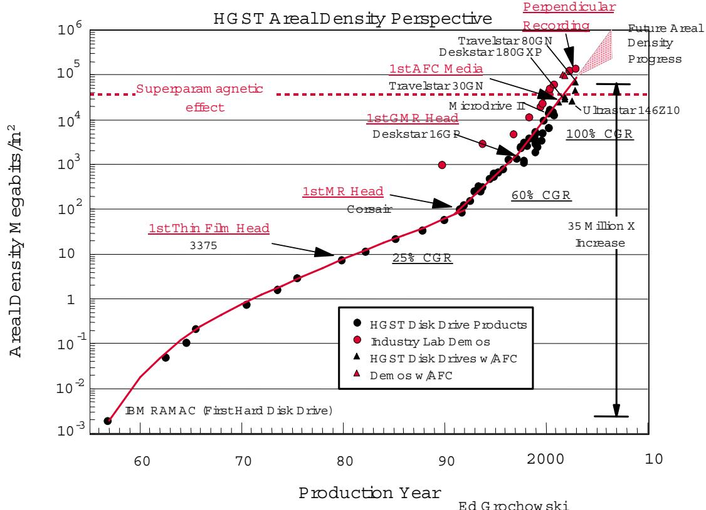
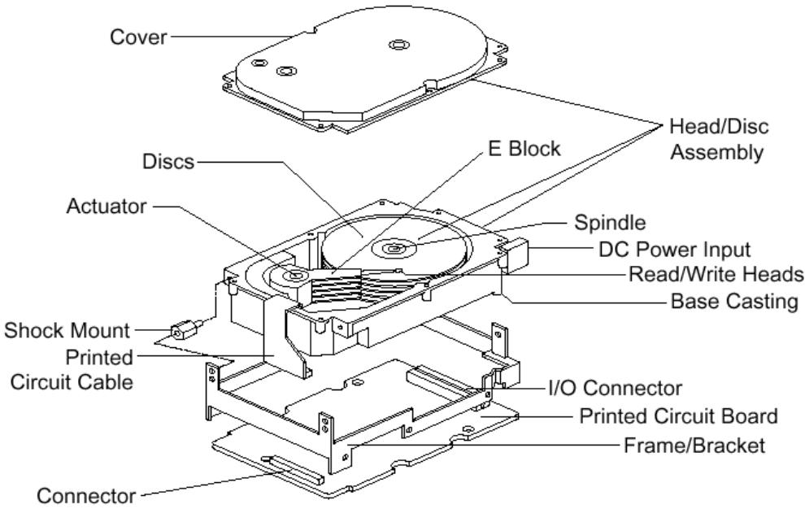
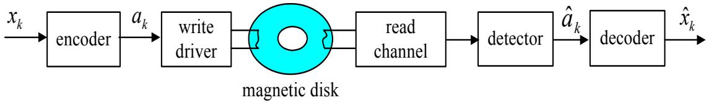
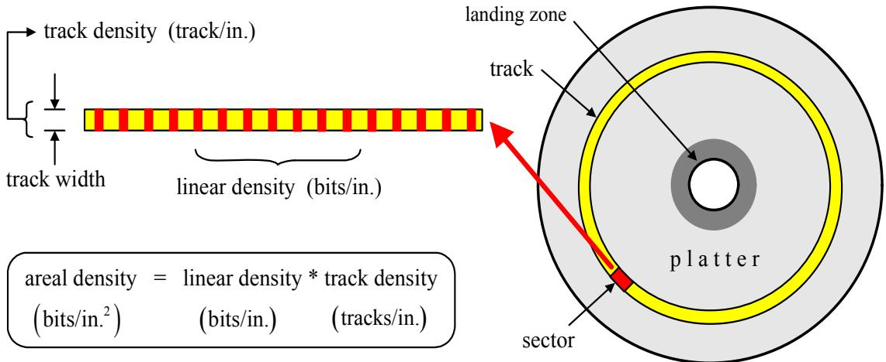
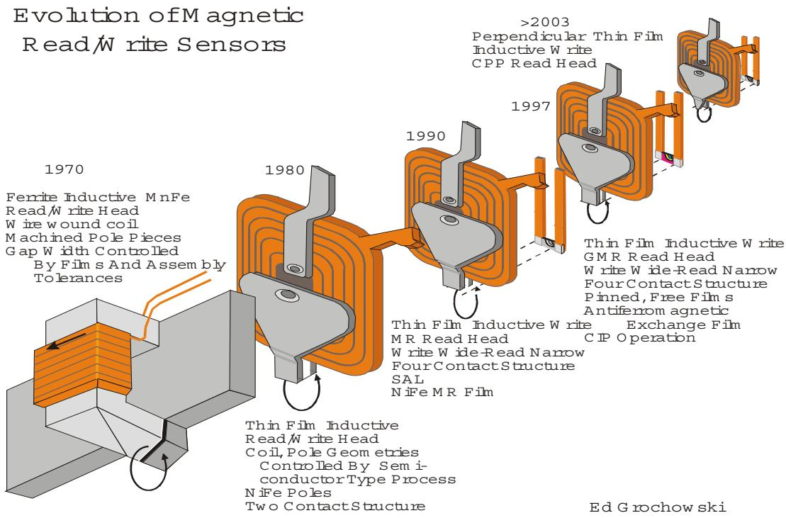
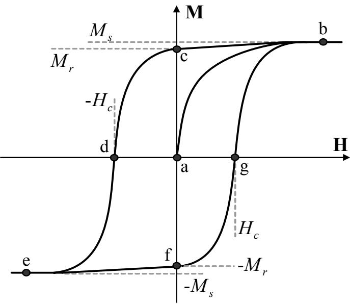
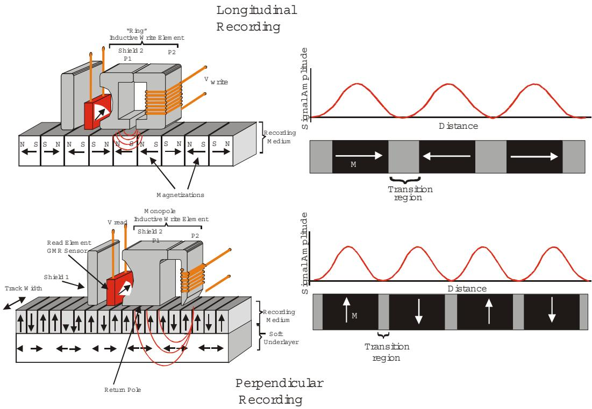
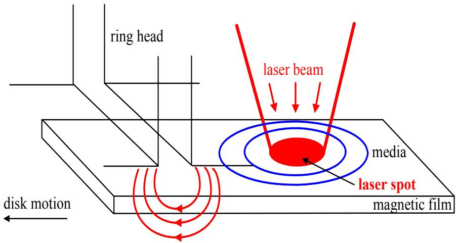
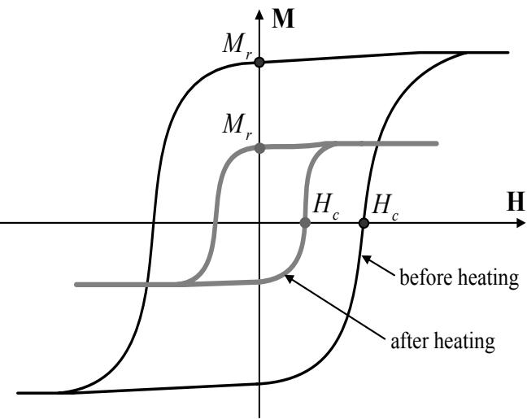

บทที่ 1

# ความรู้เบื้องต้นเกี่ยวกับการบันทึกระบบแม่ ญ 0 เหล็ก

ในบทนี้จะอธิบายถึงความสำคัญของระบบการบันทึกข้อมูล โดยจะเน้นไปที่อุปกรณ์ ฮาร์ดดิสก์ไดรฟ์ (hard disk drive) จากนันจะกล่าวถึงประวัติความเป็นมาของการบันทึกระบบแม่เหล็ก (magnetic recording) พร้อมทั้งอธิบายพื้นฐานต่างๆ เกียวกับการบันทึกระบบแม่เหล็ก เช่น โครงสร้างการจัดเก็บ ข้อมูลในฮาร์ดดิสก์ไดรฟ์, ลูปฮิสเทอรีซิส (Hysteresis loop), และซูเปอร์พาราแมกเนติก (superparamagnetic) เป็นต้น และสุดท้ายจะกล่าวถึงแนวโน้มของเทคโนโลยีการบันทึกข้อมูลต่างๆ ที่จะนำมาใช้ ในฮาร์ดดิสก์ไดรฟ์ในอนาคต เพื่อรองรับความต้องการในการจัดเก็บข้อมูลที่มากขึ้นเรือยๆ

## 1.1บทนำ

ปัจจุบันนี้เป็นยุคของข้อมูลข่าวสาร ดังนั้น จึงมีความต้องการระบบการบันทึกข้อมูลที่มีประสิทธิภาพ สูง, ราคาถูก, และมีความน่าเชื่อถือ เพื่อ ทำหน้าที่ในการจัดเก็บข้อมูลที่มีอยู่จำนวนมาก อุปกรณ์ สำหรับการบันทึกข้อมูลที่ใช้กันทั่วไปในปัจจุบัน เช่น แผ่นบันทึกแม่เหล็ก (magnetic floppy disk), แถบบันทึกแม่เหล็ก (magnetic tape), ฮาร์ดดิสก์ไดรฟ์, แผ่นซีดี (CD: compact disc), และแผ่นดีวีดี (DVD: digital versatile disc) เป็นต้น ซึ่งมักจะพบการใช้งานอุปกรณ์ เหล่านี้อย่างเห็นได้ชัดภายใน

  
รูปที่ 11: โครงสร้างลำดับชั้นของการบันทึกข้อมูล [1]

เครื่องคอมพิวเตอร์ นอกจากนี้ เมื่อเครื่องคอมพิวเตอร์สามารถทำการเชื่อมต่อกับเครือข่าย (network)   
ต่างๆ ได้แก่ เครือข่ายเฉพาะที่ (LAN: local area network) และ เครือข่ายอินเทอร์เน็ต (Internet)   
รวมทั้งการเกิดขึ้นของเวิลด์ไวด์เว็บ (พww: พorld พide พeb) ก็ยิ่งส่งผลทำให้เกิดความต้องการใน รู   
การจัดเก็บข้อมูลมากขึนตลอดเวลา

รูปที่1.1 แสดงโครงสร้างลำดับชั้นของการบันทึกข้อมูลของเครื่องคอมพิวเตอร์ โดยทั่วไปเครื่อง คอมพิวเตอร์จะประกอบไปด้วย ไมโครโพรเซสเซอร์ (microprocessor), หน่วยความจำหลักแบบสารกึ่ง ตัวนำ (semiconductor main memory), และอุปกรณ์สำหรับการบันทึกข้อมูล โดยไมโครโพรเซสเซอร์ จะทำหน้าที่หลักในการเข้าถึงและจัดเก็บข้อมูลในหน่วยความจำหลักแบบสารกึ่งตัวนำ เช่น ดีแรม (D-RAM: dynamic random access memory) เนืองจากมีความรวดเร็วในการเข้าถึงข้อมูล (น้อยกว่า 100 นาโนวินาที) อย่างไรก็ตาม ดีแรมถือว่าเป็นหน่วยความจำลบเลือนได้1 (volatile memory) และ มีความจุข้อมูลน้อย ดังนั้นจึงมีความต้องการใช้งานอุปกรณ์เสริมเพิ่มเติมสำหรับการบันทึกข้อมูล เช่น ฮาร์ดดิสก์ไดรฟ์, แผ่นบันทึกแม่เหล็ก, แถบบันทึกแม่เหล็ก, แผ่นซีดี, และแผ่นดีวีดี เป็นต้นซึ่ง

## 1.2. ประวัติความเป็นมาของการบันทึกระบบแม่เหล็ก

อุปกรณ์เหล่านี้ถือว่าเป็น หน่วยความจำไม่ลบเลือน2 (nonvolatile memory) ถึงแม้ว่าอุปกรณ์บันทึก รู้ส ข้อมูลเหล่านี้จะมีความจุข้อมูลสูง แต่ความเร็วในการเข้าถึงข้อมูลจะช้ามากเมื่อเทียบกับตัวดีแรม โดย สรุปแล้ว จากรูปที่ 1.1 ลำดับชั้นที่อยู่สูงๆ จะมีความโดดเด่นทางด้านความเร็วในการเข้าถึงข้อมูล แต่จะ มีความด้อยในเรื่องราคา กล่าวคือ ราคาต่อหนึ่งกิกะไบต์ (GB: gigabyte) จะมีราคาสูงมาก เมื่อเทียบ กับอุปกรณ์บันทึก ข้อมูลทั่วไป อย่างไรก็ตาม ฮาร์ดดิสก์ไดรฟัจัดได้ว่าเป็นอุปกรณ์ที่ใช้ในการจัดเก็บ ข้อมูลที่คุมค่ามากที่สุด เมื่อพิจารณาจากปัจจัยหลายๆ อย่าง ได้แก่ ความจุข้อมูล, ราคา, ความน่าเชือถือ, และประสิทธิภาพ เป็นต้น เพราะฉะนั้นในหนังสือเล่มนี้จะกล่าวถึงเฉพาะเทคโนโลยีการบันทึกข้อมูล สำหรับอุปกรณ์ฮาร์ดดิสก์ไดรฟ์เท่านัน

## 1.2 ประวัติความเป็นมาของการบันทึกระบบแม่เหล็ก

เทคนิคการบันทึกข้อมูลในยุคแรกๆ ที่ใช้ในเครื่องคอมพิวเตอร์จะเกี่ยวข้องกับกระดาษ โดยจะอยู่ใน รูปของบัตรเจาะรู (punch card) และแถบบันทึกกระดาษ (paper tape) โดยที่ข้อมูลจะถูกจัดเก็บโดย การเจาะรู หรือการเขียนบนกระดาษ [2] วิธีการเก็บข้อมูลลักษณะ นี้ยุ่งยากและทำงานช้า นอกจากนี สื่อบันทึก (media) ที่ใช้ในการเก็บข้อมูลก็ไม่คงทน ต่อมาจึงได้มีการนำแถบบันทึกแม่เหล็กมาใช้ใน การเก็บข้อมูลแทนการใช้กระดาษ โดยที่ กระบวนการในการอ่านและการเขียนข้อมูลของแถบบันทึก แม่เหล็ก จะคล้ายกับกระบวนการอ่านและการเขียนที่ใช้กับเครื่องเล่นเทปเพลง ข้อเสียหลักของแถบ บันทึกแม่เหล็กและเทปเพลง ก็คือ การเข้าถึงข้อมูลจะมีลักษณะเป็นเชิงเส้น (lineลr) นั้นคือ ระบบไม่ สามารถทำการเข้าถึงแบบสุ่ม (random access) ได้ ยุคถัดมาจึงได้มีการนำเอาแผ่นบันทึกแม่เหล็กมา ใช้งาน ซึ่งสามารถเข้าถึงข้อมูลแบบสุ่มได้ แต่อย่างไรก็ตาม แผ่นบันทึกแม่เหล็กมีความจุข้อมูลจำกัด และความเร็วในการเข้าถึงข้อมูลค่อนข้างช้า ดังนั้นจึงเข้ามาสู่ยุคของการบันทึกระบบแม่เหล็กของฮาร์ด ดิสก์ไดรฟ์ซึ่งมีข้อดีมากมาย เช่น มีความจุข้อมูลสูง, มีความเร็วในการเข้าถึงข้อมูลสูง, สามารถทำการ เข้าถึงข้อมูลแบบสุ่มได้ และอื่นๆ

การบันทึกระบบแม่เหล็กได้ถูกคิดค้นโดย Oberlin Smith [3] ในปี ค.ศ. 1888 และได้ถูกนำมา แสดงเป็นครั้งแรกโดยวิศวกรชื่อ Valdemar Poulsen ในปี ค.ศ. 1898 ในรูปของ "Telegraphone" [4] โดยเครื่อง Telegraphone นี้จะบันทึกสัญญาณเสียงแบบแอนะล็อก (analog) บนสายลวดเปียโน ที่พันรอบดรัม (drนm) ที่หมุนได้ หลังจากนั้นก็ใช้ระยะ เวลาในการพัฒนาหลายสิบปีจึงได้เป็นระบบ การบันทึกระบบแม่เหล็กออกมาสู่ท้องตลาด ในปัจจุบันนี้อุปกรณ์อิเล็กทรอนิกส์ต่างๆ เช่น เครื่อง คอมพิวเตอร์, โทรศัพท์มือถือ, เครื่องเล่นเพลงแบบพกพา, และกล้องดิจิทัล เป็นต้น มีความต้องการ พื้นที่ในการจัดเก็บข้อมูลเพิ่มากขึ้นรื่อยๆ เทคโนโลยีการบันทึกระบบแม่เหล็กแบบดิจิทัล (digital magnetic recording)ถือว่าเป็นวิธีการหลักที่ใช้ในอุปกรณ์บันทึกข้อมูลมากมาย ได้แก่ แผ่นบันทึก แม่เหล็ก, แถบบันทึกแม่เหล็ก, และฮาร์ดดิสก์ไดรฟ์ สำหรับการจัดเก็บข้อมูลของงานประยุกต์ (application)ต่างๆ

ฮาร์ดดิสก์ไดรฟ์ตัวแรกออกสู่ท้องตลาดในปี ค.ศ. 1956 โดยบริษัทไอบีเอ็ม (IBM) โดยมีชื่อเรียก ว่า "IBM 305 RAMAC3" [5] ซึ่งสามารถบันทึกข้อมูลได้ 5 เมกะไบต์ (MB: megabyte) โดยใช้ จานบันทึกแม่เหล็ก (magnetic disk) ทั้งหมด 50 แผ่น และแต่ละแผ่นมีขนาดเส้นผ่านศูนย์กลาง 24 นิ้ว อย่างไรก็ตาม ในปัจจุบันนี้ฮาร์ดดิสก์ไดรฟ์มีขนาดเล็กลงมาก ตัวอย่างเช่น มีขนาดความสูงน้อย กว่า 2 นิ้ว และจานบันทึกก็มีขนาดเส้นผ่านศูนย์กลางน้อยกว่า 3.5 นิ้ว แต่สามารถบันทึกข้อมูลได้ มากกว่า 100 GB รูปที่ 1.2 แสดงแนวโน้มการเติบโตของ "ความหนาแน่นเชิงพื้นที่ (areal density)" ซึ่งเป็นตัวชี้บอก (indicator) ปริมาณของข้อมูลบิต (bit) ที่สามารถถูกจัดเก็บในพื้นที่หนึ่งหน่วย บนสื่อบันทึก โดยทั่วไปมีหน่วยเป็น กิกะบิตต่อตารางนิ้ว (Gb/in2: gigabit per square inch) (ดู รายละเอียดคำนิยามของความหนาแน่นเชิงพื้นที่ได้ในหัวข้อที่ 1.4.3) จากรูปจะเห็นได้ว่า โดยสรุปแล้ว เมี่ลี่รี้ ความหนาแน่นเชิงพื้นที่เพิ่มขึ้นมากกว่า 50 ล้านเท่า ตั้งแต่ฮาร์ดดิสก์ไดรฟ์ตัวแรกได้ออกสู่ท้องตลาด ในปี ค.ศ. 1956 โดยที่ การเติบโตของความหนาแน่นเชิงพื้นที่ของฮาร์ดดิสก์ไดรฟ์เป็นผลเนื่องมาจาก การปรับปรุงประสิทธิ ภาพของชินส่วนต่างๆ เช่น หัวแม่เหล็ก (magnetic head), สือบันทึก, และระบบ การประ มวลผลสัญญาณดิจิทัล (digital signal processing) ในชิปช่องสัญญาณอ่าน (read-channel chip) เป็นต้น

จากรูปที่ 1.2 จะ พบว่า หลังจากที่ได้มีการนำเทคนิคผลตอบสนองบางส่วนควรจะ เป็นมากสุด4 (PRML: partial-response maximum-likelihood) [8] และ หัวแม่เหล็กแบบ MR (magneto-resi stive)

  
รูปที่ 1.2: แนวโน้มการเจริญเติบโตของความหนาแน่นเชิงพื้นที่ของฮาร์ดดิสก์ไดรฟ์ (จากเว็บไซต์ของ บริษัทฮิตาชิ [7]

มาใช้งาน ก็ส่งผลทำให้ความหนาแน่นเชิงพื้นทีก็เพิ่มขึ้นจาก 30% CGR5 ไปเป็น 60% CGR หลังจาก e ปี ค.ศ. 1992 จากนั้นความหนาแน่นเชิงพื้นที่ก็เพิ่มขึ้นจาก 100% CGR เมื่อ มีการนำหัวแม่เหล็ก แบบ GMR (giant magneto-resistive) มาใช้งานในปี ค.ศ. 2000 จากการพัฒนาในด้านต่างๆ ของ ฮาร์ดดิสก์ไดรฟ์ ถ้าสังเกตจะพบว่า ในปัจจุบันนี้ ฮาร์ดดิสก์ไดรฟ์ที่ วางจำหน่ายในท้องตลาดจะมีความ หนาแน่นเชิงพื้นที่ และ ความเร็วในการเข้าถึงข้อมูล เพิ่มขึ้นเรื่อยๆ แต่ราคาต่อหนึ่งกิกะไบต์จะลดลง

## 1.3การบันทึกระบบแม่เหล็กคืออะไร

การบันทึกระบบแม่เหล็ก คือ การจัดเก็บข้อมูลบิตให้อยูในรูปของการเปลี่ยนแปลงระดับสภาพความ เป็นแม่เหล็ก (mลgnetization) ในสื่อบันทึก ซึ่งสามารถแบ่งออกเป็น 2 แบบ คือ แบบแอนะ ล็อก และแบบดิจิทัล การบันทึกระบบแม่เหล็กแบบแอนะล็อกจะเก็บสัญญาณ (รigกลl) ในรูปของการ เปลี่ยน แปลงระดับสภาพความเป็นแม่เหล็กอย่างต่อเนื่อง โดยระดับสภาพความเป็นแม่เหล็กจะ เป็น สัดส่วนกับระดับของสัญญาณที่กำลังจะ ถูกจัดเก็บ ตัวอย่างเช่น การเก็บสัญญาณเสียงจากไมโครโฟน เป็นต้น ในทางตรงกันข้าม การบันทึกระบบแม่เหล็ก แบบดิจิทัลจะ ใช้ประโยชน์ จากสมบัติ ของ ความ เป็นแม่เหล็กของวัสดุบางชนิด ที่เมื่ออยูในสถานะอิ่มตัว (รatนrated) แล้ว จะทำให้สภาพความเป็น แม่เหล็กมีทิศทางชี้ไปในทิศทางใดทิศทางหนึ่ง หรือในทิศทางตรงกันข้าม ชึ่งลักษณะการบันทึกข้อมูล แบบนี้เหมาะสำหรับการเก็บข้อมูลดิจิทัลที่มีสองสถานะ คือ บิต "1" และบิต "0" หรือที่เรียกกันว่า "ข้อมูลไบนารี (binary data)" ดังนั้น วัสดุเหล่านี้จึงถูกนำมาทำเป็นสื่อบันทึกเพื่อเก็บข้อมูลไบนารี

เนื่องจาก ข้อมูลในปัจจุบันส่วนมากจะอยู่ในรูปของข้อมูลดิจิทัล เช่น ข้อมูลในเครื่องคอมพิวเตอร์ และข้อมูล ที่รับส่งผ่านเครือข่ายอินเทอร์เน็ต เป็นต้น นอกจากนี้ข้อมูลแอนะล็อกก็สามารถที่ จะ ถูก อึ้ น แปลงให้เป็นข้อมูลดิจิทัลได้ เพื่อให้อยู่ในรูปที่ง่ายต่อการจัดเก็บข้อมูล โดยผ่านขั้นตอนการกล้ำรหัส พัลส์ (PCM:pulse code modulation) [9] เพราะฉะนั้น การบันทึกระบบแม่เหล็ก แบบดิจิทัลจึง เหมาะสมกับการเก็บข้อมูลในปัจจุบัน จากนี้เป็นต้นไปในหนังสือเล่มนี้เวลาที่อ้างถึงคำว่า การบันทึก ระบบแม่เหล็ก จะหมายถึง การบันทึกระบบแม่เหล็กแบบดิจิทัล นอกจากนีจะสนใจเฉพาะการบันทึก ระบบแม่เหล็กสำหรับฮาร์ดดิสก์ไดรฟ์เท่านั้น

## 1.4การบันทึกระบบแม่เหล็ก

การบันทึกระบบแม่เหล็กเป็นเทคโนโลยีที่ใช้ในการจัดเก็บข้อมูลในฮาร์ดดิสก์ไดรฟ์ ในหัวข้อนี้จะกล่าว ถึงหลักการทำงานทั่วไปของฮาร์ดดิสก์ไดรฟ์ พร้อมทั้งแสดงให้เห็นว่า ฮาร์ดดิสก์ไดรฟ์สามารถที่จะถูก จำลองให้อยู่ในรูปของระบบสื่อสารดิจิทัล (digital communication system) ได้ เพื่อที่จะได้สามารถ ประยุกต์ใช้ทฤษฎีต่างๆ ทางด้านระบบสื่อสารมาใช้ในการอธิบายหลักการทำงานของระบบการประมวล

## 1.4. การบันทึกระบบแม่เหล็ก

  
รูปที่ 1.3: โครงสร้างภายในของฮาร์ดดิสก์ไดรฟ์ [10] (รูปต้นแบบนำมาจากเว็บไซต์ของบริษัทซีเกท)

การจัดเก็บข้อมูล, วิวัฒนาการของหัวแม่เหล็ก, ความสำคัญของลูปฮิสเทอรีซิส (Hysteresiร loop), และความหมายของซูเปอร์พาราแมกเนติก (รuperparamagnetic)

## 1.4.1 โครงสร้างภายในของฮาร์ดดิสก์ไดรฟ์

รูปที่ 1.3 แสดงให้เห็นถึงภาพโครงสร้างภายในของฮาร์ดดิสก์ไดรฟ์ ซึ่งมีหลักการทำงานทั่วไปดังนี้ ญ สัญญาณจะ ผ่านเข้าออกทางหัวอ่านและ หัวเขียน (read/พrite heads) โดยชิ้นส่วนอุปกรณ์อิเล็กทรอ นิกส์ต่างๆ จะอยู่บนแผงควบคุมวงจรไฟฟ้า (printed circนt board) ที่ติดอยู่กับฝาครอบด้านล่างของ ฮาร์ดดิสก์ไดรฟ์ โดยที่ ตัวไดรฟ์ (drive) จะ ถูกปิดผนึกอย่างดีเพื่อป้องกันสิ่งเปรอะเปื้อน (contamination) จากภายนอกที่จะ เข้ามากระทบกับอุปกรณ์ภายในฮาร์ดดิสก์ไดรฟ์ อุปกรณ์อิเล็กทรอนิกส์เหล่านี้ จะทำหน้าทีควบคุมสัญญาณที่รับและ ส่งจากหัวแม่เหล็ก, มอเตอร์สปินเดิล (รpindle motor), และ ตัวควบคุมการเคลื่อนไหว (actuator)

  
รูปที่ 1.4: โครงสร้างภายในของฮาร์ดดิสก์ไดรฟ์ [1]

ตัวควบคุมการเคลื่อนไหวจะทำหน้าที่ควบคุมการเคลื่อนที่ของปีกนก (รนรpeกรioท) ตามรูปที่ 1.4 โดยตัวควบคุมการเคลื่อนไหวจะ เคลื่อนที่ไปรอบจุดหมุนที่กำหนด เพื่อที่จะ ควบคุมการวางตำแหน่ง ของหัวแม่เหล็กไปยังบริเวณต่างๆ ในแนวรัศมีบนจานบันทึก (disk) ซึ่งหัวแม่เหล็กนี้จะ ถูกติดตั้งอยู ภายในตัวสไลเดอร์ (รlider) ในทางปฏิบัติแล้ว หัวแม่เหล็กจะบินอยู่เหนือพื้นผิวของจานบันทึกเป็น ระยะ ทางที่น้อยมาก (น้อยกว่า 10–6 นิ้ว) [1, 11] ในขณะที่ มอเตอร์สปินเดิลจะหมุนจานบันทึก ด้วยความเร็วที่คงที่ในระหว่างที่ตัวไดรฟ์ทำงานอยู่เมื่อตัวไดรฟ์หยุดทำงานหรือเข้าสู่ภาวะหลับ (sleep mode) สปินเดิลจะหยุดหมุน และตัวควบคุมการเคลื่อนไหวจะทำการเคลื่อนที่หัวแม่เหล็กไปยังบริเวณ วงที่พักหัวอ่าน6(laทding zone) ที่อยู่บริเวณเส้นผ่านศูนย์กลางภายในจานบันทึก หรือที่อยู่บนทาง ลาดบริเวณเส้นผ่านศูนย์กลางภายนอกของจานบันทึก เพื่อที่จะ ยกหัวแม่เหล็กให้อยู่ห่างจาก พื้นผิว ของจานบันทึก

  
รูปที่ 1.5: แบบจำลองการบันทึกระบบแม่เหล็กของฮาร์ดดิสก์ไดรฟ์ [12]

## 1.4.2 แบบจำลองระบบสื่อสารของฮาร์ดดิสก์ไดรฟ์

กระบวนการเขียนและ การอ่านข้อมูล (พrite/read process) ของฮาร์ดดิสก์ไดรฟ์ สามารถที่จะ จำลอง ให้อยู่ในรูปของระบบสื่อสารดิจิทัลได้ตามรูปที่ 1.5 ซึ่งประกอบไปด้วย แหล่งต้นทาง (รource), เครื่อง ส่ง (transmitter), ช่องสัญญาณ (channel), เครืองรับ (receiver), และ แหล่งปลายทาง (destination) แต่สำหรับฮาร์ดดิสก์ไดรฟ์นี้ข้อมูลไม่ได้ถูกส่งจากสถานที่หนึ่งไปยังอีกสถานที่หนึ่ง แต่จะ เป็นการส่ง ข้อมูลจากเวลาหนึ่งไปยังอีกเวลาหนึ่ง นั่นคือ ข้อมูลจะถูกเขียนเข้าไปในสื่อบันทึก ณ เวลาหนึ่ง และ เมื่อเวลาผ่านไป ถ้าต้องการนำข้อมูลนี้กลับมาใช้งาน ก็จะทำการอ่านข้อมูลจากสื่อบันทึกออกมา

จากรูปที่1.5 ลำดับข้อมูล (data sequence) $\{ x _ { k } \}$ จะ ถูก เข้ารหัส ข้อมูลด้วยวงจรเข้ารหัส (encoder) เพื่อช่วยเพิ่มประสิทธิภาพในการบันทึก และ การถอดรหัส ข้อมูล จากนั้นลำดับข้อมูลที่ถูกเข้า รหัส $\{ a _ { k } \}$ ก็จะถูกส่งไปยังตัวขับการเขียน (write driver) เพื่อแปลงข้อมูลไบนารีให้เป็นกระแสไฟฟ้า สำหรับป้อนหัวเขียน (พrite head) เพื่อทำการเขียนข้อมูล เข้าไปในสื่อบันทึก จากนั้นเมื่อ ต้องการ นำข้อมูลออกมาใช้งาน หัวอ่าน (read head) ก็จะ ทำการอ่านข้อมูลจากสื่อบันทึก โดยจะได้ออกมา ในรูปของสัญญาณทางไฟฟ้าที่เรียกกันว่า "สัญญาณ read-back" ซึ่งก็จะ ถูกส่งผ่านเข้าไปในบล็อก ช่องสัญญาณอ่าน (read chaทnel) ซึ่งประกอบไปด้วยอุปกรณ์อิเล็กทรอนิกส์ต่างๆ ที่ทำหน้าที่ในการ ประมวลผลสัญญาณ จากนั้นก็จะ ส่งผลลัพธ์ ที่ได้ไปยังวงจรตรวจหา (dะtetor) เพื่อตัดสินใจว่าข้อมูล $\{ a _ { k } \}$ ที่ส่งมาคืออะไรและวงจรถอดรหัส (decoder) ก็จะทำการถอดรหัสข้อมูล $a _ { k }$ เพื่อให้ได้ออกมา เป็นค่าประมาณ ของ $x _ { k }$ ซึ่งจะใช้สัญลักษณ์ว่า $\hat { x } _ { k }$ ดังนั้น ถ้า $\hat { x } _ { k } \neq x _ { k }$ ก็แสดงว่ามีข้อผิดพลาด (error) เกิดขึ้นในระบบ สำหรับรายละเอียดของแบบจำลองระบบสื่อสารของฮาร์ดดิสก์ไดรฟ์ สามารถ ศึกษาเพิ่มเติมได้ในบทที่ 6

  
รูปที่ 1.6: โครงสร้างการจัดเก็บข้อมูลในฮาร์ดดิสก์ไดรฟ์

## 1.4.3 โครงสร้างการจัดเก็บข้อมูลในฮาร์ดดิสก์ไดรฟ์

โครงสร้างการจัดเก็บข้อมูลในฮาร์ดดิสก์ไดรฟ์แสดงในรูปที่ 1.6 กล่าวคือ ฮาร์ดดิสก์ไดรฟ์จะเก็บข้อมูล ในจานบันทึกแม่เหล็กรูปวงกลมที่เรียกกันว่า "platter" โดยที่ แต่ละ platter จะมีสารแม่เหล็กเคลือบ อยู่บนผิวทั้งสองด้าน และข้อมูลจะถูกจัดเก็บตามเส้นรอบวงที่มีจุดศูนย์กลางร่วมกันที่เรียกว่า "แทร็ก (track)" ซึ่งแต่ละ แทร็กจะ แบ่งออกเป็น "เซกเตอร์ (sector)" โดยที่ แต่ละ เซกเตอร์จะ เก็บข้อมูลได้ 512 ไบต์ (1 ไบต์ มี 8 บิต ดังนั้น 512 ไบต์ มีค่าเท่ากับ 4096 บิต)

โดยทั่วไป พารามิเตอร์ที่ใช้บอกความจุข้อมูลของฮาร์ดดิสก์ไดรฟ์ คือ ความหนาแน่นเชิงพื้นที่ ซึ่ง นิยามโดย [1]

$$
A _ { d } = L _ { d } T _ { d }\tag{1.1}
$$

เมื่อ $A _ { d }$ คือ ความหนาแน่นเชิงพื้นที่มีหน่วยเป็นบิตต่อตารางนี้ว (bits/in.2), $L _ { d }$ คือ ความหนาแน่น เชิงเส้น (linear density) มีหน่วยเป็นบิตต่อนิ้ว (bits/in.), และ $T _ { d }$ คือ ความหนาแน่นเชิงแทร็ก (track density) มีหน่วยเป็นแทร็กต่อตารางนิ้ว (tracks/in.2) ในปัจจุบันนี้ ฮาร์ดดิสก์ไดรฟ์มีความ หนาแน่นเชิงพื้นที่มากกว่า 100 กิกะบิต ต่อหนึงตารางนิว [13]

ความหนาแน่นเชิงพื้นที่ (หรือความจุข้อมูล) ของฮาร์ดดิสก์ไดรฟ์สามารถทำให้เพิ่มขึ้นได้ โดยการ เพิ่มขึ้นค่าของพารามิเตอร์ $L _ { d }$ และ $T _ { d }$ ในสมการ (1.1) ตัวอย่างเช่น ถ้าเพิ่มค่าของ $L _ { d }$ และ $T _ { d }$ ขึ้น

## 1.4. การบันทึกระบบแม่เหล็ก

หนึ่งเท่าตัว ความหนาแน่นเชิงพื้นที่ก็จะเพิ่มขึ้นเป็นสี่เท่าของความหนาแน่นเชิงพื้นที่เดิม อย่างไรก็ตาม เมื่อ $L _ { d }$ และ $T _ { d }$ มีค่าเพิ่มมากขึ้น ก็หมายความว่า พื้นที่ที่ใช้ในการเก็บข้อมูลหนึ่งบิตจะลดน้อยลง ซึ่ง จะส่งผลทำให้ยากต่อการสร้าง สื่อบันทึก, หัวแม่เหล็ก, ช่องสัญญาณอ่าน, และอุปกรณ์อื่นๆ ที่มี คุณภาพ เพื่อที่จะทำให้การทำงานของฮาร์ดดิสก์ไดรฟ์เป็นไปได้อย่างน่าเชื่อถือ ดังนั้น เทคโนโลยีการ บันทึกข้อมูลแบบต่างๆ จึงถูกนำใช้ในฮาร์ดดิสก์ไดรฟ์ เพื่อเพิ่มความจุข้อมูลให้มากขึ้นแต่ยังคงรักษา ความน่าเชื่อถือในการทำงาน (ศึกษารายละเอียดได้ในหัวข้อที่ 1.5)

## 1.4.4วิวัฒนาการของหัวแม่เหล็ก

หัวแม่เหล็กที่ใช้ในฮาร์ดดิสก์ไดรฟ์ จะทำหน้าที่ในการแปลงกลับไปกลับมาระหว่างสัญญาณทางไฟฟ้า และสัญญาณทาง แม่เหล็ก โดยทั่วไปหัวแม่เหล็กที่ใช้จะ ประกอบไปด้วยสองหัว คือ หัวเขียน และ หัวอ่าน รวมกันเป็นหัวแม่เหล็กชุดหนึ่ง หัวแม่เหล็กที่ใช้ในฮาร์ดดิสก์ไดรฟ็จะ มีหลายแบบตามการ พัฒนาของเทคโนโลยีทางด้านหัวแม่เหล็ก ดังแสดงในรูปที่ 1.7

ฮาร์ดดิสก์ไดรฟ์ในยุคแรกๆ หัวแม่เหล็กที่ใช้เป็นแบบเฟร์ไรต์ (ferite) ซึ่งใช้ขดลวดในการแปลง สัญญาณทางไฟฟ้าและสัญญาณทางแม่เหล็ก หัวแม่เหล็กแบบเฟร์ไรต์จะทำงานได้ดีเมื่อใช้เป็นหัวเขียน เพราะว่าความเข้มของสนามแม่เหล็กจะเพิ่มขึน เมื่อจำนวนขดลวดทีใช้เพิ่มขึน [12] อย่างไรก็ตาม การ สี่ใะ ร รั กระทำเช่นนี้จะทำให้ยากต่อกระบวนการอ่าน ฉะนั้นฮาร์ดดิสก์ไดรฟ์ในยุคต่อมาจึงใช้หัวแม่เหล็กแบบ MR (magneto-reรistive) สำหรับกระบวนการอ่าน ซึ่งจะช่วยทำให้ความหนาแน่นเชิงพื้นที่ของการ เก็บข้อมูลสูงขึน เนืองจาก หัวแม่เหล็กแบบ MR จะมีความไหว (seกร์t่vity) ต่อการเปลี่ยนแปลงของ สนามแม่เหล็ก จึงทำให้สัญญาณ read-back ที่ได้มี แอมพลิจูด (amplitนde) ของสัญญาณสูง ซึ่งทำ ให้ง่ายต่อการประมวลผลสัญญาณ ดังนั้นในช่วงเวลานั้นฮาร์ดดิสก์ไดรฟ์จะใช้หัวแม่เหล็กคนละ แบบ สำหรับกระบวนการเขียนและการอ่าน กล่าวคือ ใช้หัวแม่เหล็ก แบบ MR สำหรับกระบวนการอ่าน และใช้หัวแม่เหล็กแบบเฟร์ไรต์สำหรับกระบวนการเขียน หลังจากนั้นในปี ค.ศ. 1997 ได้มีการนำหัว แม่เหล็กแบบ GMR (giant magneto-resistive) มาใช้งานในฮาร์ดดิสก์ไดรฟ์ ซึ่งช่วยทำให้สามารถเพิ่ม ความจุข้อมูลของฮาร์ดดิสก์ไดรฟ์ได้มากขึ้นมาก [2] อย่างไรก็ตาม หัวแม่เหล็กแบบ TMR (tunneling magneto-resistive) [1] กำลังเป็นที่นิยมใช้งานในปัจจุบัน เพราะว่า มีประสิทธิ ภาพดีกว่าหัวแม่เหล็ก แบบอื่นๆ โดยสรุปแล้ว จะเห็นได้ว่า เทคโนโลยีทางด้านหัวแม่เหล็กได้ถูกปรับปรุงให้ดีขึ้นเรื่อยๆ ซึ่งส่ง ผลช่วยทำให้ฮาร์ดดิสก์ไดรฟ์มีความจุข้อมูลมากขึ้น เพื่อรองรับความต้องการในการจัดเก็บข้อมูลที่มาก ขึ้นในอนาคต

  
รูปที่ 1.7: วิวัฒนาการของหัวแม่เหล็กที่ใช้ในฮาร์ดดิสก์ไดรฟ์ (จากเว็บไซต์ของบริษัทฮิตาชิ [14]

## 1.4.5 ลูปฮิสเทอรีซิส

ลูปฮิสเทอรีซิส (Hyรteresis oop) [1, 5, 11] ของฮาร์ดดิสก์ไดรฟ์เป็นกราฟแสดงความสัมพันธ์ ระหว่างสภาพความ เป็นแม่เหล็ก ของสื่อ บันทึก (mediนm magnetization) และ สนามแม่เหล็กที่ใช้ (applied magnetic feld) กล่าวคือ ลูปฮิสเทอรีซิสจะบอกให้ทราบว่าระบบควรที่จะ ป้อนสนามแม่เหล็ก เข้าไปในสื่อบันทึก เป็นปริมาณ เท่าใด จึงจะ สามารถทำให้ข้อมูล บิตถูกจัดเก็บในสื่อบันทึกได้อย่าง มี ความเสถียรภาพ รูปที่ 1.8 คือ ลูปฮิสเทอรีซิสที่แสดงความสัมพันธ์ระหว่างสภาพความเป็นแม่เหล็ก ของสื่อบันทึก M กับสนามแม่เหล็กที่ใช้ H จุด a หมายถึงจุดที่ M = 0 และ H = 0 เมื่อทำการ เพิ่มสนามแม่เหล็ก H เข้าไปในสื่อบันทึก ค่า M ก็จะเพิ่มขึ้นตามเส้นทางในรูปจนกระทั่งมาถึงจุด B หลังจากนั้นไม่ว่า H จะเพิ่มขึ้นเท่าใด ค่า M ก็จะไม่เพิ่มขึ้น จุด b นี้จะเรียกกันว่า "จุดอิ่มตัว (satura-ซ ซ tion point)" ซึ่ง ณ จุดนี้สภาพความเป็นแม่เหล็กของสื่อบันทึกจะมีค่าเท่ากับ $M _ { s }$ จากนั้นเมื่อทำการ ลดสนามแม่เหล็ก H จนมีค่าเป็นศูนย์ ค่า M ก็จะเปลี่ยนแปลงไปตามเส้นทางที่แสดงในรูปจนถึงจุด c ซึ่งที่จุดนี้สภาพความเป็นแม่เหล็กของสื่อบันทึกจะมีค่าเท่ากับ $M _ { r }$ ซึ่งเรียกกันว่า "สภาพแม่เหล็ก ตกค้าง (remanent magnetization)"

  
รูปที่ 1.8: ลูปฮิสเทอรีซิส

ถ้าทำการลดค่า H ลงอีก ค่า M ก็จะลดลงเรื่อยๆ จนมีค่าเป็นค่าศูนย์ที่จุด d ซึ่งมี"สภาพลบล้าง   
แม่เหล็ก (coercivity)" เท่ากับ $- { \cal H } _ { c }$ จากนั้นถ้ายังลดค่า H ลงไปเรื่อยๆ จนถึงจุด e ก็จะทำให้สื่อ   
บันทึกมีสภาพความเป็นแม่เหล็กอิ่มตัวแบบลบ (negative รaturation) หรือมีสภาพความเป็นแม่เหล็ก   
อิ่มตัวในทิศทางตรงกันข้าม หลังจากนั้นถ้าทำการเพิ่มค่า H ก็จะทำให้ค่า M วิ่งไปที่จุด f, จุด 9, ญ   
และในที่สุดก็กลับมาที่จุด b ตามลำดับ เพราะฉะนั้นจะเห็นได้ว่า ค่าสภาพความเป็นแม่เหล็กของสื่อ   
บันทึก M จะขึ้นอยู่กับค่าสนามแม่เหล็ก H ทั้งในอดีตและปัจจุบัน ดังนั้น การจัดเก็บข้อมูลในสื่อ   
บันทึกจึงสามารถทำได้โดยอาศัยหลักการของลูปฮิสเทอรีซิส นั่นคือ เมื่อสนามแม่เหล็กที่ใช้ H ถูก   
ทำให้มีค่าเป็นค่าศูนย์ (หรือถูกลบทิ้ง) สื่อบันทึกก็จะมีสภาพความเป็นแม่เหล็กเพียง 2 สถานะ คือ

$\pm M _ { r }$ โดยจะขึ้นอยู่กับสนามแม่เหล็กที่ใช้ H ก่อนหน้านี้ ซึ่งจะสอดคล้องกับการบันทึกข้อมูลดิจิทัล ที่มีค่า 2 สถานะ คือ บิต 0 และบิด 1 โดยที่ บิด 0 จะทำให้สภาพความเป็นแม่เหล็กของสื่อบันทึก มีทิศทางไปในทิศทางหนึ่ง และบิด 1 จะทำให้สภาพความเป็นแม่เหล็กของสื่อบันทึกมีทิศทางไปใน ทิศทางตรงกันข้าม

## การเลือกใช้วัสดุแม่เหล็กมาทำเป็นสื่อบันทึกและหัวแม่เหล็ก

สื่อบันทึกและหัวแม่เหล็กที่ทำจากวัสดุแม่เหล็ก (magnetic material) ต่างๆ ก็จะมีลูปฮิสเทอรีซิสต่าง กัน วัสดุแม่เหล็กสามารถแบ่งออกเป็น 2 แบบ คือ แบบ "hard" และแบบ soft" [1, 11] วัสดุ แม่เหล็กแบบ hลrd จะมีลูปฮิสเทอรีซิสแบบเปิด นั่นคือ มีค่า $H _ { c } \gg 0$ ซึ่งจะเหมาะ สำหรับนำมาทำ เป็นสื่อ บันทึกในการจัดเก็บข้อมูลดิจิทัล เนื่องจาก วัสดุ แม่เหล็ก แบบ hard จะสามารถรักษาสภาพ ความเป็นแม่เหล็ก ของข้อมูลบิต 0 หรือบิต 1 ได้นานและมีเสถียรภาพ ทั้งนี้เป็นเพราะว่า ระบบจะ ต้องใช้สนามแม่เหล็ก H จำนวนมากในการที่จะทำให้สภาพความเป็นแม่เหล็กของสื่อบันทึกมีทิศทาง ตรงกันข้าม ในขณะที่ วัสดุแม่เหล็กแบบ รoft จะมีลูปฮิสเทอรีซิสแบบปิด นั้นคือ มีค่า $H _ { c }$ น้อยซึ่ง จะเหมาะกับการนำมาทำเป็นหัวแม่เหล็ก

ในทางปฏิบัติ ค่าความเข้มของสนามแม่เหล็ก $H _ { c }$ ที่หัวเขียนต้องใช้ในการเปลี่ยนทิศทางของสภาพ ความแม่เหล็กในสื่อบันทึก จะต้องอยู่ในช่วงที่อิ่มตัว (รaturation) จึงจะทำให้สามารถจัดเก็บข้อมูลใน สื่อบันทึกได้ เนื่องจาก ฮาร์ดดิสก์ไดรฟ์ในปัจจุบันมีความจุข้อมูลมากขึ้น จึงทำให้ความหนาแน่นใน การบันทึกข้อมูลสูงขึ้น ซึ่งส่งผลทำให้แทร็กที่ใช้มีขนาดเล็กลง ดังนั้น โอกาสที่จะ เกิดการรบกวนกัน ของสนามแม่เหล็กระหว่างแทร็กก็จะมีมากขึ้น เพราะว่า ทิศทางของสนามแม่เหล็กที่มาจากหัวเขียน นั้น จะมีการแผ่ออกไปกว้างกว่าแนวของแทร็กที่ต้องการจะ เขียนข้อมูลลงไป จึงทำให้แทร็กข้างเคียง ได้รับสนามแม่เหล็กที่ไม่ต้องการไปด้วย เพราะฉะนั้น ในการพิจารณาเลือกใช้วัสดุแม่เหล็กที่จะมาทำ เป็นสื่อบันทึก จึงจำเป็นอย่างยิ่งที่ต้องเลือกสื่อบันทึกที่มีค่า $H _ { c }$ ที่เหมาะสม เพื่อป้องกันการเกิดการ รบกวนกันของสนามแม่เหล็กจากแทร็กข้างเคียง การเพิ่มค่า $H _ { c }$ ของสือบันทึกให้สูงขึ้น ก็สามารถ ที่จะป้องกันปัญหานี้ได้ อย่างไรก็ตาม ถ้าค่า $H _ { c }$ ของสื่อบันทึกมีค่าสูงเกินไป ก็จะส่งผลทำให้เกิด ความยากในการเขียนข้อมูลลงไปในสื่อบันทึก ในทางกลับกัน ถ้าค่า $H _ { c }$ ของสื่อบันทึกมีค่าน้อยเกิน ไป ก็จะเกิดการรบกวนกันของสนามแม่เหล็กจากแทร็กข้างเคียงได้ง่าย ดังนั้น ในการพิจารณาเลือกค่า

ตารางที1.1: ข้อดีและข้อเสียของสือบันทึกที่มีค่า 2 e s สุร $H _ { c }$ มากและน้อย

<table><tr><td rowspan=1 colspan=1>ค่า $H _ { c }$ ของสื่อบันทึก</td><td rowspan=1 colspan=1>ข้อดี</td><td rowspan=1 colspan=1>ข้อเสีย</td></tr><tr><td rowspan=1 colspan=1>ค่ามาก</td><td rowspan=1 colspan=1>ป้องกันการรบกวนกันของสนามแม่เหล็กจากแทร็กข้างเคียงได้ดี</td><td rowspan=1 colspan=1>เขียนข้อมูลลงไปในสื่อบันทึกได้ยาก</td></tr><tr><td rowspan=1 colspan=1>ค่าน้อย</td><td rowspan=1 colspan=1>เขียนข้อมูลลงไปในสื่อบันทึกได้ง่าย</td><td rowspan=1 colspan=1>เกิดการรบกวนกันของสนามแม่เหล็กจากแทร็กข้างเคียงได้ง่าย</td></tr></table>

$H _ { c }$ ของสื่อ บันทึก จะต้องประนีประนอมระหว่างความสามารถในการบันทึกข้อมูล และการป้องกัน การรบกวนกันของสนามแม่เหล็กจากแทร็กข้างเคียง ตารางที่1.1 แสดงข้อดีและข้อเสียของการเลือก ใช้สื่อบันทึกที่มีค่า $H _ { c }$ มากและน้อย

ดังนั้น ในการเลือกสื่อบันทึกที่มีค่า $H _ { c }$ ที่เหมาะสมมาใช้งานในทางปฏิบัติ จะต้องนำคุณสมบัติ ของหัวเขียนมาพิจารณาร่วมด้วย กล่าวคือ ถ้าหัวเขียนมีความสามารถในการบีบแนวของการแผ่สนาม แม่เหล็กได้ดี (การแผ่สนามแม่เหล็กมีทิศทางที่แคบ) ก็ไม่จำเป็นต้องกังวลถึงเรื่องของการรบกวนกัน ของสนามแม่เหล็กจากแทร็กข้างเคียงที่เป็นผลมาจากหัวเขียนมากนัก ในทางตรงกันข้าม ถ้าหัวเขียน มีคุณสมบัติการเขียนไม่ดี (การแผ่สนามแม่เหล็กมีทิศทางที่กว้าง) จึงจำเป็นอย่างยิ่งที่จะต้องพิจารณา เลือกใช้สื่อบันทึกที่มีค่า $H _ { c }$ ที่เหมาะสม เพื่อหลีกเลียงปัญหาการรบกวนกันของสนามแม่เหล็กจาก แทร็กข้างเคียง

## 1.4.6ซูเปอร์พาราแมกเนติก

จากสมการ (1.1) ถ้าต้องการเพิ่มความจุข้อมูลของฮาร์ดดิสก์ไดรฟ์ให้มากขึ้น ก็สามารถทำได้โดยการ เพิ่มค่า $L _ { d }$ และ $T _ { d }$ ซึ่งมีความหมายว่า พื้นที่ที่ใช้เก็บข้อมูลหนึ่งบิตจะลดน้อยลง หรืออาจจะกล่าวได้ ว่า ความจุข้อมูลของฮาร์ดดิสก์ไดรฟ็จะขึ้นอยู่กับความสามารถในการจัดเก็บข้อมูลหนึ่งบิตภายในพื้นที่ เล็กๆ ยิ่งพื้นที่ที่ใช้เก็บข้อมูลหนึ่งบิตน้อยเท่าใด ฮาร์ดดิสก์ไดรฟ์ก็จะมีความจุข้อมูลมากขึ้นเท่านั้น ซึ่ง ในกรณีเช่นนี้ ภาวะเกรนหยาบ (graทนโarity) ของสื่อบันทึกจึงเป็นปัจจัยที่มีความสำคัญมาก เนื่องจาก ภาวะเกรนหยาบถือว่าเป็นต้นกำเนิดหลัก ของ สัญญาณรบกวนของสื่อ บันทึก7 (mะdia ทoise) ใน ปัจจุบันวัสดุแม่เหล็ก ที่มีโครงสร้างเกรน (grลท) แบบละเอียดจะ ถูกนำมาใช้ทำเป็นสื่อบันทึกสำหรับ ฮาร์ดดิสก์ไดรฟ์ที่ต้องการความจุข้อมูลสูง เพื่อลดปัญหาเรื่องสัญญาณรบกวนของสื่อบันทึก

ในทางกายภาพแล้ว ภายในสื่อบันทึกจะประกอบไปด้วยเกรนขนาดเล็กจำนวนมากรวมตัวกันเป็น อนุภาค (particle) ที่มีเป็นปริมาตรเท่ากับ V โดยที่ แต่ละอนุภาคจะมีค่าสัมประสิทธิ์ แอนไอโซทรอ ปีแบบแกนเดี่ยว (uniaxial anisotropy coefficient) $K _ { u }$ ถ้าพารามิเตอร์ $K _ { u }$ มีค่ามาก ก็จะทำให้โอกาส ที่จะเกิดการเปลี่ยนแปลงทิศทางสภาพความเป็นแม่เหล็กของสื่อบันทึกเป็นไปได้ยาก (นั่นคือ มีความ เสถียรภาพมาก) โดยทั่วไปค่าพลังงานแอนไอโซทรอปี, $E _ { P }$ , สำหรับแต่ละอนุภาคสามารถคำนวณหา ได้จาก [13]

$$
E _ { P } = K _ { u } V\tag{1.2}
$$

ซึ่งจะใช้เป็นตัววัดความเสถี่ยรภาพของอนุภาค กล่าวคือ ถ้ากำหนดให้พลังงานเชิงความร้อน (thermal energy) ที่เกิดขึ้นจากสภาพแวดล้อม มีค่าเท่ากับ

$$
E _ { T } = k _ { B } T\tag{1.3}
$$

เมื่อ $k _ { B }$ คือ ค่าคงตัวโบลตซ์แมน (Boltzmann's constant) มีค่าเท่ากับ $1 . 3 8 \times 1 0 ^ { - 2 3 }$ จูลต่อเคลวิน (joules per kelvin) และ $T$ คือ อุณหภูมิสัมบูรณ์ มีหน่วยเป็นเคลวิน (K: Kevin) ดังนั้น ข้อมูลบิต ที่เขียนลงไปในสื่อบันทึกจะมีความเสถี่ยรภาพ ก็ต่อเมื่อค่าอัตราส่วน [13]

$$
{ \frac { E _ { P } } { E _ { T } } } = { \frac { K _ { u } V } { k _ { B } T } } \ge M\tag{1.4}
$$

เมื่อ M คือจำนวนเต็มที่มีค่ามาก เช่น $M = 6 0$ เป็นต้น สมการ (1.4) จะ เป็นตัวบอกขีดจำกัด ทั่วไปว่า "ขีดจำกัดซูเปอร์พาราแมกเนติก (superparamagnetic limit)" [1, 5, 11, 15] นั่นคือ ถ้า ค่า M ในสมการ (1.4) น้อยเกินไป เช่น M = 2 (แสดงว่า $E _ { P }$ มีค่าไม่ต่างจากค่า $E _ { T }$ มาก) โอกาสที่ข้อมูลบิต 0 จะ เกิดการเปลี่ยนแปลงทิศทางสภาพความเป็นแม่เหล็กไปเป็นข้อมูลบิต 1 (หรือ ข้อมูลบิด 1 เปลี่ยนไปเป็นบิดต 0) ก็มีความเป็นไปได้สูง ปรากฎการณ์นี้จะเรียกกันว่า "ผลกระทบของ ซูเปอร์พาราแมกเนติก (superparamagnetic effect)" ซึ่งเป็นข้อจำกัดของเทคโนโลยีการบันทึก ข้อมูล ที่ทำให้ความจุข้อมูล ของฮาร์ดดิสก์ไดรฟ์ไม่สามารถเพิ่มขึ้นไปได้มากกว่าระดับที่ก่อให้เกิดผลกระทบ ของซูเปอร์พาราแมกเนติก

  
รูปที่ 1.9: แนวโน้มของเทคโนโลยีที่ใช้ในฮารดดิสก์ไดรฟ์ [16]

## 1.5 แนวโน้มของเทคโนโลยีการบันทึกข้อมูลในฮาร์ดดิสก์ไดรฟ์

ในหัวข้อนี้จะสรุปเทคโนโลยีการบันทึกข้อมูลแบบต่างๆ ที่ใช้อยู่ในฮาร์ดดิสก์ไดรฟ์ปัจจุบัน และที่กำลัง จะนำมาใช้ในอนาคต เพื่อรองรับความจุข้อมูลที่เพิ่มขึ้น ดังแสดงในรูปที่ 1.9 ซึ่งมีรายละเอียดที่สำคัญ ดังต่อไปนี้

  
รูปที่1.10: กระบวนการอ่านและการเขียนของระบบ (บน) การบันทึกแบบแนวนอน และ (ล่าง) การ บันทึกแบบแนวตั้ง (จากเว็บไซต์ของบริษัทฮิตาชิ [17]

## 1.5.1 เทคโนโลยีการบันทึกแบบแนวนอน

ฮาร์ดดิสก์ไดรฟ์ที่วางจำหน่ายในท้องตลาดปัจจุบัน โดยส่วนมากจะใช้เทคโนโลยีการบันทึกข้อมูลที่เรียก กันว่า "“การบันทึกแบบแนวนอน (longitนdinal recording)"ที่ซึ่งสภาพความเป็นแม่เหล็กของสื่อ บันทึกจะขนานกับระนาบของจานบันทึก รูปที่1.10(บน) แสดงกระบวนการอ่านและการเขียนของ เทคโนโลยีการบันทึกแบบแนวนอน (สำหรับรายละเอียดเพิ่มเติม สามารถศึกษาได้ในบทที่ 6)

## เทคนิคการเพิ่มความจุข้อมูล

เนื่องจากความต้องการในการจัดเก็บข้อมูลมีมากขึ้นเรื่อยๆ นักวิจัยจึงต้องค้นคว้าหาเทคนิคต่างๆ มา ใช้ช่วยเพิ่มความจุข้อมูลของฮาร์ดดิสก์ไดรฟ์ เช่น ลดความสูงของการบินของหัวแม่เหล็ก (head flying height), ลดความหนาของสื่อบันทึก, และใช้ระบบการประมวลผลสัญญาณดิจิทัลขั้นสูง เป็นต้น อย่างไรก็ตามในปัจจุบัน ฮาร์ดดิสก์ไดรฟ์ที่ใช้เทคโนโลยีการบันทึกแบบแนวนอนใกล้ถึงขีดจำกัดซูเปอร์ พาราแมกเนติก ตัวอย่างเช่น ฮาร์ดดิสก์ไดรฟ์สำหรับเครื่องคอมพิวเตอร์แบบตั้งโต๊ะ ความจุข้อมูลสูงสุด ที่สามารถทำได้ก็จะ น้อยกว่า 1 เทระไบต์ (TB: terabyte) ดังนั้น ถ้าต้องการทำให้ฮาร์ดดิสก์ไดรฟ์ มีความจุข้อมูลในระดับเทระไบต์ จึงมีความจำเป็นต้องนำเทคโนโลยีการบันทึก ข้อมูล แบบใหม่ เช่น เทคโนโลยีการบันทึกแบบแนวตั้ง (perpendicular recording), เทคโนโลยีการบันทึกระบบแม่เหล็ก ที่ใช้ความร้อนเข้าช่วย (HAMR: heat-assisted magnetic recording), เทคโนโลยีหน่วยเก็บโพรบ (probe storage), และ เทคโนโลยีฮอโลกราฟี (holography) เป็นต้น มาใช้งานในฮาร์ดดิสก์ไดรฟ์ โดย มีรายละเอียดดังนี้

## 1.5.2 เทคโนโลยีการบันทึกแบบแนวตั้ง

วิธีการหนึ่งในการเพิ่มความหนาแน่นเชิงพื้นที่ให้มากขึ้น สามารถทำได้โดยการลดปริมาตรของเกรน Vในขณะที่เพิ่มค่า $K _ { u }$ ให้มากขึ้น เพื่อรักษาระดับค่าพลังงานแอนไอโซทรอปี De $E _ { P }$ ให้คงเดิม จะ ได้มีคุณสมบัติเป็นไปตามสมการ (1.4) สำหรับการทำงาน ณ อุณหภูมิ $T$ ที่กำหนด เนื่องจาก ใน ทางปฏิบัติค่า $K _ { u }$ จะ เป็นแปรผันตรงกับค่าสภาพลบล้างแม่เหล็กของสือบันทึก $H _ { c }$ (ดูรูปที่1.8) นั่น คือการเพิ่มค่า $K _ { u }$ ก็หมายความว่าค่า $H _ { c }$ ก็จะ เพิ่มขึ้น ทำให้ระบบจะต้องป้อนสนามแม่เหล็กเข้า ซี ไปในสื่อบันทึกมากกว่าเดิม เพื่อที่จะทำให้เกรนมีสภาพความเป็นแม่เหล็กสอดคล้องกับข้อมูลบิตที่ ต้องการจะ เขียนเข้าไปในสื่อบันทึก "การบันทึก แบบแนวตั้ง (perpendicular recording)" สามารถ เพิ่มสนามแม่เหล็กสำหรับเขียนข้อมูลได้มากกว่าการบันทึกแบบแนวนอนได้หลายเท่าตัว [13] ทำให้ เหมาะสำหรับการนำมาใช้แทนเทคโนโลยีการบันทึกแบบแนวนอน

เทคโนโลยีการบันทึกแบบแนวตั้งได้ริ่มต้นการค้นคว้ามาตั้งแต่ปี ค.ศ. 1984 [19] โดยที่ สภาพ ความเป็นแม่เหล็กของสื่อบันทึกจะตั้งฉากกับระนาบของจานบันทึก ดังแสดงในรูปที่ 1.10(ล่าง) ใน ปัจจุบันนี้ฮาร์ดดิสก์ไดรฟ์ที่ใช้เทคโนโลยีการบันทึกแบบแนวตั้งก็ได้ริ่มมีการวางจำหน่ายในท้องตลาด บ้างแล้ว ข้อดีของการบันทึกแบบแนวตั้งเมื่อเทียบกับการบันทึกแบบแนวนอน เช่น

•ความสามารถในการเขียนและการอ่านข้อมูลจะค่อนข้างเป็นอิสระจากความหนาของจานบันทึก ทำให้สามารถเพิ่มความหนาแน่นเชิงพื้นที่ให้มากขึ้นได้ โดยไม่ต้องกังวลถึงเรื่องความเสถียรภาพ เชิงความร้อน

สัญญาณ read-back ที่ได้จากหัวอ่านจะมีพลังงานของสัญญาณมากกว่า ซึ่งจะทำให้ง่ายต่อการ ประมวล ผลสัญญาณ

สนามแม่เหล็กที่ใช้สำหรับการเขียนข้อมูลเข้าไปในสื่อบันทึกจะความเข้มมากกว่า ซึ่งจะช่วยทำ ให้เกิดสัญญาณรบกวนและข้อผิดพลาดน้อยลง

อย่างไรก็ตามสิ่งที่ควรจะคำนึงถึง ก่อนตัดสินใจที่จะเปลี่ยนเทคโนโลยีการบันทึกแบบแนวนอนไป

1) สื่อบันทึก สื่อบันทึกที่ใช้กับระบบการบันทึกแบบแนวตั้งจะมี 2 ชั้น (layeาr) ดังแสดงในรูปที่ 1.10 โดยที่ ั้นแรกจะเป็นชั้นแม่เหล็กที่ใช้เก็บข้อมูลบิด 0 และบิด 1 ส่วนชั้นที่สองจะมีชื่อเรียก ว่า "soft underlayer (SบL)" ซึ่งจะทำหน้าที่ในการนำฟลักซ์แม่เหล็กจากชั้นแม่เหล็กให้กลับ ไปสู่หัวแม่เหล็ก ในปัจจุบันนี้นักวิจัยได้พัฒนาคุณภาพของ รUL ให้ดีขึ้นเรื่อยๆ เพื่อรองรับการ ทำงานของระบบการบันทึกแบบแนวตั้งที่ความจุข้อมูลสูง [1, 11, 12]

2) หัวแม่เหล็ก หัวเขียนที่ใช้ในระบบการบันทึกแบบแนวตั้งจะ เกี่ยวข้องกับการออกแบบโพรบ (probe deรigท) เพื่อทำให้สามารถเขียนแทร็กแคบๆ ที่ตั้งฉากกับระนาบของจานบันทึกได้ นอก จากนี้ หัวแม่เหล็ก ที่ใช้ในระบบการบันทึก แบบแนวนอนสามารถที่จะนำมาใช้งานในระบบการ บันทึกแบบแนวตั้งได้ [20]

3) การประมวลผลสัญญาณ เป็นที่ทราบกันว่า สัญญาณพัลส์เปลี่ยนสถานะ (traทร์tioก pulse) ของการบันทึกแบบแนวนอนและของการบันทึกแบบแนวตังเป็นคู่การแปลงฮิลเบิร์ต (Hilbert tranรfอาท)[5] ดังนัน ในช่วงแรกของการพัฒนาระบบการบันทึกแบบแนวตั้ง การแปลงฮิลเบิร์ต

และวงจรหาอนุพันธ์ (differentiator) ได้ถูกนำมาใช้ในการแปลงสัญญาณ read-back ของระบบ การบันทึกแบบแนวตั้ง ให้เป็นสัญญาณที่สามารถนำมาใช้กับระบบการประมวลผลสัญญาณที่ ออกแบบมาสำหรับระบบการบันทึกแบบแนวนอน [21] อย่างไรก็ตาม ประสิทธิภาพรวมของ ระบบที่ได้จากวิธีการนี้ จะ ด้อยกว่า การใช้ระบบการประมวลผลสัญญาณ ที่ออกแบบมาเฉพาะ สำหรับระบบการบันทึกแบบแนวตั้งโดยตรง เช่น การใช้ทาร์เก็ต9 (targะt) แบบผลตอบสนอง บางส่วน (PR: partial-response) ที่เหมาะสมกับผลตอบสนองอิมพัลส์ของช่องสัญญาณสำหรับ การบันทึกแบบแนวตั้งในวงจรภาครับ [22] นอกจากนี้ รูปแบบข้อผิดพลาดที่เกิดขึ้นบ่อยใน ระบบการบันทึกแบบแนวนอนและแบบแนวตังจะต่างกัน เพราะฉะนัน รหัส (cอdอ) เพือป้องกัน ข้อผิดพลาดที่จะนำมาใช้จะต้องถูกออกแบบมาให้เหมาะสมกับรูปแบบข้อผิดพลาดที่เกิดขึ้นบ่อย ญ   
นั้นๆ (ศึกษารายละเอียดเพิ่มเติมได้ในบทที่ 5 ของหนังสือ "การประมวลผลสัญญาณสำหรับ การจัดเก็บข้อมูลดิจิทัล เล่ม 2: การออกแบบวงจรภาครับ" [6])

## 1.5.3 เทคโนโลยีการบันทึกระบบแม่เหล็กที่ช้ความร้อนเข้าช่วย

เทคโนโลยีการบันทึกระบบแม่เหล็กที่ใช้ความร้อนเข้าช่วย (HAMR: heat-assisted magnetic recording) [23, 24, 25] เป็นเทคโนโลยีหนึ่งที่สามารถช่วยเพิ่มความหนาแน่นเชิงพื้นที่ให้มากขึ้นได้สูงถึง 400 Gb/in.2 [25] เทคโนโลยี HAMR หรือทีรู้จักกันว่า "การบันทึกแบบไฮบริด (hybrid recording)" ซึ่งมีแบบจำลองการทำงาน ตามรูปที่ 1.11 โดยมีหลักการทำงานบนพื้นฐานของสิ่งต่อไปนี้

1)การใช้สื่อบันทึกที่มีค่าสภาพลบล้างแม่เหล็ก $H _ { c }$ สูงมากมาก (หรือค่า $K _ { u }$ มาก) เพื่อรับประกัน ได้ว่า สื่อบันทึกจะยังคงสอดคล้องกับขีดจำกัดซูเปอร์พาราแมกเนติก ถึงแม้ว่าปริมาตรของเกรน Vจะมีค่าน้อย (ดูสมการ (1.4))

2) การลดสนามลบล้างแม่เหล็กระหว่างกระบวนการเขียนโดยการเพิ่มความร้อนให้กับสื่อบันทึก e (เช่น โดยการใช้ลำแสงเลเซอร์ในการทำให้สื่อบันทึกเกิดความร้อน) เมื่อสื่อบันทึกถูกทำให้ร้อน สภาพลบล้างแม่เหล็กของสื่อบันทึกก็จะลดลง ทำให้สามารถเขียนข้อมูลเข้าไปในสื่อบันทึกได้ ง่ายโดยใช้สนามแม่เหล็กไม่มาก และหลังจากเขียนข้อมูลเสร็จเรียบร้อย สื่อบันทึกก็จะ เย็นตัว ลงสู่สภาวะเดิมซึ่งมีค่าสภาพลบล้างแม่เหล็ก $H _ { c }$ มาก (หรือค่า $K _ { u }$ มาก) นั่นคือ โอกาสที่ ข้อมูลบิตจะ เกิดการเปลี่ยนแปลงทิศทางสภาพความเป็นแม่เหล็กจะมีน้อยมาก ทำให้หลีกเลี่ยง ขีดจำกัดซูเปอร์พาราแมกเนติกได้ รูปที่1.12 แสดงลูปฮิสเทอรีซิสของสื่อบันทึกก่อนและหลัง การให้ความร้อน

  
รูปที่ 1.11: แบบจำลองการทำงานของเทคโนโลยี HAMR

จะ เห็นได้ว่า แนวคิดของเทคโนโลยี HAMR ค่อนข้างจะง่าย แต่ในทางปฏิบัติแล้วยังคงมีปัญหาทาง ด้านการออกแบบระบบหลายอย่างที่จำเป็นต้องหาทางแก้ไข เพื่อที่จะสามารถนำเทคโนโลยี HAMR ไปใช้งานจริงได้ในฮาร์ดดิสก์ไดรฟ์ (ศึกษารายละ เอียดเพิ่มเติมได้ใน [24]

## 1.5.4 เทคโนโลยีหน่วยเก็บโพรบ

แรงลูงใจในการ พัฒนาเทคโนโลยี หน่วยเก็บโพรบ (probe storage) [26] ขึ้นมาใช้งานในฮาร์ดดิสก์ ไดรฟ์ก็คือ เพื่อลดช่องว่างด้านคุณสมบัติทางกายภาพระหว่างหน่วยความจำแบบสารกึ่งตัวนำและฮาร์ด ดิสก์ไดรฟ์ เนื่องจากฮาร์ดดิสก์ไดรฟ์สามารถให้ความจุข้อมูลสูงและราคาต่อหนึ่งกิกะไบต์ต่ำ แต่ความ เร็วในการเข้าถึงข้อมูล ยังช้าอยู่มาก เมื่อเทียบกับหน่วยความจำแบบสารกึ่งตัวนำที่มีความเร็วในการ

  
รูปที่ 1.12: ลูปฮิสเทอรีซิสของสื่อบันทึกก่อนและหลังการให้ความร้อน

## เข้าถึงข้อมูลสูง แต่ราคาต่อหนึ่งกิกะไบต์แพงมาก

โดยทั่วไป ฮาร์ดดิสก์ไดรฟ็จะใช้หัวอ่านเพียงหัวเดียวในการค้นหาข้อมูลแต่ละครั้งจากจานบันทึก แม่เหล็ก ดังนั้นเพื่อเพิ่มความรวดเร็วในการเข้าถึงข้อมูลของฮาร์ดดิสก์ไดรฟ์ จึงได้มีแนวความคิดใน e การนำหัวอ่านหลายๆ หัวมาต่อขนานกันเป็นแถวลำดับ (arrลy) มาใช้งาน เพื่อลดเวลาที่ใช้ในการ ค้นหาข้อมูล ทั้งนี้เป็นเพราะว่าค่าเฉลี่ยของระยะทางที่หัวอ่านใช้ในการเดินทางมาถึงตำแหน่งที่ต้องการ ในจานบันทึกจะลดน้อยลง นอกจากนี้วิธีการเข้าถึงข้อมูลก็อาจจะทำเป็นลักษณะแบบเชิงเส้นก็ได้เนื่อง ญ จากมีหัวอ่านหลายหัวอยูตามตำแหน่งต่างๆ ทัวทั้งจานบันทึก และโพรบ (prอbe) มีลักษณะการทำงาน เป็นแบบขนาน จึงช่วยทำให้อัตราส่งข้อมูล (data rate) ของแต่ละหัวแม่เหล็กลดลงได้มาก ทำให้กลไก การอ่านและการเขียนข้อมูลที่ไม่สามารถทำได้เมื่อครั้งที่ใช้หัวแม่เหล็กอันเดียว สามารถเป็นไปได้ใน ทางปฏิบัติ

การออกแบบช่องสัญญาณอ่านสำหรับเทคโนโลยีหน่วย เก็บโพรบเป็นสิ่งที่ ท้าทายมาก เนื่องจาก มีการทำงานแบบขนานของหัวแม่เหล็ก เป็นจำนวนมาก นอกจากนี้ กลไกในการอ่านและการเขียน ข้อมูลก็จะต่างไปจากเทคโนโลยีการบันทึกข้อมูลที่ใช้กันอยู่ในปัจจุบัน ดังนั้น นักวิจัยจะต้องหาวิธีการ แก้ไขปัญหาต่างๆ ก่อนที่จะสามารถนำเทคโนโลยีหน่วยเก็บโพรบมาใช้งานจริงได้ในฮาร์ดดิสก์ไดรฟ์ ตัวอย่างเช่น เนื่องจาก การทำงานแบบขนานของโพรบ ช่องสัญญาณจึงอาจจะถูกพิจารณาว่ามีลักษณะ เป็นแบบ "หลายอินพุตหลายเอาต์พุต (MIMO: multi-input multi-output)" ได้ ดังนั้นนักวิจัยสามารถ ใช้อันตรกิริยา (interaction) ระหว่างข้อมูลอินพุต และ ข้อมูลเอาต์พุต ที่ได้จากหัวแม่เหล็กหลายๆ ตัว มาช่วยในการเพิ่มประสิทธิภาพรวมของระบบได้ เป็นต้น (ศึกษารายละเอียดเพิ่มเติมได้ใน [26, 27])

## 1.5.5เทคโนโลยีฮอโลกราฟี

เทคโนโลยีฮอโลกราฟี (holography) [1, 28] สามารถช่วยเพิ่มความจุข้อมูล ของฮาร์ดดิสก์ไดรฟ์ให้ เกินขีดจำกัดของเทคโนโลยีที่ใช้กันอยู่ในปัจจุบันได้มากเช่นเดียวกันเทคโนโลยีอื่นๆ ที่กล่าวมาข้างต้น โดยลักษณะ การจัดเก็บข้อมูลของเทคโนโลยี ฮอโลกราฟี จะ ทำการบันทึกข้อมูล เข้าไปภายในเนื้อของ he สื่อบันทึก แทนที่จะจัดเก็บข้อมูลเฉพาะบนพื้นผิวของจานบันทึก เหมือนกับเทคโนโลยีที่ใช้กันอยู่ใน ปัจจุบัน เพราะฉะนั้น เทคโนโลยีฮอโลกราฟีจึงสามารถที่จะทำการเขียนและการอ่านข้อมูลแบบขนาน ได้ทีละหลายล้านบิต ด้วยการฉายแสงเพียงครั้งเดียว ซึ่งต่างจากเทคโนโลยีการบันทึกแบบแนวนอน หรือแนวตั้งที่จะทำการอ่านและการเขียนข้อมูลได้ทีละ 1 บิต ดังนั้น เทคโนโลยีฮอโลกราฟีจึงสามารถ รองรับอัตราส่งข้อมูลได้สูงมากยิ่งกว่าอุปกรณ์เก็บข้อมูลเชิงแสง (optical storage device)

โดยสรุปแล้วเทคโนโลยีฮอโลกราฟีถือว่า เป็นเทคนิคที่น่าสนใจที่จะ นำมาใช้ในการจัดเก็บข้อมูลใน อนาคต เนื่องจากมีข้อดีหลายอย่าง เช่น ความจุข้อมูลสูง, อัตราถ่ายโอนข้อมูลสูง, ข้อมูลที่ถูกเก็บใน สื่อบันทึกมีความทนทาน, การทำงานมีน่าเชื่อถือสูง, และสื่อบันทึกราคาถูก เป็นต้น แต่อย่างไรก็ตาม ในทางปฏิบัติ ยัง มี ปัญหาหลายๆ อย่างที่นักวิจัยจะ ต้อง ทำการ แก้ไข ก่อนที่จะ สามารถนำเทคโนโลยี ฮอโลกราฟีมาใช้งานจริงในฮาร์ดดิสก์ไดรฟ์ได้ สำหรับรายละเอียดของ เทคโนโลยีฮอโลกราฟีสามารถ ศึกษาเพิ่มเติมได้จาก [1, 28]

## 1.6สรุปท้ายบท

เนื่องจาก การใช้งานอุปกรณ์อิเล็กทรอนิกส์ต่างๆ เช่น เครื่องคอมพิวเตอร์, โทรศัพท์มือถือ, เครื่อง รู สู เล่นเพลงแบบพกพา, และกล้องดิจิทัล เป็นต้น มีจำนวนมากขึ้นเรือยๆ ทำให้มีข้อมูลดิจิทัลเป็นจำนวน มากที่จะต้องทำการจัดเก็บ ดังนั้น ความต้องการระบบการบันทึกข้อมูลที่มีประสิทธิ ภาพสูง, ราคาถูก และมีความน่าเชื่อถือ จึงเป็นสิ่งที่หลีกเลี่ยงไม่ได้ ในปัจจุบันมีอุปกรณ์สำหรับการบันทึกข้อมูลมากมาย

## 1.7. แบบฝึกหัดท้ายบท

ได้แก่ แผ่นบันทึกแม่เหล็ก, แถบบันทึกแม่เหล็ก, ฮาร์ดดิสก์ไดรฟ์, และอื่นๆ อย่างไรก็ตาม ฮาร์ด ดิสก์ไดรฟ์จัดได้ว่าเป็นอุปกรณ์ที่ใช้ในการจัดเก็บข้อมูลที่ คุมค่ามากที่สุด เมื่อพิจารณาจากปัจจัยหลายๆ อย่าง (เช่น ความจุข้อมูล, ราคา, และประสิทธิ ภาพ เป็นต้น) รวมกัน

การอ่านและการเขียนข้อมูลในฮาร์ดดิสก์ไดรฟ์จะอาศัยหลักการของ การเปลี่ยนแปลงระดับสภาพ ความเป็นแม่เหล็กของสื่อบันทึก การบันทึกแบบแนวนอนเป็นเทคโนโลยีที่ใช้ในการบันทึกข้อมูลของ ฮาร์ดดิสก์ไดรฟ์ในปัจจุบัน อย่างไรก็ตาม ความจุข้อมูลของฮาร์ดดิสก์ไดรฟ์ที่ใช้เทคโนโลยีการบันทึก แบบแนวนอนนี้ไกล้จะ ถึงขีดจำกัดซูเปอร์พาราแมกเนติก ซึ่งจะทำให้ไม่สามารถเพิ่มความจุข้อมูลให้ มากกว่าขีดจำกัดนี้ได้ ดังนั้นในการจะ เพิ่มความจุ ข้อมูลให้มากกว่าความสามารถ ของเทคโนโลยีการ บันทึกแบบแนวนอน จึงจำเป็นต้องใช้เทคโนโลยีการบันทึกข้อมูลแบบใหม่ เช่น เทคโนโลยีการบันทึก แบบแนวตั้ง, เทคโนโลยีการบันทึกระบบแม่เหล็กที่ใช้ความร้อนเข้าช่วย, เทคโนโลยีหน่วยเก็บโพรบ, และเทคโนโลยีฮอโลกราฟี เป็นต้น ซึ่งในปัจจุบันนี้ฮาร์ดดิสก์ไดรฟ์ที่ใช้เทคโนโลยีการบันทึกแบบแนว ตังก็เริมที่จะมีวางจำหน่ายในท้องตลาดแล้ว

## 1.7 แบบฝึกหัดท้ายบท

1. จงอธิบายข้อแตกต่างระหว่างการจัดเก็บข้อมูลดิจิทัลและการจัดเก็บข้อมูลแอนะล็อก

2. จงอธิบายถึงความสำคัญในการจัดเก็บข้อมูลดิจิทัล

3. จงอธิบายหลักการทำงานของการบันทึกระบบแม่เหล็ก

4. จงอธิบายหลักการเบื้องต้นของกระบวนการเขียนและการอ่านข้อมูลในฮาร์ดดิสก์ไดรฟ์

5. จงอธิบายความหมายและประโยชน์ของลูปฮิสเทอรีซิสในรูปที่ 1.8

6. จงอธิบายสาเหตุของการเกิดซูเปอร์พาราแมกเนติก

7. จงเปรียบเทียบหลักการทำงานทั่วไประหว่างการบันทึกแบบแนวนอนและ การบันทึกแบบแนว ตั้ง

8. จงอธิบายหลักการทำงานทั่วไปของเทคโนโลยีการบันทึกระบบแม่เหล็กที่ใช้ความร้อนเข้าช่วย

9. จงอธิบายหลักการทำงานทั่วไปของเทคโนโลยีหน่วยเก็บโพรบ

10. จงอธิบายหลักการทำงานทั่วไปของเทคโนโลยีฮอโลกราฟี