## บทที่ 3

## การแปลงสัญญาณ

ในบทนี้จะ กล่าวถึงเครื่องมือทางคณิตศาสตร์ต่างๆ ที่ใช้สำหรับการแปลงสัญญาณ (รignal transformation) ในโดเมนเวลา (time domain) หรือสัญญาณที่เป็นฟังก์ชันของเวลา ให้อยูในรูปของสัญญาณ ในโดเมนอื่นๆ ได้แก่ โดเมนความถี่ (frequency domain), โดเมน Z, และโดเมน D ซึ่งการแปลง สัญญาณในโดเมนเวลาให้อยู่ในรูปของสัญญาณในโดเมนเหล่านี้ จะช่วยทำให้การวิเคราะห์สัญญาณ ซ   
และระบบง่ายขึ้น สำหรับในบทนี้จะอธิบายเฉพาะ เนื้อหาที่จำเป็นของวิธีการแปลงสัญญาณแบบต่างๆ ที่จะนำมาใช้ในการวิเคราะห์ระบบการประมวลผลสัญญาณของฮาร์ดดิสก์ไดรฟ์ สำหรับรายละเอียดของ วิธีการแปลงสัญญาณแต่ละแบบ สามารถศึกษาเพิ่มเติมได้จากหนังสือทั่วไปที่เกี่ยวกับการประมวลผล สัญญาณ [33, 35]

## 3.1การแปลงฟูเรียร์

การแปลง ฟูเรียร์[33, 34, 35] (Fourier transform) เป็นเครื่องมือทางคณิตศาสตร์ที่ใช้ในการแปลง สัญญาณในโดเมนเวลาให้อยู่ในรูปของสัญญาณในโดเมนความถี่หรือสัญญาณที่เป็นฟังก์ชันของความ ถี่ ซึ่งโดยทั่วไปจะเรียกกันว่า "สเปกตรัม (รpectrum)" สเปกตรัมของสัญญาณมีประโยชน์มากสำหรับ การออกแบบอุปกรณ์ในระบบสือสารต่างๆ เช่น วงจรกรอง (flter) และอีควอไลเซอร์ (eqนลlizer) เป็นต้น และการวิเคราะห์สัญญาณในโดเมนความถี่จะง่ายกว่าการวิเคราะห์สัญญาณในโดเมนเวลา นอกจากนี้สัญญาณในโดเมนความถี่ยังบอกให้ทราบถึง แบนด์วิดท์ (baทฝพidth) และรูปร่างสเปกตรัม ของสัญญาณ ซึ่งจะช่วยทำให้เข้าใจคุณสมบัติของสัญญาณเหล่านั้นมากยิ่งขึ้น ตัวอย่างเช่น วงจรกรอง แต่ละ แบบจะ ยอมให้สัญญาณช่วงแถบความถี่หนึ่งผ่านไปได้ ในขณะที่จะ เกิดการลดทอน (attenuation) ในอีกช่วงแถบความถี่หนึ่ง เป็นต้น

การแปลงฟูเรียร์ใช้ได้กับสัญญาณไม่เป็นคาบ (aperiodic signal) ในขณะที่อนุกรมฟูเรียร์ (Fourier series) [33] จะใช้กับสัญญาณเป็นคาบ1 (periodic signal) อย่างไรก็ตาม ในระบบการประมวลผล สัญญาณของฮาร์ดดิสก์ไดรฟ์ รูปแบบของสัญญาณที่พบบ่อยมักจะเป็นสัญญาณไม่เป็นคาบ 2 ประเภท คือ สัญญาณไม่เป็นคาบที่ต่อเนื่องทางเวลา (continuous-time aperiodic signal) และ สัญญาณไม่ เป็นคาบที่ไม่ต่อเนื่องทางเวลา (discrete-time aperiodic signal) $\stackrel { \sim } { \ 9 } \mathfrak { g } \overset { \circ } { \ u } \mathfrak { H }$ ในบทนี้จะ อธิบายเฉพาะ การแปลง ฟูเรียร์ที่ใช้กับสัญญาณทั้งสองแบบนี้เท่านั้น นั่นคือ การแปลง ฟูเรียร์ที่ต่อเนื่องทางเวลา (continuous-time Fourier transform) และ การ แปลง ฟูเรียร์ที่ไม่ต่อเนื่องทาง เวลา (discrete-time

## 3.2 การแปลงฟูเรียร์ที่ต่อเนื่องทางเวลา

กำหนดให้ $x ( t )$ คือ สัญญาณไม่เป็นคาบที่ต่อเนื่องทางเวลา การแปลง ูเรียร์ที่ต่อเนื่องทางเวลาของ สัญญาณ $x ( t )$ จะนิยามโดย

$$
X ( f ) = \int _ { - \infty } ^ { \infty } x ( t ) e ^ { - j 2 \pi f t } d t\tag{3.1}
$$

เมื่อ $j ~ = ~ \sqrt { - 1 }$ คือ จำนวนจินตภาพ และ $f$ คือ ความถี่ มีหน่วยเป็นเฮิรตซ์ (Hz: hertz) ใน ทำนองเดียวกัน ถ้าต้องการแปลงสัญญาณในโดเมนความถี่ $X ( f )$ ให้กลับไปเป็นสัญญาณในโดเมน เวลา $x ( t )$ ก็สามารถทำได้ โดยการใช้ การแปลงฟูเรียร์ผกผันที่ต่อเนื่องทางเวลา (contiทนoนร-time inverse Fourier transform) ซึ่งนิยามโดย

$$
x ( t ) = \int _ { - \infty } ^ { \infty } X ( f ) e ^ { j 2 \pi f t } d f\tag{3.2}
$$

## 3.2. การแปลงฟูเรียร์ที่ต่อเนื่องทางเวลา

และเพื่อให้สะดวกต่อการอธิบายการแปลงฟูเรียร์ทีต่อเนื่องทางเวลา จะใช้สัญลักษณ์ต่อไปนี้

$$
X ( f ) = { \mathcal { F } } [ x ( t ) ]\tag{3.3}
$$

และ

$$
x ( t ) = \mathcal { F } ^ { - 1 } [ X ( f ) ]\tag{3.4}
$$

เมื่อ $\mathcal { F } [ \cdot ]$ คือ สัญลักษณ์การแปลงฟูเรียร์ที่ต่อเนืองทางเวลา และ $\mathcal { F } ^ { - 1 } [ \cdot ]$ คือ สัญลักษณ์การแปลง ฟูเรียร์ผกผันที่ต่อเนื่องทางเวลา นอกจากนี้จะใช้สัญลักษณ์

$$
x ( t ) \Longleftrightarrow X ( f )\tag{3.5}
$$

เพื่อแสดงความสัมพันธ์ของ คู่การแปลงฟูเรียร์ (Fourier transform pair) ระหว่าง $x ( t )$ และ $X ( f )$ เมื่อพิจารณาสมการ (3.2) จะพบว่า สัญญาณ x(t) สามารถแสดงให้อยู่ในรูปของผลบวกอย่าง ต่อเนืองของฟังก์ชันเลขชีกำลัง (exponential function) ทีมีความถีในช่วง $( - \infty , \infty )$ เมื่อแอมพลิจูด (amplitนde)ของแต่ละองค์ประกอบความถี $f$ มีขนาดแปรผันตามฟังก์ชัน $X ( f )$ ดังนั้น การแปลง ฟูเรียร์ทำให้สามารถแปลงสัญญาณ $x ( t )$ ให้อยู่ในรูปขององค์ประกอบของเลขี้กำลังเชิงซ้อนที่ครอบ คลุ่มตลอดทุกย่านความถี โดยที่ ค่าของ $X ( f )$ จะเป็นตัวบอกขนาดแอมพลิจูดของแต่ละองค์ประกอบ ความถี่f

นอกจากนี้ผลการแปลงฟูเรียร์ $X ( f )$ สามารถที่จะเขียนให้อยู่ในรูปของฟังก์ชันเลขชี้กำลังเชิงซ้อน ของความถี่ f ได้ คือ

$$
X ( f ) = | X ( f ) | e ^ { j \angle X ( f ) }\tag{3.6}
$$

เมื่อ $\vert X ( f ) \vert$ คือ สเปกตรัมเชิงแอมพลิจูดแบบต่อเนือง (continuous amplitนde spectrum) และ

$$
\angle X ( f ) = \tan ^ { - 1 } \left( { \frac { \mathrm { I m } [ X ( f ) ] } { \mathrm { R e } [ X ( f ) ] } } \right)\tag{3.7}
$$

คือ สเปกตรัมเชิงเฟส แบบต่อเนื่อง (continuous phase spectrum) ของสัญญาณ $x ( t )$ เมื่อ Re[] จะให้ผลลัพธ์ของข้อมูลส่วนที่ เป็นค่าจริง (real part) และ Im[] จะให้ผลลัพธ์ของข้อมูลส่วนที่เป็นค่า จินตภาพ (imaginary part) เนื่องจาก สัญญาณที่ต่อเนื่องทางเวลา $x ( t )$ ที่พบในระบบการประมวลผล

สัญญาณของฮาร์ดดิสก์ไดรฟ์ เป็นฟังก์ชันค่าจริง (real-valued function) ดังนั้นจะได้ความสัมพันธ์ ต่างๆ ดังนี้

$$
X ( - f ) = X ^ { \ast } ( f ) = | X ( f ) | e ^ { - j \angle X ( f ) }\tag{3.8}
$$

$$
\begin{array} { l c l } { | X ( - f ) | } & { = } & { | X ( f ) | } \end{array}\tag{3.9}
$$

$$
\angle X ( - f ) = - \angle X ( f )\tag{3.10}
$$

เมื่อ $X ^ { * }$ คือ ค่าสังยุคเชิงซ้อน (complex conjugate) ของ X จากสมการ (3.9) และ (3.10) จะได้ ว่า $\left| X ( f ) \right|$ เป็นฟังก์ชันคู่ (even function) และ $\angle X ( f )$ เป็นฟังก์ชันที่ (odd function) นอกจากนี้ ฟังก์ชันทั้งสองรวมกันจะเรียกว่า "สเปกตรัมฟูเรียร์ (Fourier spectrum)" ของ $x ( t )$ โดยจะมีลักษณะ เป็นสเปกตรัมแบบต่อเนื่อง (contiทนous รpectrum)ซึ่งจะต่างจากอนุกรมฟูเรียร์ที่มีสเปกตรัมแบบ เส้น (line spectrum)

ตัวอย่างที่ 3.1 จงใช้การแปลงฟูเรียร์สำหรับแปลงสัญญาณพัลส์รูปสี่เหลี่ยม $x ( t )$ ที่แสดงในรูปที่ 3.1(a) ให้เป็นสัญญาณในโดเมนความถี $X ( f )$

วิธีทำ จากสมการ (3.1) จะได้ว่า

$$
\begin{array} { l l l } { { X ( f ) } } & { { = } } & { { \displaystyle \int _ { - T / 2 } ^ { T / 2 } ( 1 ) e ^ { - j 2 \pi f t } d t } } \\ { { } } & { { = } } & { { \displaystyle \left. \frac { e ^ { - j 2 \pi f t } } { - j 2 \pi f } \right. _ { t = - T / 2 } ^ { T / 2 } } } \\ { { } } & { { = } } & { { \displaystyle \frac { 1 } { j 2 \pi f } \left. e ^ { j 2 \pi f T / 2 } - e ^ { - j 2 \pi f T / 2 } \right. } } \\ { { } } & { { = } } & { { \displaystyle \frac { 1 } { \pi f } \sin ( \pi f T ) } } \\ { { } } & { { = } } & { { T \sin ( f T ) } } \end{array}
$$

เมื่อ $\begin{array} { r } { \sin ( \theta ) = \frac { e ^ { j \theta } - e ^ { - j \theta } } { 2 j } } \end{array}$ และฟังก์ชันซิงก์ $\begin{array} { r } { \mathrm { s i n c } ( \theta ) = \frac { \sin ( \pi \theta ) } { \pi \theta } } \end{array}$ รูปที่ 3.1(b) แสดงลักษณะของสัญญาณ $X ( f )$ ในโดเมนความถี่

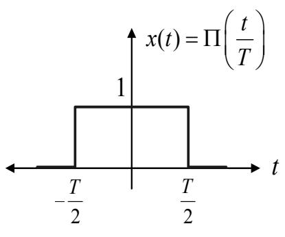  
(a)

  
รูปที่ 3.1: (a) สัญญาณพัลส์รูปส่เหลี่ยม x(t) และ (b) สัญญาณชิงก์ X(f)

จากตัวอย่างที่ 3.1 ถ้ากำหนดให้สัญญาณพัลส์รูปสี่เหลี่ยมในโดเมนเวลา สามารถเขียนให้อยู่ในรูป สมการทางคณิตศาสตร์ได้ คือ

$$
\Pi \left( { \frac { t } { T } } \right) = { \left\{ \begin{array} { l l } { 1 , } & { - { \frac { T } { 2 } } \leq t \leq { \frac { T } { 2 } } } \\ { 0 , } & { { \mathrm { e l s e } } } \end{array} \right. }\tag{3.11}
$$

ดังนั้น ผลการแปลงฟูเรียร์ของสัญญาณพัลส์รูปสี่เหลี่ยมนี้ คือ

$$
X ( f ) = T \mathrm { s i n c } ( f T )\tag{3.12}
$$

เพราะฉะนั้น คู่การแปลงฟูเรียร์ของสัญญาณพัลส์รูปสี่เหลี่ยม สามารถเขียนได้เป็น

$$
\Pi \left( { \frac { t } { T } } \right) \Longleftrightarrow T { \mathrm { s i n c } } ( f T )\tag{3.13}
$$

## ดังแสดงในรูปที่ 3.1

เมื่อพิจารณาสมการ (3.13) และรูปที่ 3.1 จะพบว่า ถ้า T มีค่าน้อย ความกว้างของสัญญาณพัลส์ $x ( t )$ จะเล็ก แต่ความกว้างของสัญญาณ $X ( f )$ จะใหญ่ ในทางกลับกัน ถ้า T มีค่ามาก ความกว้างของ สัญญาณพัลส์ $x ( t )$ จะใหญ่แต่ความกว้างของสัญญาณ X(f) จะเล็ก ดังนั้น สามารถที่จะสรุปได้ว่า

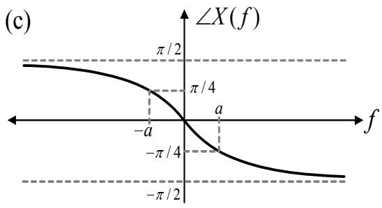  
รูปที่ 3.2: (a) สัญญาณพัลส์เลขชี้กำลัง x(t), (b) สเปกตรัมเชิงแอมพลิจูดของ X(f), และ (c) สเปกตรัมเชิงเฟสของ X(f)

สัญญาณใดๆ ไม่สามารถที่จะเป็นได้ทั้ง สัญญาณที่มีเวลาจำกัด (time-limited signal) และสัญญาณ ที่มีแถบความถี่จำกัด (band-limited signal) ผู้อ่านสามารถศึกษารายละเอียดเพิ่มเติมได้ในหัวข้อที่ 3.2.1

ตัวอย่างที่ 3.2 จงหาผลการแปลงฟูเรียร์ของสัญญาณพัลส์เลขชี้กำลัง (exponential pulse) x(t) ที่ แสดงในรูปที่ 3.2(a)

วิธี ทำจากรูปที่ 3.2(a) สัญญาณพัลส์ เลขชี้กำลัง x(t) สามารถ เขียนให้อยู่ในรูปของสมการทาง คณิตศาสตร์ได้ คือ

$$
x ( t ) = e ^ { - a t } u ( t ) , \quad a > 0
$$

## 3.2. การแปลงฟูเรียร์ที่ต่อเนื่องทางเวลา

เมื่อ $u ( t )$ คือ ฟังก์ชันขั้นหนึ่งหน่วย ตามที่นิยามในสมการ (2.18) ดังนั้น ผลการแปลงฟูเรียร์ของ $x ( t )$ จะมีค่าเท่ากับ

$$
\begin{array} { l l l } { { X ( f ) } } & { { = } } & { { \displaystyle \int _ { 0 } ^ { \infty } e ^ { - a t } e ^ { - j 2 \pi f t } d t } } \\ { { } } & { { = } } & { { \displaystyle \int _ { 0 } ^ { \infty } e ^ { - ( a + j 2 \pi f ) t } d t } } \\ { { } } & { { = } } & { { \displaystyle \left. \left\{ \frac { e ^ { - ( a + j 2 \pi f ) t } } { - ( a + j 2 \pi f ) } \right\} \right| _ { t = 0 } ^ { \infty } } } \\ { { } } & { { = } } & { { \displaystyle \frac { 1 } { a + j 2 \pi f } } } \end{array}
$$

ซ เชีื้คารั เพราะฉะนัน คู่การแปลงฟูเรียร์ของสัญญาณพัลส์เลขชิกำลัง คือ

$$
e ^ { - a t } u ( t ) \Longleftrightarrow \frac { 1 } { a + j 2 \pi f }\tag{3.14}
$$

เนื่องจาก สัญญาณ $X ( f )$ มีค่าเป็นจำนวนเชิงซ้อน ดังนั้นโดยทั่วไป กราฟ (graph) ของสัญญาณ $X ( f )$ มักจะแสดงให้อยูในรูปของขนาด (magnitude) และมุมเฟส (phase) ซึ่งหาได้จาก

$$
\begin{array} { r c l } { { | X ( f ) | } } & { { = } } & { { { \displaystyle \frac { 1 } { a ^ { 2 } + ( 2 \pi f ) ^ { 2 } } } } } \\ { { { \angle X ( f ) } } } & { { = } } & { { - \tan ^ { - 1 } \left( { \displaystyle \frac { 2 \pi f } { a } } \right) } } \end{array}
$$

เมื่อ สเปกตรัมเชิงแอมพลิจูด $\vert X ( f ) \vert$ และสเปกตรัมเชิงเฟส $\angle X ( f )$ แสดงในรูปที่ 3.2(b) และ 3.2(c) ตามลำดับ โดยทั่วไป สเปกตรัมเชิงแอมพลิจูดจะถูกนำมาใช้งานมากกว่าสเปกตรัมเชิงเฟส $\stackrel { \sim } { \ 9 } \mathfrak { g } \overset { \circ } { \ u } \mathfrak { H }$ จาก นี้เป็นต้นไปในหนังสือเล่มนี้ สเปกตรัมเชิงเฟสจะถูกละไว้ในฐานที่เข้าใจ

หมายเหตุฟังก์ชัน $x ( t )$ ใดๆ จะสามารถหาผลการแปลง ฟูเรียร์ $X ( f )$ ได้ ก็ต่อเมื่อ ฟังก์ชัน $x ( t )$ สอดคล้องกับเงื่อนไขดีรีเคล (Dirichlet's conditions) ที่มีใจความ ดังนี้

1) เมื่อ $x ( t )$ เป็นฟังก์ชันค่าเดียว (single-valued function) ที่มีจุดสูงสุดและจุดต่ำสุดเป็นจำนวน จำกัด ภายในช่วงเวลาที่จำกัดใดๆ

2) เมื่อ $x ( t )$ เป็นฟังก์ชันที่มีจำนวนจุดที่มีค่าไม่ต่อเนื่อง (discontinนities) จำกัด ภายในช่วงเวลา ที่จำกัดใดๆ

3) เมื่อ $x ( t )$ เป็นฟังก์ชันที่สามารถหาค่าปริพันธุ์ (integral) ได้ นั่นคือ

$$
\int _ { - \infty } ^ { \infty } | x ( t ) | d t < \infty
$$

ดังนั้น ถ้าฟังก์ชันใดๆ ในโดเมนเวลาที่มีคุณสมบัติเป็นไปตามเงื่อนไขทั้งสามข้อ $\mathring { \mathbb { H } } ^ { 2 }$ ฟังก์ชันนั้นจะมีคู่ การแปลงฟูเรียร์เสมอ

## 3.2.1 คุณสมบัติที่น่าสนใจของการแปลงฟูเรียร์

ในส่วนนี้จะกล่าวถึงคุณสมบัติที่น่าสนใจต่างๆ ของการแปลงฟูเรียร์ เพื่อช่วยทำให้การวิเคราะห์สัญญาณ ในระบบสื่อสารดิจิทัลง่ายขึ้น ดังต่อไปนี้

1) คุณสมบัติการซ้อนทับ (superposition) หรือคุณสมบัติเชิงเส้น (linearity)

$$
\sum _ { k } a _ { k } x _ { k } ( t ) \Longleftrightarrow \sum _ { k } a _ { k } X _ { k } ( f )\tag{3.15}
$$

คุณสมบัติข้อนี้มีประโยชน์สำหรับการแปลง ฟูเรียร์ของ ฟังก์ชัน $x ( t )$ ที่เป็นผลรวมของฟังก์ชัน $x _ { 1 } ( t ) , x _ { 2 } ( t ) , . . . , x _ { n } ( t )$ ที่ทราบค่าของ $X _ { 1 } ( f ) , X _ { 2 } ( f ) , . . . , X _ { n } ( f )$ อยู่แล้ว

2) คุณสมบัติการสเกลทางเวลา (time scaling)

$$
x ( \beta t ) \Longleftrightarrow { \frac { 1 } { | \beta | } } X \left( { \frac { f } { \beta } } \right)\tag{3.16}
$$

เมิ่อ สู $\beta$ เป็นค่าคงตัวใดๆ คุณสมบัติข้อนี้เป็นการยืนยันว่า สัญญาณใดๆ ไม่สามารถที่จะเป็นได้ $\stackrel { \mathcal { \circ } } { \mathcal { M } } { \vartheta }$ สัญญาณที่มีเวลาจำกัดและสัญญาณที่มีแถบความถี่จำกัด นั้นคือ ถ้า สี่ธ $\beta > 1$ ฟังก์ชัน $x ( \beta t )$ ก็คือ การบีบสัญญาณ $x ( t )$ ให้แคบลงในทางเวลา $\textcircled { 9 }$ วยตัวประกอบการคูณเท่ากับ $\beta$ ในขณะที่

## 3.2. การแปลงฟูเรียร์ที่ต่อเนื่องทางเวลา

$X ( f / \beta )$ จะเป็นการขยายสัญญาณ $X ( f )$ ให้กว้างขึ้นในทางความถี่ ด้วยตัวประกอบการคูณ เท่ากับ $\beta$ ในทำนองเดียวกัน ถ้า $0 < \beta < 1$ ฟังก์ชัน $x ( \beta t )$ ก็คือ การขยายสัญญาณ $x ( t )$ ให้ กว้างขึ้นในทางเวลา ด้วยตัวประกอบการคูณเท่ากับ $\beta$ และ $X ( f / \beta )$ จะ เป็นการบีบสัญญาณ $X ( f )$ ให้แคบลงในทางความถี่ ด้วยตัวประกอบการคูณเท่ากับ $\beta$

ตัวอย่างเช่น จากสมการ (3.13) คู่การแปลงฟูเรียร์ของสัญญาณพัลส์รูปสี่เหลี่ยม $\Pi ( t )$ คือ

$$
\Pi ( t ) \longleftrightarrow \operatorname { s i n c } ( f )
$$

เมื่อ $T = 1$ ดังนั้ ถ้ากำหนดห้ $x ( t ) = \Pi ( \beta t )$ เมื่อ $\beta$ คือ ค่าคงตัวใดๆ แล้ว คูการแปลง ฟูเรียร์ของ $x ( t )$ คือ

$$
\Pi ( \beta t ) \Longleftrightarrow { \frac { 1 } { | \beta | } } { \mathrm { s i n c } } \left( { \frac { f } { \beta } } \right)
$$

รูปที่ 3.3 แสดงสัญญาณ $x ( t )$ และสเปกตรัมเชิงแอมพลิจูด $\vert X ( f ) \vert$ สำหรับค่า $\beta$ เท่ากับ 0.5, 1, และ 2 จะเห็นได้ว่า ผลลัพธ์เป็นไปตามคุณสมบัติการสเกลทางเวลา ตามที่อธิบายไว้ข้างต้น สำหรับในกรณีที่ $\beta = - 1$ ซึ่งจะ เป็นการพับสัญญาณ (หรือการกลับข้างของสัญญาณ) จะได้คู การแปลงฟูเรียร์ ดังนี้

$$
x ( - t ) \Longleftrightarrow X ( - f )\tag{3.17}
$$

กล่าวคือ ถ้าผลการแปลงฟูเรียร์ของ $x ( t )$ มีค่าเป็น $X ( f )$ จะได้ว่า ผลการแปลงฟูเรียร์ของ $x ( - t )$ ก็จะมีค่าเป็น $X ( - f )$

## 3) คุณสมบัติทวิภาวะ (duality)

ถ้ากำหนดให้ $x ( t ) \Longleftrightarrow X ( f )$ จะได้ว่า

$$
X ( t ) \Longleftrightarrow x ( f )\tag{3.18}
$$

ตัวอย่างเช่น จากสมการ (3.13) คู่การแปลงฟูเรียร์ของสัญญาณพัลส์ $\displaystyle { \left. { \mathfrak { J } } \right. }$ เสี่เหลี่ยม สามารถเขียน ได้เป็น

$$
\frac { A } { 2 W } \Pi \left( \frac { t } { 2 W } \right) \Longleftrightarrow A \mathrm { s i n c } ( 2 W f )\tag{3.19}
$$

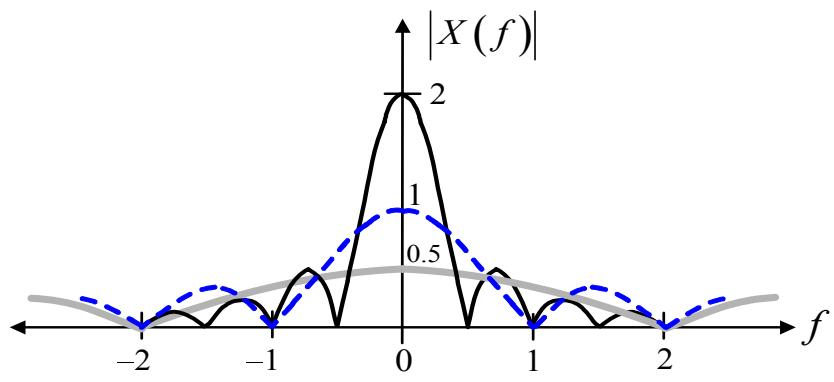  
รูปที่ 3.3: สัญญาณพัลส์รูปสี่เหลี่ยม $x ( t ) = \Pi ( \beta t )$ และสเปกตรัมเชิงแอมพลิจูด $\left| X ( f ) \right|$

เมื่อ A และ W คือ ค่าคงตัวที่เป็นเลขจำนวนจริง ดังแสดงในรูปที่ 3.4 ดังนั้น ถ้ากำหนดให้ $x ( t ) = A { \mathrm { s i n c } } ( 2 W t )$ จะได้ว่า ผลการแปลงฟูเรียร์ของ $x ( t )$ จะมีค่าเท่ากับ

$$
X ( f ) = { \frac { A } { 2 W } } \Pi \left( { \frac { f } { 2 W } } \right)
$$

ดังแสดงในรูปที่ 3.4

4) คุณสมบัติการเลือนทางเวลา (time shifting)

$$
x ( t - t _ { d } ) \Longleftrightarrow X ( f ) e ^ { - j 2 \pi f t _ { d } }\tag{3.20}
$$

เมื่อ สี $t _ { d }$ เป็นค่าคงตัวที่เป็นเลขจำนวนจริง คุณสมบัติการเลื่อนทางเวลาแสดงให้เห็นว่า เมื่อ ทำการเลื่อนเวลาของสัญญาณ x(t) เป็นเวลา $t _ { d }$ หน่วย ผลที่เกิดขึ้นกับสัญญาณในโดเมน ความถี่ คือ การคูณสัญญาณ $X ( f )$ ด้วยฟังก์ชันเลขชี้กำลัง $e ^ { - j 2 \pi f t _ { d } }$ นั่นคือ แอมพลิจูดของ

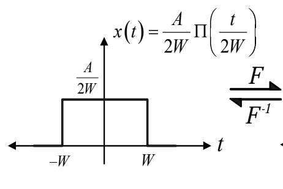

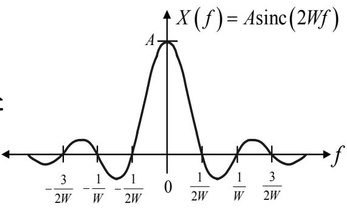

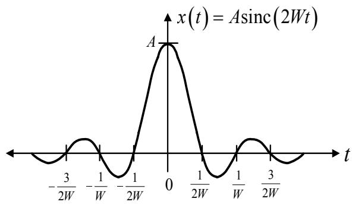

  
รูปที่ 3.4: คู่การแปลงฟูเรียร์ของสัญญาณพัล $\stackrel { 6 } { \hat { \mathsf { H } } } \mathfrak { J } \bar { \mathsf { 1 } }$ เสี่เหลี่ยมตามคุณสมบัติทวิภาวะ

สัญญาณ $X ( f )$ ยังคงเหมือนเดิม เพียงแต่เฟสของสัญญาณ $X ( f )$ จะเปลี่ยนไปแบบเชิงเส้น ด้วยค่า $2 \pi f t _ { d }$

5) คุณสมบัติการเลื่อนทางความถี (frequency shifting)

$$
e ^ { j 2 \pi f _ { c } t } x ( t ) \Longleftrightarrow X ( f - f _ { c } )\tag{3.21}
$$

เมื่อ $f _ { c }$ เป็นค่าคงตัวที่เป็นเลขจำนวนจริง คุณสมบัติการเลื่อนทางความถี่แสดงให้เห็นว่า เมื่อ คูณสัญญาณ $x ( t )$ ด้วยฟังก์ชันเลขชี้กำลัง $e ^ { j 2 \pi f _ { c } t }$ จะมีผลทำให้สัญญาณ $X ( f )$ ถูกเลื่อนความ ถี่ออกไปเป็นปริมาณ $f _ { c }$ เฮิรตซ์ ดังนั้น คุณสมบัติการเลื่อนทางความถี่มักจะถูกนำมาใช้งานใน เรื่องของการกล้ำสัญญาณ (modนlลtion) ในระบบสื่อสาร สังเกตจะพบว่า คุณสมบัติการเลื่อน ทางเวลาในสมการ (3.20) และคุณสมบัติการเลื่อนทางความถี่ในสมการ (3.21) จะมีคุณสมบัติ ทวิภาวะระหว่างกัน

6) คุณสมบัติการทำคอนโวลูชันทางเวลา (convolนtioก in time)

กำหนดให้ $x ( t ) \Longleftrightarrow X ( f )$ และ $h ( t ) \Longleftrightarrow H ( f )$ จะได้ว่า

$$
x ( t ) * h ( t ) \Longleftrightarrow X ( f ) H ( f )\tag{3.22}
$$

เมื่อ \* คือ ตัวดำเนินการคอนโวลูชัน นั่นคือ การทำคอนโวลูชันทางเวลามีค่าเทียบเท่ากับการ คูณทางความถี่ ซึ่งสามารถพิสูจน์ได้ ดังนี้

พิสูจน์กำหนดให้ $y ( t ) = x ( t ) * h ( t )$ จะได้ว่า V บ

$$
y ( t ) = x ( t ) * h ( t ) = \int _ { - \infty } ^ { \infty } x ( t - \tau ) h ( \tau ) d \tau
$$

เพราะฉะนัน ผลการแปลงฟูเรียร์ของ $y ( t )$ คือ

$$
\begin{array} { r c l } { \mathcal { F } [ y ( t ) ] } & { = } & { \displaystyle \int _ { - \infty } ^ { \infty } y ( t ) e ^ { - j 2 \pi t } d t } \\ & { = } & { \displaystyle \int _ { - \infty } ^ { \infty } \left[ \int _ { - \infty } ^ { \infty } x ( t - \tau ) h ( \tau ) d \tau \right] e ^ { - j 2 \pi t } d t } \\ & { = } & { \displaystyle \int _ { - \infty } ^ { \infty } x ( t - \tau ) e ^ { - j 2 \pi \tau t } d t \left[ \int _ { - \infty } ^ { \infty } h ( \tau ) d \tau \right] } \\ & { = } & { \displaystyle X ( f ) e ^ { - j 2 \pi \tau } \left[ \int _ { - \infty } ^ { \infty } h ( \tau ) d \tau \right] } \\ & { = } & { \displaystyle X ( f ) \left[ \int _ { - \infty } ^ { \infty } h ( \tau ) e ^ { - j 2 \pi \tau } d \tau \right] } \\ & { = } & { \displaystyle X ( f ) H ( f ) } \end{array}
$$

ดังนั้น จะได้ว่า e $x ( t ) * h ( t ) \Longleftrightarrow X ( f ) H ( f )$ ตามที่ต้องการ

7) คุณสมบัติการคูณทางเวลา (multiplication in time)

กำหนดให้ $x ( t ) \Longleftrightarrow X ( f )$ และ $h ( t ) \Longleftrightarrow H ( f )$ จะได้ว่า

$$
x ( t ) h ( t ) \Longleftrightarrow X ( f ) * H ( f )\tag{3.23}
$$

นั่นคือ การคูณทางเวลามีค่าเทียบเท่ากับการทำคอนโวลูชันทางความถี่ สังเกตจะพบว่า คุณสมบัติ การทำคอนโวลูชันทางเวลา และคุณสมบัติการคูณทางเวลา จะมีคุณสมบัติทวิภาวะระหว่างกัน

## 3.2. การแปลงฟูเรียร์ที่ต่อเนื่องทางเวลา

8) พื้นที่ได้กราฟของสัญญาณ x(t) ขึ้นที่ใ้

$$
\int _ { - \infty } ^ { \infty } x ( t ) d t = X ( 0 )\tag{3.24}
$$

ซึ่งหมายความว่า พื้นที่ใด้กราฟทั้งหมดของสัญญาณ ซ $x ( t )$ มีค่าเท่ากับ ผลการแปลงฟูเรียร์ $X ( f )$ ที่ความถี่ $f = 0$ ซึ่งโดยทั่วไป ค่า $X ( 0 )$ จะบอกถึงปริมาณขององค์ประกอบไฟฟ้ากระแส ตรง (d.c. component) ที่แฝงอยูภายในสัญญาณ $x ( t )$

$X ( f )$

$$
\int _ { - \infty } ^ { \infty } X ( f ) d f = x ( 0 )\tag{3.25}
$$

ซึ่งหมายความว่า ื้นที่ใด้กราฟทั้งหมดของสัญญาณ $X ( f )$ มีค่าเท่ากับ ค่าของสัญญาณ $x ( t )$ ที่เวลา $t = 0$

10) การหาอนุพันธ์ทางเวลา (time differentiation)

ถ้าสมมติว่า การแปลงฟูเรียร์ของอนุพันธ์ของ x(t) มีอยู่จริง (existence) และหาค่าได้ จะได้ว่า

$$
\frac { d ^ { n } } { d t ^ { n } } x ( t ) \Longleftrightarrow ( j 2 \pi f ) ^ { n } X ( f )\tag{3.26}
$$

เมื่อ ซี $\textstyle { \frac { d ^ { n } } { d t ^ { n } } } x ( t )$ คือ อนุพันธ์อันดับที่ n ของสัญญาณ x(t) จากสมการ (3.26) จะพบว่า การหา 6 น อนุพันธ์ทางเวลาจะส่งผลให้องค์ประกอบความถี่สูงของสัญญาณมีการขยายขนาดขึ้น (มีค่าเพิ่ม รู มากขึ้น) ซึ่งจะสอดคล้องกับหลักความจริงที่ว่า การหาอนุพันธ์ก่อให้เกิดการเปลี่ยนแปลง

11) คุณสมบัติการหาปริพันธ์ทางเวลา (time integration)

$$
\int _ { - \infty } ^ { t } x ( \tau ) d \tau \Longleftrightarrow \frac { 1 } { j 2 \pi f } X ( f ) + \frac { 1 } { 2 } X ( 0 ) \delta ( f )\tag{3.27}
$$

โดยที่ พจน์ที่สองทางด้านขวาของสมการ (3.27) แสดงให้เห็นถึงองค์ประกอบไฟฟ้ากระแสตรง ขู หรือค่าเฉลี่ย ที่เป็นผลมาจากการหาปริพันธ์ นอกจากนี้สมการ (3.27) บอกให้ทราบว่าการหา ปริพันธ์ทางเวลาจะ ส่งผลให้องค์ประกอบความถี่สูงของสัญญาณมีการลดค่าลง ซึ่งสอดคล้อง กับหลักความจริงที่ว่า การหาปริพันธ์จะช่วยทำให้สัญญาณมีการแกว่งตัวน้อยลง

## 12) ฟังก์ชันสังยุค (conjugate function)

ถ้า $x ( t )$ เป็นฟังก์ชันค่าเชิงซ้อน จะได้ว่า

$$
x ^ { * } ( t ) \longleftrightarrow X ^ { * } ( - f )\tag{3.28}
$$

เมิ่อ $( \cdot ) ^ { * }$ คือ ตัวดำเนินการสังยุคเชิงซ้อน (complex conjugate operator)

13) ความสัมพันธ์ของพาร์ซิวาล (Parseval's relation)

$$
\int _ { - \infty } ^ { \infty } | x ( t ) | ^ { 2 } d t = \int _ { - \infty } ^ { \infty } | X ( f ) | ^ { 2 } d f\tag{3.29}
$$

โดยที่ $| x ( t ) | ^ { 2 } = x ( t ) x ^ { * } ( t )$ จะ ถูก เรียกว่า “"ความเข้มของพลังงาน (energy intensity)"ที่ แปรเปลี่ยนตามเวลา และ $| X ( f ) | ^ { 2 } = X ( f ) X ^ { * } ( f )$ จะถูกเรียกว่า “ความหนาแน่นสเปกตรัม พลังงาน (energy spectral density)" มีหน่วยเป็น จูลต่อเฮิรตซ์ (joules per hertz)

## 3.2.2 ทฤษฎีบทพลังงานของเรย์ลี

ในหัวข้อที่ 2.1.4 ได้แสดงวิธีการหาพลังงานของสัญญาณในโดเมนเวลาตามสมการ (2.12) นั่นคือ

$$
E = \int _ { - \infty } ^ { \infty } | x ( t ) | ^ { 2 } d t\tag{3.30}
$$

นอกจากนี้ ยังสามารถหาพลังงานของสัญญาณในโดเมนความถี่ได้โดยใช้ "ทฤษฎีบท พลังงานของ

$$
E = \int _ { - \infty } ^ { \infty } | X ( f ) | ^ { 2 } d f\tag{3.31}
$$

เนื่องจาก พลังงานของสัญญาณสามารถหาได้จากสมการ (3.30) และ (3.31) เพราะฉะนั้น ทฤษ $\Im$ บท พลังงานของเร $\stackrel { 6 } { \boldsymbol { \beta } } \stackrel { \mathbf { d } } { \boldsymbol { \alpha } }$ จะสอดคล้องกับความสัมพันธุ์ของพาร์ซิวาลตามสมการ (3.29)

ตัวอย่างเช่น ถ้ากำหนดให้ $x ( t ) \Longleftrightarrow X ( f )$ และ $X ( f ) = A T { \mathrm { s i n c } } ( f T )$ จะได้ว่า ความหนาแน่น สเปกตรัมพลังงาน $| X ( f ) | ^ { 2 }$ จะมีลักษณะตามรูปที่ 3.5 สมมุติว่า ต้องการคำนวณหาพลังงานของ สัญญาณที่อยู่ในช่วงแถบความถี่ $( - 1 / T , 1 / T )$ ก็สามารถหาได้ ดังนี้

  
รูปที่ 3.5: ความหนาแน่นสเปกตรัมพลังงาน $| X ( f ) | ^ { 2 }$ ของสัญญาณ $X ( f ) = A T { \mathrm { s i n c } } ( f T )$

$$
\begin{array} { l l l } { { E } } & { { = } } & { { \displaystyle \int _ { - 1 / T } ^ { 1 / T } | X ( f ) | ^ { 2 } d f } } \\ { { } } & { { = } } & { { \displaystyle \int _ { - 1 / T } ^ { 1 / T } A ^ { 2 } T ^ { 2 } \mathrm { s i n c } ^ { 2 } ( f T ) d f } } \\ { { } } & { { \approx } } & { { 0 . 9 2 A ^ { 2 } T } } \end{array}
$$

ซึ่งหมายความว่า พลังงานของสัญญาณประมาณ 92% จะอยูภายในช่วงแถบความถี่ $( - 1 / T , 1 / T )$ เฮิรตซ์ ดังนั้น ถ้าสมมุติว่าสัญญาณ $X ( f )$ คือ สัญญาณที่จะถูกส่งผ่านไปยังวงจรกรองผ่านต่ำ (1owpass filter) ก่อนที่จะส่งต่อไปยังวงจรชักตัวอย่าง (sampler) ข้อมูลเกี่ยวกับพลังงานนี้สามารถที่ จะ นำมาใช้ช่วยในการออกแบบค่าความถี่ตัด (cut-off frequency) ของวงจรกรองผ่านต่ำได้ เช่น ถ้า กำหนดให้ระบบ ยังคงสามารถทำงานได้อย่างมีประสิทธิภาพ ถ้าพลังงานของสัญญาณ $x ( t )$ ที่ผ่าน ซ วงจรกรองผ่านตำมีปริมาณไม่น้อยกว่า 90% ของพลังงานทั้งหมด ดังนั้น วงจรกรองผ่านตำอาจจะ ใช้ความถี่ $f = 1 / T$ เป็นความถี่ตัด แทนที่จะใช้ความถี่ $f > 1 / T$ ทั้งนี้เป็นเพราะว่า ความถี่ตัดที่มีค่า

น้อยจะช่วยลดปริมาณของสัญญาณรบกวน (ทoise) $\stackrel { \mathrm { d } } { \boldsymbol { \hat { \mathbb { M } } } }$ จะผ่านวงจรกรองผ่านต่ำเข้าไปในระบบได้

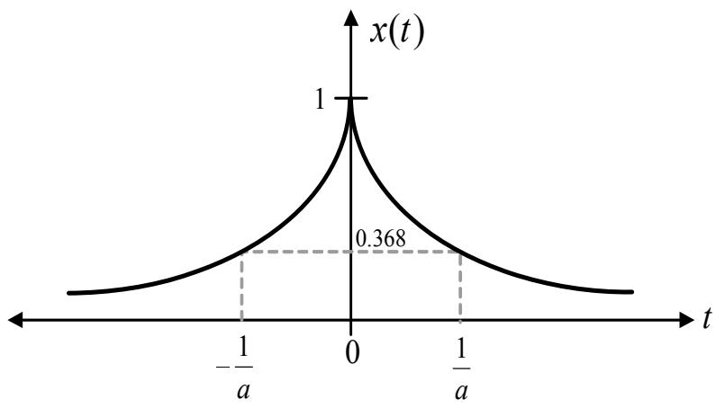  
รูปที่ 3.6: รูปสัญญาณ $x ( t ) = e ^ { - a | t | }$

## 3.2.3 ตัวอย่างการคำนวณการแปลงฟูเรียร์ที่ต่อเนื่องทางเวลา

ในหัวข้อนี้จะ แสดงตัวอย่างการคำนวณสำหรับการวิเคราะห์สัญญาณ โดยใช้คุณสมบัติการแปลงฟูเรียร์ De ต่างๆ ที่กล่าวมาในหัวข้อที่ 3.2.1 ดังต่อไปนี้

ตัวอย่างที่ 3.3 จงหาผลการแปลงฟูเรียร์ของสัญญาณเลขชี้กำลัง ซี้:.

$$
x ( t ) = e ^ { - a | t | } , a > 0
$$

เมื่อ a เป็นค่าคงตัวที่เป็นเลขจำนวนจริง

วิธีทำ จากสัญญาณ $x ( t )$ ที่กำหนดให้ สามารถจัดเป็นรูปสมการใหม่ได้ ดังนี้ 4 ซี

$$
x ( t ) = e ^ { - a | t | } = \left\{ \begin{array} { l l } { e ^ { - a t } , } & { t > 0 } \\ { 1 , } & { t = 0 } \\ { e ^ { a t } , } & { t < 0 } \end{array} \right.
$$

ดังแสดงในรูปที่ 3.6 ผลการ แปลงฟูเรียร์ของสัญญาณ $x ( t )$ สามารถหาได้จากสมการ (3.14) โดย

## 3.2. การแปลงฟูเรียร์ที่ต่อเนื่องทางเวลา

อาศัยคุณสมบัติการซ้อนทับตามสมการ (3.15) ซึ่งจะได้ว่า

$$
{ \begin{array} { l l l } { X ( f ) } & { = } & { { \cfrac { 1 } { a + j 2 \pi f } } + { \cfrac { 1 } { a - j 2 \pi f } } } \\ & { = } & { { \cfrac { ( a - j 2 \pi f ) + ( a + j 2 \pi f ) } { ( a - j 2 \pi f ) ( a + j 2 \pi f ) } } } \\ & { = } & { { \cfrac { 2 a } { a ^ { 2 } + ( 2 \pi f ) ^ { 2 } } } } \end{array} }
$$

ซ ซี้: 2 ดังนั้น คู่การแปลงฟูเรียร์ของสัญญาณเลขชิกำลังแบบสองด้าน คือ

$$
e ^ { - a | t | } \Longleftrightarrow { \frac { 2 a } { a ^ { 2 } + ( 2 \pi f ) ^ { 2 } } }
$$

ตัวอย่างที่ 3.4 จงหาผลการแปลงฟูเรียร์ของสัญญาณ

$$
x ( t ) = A \Pi \left( { \frac { t - { \frac { T } { 2 } } } { T } } \right)
$$

เมื่อ $T$ เป็นค่าคงตัวที่เป็นเลขจำนวนจริง

วิธีทำ จากสมการ (3.13) จะได้ว่า $\begin{array} { r } { A \Pi \left( \frac { t } { T } \right) \Longleftrightarrow A T \mathrm { s i n c } ( f T ) } \end{array}$ เนื่องจาก สัญญาณ $x ( t )$ ที่โจทย์ กำหนดมาให้ ก็คือ สัญญาณพัลส์รูปสี่เหลี่ยมที่ถูกหน่วงเวลา (deลy) ออกไป $T / 2$ วินาที ดังนั้น ผลการแปลงฟูเรียร์ของสัญญาณ $x ( t )$ สามารถหาได้โดยใช้คุณสมบัติการเลื่อนทางเวลาตามสมการ (3.20) ซึ่งจะได้ว่า

$$
X ( f ) \Longleftrightarrow A T \operatorname { s i n c } ( f T ) e ^ { - j \pi f T }
$$

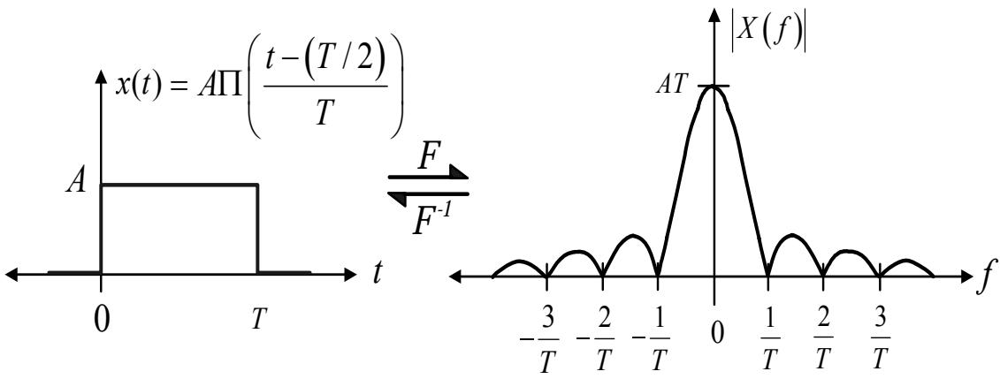  
รูปที่ 3.7: คู่การแปลงฟูเรียร์ของสัญญาณพัลส์รูปสี่เหลี่ยมที่ถูกหน่วงเวลาออกไป $T / 2$ วินาที

หรืออาจจะหาผลการแปลงฟูเรียร์ของ $x ( t )$ โดยตรงได้ ดังนี้

$$
\begin{array} { r l } { X ( f ) } & { = \ \int _ { 0 } ^ { T } A e ^ { - j 2 \pi f } d t } \\ & { = \ A \left\{ \frac { e ^ { - j 2 \pi f t } } { - j 2 \pi f } \right\} \Biggr | _ { t = 0 } ^ { T } } \\ & { = \ - \ \frac { A } { j 2 \pi f } \left( e ^ { - j 2 \pi f T } - 1 \right) } \\ & { = \ \frac { A } { j 2 \pi f } e ^ { - j \pi f T } \left( e ^ { j \pi f T } - e ^ { - j \pi f T } \right) } \\ & { = \ \frac { A } { \pi f } e ^ { - j \pi f T } \sin ( \pi f T ) } \\ & { = \ A T e ^ { - j \pi f T } \sin ( c f T ) } \end{array}
$$

รูปที่ 3.7 แสดงคู่การแปลงฟูเรียร์ของสัญญาณพัลส์รูปสี่เหลี่ยมที่เลื่อนเวลาไป $T / 2$ หน่วย จะเห็นได้ว่า สเปกตรัมเชิง แอมพลิจูดของสัญญาณ $x ( t )$ นั่นคือ $| X ( f ) | ~ = ~ A T | { \mathrm { s i n c } } ( f T ) |$ ยังคงเหมือนเดิม (เนืองจาก ขนาด $| e ^ { j \theta } | = 1 )$ เพียงแต่สเปกตรัมเชิงเฟสของสัญญาณ $x ( t )$ จะเปลี่ยนไป (ไม่ได้แสดง ไว้ ณ ที่นี้)

ตัวอย่างที่ 3.5จงหาผลการแปลงฟูเรียร์ของสัญญาณพัลส์รูปสี่เหลี่ยม $x ( t )$ ที่แสดงในรูปที่ 3.8

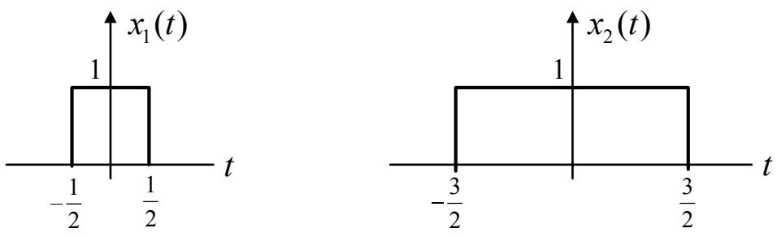  
รูปที่ 3.8: สัญญาณพัลส์รูปสี่เหลี่ยม $x ( t )$ ประกอบไปด้วยสัญญาณ $x _ { 1 } ( t )$ และ $x _ { 2 } ( t )$

วิธีทำ จากรูปที่ 3.8 จะได้ว่า สัญญาณ $x ( t )$ สามารถเขียนให้อยู่ในรูปผลรวมของสัญญาณ $x _ { 1 } ( t )$ และ $x _ { 2 } ( t )$ ได้ คือ

$$
x ( t ) = \frac { 1 } { 2 } x _ { 1 } ( t - 2 . 5 ) + x _ { 2 } ( t - 2 . 5 )
$$

เนื่องจาก สัญญาณพัลส์รูปสี่เหลี่ยมมีคู่การแปลงฟูเรียร์ตามสมการ (3.13) นั่นคือ

$$
\Pi ( t / T ) \Longleftrightarrow T { \mathrm { s i n c } } ( f T )
$$

เพราะฉะนั้น ผลการแปลงฟูเรียร์ของสัญญาณ $x _ { 1 } ( t )$ และ $x _ { 2 } ( t )$ คือ

$$
\begin{array} { r c l } { { \mathcal F [ x _ { 1 } ( t ) ] } } & { { = } } & { { \mathrm { s i n c } ( f ) } } \\ { { } } & { { } } & { { } } \\ { { \mathcal F [ x _ { 2 } ( t ) ] } } & { { = } } & { { \mathrm { 3 s i n c } ( 3 f ) } } \end{array}
$$

โดยอาศัยคุณสมบัติการซ้อนทับตามสมการ (3.15) และคุณสมบัติการเลื่อนทางเวลาตามสมการ (3.20)

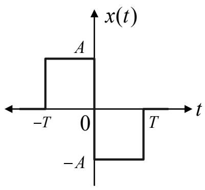  
(a)

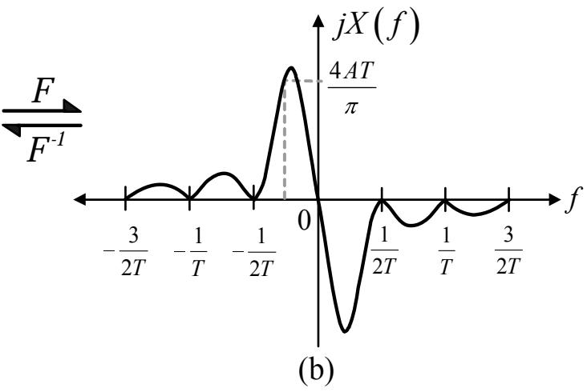  
รูปที่ 3.9: (a) สัญญาณพัลส์รูปดับเลต และ (b) สเปกตรัมความถี

จะได้ว่า ผลการแปลงฟูเรียร์ของสัญญาณ x(t) มีค่าเท่ากับ

$$
\begin{array} { l l l } { { X ( f ) } } & { { = } } & { { \displaystyle \frac { 1 } { 2 } \mathrm { s i n c } ( f ) e ^ { - j 2 \pi f ( 2 . 5 ) } + 3 \mathrm { s i n c } ( 3 f ) e ^ { - j 2 \pi f ( 2 . 5 ) } } } \\ { { \mathrm { } } } & { { = } } & { { \displaystyle e ^ { - j 5 \pi f } \left\{ \frac { \mathrm { s i n c } ( f ) + 6 \mathrm { s i n c } ( 3 f ) } { 2 } \right\} } } \end{array}
$$

s ตามที่ต้องการ

ตัวอย่างที่ 3.6จงหาผลการแปลงฟูเรียร์ของสัญญาณ พัลส์ $i _ { \mathfrak { J } }$ ปดับเลต (doublet signal) ตามรูปที 3.9(a)

วิธีทำจากรูปที่ $3 . 9 ( \mathrm { a } )$ จะพบว่า สัญญาณพัลส์รูปดับเลต x(t) เกิดจากสัญญาณพัลส์รูปสี่เหลี่ยมสอง สัญญาณ นั่นคือ

$$
x ( t ) = A \Pi \left( { \frac { t + { \frac { T } { 2 } } } { T } } \right) - A \Pi \left( { \frac { t - { \frac { T } { 2 } } } { T } } \right)
$$

โดยการหาผลแปลงฟูเรียร์ของสัญญาณแต่ละตัว และอาศัยคุณสมบัติการซ้อนทับตามสมการ (3.15)

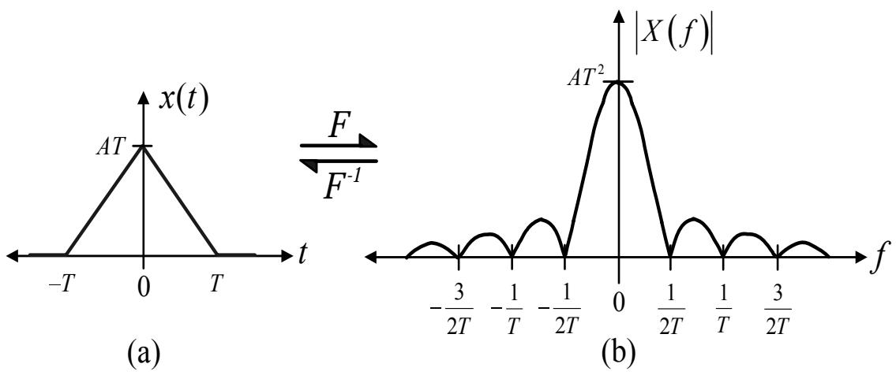  
รูปที่ 3.10: (a) สัญญาณพัลส์รูปสามเหลี่ยม และ (b) สเปกตรัมเชิงแอมพลิจูด

ผลการแปลงฟูเรียร์ของสัญญาณ x(t) จะมีค่าเท่ากับ

$$
{ \begin{array} { l l l } { X ( f ) } & { = } & { A T \operatorname { s i n c } ( f T ) e ^ { j \pi f T } - A T \operatorname { s i n c } ( f T ) e ^ { - j \pi f T } } \\ & { = } & { A T \operatorname { s i n c } ( f T ) \left\{ e ^ { j \pi f T } - e ^ { - j \pi f T } \right\} } \\ & { = } & { 2 j A T \operatorname { s i n c } ( f T ) \sin ( \pi f T ) } \end{array} }
$$

เมื่อ $j = \sqrt { - 1 }$ คือ จำนวนจินตภาพ และรูปร่างของสัญญาณ $j X ( f )$ แสดงในรูปที่ 3.9(b)

ตัวอย่างที่ 37 จงหาผลการแปลงฟูเรียร์ของสัญญาณฟพัลส์รูปสามเหลี่ยมตามรูปที่ 310() ซึ่มีรูป สมการทางคณิตศาสตร์ คือ

$$
\Lambda \left( \frac { t } { T } \right) = \left\{ \begin{array} { l l } { 1 - \frac { | t | } { T } , } & { | t | < T } \\ { 0 , } & { | t | \geq 0 } \end{array} \right.
$$

วิธีทำ เนื่องจาก สัญญาณพัลส์รูปสามเหลี่ยมในรูปที่ 3.10(a) เกิดจากการหาปริพันธ์ ของสัญญาณ ดับเลตในรูปที่ 3.9a) ดังนั้น ผลการแปลงฟูเรียร์ของสัญญาณรูปสามเหลี่ยมสามารถหาได้ โดยอาศัย

คุณสมบัติการหาปริพันธ์ทางเวลา ตามสมการ (3.27) ซึ่งจะได้ว่า

$$
\begin{array} { r c l } { { X ( f ) } } & { { = } } & { { \displaystyle \frac { 1 } { j 2 \pi f } \left\{ 2 j A T \mathrm { s i n c } ( f T ) \mathrm { s i n } ( \pi f T ) \right\} } } \\ { { } } & { { = } } & { { \displaystyle A T \frac { \mathrm { s i n } ( \pi f T ) } { \pi f } \mathrm { s i n c } ( f T ) } } \\ { { } } & { { = } } & { { \displaystyle A T ^ { 2 } \mathrm { s i n c } ^ { 2 } ( f T ) } } \end{array}
$$

โดยสเปกตรัมเชิงแอมพลิจูด $\vert X ( f ) \vert$ แสดงในรูปที่ 3.10(b) เพราะฉะนั้น คู่การแปลงฟูเรียร์ของสัญญาณ พัลส์รูปสามเหลี่ยม คือ

$$
\Lambda \left( \frac { t } { T } \right) \Longleftrightarrow T \mathrm { s i n c } ^ { 2 } ( f T )
$$

## 3.2.4การแปลงฟูเรียร์ของสัญญาณเป็นคาบ

สัญญาณ เป็นคาบสามารถ แสดงให้อยู่ในรูปผลรวมของฟังก์ชันเลขชี้กำลังเชิงซ้อน ที่เป็นฟังก์ชัน ของ ความถี่ได้ โดยใช้เครื่องมือทางคณิตศาสตร์ ที่เรียกว่า "อนุกรมฟูเรียร์ (Fourier series)" [33, 34] อย่างไรก็ตาม การแปลงฟูเรียร์ก็สามารถใช้กับสัญญาณเป็นคาบได้ โดยอาศัยฟังก์ชันไดเรคเดลตา ดัง อธิบายต่อไปนี้

ถ้ากำหนดให้สัญญาณเป็นคาบ $x _ { p } ( t )$ มีคาบเท่ากับ $T _ { 0 }$ จากสูตรของอนุกรมฟูเรียร์ จะได้ว่า

$$
x _ { p } ( t ) = \sum _ { n = - \infty } ^ { \infty } c _ { n } e ^ { j 2 \pi n f _ { 0 } t }\tag{3.32}
$$

โดยที่ $n$ เป็นเลขจำนวนเต็ม, $f _ { 0 } = 1 / T _ { 0 }$ คือ ความถี่มูลฐาน, และ $c _ { n }$ คือ สัมประสิทธิ์ฟูเรียร์เชิงซ้อน (complex Fourier coefficient) ซึ่งสามารถหาได้จาก

$$
c _ { n } = \frac { 1 } { T _ { 0 } } \int _ { - T _ { 0 } / 2 } ^ { T _ { 0 } / 2 } x _ { p } ( t ) e ^ { - j 2 \pi n f _ { 0 } t } d t\tag{3.33}
$$

และ $f _ { 0 } = 1 / T _ { 0 }$ คือ ความถีมูลฐาน (fundamental frequency)

ถ้ากำหนดให้สัญญาณ $x ( t )$ เป็นสัญญาณไม่เป็นคาบที่ต่อเนื่องทางเวลา (aperiodic continuoustime signal)ที่มีค่าเฉพาะ ภายในช่วง $( - T _ { 0 } / 2 \le t \le T _ { 0 } / 2 )$ นอกนั้นมีค่าเป็นค่าศูนย์ และกำหนด

## 3.2. การแปลงฟูเรียร์ที่ต่อเนื่องทางเวลา

ให้ $x ( t )$ มีคู่การแปลงฟูเรียร์ คือ $x ( t ) \Longleftrightarrow X ( f )$ ดังนั้น สัญญาณเป็นคาบ $x _ { p } ( t )$ สามารถสร้างได้ จากสัญญาณไม่เป็นคาบ $x ( t )$ โดยอาศัยความสัมพันธุ์ต่อไปนี้

$$
x _ { p } ( t ) = \sum _ { m = - \infty } ^ { \infty } x ( t - m T _ { 0 } )\tag{3.34}
$$

เมื่อ $m$ เป็นเลขจำนวนเต็ม การแสดงฟังก์ชันในลักษณะนี้ ฟังก์ชัน $x ( t )$ จะถูกเรียกว่าเป็น "ฟังก์ชัน ก่อกำเนิด (generating function)"

โดยทั่วไป สัญญาณไม่เป็นคาบ $x ( t )$ อาจจะถูกพิจารณาว่าเป็นสัญญาณเป็นคาบได้ โดยที่ คาบของ ญ สัญญาณ $x ( t )$ มีค่าเท่ากับค่าอนันต์ นันคือ $T _ { 0 }  \infty$ เพราะฉะนั้น สมการของสัมประสิทธิ์ฟูเรียร์ เชิงซ้อนในสมการ (3.33) สามารถเขียนได้ใหม่เป็น ดังนี้

$$
\begin{array} { l l l } { { c _ { n } } } & { { = } } & { { f _ { 0 } \displaystyle \int _ { - \infty } ^ { \infty } x ( t ) e ^ { - j 2 \pi n f _ { 0 } t } d t } } \\ { { } } & { { = } } & { { f _ { 0 } X ( n f _ { 0 } ) } } \end{array}\tag{3.35}
$$

เมื่อ $X ( n f _ { 0 } )$ คือ ผลการแปลงฟูเรียร์ของ $x ( t )$ ที่ความถี่ $n f _ { 0 }$ ดังนั้น แทนค่า $c _ { n }$ จากสมการ (3.35) ลงในสมการ (3.32) จะได้เป็นสัญญาณเป็นคาบ คือ

$$
x _ { p } ( t ) = f _ { 0 } \sum _ { n = - \infty } ^ { \infty } X ( n f _ { 0 } ) e ^ { j 2 \pi n f _ { 0 } t }\tag{3.36}
$$

จากสมการ (3.34) และ (3.36) จะได้ว่า

$$
\sum _ { m = - \infty } ^ { \infty } x ( t - m T _ { 0 } ) = f _ { 0 } \sum _ { n = - \infty } ^ { \infty } X ( n f _ { 0 } ) e ^ { j 2 \pi n f _ { 0 } t }\tag{3.37}
$$

เนืองจาก สู $e ^ { j 2 \pi n f _ { 0 } t } \Longleftrightarrow \delta ( f - n f _ { 0 } )$ เมื่อ $\delta ( t )$ ของสมการ (3.37) คือ

$$
\sum _ { m = - \infty } ^ { \infty } x ( t - m T _ { 0 } ) \Longleftrightarrow f _ { 0 } \sum _ { n = - \infty } ^ { \infty } X ( n f _ { 0 } ) \delta ( f - n f _ { 0 } )\tag{3.38}
$$

ความสัมพันธ์นี้แสดงให้เห็นว่า การแปลงฟูเรียร์ของสัญญาณเป็นคาบจะประกอบไปด้วยฟังก์ชันไดเรค เดลตาที่เกิดขึ้นทุกๆ ความถี่ $n f _ { 0 }$ เมื่อ n เป็นเลขจำนวนเต็ม และแต่ละฟังก์ชันไดเรคเดลตาจะถูกถ่วง

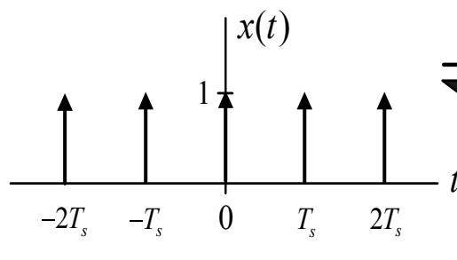  
(a)

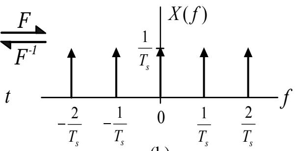  
(b)  
รูปที่ 3.11: (a) ฟังก์ชันการชักตัวอย่างอุดมคติ และ (b) สเปกตรัมความถี

นำหนักด้วยตัวประกอบการคูณเท่ากับ $X ( n f _ { 0 } )$ คู่การแปลงฟูเรียร์ในสมการ (3.38) นี้มีความสำคัญ มากสำหรับ ทฤษฎีบทการชักตัวอย่าง (sampling theorem) ซึ่งจะอธิบายรายละเอียดต่อไปในหัวข้อที่ 5.5

ตัวอย่างที่ 3.8 จงหาผลการแปลงฟูเรียร์ของฟังก์ชันการชักตัวอย่างอุดมคติ (ideal รampling function) ซึ่งประกอบไปด้วย ลำดับสัญญาณไดเรคเดลตาที่มีระยะห่างเท่าๆ กัน ดังแสดงในรูปที่ 3.11(a)] วิธีทำ จากรูปที่ 3.11(a) สามารถเขียนสมการฟังก์ชันการชักตัวอย่างอุดมคติได้ ดังนี้

$$
x ( t ) = \sum _ { m = - \infty } ^ { \infty } \delta ( t - m T _ { s } )
$$

เมื่อ $T _ { s }$ คือ คาบการชักตัวอย่าง (รampling period) เนื่องจาก คู่การแปลงฟูเรียร์ของฟังก์ชันไดเรคเดล ตา คือ $\delta ( t ) \longleftrightarrow 1$ ดังนั้น ผลการแปลงฟูเรียร์ของ $x ( t )$ จะมีค่าเท่ากับ

$$
X ( f ) = { \frac { 1 } { T _ { s } } } \sum _ { n = - \infty } ^ { \infty } \delta \left( f - { \frac { n } { T _ { s } } } \right)
$$

$$
\sum _ { m = - \infty } ^ { \infty } \delta ( t - m T _ { s } ) \Longleftrightarrow \frac { 1 } { T _ { s } } \sum _ { n = - \infty } ^ { \infty } \delta \left( f - \frac { n } { T _ { s } } \right)\tag{3.39}
$$

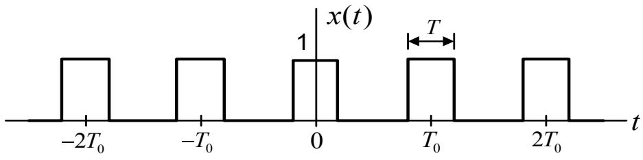  
(a)

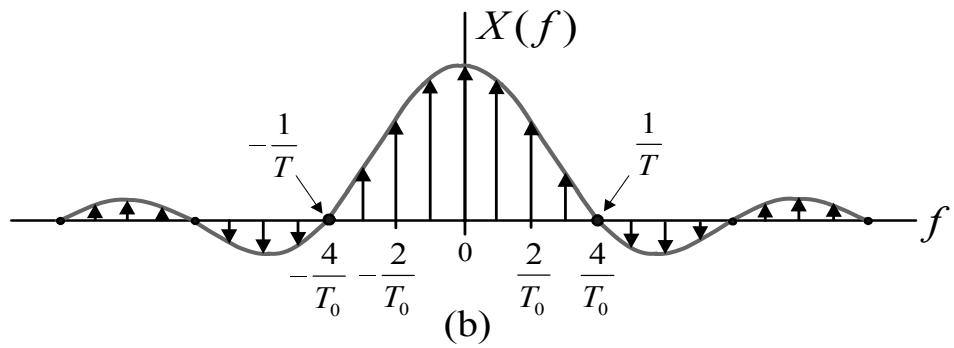  
รูปที่ 3.12: (a) ฟังก์ชันขบวนสัญญาณพัลส์รูปสี่เหลี่ยมแบบเป็นคาบ และ (b) สเปกตรัมความถี

สมการ (3.39) แสดงให้เห็นว่า การแปลงฟูเรียร์ของขบวนสัญญาณไดเรคเดลตา3 ที่มีระยะห่างแต่ละ ญ สัญญาณพัลส์เท่ากับ $T _ { s }$ วินาที จะ ได้ผลลัพธ์เป็นขบวนสัญญาณไดเรคเดลตาที่ถูกถ่วงน้ำหนัก ด้วย ตัวประกอบการคูณเท่ากับ $1 / T _ { s }$ และฟังก์ชันไดเรคเดลตาแต่ละสัญญาณจะมีระยะห่างกันเท่ากับ $1 / T _ { s }$ เฮิรตซ์

ตัวอย่างที่ 3.9 จงหาผลการแปลงฟูเรียร์ของฟังก์ชันขบวนสัญญาณพัลส์ รูปสี่เหลี่ยมแบบเป็นคาบ (periodic rectangular pulse train function) ดังแสดงในรูปที่ 3.12(a)

วิธีทำ จากรูปที่ 3.12(a) สัญญาณ x(t) สามารถเขียนเป็นสมการคณิตศาสตร์ได้ ดังนี้

$$
x ( t ) = \sum _ { m = - \infty } ^ { \infty } g ( t - m T _ { 0 } )
$$

โดยที่ ฟังก์ชันก่อกำเนิด $g ( t ) = \Pi ( t / T )$ คือ สัญญาณพัลส์ $\bigcap \limits _ { \mathfrak { d } } ^ { \mathfrak { s } } \mathfrak { f }$ เสี่เหลี่ยมซึ่งมีผลการแปลงฟูเริ $\updownarrow \overset { \mathfrak { C } } { \overleftarrow { \mathfrak { A } } }$ เท่า กับ

$$
G ( f ) = T \mathrm { s i n c } ( f T )
$$

ดัง $\stackrel { \circ } { \mathbb { H } } \mathbb { H }$ โดยอาศัยสมการ (3.38) จะได้ว่า ผลการแปลงฟูเรียร์ของสัญญาณ $x ( t )$ มีค่าเท่ากับ

$$
X ( f ) = f _ { 0 } \sum _ { n = - \infty } ^ { \infty } T \operatorname { s i n c } ( n f _ { 0 } T ) \delta ( f - n f _ { 0 } )\tag{3.40}
$$

เมื่อ $f _ { 0 } = 1 / T _ { 0 }$ คือ ความถี่มูลฐาน และสเปกตรัมความถี่ $X ( f )$ แสดงในรูปที่ 3.12(b) เพราะฉะนั้น คู่การแปลงฟูเรียร์ของฟังก์ชันขบวนสัญญาณพัลส์รูปสี่เหลี่ยมแบบเป็นคาบ คือ

$$
\sum _ { m = - \infty } ^ { \infty } \Pi \left( \frac { t - m T _ { 0 } } { T } \right) \Longleftrightarrow f _ { 0 } \sum _ { n = - \infty } ^ { \infty } T \mathrm { s i n c } ( n f _ { 0 } T ) \delta ( f - n f _ { 0 } )\tag{3.41}
$$

## 3.2.5 คู่การแปลงฟูเรียร์ที่น่าสนใจ

ในหัวข้อนี้ได้รวบรวมคู่การแปลงฟูเรีย์ทีน่าสนใจ ซึ่งจะช่วยทำให้การวิเคราะห์ระบบการประมวลผล สัญญาณของฮาร์ดดิสก์ไดรฟ์ง่ายขึ้น ดังแสดงในตารางที่ 3.1

## 3.3 การแปลงฟูเรียร์ที่ไม่ต่อเนื่องทางเวลา

กำหนดให้ $x [ k ]$ หรือ $x _ { k }$ คือ สัญญาณไม่เป็นคาบที่ไม่ต่อเนื่องทางเวลา การแปลงฟูเรียร์ที่ไม่ต่อเนื่อง ทางเวลาของสัญญาณ x[k] จะนิยามโดย

$$
X ( e ^ { j \omega } ) = \sum _ { k = - \infty } ^ { \infty } x [ k ] e ^ { - j \omega k }\tag{3.42}
$$

## แสท เ 3.3. การแปลงฟูเรียร์ที่ไม่ต่อเนื่องทางเวลา

<table><tr><td> $x ( t )$ </td><td> $X ( f )$ </td></tr><tr><td> $\delta ( t )$ </td><td>1</td></tr><tr><td>1</td><td> $\delta ( f )$ </td></tr><tr><td> $\delta ( t - t _ { d } )$ </td><td> $e ^ { - j 2 \pi f t _ { d } }$ </td></tr><tr><td>u(t)</td><td> $\displaystyle { \frac { 1 } { j 2 \pi f } + \frac { 1 } { 2 } \delta ( f ) }$ </td></tr><tr><td> $e ^ { - j 2 \pi f _ { c } t }$ </td><td> $\delta ( f - f _ { c } )$ </td></tr><tr><td> $\Pi \left( { \frac { t } { T } } \right)$ </td><td> $T \mathrm { s i n c } ( f T )$ </td></tr><tr><td> $\mathrm { s i n c } ( 2 W t )$ </td><td> ${ \frac { 1 } { 2 W } } \Pi \left( { \frac { f } { 2 W } } \right)$ </td></tr><tr><td> $\Lambda \left( \frac { t } { T } \right)$ </td><td> $T \operatorname { s i n c } ^ { 2 } ( f T )$ </td></tr><tr><td> $e ^ { - a t } u ( t ) , \ a > 0$ </td><td></td></tr><tr><td> $e ^ { a t } u ( - t ) , a > 0$ </td><td> $\frac { 1 } { a + j 2 \pi f }$ </td></tr><tr><td> $t e ^ { - a t } u ( t ) , a > 0$ </td><td> $\frac { 1 } { a - j 2 \pi f }$ </td></tr><tr><td> $\left. t e ^ { - a | t | } , \ a > 0 \right.$ </td><td> $\frac { 1 } { ( a + j 2 \pi f ) ^ { 2 } }$ </td></tr><tr><td> $e ^ { - \pi t ^ { 2 } }$ </td><td> $\frac { 2 a } { a ^ { 2 } + ( 2 \pi f ) ^ { 2 } }$   $e ^ { - \pi f ^ { 2 } }$ </td></tr><tr><td></td><td></td></tr><tr><td>|t|</td><td> $\frac { 2 } { ( j 2 \pi f ) ^ { 2 } }$ </td></tr><tr><td> $\cos ( 2 \pi f _ { c } t )$ </td><td> $\frac { 1 } { 2 } \{ \delta ( f - f _ { c } ) + \delta ( f + f _ { c } ) \}$ </td></tr><tr><td> $\sin ( 2 \pi f _ { c } t )$ </td><td> $\frac { 1 } { 2 j } \{ \delta ( f - f _ { c } ) - \delta ( f + f _ { c } ) \}$ </td></tr><tr><td> $\sum _ { m = - \infty } ^ { \infty } \delta ( t - m T _ { 0 } )$ </td><td> $\frac { 1 } { T _ { 0 } } \sum _ { n = - \infty } ^ { \infty } \delta ( f - \frac { n } { T _ { 0 } } )$ </td></tr></table>

เมื่อ $\omega = 2 \pi f$ คือ ความถี่เชิงมุม(angular frequency)มีหน่วยเป็น เรเดียนต่อวินาที(radian per second) และ สัญญาณ $X ( e ^ { j \omega } )$ ที่ได้จากสมการ (3.42) จะมีลักษณะเป็นสัญญาณเป็นคาบที่ม คาบความถีเท่ากับ $\omega = 2 \pi$ เรเดียน เช่นเดียวกัน ถ้าต้องการแปลงสัญญาณ $X ( e ^ { j \omega } )$ ให้กลับไป เป็นสัญญาณในโดเมนเวลา x[k] ก็สามารถทำได้โดยใช้ การแปลงฟูเรียร์ผกผันที่ไม่ต่อเนื่องทางเวลา (discrete-time inverse Fourier transform) ซึ่งนิยามโดย

$$
x [ k ] = { \frac { 1 } { 2 \pi } } \int _ { - \pi } ^ { \pi } X ( e ^ { j \omega } ) e ^ { j \omega k } d \omega\tag{3.43}
$$

และเพื่อความสะดวกในการอธิบายการแปลงฟูเรียร์ที่ไม่ต่อเนื่องทางเวลา จะใช้สัญลักษณ์

$$
X ( e ^ { j \omega } ) = \mathcal { F } \left[ x [ k ] \right]\tag{3.44}
$$

แทนผลการแปลงฟูเรียร์ที่ไม่ต่อเนื่องทางเวลา และ

$$
x [ k ] = \mathcal { F } ^ { - 1 } \left[ X ( e ^ { j \omega } ) \right]\tag{3.45}
$$

แทนผลการแปลงฟูเรียร์ผกผันที่ไม่ต่อเนืองทางเวลา นอกจากนี จะใช้สัญลักษณ์ 0 - รู ด บ น e

$$
x [ k ] \longleftrightarrow X ( e ^ { j \omega } )\tag{3.46}
$$

เพื่อแสดงความสัมพันธ์ระหว่างคู่การแปลงฟูเรียร์ระหว่าง $x [ k ]$ และ $X ( e ^ { j \omega } )$

## แสท เ 3.3. การแปลงฟูเรียร์ที่ไม่ต่อเนื่องทางเวลา

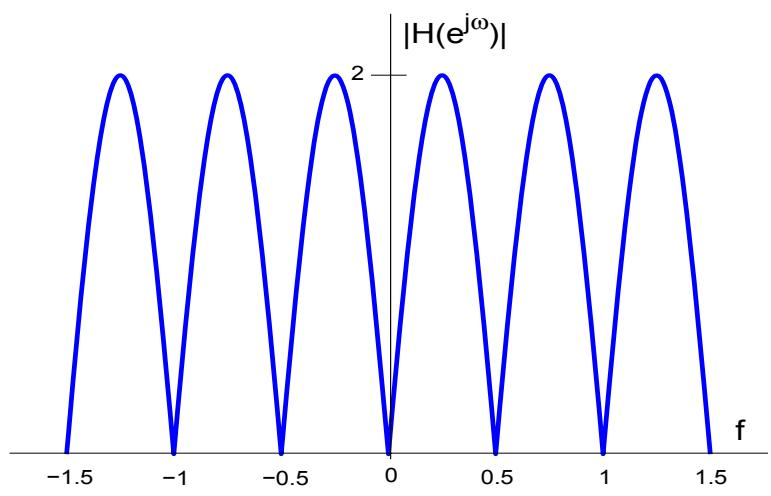  
รูปที่ 3.13: สเปกตรัมเชิงแอมพลิจูดของช่องสัญญาณ $H ( D ) = 1 - D ^ { 2 }$

ตัวอย่างที่ 3.10 จงหาสัญญาณในโดเมนความถี่ของช่องสัญญาณ $H ( D ) = 1 - D ^ { 2 } ( \mathring { \Psi } \Psi \mathring { \varphi } \partial \ h _ { 0 } = 1$ $h _ { 1 } = 0 , \mathsf { t b } \mathsf { \tilde { e } } \ \mathsf { h } _ { 2 } = - 1 )$

วิธีทำ จากสมการ (3.42) จะได้ว่า

$$
\begin{array} { l l l } { { H ( e ^ { j \omega } ) } } & { { = } } & { { \displaystyle \sum _ { k = 0 } ^ { 2 } h _ { k } e ^ { - j \omega k } } } \\ { { } } & { { = } } & { { h _ { 0 } e ^ { 0 } + h _ { 1 } e ^ { - j \omega } + h _ { 2 } e ^ { - j 2 \omega } } } \\ { { } } & { { = } } & { { 1 + 0 + ( - 1 ) e ^ { - j 2 \omega } } } \\ { { } } & { { = } } & { { 1 - e ^ { - j 2 \omega } } } \end{array}
$$

หรือสามารถที่จะหาสัญญาณ $H ( e ^ { j \omega } )$ ได้โดยตรงจาก $H ( D ) = 1 - D ^ { 2 }$ โดยการแทนค่า $D = e ^ { - j \omega }$ ตามที่จะ อธิบายต่อไปในหัวข้อที่ 3.4.2 รูปที่ 3.13 แสดงสเปกตรัมเชิงแอมพลิจูดของ ช่องสัญญาณ $H ( D )$ จะเห็นได้ว่า สัญญาณ $H ( e ^ { j \omega } )$ มีลักษณะเป็นสัญญาณเป็นคาบที่มีคาบความถี่เท่ากับ $f = 1$ เฮิรตซ์

  
รูปที่ 3.14: ตัวอย่างระบบ LTI ที่ไม่ต่อเนื่องทางเวลา

ตัวอย่างที่ 3.11 รูปที่ 3.14 แสดงระบบเชิงเส้นที่ไม่แปรเปลี่ยนตามเวลา (ระบบ LTI) ที่ไม่ต่อเนื่อง ทางเวลา จงหาสัญญาณในโดเมนความถี่ของ $x [ k ] , h [ k ]$ ,และ $y [ k ]$ พร้อมทั้งแสดงให้เห็นว่า 2 บศ $Y ( e ^ { j \omega } )$ $= X ( e ^ { j \omega } ) H ( e ^ { j \omega } )$

วิธีทำ จากระบบ LTI ที่กำหนดมาให้ จะได้ว่า สัญญาณเอาต์พุตสามารถหาได้จากความสัมพันธ์ $y [ k ] = x [ k ] * h [ k ]$ ซึ่งมีค่าเท่ากับ $\{ \ y _ { 0 } = 1 , y _ { 1 } = 0 , y _ { 2 } = - 1 \}$ ดังนั้น สัญญาณในโดเมนความถี่ ของ $x [ k ] , h [ k ]$ ,และ $y [ k ]$ หาได้ดังนี้

$$
{ \begin{array} { r c l } { X ( e ^ { j \omega } ) } & { = } & { \displaystyle \sum _ { k = 0 } ^ { 1 } x _ { k } e ^ { - j \omega k } = ( 1 ) e ^ { - j \omega ( 0 ) } + ( - 1 ) e ^ { - j \omega ( 1 ) } } \\ & & { = } & { 1 - e ^ { - j \omega } } \\ { H ( e ^ { j \omega } ) } & { = } & { \displaystyle \sum _ { k = 0 } ^ { 1 } h _ { k } e ^ { - j \omega k } = ( 1 ) e ^ { - j \omega ( 0 ) } + ( 1 ) e ^ { - j \omega ( 1 ) } } \\ & & { = } & { 1 + e ^ { - j \omega } } \\ { Y ( e ^ { j \omega } ) } & { = } & { \displaystyle \sum _ { k = 0 } ^ { 2 } y _ { k } e ^ { - j \omega k } = ( 1 ) e ^ { - j \omega ( 0 ) } + ( 0 ) e ^ { - j \omega ( 1 ) } + ( - 1 ) e ^ { - j \omega ( 2 ) } } \\ & & { = } & { 1 - e ^ { - j \omega } } \end{array} }
$$

เนืองจาก $1 - e ^ { - j 2 \omega } = ( 1 - e ^ { - j \omega } ) ( 1 + e ^ { - j \omega } )$ ดังนั้น จะได้ว่า $Y ( e ^ { j \omega } ) = X ( e ^ { j \omega } ) H ( e ^ { j \omega } )$ โดย ที่ สเปกตรัมเชิงแอมพลิจูดของ $| X ( e ^ { j \omega } ) | , | H ( e ^ { j \omega } ) |$ , และ $| Y ( e ^ { j \omega } ) |$ แสดงในรูปที่ 3.15 ถ้าพิจารณา จากรูปแล้ว จะพบว่า เมื่อนำเส้นกราฟของ $X ( e ^ { j \omega } )$ มาคูณกับเส้นกราฟของ $H ( e ^ { j \omega } )$ จะได้ผลลัพธ์ เป็นเส้นกราฟของ $Y ( e ^ { j \omega } )$ ตามที่ต้องการพอดี

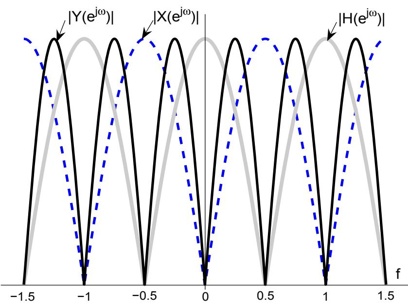  
รูปที่ 3.15: สเปกตรัมความถี่ของสัญญาณต่างๆ ในระบบ LTI ตามรูปที่ 3.14

สำหรับคุณสมบัติของการแปลงฟูเรียร์ที่ไม่ต่อเนื่องทางเวลาจะเหมือนกับคุณสมบัติของการแปลง ฟูเรียร์ที่ต่อเนื่องทางเวลา ตามที่ได้อธิบายไว้ในหัวข้อที่ 3.2.1 เพียงแต่เปลี่ยนตัวแปรให้เหมาะสมกับ ประเภทของสัญญาณเท่านั้น สำหรับการวิเคราะห์ระบบการประมวลผลสัญญาณของฮาร์ดดิสก์ไดรฬ์ การแปลงฟูเรียร์(โดยเฉพาะอย่างยิ่งการแปลงฟูเรียร์ที่ไม่ต่อเนื่องทางเวลา) จะมีบทบาทสำคัญมาก สำหรับการออกแบบระบบต่างๆ ในฮาร์ดดิสก์ไดรฟ์ ดังนั้น ผู้อ่านควรจะทำความเข้าใจเรื่องการแปลง ฟูเรียร์ในบทนีให้เข้าใจ ก่อนที่จะศึกษาในบทต่อๆ ไป

## 3.4 การแปลง Z และการแปลง D

การแปลง Z (Z transform) และการแปลง D (D transform) เป็นเครื่องมือทางคณิตศาสตร์ที่ใช้ใน การแปลงสัญญาณที่ไม่ต่อเนื่องทางเวลา (discrete-time signal) ให้อยู่ในรูปของสัญญาณในโดเมน Z และโดเมน D ตามลำดับ ซึ่งจะช่วยทำให้ง่ายต่อการวิเคราะห์สัญญาณ เช่นเดียวกันกับการแปลง ฟูเรียร์ เช่น สามารถนำมาใช้หาสเปกตรัมและแบนด์วิดท์ของสัญญาณได้ เป็นต้น โดยทั่วไปการแปลง Z จะนิยมใช้มากในสาขาวิชาที่เกี่ยวข้องกับการประมวลผลสัญญาณดิจิทัล ส่วนการแปลง D จะ พบ บ่อยทางด้านระบบสือสารดิจิทัล

## 3.4.1 การแปลง Z

ถ้ากำหนดให้ $h [ k ]$ เป็นผลตอบสนองอิมพัลส์ของระบบที่ไม่ต่อเนื่องทางเวลา ผลการแปลง Z ของ $h [ k ]$ จะนิยามโดย [33]

$$
H ( z ) = \sum _ { k = - \infty } ^ { \infty } h [ k ] z ^ { - k }\tag{3.47}
$$

โดยที่z คือ ตัวแปรเชิงซ้อน (complex variable) และ $z ^ { - k }$ คือ ตัวดำเนินการหน่วงเวลา k หน่วย นอกจากนี้ เพื่อให้ง่ายต่อการอธิบาย จะใช้สัญลักษณ์ต่อไปนี้แทนคู่การแปลง Z

$$
h [ k ] \Longleftrightarrow H ( z )\tag{3.48}
$$

สำหรับการแปลง Z ผกผัน (inverse Z transform) จะไม่ขออธิบายในที่ี้ เนืองจาก ไม่ค่อยได้มีการ นำมาใช้งานในหนังสือเล่มนี้ สำหรับผู้สนใจสามารถศึกษารายละเอียดได้ใน [33]

ผลการแปลง Z สามารถจัดให้อยู่ในรูปของผลการแปลงฟูเรียร์ที่ไม่ต่อเนื่องทางเวลาได้โดยการ แทนค่าตัวแปร $z = e ^ { j \omega }$ นั่นคือ

$$
H ( e ^ { j \omega } ) = \left. H ( z ) \right| _ { z = e ^ { j \omega } } = \sum _ { k = - \infty } ^ { \infty } h [ k ] e ^ { - j \omega k }\tag{3.49}
$$

## 3.4.2 การแปลง D

เช่นเดียวกันกับการแปลง Z ถ้ากำหนดให้ $h [ k ]$ เป็นผลตอบสนองอิมพัลส์ของระบบที่ไม่ต่อเนื่องทาง เวลา ผลการแปลง D ของ $h [ k ]$ จะนิยามโดย

$$
H ( D ) = \sum _ { k = - \infty } ^ { \infty } h [ k ] D ^ { k }\tag{3.50}
$$

โดยที่ $D$ คือ ตัวดำเนินการหน่วงเวลาหนึ่งหน่วย (unit delay operator) และเพื่อให้ง่ายต่อการอธิบาย จะใช้สัญลักษณ์ต่อไปนี้แทนคู่การแปลง D

$$
h [ k ] \Longleftrightarrow H ( D )\tag{3.51}
$$

สังเกตจากสมการ (3.47) และ (3.50) จะ พบว่า ผลการแปลง D สามารถหาได้โดยตรงจากผลการ แปลง Z โดยการแทนค่า $z ^ { - 1 } = D$ เนื่องจาก สัญลักษณ์ D มาจากคำว่า "ดีเลย์ (delay)" ซึ่ง หมายถึง การหน่วงเวลา ดังนั้น การแปลง D มักจะใช้บ่อยในระบบสื่อสารดิจิทัล เพราะจะช่วยทำ ให้ง่ายต่อการอธิบายแบบจำลองช่องสัญญาณ (chaททel model) และ การวิเคราะห์ระบบสื่อสารดิจิทัล โดยเฉพาะอย่างยิ่ง ในเรื่องการเข้ารหัสเพื่อแก้ไขข้อผิดพลาด (error-correction coding)

ในทำนองเดียวกัน ผลการแปลง D สามารถจัดให้อยู่ในรูปของผลการแปลงฟูเรียร์ที่ไม่ต่อเนื่อง ทางเวลาได้ โดยการแทนค่าตัวแปร $D = e ^ { - j \omega }$ นั่นคือ

$$
H ( e ^ { j \omega } ) = \left. H ( D ) \right| _ { D = e ^ { - j \omega } } = \sum _ { k = - \infty } ^ { \infty } h [ k ] e ^ { - j \omega k }\tag{3.52}
$$

หมายเหตุผลการแปลง Z และผลการแปลง D มีความหมายเทียบเท่ากับผลการแปลงฟูเรียร์ที่ไม่ ต่อเนื่องทางเวลา เพียงแต่ตัวแปรที่ใช้เป็นคนละตัวกัน โดยจะขึ้นอยู่กับรูปแบบและความเหมาะสมของ งานประยุกต์ (application) ที่ใช้งาน

ตัวอย่างที่ 3.12 พิจารณาระบบ LTI ในรูปที่ 3.16 เมื่อ $a _ { k }$ คือ ข้อมูลอินพุตบิต, $h _ { k }$ คือ ผลตอบสนอง อิมพัลส์ของช่องสัญญาณ, $n _ { k }$ คือ สัญญาณรบกวน, $f _ { k }$ คือ ผลตอบสนองอิมพัลส์ของอีควอไลเซอร์, และ $z _ { k }$ คือ ข้อมูลเอาต์พุตบิต จงหาผลการแปลง D ของข้อมูลเอาต์พุต $z _ { k }$ เมื่อ $f _ { k } = 1 / h _ { k }$ สำหรับ

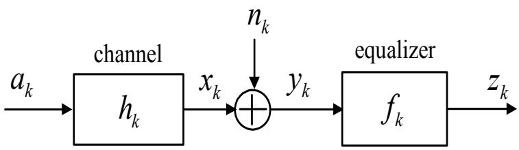  
รูปที่ 3.16: ระบบ LI ที่ไม่ต่อเนื่องทางเวลา

ทุกค่า k

วิธีทำ จากรูป 3.16 สัญญาณเอาต์พุตของอีควอไลเซอร์ คือ

$$
z _ { k } = y _ { k } * f _ { k }
$$

แต่เนืองจาก

$$
y _ { k } = a _ { k } * h _ { k } + n _ { k }
$$

e ท ดังนั้น จะได้ว่า

$$
z _ { k } = \left\{ a _ { k } * h _ { k } + n _ { k } \right\} * f _ { k }
$$

จากนั้นใช้การแปลง D เพื่อแปลงสมการข้างต้นให้อยู่ในโดเมน D ซึ่งจะได้เป็น

$$
\begin{array} { l c l } { { Z ( D ) } } & { { = } } & { { \{ A ( D ) H ( D ) + N ( D ) \} F ( D ) } } \\ { { } } & { { } } & { { } } \\ { { } } & { { = } } & { { A ( D ) H ( D ) F ( D ) + N ( D ) F ( D ) } } \end{array}
$$

เมื่อ $z _ { k } \longleftrightarrow Z ( D ) , a _ { k } \longleftrightarrow A ( D ) , h _ { k } \longleftrightarrow H ( D ) , f _ { k } \longleftrightarrow F ( D )$ ,และ ${ { n } _ { k } } \iff { { N } } ( D )$ ดังนั้น เมื่อกำหนดให้ $F ( D ) = 1 / H ( D )$ จะได้ว่า ข้อมูลเอาต์พุต $z _ { k }$ ในโดเมน D มีค่าเท่ากับ

$$
Z ( D ) = A ( D ) + { \frac { N ( D ) } { H ( D ) } }
$$

ในทางปฏิบัติ อีควอไลเซอร์ลักษณะ นี้จะ เรียกกันทั่วไปว่า "อีควอไลเซอร์แบบ zero-forcing" ซึ่งจะ อธิบายรายละเอียดต่อไปในหัวข้อที่ 5.6

  
(a)

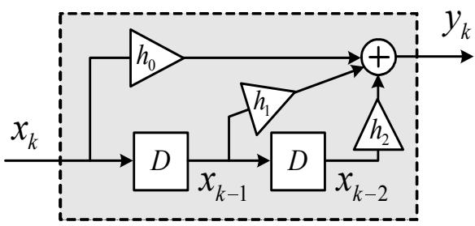  
(b)  
รูปที่ 3.17: (a) ผลตอบสนองอิมพัลส์ของระบบ และ (b) แผนภาพบล็อกการส่งสัญญาณ

## 3.5 ความสัมพันธ์ระหว่างสัญญาณอินพุตและสัญญาณเอาต์พุต

คุณสมบัติที่สำคัญของระบบ LTI คือ สัญญาณเอาต์พุตจะ มีค่าเท่ากับการทำคอนโวลู ชันระหว่าง สัญญาณอินพุตและผลตอบสนองอิมพัลส์ของระบบ ให้พิจารณาผลตอบสนองอิมพัลส์ของระบบในรูป $\stackrel { \mathrm { d } } { \mathrm { ~ \ i ~ } } 3 . 1 7 ( \mathrm { a } )$ นันคือ ผลตอบสนองอิมพัลส์ของระบบมีค่าเท่ากับ $h _ { 0 }$ ทีเวลาที 2 2 $k = 0 , h _ { 1 }$ ที่เวลาที ซู $k = 1$ และ $h _ { 2 }$ ที่เวลาที่ $k = 2$ โดยทั่วไป ผลตอบสนองอิมพัลส์ของระบบนี้สามารถเขียนให้อยู่ในรูปของ สมการทางคณิตศาสตร์ได้ คือ

$$
h _ { k } = h _ { 0 } \delta [ k ] + h _ { 1 } \delta [ k - 1 ] + h _ { 2 } \delta [ k - 2 ]
$$

เมื่อ $\delta [ k ]$ คือ ฟังก์ชันโครเนคเกอร์เดลตา (ดูหัวข้อที่ 2.3.2) เช่นเดียวกัน ผลตอบสนองอิมพัลส์ของ ระบบในรูปของโดเมน Z และโดเมน D จะมีค่าเท่ากับ

$$
\begin{array} { r c l } { { H ( z ) } } & { { = } } & { { h _ { 0 } + h _ { 1 } z ^ { - 1 } + h _ { 2 } z ^ { - 2 } } } \\ { { } } & { { } } & { { } } \\ { { H ( D ) } } & { { = } } & { { h _ { 0 } + h _ { 1 } D + h _ { 2 } D ^ { 2 } } } \end{array}
$$

จะเห็นได้ว่า สัญญาณที่ไม่ต่อเนื่องทางเวลาสามารถที่จะถูกเปลี่ยนให้อยู่ในรูปของสัญญาณในโดเมน อื่นๆ ได้โดยง่าย ซึ่งจะช่วยทำให้การวิเคราะห์สัญญาณง่ายขึ้น

นอกจากนี้ผลตอบสนองอิมพัลส์ของระบบยังสามารถแสดงให้อยู่ในรูปของแผนภาพบล็อก (block diagram) การส่งสัญญาณได้ ตามรูปที่ 3.17(b) โดยที่ บล็อก D จะทำหน้าที่เสมือนเป็นเรจิสเตอร์ แบบเลื่อน (รhift register) หรือตัวดำเนินการหน่วงเวลาหนึ่งหน่วย ดังนั้น เมื่อสัญญาณอินพุต $x _ { k }$ ผ่านบล็อก $D$ จะได้ผลลัพธ์เป็น $x _ { k - 1 }$ และเมื่อ $x _ { k - 1 }$ ผ่านบล็อก $D$ ก็จะได้ผลลัพธ์ เป็น $x _ { k } .$ k−2 เพราะฉะนั้น เมื่อพิจารณาจากรูปที่ 3.17(b) แล้ว สัญญาณเอาต์พุต $y _ { k }$ สามารถเขียนให้อยู่ในรูปของ สมการทางคณิตศาสตร์ที่เป็นฟังก์ชันของสัญญาณอินพุต $x _ { k }$ ได้ดังนี้

$$
y _ { k } = h _ { 0 } x _ { k } + h _ { 1 } x _ { k - 1 } + h _ { 2 } x _ { k - 2 }
$$

ซึ่งสามารถนำมาใช้ในการคำนวณหาสัญญาณเอาต์พุตของระบบได้โดยตรง (เมื่อโจทย์กำหนดผลตอบ สนองอิมพัลส์และสำดับข้อมูลอินพุตมาให้) แทนการใช้วิธีการทำคอนโวลูชันตามที่อธิบายในหัวข้อที่ 2.5

ตัวอย่างที่ 3.13 กำหนดให้สัญญาณอินพุต $x _ { k }$ ผ่านเข้าไปในช่องสัญญาณ PR4 ที่มีผลตอบสนอง อิมพัลส์ คือ

$$
H ( D ) = 1 - D ^ { 2 }
$$

และได้เป็นสัญญาณเอาต์พุต yr

ก)จงวาดภาพผลตอบสนองอิมพัลส์ $h _ { k }$ และแผนภาพบล็อกการส่งสัญญาณของระบบ

ข)จงแสดงสัญญาณเอาต์พุต $y _ { k }$ ให้อยู่ในรูปของสมการทางคณิตศาสตร์ที่เป็นฟังก์ชันของสัญญาณ อินพุต $x _ { k }$

ค)ถ้า $\{ x _ { 0 } , x _ { 1 } , x _ { 2 } \} = \{ 1 , 1 , 0 \}$ จงคำนวณหาสัญญาณเอาต์พุต $y _ { k }$ สำหรับ $k = 0 , 1 , 2 , 3 , 4$

## วิธีทำ

ก)จากช่องสัญญาณที่กำหนดมาให้ สามารถวาดภาพผลตอบสนองอิมพัลส์และ แผนภาพบล็อกการ ส่งสัญญาณของระบบได้ ดังแสดงในรูปที่ 3.18

ข)จากรูปที่ 3.18(b) สามารถเขียนสมการคณิตศาสตร์แสดงความสัมพันธ์ระหว่างสัญญาณ $y _ { k }$ และ สัญญาณ $x _ { k }$ ได้ดังนี้

$$
y _ { k } = x _ { k } - x _ { k - 2 }
$$

ค) ดังนั้น ถ้า $\{ x _ { 0 } , x _ { 1 } , x _ { 2 } \} = \{ 1 , 1 , 0 \}$ จะได้ว่า สัญญาณเอาต์พุต $y _ { k }$ มีค่าเท่ากับ

  
(a)

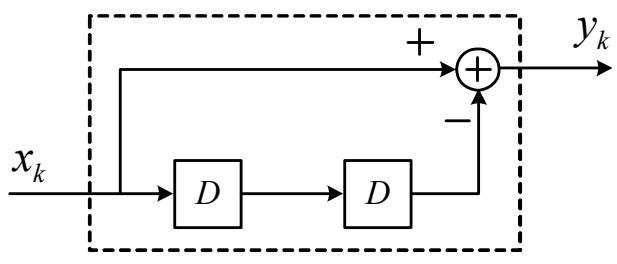  
(b)  
รูปที่ 3.18: (a) ผลตอบสนองอิมพัลส์ของช่องสัญญาณ PR4 และ (b) แผนภาพบล็อกการส่งสัญญาณ

$$
\{ y _ { 0 } , y _ { 1 } , y _ { 2 } , y _ { 3 } , y _ { 4 } \} = \{ 1 , 1 , - 1 , - 1 , 0 \}
$$

## 3.6สรุปท้ายบทธี

การแปลง ฟูเรียร์, การแปลง Z, และการแปลง D เป็นเครื่องมือทางคณิตศาสตร์ที่ใช้ในการแปลง สัญญาณในโดเมนเวลาให้อยู่ในรูปของสัญญาณในโดเมนความถี่, โดเมน Z, และโดเมน D ตาม ลำดับ ซึ่งจะช่วยทำให้การวิเคราะห์สัญญาณในระบบง่ายขึ้น นอกจากนี้ยังได้แสดงให้เห็นว่า การแปลง สัญญาณทั้งสามวิธีนี้มีความสัมพันธ์กันค่อนข้างมาก และเนืองจาก เนื้อหาในหนังสือเล่มนี้จะมุ่งเน้น 4รื้ร ไปที่การวิเคราะห์ระบบการประมวลผลสัญญาณของฮาร์ดดิสก์ไดรฟ์ ดังนั้นผู้อ่านควรที่จะศึกษาเนื้อหา ในบทนี้ให้เข้าใจก่อนที่จะศึกษาในบทต่อๆ ไป

## 3.7 แบบฝึกหัดท้ายบท

1. จงหาผลการแปลงฟูเรียร์ของสัญญาณ

$$
x ( t ) = { \frac { \sin ( t ) \sin ( t / 2 ) } { \pi t ^ { 2 } } }
$$

2. จงพิสูจน์ความสัมพันธุ์ของพาร์ชิวาลในสมการ (3.29)

3. จงหาผลการแปลงฟูเรียร์ของสัญญาณ

$$
x ( t ) = \left\{ \begin{array} { l l } { \frac { A } { 2 } \{ 1 + \cos ( \pi t / T ) \} , } & { | t | < T } \\ { 0 , } & { | t | > T } \end{array} \right.
$$

เมื่อ A เป็นค่าคงตัวใดๆ

4. กำหนดให้สัญญาณ $x ( t )$ เป็นสัญญาณค่าจริง และมีคู่การแปลงฟูเรียร์เท่ากับ $X ( f )$ จงพิสูจน์ ${ \dot { \mathfrak { d } } } \mathfrak { n }$

$$
\mathcal { F } [ \boldsymbol { x } ( - t ) ] = \boldsymbol { X } ( - t ) = \boldsymbol { X } ^ { * } ( t )
$$

5. จงแสดงว่าพินที่ไต้กราฟทั้งหมดของฟังก์ชันซิงก์มีค่าเท่ากับค่าหนึง นันคือ เมื้นชี่ใต้ ซ ด e ..รี

$$
\int _ { - \infty } ^ { \infty } \mathrm { s i n c } ( t ) d t = 1
$$

6. จงวาดกราฟแสดงสเปกตรัมเชิงแอมพลิจูดของช่องสัญญาณ $H _ { 1 } ( D ) = 1 - D ^ { 2 }$ และ $H _ { 2 } ( D ) =$ $1 + 2 D + D ^ { 2 }$ พร้อมทั้งเปรียบเทียบผลลัพธ์ที่ได้

7. กำหนดให้สัญญาณอินพุต $x _ { k }$ ผ่านเข้าไปในช่องสัญญาณ PR2 ที่มีผลตอบสนองอิมพัลส์ คือ

$$
H ( D ) = 1 + 2 D + D ^ { 2 }
$$

และได้เป็นสัญญาณเอาต์พุต yk

ก)จงวาดภาพผลตอบสนองอิมพัลส์ $h _ { k }$ และแผนภาพบล็อกการส่งสัญญาณของระบบ

ข)จงแสดงสัญญาณเอาต์พุต $y _ { k }$ ให้อยู่ในรูปของสมการทางคณิตศาสตร์ ที่เป็นฟังก์ชันของ สัญญาณอินพุต $x _ { k }$

ค)ถ้า $\{ x _ { 0 } , x _ { 1 } , x _ { 2 } \} = \{ 1 , 0 , 1 \}$ จงคำนวณหาสัญญาณเอาต์พุต $y _ { k }$ สำหรับ $k = 0 , 1 , 2 , 3 , 4$

8. กำหนดให้ระบบ LTI มีผลตอบสนองอิมพัลส์ คือ $h ( t ) ~ = ~ e ^ { - a t } u ( t )$ โดยที่ $a ~ > ~ 0$ และ $u ( t )$ คือ ฟังก์ชั้นขั้นหนึ่งหน่วย จงหาสัญญาณเอาต์พุตในโดเมนความถี่ ถ้าสัญญาณอินพุต คือ $x ( t ) = e ^ { - b t } u ( t )$ เมื่อ $b > 0$

9. ถ้าระบบ LTI ถูกกำหนดโดยสมการ

$$
{ \frac { d y ( t ) } { d t } } + a y ( t ) = x ( t )
$$

เมื่อ $a > 0$ คือ ค่าคงตัว, $x ( t )$ คือสัญญาณอินพุต, และ $y ( t )$ คือ สัญญาณเอาต์พุต จงหาผล ตอบสนองอิมพัลส์ของระบบนี้ในโดเมนความถี่ นั่นคือ หาค่า $H ( f )$ เมื่อ $y ( t ) = x ( t ) * h ( t )$