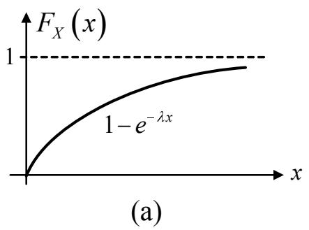
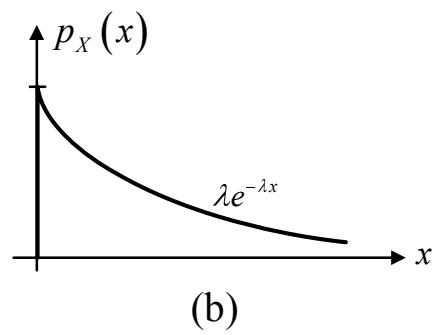
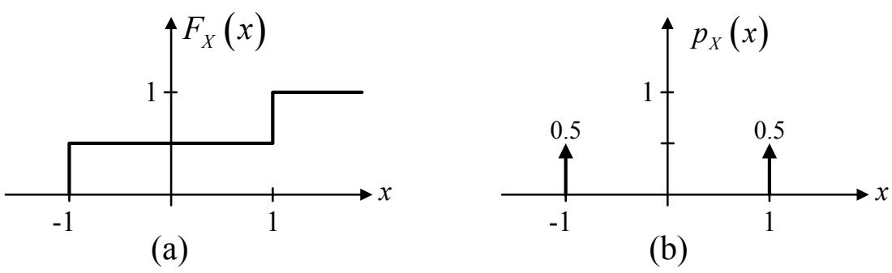
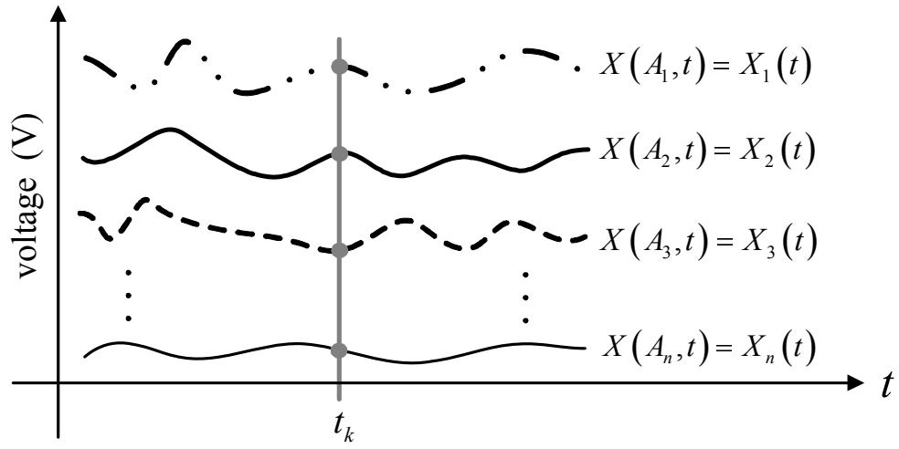
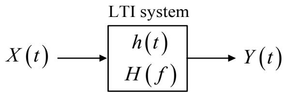

## บทที่ 4

## สัญญาณและกระบวนการสุ่ม

ดซ ในบทนี้ จะอธิบายถึงความรู้พื้นฐานเกี่ยวกับสัญญาณและกระบวนการสุ่ม เช่น ตัวแปรสุ่ม, ค่าเฉลี่ย เอนเซมเบิล, โมเมนต์, กระบวนการสุ่ม, กระบวนการเออร์กอดิก, ความหนาแน่นสเปกตรัมกำลัง, และความสัมพันธ์ระหว่างกระบวนการสุ่มและระบบเชิงเส้นที่ไม่แปรเปลี่ยนตามเวลา เป็นต้น เพื่อให้ ผู้อ่านเข้าใจถึงวิธีการวิเคราะห์และวิธีการจัดการกับสัญญาณสุ่ม ทั้งนี้เป็นเพราะว่า ข้อมูลข่าวสารต่างๆ ที่รับส่งในระบบการประมวลผลสัญญาณ ของฮาร์ดดิสก์ไดรฟ์มีคุณลักษณะ เป็นสัญญาณ สุ่ม ดังนั้น เนื้อหา ภายในบทนี้จะ ช่วยทำให้ผู้อ่านเข้าใจถึงคุณลักษณะ ของ สัญญาณ และกระบวนการสุ่มมากขึ้น ซึ่งจะส่งผลทำให้สามารถเข้าใจเนื้อหาในบทต่อไปได้ง่ายขึ้น สำหรับผู้สนใจที่ต้องการศึกษารายละเอียด เพิ่มเติมของเนื้อหาในบทนี้ สามารถค้นคว้าได้จาก [9, 35, 36]

## 4.1บทนำ

จุดประสงค์หลักของระบบสื่อสาร คือ การส่งข่าวสาร (informatioท)จากวงจรภาคส่ง (tranรmitter) ผ่านช่องสัญญาณ (channel) ไปยังวงจรภาครับ (receiver) โดยทั่วไป สัญญาณข่าวสารต่างๆ ในระบบ สื่อสารจะ มีคุณลักษณะ เป็น "สัญญาณสุ่ม (random signal)" ซึ่งก็คือ สัญญาณที่ไม่สามารถระบุได้ ญ แน่นอนตายตัวว่า ณ เวลาขณะนั้น สัญญาณสุ่มมีคุณสมบัติเป็นอย่างไร ตัวอย่างของสัญญาณสุ่ม เช่น สัญญาณข่าวสาร (message signal) และสัญญาณรบกวน (noise) เป็นต้น

ในการวิเคราะห์สัญญาณสุ่ม สัญญาณสุ่มมักจะ ถูก แปลงให้อยู่ในรูปที่มีคุณสมบัติเป็นสัญญาณ เชิงกำหนด (deterministic รignal) เพื่อที่จะได้สามารถนำเอาหลักการและทฤษฎีต่างๆ ที่ใช้สำหรับ ระบบเชิงเส้นที่ไม่แปรเปลี่ยนตามเวลา (LTI: linear time-invariant) มาใช้ในการวิเคราะห์ และดึง ข้อมูล ที่ต้องการออกมาจาก สัญญาณสุ่มนั้น เครื่องมือ ทางคณิตศาสตร์ ที่ใช้ในการ แปลงสัญญาณสุ่ม ให้มีคุณสมบัติเป็นสัญญาณเชิงกำหนด เช่น ฟังก์ชันอัตสหสัมพันธ์ (auto-correlation), ฟังก์ชันความ แปรปรวนร่วมเกียว (covariance), และฟังก์ชันความหนาแน่นสเปกตรัมกำลัง (power spectral density) เป็นต้น ซึ่งังก์ชันเหล่านี้จะใช้สิ่งที่เรียกว่า "ตัวดำเนินการค่าคาดหมาย (expectation operator)" มาช่วยในการคำนวณ ดังนั้นอาจจะกล่าวได้ว่า ตัวดำเนินการค่าคาดหมายจะ ทำหน้าที่ในการ กำจัดความไม่แน่นอน (นncertainty) ของสัญญาณสุ่มให้หมดไป

## 4.2ตัวแปรสุ่ม

ให้พิจารณาเหตุการณ์การโยนเหรียญบาทซึ่งผลลัพ์ที่ได้จะมี 2 แบบ คือ "หัว (head)" หรือ "ก้อย (tail)" ถ้าโยนเหรียญบาทหลายๆ ครั้ง โดยทั่วไปก็มักจะคาดหวังว่า จำนวนครั้งที่ได้ผลลัพธ์ เป็น "หัว" ยลี่ป น   
จะเท่ากับจำนวนครั้งที่ได้ผลลัพธ์เป็น "ก้อย" กล่าวคือ ถ้ากำหนดให้ N คือ จำนวนครั้งที่ทำการโยน เหรียญบาท, $n _ { H }$ คือ จำนวนครั้งที่ได้ผลลัพธ์เป็น "หัว," และ $n _ { T }$ คือ จำนวนครั้งที่ได้ผลลัพธ์เป็น “ก้อย" ดังนั้น จะได้ว่า

$$
\frac { n _ { H } } { N } \approx 0 . 5 ; \frac { n _ { T } } { N } \approx 0 . 5
$$

นั่น คือ ถ้าเหรียญบาทที่ใช้ไม่มีการถ่วงน้ำหนัก ความน่าจะเป็น (probability) ที่จะ ได้ผลลัพธ์ เป็น "หัว" หรือ "ก้อย" จะมีค่าเท่ากัน ในทางคณิตศาสตร์ ค่าความน่าจะเป็นของผลลัพธ์ทั้งสองนี้สามารถ เขียนเป็นความสัมพันธ์ได้ ดังนี้

$$
\mathrm { P r } \{ H \} = 0 . 5 ; \mathrm { P r } \{ T \} = 0 . 5\tag{4.1}
$$

เมื่อ $\operatorname* { P r } \{ x \}$ คือ ความน่าจะเป็นของ x, H คือ ผลลัพธ์เป็น $^ { \bullet \bullet } \mathring { \mathcal { M } } \mathfrak { J } , ^ { \bullet }$ และ $T$ คือ ผลลัพธ์เป็น "“ก้อย" นอกจากนี้เซตของผลลัพธ์ที่เป็นไปได้ทั้งหมดที่ได้จากการทดลองหนึ่งๆ จะเรียกว่า "ปริภูมิตัวอย่าง (sample รpace)"โดยจะใช้สัญลักษณ์ Ω แทนปริภูมิตัวอย่าง ซึงจะมีค่าความน่าจะเป็นเท่ากับค่าหนึ่ง

ยั่นอื เสมอ นันคือ

$$
\mathrm { P r } \{ \Omega \} = 1\tag{4.2}
$$

สำหรับการทดลองการโยนเหรียญบาท จะได้ว่า

$$
\Omega = \{ H , T \}
$$

เซตย่อย (ธนbรet) ของปริภูมิตัวอย่างจะเรียกกันว่า "เหตุการณ์ (event)" และแต่ละสมาชิกในเหตุการณ์ จะเรียกว่า "เหตุการณ์มูลฐาน (elementary event)" [35] สำหรับเหตุการณ์ การโยนเหรียญ บาทจะ ประกอบไปด้วยสองเหตุการณ์มูลฐาน คือ

$$
\omega _ { 1 } = \{ H \} \quad ; \quad \omega _ { 2 } = \{ T \}
$$

ถ้ากำหนดให้ตัวแปรค่าจริง x แทนผลลัพธ์ ที่ได้จากเหตุการณ์การโยนเหรียญบาท โดยที่ $x =$ 1 เมื่อผลลัพธ์เป็น $^ { \bullet \bullet } \mathring { \mathcal { M } } \mathfrak { J } ^ { \bullet }$ และ $x \ = \ - 1$ เมื่อผลลัพธ์ เป็น “ก้อย" ดังนั้น สามารถนิยามการจับคู่ (mapping)ระหว่างเซตของผลลัพธ์ $\omega _ { i } \in \Omega$ และเซตของจำนวนจริง R นันคือ $f : \Omega \to R$ ได้ดังนี้

$$
\begin{array} { r c l } { \omega _ { 1 } } & { = } & { \{ H \} \implies \ x = 1 } \\ { } & { } & { } \\ { \omega _ { 2 } } & { = } & { \{ T \} \implies \ x = - 1 } \end{array}
$$

จากการกำหนดค่าความน่าจะเป็นให้กับผลลัพธ์ที่ได้จากการโยนเหรียญบาทในสมการ (4.1) จะได้ว่า ความน่าจะเป็นที่ $x = 1$ หรือ $x = - 1$ มีค่าเท่ากัน กล่าวคือ

$$
\begin{array} { r c l } { { \mathrm { P r } \{ x = 1 \} } } & { { = } } & { { 0 . 5 } } \\ { { } } & { { } } & { { } } \\ { { \mathrm { P r } \{ x = - 1 \} } } & { { = } } & { { 0 . 5 } } \end{array}\tag{4.3}
$$

ญ เนื่องจาก การโยนเหรียญบาทจะได้ผลลัพธ์เพียง 2 แบบเท่านั้น คือ "หัว" หรือ "ก้อย" ดังนั้น ค่าของ ตัวแปร x ที่เป็นไปได้ คือ ค่า 1 และ -1 เท่านั้น ส่วนค่า x อื่นๆ จะมีค่าความน่าจะเป็นเท่ากับค่า ศูนย์ นั่นคือ

$$
\operatorname* { P r } \{ x = \alpha \} = 0
$$

เมื่อ α $\neq \pm 1$ และความน่าจะเป็นที่ตัวแปร x จะมีค่าเป็นค่า 1 หรือ —1 คือ

$$
\mathrm { P r } \{ \Omega \} = \mathrm { P r } \{ x = \pm 1 \} = 1
$$

จากการกำหนดค่าความน่าจะเป็นให้กับแต่ละเหตุการณ์มูลฐานในปริภูมิตัวอย่าง Ω2 และการแปลง ญ แต่ละเหตุการณ์มูลฐาน $\omega _ { i } \in \Omega$ ให้เป็นค่าจำนวนจริง เพราะฉะนั้น "ตัวแปรสุ่ม (random variable)" จึงได้ถูกนิยามขึ้นมา หรืออาจจะกล่าวอีกนัยหนึ่งว่า ตัวแปรสุ่ม $X ( A )$ จะทำการแปลงเหตุการณ์สุ่ม A ให้ไปเป็นเลขจำนวนจริง ตัวอย่างเช่น ในการโยนเหรียญบาทหนึ่งครั้ง ผลลัพธ์ที่เกิดขึ้นได้จะมีทั้งหมด De สองแบบ คือ 1 (แทน $^ { 6 6 } \vec { \mathcal { M } } \vec { \mathcal { A } } ^ { 5 } )$ และ —1 (แทน “ก้อย") ดังนั้น $X ( A ) \in \{ 1 , - 1 \}$ หรือในการทอด ลูกเต๋าำหนึ่งครั้ง ผลลัพธ์ที่เกิดขึ้นได้จะมีทั้งหมดหกแบบ คือ ค่า 1, 2, 3, 4, 5, และ 6 ดังนั้น จะได้ว่า $X ( A ) \in \{ 1 , 2 , 3 , 4 , 5 , 6 \}$ เป็นต้น

การกำหนดค่าความน่าจะเป็น (เลขจำนวนจริง) ให้กับแต่ละเหตุการณ์ A ในปริภูมิตัวอย่าง จะต้อง สอดคล้องกับสัจพจน์ (axiom) ทั้ง 3 ข้อต่อไปนี้

1) $\operatorname* { P r } \{ A \} \geq 0$ สำหรับทุกเหตุการณ์ $A \in \Omega$

2) $\mathrm { P r } \{ \Omega \} = 1$ สำหรับเหตุการณ์ที่แน่นอน 2

3) สำหรับสองเหตุการณ์ไม่เกิดร่วม (mutually exclusive events) $A _ { 1 }$ และ $A _ { 2 }$ จะได้ว่า

$$
\operatorname* { P r } \{ A _ { 1 } \cup A _ { 2 } \} = \operatorname* { P r } \{ A _ { 1 } \} + \operatorname* { P r } \{ A _ { 2 } \}
$$

หลังจากที่ได้นิยามการกำหนดค่าความน่าจะเป็นของเหตุการณ์ในปริภูมิตัวอย่างแล้ว คำอธิบายของ ความน่าจะเป็นสำหรับตัวแปรสุ่ม X ก็สามารถที่จะกำหนดขึ้นมาได้ ซึ่งโดยทั่วไป มักจะอยู่ในรูปของ ความน่าจะเป็นที่ตัวแปรสุ่ม X มีค่าจำเพาะเจาะจง หรือมีค่าภายในช่วงที่กำหนด เช่น $\mathrm { P r } \{ X = 1 \}$ $\operatorname* { P r } \{ X \ = \ - 1 \}$ , หรือ $\operatorname* { P r } \{ 0 \ < \ X \ \leq \ 1 \}$ ในทางปฏิบัติ ค่าความน่าจะเป็นของตัวแปรสุ่มมักจะ ถูกกำหนดให้โดยตรง (แทนที่จะกำหนดให้กับเหตุการณ์ในปริภูมิตัวอย่าง) ในรูปของ "ฟังก์ชันการ แจกแจงความน่าจะ เป็น (probability distribution function)" หรือที่เรียกกันว่า "ฟังก์ชันการแจกแจง สะสม (cumulative distribution function)" ซึ่งนิยามโดย

$$
F _ { X } ( x ) = \operatorname* { P r } \{ X \leq x \}\tag{4.4}
$$

เมื่อ $F _ { X } ( x )$ คือ ความน่าจะเป็นที่ตัวแปรสุ่ม X มีค่าน้อยกว่าหรือเท่ากับค่าจำนวนจริง x คุณสมบัติ ที่สำคัญของฟังก์ชันการแจกแจงสะสม มีดังนี้

1) $0 \leq F _ { X } ( x ) \leq 1$

2) $F _ { X } ( x _ { 1 } ) < F _ { X } ( x _ { 2 } ) \quad { \mathfrak { g } } { \mathfrak { n } } \qquad x _ { 1 } < x _ { 2 }$

3) $F _ { X } ( - \infty ) = 0$

4) $F _ { X } ( + \infty ) = 1$

นอกจากนี้ อนุพันธ์ (derivat่ve) ของฟังก์ชันการแจกแจงสะสม จะมีค่าเท่ากับ "ฟังก์ชันความหนาแน่น ความน่าจะ เป็น (probability density function)" นั้นคือ

$$
p _ { X } ( x ) = \frac { d F _ { X } ( x ) } { d x }\tag{4.5}
$$

๑ร: 0 น คุณสมบัติที่สำคัญของฟังก์ชันความหนาแน่นความน่าจะเป็น มิดังนี้

1) $0 \leq p _ { X } ( x ) \leq 1$

2) $\textstyle \operatorname* { P r } \{ a \leq X \leq b \} = \int _ { a } ^ { b } p _ { X } ( x ) d x$

3) $\begin{array} { r } { F _ { X } ( x ) = \int _ { - \infty } ^ { x } p _ { X } ( \alpha ) d \alpha } \end{array}$

$$
4 ) \begin{array} { r } { \int _ { - \infty } ^ { \infty } p _ { X } ( x ) d x = F _ { X } ( + \infty ) - F _ { X } ( - \infty ) = 1 } \end{array}
$$

ตัวอย่างที่ 4.1 กำหนดให้ตัวแปรสุ่ม X คือ เวลาที่ใช้ในการส่งข่าวสารผ่านช่องสัญญาณ โดยที่ X เป็นตัวแปรสุ่มแบบเลขชี้กำลัง (exponential random variable) ที่มีฟังก์ชันความน่าจะเป็น คือ

$$
\operatorname* { P r } \{ X > x \} = e ^ { - \lambda x } , \quad x > 0
$$

เมื่อ x เป็นเลขจำนวนจริงใดๆ และ A คือ ค่าคงตัว (constant) จงคำนวณหา

ก) ฟังก์ชันการแจกแจงสะสม $F _ { X } ( x )$

  
รูปที่ 4.1: (a) ฟังก์ชันการแจกแจงสะสม $F _ { X } ( x )$ และ (b) ฟังก์ชันความหนาแน่นความน่าจะเป็น รู $p _ { X } ( x )$ ของตัวแปรสุ่มแบบเลขชีกำลัง

ข)ค่า $\operatorname* { P r } \{ T < X \leq 2 T \}$ เมื่อ $T = 1 / \lambda$

ค) ฟังก์ชันความหนาแน่นความน่าจะเป็น $p _ { X } ( x )$

วิธีทำ

ก) ฟังก์ชันการแจกแจงสะสม หาได้จาก

$$
\begin{array} { l l l } { F _ { X } ( x ) } & { = } & { \operatorname* { P r } \{ X \leq x \} } \\ & { = } & { 1 - \operatorname* { P r } \{ X > x \} } \\ & { = } & { 1 - e ^ { - \lambda x } } \\ & { = } & { \left\{ \begin{array} { l l } { 0 , } & { x < 0 } \\ { 1 - e ^ { - \lambda x } , } & { x \geq 0 } \end{array} \right. } \end{array}
$$

ดังแสดงในรูปที่ 4.1(a)

\- ข)จากคุณสมบัติของฟังก์ชันการแจกแจงสะสม จะได้ว่า

$$
{ \begin{array} { l l l } { \operatorname* { P r } \{ T < X \leq 2 T \} } & { = } & { \operatorname* { P r } \{ X < 2 T \} - \operatorname* { P r } \{ X < T \} } \\ & { = } & { ( 1 - e ^ { - \lambda 2 x } ) - ( 1 - e ^ { - \lambda x } ) } \\ & { = } & { e ^ { - \lambda x } - e ^ { - \lambda 2 x } } \end{array} }
$$

  
รูปที่ 4.2: (a) ฟังก์ชันความหนาแน่นความน่าจะเป็น $p _ { X } ( x )$ และ (b) ฟังก์ชันการแจกแจงสะสม $F _ { X } ( x )$ ของตัวแปรสุ่มแบบเอกรูป

ดังนั้นเมื่อ $T = 1 / \lambda$ จะได้ว่า

$$
\operatorname* { P r } \{ T < X \le 2 T \} = e ^ { - 1 } - e ^ { - 2 } \approx 0 . 2 3 3
$$

ค)เนื่องจาก $F _ { X } ( x )$ เป็นฟังก์ชันที่ต่อเนื่องตลอดทุกค่า x จะได้ว่า อนุพันธ์ของ $F _ { X } ( x )$ จะมีอยู่จริง สำหรับทุกค่า x ยกเว้นที่ค่า $x = 0$ ดังนั้น ฟังก์ชันความหนาแน่นความน่าจะเป็น $p _ { X } ( x )$ คือ

$$
p _ { X } ( x ) = \frac { d F _ { X } ( x ) } { d x } = \left\{ \begin{array} { l l } { 0 , } & { x < 0 } \\ { \lambda e ^ { - \lambda x } , } & { x > 0 } \end{array} \right.
$$

ดังแสดงในรูปที่ 4.1(b)

ตัวอย่างที่ 4.2 กำหนดให้ฟังก์ชันความหนาแน่นความน่าจะเป็นของตัวแปรสุ่มแบบเอกรูป X (uniform random variable) คือ

$$
p _ { X } ( x ) = { \left\{ \begin{array} { l l } { K , } & { a \leq x \leq b } \\ { 0 , } & { { \mathrm { e l s e } } } \end{array} \right. }
$$

ดังแสดงในรูปที่ 4.2(a) เมื่อ a และ b คือ ค่าคงตัวใดๆ จงคำนวณหาค่า K และฟังก์ชันการแจกแจง สะสม $F _ { X } ( x )$

วิธีทำ ค่า K สามารถหาได้จากการใช้คุณสมบัติของฟังก์ชันความหนาแน่นความน่าจะเป็น นั่นคือ

$$
\int _ { - \infty } ^ { \infty } p _ { X } ( x ) d x = 1
$$

$$
\int _ { a } ^ { b } K d x = 1
$$

$$
\begin{array} { l l l } { { K ( b - a ) } } & { { = } } & { { 1 } } \end{array}
$$

$$
\ K \ = \ { \frac { 1 } { b - a } }
$$

ในทำนองเดียวกัน ฟังก์ชันการแจกแจงสะสม หาได้จาก

$$
F _ { X } ( x ) = \int _ { - \infty } ^ { x } p _ { X } ( \alpha ) d \alpha
$$

ซึ่งจะมีค่าเท่ากับ

$$
F _ { X } ( x ) = { \left\{ \begin{array} { l l } { 0 , } & { x < a } \\ { { \frac { x - a } { b - a } } , } & { a \leq x \leq b } \\ { 1 , } & { x > b } \end{array} \right. }
$$

ดังแสดงในรูปที่ 4.2(b)

สำหรับตัวแปรสุ่มวิยุต (discrete random variable) ฟังก์ชันมวล ความน่าจะเป็น (probability mass fนทct่on) จะถูกนำมาใช้แทนฟังก์ชันความหนาแน่นความน่าจะเป็น ซึ่งนิยามโดย

$$
p _ { X } ( x ) = \sum _ { i } { \mathrm { P r } } \{ x = x _ { i } \} \delta [ x - x _ { i } ]\tag{4.6}
$$

เมื่อ $\delta [ \cdot ]$ คือ ฟังก์ชันโครเนคเกอร์เดลตา (Kronecker delta function) และฟังก์ชันการแจกแจงสะสม ของตัวแปรสุ่มวิยุต สามารถหาได้จาก

$$
F _ { X } ( x ) = \int _ { - \infty } ^ { x } p _ { X } ( y ) d y = \sum _ { i } \operatorname* { P r } \{ x = x _ { i } \} u [ x - x _ { i } ]\tag{4.7}
$$

  
รูปที่ 4.3: (a) ฟังก์ชันการแจกแจงสะสม $F _ { X } ( x )$ และ (b) ฟังก์ชันมวลความน่าจะเป็น $p _ { X } ( x )$ ของ การทดลองการโยนเหรียญบาท

เมื่อ $u [ \cdot ]$ คือ ฟังก์ชันขึ้นหนึ่งหน่วยที่ไม่ต่อเนื่องทางเวลา (discrete-time unit step function) ตัวอย่าง เช่น จากการทดลองการโยนเหรียญบาทตามที่อธิบายไว้ข้างต้น จะได้ว่า

$$
F _ { X } ( x ) = { \left\{ \begin{array} { l l } { 0 , } & { x < - 1 } \\ { 0 . 5 , } & { - 1 \leq x < 1 } \\ { 1 , } & { x \geq 1 } \end{array} \right. }\tag{4.8}
$$

ดังแสดงในรูปที่ $4 . 3 ( \mathrm { a } )$ โดยที่ ฟังก์ชันมวลความน่าจะเป็นของการทดลองการโยนเหรียญบาท $p _ { X } ( x )$ แสดงในรูปที่ 4.3(b)

## 4.2.1 ค่าเฉลี่ยเอนเซมเบิล

ในทางปฏิบัติบางครั้งไม่มีความจำเป็นที่จะต้องคำนวณหาค่าที่แน่นอนของฟังก์ชันความน่าจะเป็น (เช่น ฟังก์ชันการแจกแจงสะสม, ฟังก์ชันความหนาแน่นความน่าจะเป็น, และอื่นๆ) ของตัวแปรสุ่ม ถ้าทราบ พฤติกรsมเชิงเฉลี่ย (average behavior) หรือที่เรียกว่า "ค่าเฉลี่ยทางสถิติ (statistic average)" ของ ตัวแปรสุ่มสำหรับเหตุการณ์นั้นซึ่งจะ อยู่ในรูปของ "ค่าคาดหมาย (expected valนe)" ของตัวแปรสุ่ม โดยทั่วไปค่าเฉลี่ยทางสถิติของตัวแปรสุ่มจะรู้จักกันในชื่อว่า "ค่าเฉลี่ย เอนเซมเบิล (eกระทอle average)"หรือค่าเฉลียทั้งชุด

ถ้ากำหนดให้ X เป็นตัวแปรสุ่มของเหตุการณ์การทอดลูกเต๋า, N คือ จำนวนครั้งที่ทอดลูกเต๋า, ส $k = \{ 1 , 2 , 3 , 4 , 5 , 6 \}$ คือ หน้าของลูกเต๋าที่ได้จากการทอดลูกเต๋า, และ $n _ { k }$ คือ จำนวนครั่งที่การ ทอดลูกเต๋าได้ผลลัพธ์เป็นค่า k ดังนั้น ค่าเฉลี่ยของผลลัพธ์ที่ได้จากการทอดลูกเต๋า N ครั้ง จะเรียกว่า "ค่าเฉลี่ยของตัวอย่าง (sample mean)"ซึ่งมีค่าเท่ากับ

$$
\langle X \rangle = \frac { n _ { 1 } + 2 n _ { 2 } + 3 n _ { 3 } + 4 n _ { 4 } + 5 n _ { 5 } + 6 n _ { 6 } } { N }\tag{4.9}
$$

เมื่อ ( คือ ตัวดำเนินการค่าเฉลี่ยทางเวลา (time-average operator), $N = n _ { 1 } + n _ { 2 } + n _ { 3 } + n _ { 4 } +$ $n _ { \mathrm { { 5 } } } + n _ { \mathrm { { 6 } } }$ ถ้า $N \gg 1$ แล้ว $n _ { k } / N \approx \operatorname* { P r } \{ X = k \}$ ดังนั้น สมการ (4.9) สามารถเขียนใหม่ได้เป็น

$$
\langle X \rangle \approx \sum _ { k = 1 } ^ { 6 } k \operatorname* { P r } \{ X = k \}\tag{4.10}
$$

ค่าเฉลี่ย (meaท) หรือค่าคาดหมาย ของตัวแปรสุ่มวิยุต X ที่มีค่าเท่ากับ $\alpha _ { k }$ ด้วยความน่าจะเป็น $\mathrm { P r } \{ X = \alpha _ { k } \}$ จะนิยามโดย

$$
E [ X ] = \sum _ { k } \alpha _ { k } \operatorname* { P r } \{ X = \alpha _ { k } \}\tag{4.11}
$$

เมื่อ $E [ \cdot ]$ คือ ตัวดำเนินการค่าคาดหมาย หรือสามารถเขียนให้อยู่ในรูปของฟังก์ชันความหนาแน่น ความน่าจะเป็น $p _ { X } ( \alpha )$ ได้ คือ

$$
E [ X ] = \int _ { - \infty } ^ { \infty } \alpha p _ { X } ( \alpha ) d \alpha\tag{4.12}
$$

สมการ (4.12) นี้ยังสามารถใช้นิยามค่าคาดหมายของตัวแปรสุ่มที่ต่อเนื่อง (contiทนous random variable) ได้เช่นกัน

ตัวอย่างที่ 4.3 จงหาค่าเฉลี่ย (หรือค่าคาดหมาย) ของเหตุการณ์การโยนเหรียญบาทและการทอด ลูกเต๋า เมือเหรียญบาทและลูกเต๋าำไม่มีการถ่วงนำหนัก

วิธีทำ สำหรับเหตุการณ์การโยนเหรียญบาท ค่าเฉลี่ยของตัวแปรสุ่ม X มีค่าเท่ากับ

$$
{ \begin{array} { l c l } { E [ X ] } & { = } & { ( 1 ) \mathrm { { P r } } \{ X = 1 \} + ( - 1 ) \mathrm { { P r } } \{ X = - 1 \} } \\ { } & { } & { } \\ { } & { = } & { 1 ( 0 . 5 ) - 1 ( 0 . 5 ) } \\ { } & { } & { } \\ { } & { = } & { 0 } \end{array} }
$$

ในทำนองเดียวกัน สำหรับเหตุการณ์การทอดลูกเต๋า ค่าเฉลี่ยของตัวแปรสุ่ม X คือ

$$
E [ X ] = \sum _ { k = 1 } ^ { 6 } k \operatorname* { P r } \{ X = k \} = { \frac { 1 } { 6 } } \sum _ { k = 1 } ^ { 6 } k = 3 . 5
$$

เมื่อ $\operatorname* { P r } \{ X = k \} = 1 / 6$ สำหรับทุกค่า k

ตัวอย่างที่ 4.4 กำหนดให้ตัวแปรสุ่มแบบเอกรูป X มีฬังก์ชันความหนาแน่นความน่าจะเป็น คือ

$$
p _ { X } ( x ) = { \left\{ \begin{array} { l l } { { \frac { 1 } { b - a } } , } & { a \leq x \leq b } \\ { 0 , } & { { \mathrm { e l s e } } } \end{array} \right. }
$$

จงหาค่าเฉลี่ยของตัวแปรสุ่ม X

วิธีทำ ค่าเฉลี่ยของตัวแปรสุ่ม X หาได้จาก

$$
{ \begin{array} { l l l } { E [ X ] } & { = } & { \displaystyle \int _ { - \infty } ^ { \infty } \alpha p _ { X } ( \alpha ) d \alpha } \\ & { = } & { { \frac { 1 } { b - a } } \int _ { a } ^ { b } \alpha d \alpha } \\ & { = } & { { \frac { 1 } { b - a } } \left( { \frac { b ^ { 2 } - a ^ { 2 } } { 2 } } \right) } \\ & { = } & { { \frac { a + b } { 2 } } } \end{array} }
$$

ดังนั้น ค่าเฉลี่ยของตัวแปรสุ่มแบบเอกรูป X คือ $( a + b ) / 2$

## 4.2.2โมเมนต์

โมเมนต์ (momeทt) หรือค่าเฉลี่ยทางสถิต ลำดับที่ n ของการแจกแจงความน่าจะเป็นของตัวแปรสุ่ม X ที่มีค่าจริง (real value) จะนิยามโดย

$$
E [ X ^ { n } ] = \int _ { - \infty } ^ { \infty } x ^ { n } p _ { X } ( x ) d x\tag{4.13}
$$

ในการวิเคราะห์ระบบสื่อสาร โมเมนต์ของตัวแปรสุ่ม X ที่นิยมใช้ คือ โมเมนต์ลำดับที่ 1 และ 2 นั่นคือ $E [ X ]$ และ $E [ X ^ { 2 } ]$ ตามลำดับ โดยที่ $E [ X ]$ ก็คือ ค่าเฉลี่ยของ X และ $E [ X ^ { 2 } ]$ คือ ค่ากำลังสองเฉลี่ย (mean-square value) ของ X ถ้ากำหนดให้X และ Y คือตัวแปรสุ่ม และ a คือ ค่าคงตัว จะได้ว่า คุณสมบัติที่สำคัญของตัวดำเนินการค่าคาดหมาย มีดังต่อไปนี้

1) $E [ a ] = a$

2) $E [ a X ] = a E [ X ]$

3) $E [ X + Y ] = E [ X ] + E [ Y ]$

นอกจากนี้ โมเมนต์อีกรูปแบบหนึ่งที่นิยมใช้ในระบบสื่อสาร คือ โมเมนต์ศูนย์กลาง (central moment) ลำดับที่n ซึ่งนิยามโดย

$$
E [ ( X - m _ { X } ) ^ { n } ] = \int _ { - \infty } ^ { \infty } ( x - m _ { X } ) ^ { n } p _ { X } ( x ) d x\tag{4.14}
$$

เมื่อ $m _ { X } = E [ X ]$ คือ ค่าเฉลี่ยของ X ซึ่งถือว่าเป็นค่าคงตัว สำหรับโมเมนต์ศูนย์กลางที่ใช้กันมาก คือ โมเมนต์ศูนย์กลางลำดับที่สอง โดยมีชื่อเฉพาะเรียกกันทั่วไปว่า "ค่าความแปรปรวน (variance)" ซึ่งมีค่าเท่ากับ

$$
{ \begin{array} { l l l } { \operatorname { V a r } ( X ) } & { = } & { \sigma _ { X } ^ { 2 } } \\ & { = } & { E [ ( X - m _ { X } ) ^ { 2 } ] } \\ & { = } & { E [ X ^ { 2 } - 2 X m _ { X } + m _ { X } ^ { 2 } ] } \\ & { = } & { E [ X ^ { 2 } ] - 2 E [ m _ { X } X ] + E [ m _ { X } ^ { 2 } ] } \\ & { = } & { E [ X ^ { 2 } ] - 2 m _ { X } E [ X ] + m _ { X } ^ { 2 } } \\ & { = } & { E [ X ^ { 2 } ] - m _ { X } ^ { 2 } } \end{array} }
$$

เมื่อ $\sigma _ { X }$ คือ ค่าเบี้ยงเบนมาตรฐาน (standard deviation) ของ X ค่าความแปรปรวนนี้จะ เป็นตัววัด “ความสุ่ม(randomness)"ของตัวแปรสุ่ม X

ถ้ากำหนดให้ X คือ ตัวแปรสุ่ม และ a คือ ค่าคงตัว จะได้ว่า คุณสมบัติที่สำคัญของค่าความ แปรปรวน มีดังนี้

## 4.2. ตัวแปรสุ่ม

1) $\mathrm { V a r } ( a ) = 0$

2) $\operatorname { V a r } ( X + a ) = \operatorname { V a r } ( X )$

3) $\mathrm { V a r } ( a X ) = a ^ { 2 } \mathrm { V a r } ( X )$

ตัวอย่างที่ 4.5 จงหาค่าความแปรปรวนของตัวแปรสุ่มแบบเอกรูป X ที่มีค่าเฉพาะภายในช่วง [a, b] ตามที่แสดงในรูปที่ 4.2(a)

วิธีทำ จากตัวอย่างที่ 4.4 จะได้ว่า ค่าเฉลี่ยของตัวแปรสุ่มแบบเอกรูป X คือ $( a + b ) / 2$ เพราะฉะนั้น ค่าความแปรปรวนของ X หาได้จาก

$$
{ \begin{array} { l l l } { \displaystyle \sigma _ { X } ^ { 2 } } & { = } & { E [ ( X - m _ { X } ) ^ { 2 } ] } \\ & { = } & { { \cfrac { 1 } { b - a } } \displaystyle \int _ { a } ^ { b } \left( x - { \cfrac { a + b } { 2 } } \right) ^ { 2 } d x } \end{array} }
$$

ถ้าไห้ บ $y = x - ( a + b ) / 2$ จะได้ว่า

$$
{ \begin{array} { l l l } { \sigma _ { X } ^ { 2 } } & { = } & { { \frac { 1 } { b - a } } \displaystyle \int _ { - ( b - a ) / 2 } ^ { ( b - a ) / 2 } y ^ { 2 } d y } \\ & { = } & { { \frac { ( b - a ) ^ { 2 } } { 1 2 } } } \end{array} }
$$

ดังนั้น ค่าความแปรปรวนของตัวแปรสุ่มแบบเอกรูป X คือ $( b - a ) ^ { 2 } / 1 2$

## 4.2.3 ตัวแปรสุ่มหลายตัว

กำหนดให้ X และ Y เป็นตัวแปรสุ่มในปริภูมิตัวอย่าง (sample space) เดียวกัน ฟังก์ชันการแจกแจง ความน่าจะเป็นร่วม (joint cumulative distribution function) จะ นิยามโดย

$$
F _ { X Y } ( x , y ) = \operatorname* { P r } \{ X \leq x , Y \leq y \}\tag{4.15}
$$

โดยมีคุณสมบัติที่สำคัญ ดังต่อไปนี้ De

1) $F _ { X Y } ( x _ { 1 } , y _ { 1 } ) \leq F _ { X Y } ( x _ { 2 } , y _ { 2 } ) \quad \ { \stackrel { \circ } { \cap } } 1 \ x _ { 1 } \leq x _ { 2 } \ \sqcup { \oplus } { \ y _ { 1 } \leq y _ { 2 } }$

$$
F _ { X Y } ( - \infty , y ) = F _ { X Y } ( x , - \infty ) = 0
$$

3) $F _ { X Y } ( \infty , \infty ) = 1$

4) FX (x) = FXY (x, ∞) = S ∞ FXY (x, y) dy

5) FY (y) = FXY (∞, y) = Sα∞ FXY (x, y) dx

ในทำนองเดียวกัน ฟังก์ชันความหนาแน่นความน่าจะเป็นร่วม (joint probability density function) จะนิยามโดย

$$
p _ { X Y } ( x , y ) = \frac { \partial ^ { 2 } } { \partial x \partial y } F _ { X Y } ( x , y )\tag{4.16}
$$

โดยมีคุณสมบัติที่สำคัญ ดันี้

1) $\begin{array} { r } { F _ { X Y } ( x , y ) = \int _ { - \infty } ^ { y } \int _ { - \infty } ^ { x } p _ { X Y } ( u , v ) } \end{array}$ dudv

2) $\begin{array} { r } { p _ { X } ( x ) = \int _ { - \infty } ^ { \infty } p _ { X Y } ( x , y ) d y } \end{array}$

3) $\begin{array} { r } { p _ { Y } ( y ) = \int _ { - \infty } ^ { \infty } p _ { X Y } ( x , y ) d x } \end{array}$

4) $\begin{array} { r } { \int _ { - \infty } ^ { \infty } \int _ { - \infty } ^ { \infty } p _ { X Y } ( x , y ) d x d y = 1 } \end{array}$

นอกจากนี้ฟังก์ชันความหนาแน่นความน่าจะเป็นมีเงื่อนไข (conditional probability density function) ของตัวแปรสุ่ม X เมื่อกำหนดตัวแปรสุ่ม $Y = y$ มาให้ จะถูกนิยามโดย

$$
p _ { X | Y } ( x | y ) = { \left\{ \begin{array} { l l } { { \frac { p _ { X Y } ( x , y ) } { p _ { Y } ( y ) } } , } & { p _ { Y } ( y ) \neq 0 } \\ { 0 , } & { { \mathrm { e l s e } } } \end{array} \right. }\tag{4.17}
$$

ถ้าตัวแปรสุ่ม X และ Y เป็น "อิสระเชิงสถิติ (statistically independent)" ต่อกัน จะได้ว่า

$$
p _ { X Y } ( x , y ) = p _ { X } ( x ) p _ { Y } ( y )\tag{4.18}
$$

ดังนั้น สมการ (4.17) จะลดรูปได้เป็น

$$
p _ { X | Y } ( x | y ) = p _ { X } ( x )\tag{4.19}
$$

ถ้ากำหนดให้ $g ( X , Y )$ คือ ฟังก์ชันของตัวแปรสุ่ม X และ Y เพราะฉะนั้น ค่าคาดหมายของ $g ( X , Y )$ สามารถหาได้จาก

$$
E [ g ( X , Y ) ] = \int _ { - \infty } ^ { \infty } \int _ { - \infty } ^ { \infty } g ( X , Y ) p _ { X Y } ( x , y ) d x d y\tag{4.20}
$$

## 4.2.4 ความสัมพันธ์ระหว่างตัวแปรสุ่ม

กำหนดให้ X และ Y คือ ตัวแปรสุ่มที่มีค่าเฉลี่ย $m x$ และ $m _ { Y }$ .และมีค่าความแปรปรวน $\sigma _ { X } ^ { 2 }$ และ $\sigma _ { Y } ^ { 2 }$ ตามลำดับ ความสัมพันธ์ที่สำคัญต่างๆ ของตัวแปรสุ่มทั้งสองตัวนี้ มีดังต่อไปนี้

1) ค่าสหสัมพันธ์ (correlation) จะนิยามโดย

$$
R _ { X Y } = E [ X Y ] = \int _ { - \infty } ^ { \infty } \int _ { - \infty } ^ { \infty } x y p _ { X Y } ( x , y ) d x d y\tag{4.21}
$$

2) ค่าความแปรปรวนร่วมเกี่ยว (covariance) จะนิยามโดย

$$
{ \begin{array} { l l l } { \operatorname { C o v } ( X , Y ) } & { = } & { E [ ( X - m _ { X } ) ( Y - m _ { Y } ) ] } \\ & { = } & { E [ X Y ] - E [ X m _ { Y } ] - E [ m _ { X } Y ] + E [ m _ { X } m _ { Y } ] } \\ & { = } & { E [ X Y ] - E [ X ] m _ { Y } - m _ { X } E [ Y ] + m _ { X } m _ { Y } } \\ & { = } & { E [ X Y ] - m _ { X } m _ { Y } - m _ { X } m _ { Y } + m _ { X } m _ { Y } } \\ & { = } & { E [ X Y ] - m _ { X } m _ { Y } } \end{array} }\tag{4.22}
$$

เนืองจาก ซี $E [ X ] = m _ { X }$ และ $E [ Y ] = m _ { Y }$ คือ ค่าคงตัว

3) ค่าสัมประสิทธิ์สหสัมพันธ์ (correlation coefficient) จะนิยามโดย

$$
\rho _ { X Y } = { \frac { \operatorname { C o v } ( X , Y ) } { \sigma _ { X } \sigma _ { Y } } } = { \frac { E [ X Y ] - m _ { X } m _ { Y } } { \sigma _ { X } \sigma _ { Y } } }\tag{4.23}
$$

$$
\mathsf { k } \Phi \mathsf { \bar { d } } \mathsf { \bar { d } } \mathsf { \bar { \Omega } } - 1 \leq \rho _ { X Y } \leq 1
$$

จากนิยามความสัมพันธ์ของตัวแปรสุ่มทั้งสามข้อนี้ จะได้ว่า ตัวแปรสุ่ม X และ Y จะมีลักษณะ เป็น เชิงตั้งฉาก (Orthogonal) ก็ต่อเมื่อ

$$
E [ X Y ] = 0\tag{4.24}
$$

ในทำนองเดียวกัน ตัวแปรสุ่ม X และ Y ไม่มีสหสัมพันธุ์กัน (uncorrelated) ก็ต่อเมื่อ

$$
\rho _ { X Y } = 0 \implies E [ X Y ] = E [ X ] E [ Y ]\tag{4.25}
$$

คุณสมบัติที่สำคัญของการทีตัวแปรสุ่ม X และ Y ไม่มีสหสัมพันธ์กัน คือ ถ้ากำหนดให้ 6 น $Z = X +$ Y เป็นตัวแปรสุ่มของผลรวม ดังนัน ค่าความแปรปรวนของ Z จะ มีค่าเท่ากับผลรวมของค่าความ แปรปรวนของตัวแปรสุ่ม X และ Y นันคือ

$$
\sigma _ { Z } ^ { 2 } = \sigma _ { X } ^ { 2 } + \sigma _ { Y } ^ { 2 }\tag{4.26}
$$

นอกจากนี้ ตัวแปรสุ่ม X และ Y จะถือว่าเป็นอิสระเชิงสถิติต่อกัน ก็ต่อเมื่อ

$$
p _ { X Y } ( x , y ) = p _ { X } ( x ) p _ { Y } ( y ) \implies E [ X Y ] = E [ X ] E [ Y ]\tag{4.27}
$$

ให้พิจารณาสมการ (4.23) จะพบว่า ถ้าตัวแปรสุ่ม X และ Y เป็นอิสระเชิงสถิติต่อกันแล้ว ตัวแปรสุ่ม ทั้งสองจะมีค่าสัมประสิทธิ์สหสัมพันธ์ $\rho _ { X Y } = 0$ โดยอัตโนมัติ หรือกล่าวอีกนัยหนึ่ง คือ ถ้าตัวแปรสุ่ม X และ Y เป็นอิสระเชิงสถิติต่อกันแล้ว ตัวแปรสุ่มทั้งสองจะไม่มีสหสัมพันธ์กัน แต่ในทางกลับกัน ถ้าตัวแปรสุ่ม X และ $Y$ ไม่มีสหสัมพันธ์กัน ไม่จำเป็นเสมอไปทีว่า ตัวแปรสุ่มทั้งสองจะเป็นอิสระเชิง ด สถิติต่อกัน ยกเว้นกรณีที่ X และ Y เป็นตัวแปรสุ่มแบบเกาส์เซียนร่วม (joint Gaussian random variable) เท่านัน [36]

## 4.2.5 ฟังก์ชันความหนาแน่นความน่าจะเป็นแบบเกาส์เซียน

ตัวแปรสุ่ม แบบเกาส์ เซียน (Gaussian random variable) เป็น ที่นิยมใช้งานในการวิเคราะห์ระบบ ระบบสื่อสาร เช่น สัญญาณรบกวน และข้อมูลข่าวสาร เป็นต้น ตัวแปรสุ่มแบบเกาส์เซียน X จะมี ฟังก์ชันความหนาแน่นความน่าจะเป็น ดังนี้

$$
p _ { X } ( x ) = \frac { 1 } { \sqrt { 2 \pi \sigma _ { X } ^ { 2 } } } \exp \left. - \frac { ( x - m _ { X } ) ^ { 2 } } { 2 \sigma _ { X } ^ { 2 } } \right.\tag{4.28}
$$

เมื่อ $\exp \{ \cdot \}$ คือ ฟังก์ชันเลขชี้กำลัง (exponential function), $m _ { X }$ คือ ค่าเฉลี่ยของ X, และ $\sigma _ { X } ^ { 2 }$ คือ $p _ { X } ( x ) \sim \mathcal { N } ( m _ { X } , \sigma _ { X } ^ { 2 } )$

  
รูปที่ 4.4: ตัวอย่างลักษณะของตัวแปรสุ่มแบบเกาส์เซียนที่มี $\mathcal { N } ( 0 , 1 )$

ในทางปฏิบัติ ฟังก์ชันความหนาแน่นของตัวแปรสุ่มแบบเกาส์เซียนจะ ถูกนิยามโดยสมบูรณ์ด้วย ค่าเฉลี่ย $m _ { X }$ และค่าความแปรปรวน $\sigma _ { X } ^ { 2 }$ สำหรับในกรณีที่ $m _ { X } = 0$ และ $\sigma _ { X } ^ { 2 } = 1$ จะเรียกฟังก์ชัน ความหนาแน่นความน่าเป็น $\mathcal { N } ( 0 , 1 )$ ว่ามีลักษณะ "การแจกแจงปกติแบบมาตรฐาน (staทdard normal diรtribนtion)" รูปที่ 4.4 แสดงตัวอย่างลักษณะของตัวแปรสุ่มแบบเกาส์เซียนที่มี $\mathcal { N } ( 0 , 1 )$ จาก รูปฮิสโทแกรม (histogram) ที่แสดงในรูปที่ $4 . 4 ( { \widehat { \mathsf { e l } } } \gamma \eta )$ จะพบว่า ค่าของตัวแปรสุ่ม X ส่วนมาก จะอยู ในบริเวณค่าศูนย์ ซึ่งสอดคล้องกับค่าเฉลี่ย $m _ { X } = 0$ ของตัวแปรสุ่ม X

สัญญาณรบกวนความร้อน (thermal กoiรe) เป็นสัญญาณรบกวนที่พบในทุกอุปกรณ์อิเล็กทรอ นิกส์ โดยจะ เกิดจากเวลาที่ใช้งานอุปกรณ์อิเล็กทรอนิกส์เหล่านี้เป็นเวลานาน อิเล็กตรอนในอุปกรณ์ อิเล็กทรอนิกส์จะวิ่งไปวิ่งมาจนทำให้เกิดการแผ่พลังงานความร้อนออกมาเป็นสัญญาณรบกวน ดังนั้น ตัวแปรสุ่มแบบเกาส์เซียนมักจะถูกนำมาใช้เป็นแบบจำลองของสัญญาณรบกวนความร้อน อันเป็นผล เนืองมาจาก “ทฤษฎีบทลิมิตศูนย์กลาง (central limit theorem)" [36] ซึ่งกล่าวว่า ฟังก์ชันความ หนาแน่นความน่าจะเป็นของผลบวกของตัวแปรสุ่มใดๆ ที่มีความเป็นอิสระต่อกันจำนวน  ชุด จะมี ค่าเข้าใกล้ฟังก์ชันความหนาแน่นความน่าจะเป็นแบบเกาสเซียน เมื่อ  มีค่าเข้าไกล้ค่าอนันต์

สำหรับฟังก์ชันการแจกแจงสะสม $F _ { X } ( x )$ ของตัวแปรสุ่มแบบเกาส์เซียนที่มีฟังก์ชันความหนาแน่น ความน่าจะเป็น $\mathcal { N } ( \boldsymbol { m } _ { X } , \sigma _ { X } ^ { 2 } )$ สามารถหาได้ ดังนี้

$$
\begin{array} { l l l } { { F _ { X } ( x ) } } & { { = } } & { { \operatorname* { P r } \{ X \leq x \} } } \\ { { } } & { { = } } & { { \displaystyle \int _ { - \infty } ^ { x } p _ { X } ( \alpha ) d \alpha } } \\ { { } } & { { = } } & { { 1 - \displaystyle \int _ { x } ^ { + \infty } p _ { X } ( \alpha ) d \alpha } } \\ { { } } & { { = } } & { { 1 - \displaystyle \frac { 1 } { \sqrt { 2 \pi \sigma _ { X } ^ { 2 } } } \displaystyle \int _ { x } ^ { + \infty } \exp \left. - \frac { ( \alpha - m _ { X } ) ^ { 2 } } { 2 \sigma _ { X } ^ { 2 } } \right. d \alpha } } \end{array}\tag{4.29}
$$

ถ้ากำหนดให้ $v = ( \alpha - m _ { X } ) / \sigma _ { X }$ จะได้ว่า $d v = d \alpha / \sigma _ { X }$ ดังนั้น สมการ (4.29) สามารถจัดรูปใหม่ ได้เป็น

$$
{ \begin{array} { l l l } { F _ { X } ( x ) } & { = } & { 1 - { \cfrac { 1 } { \sqrt { 2 \pi } } } \int _ { \frac { x - m _ { X } } { \sigma _ { X } } } ^ { \infty } \exp \left. - { \cfrac { v ^ { 2 } } { 2 } } \right. d v } \\ & { = } & { 1 - Q \left( { \cfrac { x - m _ { X } } { \sigma _ { X } } } \right) } \end{array} } \tag{4.30}
$$

เมื่อฟังก์ซัน $Q ( x )$ นิยามโดย

$$
Q ( x ) = { \frac { 1 } { \sqrt { 2 \pi } } } \int _ { x } ^ { \infty } \exp \left\{ - { \frac { v ^ { 2 } } { 2 } } \right\} d v\tag{4.31}
$$

ซึ่งเป็นการหาค่าอินทิกรัลส่วนหางของฟังก์ชันความหนาแน่นความน่าจะเป็นแบบเกาส์เซียน โดยทั่วไป ค่าของฟังก์ชัน $Q ( x )$ สำหรับค่า x ต่างๆ สามารถหาได้จาก "ตารางค้นหา (look-up table)" ทำให้ง่าย ต่อการใช้งาน ดังแสดงในภาคผนวกก แต่ในกรณีที่ $x \gg 3$ ฟังก์ชัน $Q ( x )$ สามารถประมาณค่าได้ ดังนี้

$$
Q ( x ) \approx \frac { 1 } { x \sqrt { 2 \pi } } \exp \left. - \frac { x ^ { 2 } } { 2 } \right.\tag{4.32}
$$

## ตัวแปรสุ่มแบบเกาส์เซียนร่วม

ตัวแปรสุ่ม X และ Y จะเรียกว่าเป็น ตัวแปรสุ่มแบบเกาส์เซียนร่วม (joint Gaussian random variable) ถ้าฟังก์ชันความหนาแน่นความน่าเป็นร่วมมีค่าเท่ากับ

$$
\begin{array} { r c l } { { p _ { X Y } ( x , y ) } } & { { = } } & { { \displaystyle { \frac { 1 } { 2 \pi \sigma _ { X } \sigma _ { Y } \sqrt { 1 - \rho _ { X Y } ^ { 2 } } } \exp \left\{ - \frac { 1 } { 2 ( 1 - \rho _ { X Y } ^ { 2 } ) } \left[ \frac { ( x - m _ { X } ) ^ { 2 } } { \sigma _ { X } ^ { 2 } } \right. \right. } } } \\ { { } } & { { } } & { { \left. \left. - 2 \rho _ { X Y } \frac { ( x - m _ { X } ) ( y - m _ { Y } ) } { \sigma _ { X } \sigma _ { Y } } + \frac { ( y - m _ { Y } ) ^ { 2 } } { \sigma _ { Y } ^ { 2 } } \right] \right\} } } \end{array}\tag{4.33}
$$

เมื่อตัวแปรสุ่ม X และ Y มีค่าเฉลี่ย $m _ { X }$ และ my, ค่าความแปรปรวน $\sigma _ { X } ^ { 2 }$ และ $\sigma _ { Y } ^ { 2 }$ ,และมีค่า สัมประสิทธิ์สหสัมพันธ์ $\rho _ { X Y }$

คุณสมบัติที่น่าสนใจของตัวแปรสุมแบบเกาส์เซียน มีดังต่อไปนี้ [35]

1) ถ้า X และ Y เป็นตัวแปรสุ่มแบบเกาส์เซียนร่วม และ a และ b คือ ค่าคงตัวใดๆ จะได้ว่า ตัวแปรสุ่ม

$$
Z = a X + b Y
$$

จะเป็นตัวแปรสุ่มแบบเกาส์เซียนด้วย ที่มีค่าเฉลี่ย

$$
m _ { Z } = a m _ { X } + b m _ { Y }
$$

และค่าความแปรปรวน

$$
\sigma _ { Z } ^ { 2 } = a ^ { 2 } \sigma _ { X } ^ { 2 } + b ^ { 2 } \sigma _ { Y } ^ { 2 } + 2 a b \sigma _ { X } \sigma _ { Y } \rho _ { X Y }
$$

2) ถ้า X และ Y เป็นตัวแปรสุ่มแบบเกาส์เซียนร่วม ที่ไม่มีสหสัมพันธุ์กัน นั่นคือ $\rho _ { X Y } = 0$ แล้ว ตัวแปรสุ่ม X และ Y จะเป็นอิสระเชิงสถิติโดยอัตโนมัติ

3) ถ้า X เป็นตัวแปรสุ่มแบบเกาส์เซียน แล้ว

$$
E [ X ^ { n } ] = { \left\{ \begin{array} { l l } { 1 \times 3 \times 5 \times \ldots \times ( n - 1 ) \sigma _ { X } ^ { 2 } , } & { n { \mathrm { ~ e v e n } } } \\ { 0 , } & { n { \mathrm { ~ o d d } } } \end{array} \right. }
$$

## 4.2.6 ตัวแปรสุมวิยุตที่สำคัญ

ตัวแปรสุ่มวิยุตจะพบมากในหลายๆ งานประยุกต์ที่เกี่ยวข้องกับการนับ (cอนทtiทฏ) ในส่วนนี้จะอธิบาย ธรส เฉพาะ ตัวแปรสุ่มเบอร์นูลลี (bernoulli random variable) และตัวแปรสุ่มทวินาม (binomial random variable) ซึ่งเกี่ยวข้องกับระบบการประมวลผลสัญญาณของฮาร์ดดิสก์ไดรฟ์ ดังต่อไปนี้

## ตัวแปรสุ่มเบอร์นูลลี

การทดลองสุ่มแบบเบอร์นูลลี(berทอนlli trial) คือ การทดลองสุ่มที่สามารถจำแนกผลลัพธ์ที่ได้จาก การทดลองออกเป็น 2 ลักษณะ คือ ผลลัพธ์ที่มีลักษณะตามที่ต้องการ จะเรียกว่า "ความสำเร็จ (success)" และผลลัพธ์ที่ไม่มีลักษณะ ตามที่ต้องการ จะ เรียกว่า "ความไม่สำเร็จ (faiในre)" ตัวอย่างเช่น การโยนเหรียญหนึ่งอันหนึ่งครั้ง ถ้าได้ผลลัพธ์เป็น "หัว" ถือว่าเป็นความสำเร็จ และ ถ้าได้ผลลัพธ์เป็น “ก้อย" ถือว่าเป็นความไม่สำเร็จ หรืออีกตัวอย่างหนึ่ง คือ การส่งข้อมูลบิด 0 และบิดต 1 จากวงจรภาค ส่งไปยังวงจรภาครับ ถ้ามีข้อผิดพลาดเกิดขึ้น อาจจะเรียกว่าความสำเร็จ และถ้าไม่มีข้อผิดพลาดเกิดขึ้น อาจจะเรียกว่าความไม่สำเร็จ

ถ้ากำหนดให้ X เป็นผลลัพธ์ทีได้จากการทดลองสุ่มแบบเบอร์นูลลี ดังนั้น X จะเป็นตัวแปรสุ่ม เบอร์นูลลี (bernoulli random variable) ที่มีค่าเป็นไปได้ 2 ค่า คือ $\Omega = \{ 0 , 1 \}$ โดยทั่วไป จะให้ $X = 1$ แทนผลลัพธ์ที่เป็นความสำเร็จ และ $X = 0$ แทนผลลัพธ์ทีเป็นความไม่สำเร็จ ถ้ากำหนดให้ $q$ คือ ความน่าจะเป็นที่ผลลัพธ์ที่เป็นความสำเร็จ $( 0 \leq q \leq 1 )$ ฟังก์ชันความหนาแน่นความน่าจะเป็น ของตัวแปรสุ่มเบอร์นูลลีจะนิยามโดย

$$
\mathrm { P r } \{ X = 0 \} = 1 - q\tag{4.34}
$$

$$
\operatorname* { P r } \{ X = 1 \} \subseteqq = q\tag{4.35}
$$

และ $\operatorname* { P r } \{ X = k \} = 0$ เมื่อ $k \neq 0$ และ $k \neq 1$ สำหรับตัวแปรสุ่มเบอร์นูลลีจะมีค่าเฉลี่ย

$$
E [ X ] = q\tag{4.36}
$$

และค่าความแปรปรวน

$$
\operatorname { V a r } ( X ) = q ( 1 - q )\tag{4.37}
$$

## ตัวแปรสุ่มทวินาม

พิจารณาการทดลองสุ่มที่ทำซ้ำกัน ท ครั้งอย่างเป็นอิสระต่อกัน และการทดลองแต่ละ ครั้งมีผลลัพธ์ ที จำแนกได้ 2 อย่าง คือ ความสำเร็จ และความไม่สำเร็จ ถ้ากำหนดให้ Y คือ จำนวนครั้งที่เหตุการณ์ A เกิดขึ้นภายในการทดลอง ท ครั้ง เพราะฉะนั้น ค่าของตัวแปรสุ่ม Y ที่เป็นไปได้ทั้งหมด คือ $\{ 0 , 1 , \ldots , n \}$ ตัวอย่างเช่น Y อาจจะเป็นจำนวนครั้งของผลลัพธ์ทีเป็น "หัว" ที่ได้จากการโยนเหรียญ บาท ท ครัง

เนื่องจาก ผลลัพธ์ที่ได้จากการทดลองแต่ละ ครั้งมีลักษณะ เป็นตัวแปรสุ่มเบอร์นูลลี X ตัวแปรสุ่ม ทวินาม (binomial random variable) Y จะนิยามโดย

$$
Y = \sum _ { i = 1 } ^ { n } X _ { i }\tag{4.38}
$$

เมื่อ ซื $X _ { i } \in \{ 0 , 1 \}$ คือ ผลลัพธ์ที่ได้จากการทดลองครั้งที่ i ดังนั้น ตัวแปรสุ่มทวินาม Y จะมีฟังก์ชัน

$$
\begin{array} { r c l } { { \operatorname* { P r } \{ Y = k \} } } & { { = } } & { { { \binom { n } { k } } q ^ { k } ( 1 - q ) ^ { n - k } } } \\ { { } } & { { = } } & { { \displaystyle \left( \frac { n ! } { ( n - k ) ! k ! } \right) q ^ { k } ( 1 - q ) ^ { n - k } } } \end{array}\tag{4.39}
$$

โดยที่ $k = 0 , 1 , \ldots , n$ และ n! $\mathbf { \Omega } = n \times ( n - 1 ) \times \ldots \times 2 \times 1$ สำหรับตัวแปรสุ่มทวินามจะมีค่าเฉลี่ย

$$
E [ Y ] = n q\tag{4.40}
$$

และค่าความแปรปรวน

$$
\operatorname { V a r } ( Y ) = n q ( 1 - q )\tag{4.41}
$$

โดยทั่วไป ตัวแปรสุ่มทวินามจะพบมากในงานประยุกต์ ที่เกี่ยวข้องกับการทดลองที่มีผลลัพธ์ที่เป็นไป ได้เพียงสองแบบเท่านั้น เช่น หัว/ก้อย, บิตที่ถูก/บิตที่ผิด, ชึ้นส่วนที่ดี/ชึ้นส่วนที่บกพร่อง เป็นต้น

ตัวอย่างที่ 4.6 ข้อมูลบิต 0 และบิด 1 ถูกส่งผ่านไปยังช่องสัญญาณที่มีสัญญาณรบกวน ซึ่งเป็นผล ทำให้วงจรภาครับอาจจะตัดสินใจผิดพลาดด้วยความน่าจะเป็นเท่ากับ 0.00002 ถ้าข่าวสารแต่ละอันถูก

ส่งออกไปในรูปของบล็อก (block) ข้อมูล โดยที่ แต่ละบล็อกจะประกอบไปด้วยข้อมูล 2000 บิต ก)จงหาความน่าจะเป็นที่ข้อมูลอย่างน้อยหนึ่งบิตในข่าวสารหนึ่งบล็อกจะผิดพลาด

ข) ถ้าข่าวสารหนึ่งชุดประกอบไปด้วยข้อมูล 20 บล็อก จงหาความน่าจะเป็นที่บล็อกข้อมูลจะผิดพลาด มากกว่าหรือเท่ากับ 2 บล็อก

## วิธีทำ

ก) ให้ Y แทนจำนวนบิตที่ผิดพลาดภายในข่าวสารหนึ่งบล็อก (2000 บิต) และ $q = 0 . 0 0 0 0 2$ แทน ความน่าจะ เป็นที่วงจรภาครับจะตัดสินใจผิดพลาด ดังนั้น ความน่าจะเป็นที่ $Y \ge 1$ ในข่าวสารหนึ่ง ซี บล็อกจะผิดพลาด หาได้จากสมการ (4.39) นั่นคือ

$$
{ \begin{array} { l l l } { \operatorname* { P r } \{ Y \geq 1 \} } & { = } & { 1 - \operatorname* { P r } \{ Y = 0 \} } \\ & { = } & { 1 - { \biggl ( } { 2 0 0 0 } { \biggr ) } ( 0 . 0 0 0 0 2 ) ^ { 0 } ( 1 - 0 . 0 0 0 0 2 ) ^ { 2 0 0 0 - 0 } } \\ & { = } & { 1 - ( 1 ) ( 1 ) ( 0 . 9 9 9 9 8 ) ^ { 2 0 0 0 } } \\ & { = } & { 0 . 0 3 9 2 1 } \end{array} }
$$

ข)ให้ $Z$ แทนจำนวนบล็อกที่เกิดข้อผิดพลาดภายในข้อมูล 20 บล็อก และ p แทนความน่าจะเป็นที่ ญ บล็อกข้อมูล 1 บล็อกจะผิดพลาด ซึ่งมีค่าเท่ากับ 0.03921 ตามที่อธิบายในข้อ (ก) ดังนั้นความน่าจะเป็น ที่ $Z \geq 2$ หาได้จาก

$$
{ \begin{array} { r c l } { \operatorname* { P r } \{ Z \geq 2 \} } & { = } & { 1 - \operatorname* { P r } \{ Z = 0 \} - \operatorname* { P r } \{ Z = 1 \} } \\ & { = } & { 1 - { \binom { 2 0 } { 0 } } ( 0 . 0 3 9 2 1 ) ^ { 0 } ( 1 - 0 . 0 3 9 2 1 ) ^ { 2 0 } - { \binom { 2 0 } { 1 } } ( 0 . 0 3 9 2 1 ) ( 1 - 0 . 0 3 9 2 1 ) ^ { 1 9 } } \\ & { = } & { 1 - ( 1 ) ( 1 ) ( 0 . 9 6 0 7 9 ) ^ { 2 0 } - ( 2 0 ) ( 0 . 0 3 9 2 1 ) ( 0 . 9 6 0 7 9 ) ^ { 1 9 } } \\ & { = } & { 0 . 1 8 4 } \end{array} }
$$

## 4.3กระบวนการสุ่ม

กระบวนการสุ่ม (random process) $X ( A , t )$ สามารถถูกพิจารณาว่าเป็นฟังก์ชันของตัวแปรสุ่ม 2 ตัว คือ ตัวแปรสุ่มของเหตุการณ์ A และตัวแปรสุ่มของเวลา t ตัวอย่างเช่น สมมุติว่า ทำการเปิดเครื่อง กำเนิดแรงดันไฟฟ้า (voltage) $\$ 10$ โวลต์ เป็นจำนวน ท ครั้ง โดยที่แต่ละครั้งจะทำการบันทึกค่า แรงดันไฟฟ้าว่ามีการเปลี่ยนแปลงอย่างไร ดังแสดงในรูปที่4.5 เมื่อ $A _ { n }$ คือ เหตุการณ์ในการเปิด อาจจะมีสาเหตุมาจากสัญญาณรบกวนต่างๆ ภายในเครื่องกำเนิดแรงดันไฟฟ้า

  
รูปที่ 4.5: ตัวอย่างกระบวนการสุ่มของเหตุการณ์ในการเปิดเครื่องกำเนิดแรงดันไฟฟ้าแต่ละครั้ง

ถ้าพิจารณาเฉพาะ เหตุการณ์ในการ เปิดเครื่องกำเนิดแรงดันไฟฟ้าครั้งที่ นั่น คือ $A _ { j }$ จะได้ว่า $X ( A _ { j } , t ) = X _ { j } ( t )$ คือ ฟังก์ชันตัวอย่าง (sample function) โดยที่เซตของฟังก์ชันตัวอย่างทั้งหมด จะถูกเรียกว่า "เอนเซมเบิล (eกระทble)" [36] ในทำนองเดียวกัน ถ้าพิจารณาเฉพาะตำแหน่งเวลาที $t _ { k }$ จะได้ว่า $X ( A , t _ { k } )$ มีลักษณะเป็นตัวแปรสุ่ม $X ( t _ { k } )$ ที่มีค่าขึ้นกับเหตุการณ์ A แต่ถ้าชี้เฉพาะเจาะจง ลงไปที่เหตุการณ์ $A = A _ { j }$ ณ เวลาที่ $t = t _ { k }$ จะได้ว่า $X ( A _ { j } , t _ { k } )$ จะกลายเป็นตัวเลข (number) เพื่อ ความสะดวกในการอธิบายเรื่องกระบวนการสุ่ม จะใช้สัญลักษณ์ $X ( t )$ แทนกระบวนการสุ่ม $X ( A , t )$

## 4.3.1 ค่าเฉลี่ยและฟังก์ชันอัตสหสัมพันธ์

เช่นเดียวกันกับตัวแปรสุ่ม กระบวนการสุ่มจะต้องถูกแปลงให้อยูในรูปของค่าเชิงกำหนด (dะterministic value) เพื่อที่จะได้สามารถนำไปวิเคราะห์ข้อมูลได้ง่าย เครื่องมือทางคณิตศาสตร์ที่ใช้บ่อยในการ

แปลงกระบวนการสุ่มให้อยู่ในรูปของค่าเชิงกำหนดมือยู่สองแบบ คือ ค่าเฉลี่ย (mอลท) และฟังก์ชัน อัตสหสัมพันธ์ (auto-correlation function) โดยที่ค่าเฉลี่ย (หรือ ค่าทางสถิติอันดับที่หนึ่ง) ของ กระบวนการสุ่ม X(t) ที่เวลา $t = t _ { k }$ จะนิยามโดย

$$
\begin{array} { l l l } { { m _ { X } ( t _ { k } ) } } & { { = } } & { { E [ X ( t _ { k } ) ] } } \\ { { \displaystyle } } & { { = } } & { { \displaystyle \int _ { - \infty } ^ { \infty } x p _ { X _ { k } } ( x ) d x } } \end{array}\tag{4.42}
$$

เมื่อ $p _ { X _ { k } } ( x )$ คือ ฟังก์ชันความหนาแน่นความน่าจะเป็นของเอนเชมเบิลของเหตุการณ์ที่เวลา $t _ { k }$ ใน   
ทำนองเดียวกัน ฟังก์ชันอัตสหสัมพันธ์ (หรือ ค่าทางสถิติอันดับที่สอง) ของกระบวนการสุ่ม X(t) จะ ดั.ขี้   
ถูกนิยามว่าเป็นฟังก์ชันของสองตัวแปร $t _ { 1 }$ และ $t _ { 2 }$ ดังนี้่

$$
\begin{array} { l l l } { { R _ { X } ( t _ { 1 } , t _ { 2 } ) } } & { { = } } & { { E [ X ( t _ { 1 } ) X ( t _ { 2 } ) ] \nonumber } } \\ { { \mathrm { } } } & { { = } } & { { \displaystyle \int _ { - \infty } ^ { \infty } \int _ { - \infty } ^ { \infty } x y p _ { X _ { 1 } X _ { 2 } } ( x , y ) d x d y } } \end{array}\tag{4.43}
$$

เมื่อ $X ( t _ { 1 } )$ และ $X ( t _ { 2 } )$ คือตัวแปรสุ่มของกระบวนการสุ่ม $X ( t )$ ที่เวลา $t _ { 1 }$ และ $t _ { 2 }$ ตามลำดับ ฟังก์ชันอัตสหสัมพันธ์ นี้จะ ทำหน้าที่เป็นตัวัดระดับความสัมพันธุ์ ของข้อมูลทั้งสองช่วงเวลาที่มาจาก กระบวนการสุ่มเดียวกัน กล่าวคือ ถ้าฟังก์ชันอัตสหสัมพันธ์มีค่ามาก ก็แสดงว่าตัวแปรสุ่มทั้งสองชุดมี ความสัมพันธ์กันมาก

นอกจากนี้ในบางกรณี มีจำเป็นต้องคำนวณหา "อัตความแปรปรวนร่วมเกี่ยว (auto-covariance)" [36] ของกระบวนการสุ่ม $X ( t )$ ซึ่งนิยามโดย

$$
\begin{array} { r c l l } { C _ { X } ( t _ { 1 } , t _ { 2 } ) } & { = } & { E [ \{ X ( t _ { 1 } ) - m _ { X } ( t _ { 1 } ) \} \{ X ( t _ { 2 } ) - m _ { X } ( t _ { 2 } ) \} ] } & { ( 4 . 4 4 ) } \\ & { = } & { E [ X ( t _ { 1 } ) X ( t _ { 2 } ) ] - E [ X ( t _ { 1 } ) ] m _ { X } ( t _ { 2 } ) - m _ { X } ( t _ { 1 } ) E [ X ( t _ { 2 } ) ] + m _ { X } ( t _ { 1 } ) m _ { X } ( t _ { 2 } ) } \\ & { = } & { R _ { X } ( t _ { 1 } , t _ { 2 } ) - m _ { X } ( t _ { 1 } ) m _ { X } ( t _ { 2 } ) } & { ( 4 . 4 5 ) } \end{array}
$$

และค่าสัมประสิทธิ์สหสัมพันธุ์ของกระบวนการสุ่ม X(t) จะนิยามโดย [36]

$$
\rho _ { X } ( t _ { 1 } , t _ { 2 } ) = { \frac { C _ { X } ( t _ { 1 } , t _ { 2 } ) } { { \sqrt { C _ { X } ( t _ { 1 } , t _ { 1 } ) } } { \sqrt { C _ { X } ( t _ { 2 } , t _ { 2 } ) } } } }\tag{4.46}
$$

ซึ่งสามารถนำมาใช้เป็นตัวบ่งบอกถึงขีดความสามารถในการที่จะทำนาย (ทpredict) ค่าของตัวแปรสุ่ม ณ เวลาใดๆ ภายในกระบวนการสุ่มเดียวกัน โดยใช้สมการเชิงเส้นที่เป็นฟังก์ชันของตัวแปรสุ่มอื่นๆ

## 4.3.กระบวนการสุ่ม

หมายเหตุกระบวนการสุ่มสองกระบวนการที่ต่างกัน อาจจะมีค่าเฉลี่ย, ฟังก์ชันอัตสหสัมพันธ์, และ ฟังก์ชันอัตความแปรปรวนร่วมเกี่ยว เหมือนกันได้

ตัวอย่างที่ 4.7 กำหนดให้กระบวนการสุ่ม $X ( t ) = A \cos ( 2 \pi t )$ เมื่อ A เป็นตัวแปรสุ่ม จงคำนวณหา ค่าเฉลี่ย, ฟังก์ชันอัตสหสัมพันธ์, และฟังก์ชันอัตความแปรปรวนร่วมเกี่ยว ของกระบวนการสุ่ม X(t)

วิธีทำ ค่าเฉลี่ยของกระบวนการสุ่ม X(t) หาได้จากสมการ (4.42) นั่นคือ

$$
m _ { X } ( t ) = E [ A \cos ( 2 \pi t ) ] = E [ A ] \cos ( 2 \pi t ) \quad
$$

ในทำนองเดียวกัน ฟังก์ชันอัตสหสัมพันธ์ของ X(1t) หาได้จากสมการ (4.43) ดังนี้

$$
\begin{array} { r c l } { { R _ { X } ( t _ { 1 } , t _ { 2 } ) } } & { { = } } & { { E [ X ( t _ { 1 } ) X ( t _ { 2 } ) ] } } \\ { { } } & { { } } & { { } } \\ { { } } & { { = } } & { { E [ A \cos ( 2 \pi t _ { 1 } ) A \cos ( 2 \pi t _ { 2 } ) ] } } \\ { { } } & { { } } & { { } } \\ { { } } & { { = } } & { { E [ A ^ { 2 } ] \cos ( 2 \pi t _ { 1 } ) \cos ( 2 \pi t _ { 2 } ) } } \end{array}
$$

และฟังก์ชันอัตความแปรปรวนร่วมเกี่ยว หาได้จากสมการ (4.45) คือ

$$
\begin{array} { l l l l } { { C _ { X } ( t _ { 1 } , t _ { 2 } ) } } & { { = } } & { { R _ { X } ( t _ { 1 } , t _ { 2 } ) - m _ { X } ( t _ { 1 } ) m _ { X } ( t _ { 2 } ) } } \\ { { } } & { { = } } & { { \left\{ E [ A ^ { 2 } ] - ( E [ A ] ) ^ { 2 } \right\} \cos ( 2 \pi t _ { 1 } ) \cos ( 2 \pi t _ { 2 } ) } } \\ { { } } & { { = } } & { { \sigma _ { A } ^ { 2 } \cos ( 2 \pi t _ { 1 } ) \cos ( 2 \pi t _ { 2 } ) } } \end{array}
$$

จะเห็นได้ว่า กระบวนการสุ่ม X(t) มีค่าเฉลี่ย $m _ { X } ( t )$ ,ฟังก์ชันอัตสหสัมพันธุ์ $R _ { X } ( t _ { 1 } , t _ { 2 } )$ ,และ ฟังก์ชันอัตความแปรปรวนร่วมเกี่ยว $C _ { X } ( t _ { 1 } , t _ { 2 } )$ ที่เป็นฟังก์ชันของเวลา t

## 4.3.2 สเตชันเนรีี

กระบวนการสุ่มใดๆ จะถูกเรียกว่ามีคุณสมบัติเป็น "สเตชันเนรีแบบสตริกเซนส์ (รรร: strict-sense statioกลry)" ก็ต่อเมื่อ ค่าทางสถิติทุกอันดับของกระบวนการสุ่มนั้นไม่ขึ้นอยู่กับเวลา ดังนั้น กระบวน การสุ่มที่มี คุณสมบัติสเตชันเนรีแบบสตริกเซนส์จะง่าย ต่อการวิเคราะห์ แต่ไม่ค่อยเสมือนจริงเท่าใด เนื่องจาก ในทางปฏิบัติ ระบบสื่อสารส่วนมากจะไม่มีคุณสมบัติสเตชันเนรีแบบสตริกเซนส์ ในทำนอง เดียวกัน กระบวนการสุ่มไดๆ จะถูกเรียกว่ามีคุณสมบัติเป็น "สเตชันเนรีแบบไวด์เซนส์ (พรร: พidesense statioกary)" ก็ต่อเมือ ค่าทางสถิติเฉพาะอันดับที่หนึ่ง และอันดับที่สองของกระบวนการสุ่มนั้น ไม่ขึ้นอยู่กับเวลา นั้นคือ

$$
E [ X ( t ) ] = m _ { X } ( t ) = m _ { X }\tag{4.47}
$$

เมื่อ $m _ { X }$ คือ ค่าคงตัว และ

$$
R _ { X } ( t _ { 1 } , t _ { 2 } ) = R _ { X } ( t _ { 1 } - t _ { 2 } ) = R _ { X } ( \tau ) = E [ X ( t + \tau ) X ( t ) ]\tag{4.48}
$$

เมื่อ $\tau = t _ { 1 } - t _ { 2 }$ คือ ผลต่างของเวลา เพราะฉะนั้น อาจจะกล่าวได้ว่า $R _ { X } ( t _ { 1 } , t _ { 2 } ) = R _ { X } ( t _ { 3 } , t _ { 4 } )$ ก็ ต่อเมื่อ $t _ { 1 } - t _ { 2 } = t _ { 3 } - t _ { 4 }$ นันคือ ค่าอัตสหสัมพันธ์ไม่ได้ขึ้นอยู่กับเวลาขณะใดขณะหนึ่ง แต่จะขึ้นอยู่ กับผลต่างของเวลาเท่านัน ข้อกำหนดของกระบวนการ พรร จะผ่อนผันข้อกำหนดของกระบวนการ รSS เพื่อที่ทำให้ระบบมีความเสมือนจริงมากขึ้น แต่ยังคงมีความง่ายต่อการวิเคราะห์ระบบ

ดังนั้น กระบวนการสุ่มใดเป็นกระบวนการสุ่มแบบ รรS ก็จะเป็นกระบวนการสุ่มแบบ พรร ด้วย เสมอ แต่ในทางกลับกันไม่เป็นจริง กล่าวคือ กระบวนการสุ่มใดเป็นกระบวนการสุ่มแบบ พรร แล้ว ไม่จำเป็นที่กระบวนการสุ่มนั้นจะต้องเป็นกระบวนการสุ่มแบบ รรร ยกเว้นแต่ กระบวนการสุ่มเกาส์ เซียน (Gaussian random process) แบบ พรร จะมีลักษณะ เป็นกระบวนการสุ่มแบบ รรs ด้วย [36] เพราะฉะนั้น ในการวิเคราะห์ระบบสื่อสาร โดยทั่วไปมักจะตั้งสมมุติฐานว่า สัญญาณข่าวสารและ สัญญาณรบกวนมีลักษณะเป็นกระบวนการสุ่มแบบ พรร เพื่อให้ง่ายต่อการวิเคราะห์ข้อมูล

หมายเหตุถึงแม้ว่า กระบวนการสุ่มโดยทั่วไปจะไม่มีลักษณะเป็นสเตชันเนรีตลอดเวลา แต่ในทาง ปฏิบัติ จะสนใจเฉพาะช่วงเวลาที่กระบวนการสุ่มมีลักษณะเป็นสเตชันเนรีเท่านั้น ก็เพียงพอต่อการ วิเคราะห์ข้อมูลแล้ว

## 4.3.3 อัตสหสัมพันธ์ของกระบวนการสุ่มสเตชันเนรีแบบไวด์เซนส์

เช่นเดียวกันกับค่าความแปรปรวนที่ใช้เป็นตัววัดความสุ่ม (randomทess) ของตัวแปรสุ่ม ฟังก์ชันอัตสห สัมพันธ์จะใช้เป็นตัววัดความสุ่มของกระบวนการสุ่ม จากสมการ (4.48) ฟังก์ชันอัตสหสัมพันธ์ $R _ { X } ( \tau )$

  
รูปที่ 4.6: ตัวอย่างแบบจำลองระบบ

จะเป็นฟังก์ชันของผลต่างของเวลา 46บ $\tau = t _ { 1 } - t _ { 2 }$ เท่านัน เมือ $- \infty < \tau < \infty$

สำหรับกระบวนการสุ่ม X(t) แบบ พรรที่มีค่าเฉลี่ยเท่ากับค่าศูนย์ ค่า $R _ { X } ( \tau )$ ยังสามารถ บอกให้ทราบถึงผลตอบสนองเชิงความถี่ (frequency response)ที่เกี่ยวข้องกับกระบวนการสุ่มนั้น กล่าวคือ ถ้า $R _ { X } ( \tau )$ เปลี่ยนแปลงอย่างช้าๆ เมื่อ 7 มีค่าเพิ่มขึ้นจากค่าศูนย์ถึงค่าใดๆ จะหมายความว่า ค่าข้อมูลแต่ละตัวในกระบวนการสุ่ม X(t) จากช่วงเวลา $t = t _ { 1 }$ ถึง $t = t _ { 1 } + \tau$ โดยเฉลี่ยแล้ว จะมี ค่าใกล้เคียงกัน ดังนั้น ถ้าทำการแปลง $X ( t )$ ให้อยู่ในโดเมนความถี่ ผลตอบสนองเชิงความถี่ที่ได้จะ สท ป หนาแน่นอยู่บริเวณความถี่ต่ำในทางตรงกันข้าม ถ้า $R _ { X } ( \tau )$ มีค่าลดลงอย่างรวดเร็ว เมื่อ τ มีค่าเพิ่ม ขึ้น ก็สามารถคาดหวังได้ว่า กระบวนการสุ่ม $X ( t )$ จะเปลี่ยนแปลงอย่างรวดเร็วในโดเมนเวลา และผล ตอบสนองเชิงความถี่ของ $X ( t )$ นี่ ก็จะหนาแน่นอยู่บริเวณความถีสูง

1) $R _ { X } ( \tau ) = R _ { X } ( - \tau )$ (สมมาตรรอบแกน τ = 0)

2) $| R _ { X } ( \tau ) | \le R _ { X } ( 0 )$ สำหรับทุกค่า τ (คุณสมบัติความไม่เท่ากันของ Cauchy-Schwartz)

3) $| R _ { X } ( \tau ) | \Longleftrightarrow G _ { X } ( f )$ (คู่การแปลงฟูเรียร์)

4) $R _ { X } ( 0 ) = E [ X ^ { 2 } ( t ) ]$ (ค่าพลังงานเฉลี่ยของ X(t))

ตัวอย่างที่ 4.8 พิจารณาแบบจำลองในรูปที่ 4.6 ถ้ากำหนดให้ $X ( t )$ คือ กระบวนการสุ่มแบบ WSS ที่มีค่าเฉลี่ย $m x$ และ ฟังก์ชันอัตสหสัมพันธ์ $R _ { X } ( \tau )$ จงหาค่าเฉลีย $m _ { Y }$ และฟังก์ชันอัตสหสัมพันธ์

$R _ { Y } ( \tau )$ ของกระบวนการสุ่ม $Y ( t )$

วิธีทำ จากแบบจำลองที่กำหนดให้ในรูปที่ 46 จะได้ว่า

$$
Y ( t ) = X ( t ) - X ( t - T )
$$

$T$ e s V เมื่อ คือ คาบเวลาของหนึงบิต ดังนัน ค่าเฉลีย $m _ { Y }$ หาได้จาก

$$
{ \begin{array} { l l l } { m _ { Y } } & { = } & { E [ Y ( t ) ] } \\ & { = } & { E [ X ( t ) - X ( t - T ) ] } \\ & { = } & { E [ X ( t ) ] - E [ X ( t - T ) ] } \\ & { = } & { m _ { X } - m _ { X } } \\ & { = } & { 0 } \end{array} }
$$

ในทำนองเดียวกัน ฟังก์ชันอัตสหสัมพันธ์ $R _ { Y } ( \tau )$ หาได้จาก

$$
\begin{array} { r c l } { { R _ { Y } ( \tau ) } } & { { = } } & { { E [ Y ( t + \tau ) Y ( t ) ] } } \\ { { } } & { { = } } & { { E [ \{ X ( t + \tau ) - X ( t + \tau - T ) \} \{ X ( t ) - X ( t - T ) \} ] } } \\ { { } } & { { } } & { { } } \\ { { } } & { { = } } & { { E [ X ( t + \tau ) X ( t ) ] - E [ X ( t + \tau - T ) X ( t ) ] } } \\ { { } } & { { } } & { { - E [ X ( t + \tau ) X ( t - T ) ] + E [ X ( t + \tau - T ) X ( t - T ) ] } } \\ { { } } & { { } } & { { } } \\ { { } } & { { = } } & { { R _ { X } ( \tau ) - R _ { X } ( \tau - T ) - R _ { X } ( \tau + T ) + R _ { X } ( \tau ) } } \\ { { } } & { { } } & { { } } \\ { { } } & { { = } } & { { 2 R _ { X } ( \tau ) - R _ { X } ( \tau - T ) - R _ { X } ( \tau + T ) } } \end{array}
$$

เนื่องจาก ค่าเฉลี่ย $m _ { Y } = 0$ ไม่ขึ้นกับเวลา และฟังก์ชันอัตสหสัมพันธ์ ปซี $R _ { Y } ( \tau )$ ก็ขึ้นอยูกับผลต่างของ เวลา T เท่านั้น ดังนั้น จะถือได้ว่า ะ $Y ( t )$ เป็นกระบวนการสุ่มแบบ พรร ด้วย

ตัวอย่างที่ 4.9 เครื่องกำเนิดคลื่นรูปไชน์ผลิตสัญญาณรูปไชน์มีความถี่เท่ากับ $f _ { 0 }$ และแอมพลิจูดเท่า กับ A ตามสมการ

$$
X ( t ) = A \cos ( 2 \pi f _ { 0 } t + \phi )
$$

## 4.3. กระบวนการสุ่ม

เมื่อ $\phi$ คือ ตัวแปรสุ่มของมุมเฟสที่มีการแจกแจงเอกรูป (uniform distribution) $\dot { \mathbb { H } } \dot { \mathbb { H } }$ คือ ความน่าจะเป็น $p _ { \Phi } ( \phi ) = 1 / ( 2 \pi )$ จงหาค่าเฉลีย $m _ { X }$ และฟังก์ชันอัตสหสัมพันธ์ $R _ { X } ( \tau )$ ของกระบวนการสุ่ม $X ( t )$ วิธีทำค่าเฉลี่ย $m _ { X }$ หาได้จาก

$$
{ \begin{array} { r c l } { \operatorname* { m r } _ { x } } & { = } & { E \{ X ( t ) \} } \\ & { = } & { E \{ A \cos \left( 2 \pi \hat { x } _ { 0 } t { \hat { x } } + \phi \right) \} } \\ & { = } & { A \int _ { 0 } ^ { 2 \pi } \cos ( 2 \pi \hat { y } _ { 0 } t + \phi ) p \phi \phi \phi \phi \phi } \\ & { = } & { { \cfrac { A } { 2 \pi } } \int _ { 0 } ^ { 2 \pi } \csc ( 2 \pi \hat { y } _ { 0 } t + \phi ) \phi \phi } \\ & { = } & { { \cfrac { A } { 2 \pi } } \int _ { 0 } ^ { 2 \pi } \{ \csc ( 2 \pi \hat { y } _ { 0 } t ) \csc ( \phi ) - \sin ( 2 \pi \hat { x } _ { 0 } t ) \sin ( \phi ) \} d \phi } \\ & { = } & { { \cfrac { A } { 2 \pi } } \left\{ \cos ( 2 \pi \hat { x } _ { 0 } t ) \int _ { 0 } ^ { 2 \pi } \csc ( \phi ) d \phi - \sin ( 2 \pi \hat { x } _ { 0 } t ) \int _ { 0 } ^ { 2 \pi } \sin ( \phi ) d \phi \right\} } \\ & { = } & { { \cfrac { A } { 2 \pi } } \left\{ \csc ( 2 \pi \hat { x } _ { 0 } t ) \langle 1 - 1 \rangle - \sin ( 2 \pi \hat { x } _ { 0 } t ) \langle 0 - 0 \rangle \right\} } \\ & { = } & { { \cfrac { \pi } { 6 \pi } } \left\{ \csc ( 2 \pi \hat { x } _ { 0 } t ) \langle 1 - 1 \rangle - \sin ( 2 \pi \hat { x } _ { 0 } t ) \langle 1 0 - 0 \rangle \right\} } \\ & { = } & { { \cfrac { \pi } { 6 \pi } } \left\{ \cfrac { \sin ( 2 \pi \hat { x } _ { 0 } t ) } { 2 \pi } \right\} \langle 1 \rangle } \end{array} }
$$

ในทำนองเดียวกัน ฟังก์ชันอัตสหสัมพันธ์ $R _ { X } ( \tau )$ หาได้จาก

$$
\begin{array} { l l l } { { R _ { X } ( \tau ) } } & { { = } } & { { E [ X ( t + \tau ) X ( t ) ] } } \\ { { \ } } & { { = } } & { { E [ A ^ { 2 } \cos ( 2 \pi f _ { 0 } ( t + \tau ) + \phi ) \cos ( 2 \pi f _ { 0 } t + \phi ) ] } } \\ { { \ } } & { { = } } & { { \frac { A ^ { 2 } } { 2 } E [ \cos ( 2 \pi f _ { 0 } \tau ) + \cos ( 2 \pi f _ { 0 } ( 2 t + \tau ) + \phi ) ] } } \\ { { \ } } & { { = } } & { { \frac { A ^ { 2 } } { 2 } \cos ( 2 \pi f _ { 0 } \tau ) + \frac { A ^ { 2 } } { 2 } \underbrace { E [ \cos ( 2 \pi f _ { 0 } ( 2 t + \tau ) + \phi ) ] } _ { = 0 } } } \\ { { \ } } & { { = } } & { { \frac { A ^ { 2 } } { 2 } \cos ( 2 \pi f _ { 0 } \tau ) } } \end{array}
$$

ดังนั้น จะได้ว่า $X ( t )$ เป็นกระบวนการสุ่มแบบ พรร เนื่องจาก ค่าเฉลี่ย $m _ { X } = 0$ ไม่ขึ้นกับเวลา และ ฟังก์ชันอัตสหลัมพันธ์ $R _ { X } ( \tau )$ ก็ขึนอยู่กับผลต่างของเวลา $\tau \stackrel { ! } { \min } \stackrel { \tilde { \mathbf { \theta } } } { \boldsymbol { \mathbb { W } } } \boldsymbol { \mathbb { H } }$

## 4.3.4 กระบวนการเออร์กอดิก

จากสมการ (4.42) และ (4.43) จะ เห็นได้ว่า การคำนวณหาค่าเฉลียและ ฟังก์ชันอัตสหสัมพันธ์ ของ กระบวนการสุ่มนัน จำเป็นที่จะต้องทราบ ฟังก์ชันความหนาแน่นความน่าจะเป็นร่วมอันดับที่หนึ่งและ อันดับที่สอง ซึ่งโดยทั่วไปแล้ว มันเป็นการยากที่จะทราบว่า ฟังก์ชันความหนาแน่นความน่าจะเป็นร่วม อันดับที่หนึ่งและอันดับที่สอง ที่ต้องการสำหรับแต่ละงานประยุกต์มีค่าเป็นอะไร

สำหรับกระบวนการสุ่มที่อยูในคลาสพิเศษ (รpeต์al caรs) ที่เรียกกันว่า "กระบวนการเออร์กอดิก (ergodic process)" จะมีคุณสมบัติเฉพาะ คือ ค่าเฉลี้ยทางเวลา (time average) จะมีค่าเท่ากับค่าเฉลี้ ย เอนเซมเบิล และคุณสมบัติทางสถิติของกระบวนการสามารถที่จะถูกกำหนดโดย การหาค่าเฉลียทาง เวลาของฟังก์ชันตัวอย่างเพียง ฟังก์ชันเดียวของกระบวนการ โดยทั่วไป กระบวนการสุ่มไใดๆ ที่เป็น กระบวนการสุ่มแบบ รรร แล้ว กระบวนการสุ่มนันก็จะมีคุณสมบัติเป็นกระบวนการเออร์กอดิกด้วย (แต่ในทางกลับกัน ไม่จำเป็นต้องเป็นจริง) [9] อย่างไรก็ตาม ในการวิเคราะห์ระบบสื่อสาร มักจะสนใจ เฉพาะค่าเฉลี่ยและฟังก์ชันอัตสหสัมพันธ์ ตามเงื่อนไขของกระบวนการสุ่มแบบ พรร

ดังนั้น กระบวนการสุ่ม X (t) จะถือว่าเป็น "เออร์กอดิกเชิงค่าเฉลี่ย (ergodic in the mean)" ถ้า 0

$$
m _ { X } = \langle X ( t ) \rangle = \operatorname* { l i m } _ { T \to \infty } { \frac { 1 } { 2 T } } \int _ { - T } ^ { T } X ( t ) d t\tag{4.49}
$$

มีค่าเท่ากับค่าเฉลี่ยเอนเซมเบิล $E [ X ( t ) ]$ ในทำนองเดียวกันกระบวนการสุ่ม $X ( t )$ จะ ถือว่าเป็น "เออร์กอดิกเชิงฟังก์ชันอัตสหสัมพันธ์ (ergodic in the auto-correlation function)" ถ้า

$$
R _ { X } ( \tau ) = \langle X ( t + \tau ) X ( t ) \rangle = \operatorname* { l i m } _ { T  \infty } { \frac { 1 } { 2 T } } \int _ { - T } ^ { T } X ( t + \tau ) X ( t ) d t\tag{4.50}
$$

2 $E [ X ( t + \tau ) X ( t ) ]$ มีค่าเท่ากับ

การทดสอบความเป็นเออร์กอดิกของกระบวนการสุ่มทำได้ยาก โดยทั่วไป ในการวิเคราะห์ระบบ สื่อสาร มักจะตังสมมุติฐานว่า สัญญาณสุ่มในระบบสือสาร เช่น สัญญาณข่าวสาร และสัญญาณรบกวน เป็นต้น มีคุณสมบัติเป็น เออร์กอดิกเชิงค่าเฉลี่ย และเออร์กอดิกเชิงฟังก์ชันอัตสหสัมพันธ์ เพื่อให้ง่าย ญ ต่อการวิเคราะห์ข้อมูล ทั้งนี้เป็นเพราะว่า กระบวนการเออร์กอดิกจะมีค่าเฉลี่ยทางเวลาเท่ากับค่าเฉลี่ย เอนเซมเบิล และพารามิเตอร์ทางด้านวิศวกรรมไฟฟ้าต่างๆ เช่น ค่าไฟฟากระแสตรง, ค่ากำลังเฉลีย, และอื่นๆ จะสัมพันธุ์กับค่าโมเมนต์ของกระบวนการสุ่มเออร์กอดิก [9]

ตัวอย่างที่ 4.10 จากตัวอย่างที่ 4.9 เครื่องกำเนิดคลื่นรูปไซน์ผลิตสัญญาณรูปไซน์ ตามสมการ

$$
X ( t ) = A \cos ( 2 \pi f _ { 0 } t + \phi )
$$

เมื่อ A คือ แอมพลิจูดของสัญญาณ, $f _ { 0 }$ คือ ความถี, และ $\phi$ คือ ตัวแปรสุ่มของมุมเฟสที่มีการแจกแจง เอกรูป จงหาค่าเฉลี่ยทางเวลาและฟังก์ชันอัตสหสัมพันธ์ทางเวลาของกระบวนการสุ่ม X(t)

วิธีทำ ค่าเฉลี่ยทางเวลา หาได้จาก

$$
\begin{array} { l l l } { \langle X ( t ) \rangle } & { = } & { \displaystyle \operatorname* { l i m } _ { T \to \infty } \frac { 1 } { 2 T } \int _ { - T } ^ { T } X ( t ) d t } \\ & { = } & { \displaystyle { \operatorname* { l i m } _ { T \to \infty } \frac { 1 } { 2 T } \int _ { - T } ^ { T } \cos ( 2 \pi f _ { 0 } t + \phi ) d t } } \\ & { = } & { 0 } \end{array}
$$

e ในตัวอย่างที่ 4.9 ซึ่งมีค่าเท่ากับค่าเฉลีย $m x$

ในทำนองเดียวกัน ฟังก์ชันอัตสหสัมพันธ์ทางเวลา หาได้จาก c

$$
\begin{array} { r c l } { \langle X ( t + \tau ) X ( t ) \rangle } & { = } & { \displaystyle \operatorname* { l i m } _ { T \to \infty } \frac { 1 } { 2 T } \int _ { - T } ^ { T } A ^ { 2 } \cos ( 2 \pi f _ { 0 } ( t + \tau ) + \phi ) \cos ( 2 \pi f _ { 0 } t + \phi ) d t } \\ & { = } & { \displaystyle \frac { A ^ { 2 } } { 2 } \operatorname* { l i m } _ { T \to \infty } \frac { 1 } { 2 T } \int _ { - T } ^ { T } \{ \cos ( 2 \pi f _ { 0 } \tau ) + \cos ( 2 \pi f _ { 0 } ( 2 t + \tau ) + \phi ) \} d t } \\ & { = } & { \displaystyle \frac { A ^ { 2 } } { 2 } \cos ( 2 \pi f _ { 0 } \tau ) + \frac { A ^ { 2 } } { 2 } \underbrace { \underset { T \to \infty } { \operatorname* { l i m } } \frac { 1 } { 2 T } \int _ { - T } ^ { T } \cos ( 2 \pi f _ { 0 } ( 2 t + \tau ) + \phi ) d t } _ { = 0 } } \\ & { = } & { \displaystyle \frac { A ^ { 2 } } { 2 } \cos ( 2 \pi f _ { 0 } \tau ) } \end{array}
$$

ซึ่งมีค่าเท่ากับฟังก์ชันอัตสหสัมพันธ์ $R _ { X } ( \tau )$ ในตัวอย่างที่ 4.9 ตังนั้น $X ( t )$ เป็นกระบวนการสุ่มแบบ WSS และเป็นเออร์กอดิกเชิงค่าเฉลี่ยและเออร์กอดิกเชิงฟังก์ชันอัตสหสัมพันธ์ด้วย

## 4.3.5ความหนาแน่นสเปกตรัมกำลัง

กระบวนการสุ่ม $X ( t )$ โดยทั่วไปจะจัดอยู่ในประเภทสัญญาณกำลัง (power signal) ที่มีความหนาแน่น สเปกตรัมกำลัง (power spectral density) เท่ากับ

$$
G _ { X } ( f ) = { \mathcal { F } } [ R _ { X } ( \tau ) ] = \int _ { - \infty } ^ { \infty } R _ { X } ( \tau ) e ^ { - j 2 \pi f \tau } d \tau\tag{4.51}
$$

กล่าวคือ ความหนาแน่นสเปกตรัมกำลังมีค่าเท่ากับ ผลการแปลงฟูเรียร์ของฟังก์ชันอัตสหสัมพันธ์ $R _ { X } ( \tau )$ โดยที่ ค่าความหนาแน่นสเปกตรัมกำลังนี้จะบอกให้ทราบถึง ลักษณะการกระจายของกำลัง ของสัญญาณในโดเมนความถี่ซึ่งจะทำให้ทราบว่า กำลังของสัญญาณในแต่ละความถี่มีค่าเท่าใด

สำหรับกระบวนการสุ่ม $X ( t )$ ที่เป็นฟังก์ชันค่าจริง ความหนาแน่นสเปกตรัมกำลังของ $X ( t )$ มี คุณสมบัติที่สำคัญ ดังต่อไปนี้

1) $G _ { X } ( f ) \geq 0$ และเป็นฟังก์ชันค่าจริง

2) $G _ { X } ( f ) = G _ { X } ( - f )$ (สมมาตรรอบแกน f = 0)

3) GX (f )  RX(τ) (คูการแปลงฟูเรียร์)

$$
\begin{array} { r l r l r } { { 4 } ) } & { { } P _ { X } = \int _ { - \infty } ^ { \infty } G _ { X } ( f ) d f } & { } & { { } ( \mathring { \cap } \mathring { \mathfrak { e } } \backslash \begin{array} { l } { P _ { X } } \\ { \widehat { \mathfrak { e } } \backslash \mathfrak { e } \backslash \mathfrak { X } } \end{array} P _ { X } \overset { \cong } { \operatorname { \mathbb { M } } } \mathring { \varphi } \Pi \mathfrak { e } \backslash \overline { { \mathfrak { N } } } \backslash \begin{array} { l } { \overline { { \mathfrak { N } } } \backslash \mathfrak { e } \forall \overline { { \mathfrak { N } } } \backslash \mathfrak { e } \forall \overline { { \mathfrak { N } } } \backslash \mathfrak { N } \backslash \overline { { \mathfrak { N } } } \backslash \overline { { \mathfrak { N } } } \backslash \overline { { \mathfrak { N } } } \backslash \overline { { \mathfrak { N } } } \backslash \overline { { \mathfrak { N } } } \backslash \overline { { \mathfrak { N } } } \backslash \overline { { \mathfrak { N } } } \forall \overline { { \mathfrak { N } } } \backslash \overline { { \mathfrak { N } } } \forall \overline { { \mathfrak { N } } } \forall \overline { { \mathfrak { N } } } \forall \overline { { \mathfrak { N } } } \backslash \overline { { \mathfrak { N } } } \backslash \overline { { \mathfrak { N } } } \backslash \overline { { \mathfrak { N } } } \backslash \overline { { \mathfrak { N } } } \mathfrak { N } \backslash \overline { { \mathfrak { N } } } \mathfrak { N } \mathfrak { N } \backslash \overline { { \mathfrak { N } } } \overline { { \mathfrak { N } } } \bigg ) } \end{array} G _ { X } ( f ) ) } \end{array}
$$

ตัวอย่างที่ 4.11 กำหนดให้ฟังก์ชันอัตสหสัมพันธ์ของกระบวนการโทรเลขสุ่ม (random telegraph process) X(t) มีค่าเท่ากับ

$$
R _ { X } ( \tau ) = e ^ { - 2 \alpha | \tau | }
$$

เมื่อ α คือ อัตราการเปลี่ยนแปลงเฉลี่ยของสัญญาณ จงคำนวณหาความหนาแน่นสเปกตรัมกำลังของ X (t)

วิธีทำ ความหนาแน่นสเปกตรัมกำลังของ X(t) หาได้จากสมการ (4.51) นั่นคือ

$$
{ \begin{array} { l l l } { G _ { X } ( f ) } & { = } & { { \mathcal { F } } [ R _ { X } ( \tau ) ] } \\ & { = } & { \displaystyle \int _ { - \infty } ^ { 0 } e ^ { 2 \alpha \tau } e ^ { - j 2 \pi f \tau } d \tau + \int _ { 0 } ^ { \infty } e ^ { - 2 \alpha \tau } e ^ { - j 2 \pi f \tau } d \tau } \\ & { = } & { \displaystyle { \frac { 1 } { 2 \alpha - j 2 \pi f } } + { \frac { 1 } { 2 \alpha + j 2 \pi f } } } \\ & { = } & { \displaystyle { \frac { 4 \alpha } { 4 \alpha ^ { 2 } + 4 \pi ^ { 2 } f ^ { 2 } } } } \end{array} }
$$

ตัวอย่างที่4.12 กำหนดให้ $X ( t )$ คือ กระบวนการสัญญาณรบกวนสี ขาว (white noise process) แบบพรร ที่มีความหนาแน่นสเปกตรัมกำลังเท่ากับ $N _ { 0 } / 2$ ภายในช่วงแถบความถี่ $- W < f <$ Wเมื่อ W คือ แบนด์วิดท์(bandwidth) ของ $X ( t )$ จงคำนวณหากำลังทั้งหมดและ ฟังก์ชันอัตสห สัมพันธุ์ของ X(t)

ะ วิธีทำ กำลังทั้งหมดของ $X ( t )$ หาได้จาก

$$
P _ { X } = \int _ { - W } ^ { W } \frac { N _ { 0 } } { 2 } d f = N _ { 0 } W
$$

และ ฟังก์ชัน อัตสหสัมพันธ์ ของ X(t) คือ ผลการแปลง ฟูเรียร์ผกผันของความหนาแน่นสเปกตรัม กำลังนั่นคือ

$$
\begin{array} { r c l } { { R _ { X } ( \tau ) } } & { { = } } & { { \mathcal { F } ^ { - 1 } [ G _ { X } ( f ) ] } } \\ { { } } & { { = } } & { { \displaystyle \int _ { - \infty } ^ { \infty } \frac { N _ { 0 } } { 2 } e ^ { j 2 \pi f \tau } d f } } \\ { { } } & { { = } } & { { \displaystyle \frac { N _ { 0 } } { 2 } \frac { e ^ { - j 2 \pi W \tau } - e ^ { j 2 \pi W \tau } } { - j 2 \pi \tau } } } \\ { { } } & { { = } } & { { \displaystyle \frac { N _ { 0 } } { 2 } \frac { \sin { ( 2 \pi W \tau ) } } { \pi \tau } } } \\ { { } } & { { = } } & { { N _ { 0 } W \sin { \mathrm { ( 2 } W \tau ) } } } \end{array}
$$

เมื่อ $\mathrm { s i n c } ( t ) = \mathrm { s i n } ( \pi t ) / ( \pi t )$ คือ ฟังก์ชันซิงก์

ในระบบสื่อสาร สัญญาณรบกวนสีขาว (พhite ทoiรe) จะหมายถึง กระบวนการสุ่ม W(t) ที่มี ความหนาแน่นสเปกตรัมกำลังเท่ากับ $N _ { 0 } / 2$ ตลอดทุกช่วงแถบความถี่ $( - \infty < W < \infty )$ นั่นคือ

$$
G _ { W } ( f ) = \frac { N _ { 0 } } { 2 }
$$

สำหรับทุกความถี่ 4Y๘บ e e f และมิฟังก์ชันอัตสหสัมพันธ์เท่ากับ

$$
R _ { W } ( \tau ) = \frac { N _ { 0 } } { 2 } \delta ( \tau )
$$

เมื่อ $\delta ( \tau )$ คือ ฟังก์ชันไดเรคเดลตา

## กระบวนการสุ่มที่ไม่ต่อเนื่องทางเวลา

กำหนดให้ $X _ { n }$ เป็นกระบวuการสุ่มที่ไม่ต่อเนื่องทางเวลา (discrete-time random process) แบบ WSS ที่มีค่าเฉลี่ย $m _ { X }$ และ ฟังก์ชันอัตสหสัมพันธ์ $R _ { X } ( k )$ ความหนาแน่นสเปกตรัมกำลังของ $X _ { n }$ จะนิยามโดย

$$
G _ { X } ( e ^ { j \omega } ) = \mathcal { F } \{ R _ { X } ( k ) \} = \sum _ { k = - \infty } ^ { \infty } R _ { X } ( k ) e ^ { - j \omega k }\tag{4.52}
$$

โดยจะสนใจเฉพาะที่ช่วงแถบความถี $- 1 / 2 < f < 1 / 2$ เท่านั้น เนื่องจาก $G _ { X } ( e ^ { j \omega } )$ มีลักษณะเป็น สัญญาณเป็นคาบที่มีคาบความถีเท่ากับ $f = 1$

ในทำนองเดียวกัน ฟังก์ชันอัตสหสัมพันธ์ $R _ { X } ( k )$ สามารถหาได้จากผลการแปลงฟูเรียร์ผกผัน ของ $G _ { X } ( e ^ { j \omega } )$ นั่นคือ

$$
R _ { X } ( k ) = { \mathcal { F } } ^ { - 1 } \{ G _ { X } ( e ^ { j \omega } ) \} = { \frac { 1 } { 2 \pi } } \int _ { - 1 / 2 } ^ { 1 / 2 } G _ { X } ( e ^ { j \omega } ) e ^ { j \omega k } d \omega\tag{4.53}
$$

เช่นเดียวกันกับกระบวนการสุ่มที่ต่อเนืองทางเวลา $G _ { X } ( e ^ { j \omega } )$ มีคุณสมบัติที่สำคัญต่างๆ เหมือนกับ $G _ { X } ( f )$ ตามที่อธิบายไว้ข้างต้น

## 4.3.6 ความสัมพันธ์ระหว่างกระบวนการสุ่มและระบบเชิงเส้นที่ไม่แปรเปลี่ยนตามเวลา

พิจารณาระบบเชิงเส้นที่ไม่แปรเปลี่ยนตามเวลา (ระบบ LTI) ในรูปที่ 4.7 เมื่อ $X ( t )$ คือ กระบวนการ สุ่มแบบ WSS ที่มีค่าเฉลี่ย $m _ { X }$ X, ฟังก์ชันอัตสหสัมพันธ์ $R _ { X } ( \tau )$ ,และความหนาแน่นสเปกตรัมกำลัง $G _ { X } ( f )$ , h(t) คือ ผลตอบสนองอิมพัลส์ของระบบ LTI ที่มีผลการแปลงฟูเรียร์ คือ $H ( f )$ ในทาง ปฏิบัติสิงที่ต้องการทราบ คือ กระบวนการสุ่ม $Y ( t )$ (สัญญาณเอาต์พุตของระบบ) จะมีค่าเฉลีย $m _ { Y }$ ฟังก์ชันอัตสหสัมพันธ์ $R _ { Y } ( \tau )$ , และความหนาแน่นสเปกตรัมกำลัง $G _ { Y } ( f )$ เท่าใด ซึ่งสามารถหาได้ ดังต่อไปนี้

  
รูปที่ 47: ระบบเชิงเส้นที่ไม่แปรเปลี่ยนตามเวลา

$Y ( t )$ สามารถหาได้จาก

$$
Y ( t ) = X ( t ) * h ( t ) = \int _ { - \infty } ^ { \infty } X ( t - \tau ) h ( \tau ) d \tau
$$

\- $Y ( t )$ คือ จากความสัมพันธ์นี้ จะได้ว่า ค่าเฉลียของ

$$
{ \begin{array} { l l l } { m _ { Y } } & { = } & { E [ Y ( t ) ] } \\ & { = } & { E \left[ \displaystyle \int _ { - \infty } ^ { \infty } X ( t - \tau ) h ( \tau ) d \tau \right] } \\ & { = } & { \displaystyle \int _ { - \infty } ^ { \infty } E [ X ( t - \tau ) ] h ( \tau ) d \tau } \\ & { = } & { \displaystyle \ m _ { X } \int _ { - \infty } ^ { \infty } h ( \tau ) d \tau } \\ & { = } & { \displaystyle m _ { X } H ( 0 ) } \end{array} }\tag{4.54}
$$

เมื่อ $H ( 0 )$ คือ ผลตอบสนองเชิงความถี่ $H ( f )$ ที่ความถี่ $f = 0$ เฮิรต $\stackrel { 6 } { \Im }$ ในทำนองเดียวกัน ฟังก์ชัน

อัตสหสัมพันธุ์ $R _ { Y } ( \tau )$ สามารถหาได้จาก

$$
{ \begin{array} { l l l } { R _ { Y } ( \tau ) } & { = } & { E [ Y ( t + \tau ) Y ( t ) ] } \\ & { = } & { E \left[ \displaystyle \int _ { - \infty } ^ { \infty } X ( t + \tau - \alpha ) h ( \alpha ) d \alpha \int _ { - \infty } ^ { \infty } X ( t - \beta ) h ( \beta ) d \beta \right] } \\ & { = } & { \displaystyle \int _ { - \infty } ^ { \infty } \int _ { - \infty } ^ { \infty } h ( \alpha ) h ( \beta ) E [ X ( t + \tau - \alpha ) X ( t - \beta ) ] d \alpha d \beta } \\ & { = } & { \displaystyle \int _ { - \infty } ^ { \infty } \int _ { - \infty } ^ { \infty } h ( \alpha ) h ( \beta ) R _ { X } ( \tau - \alpha + \beta ) d \alpha d \beta } \\ & { = } & { \displaystyle \left\{ \int _ { - \infty } ^ { \infty } h ( \beta ) R _ { X } ( \tau + \beta ) d \beta \right\} * h ( \tau ) } \\ & { = } & { h ( - \tau ) * R _ { X } ( \tau ) * h ( \tau ) } \end{array} }\tag{4.55}
$$

และความหนาแน่นสเปกตรัมกำลัง $G _ { Y } ( f )$ หาได้จากผลการแปลงฟูเรียร์ของ $R _ { Y } ( \tau )$ ซึ่งมีค่าเท่ากับ

$$
\begin{array} { r c l } { { G _ { Y } ( f ) } } & { { = } } & { { \displaystyle \int _ { - \infty } ^ { \infty } R _ { X } ( \tau ) e ^ { - j 2 \pi f \tau } d \tau } } \\ { { } } & { { = } } & { { { \cal H } ( f ) { \cal H } ^ { * } ( f ) G _ { X } ( f ) } } \\ { { } } & { { = } } & { { | { \cal H } ( f ) | ^ { 2 } G _ { X } ( f ) } } \end{array}\tag{4.56}
$$

เมื่อ $| H ( f ) | ^ { 2 } = H ( f ) H ^ { \ast } ( f )$ และ $H ^ { * } ( f )$ คือ ค่าสังยุค (conjugate) ของ $H ( f )$ สมการ (4.56) บอก ให้ทราบว่า ความหนาแน่นสเปกตรัมกำลังของสัญญาณเอาต์พุตที่ได้จากระบบ LTI มีค่าเท่ากับ ความ หนาแน่นสเปกตรัมกำลังของสัญญาณอินพุตคูณด้วยขนาดยกกำลังสองของผลตอบสนองเชิงความถี ของระบบ

ตัวอย่างที่4.13 กำหนดให้กระบวนการสุ่ม $Y ( t ) = X ( t - d )$ เมื่อ d คือ ค่าคงตัวที่แสดงปริมาณ หน่วงเวลา และ $X ( t )$ คือ กระบวนการสุ่มแบบ พSS ที่มีฟังก์ชันอัตสหสัมพันธ์ $R _ { X } ( \tau )$ และความ หนาแน่นสเปกตรัมกำลัง $G _ { X } ( f )$ จงคำนวณหาค่า $R _ { Y } ( \tau )$ และ $G _ { Y } ( f )$

วิธีทำ ฟังก์ชันอัตสหสัมพันธ์ $R _ { Y } ( \tau )$ หาได้โดย

$$
R _ { Y } ( \tau ) = E [ Y ( t + \tau ) Y ( t ) ] = E [ X ( t + \tau - d ) X ( t + \tau ) ] = R _ { X } ( \tau )
$$

และความหนาแน่นสเปกตรัมกำลัง $G _ { Y } ( f )$ หาได้จาก

$$
G _ { Y } ( f ) = { \mathcal { F } } \{ R _ { Y } ( \tau ) \} = { \mathcal { F } } \{ R _ { X } ( \tau ) \} = G _ { X } ( f )
$$

## 4.4สรุปท้ายบทธ

โดยทั่วไปข้อมูลข่าวสารต่างๆ ที่รับส่งในระบบสื่อสารจะมีพฤติกรรมแบบสัญญาณสุม ดังนั้น ในการ วิเคราะห์ระบบสื่อสาร สัญญาณสุ่มจะต้องถูกแปลงให้อยู่ในรูปของสัญญาณเชิงกำหนดก่อน เพื่อที่จะ ได้สามารถวิเคราะห์ข้อมูลได้ง่าย ในบทนี้ได้อธิบายถึง เครื่องมือทางคณิตศาสตร์ต่างๆ ที่ใช้ในการ แปลงสัญญาณสุ่มให้อยูในรูปของสัญญาณเชิงกำหนด เช่น ค่าเฉลีย, ฟังก์ชันอัตสหสัมพันธ์, ฟังก์ชัน ความแปรปรวนร่วมเกียว, และฟังก์ชันความหนาแน่นสเปกตรัมกำลัง เป็นต้นรวมทั้งได้อธิบายถึง ลักษณะของกระบวนการเออร์กอดิก และความสัมพันธ์ระหว่างกระบวนการสุ่มและระบบเชิงเส้นที่ไม่ แปรเปลี่ยนตามเวลา ซึ่งจะ เป็นประโยชน์มากสำหรับการวิเคราะห์ระบบการประมวลผลสัญญาณของ ฮาร์ดดิสก์ไดรฟ์ ที่จะศึกษาในบทต่อๆ ไป

## 4.5 แบบฝึกหัดท้ายบท

1. กำหนดให้ X คือ ตัวแปรสุ่ม และ a คือ ค่าคงตัว จงพิสูจน์ว่า $\mathrm { V a r } ( a X ) = a ^ { 2 } \mathrm { V a r } ( X )$

2. จงพิสูจน์ว่าค่าสัมประสิทธิ์ สหสัมพันธ์ที่นิยามในสมการ (4.23) มีค่าเท่ากับ $- 1 \le \rho _ { X Y } \le 1$

3. กำหนดให้ตัวแปรสุ่ม X และ N ไม่มีสหสัมพันธ์ (uncorrelated) ต่อกัน โดยมีค่าเฉลี่ยเท่ากับ ค่าศูนย์ นั่นคือ $E [ X ] = E [ N ] = 0$ และมีค่าความแปรปรวนเท่ากับ $\sigma _ { X } ^ { 2 }$ และ $\sigma _ { N } ^ { 2 }$ ตามลำดับ ถ้ากำหนดให้ตัวแปรสุ่ม $Y = X + N$ จงคำนวณหา

ก) ค่าความแปรปรวนของตัวแปรสุ่ม Y

ข) ค่าสัมประสิทธิ์สหสัมพันธ์ $\rho _ { X Y }$ ระหว่างตัวแปรสุ่ม X และ Y โดยแสดงให้อยู่ในรูปของ พารามิเตอร์ $\sigma _ { X }$ และ $\sigma _ { N }$

ค) ค่าอัตราส่วนค่ากำลังเฉลียของสัญญาณที่ต้องการต่อค่ากำลังเฉลียของสัญญาณรบกวน หรือเอสเอ็นอาร์ (SNR: signal-to-noise ratio) $\mathrm { S N R } = \sigma _ { X } ^ { 2 } / \sigma _ { N } ^ { 2 }$ ในหน่วยเดซิเบล ถ้า กำหนดให้ $\rho _ { X Y } = 0 . 9 9$

4. จงแสดงว่าฟังก์ชันความหนาแน่นความน่าจะเป็นแบบเกาส์เซียน ตามสมการที่ (4.28) มีพื้นที่ ใต้กราฟทั้งหมดเท่ากับค่าหนึ่ง (คำแนะนำ: ให้พิจารณาจาก ฟังก์ชันยกกำลังสองของปริ พันธ์ (integral) ของฟังก์ชันความหนาแน่นความน่าจะเป็น)

5. กำหนดให้ตัวแปรสุ่ม $Y = a X + b$ เมื่อ a และ b คือ ค่าคงตัว และตัวแปรสุ่ม X มีฟังก์ชัน ความหนาแน่นความน่าจะเป็นแบบเกาส์เซียน ที่มีค่าเฉลี่ย $\mu$ และค่าความแปรปรวน $\sigma ^ { 2 }$ นั่น คือ $X \sim { \mathcal { N } } ( \mu , \sigma ^ { 2 } )$ จงแสดงว่า $Y \sim \mathcal N ( a \mu + b , a ^ { 2 } \sigma ^ { 2 } )$

6. กำหนดให้ตัวแปรสุ่ม $X \sim { \mathcal { N } } ( \mu , \sigma ^ { 2 } )$ จงพิสูจน์ว่า $E [ X ] = \mu$ และ $E [ ( X - \mu ) ^ { 2 } ] = \sigma ^ { 2 }$

7. กำหนดให้ตัวแปรสุ่ม $X \sim \mathcal { N } ( 0 , \sigma _ { X } ^ { 2 } )$ และ $N \sim \mathcal N ( a , \sigma _ { N } ^ { 2 } )$ ถ้าตัวแปรสุ่ม $Y = X + b N$

ก) ถ้าตัวแปรสุ่ม X และ N ไม่มีสหสัมพันธ์ต่อกัน จงหาค่าความแปรปรวนของตัวแปรสุ่ม V โดยแสดงให้อยู่ในรูปของพารามิเตอร์ a, b, $\sigma _ { X }$ , และ $\sigma _ { N }$

ข) จงหาค่าสัมประสิทธิ์สหสัมพันธ์ $\rho _ { X Y }$ ระหว่างตัวแปรสุ่ม X และ Y โดยแสดงให้อยู่ใน รูปของพารามิเตอร์ $a , b , \sigma _ { X }$ , และ $\sigma _ { N }$

8. กำหนดให้ $X = \cos ( \Theta )$ และ $Y = \sin ( \Theta )$ เมื่อ  เป็นตัวแปรสุ่มที่มีการแจกแจงแบบเอกรูป (uniform distribution) ในช่วง [0, 2π] จงแสดงว่า

ก) X และ Y ไม่มีสหสัมพันธ์ต่อกัน

ข) X และ Y ไม่เป็นอิสระต่อกัน

9. กำหนดให้ $X ( t )$ คือ กระบวนการสุ่มแบบ พรร จงพิสูจน์ว่า $| R _ { X } ( \tau ) | \le R _ { X } ( 0 )$ สำหรับทุก ค่า π

## 4.5. แบบฝึกหัดท้ายบท

10. กำหนดให้ $X ( t )$ คือ กระบวนการสุ่มแบบ พรร ที่มีค่าเฉลี่ย $m _ { X }$ และฟังก์ชันอัตสหสัมพันธ์ $R _ { X } ( \tau )$ ถ้ากำหนดให้กระบวนการสุ่ม $Y ( t ) = X ( t ) + 2 X ( t - T )$ จงหาค่า $m _ { Y }$ และ $R _ { Y } ( \tau )$

11. กำหนดให้ระบบ LTI มีผลตอบสนองอิมพัลส์ $h ( t ) = \mathrm { s i n c } ( 2 t )$ ถ้าสัญญาณอินพุต N (t) เป็นกระบวนการสุ่มแบบ พรรที่มีค่าเฉลีย $m _ { N } = 0$ และฟังก์ชันอัตสหสัมพันธ์ $R _ { N } ( \tau ) =$ $\begin{array} { r l } {  { \frac { N _ { 0 } } { 2 } \delta ( \tau ) } } \end{array}$ จงคำนวณหาค่าเฉลี่ยและฟังก์ชันอัตสหสัมพันธ์ของสัญญาณเอาต์พุต $W ( t ) = N ( t ) *$ $h ( t )$ เมื่อ เครืองหมาย \* คือ ตัวดำเนินการคอนโวลูชัน