## บทที่ 5

## หลักการสื่อสารเบื้องต้น

ส ในบทนี้จะอธิบายถึงหลักการสื่อสารเบื้องต้นที่เกี่ยวข้องกับ ระบบการประมวลผลสัญญาณของฮาร์ด ดิสก์ไดรฟ์ เช่น ระบบการส่งสัญญาณแถบความถี่ฐาน, การกล้ำรหัสพัลส์, การกล้ำแอมพลิจูดของ พัลส์, วงจรกรองเหมาะ สุด, การคำนวณหาความน่าจะเป็นของข้อผิดพลาด, การแทรกสอดระหว่าง สัญลักษณ์, ทฤษฎีบทของในควิตส์, ทฤษฎีบทการชักตัวอย่าง, และอีควอไลเซอร์แบบต่างๆ เป็นต้น ย.ชี้ ทั้งนี้เป็นเพราะว่า ระบบการประมวลผลสัญญาณของฮาร์ดดิสก์ไดรฟ์สามารถที่จะถูกพิจารณาได้ว่าเป็น ระบบสื่อสารประเภทหนึ่ง ดังนั้น เมื่อผู้อ่านเข้าใจเนื้อหาในบทนี้ แล้ว ก็จะ ช่วยทำให้สามารถเข้าใจ เนื้อหาในบทต่อๆ ไปได้ง่ายขึ้น สำหรับรายละเอียดของทฤษฎีต่างๆ ที่กล่าวถึงในบทนี้ สามารถศึกษา เพิ่มเติมได้จาก [9, 34, 37, 38, 39, 40]

## 5.1บทนำ

ระบบสื่อสาร (communication system) คือ ระบบที่ทำหน้าที่ในการส่งถ่ายข้อมูลจากจุดหนึ่ง (ต้นทาง) ไปยังอีกจุดหนึ่ง (ปลายทาง) เช่น ระบบรับส่งคลื่นวิทยุ, ระบบส่งข้อมูลความเร็วสูงผ่านสายใยนำแสง, และระบบโทรศัพท์เคลือนที่ เป็นต้น หรืออาจจะพิจารณาได้ว่า ระบบสือสาร คือ ระบบทีทำหน้าที่ใน การส่งถ่ายข้อมูลจากช่วงเวลาหนึ่ง (ต้นทาง) ไปยังอีกช่วงเวลาหนึ่ง (ปลายทาง) เช่น ระบบการบันทึก ข้อมูลของฮาร์ดดิสก์ไดรฟ์1 เป็นต้น กล่าวคือ ข้อมูลจะถูกจัดเก็บเข้าไปในสื่อบันทึก (mediล) ณ เวลา หนึ่ง จากนั้นเมื่อเวลาผ่านไปอีกระยะเวลาหนึ่ง ข้อมูลก็จะถูกดึงออกมาจากสื่อบันทึกเพื่อนำมาใช้งาน โดยทั่วไป ข้อมูลที่รับส่งในระบบสื่อสารจะเป็นอะไรก็ได้ เช่น เสียง, รูปภาพ, วีดีโอ, เพลง, อีเมล์, เว็ปเพจ, และอื่นๆ โดยจุดมุ่งหมายหลัก ของระบบสื่อสาร ก็คือ ต้องการให้วงจรภาครับ (reตeiver) สามารถที่จะตรวจหาและถอดรหัสให้ได้ว่า ข้อมูลที่ถูกส่งมาจากวงจรภาคส่ง (traทรmitter) คืออะไร

โดยทั่วไป ระบบสื่อสารสามารถแบ่งออกเป็น 2 ประเภทหลัก คือ ระบบสื่อสารแอนะล็อก และ ระบบสื่อสารดิจิทัล ข้อแตกต่างที่สำคัญของทั้งสองระบบนี้ คือ วงจรภาครับจะมีเป้าหมายต่างกัน นั่นคือ วงจรภาครับของระบบสื่อสารแอนะล็อก จะทำหน้าที่ในการสร้างรูปคลื่นสัญญาณใหม่ให้เหมือนกับรูป คลื่นสัญญาณที่ถูกส่งมาจากวงจรภาคส่ง ดังนั้น ตัวชี้บอก (iทdicator) ประสิทธิ ภาพของระบบสื่อสาร แอนะล็อก ก็คือ ความสมบูรณ์ของสัญญาณที่สร้างกลับคืนมา (กdelity)ในขณะที่วงจรภาครับของ ส ระบบสือสารดิจิทัลจะ ทำหน้าที่ในการพิจารณาหาว่า รูปคลืนสัญญาณไดที่ถูกส่งมาจากวงจร ภาคส่ง (ไม่จำเป็นต้องทราบว่า สัญญาณที่ส่งมามีรูปร่างอย่างไร) เพราะฉะนั้น ตัวชี้บอกประสิทธิภาพของ ระบบสื่อสารดิจิทัล ก็คือ ความน่าจะเป็นของข้อผิดพลาด (probablity of error) ที่จะเกิดขึ้น เมื่อ วงจรภาครับตัดสินใจผิดพลาด

ผู้อ่านอาจจะสงสัยว่า ทำไมในสมัยก่อนระบบสื่อสารที่ใช้งานจึงเป็นแบบแอนะล็อก สาเหตุหลักที่ ระบบสื่อสารดิจิทัลไม่เป็นที่นิยมใช้งานในอดีต เป็นเพราะว่าระบบสื่อสารดิจิทัลต้องการใช้ "แบนด์วิดท์2 (bandพidth)" อย่างสิ้นเปลือง และกระบวนการในการแปลงสัญญาณแอนะล็อกให้เป็นสัญญาณดิจิทัล มีต้นทุนที่สูง (ราคาแพง) ถึงแม้ว่า วงจรดิจิทัลจะมีความเสถียรภาพสูงกว่าก็ตาม ปัจจัยสำคัญที่ส่งผล ให้ผู้ใช้งานเริ่มเปลี่ยนมาใช้ระบบสื่อสารดิจิทัลมากขึ้น คือ การพัฒนาเทคนิคและอัลกอริทึม (algorithm) ในด้านต่างๆ เช่น อัลกอริทึมการบีบอัด (compression algorithm) ซึ่งจะทำหน้าที่ลดจำนวนบิต3 (bit) ที่ต้องใช้ในการส่ง, เทคนิคการเข้ารหัส แก้ไขข้อผิดพลาด (ECC: error-correction code)ซึ่ง จะทำหน้าที่แก้ไขข้อผิดพลาดที่เกิดขึ้น ณ วงจรภาครับให้กลับมาถูกต้องแบบอัตโนมัติ, เทคนิคการ ประมวลผล สัญญาณดิจิทัล, และ การพัฒนาวงจรรวม (IC: integrated circนit) โดยเฉพาะอย่างยิ่ง เทคโนโลยีวงจรรวมความจุสูงมาก หรือวีแอลเอสไอ (VLSI: very large scale integration) ซึ่งช่วย ลดต้นทุนในการผลิตวงจรดิจิทัลต่างๆ ได้มาก เป็นต้น

ในปัจจุบันนี้ ระบบสื่อสารดิจิทัลได้ถูกนำมาใช้เป็นมาตรฐานของระบบสื่อสารต่างๆ ได้แก่ ระบบ เครือข่ายเฉพาะที่ (LAN: 1ocal area network), ระบบโทรศัพท์เคลื่อนที่, ระบบสื่อสารไร้สายต่างๆ ได้แก่ ระบบ Bluetooth, Wi-Fi, และ Wi-MAX เป็นต้น ทั้งนี้เป็นเพราะว่า สัญญาณดิจิทัลมีข้อดีเมื่อ เทียบกับสัญญาณแอนะล็อก ดังต่อไปนี้

สัญญาณดิจิทัลสามารถที่จะ ถูกสร้างกลับคืนมา (signal reconstruction) ได้ง่าย

สัญญาณ ดิจิทัล มีความ ทนทานต่อ ความผิดเพี้ยน (distortion)และ การ แทรกสอด (interference)

วงจรอิเล็กทรอนิกส์ที่ถูกออกแบบให้ใช้งานกับสัญญาณติจิทัลมีความยืดหยุ่นและราคาถูก

เทคนิคการรวมสัญญาณดิจิทัล ด้วยการมัลติเพล็กซ์แบบแบ่งเวลา (TDM: timะ diviรioก multiplexiทg) มีความซับซ้อนน้อยกว่าการรวมสัญญาณแอนะล็อกด้วยการมัลติเพล็กซ์แบบแบ่ง ความถี (FDM: frequency division multiplexing)

ข้อมูลต่างๆ เช่น เสียง, รูปภาพ, เพลง, และอีเมล์ เป็นต้น สามารถที่จะถูกแปลงให้อยู่ในรูป ของสัญญาณติจิทัล ทำให้ง่ายต่อการรวมสัญญาณ

เทคนิคการประมวลผลสัญญาณแบบใหม่ๆ เพื่อรองรับการใช้งานสัญญาณดิจิทัล เช่น การเข้า รหัสแก้ไขข้อผิดพลาด และการเข้ารหัสลับ (encryption) เป็นต้น ทำให้สัญญาณดิจิทัลที่ส่งไป มีประสิทธิภาพสูง

ถึงแม้ว่า สัญญาณติจิทัลจะมีข้อดีจำนวนมากตามที่กล่าวมาข้างต้น ข้อเสียของสัญญาณดิจิทัลก็สามารถ สรุปได้ ดังนี้

ระบบการรับส่งสัญญาณ ดิจิทัล ต้องการกระบวนการสำหรับการ เข้าจังหวะ (รyทchronization) ของบิต (bit), สัญลักษณ์ (symbol), เฟรม (frame), และอื่นๆ ซึ่งวงจรที่ทำหน้าที่ในการเข้า จังหวะ มีความซับซ้อนและราคาแพง

ประสิทธิ ภาพของระบบสื่อสารดิจิทัลจะลดลงอย่างรวดเร็ว เมื่อ ระบบทำงานที่ระดับอัตราส่วน ค่ากำลังเฉลี่ยของสัญญาณที่ต้องการต่อค่ากำลังเฉลี่ยของสัญญาณรบกวน หรือค่าเอสเอ็นอาร์ (SNR: signal-to-noise ratio) ตำกว่าระดับขีดเริ่มเปลี่ยน (threshold level) ซึ่งต่างจากระบบ สื่อสารแอนะ ล็อกที่ประสิทธิภาพของระบบจะ ค่อยๆ ลดลงอย่าง นุ่มนวลกว่า ในสถานการณ์ เดียวกัน

เครื่องทวนสัญญาณ (repeater) สำหรับระบบสื่อสารดิจิทัล จะ มีความ ซับซ้อนและราคาแพง มากกว่าเครื่องทวนสัญญาณที่ใช้กับระบบสื่อสารแอนะล็อก

อย่างไรก็ตามโดยภาพรวมแล้ว ระบบสื่อสารดิจิทัลถือว่ามีประสิทธิ ภาพมากกว่าระบบสื่อสารแอนะล็อก   
นอกจากนี้ ปัจจัยหลัก ที่ต้องใช้งานระบบสื่อสารดิจิทัลเกิดจากการที่ปริมาณ แบนด์วิดท์มีจำกัด แต่มี รู   
ความต้องการอัตราส่งข้อมูลที่สูงขึ้น

## 5.1.1 ตัวชี้บอกประสิทธิภาพของระบบสื่อสารดิจิทัล

ในทางปฏิบัติ ตัวชีบอกที่ใช้ในการเปรียบเทียบประสิทธิ ภาพของระบบสื่อสารดิจิทัล คือ ค่าเอสเอ็นอาร์ (SNR) และอัตราข้อผิดพลาดบิต (BER: bit-error rate) ซึงมีรายละเอียดดังนี้

## ค่าเอสเอ็นอาร์ (SNR)

SNR เป็นตัวชี้บอกที่สามารถใช้ในการเปรียบเทียบประสิทธิ ภาพของระบบได้ ตัวอย่างเช่น ถ้าสมมุติ ให้ระบบ 2 ระบบมีประสิทธิภาพในรูปของ BER วัดที่ด้านขาออกของวงจรตรวจหา (detector) เท่า กัน ถ้าระบบใดใช้กำลังในการส่งข้อมูลน้อยกว่า (นั้นคือ ใช้ รNR น้อยกว่า) ก็จะถือว่า ระบบนั้นมี ประสิทธิภาพมากกว่า

ในทางปริบัติ SNR สามารถที่จะถูกนิยามได้หลายลักษณะ ทั้งน้ข้นอยูกับงื่อนไขทีกำหนดมาให้ เช่น ตำแหน่งที่ใช้เป็นจุดอ้างอิงในการวัด SNR ของระบบ เป็นต้น นอกจากนี้ ในการวิเคราะห์ระบบ การประมวลผลสัญญาณของฮาร์ดดิสก์ไดรฟ์ องค์ประกอบของสัญญาณรบกวนที่ใช้ในการคำนวณหา ค่า รNR อาจจะ ประกอบไปด้วย สัญญาณรบกวนแบบบวก (additive ทoiรe) และสัญญาณรบกวน สื่อบันทึก (mediล ทoise) รวมกันก็ได้ โดยจะขึ้นอยู่กับข้อกำหนดของการใช้งานแต่ละงานประยุกต์ (application)

## อัตราข้อผิดพลาดบิต (BER)

BER สามารถใช้เป็นตัวชี้บอกในการเปรียบเทียบประสิทธิ ภาพของระบบได้เช่นเดียวกับ รNR กล่าวคือ ตรวจหาน้อยกว่า ก็จะถือว่า ระบบนั้นมีประสิทธิ ภาพมากกว่า โดยทั่วไปแล้ว ค่า BER จะเป็นฟังก์ชัน ของ SNR นั่นคือ ถ้าระบบใช้ SNR มากขึ้น BER ที่ได้ก็จะลดลง อย่างไรก็ตามในทางปฏิบัติ ไม่ สามารถกำหนดให้ระบบทำงานที่ รNR สูงๆ เพราะว่าจะเสียค่าใช้จ่ายมาก นอกจากนี้ ความสามารถใน รู้ การออกแบบระบบการประมวลผลสัญญาณของฮาร์ดดิสก์ไดรฟ์ให้สามารถทำงานที่ระดับ รNR น้อยๆ ได้ ก็จะ เปรียบเสมือนกับว่า ระบบที่ถูกออกแบบมานั้นสามารถที่จะ ทำงานที่ระดับความจุข้อมูลของ ฮาร์ดดิสก์ไดรฟ์สูงๆ ได้

โดยปกติ ค่า BER ที่ใช้เป็นตัวกำหนดระดับความน่าเชื่อถือ ของระบบสำหรับงานประยุกต์ต่างๆ ตัวอย่างเช่น การรับส่งสัญญาณเสียง (voicอ) จะ มีคุณภาพดี ก็ต่อเมือ BER $\leq ~ 1 0 ^ { - 3 }$ ,การรับส่ง สัญญาณข้อมูล (data) จะมีคุณภาพดี ก็ต่อเมื่อ $\mathsf { B E R } \le 1 0 ^ { - 5 }$ , การรับส่งสัญญาณผ่านสายใยแก้วนำ แสง (fiber optic) จะมีคุณภาพดี ก็ต่อเมือ BER $\leq 1 0 ^ { - 1 2 }$ , และอุปกรณ์ฮาร์ดดิสก์ไดรฟ์จะมีคุณภาพ ดี ก็ต่อเมื่อ BER $\leq 1 0 ^ { - 2 0 }$ เป็นต้น

## 5.1.2 ระบบการส่งสัญญาณแถบความถี่ฐาน

ระบบการประมวลผลสัญญาณของฮาร์ดดิสก์ไดรฟิสามารถที่จะพิจารณาว่าเป็น “ระบบการส่งสัญญาณ แถบความถี่ฐาน4 (baseband transmission system)" [5] แบบหนึ่งได้ ซึ่งมีลักษณะโดยทั่วไป ตาม รูปที่ 5.1 กล่าวคือ ข่าวสาร (message) จากแหล่งกำเนิดสัญญาณ (source) ซึ่งอาจจะ เป็นสัญญาณ ดิจิทัล (digital signal) หรือลำดับข้อมูลดิจิทัล (digital data sequence) อยูแล้ว หรืออาจจะอยูในรูป ของสัญญาณแอนะล็อก (analog signal) ก็ได้ ข่าวสารเหล่านี้จะ ถูกทำการจัดรูปแบบ (format) ให้อยู ในรูปของลำดับข้อมูลดิจิทัลที่มีค่าแอมพลิจูดที่เป็นไปได้ทั้งหมด L ค่า โดยที่ แอมพลิจูดแต่ละค่าจะถูก แทนด้วยข้อมูลไบนารี (binary data) เป็นจำนวน $k = \log _ { 2 } ( L )$ บิต และแต่ละบิตมีค่าเป็น 0 หรือ 1 ในการส่งลำดับ ข้อมูล บิตไป ยังปลายทาง วงจร ภาคส่ง (traทรmiter) จะ ทำการ เลือกสัญลักษณ์ (symbol) จากเซต $\{ m _ { i } \}$ เมื่อ $i = 1 , 2 , \dots , M$ โดยที่ แต่ละสัญลักษณ์จะใช้แทนข้อมูล k บิต นั่นคือ $M = 2 ^ { k }$ ในกรณีที่ $M = 2$ สัญลักษณ์ที่ได้จะเป็นข้อมูลแบบไบนารี โดยะเรียกสัญลักษณ์ แต่ละตัวว่า “บิต (bit)" สำหรับในกรณีที่ $M > 2$ สัญลักษณ์ที่ได้จะเป็นข้อมูลแบบเอ็มอารี (M-ary) จากนั้น ลำดับข้อมูล $m _ { i }$ จะ ถูกทำการกลำสัญญาณ (modulation) กับสัญญาณพัลส์ (pulse signal) เพื่อแปลงให้อยู่ในรูปของสัญญาณแอนะล็อกแถบความถี่ฐาน $r _ { i } ( t )$ ก่อนที่จะส่งต่อไปยังช่องสัญญาณ สื่อสาร (communication channel) โดยทั่วไป ช่องสัญญาณสื่อสารที่ต่างกันก็จะมีคุณสมบัติที่ต่างกัน ซึ่งสามารถ พิจารณาได้จาก แบนด์วิดท์และผลตอบสนองเชิงความถี่ ของช่องสัญญาณสื่อสาร ตารางที่ 5.1 แสดงตัวอย่างลักษณะของช่องสัญญาณทางกายภาพของระบบสือสารแบบต่างๆ

  
รูปที่ 5.1: แบบจำลองระบบการส่งสัญญาณแถบความถี่ฐาน

ตัวอย่างที่ 5.1 ในการส่งข้อความ "PIYA" ไปยังปลายทาง ระบบจะทำการแปลงอักขระแต่ละตัวให้ อยู่ในรูปรหัสแอสดี (Aรต1) ในกรณีที่ใช้ข้อมูล 8 บิตสำหรับแทนรหัสแอสดีแต่ละตัว ข้อความที่จะ ส่งจะมีทั้งหมด $4 \times 8 = 3 2$ บิต ในกรณีของระบบไบนารี นั่นคือ $M = 2$ ระบบจะใช้สัญญาณที่ต่าง กัน 2 สัญญาณสำหรับส่งข้อมูลที่ละ $k = \log _ { 2 } ( M ) = 1$ บิต ตัวอย่างเช่น ใช้สัญญาณ $r _ { 0 } ( t )$ แทน ข้อมูลบิต 0 และสัญญาณ $r _ { 1 } ( t )$ แทนข้อมูลบิต 1 เป็นต้น ในทำนองเดียวกัน สำหรับระบบ 16-ary นั่นคือ $M = 1 6$ ระบบจะใช้สัญญาณที่ต่างกัน 16 สัญญาณ สำหรับส่งข้อมูลทีละ $k = \log _ { 2 } ( 1 6 ) = 4$ บิต ดังแสดงในรูปที่ 5.2

ตารางที่ 5.1: ตัวอย่างลักษณะของช่องสัญญาณทางกายภาพของระบบสื่อสารแบบต่างๆ
<table><tr><td>ระบบสื่อสาร</td><td>ช่องสัญญาณทางกายภาพ</td></tr><tr><td>ระบบโทรศัพท์บ้าน</td><td>สายโทรศัพท์</td></tr><tr><td>ระบบโทรศัพท์เคลื่อนที่</td><td>อากาศ</td></tr><tr><td>ระบบสื่อสารดาวเทียม</td><td>อากาศ, ชั้นบรรยากาศ, สูญญากาศ</td></tr><tr><td>ระบบอินเทอร์เน็ต</td><td>สายโทรศัพท์, สายเคเบิล, สายใยนำแสง, ลฯ</td></tr><tr><td>ระบบการบันทึกข้อมูลของฮาร์ดิสก์ไดรฟ์</td><td>จานบันทึกแม่เหล็ก</td></tr></table>

Binary system: $M = 2 , k = 1$  
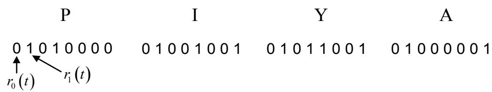

16-ary system: M = 16, k = 4  
  
รูปที่ 5.2: ตัวอย่างการแปลงอักขระแต่ละตัวให้อยู่ในรูปรหัสแอสดี (ASCI1)

ข้อมูลที่ส่งผ่านไปยังช่องสัญญาณจะมีความเร็วมากน้อยเพียงใด สามารถดูได้จาก "อัตราส่งข้อมูล (data rate)" R ซึ่งนิยามโดย

$$
R = { \frac { \log _ { 2 } ( M ) } { T } } = { \frac { k } { T } }\tag{5.1}
$$

มีหน่วยเป็นบิตต่อวินาที (bps: bit per second) เมื่อ $M = 2 ^ { k }$ คือ จำนวนสัญลักษณ์ทั้งหมดที่ใช้ใน การส่งข้อมูล, k คือ จำนวนบิตที่ใช้แทนหนึ่งสัญลักษณ์, และ b $T$ คือ คาบเวลาของหนึ่งสัญลักษณ์ (k บิต) มีหน่วยเป็นวินาที่ ข้อมูลที่ส่งผ่านช่องสัญญาณสื่อสารจะได้รับผลกระทบต่างๆ อันเนื่องมาจาก สัญญาณรบกวน (noise), การแทรกสอดระหว่างสัญลักษณ์(IS: intersymbol interference), และ แบนด์วิดท์ที่จำกัดของช่องสัญญาณ เป็นต้น ทำให้สัญญาณที่วงจรภาครับได้รับ $p ( t )$ มีรูปร่างผิดเพี้ยน ไปจากสัญญาณที่ส่ง ซ ๗ $r _ { i } ( t )$ จากนั้น ที่วงจรภาครับ สัญญาณ $p ( t )$ จะถูกทำการแยกสัญญาณ (demodulation) แล้วก็ทำการชักตัวอย่าง (sampling) เพือแปลงสัญญาณแอนะล็อกให้เป็นลำดับข้อมูลดิจิทัล $\left\{ y _ { k } \right\}$ ก่อนที่จะส่งไปยังวงจรตรวจหา เพื่อตัดสินใจหาค่าประมาณของข้อมูลสัญลักษณ์ $m _ { i }$ (นั่นคือ หา ค่า $\hat { m } _ { i } )$ หลังจากนั้น ก็ทำการจัดรูปแบบของข้อมูลสัญลักษณ์ $\hat { m } _ { i }$ ให้อยูในรูปของข่าวสารที่ต้องการ

ตัวอย่างที่ 5.2 กำหนดให้รูปภาพดิจิทัลมีขนาด 800 × 600 จุดภาพ (pixel) เมื่อแต่ละจุดภาพประกอบ ไปด้วยสีแดง, สีเขียว, และสีน้ำเงิน โดยที่ แต่ละสีจะมีระดับค่าสีที่เป็นไปได้ทั้งหมด 64 ระดับ ดังนั้น ถ้าการส่งรูปภาพนี้ด้วยบริการเอ็มเอ็มเอส (MMร) ผ่านทางโทรศัพท์เคลื่อนที่ใช้เวลาทั้งหมด 10 วินาที ซี

วิธีทำ เนื่องจาก แต่ละระดับค่าสีสามารถแทนได้ด้วยข้อมูลจำนวน $k = \log _ { 2 } ( 6 4 ) = 6$ บิต แต่ละ จุดภาพจะใช้จำนวนบิตทั้งหมด $3 \times 6 = 1 8$ บิต เพราะฉะนั้น รูปภาพดิจิทัลนี้จะใช้จำนวนบิตทั้งหมด รู 800 × 600 × 18 = 8640000 บิต ดังนั้น อัตราส่งข้อมูลของรูปภาพนี้หาได้จากสมการ (5.1) นั้นคือ

$$
R = { \frac { 8 6 4 0 0 0 0 } { 1 0 } } = 8 6 4 0 0 0
$$

บิตต่อวินาที หรือ 864 กิโลบิตต่อวินาที (kbps: kilobit per second)

## 5.1.3 ความจุช่องสัญญาณ

โดยทั่วไป อัตราส่งข้อมูล R จะ ถูกจำกัดโดย พารามิเตอร์ (parameter) ต่างๆ เช่น กำลัง เฉลี่ยของ สัญญาณที่ส่ง, ความผิดเพี้ยน (distortion) และการรบกวน (disturbance) ของช่องสัญญาณ, กำลัง เฉลี่ยของสัญญาณรบกวน, ความน่าจะเป็นของ ข้อผิดพลาด, และอื่นๆ ในกรณีที่ ช่องสัญญาณไม่มี ความผิดเพี้ยนและ การรบกวน ระบบสามารถส่งข้อมูลได้ด้วย อัตราส่ง ข้อมูลที่ไม่จำกัดโดยปราศจาก ข้อผิดพลาด

นาย Claude Elwood Shannon [41] ได้เสนอวิธีการคำนวณความจุช่องสัญญาณ (channel capacity) C หรืออัตราส่งข้อมูลสูงสุด ของระบบสื่อสาร ดังต่อไปนี้ กำหนดให้ช่องสัญญาณมีแบนด์วิดท์ จำกัดเท่ากับ W และในระบบมีเฉพาะสัญญาณรบกวนเกาส์สี ขาว (white Gaussian ทoise) เท่านั้น ดังนั้น ความจุช่องสัญญาณ C สามารถหาได้จาก [9, 37, 41]

$$
C = W \log _ { 2 } ( 1 + \mathrm { S N R } )\tag{5.2}
$$

มีหน่วยเป็นบิตต่อวินาที่ (bps)

ทฤษฎีบทของแชนนอน (Shannon'ร theorem) ได้กล่าวว่า ในการออกแบบระบบสื่อสารดิจิทัลให้ มีอัตราส่งข้อมูลค่าเท่ากับ R ถ้าระบบสื่อสารใดๆ ที่มี $R < C$ แล้ว ระบบนั้นสามารถที่จะถูกออกแบบ ให้มีอัตราข้อผิดพลาดบิต (BER) ที่วงจรภาครับ มีค่าต่ำเท่าใดก็ได้ (หรือเท่ากับค่าศูนย์ก็ได้) โดยการ ใช้รหัสแก้ไขข้อผิดพลาด (ECC) เข้าช่วย ในทางกลับกัน ถ้า $R > C$ แล้ว จะไม่สามารถที่จะออกแบบ ระบบสื่อสารที่ปราศจากข้อผิดพลาดได้

## 5.1.4 การกล้ำรหัสพัลส์

จากแบบจำลองในรูปที่ 5.1 ในกรณีที่ข่าวสาร เป็นสัญญาณแอนะล็อก เช่น เสียงพูด และ สัญญาณ รูปภาพ เป็นต้น สัญญาณแอนะล็อกจะถูกจัดรูปแบบให้อยู่ในรูปของข้อมูลดิจิทัล โดยผ่าน "กระบวน การกล้ำรหัสพัลส์ (PCM: pulse code modulation)" หรือกระบวนการพีซีเอ็ม (PCM) [9, 38]ซึ่ง ประกอบไปด้วย 3 ขั้นตอน คือ การชักตัวอย่าง (sampling), การแจงหน่วย (quantization), และการ เข้ารหัส (encoding) ดังแสดงในรูปที่ 5.3 โดยที่ แต่ละขั้นตอนมีหลักการทำงานทั่วไป ดังต่อไปนี้

  
รูปที่ 5.3: กระบวนการกล้ำรหัสพัลส์ หรือพีซีเอ็ม (PCM)

## การชักตัวอย่าง

การชัก ตัวอย่าง คือ กระบวนการในการ แปลงสัญญาณ แอนะล็อกไปเป็น "ลำดับตัวเลข (ทนmeric sequence)"หรือ ท่รู้จักกันในชื่อว่า "การแปลงสัญญาณ แอนะ ล็อก เป็นสัญญาณดิจิทัล (analog-todigital conversion)"โดยที่ สมาชิกแต่ละตัวในลำดับตัวเลข จะ ถูกเรียกว่า "แซมเปิล (sample)" ซึ่งมี ค่าเป็นจำนวนจริง ตัวอย่างเช่น ถ้ากำหนดให้ $x ( t )$ คือ สัญญาณแอนะล็อก ข้อมูลแซมเปิลสามารถได้ รับจากการชักตัวอย่างสัญญาณ $x ( t )$ ที่ทุกๆ เวลา $t = k T _ { s }$ เมื่อ k คือ เลขจำนวนเต็ม และ $T _ { s }$ คือ คาบการชักตัวอย่าง (sampling period) โดยที่ แซมเปิลเอาต์พุตที่ได้จากการชักตัวอย่างสามารถเขียน เป็นสมการทางคณิตศาสตร์ได้ ดังนี้

$$
x [ k ] = x ( t ) | _ { t = k T _ { s } } = x ( k T _ { s } )\tag{5.3}
$$

นั่นคือ ข้อมูล x[6] แต่ละตัวจะอยู่างกันเป็นระยะ $T _ { s }$ หน่วย

ในทางปฏิบัติ ความถี่ที่ใช้ในการชักตัวอย่างสัญญาณ หรือที่เรียกว่า ความถี่การชักตัวอย่าง (sampling frequency) $f _ { s } = 1 / T _ { s }$ จะต้องสอดคล้องกับ"ทฤษฎีบทการชักตัวอย่าง (sampling theorem)" ซึ่งจะ ช่วยรับประกันได้ว่า ข้อมูลแซมเปิลที่ได้จากการ ชัก ตัวอย่างจะ มีคุณสมบัติเทียบเท่ากับสัญญาณ แอนะล็อก กล่าวคือ ถ้ากำหนดให้สัญญาณ $x ( t )$ มีความถีสูงสุดเท่ากับ $f _ { \mathrm { m a x } }$ เฮิรตซ์ ดังนั้น ความถี่ การชักตัวอย่างที่สอดคล้องกับทฤษฎีบทการชักตัวอย่าง จะมีค่าเท่ากับ

$$
f _ { s } \geq 2 f _ { \operatorname* { m a x } }\tag{5.4}
$$

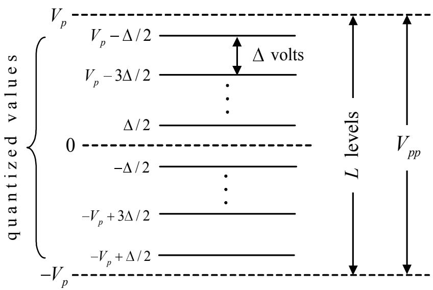  
รูปที่ 5.4: แผนภาพการแบ่งระดับการแจงหน่วยแบบเอกรูป

วงจรอิเล็กทรอนิกส์ที่ใช้ต้องมีความซับซ้อนมากขึ้น และต้องการเรจิสเตอร์ (regiเster) จำนวนมากใน การเก็บค่าของแชมเปิล x[k] เพราะฉะนั้น จึงต้องมีกระบวนการในการประมาณค่าของแชมเปิล x[k] ให้อยู่ในค่าที่จำกัด เพื่อลดความซับซ้อนของวงจรอิเล็กทรอนิกส์ที่ใช้ ซึ่งกระบวนการนี้จะเรียกกันว่า การแจงหน่วย (quantization)

## การแจงหน่วย

การแจงหน่วย คือ การประมาณค่าของแซมเปิล ที่มีค่าเป็นเลขจำนวนจริง ให้เป็นแซมเปิล ที่มีค่าอยู ภายในเซตจำกัด โดยที่ แต่ละ แซมเปิล x[k] จะ ถูกประมาณให้มีค่าเท่ากับค่าของระดับการแจงหน่วย (quantization level) ที่อยูไกล้กับแซมเปิลนันมากทีสุด ซึงข้อมูลเอาต์พุตที่ได้จะเรียกว่า แซมเปิลที่ถูก แจงหน่วย (quantized sample) $x _ { q } [ k ]$ โดยทั่วไป การแจงหน่วยสามารถแบ่งออกเป็น 2 แบบ คือ การ แจงหน่วยแบบเอกรูป (uniform quantization) และการแจงหน่วยแบบไม่เชิงเส้น (nonlinear quantizatioก) กล่าวคือ การแจงหน่วยแบบเอกรูปจะ แบ่งขนาดของสัญญาณออกเป็นหลายๆ ระดับ โดยที แต่ละระดับจะมีขนาด $\Delta$ เท่ากัน ดังแสดงในรูปที่ 5.4 ตัวอย่างเช่น ถ้าใช้ข้อมูล 8 บิด สำหรับแทนค่า แซมเปิล $x _ { q } [ k ]$ หนึ่งแซมเปิล ก็แสดงว่า จะมีระดับการแจงหน่วยทั้งหมด $L = 2 ^ { 8 }$ = 256 ระดับ ดังนั้น ถ้าสัญญาณแอนะล็อกมีแอมพลิจูดอยู่ภายในช่วง $\pm V _ { p }$ โวลต์ (นั่นคือ ขนาดของสัญญาณแอนะล็อก วัดจากจุดสูงสุดถึงจุดต่ำสุด $V _ { p p } = 2 V _ { p } )$ จะได้ว่า $\Delta = 2 V _ { p } / 2 5 6 = V _ { p } /$ 128 โวลต์ ในทางตรงกันข้าม การแจงหน่วยแบบไม่เชิงเส้น จะแบ่งขนาดของสัญญาณออกเป็นหลายๆ ระดับ โดยที่ แต่ละระดับไม่ จำเป็นต้องมีขนาดเท่ากัน

ถ้าขนาดของสัญญาณ x(t) อยูภายในช่วง $\pm V _ { p }$ โวลต์ การแจงหน่วยแบบเอกรูปจะทำให้ได้แซมเปิล เอาต์ีพุด ดังนี้

$$
x _ { q } [ k ] = x [ k ] + e [ k ]\tag{5.5}
$$

เมื่อ $- \Delta / 2 \le e [ k ] \le \Delta / 2$ คือ ข้อผิดพลาดการ แจง หน่วย (quantization error) แต่ถ้าขนาด ของสัญญาณ $x ( t )$ อยู่ภายนอกช่วง $\pm V _ { p }$ โวลต์ จะทำให้ข้อผิดพลาดการแจงหน่วยมีขนาดใหญ่กว่า $\Delta / 2$ ซึ่งจะเป็นสิ่งที่ต้องหลีกเลี่ยงในทางปฏิบัติ ทั้งนี้เป็นเพราะว่า ข้อผิดพลาดการแจงหน่วยจะเปรียบ เสมือนกับสัญญาณรบกวนที่จะไปรบกวนกระบวนการสร้างสัญญาณแอนะล็อก $x ( t )$ ให้กลับคืนมา จากข้อมูลแซมเปิล $x _ { q } [ k ]$ เนื่องจาก ข้อผิดพลาดการแจงหน่วย $e [ k ]$ มีลักษณะการแจกแจงแบบเอกรูป (uniform distribution) ระหว่างค่า $- \Delta / 2$ และ $\Delta / 2$ ดังนั้น ฟังก์ชันความหนาแน่นความน่าจะเป็น (probability density function) ของ e[k]สามารถเขียนได้เป็น

$$
p ( e ) = \frac { 1 } { \Delta }\tag{5.6}
$$

ดังนั้น ค่าเฉลี่ย (mean) ของ $e [ k ]$ สามารถหาได้จาก

$$
\begin{array} { l l l } { { m _ { e } } } & { { = } } & { { E [ e ] } } \\ { { } } & { { = } } & { { \displaystyle \int _ { - \Delta / 2 } ^ { \Delta / 2 } e p ( e ) d e } } \\ { { } } & { { = } } & { { \displaystyle \left. \frac { 1 } { \Delta } \left[ \frac { e ^ { 2 } } { 2 } \right] _ { e = - \Delta / 2 } ^ { \Delta / 2 } \right. } } \\ { { } } & { { = } } & { { 0 } } \end{array}\tag{5.7}
$$

และข้อผิดพลาดกำลังสองเฉลี่ย (MSE: mean-squared error) ของ $e [ k ]$ จะมีค่าเท่ากับ

$$
\begin{array} { r l } { \sigma _ { e } ^ { 2 } } & { = \phantom { - } E \left[ ( \epsilon - m _ { e } ) ^ { 2 } \right] } \\ & { = \phantom { - } E \left[ e ^ { 2 } \right] } \\ & { = \phantom { - } \int _ { - \Delta / 2 } ^ { \Delta / 2 } e ^ { 2 } p ( e ) d e } \\ & { = \phantom { - } \frac { 1 } { \Delta } \left[ \frac { e ^ { 3 } } { 3 } \right] _ { e = - \Delta / 2 } ^ { \Delta / 2 } } \\ & { = \phantom { - } \frac { 1 } { \Delta } \left[ \frac { ( \Delta ^ { 3 } ) - ( - \Delta ^ { 3 } ) } { 3 ( 4 ) } \right] } \\ & { = \phantom { - } \frac { \Delta ^ { 2 } } { 1 2 } } \end{array}\tag{5.8}
$$

โดยที่ $\sigma _ { e } ^ { 2 }$ ก็คือ ค่ากำลังเฉลี่ยของสัญญาณรบกวนการแจงหน่วย (quantization ทnoise) นั่นเอง

ในการวัดระดับการเสื่อม (degradation) ของสัญญาณที่เป็นผลเนื่องมาจาก ข้อผิดพลาดการ แจง หน่วยจะใช้พารามิเตอร์ "อัตราส่วนค่ากำลังเฉลี่ยของสัญญาณที่ต้องการต่อค่ากำลังเฉลี่ยของสัญญาณ รบกวนการแจงหน่วย (รQNR: signal-to-quantization noise ratio)" ซึ่งนิยามโดย

$$
\mathrm { S Q N R } = 1 0 \log _ { 1 0 } { \left( { \frac { \mathrm { s i g n a l ~ p o w e r } } { \mathrm { q u a n t i z a t i o n ~ n o i s e ~ p o w e r } } } \right) }\tag{5.9}
$$

มีหน่วยเป็นเดซิเบล (dB: decibel)

ตัวอย่างที่ 5.3 กำหนดให้สัญญาณรูปคลื่นไซนูซอยด์ $x ( t ) = A \sin ( 2 \pi f t )$ เมื่อ A คือ แอมพลิจูด ของสัญญาณ และวงจรแจงหน่วย (qนลทtizer) แบบ m บิต (นั่นคือ หนึ่งแซมเปิลจะ ถูกแทนด้วย ข้อมูล m บิต) ถูกนำมาใช้งาน จงพิสูจน์ว่า

$$
\mathrm { S Q N R } \approx 1 . 8 + 6 m \ \mathrm { ( d B ) }
$$

วิธีทำ เนื่องจาก สัญญาณ $x ( t )$ เป็นสัญญาณเป็นคาบที่มีคาบเวลาเท่ากับ $T _ { 0 }$ ดังนั้น กำลังเฉลี่ย

ของสัญญาณรูปคลื่นไซนูซอยด์ หาได้จาก (ดูหัวข้อที่ 21.4)

$$
{ \begin{array} { l l l } { P } & { = } & { { \displaystyle { \frac { 1 } { T _ { 0 } } } \int _ { 0 } ^ { T _ { 0 } } | A \sin ( 2 \pi f t ) | ^ { 2 } d t } } \\ { \displaystyle } & { = } & { { \displaystyle A ^ { 2 } { \frac { 1 } { T _ { 0 } } } \int _ { 0 } ^ { T _ { 0 } } \{ 1 - \cos ( 4 \pi f t ) \} d t } } \\ { \displaystyle } & { = } & { { \displaystyle { \frac { A ^ { 2 } } { 2 } } } } \end{array} }
$$

และเนื่องจาก สัญญาณ $x ( t )$ มีขนาดของสัญญาณอยู่ภายในช่วง $- A$ ถึง A ถ้ากำหนดให้วงจรแจง หน่วยใช้ระดับการแจงหน่วยเท่ากับ L ระดับ จะได้ว่า ขนาดของการแจงหน่วย จะมีค่าเท่ากับ

$$
\Delta = { \frac { 2 A } { L } }
$$

ดังนั้น ค่ากำลังเฉลี่ยของสัญญาณรบกวนการแจงหน่วย สามารถหาได้จากสมการ (5.8) นั่นคือ

$$
\sigma _ { e } ^ { 2 } = { \frac { \Delta ^ { 2 } } { 1 2 } } = { \frac { 4 ( A ^ { 2 } / L ^ { 2 } ) } { 1 2 } } = { \frac { A ^ { 2 } } { 3 L ^ { 2 } } }
$$

เพราะฉะนั้น SONR จะมีค่าเท่ากับ

$$
{ \begin{array} { r c l } { \operatorname { S Q N R } } & { = } & { 1 0 \log _ { 1 0 } \left( { \frac { A ^ { 2 } / 2 } { A ^ { 2 } / ( 3 L ^ { 2 } ) } } \right) } \\ & & { = } & { 1 0 \log _ { 1 0 } \left( { \frac { 3 L ^ { 2 } } { 2 } } \right) } \\ & & { = } & { 1 . 8 + 2 0 \log _ { 1 0 } ( L ) } \end{array} }
$$

เนื่องจาก วงจรแจงหน่วยแบบ m บิต จะมีจำนวนของระดับการแจงหน่วยเท่ากับ $L = 2 ^ { m }$ ดังนั้น ถ้า แทนค่า L เข้าไปในสมการ จะได้ว่า

$$
\mathrm { S Q N R } = 1 . 8 + 2 0 \log _ { 1 0 } ( 2 ^ { m } ) \approx 1 . 8 + 6 m
$$

ในทางปฏิบัติ วงจรแจงหน่วยแบบเอกรูป (uniform qนลantizer) จะให้ค่า รQNR มาก ก็ต่อเมื่อ สัญญาณอินพุต มีฟังก์ชันความหนาแน่นความน่าจะเป็นแบบเอกรูป แต่ถ้าสัญญาณอินพุตมีฟังก์ชัน ความหนาแน่นความน่าจะเป็นแบบอื่นๆ วงจรแจงหน่วยแบบเอกรูปจะให้ค่า รQNR มากก็ต่อเมื่อ วงจรแจงหน่วยใช้ระดับการแจงหน่วยที่มีขนาดเล็กสำหรับบริเวณที่สัญญาณมีแอมพลิจูดน้อย (weak signal) และใช้ระดับการ แจงหน่วยที่มีขนาดใหญ่สำหรับบริเวณที่สัญญาณมีแอมพลิจูดมาก (strong sigกลl)วงจรแจงหน่วยที่มีขนาดของระดับการแจงหน่วยแต่ละระดับไม่เท่ากันนี้ จะ เรียกกันว่า วงจร แจงหน่วยแบบไม่เชิงเส้น (nonliทear quantizer) รูปที่ 5.5 แสดงตัวอย่างลักษณะการทำงานของวงจร แจงหน่วยแบบเอกรูป และวงจรแจงหน่วยแบบไม่เชิงเส้น โดยทั่วไป วงจรแจงหน่วยแบบไม่เชิงเส้นจะ ช่วยลดความผิดเพี้ยนของสัญญาณโดยรวมได้ และประสิทธิภาพรวมที่ได้จะดีกว่าวงจรแจงหน่วยแบบ เอกรูป สำหรับรายละเอียดเพิ่มเติมของวงจรแจงหน่วย ผู้สนใจสามารถศึกษาเพิ่มเติมได้จาก [9, 38]

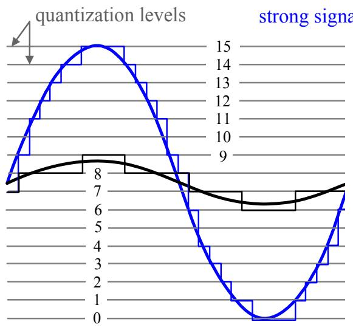  
(a) uniform quantizer

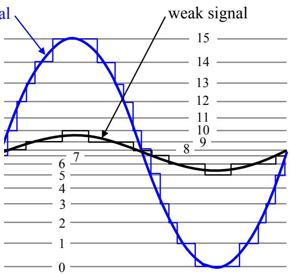  
(b) nonlinear quantizer  
รูปที่ 5.5: ตัวอย่างลักษณะการทำงานของวงจรแจงหน่วย (a) แบบเอกรูป และ (b) แบบไม่เชิงเส้น

## การเข้ารหัส

หลังจากผ่านขันตอนการแจงหน่วยแล้ว แซมเปิลที่ถูกแจงหน่วย $x _ { q } [ k ]$ แต่ละ แซมเปิลจะ ถูกนำไป เข้ารหัส เพื่อ แปลงให้เป็นข้อมูล บิต โดยที่ แซมเปิลหนึ่งแซมเปิลจะ ถูกแทนด้วยข้อมูลจำนวน $k \mathbf { \Psi } =$ $\log _ { 2 } ( L )$ บิต เมื่อ L คือ ระดับการแจงหน่วยที่ใช้ในวงจรแจงหน่วย ข้อมูลบิตทั้งหมดจะเรียกกันว่า

  
รูปที่ 5.6: แผนภาพกระบวนการกล้ำรหัสพัลส์ (PCM)

"ลำดับ PCM (PCM sequence)" ถ้าความถี่ที่ใช้ในการชักตัวอย่าง คือ $f _ { s }$ เฮิรตซ์ต่อวินาที (หรือ $f _ { s }$ แซมเปิลต่อวินาที) จะได้ว่า อัตราบิต (bit rate) $R _ { b }$ หรืออัตราส่งข้อมูลของลำดับ PCM จะมีค่าเท่ากับ

$$
R _ { b } = { \frac { 1 } { T _ { b } } } = k f _ { s }\tag{5.10}
$$

มีหน่วยเป็นบิตต่อวินาที (bps) เมื่อ $T _ { b }$ คือ คาบเวลาของบิด และ k คือ จำนวนบิตที่ใช้แทนข้อมูล หนึ่งแชมเปิล รูปที่ 5.6 แสดงตัวอย่างลักษณะการทำงานของกระบวนการ PCM

ตัวอย่างที่ 5.4 ในระบบโทรศัพท์ สัญญาณเสียงพูดจะ ถูกทำการชักการตัวอย่างด้วยความถี่การชัก ตัวอย่าง 8000 เฮิรตซ์ต่อวินาที และระบบจะใช้วงจรแจงหน่วยแบบ 7 บิตต่อแซมเปิล ดังนัน อัตราบิต ของลำดับ PCM ในช่องสัญญาณโทรศัพท์จะมีค่าเท่ากับ 8000 × 7 = 56000 บิตต่อวินาที

## 5.1.บทนำ

ขั้นตอนต่อมา คือ ลำดับ PCM ที่ได้ก็จะ ถูกนำไปกล้ำสัญญาณกับสัญญาณพัลส์เพื่อแปลงให้เป็น สัญญาณรูปคลื่น PCM (PCM waveform) ซึ่งขั้นตอนนี้ จะเรียกกันทั่วไปว่า "ไลน์โค้ด (line code)" ในทางปฏิบัติ สัญญาณรูปคลื่น PCM มีหลายรูปแบบ เช่น NRZ (non-return-to-zero), NRZI (nonreturn-to-zero interleaved), Manshester, และ อืนๆ [9] ซึ่ง แต่ละรูปแบบก็มี ข้อดี และ ข้อเสียต่าง กัน โดยจะ ขึ้นอยู่กับลักษณะ ของงานประยุกต์ที่ใช้ โดยทั่วไป เกณฑ์ที่ใช้ในการตัดสินใจว่าจะ เลือก สัญญาณรูปคลื่น PCM แบบใดมาใช้งาน ให้พิจารณาจาก [9]

•ลักษณะของสเปกตรัมของสัญญาณ จะช่วยบอกให้ทราบถึงความหนาแน่นสเปกตรัมกำลังและ แบนด์วิดท์

ความสามารถในการเข้าจังหวะของบิต

ความสามารถในการตรวจหาข้อผิดพลาด

•ความทนทานต่อการแทรกสอดและสัญญาณรบกวน

•ค่าใช้จ่ายและความซับซ้อนในการสร้างวงจร

สำหรับในระบบการประมวลผลสัญญาณของฮาร์ดดิสก์ไดรฟ์ รูปแบบของสัญญาณรูปคลื่นที่นิยมใช้ งาน คือ แบบ NRZ และแบบ NRZI (ศึกษารายละเอียดได้ในหัวข้อที่ 6.2.6)

ตัวอย่างที่ 5.5 การส่งสัญญาณเสียงในรูป PCM ด้วยอัตราบิต Rb = 36000 บิตต่อวินาที จงหา ความถีการชักตัวอย่างที่เป็นไปได้, จำนวนระดับของการแจงหน่วย, และจำนวนบิตต่อการชักตัวอย่าง หนึ่งครั้ง โดยกำหนดให้สัญญาณเสียงที่จะทำการชักตัวอย่างมีความถี่สูงสุดเท่ากับ 3200 เฮิรตซ์

วิธีทำ จากทฤษฎีบทการชักตัวอย่าง ความถีการชักตัวอย่างจะต้องมีค่าเท่ากับ

$$
f _ { s } \geq 2 f _ { \operatorname* { m a x } } = 2 ( 3 2 0 0 ) = 6 4 0 0 ~ \mathrm { H z }
$$

ถ้ากำหนดให้ k คือ จำนวนบิตต่อการชักตัวอย่างหนึ่งครั้ง จะได้ว่า

$$
k f _ { s } \leq R _ { b } = 3 6 0 0 0 ~ \mathrm { { b p s } }
$$

ดังนั้น ความถี่การชักตัวอย่างจริงและจำนวนบิตต่อการชักตัวอย่างหนึ่งครั้ง สามารถหาได้จาก

$$
k \leq \frac { R _ { b } } { f _ { s } } = \frac { 3 6 0 0 0 } { 6 4 0 0 } = 5 . 6
$$

สมมุติว่า ระบบใช้ $k = 5$ บิตต่อการชักตัวอย่างหนึงครั้ง เพราะฉะนั้น จำนวนระดับของการแจงหน่วย h จะมีค่าเท่ากับ

$$
L = 2 ^ { k } = 2 ^ { 5 } = 3 2
$$

และความถี่การชักตัวอย่างเพื่อให้ได้ 5 บิตต่อการชักตัวอย่างหนึ่งครั้ง คือ ด นท

$$
f _ { s } = { \frac { 3 6 0 0 0 } { 5 } } = 7 2 0 0 ~ \mathrm { { \ H z } }
$$

## 5.1.5 การกล้ำแอมพลิจูดของพัลส์

9 การกลำแอมพลิจูดของพัลส์ (PAM: pulse amplitนde modulation) เป็นวิธีการผสมสัญญาณระหว่าง ข้อมูล ดิจิทัลกับสัญญาณ พัลส์ โดยผลลัพธ์ ที่ได้จะ เป็นสัญญาณ แอนะล็อก ที่เรียกกันว่า "สัญญาณ PAM (PAM sigทal)" ซึ่งมีรูปสมการทางคณิตศาสตร์ ดังนี้

$$
r ( t ) = \sum _ { k = 0 } ^ { \infty } a _ { k } g ( t - k T )\tag{5.11}
$$

เมื่อ $a _ { k } \in { \mathcal { A } }$ คือ ข้อมูลดิจิทัลที่เป็นสมาชิกของเซต A, A คือ เซตของข้อมูลที่เป็นไปได้ทั้งหมด, $g ( t )$ Q   
คือ สัญญาณพัลส์ที่จะทำการกล้ำสัญญาณ, t คือ เวลา, และ T คือ คาบเวลาของ $a _ { k }$ สำหรับในระบบ   
การประมวลผลสัญญาณของฮาร์ดดิสก์ไดรฟ์ จะเกี่ยวข้องเฉพาะระบบไบนารี (binary รystem) ดังนั้น   
$| { \mathcal { A } } | = 2$ โดยที่ $\mathcal { A } = \{ 0 , 1 \}$ หรือ $\mathcal { A } = \{ - 1 , 1 \}$ ก็ได้

รูปที่ 5.7 แสดงตัวอย่างการกล้ำแอมพลิจูดของพัลส์ สมมุติให้สัญญาณพัลส์

$$
g ( t ) = A \frac { t } { T } \{ u ( t ) - u ( t - T ) \}
$$

เมื่อ $u ( t )$ คือ ฟังก์ชันขั้นหนึ่งหน่วย, A คือ ค่าคงดตัว, และลำดับข้อมูล $\left\{ a _ { k } \right\} = \left\{ 1 , - 1 , 1 , - 1 , - 1 , 1 \right\}$ จะได้ว่า สัญญาณ r(t) มีรูปร่าง ตามที่แสดงในรูปที่ 5.7 ซึ่งในกรณีนี้ จะ พบว่า จากรูปร่างของ

  
รูปที่ 5.7: ตัวอย่างการกล้ำแอมพลิจูดของพัลส์

สัญญาณ PAM สามารถที่จะบอกได้ทันที่ว่า ข้อมูลบิต -1 หรือบิต 1 ถูกส่งออกมา ณ ช่วงเวลา r(t) ที่ได้ไม่มีความผิดเพี้ยนเกิดขึ้น

## 5.1.6สัญญาณรบกวน

สัญญาณรบกวน (ทoiรe) เป็นสัญญาณที่ระบบไม่ต้องการ เพราะว่า สัญญาณรบกวนจะไปขัดขวาง ความสามารถของวงจรภาครับในการที่จะตรวจหาและถอดรหัส ข้อมูล ดังนั้น ถ้าในระบบมีสัญญาณ รบกวนมาก ข้อผิดพลาดที่เกิดขึ้นที่วงจรภาครับก็จะมาก สัญญาณรบกวนทีพบในระบบสือสารมีหลาย ประเภท สำหรับในหัวข้อนี้จะ กล่าวถึงเฉพาะ สัญญาณรบกวนสีขาว (พhite ทoiรe) และ สัญญาณ รบกวนแบบสี (coโored ทoiรอ) ซึ่งพบมากในระบบการประมวลผลสัญญาณของฮาร์ดดิสก์ไดรฟ์

## สัญญาณรบกวนสีขาว

พิจารณาระบบที่ไม่ต่อเนื่องทางเวลา (discrete-time system) สัญญาณรบกวนสีขาว หมายถึง ลำดับ ของตัวแปรสุ่ม $\{ n _ { k } \}$ ที่ไม่มีสหสัมพันธ์กัน (uncorrelated) และมีฟังก์ชันอัตสหสัมพันธ์เท่ากับ [35]

$$
R _ { n n } ( k ) = \frac { N _ { 0 } } { 2 } \delta [ k ] = \left\{ \begin{array} { l l } { { N _ { 0 } / 2 , } } & { { k = 0 } } \\ { { 0 , } } & { { \mathrm { e l s e } } } \end{array} \right.\tag{5.12}
$$

เมื่อ $N _ { 0 } / 2$ คือ ความหนาแน่นสเปกตรัมกำลังแบบสองด้าน (two-sided power spectrum density) ของสัญญาณรบกวน มีหน่วยเป็น วัตต์ต่อเฮิรตซ์, และ $\delta [ k ]$ คือ ฟังก์ชันโครเนคเกอร์เดลตา ซึ่งมีผล การแปลงฟูเรียร์ คือ

$$
G _ { n } ( e ^ { j \omega } ) = \mathscr { F } [ R _ { n n } ( k ) ] = \sum _ { k = - \infty } ^ { \infty } R _ { n n } ( k ) e ^ { - j \omega k } = \frac { N _ { 0 } } { 2 }\tag{5.13}
$$

เมื่อ $G _ { n } ( e ^ { j \omega } )$ คือความหนาแน่นสเปกตรัมกำลังของ $n _ { k }$ และ $\omega = 2 \pi f$ คือ ความถี่เชิงมุม มี หน่วยเป็นเรเดียน (radian) สมการ (5.13) แสดงให้เห็นว่า $G _ { n } ( e ^ { j \omega } )$ จะไม่ขึ้นอยู่กับความถี่นั่นคือ $G _ { n } ( e ^ { j \omega } ) = N _ { 0 } / 2$ สำหรับทุกค่า $- \infty < f < \infty$ ซึ่งหมายความว่า สัญญาณรบกวนสี ขาวจะ มี ผลกระทบต่อระบบสือสารในทุกแถบความถี่ และกำลังของสัญญาณรบกวน $n _ { k }$ จะมีค่าเป็นค่าอนันต์ ดังนั้น จึงเป็น เหตุผลหนึ่งที่อธิบายว่า ทำไมวงจรภาครับของระบบสื่อสารจึงต้องนำวงจรกรองผ่าน $\stackrel { \circ } { \boldsymbol { \mathfrak { O } } } \boldsymbol { 1 }$ (low-pass filter) มาใช้งาน เพื่อที่จะทำให้กำลังของสัญญาณรบกวนมีค่าจำกัด โดยจะไม่ยอมให้ สัญญาณรบกวนที่อยู่นอกแถบความถี่ตัด (cut-off frequency) ผ่านเข้ามาในระบบ ถึงแม้ว่า สัญญาณ รบกวนสีขาวจะเกิดขึ้นเสมอในระบบสื่อสาร แต่เนืองจากสัญญาณรบกวนสีขาวมีค่าทางสถิติที่แน่นอน ตายตัว เพราะฉะนัน สัญญาณรบกวนสีขาวจึงง่ายต่อการจัดการ

e เนืองจาก สัญญาณรบกวนสี ขาวถูกนิยามเพียงสมการ (5.12) ดังนั้น ลำดับของตัวแปรสุ่มแบบ เกาส์เซียนที่ไม่มีสหสัมพันธ์กันและเป็นค่าจริง จะถือว่าเป็นกระบวนการสัญญาณรบกวนสีขาว (white noise process) ประเภทหนึ่ง ซึ่งเรียกกันทั่วไปว่า "สัญญาณรบกวนเกาส์สี ขาว (พhite Gaussian noise)" โดยมีฟังก์ชันความหนาแน่นความน่าจะเป็นแบบเกาส์เซียน ตามสมการ (4.28) ตัวอย่างของ สัญญาณรบกวนเกาส์สีขาว เช่น สัญญาณรบกวนความร้อน (thermal กoise) เป็นต้น

## สัญญาณรบกวนแบบสี

สัญญาณรบกวนแบบสี คือ สัญญาณรบกวนใดๆ ที่ไม่มีลักษณะเป็นสัญญาณรบกวนสีขาว คุณสมบัติ ที่สำคัญ ของสัญญาณรบกวนแบบสีคือ แซมเปิลแต่ละแซมเปิลจะมีสหสัมพันธ์กัน (correโลtioก) ถ้า กำหนดให้ $w _ { k }$ เป็นสัญญาณรบกวนแบบสี จะได้ว่า ฟังก์ชันอัตสหสัมพันธ์ของ $w _ { k }$ คือ

$$
R _ { w w } ( k ) \neq 0 , ~ \mathrm { f o r } ~ k \neq 0\tag{5.14}
$$

ประโยชน์ของการที่แซมเปิลแต่ละแซมเปิลมีสหสัมพันธ์กันมีหลายอย่าง เช่น ช่วยในการทำนายค่าของ แซมเปิลในอนาคต หรือช่วยในการหาผลตอบสนองของระบบ เป็นต้น ตามที่อธิบายในหัวข้อที่ 2.7.3

สัญญาณรบกวนแบบสีจะ พบมากในระบบการประมวลผลสัญญาณของฮาร์ดดิสก์ไดรฟ์ เพราะว่า สัญญาณรบกวนสีขาวเมื่อถูกส่งเข้าไปในวงจรกรองใดๆ เช่น อีควอไลเซอร์ เป็นต้น ผลลัพธ์ที่ได้จะ QJ กลายเป็นสัญญาณรบกวนแบบสี โดยจะ มีสเปกตรัมคล้ายกับสเปกตรัมของวงจรกรองนั้น เนืองจาก สัญญาณรบกวนแบบสีจะส่งผลกระทบมากต่อการทำงานของวงจรตรวจหาข้อมูล ดังนั้น ในทางปฏิบัติ นักวิจัยจึงได้เสนอวิธีการมากมายที่ใช้ในการจัดการกับสัญญาณรบกวน แบบสี ตัวอย่าง เช่น การใช้ วงจรทำนายสัญญาณรบกวน (ทoise predictor)ึ่งมีใช้อยูในวงจรภาครับของฮาร์ดดิสก์ไดรฟ์บางรุ่น ที่รู้จักกันในชื่อของ "วงจรตรวจหา NPML (noise-predictive maximum-likelihood)" ตามที่อธิบาย รายละเอียดในบทที่ 6 ของหนังสือ "การประมวลผลสัญญาณสำหรับการจัดเก็บข้อมูลดิจิทัล เล่ม 2 : การออกแบบวงจรภาครับ" [6]

## 5.1.7 การส่งสัญญาณที่ไม่มีความผิดเพี้ยน

การส่งสัญญาณที่ไม่มีความผิดเพี้ยน (distortionless transmission) จะ เกิดขึ้น ก็ต่อเมื่อ สัญญาณ เอาต์พุตของช่องสัญญาณที่ได้ยังคงมี "รูปร่าง (รhaลpe)" เหมือนกับสัญญาณอินพุต แต่แอมพลิจูดของ สัญญาณเอาต์พุตอาจจะถูกเปลี่ยนแปลงหรือมีการหน่วงเวลาเกิดขึ้นก็ได้ [39] โดยทั่วไป ช่องสัญญาณ ของระบบสื่อสาร เช่น ระบบโทรศัพท์ และระบบสื่อสารแบบไร้สาย เป็นต้น สามารถที่จะถูกพิจารณา ว่าเป็น วงจรกรองแบบเชิง เส้นที่มีแถบความถีจำกัด (band-limited linear filter)ที่มีผลตอบสนอง อิมพัลส์ $g ( t )$ และผลตอบสนองเชิงความถี่ คือ

$$
G ( f ) = | G ( f ) | \angle G ( f )\tag{5.15}
$$

เมื่อ $| G ( f ) |$ คือ สเปกตรัมเชิงแอมพลิจูดของ $G ( f )$ และ $\angle G ( f )$ คือ สเปกตรัมเชิงเฟสของ $G ( f )$ ดังนั้น สามารถ ที่จะสรุปว่า ช่องสัญญาณนี้จะไม่ก่อให้เกิดความผิดเพี้ยน ก็ต่อเมื่อ ช่องสัญญาณมี สเปกตรัมเชิงแอมพลิจูดคงที และมีสเปกตรัมเชิงเฟสแบบเชิงเส้น กล่าวคือ

$$
\begin{array} { r c l } { | G ( f ) | } & { = } & { | K | } \end{array}\tag{5.16}
$$

$$
\angle G ( f ) = - 2 \pi t _ { d } f \pm m 1 8 0 ^ { \mathrm { o } }\tag{5.17}
$$

เมื่อ K และ $m$ คือ ค่าคงตัวใดๆ และ $t _ { d }$ คือ ปริมาณของการหน่วงเวลา

โดยทั่วไป ระบบสื่อสารมักจะเผชิญกับความผิดเพี้ยนระหว่างการรับส่งสัญญาณ ซึ่งความผิดเพี้ยน

1) ความผิดเพียนแบบเชิงเส้น (linear distortion) จะแบ่งออกเป็น

1.1) ความผิดเพียนเชิงแอมพลิจูด (amplitนde distortion) จะเกิดขึ้นเมื่อ $\vert G ( f ) \vert \neq \vert K \vert$

1.2) ความผิดเพียนเชิงเฟส (phase distortion) จะ เกิดขึนเมื่อ ซี $\angle G ( f ) \ne - 2 \pi t _ { d } f \pm m 1 8 0 ^ { \mathrm { o } }$

2) ความผิดเพี้ยนแบบไม่เชิงเส้น (nonlinear distortion) จะ เกิดขึ้นเมื่อ มีอุปกรณ์หรือชึ้นส่วน อิเล็กทรอนิกส์ที่มีคุณสมบัติไม่เป็นเชิงเส้นอยู่ในระบบ

ในทางปฏิบัติ ผลกระทบที่เกิดจากความผิดเพี้ยนแบบเชิงเส้นสามารถที่จะแก้ไขหรือบรรเทาให้ลดน้อย ลงได้ โดยใช้อีควอไลเซอร์ (equalizer) ซึ่งจะอธิบายต่อไปในหัวข้อที่ 5.6 ในขณะที่ จะต้องใช้เทคนิค ขั้นสูงในการจัดการกับความผิดเพี้ยนเชิงแบบไม่เชิงเส้น [39]

ตัวอย่างที่ 5.6 พิจารณาระบบการส่งสัญญาณแอนะล็อกแถบความถี่ฐานที่ไม่มีความผิดเพี้ยน และ ในระบบมีสัญญาณรบกวนสี ขาว $n ( t )$ ที่มีความหนาแน่นสเปกตรัมกำลังแบบสองด้าน $N _ { 0 } / 2$ เมื่อ $N _ { 0 } = 1 0 ^ { - 9 }$ วัตต์ต่อเฮิรตซ์ สัญญาณที่ส่งไปในระบบ คือ สัญญาณเสียงที่มีแบนด์วิดท์ 4000 เฮิรตซ์ โดยที่ วงจรภาครับใช้วงจรกรองผ่านต่ำที่มีความถี่ตัดเท่ากับ 8000 เฮิรตซ์ เพื่อกำจัดสัญญาณรบกวน ให้ลดน้อยลง ถ้ากำหนดให้ผลตอบสนองเชิงความถี่ของวงจรกรองผ่านต่ำ คือ

$$
H _ { L P } ( \omega ) = \frac { 1 } { 1 + j ( \omega / \omega _ { 0 } ) }
$$

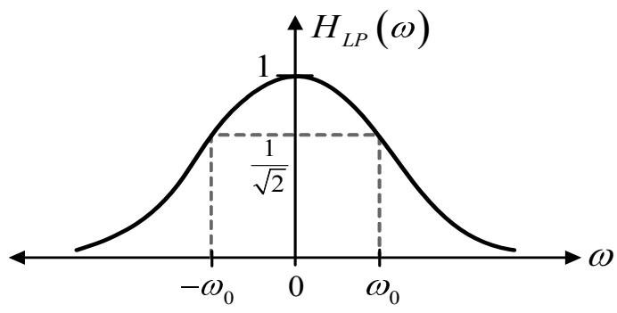  
รูปที่ 5.8: ผลตอบสนองเชิงความถี่ของวงจรกรองผ่านต่ำ

เมื่อ $\omega _ { 0 } = 2 \pi ( 8 0 0 0 )$ เรเดียน ดังแสดงในรูปที่ 5.8 จงคำนวณหากำลังของสัญญาณรบกวนที่ด้าน ขาออกของวงจรกรองผ่านตำนี้

วิธี ทำ กำลังของของสัญญาณรบกวนที่ด้านขาออก ของวงจรกรองผ่านต่ำ หาได้จากสมการ (4.56) นั่นคือ

$$
\begin{array} { r c l } { P _ { n } } & { = } & { E [ n ^ { 2 } ( t ) ] } \\ & { = } & { \displaystyle \frac { 1 } { 2 \pi } \int _ { - \infty } ^ { \infty } \frac { N _ { 0 } } { 2 } | H _ { L P } ( \omega ) | ^ { 2 } d \omega } \\ & { = } & { \displaystyle \frac { N _ { 0 } } { 2 } \frac { 1 } { 2 \pi } \int _ { - \infty } ^ { \infty } \frac { 1 } { 1 + ( \omega / \omega _ { 0 } ) ^ { 2 } } d \omega } \\ & { = } & { \displaystyle \frac { N _ { 0 } } { 2 } \omega _ { 0 } } \\ & { = } & { \displaystyle \frac { 1 0 ^ { - 9 } } { 2 } \times 2 \pi ( 8 0 0 0 ) } \\ & { = } & { \displaystyle 2 5 . 1 3 2 \times 1 0 ^ { - 6 } \mathrm { ~ W ~ } } \end{array}
$$

ดังนั้น กำลังของของสัญญาณรบกวนที่ด้านขาออกของวงจรกรองผ่านต่ำมีค่าเท่ากับ $2 5 . 1 3 2 \times 1 0 ^ { - 6 }$ วัตต์

  
รูปที่ 5.9: แบบจำลองระบบสื่อสารสำหรับการตรวจหาข้อมูลในสัญญาณรบกวนเกาส์สีขาว

## 5.2 การตรวจหาข้อมูลในสัญญาณรบกวนเกาส์สีขาวแบบบวก

ในหัวข้อนี้จะแสดงขั้นตอนการตรวจหาข้อมูล (data detection) ในระบบสื่อสารที่มีแต่สัญญาณรบกวน เกาส์สี ขาวแบบบวก (AwGN: additive white Gaussian noise) ดังแสดงในรูปที่5.9 เมื่อ $a _ { k } ~ \in$ $\{ a _ { 0 } , a _ { 1 } \}$ คือ ข้อมูลอินพุตบิตที่มี คาบเวลาของบิตเท่ากับ T, $\{ a _ { 0 } , a _ { 1 } \}$ มีค่าเท่ากับ {0, 1} หรือ $\{ - 1 , 1 \}$ ,และ $g _ { t } ( t )$ คือ สัญญาณพัลส์ที่ จะ ทำการกล้ำสัญญาณ (หรืออาจจะ พิจารณาว่าเป็น ผล ตอบสนองอิมพัลส์ของช่องสัญญาณ) ที่มีค่าเฉพาะ ช่วงเวลา $0 \leq t \leq T$ นั่นคือไม่ก่อให้เกิดการ e แทรกสอดระหว่างสัญลักษณ์ (Iร1) เพราะฉะนั้น สัญญาณที่วงจรภาครับได้รับ คือ

$$
p ( t ) = r ( t ) + n ( t )\tag{5.18}
$$

ซื   
เมื่อ $\begin{array} { r } { r ( t ) = \sum _ { k } a _ { k } g _ { t } ( t - k T ) } \end{array}$ คือ สัญญาณพัลส์ของข้อมูลที่จะส่ง, และ $n ( t )$ คือ สัญญาณรบกวน เกาส์สีขาวแบบบวกที่มีค่าเฉลี่ยเท่ากับค่าศูนย์และค่าความหนาแน่นสเปกตรัมกำลังแบบสองด้านเท่า กับ $N _ { 0 } / 2$ จากนั้น สัญญาณ $p ( t )$ ก็จะถูกส่งผ่านไปยังวงจรกรองที่มีผลตอบสนองอิมพัลส์ $g _ { r } ( t )$ และ ถูกทำการชักตัวอย่างที่เวลา $t = k T$ เมื่อ k เป็นเลขจำนวนเต็ม ข้อมูลแซมเปิลที่ได้ $y _ { k }$ จากวงจรชัก ตัวอย่างก็จะถูกส่งไปยัง วงจรตรวจหาขีดเริ่มเปลี่ยน (threshold detector) เพื่อ ทำการถอดรหัส ข้อมูล $a _ { k }$ นั่นคือ หาค่า $\hat { a } _ { k }$

## 5.2.1วงจรกรองเหมาะสุด

วงจรกรองเหมาะ สุด (matched filter) คือ วงจรกรองภาครับ (receiving filter) แบบเชิงเส้นที่ถูก ออกแบบให้เหมาะสมกับรูปคลื่น (พaveform) สัญญาณที่ได้รับแต่ละรูปคลื่น เพื่อทำให้ค่า รNR ของ ข้อมูล ที่ด้านขาออก ของวงจรกรอง มีค่ามาก ที่สุด ให้พิจารณากรณีที่สัญญาณ พัลส์ เดี่ยว (iรolated pulse) ถูกส่งออกมาจากวงจรภาคส่ง $( \stackrel {  } { \bigtriangledown } \tilde { \Psi }$ จะสอดคล้องกับข้อมูลบิต $a _ { k }$ เพียงบิตเดียว) นั้นคือ สัญญาณ $r ( t )$ สามารถเขียนเป็นสมการคณิตศาสตร์ได้ ดังนี้

$$
r ( t ) = \left\{ \begin{array} { c c } { { r _ { 0 } ( t ) , } } & { { 0 \leq t \leq T \quad \mathrm { ~ f o r ~ } a _ { k } = a _ { 0 } } } \\ { { { r _ { 1 } ( t ) , } } } & { { 0 \leq t \leq T \quad \mathrm { ~ f o r ~ } a _ { k } = a _ { 1 } } } \end{array} \right.\tag{5.19}
$$

จากแบบจำลองในรูปที่ 5.9 ที่เวลา $t = T$ จะได้ว่า ข้อมูลเอาต์พุตของวงจรชักตัวอย่าง คือ

$$
y ( T ) = a ( T ) + n _ { 0 } ( T )\tag{5.20}
$$

หรือเขียนแบบย่อได้ดังนี้ (เพื่อความสะดวกในการอธิบายเนื้อหาในหัวข้อนี้)

$$
y = a _ { k } + n _ { 0 }\tag{5.21}
$$

เมื่อ $a _ { k } = a ( T )$ คือ องค์ประกอบของสัญญาณที่ต้องการ และ $n _ { 0 } = n _ { 0 } ( T )$ คือ องค์ประกอบของ สัญญาณรบกวน ซึ่งสามารถที่จะ แสดงให้เห็นได้ว่า $n _ { 0 }$ มีลักษณะ เป็นตัวแปรสุ่มแบบเกาส์เซียนที่มี ค่าเฉลี่ยเท่ากับค่าศูนย์ และค่าความแปรปรวน $\sigma ^ { 2 }$ นันคือ $n _ { 0 } \sim \mathcal { N } ( 0 , \sigma ^ { 2 } )$ ดังนั้น ค่า SNR ณ เวลา $t = T$ ที่ด้านขาออกของวงจรชักตัวอย่าง จะมีค่าเท่ากับ

$$
\mathrm { S N R } _ { T } = \frac { a _ { k } ^ { 2 } } { \sigma ^ { 2 } }\tag{5.22}
$$

เมื่อ $a _ { k } ^ { 2 }$ คือ กำลังเฉลี่ยของสัญญาณที่ต้องการ $a ( t )$ ณ เวลา $t = T$ เพราะฉะนั้น วงจรกรองเหมาะ สุด $g _ { r } ( t ) = g _ { 0 } ( t )$ ก็คือ วงจรกรองที่ทำให้ค่า $\mathrm { S N R } _ { T }$ ในสมการ (5.22) มีค่ามากสุด

เนื่องจาก องค์ประกอบของสัญญาณที่ต้องการ ณ ตำแหน่งก่อนถึงวงจรชักตัวอย่าง คือ

$$
a ( t ) = \mathcal { F } ^ { - 1 } \left[ R ( f ) G _ { 0 } ( f ) \right] = \int _ { - \infty } ^ { \infty } R ( f ) G _ { 0 } ( f ) e ^ { j 2 \pi f t } d f\tag{5.23}
$$

เมื่อ $R ( f )$ คือ ผลการแปลงฟูเรียร์ของสัญญาณ $r ( t )$ , และ $G _ { 0 } ( f )$ คือ ผลการแปลงฟูเรียร์ของวงจร กรองเหมาะสุด $g _ { 0 } ( t )$ ดังนั้น สัญญาณที่ต้องการเมื่อทำการชักตัวอย่าง ณ เวลา $t = T$ จะมีค่าเท่ากับ

$$
a _ { k } = a ( T ) = \int _ { - \infty } ^ { \infty } R ( f ) G _ { 0 } ( f ) e ^ { j 2 \pi f T } d f\tag{5.24}
$$

ในทำนองเดียวกัน กำลังเฉลี่ยของสัญญาณรบกวน $n _ { 0 }$ คือ

$$
\sigma ^ { 2 } = \int _ { - \infty } ^ { \infty } N ( f ) | G _ { 0 } ( f ) | ^ { 2 } d f = \frac { N _ { 0 } } { 2 } \int _ { - \infty } ^ { \infty } | G _ { 0 } ( f ) | ^ { 2 } d f\tag{5.25}
$$

เมื่อ $N ( f ) = N _ { 0 } / 2$ คือ ผลการแปลงฟูเรียร์ของสัญญาณรบกวน $n ( t )$ แทนค่า $a _ { k }$ จากสมการ (5.24) และค่า $\sigma ^ { 2 }$ จากสมการ (5.25) ลงในสมการ (5.22) จะได้

$$
\mathrm { S N R } _ { T } = \frac { \left| \int _ { - \infty } ^ { \infty } R ( f ) G _ { 0 } ( f ) e ^ { j 2 \pi f T } d f \right| ^ { 2 } } { \frac { N _ { 0 } } { 2 } \int _ { - \infty } ^ { \infty } \left| G _ { 0 } ( f ) \right| ^ { 2 } d f }\tag{5.26}
$$

จากอสมการชวาร์ซ (Schwarz's inequality) [9]

$$
\left| \int _ { - \infty } ^ { \infty } f _ { 1 } ( x ) f _ { 2 } ( x ) d x \right| ^ { 2 } \le \int _ { - \infty } ^ { \infty } | f _ { 1 } ( x ) | ^ { 2 } d x \int _ { - \infty } ^ { \infty } | f _ { 2 } ( x ) | ^ { 2 } d x\tag{5.27}
$$

โดยที่ $f _ { 1 } ( x )$ และ $f _ { 2 } ( x )$ คือ ฟังก์ชันใดๆ และทั้งสองข้างของสมการ (5.27) จะมีค่าเท่ากัน ก็ต่อเมื่อ

$$
f _ { 1 } ( x ) = K f _ { 2 } ^ { * } ( x )\tag{5.28}
$$

เมื่อ $K$ คือ ค่าคงตัวใดๆ และ $( \cdot ) ^ { * }$ คือ ตัวดำเนินการสังยุคเชิงซ้อน (complex conjugate) ถ้ากำหนด ให้ $f _ { 1 } ( x ) = G _ { 0 } ( f )$ และ $f _ { 2 } ( x ) = R ( f ) e ^ { j 2 \pi f T }$ จะได้ว่า

$$
\left| \int _ { - \infty } ^ { \infty } R ( f ) G _ { 0 } ( f ) e ^ { j 2 \pi f T } d f \right| ^ { 2 } = \int _ { - \infty } ^ { \infty } | R ( f ) | ^ { 2 } d f \int _ { - \infty } ^ { \infty } | G _ { 0 } ( f ) | ^ { 2 } d f\tag{5.29}
$$

ก็ต่อเมื่อ

$$
G _ { 0 } ( f ) = K R ^ { * } ( f ) e ^ { - j 2 \pi f T }\tag{5.30}
$$

จากนั้น แทนค่าสมการ (5.29) ลงในสมการ (5.26) จะได้ว่า ค่าสูงสุดของ $\mathrm { S N R } _ { T }$ จะมิค่าเท่ากับ

$$
\begin{array} { r c l } { { \mathrm { S N R } _ { T } } } & { { = } } & { { \displaystyle \frac { \int _ { - \infty } ^ { \infty } | R ( f ) | ^ { 2 } d f \ \int _ { - \infty } ^ { \infty } | G _ { 0 } ( f ) | ^ { 2 } d f } { \displaystyle \frac { N _ { 0 } } { 2 } \int _ { - \infty } ^ { \infty } | G _ { 0 } ( f ) | ^ { 2 } d f } } } \\ { { } } & { { = } } & { { \displaystyle \frac { 2 } { N _ { 0 } } \int _ { - \infty } ^ { \infty } | R ( f ) | ^ { 2 } d f } } \\ { { } } & { { = } } & { { \displaystyle \frac { 2 E } { N _ { 0 } } } } \end{array}\tag{5.31}
$$

เมื่อ

$$
E = \int _ { - \infty } ^ { \infty } | R ( f ) | ^ { 2 } d f = \int _ { - \infty } ^ { \infty } | R ( t ) | ^ { 2 } d t\tag{5.32}
$$

คือ พลังงานของสัญญาณ $r ( t )$ จะเห็นได้ว่า ค่าสูงสุดของ $\mathrm { S N R } _ { T }$ จะขึ้นอยู่กับพลังงานของสัญญาณ และกำลังเฉลี่ยของสัญญาณรบกวน แต่จะไม่ขึ้นกับรูปร่างของสัญญาณพัลส์ $r ( t )$

ดังนั้น วงจรกรองเหมาะ สุดจะ มี ผล ตอบสนองเชิงความถี่ตามสมการ (5.30) ซึ่งมีผลการ แปลง ฟูเรียร์ผกผัน คือ

$$
g _ { 0 } ( t ) = \mathcal { F } ^ { - 1 } [ G _ { 0 } ( f ) ] = \mathcal { F } ^ { - 1 } \left[ K R ^ { * } ( f ) e ^ { - j 2 \pi f T } \right]\tag{5.33}
$$

เนื่องจาก สัญญาณ $r ( t )$ เป็นฟังก์ชันค่าจริง เพราะฉะนั้น สมการ (5.33) สามารถเขียนได้เป็น

$$
g _ { 0 } ( t ) = K r ( T - t ) = r ( T - t )\tag{5.34}
$$

เมื่อกำหนดให้ $K = 1$ ได้โดยไม่มีการสูญเสียข่าวสาร จะเห็นได้ว่า วงจรกรองเหมาะสุด $g _ { 0 } ( t )$ ก็คือ สัญญาณพัลส์ $r ( t )$ ที่ถูกพับสัญญาณ (folding) และ ถูกหน่วงเวลาไป $T$ วินาที รูปที่ 5.10 แสดง ตัวอย่างการหาวงจรกรองเหมาะสุด $g _ { 0 } ( t )$ เมื่อกำหนดสัญญาณ $r ( t )$ มาให้ สำหรับระบบสื่อสารแบบ ไบนารี โครงสร้างของวงจรภาครับที่ใช้วงจรกรองเหมาะสุดแสดงในรูปที่ 5.11

## 5.2.2วงจรสหสัมพันธ์

พิจารณาแบบจำลองในรูปที่ 5.9 สัญญาณเอาต์พุตของวงจรกรอง ภาครับ $g _ { r } ( t )$ สามารถเขียนเป็น สมการคณิตศาสตร์ได้ คือ

$$
y ( t ) = p ( t ) * g _ { r } ( t ) = \int _ { - \infty } ^ { \infty } p ( \tau ) g _ { r } ( t - \tau ) d \tau\tag{5.35}
$$

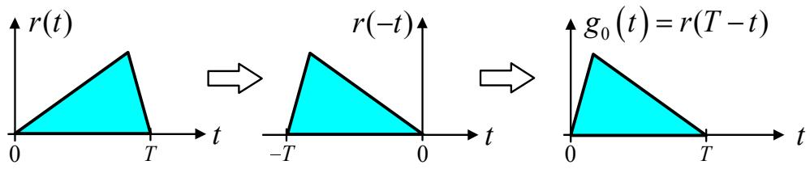  
รูปที่ 5.10: ตัวอย่างการหาวงจรกรองเหมาะสุด $g _ { 0 } ( t )$ ที่เหมาะกับสัญญาณ r(t)

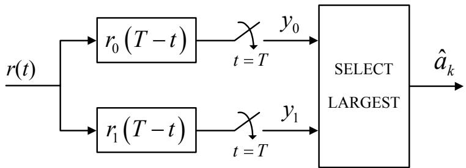  
รูปที่ 5.11: โครงสร้างของวงจรภาครับที่ใช้วงจรกรองเหมาะสุด สำหรับระบบสื่อสารแบบไบนารี

$\frac { d } { \hphantom { e } } \overset { _ { d } } { \underset { \hphantom { e } } { \parallel } } \overset { _ { d } } { \underset { \hphantom { e } } { \parallel } } \overset { _ { d } } { \underset { \hphantom { e } } { \parallel } } \overset { _ { d } } { \underset { \hphantom { e } } { \parallel } } \overset { _ { d } } { \underset { \hphantom { e } } { \parallel } } \overset { _ { d } } { \underset { \hphantom { e } } { \parallel } } \overset { _ { d } } { \underset { \hphantom { e } } { \parallel } } \overset { _ { d } } { \underset { \hphantom { e } } { \parallel } }$ ตัวดำเนินการคอนโวลูชัน (convolนtion operator) ถ้าระบบใช้วงจรกรองเหมาะ สุดเพื่อ ทำ หน้าที่เป็นวงจรกรองภาครับ นั่นคือ $g _ { r } ( t ) = g _ { 0 } ( t )$ ดังนั้น แทนค่า $g _ { 0 } ( t ) = r ( T - t )$ จากสมการ (5.34) ลงในสมการ (5.35) จะได้เป็น

$$
y ( t ) = \int _ { - \infty } ^ { \infty } p ( \tau ) r \left( T - [ t - \tau ] \right) d \tau\tag{5.36}
$$

ที่เวลา $t = T$ จะได้ว่า

$$
y ( T ) = \int _ { - \infty } ^ { \infty } p ( \tau ) r ( \tau ) d \tau\tag{5.37}
$$

สมการ (5.37) รู้จักกันทั่วไปว่าเป็นการ หาค่าสหสัมพันธ์ (correlation) ระหว่าง $p ( t )$ และ $r ( t )$ วงจรภาครับที่สร้างจากสมการ (5.37) จะ เรียกกันว่า "วงจรสหสัมพันธ์ (correlator)" สำหรับระบบ สื่อสารแบบไบนารี สัญญาณที่ใช้ในการส่งข้อมูลจะมี 2 สัญญาณ คือ $r _ { 0 } ( t )$ และ $r _ { 1 } ( t )$ เพราะฉะนั้น โครงสร้างของวงจรภาครับที่ใช้วงจรสหสัมพันธ์จะ เป็นไปตามรูปที่ 5.12 ซึ่งจะ เห็นได้ว่า วงจรกรอง เหมาะ สุดก็สามารถที่ จะสร้างให้อยู่ในรูปของวงจรสหสัมพันธ์ได้ (เปรียบเทียบรูปที่ 5.11 และรูปที่ 5.12)

  
รูปที่ 5.12: โครงสร้างของวงจรภาครับที่ใช้วงจรสหสัมพันธ์ สำหรับระบบสื่อสารแบบไบนารี

## 5.2.3 กฎการตัดสินใจ

จากแบบจำลองระบบสื่อสารในรูปที่ 5.9 เมื่อวงจรกรองเหมาะสุด g0(t) ถูกนำมาใช้เป็นวงจรกรองภาค รับ จะได้ว่า ข้อมูลเอาต์พุตของวงจรชักตัวอย่าง ณ เวลา $t = T$ จะเป็นไปตามสมการ (5.21) นั้นคือ

$$
y = a _ { k } + n _ { 0 }\tag{5.38}
$$

เมื่อ $a _ { k } \in \{ a _ { 0 } , a _ { 1 } \}$ คือ ข้อมูลบิตที่ต้องการ และ $n _ { 0 } \sim \mathcal { N } ( 0 , \sigma ^ { 2 } )$ คือ สัญญาณรบกวนเกาสสีขาวที่ มีฟังก์ชันความหนาแน่นความน่าจะเป็น คือ

$$
p ( n ) = \frac { 1 } { \sqrt { 2 \pi \sigma ^ { 2 } } } \exp \left\{ - \frac { n ^ { 2 } } { 2 \sigma ^ { 2 } } \right\}\tag{5.39}
$$

โดยที่ $\exp \{ \cdot \}$ คือ ฟังก์ชันเลขชี้กำลัง จากสมการ (5.38) ถ้ากำหนดค่า $a _ { k }$ มาให้ ดังนั้น $y$ จะ กลายเป็นตัวแปรสุ่มแบบเกาส์เซียนที่มีค่าเฉลี่ยเท่ากับ $a _ { 0 }$ หรือ $a _ { 1 }$ และมีค่าความแปรปรวนเท่ากับ $\sigma ^ { 2 }$ เพราะฉะนั้น ฟังก์ชันความหนาแน่นความน่าจะเป็นมีเงื่อนไข (conditional probability density function) $p ( y | r _ { 0 } )$ หมายถึง ฟังก์ชันความหนาแน่นความน่าจะเป็นของตัวแปรสุ่ม ๆ เมื่อกำหนดให้ สัญลักษณ์ $r _ { 0 } = r _ { 0 } ( t ) | _ { t = T } = r _ { 0 } ( T )$ ถูกส่งออกมาจากต้นทาง (สอดคล้องกับ $a _ { 0 } )$ ซึ่งมีค่าเท่ากับ

$$
p ( y | r _ { 0 } ) = \frac { 1 } { \sqrt { 2 \pi \sigma ^ { 2 } } } \exp \left. - \frac { ( y - a _ { 0 } ) ^ { 2 } } { 2 \sigma ^ { 2 } } \right.\tag{5.40}
$$

และ $p ( y | r _ { 1 } )$ หมายถึง ฟังก์ชันความหนาแน่นความน่าจะเป็นของตัวแปรสุ่ม ๆเมื่อกำหนดให้ สัญลักษณ์ $r _ { 1 } = r _ { 1 } ( t ) | _ { t = T } = r _ { 1 } ( T )$ ถูกส่งออกมาจากต้นทาง (สอดคล้องกับ $a _ { 1 } )$ ซึ่งมีค่าเท่ากับ

$$
p ( y | r _ { 1 } ) = \frac { 1 } { \sqrt { 2 \pi \sigma ^ { 2 } } } \exp \left. - \frac { ( y - a _ { 1 } ) ^ { 2 } } { 2 \sigma ^ { 2 } } \right.\tag{5.41}
$$

ด ถ้ากำหนดให้

$\mathrm { H } _ { 0 }$ คือ สมมุติฐานที่สัญลักษณ์ $r _ { 0 } = r _ { 0 } ( T )$ ถูกส่งออกมา (สอดคล้องกับ $a _ { k } = a _ { 0 } )$

$\mathrm { H } _ { 1 }$ คือ สมมุติฐานที่สัญลักษณ์ $r _ { 1 } = r _ { 1 } ( T )$ ถูกส่งออกมา (สอดคล้องกับ $a _ { k } = a _ { 1 } )$

วงจรตรวจหาขีดเริ่มเปลี่ยนจะทำการถอดรหัสข้อมูล $y$ เพื่อตัดสินใจว่า ข้อมูลบิตที่ส่งมาจากต้นทาง คือ $a _ { 0 }$ หรือ $a _ { 1 }$ โดยพิจารณาจากกฎการตัดสินใจ (decisioก rule) ต่อไปนี้

$$
y _ { k } \stackrel { H _ { 1 } } { \gtrless } \gamma\tag{5.42}
$$

เมื่อ $\gamma$ คือ ค่าระดับขีดเริ่มเปลี่ยน (threรhold level) ในการออกแบบวงจรตรวจหาขีดเริ่มเปลี่ยน สิ่งที นักออกแบบระบบจะ ต้องทำ คือ การหาค่า $\gamma$ ที่ดีที่สุดที่ จะ ทำให้ค่าความน่าจะเป็นของ ข้อผิดพลาด ที่ด้านขาออกของวงจรตรวจหาขีดเริ่มเปลี่ยนมีค่าน้อยที่สุด หรือการหาค่า $\gamma$ ที่ทำให้ฟังก์ชันความ หนาแน่นความน่าจะเป็นของ $r _ { i }$ (สำหรับ $i = 0$ หรือ 1) เมื่อกำหนด y มาให้ นั่นคือ $y$

$$
p ( r _ { i } | y )
$$

มีค่ามากสุด ดังนั้น กฎการตัดสินใจที่วงจรตรวจหาขีดเริ่มเปลี่ยนใช้ คือ

$$
p ( r _ { 1 } | y ) \bigotimes _ { H _ { 0 } } ^ { H _ { 1 } } p ( r _ { 0 } | y )\tag{5.43}
$$

และวงจรตรวจหาที่ใช้กฎการตัดสินใจตามสมการ (5.43) จะ เรียกกันว่า "วงจรตรวจหาแบบ MAP (maximum a-posteriori probability)"

## 5.2. การตรวจหาข้อมูลในสัญญาณรบกวนเกาส์สีขาวแบบบวก

จากทฤษฎีบทของเบส์ (Bayes'theorem) ซึ่งกล่าวไว้ว่า $p ( a | b ) = p ( b | a ) p ( a ) / p ( b )$ เพราะฉะนัน สมการ (5.43) สามารถเขียนได้ใหม่เป็น

$$
\frac { p ( y | r _ { 1 } ) p ( r _ { 1 } ) } { p ( y ) } \begin{array} { l } { \underset { H _ { 0 } } { \overset { H _ { 1 } } {  } } } \end{array} \frac { p ( y | r _ { 0 } ) p ( r _ { 0 } ) } { p ( y ) }\tag{5.44}
$$

เมื่อ $p ( r _ { 0 } )$ และ $p ( r _ { 1 } )$ คือ ฟังก์ชันความหนาแน่นความน่าจะ เป็นก่อน (a-priori probability density function) ที่สัญลักษณ์ $r _ { 0 }$ และ $r _ { 1 }$ จะถูกส่งมา ตามลำดับ สมการ (5.44) สามารถจัดรูปใหม่ได้ คือ

$$
\frac { p ( y | r _ { 1 } ) } { p ( y | r _ { 0 } ) } \quad \stackrel { H _ { 1 } } { \gtrless } \quad \frac { p ( r _ { 0 } ) } { p ( r _ { 1 } ) }\tag{5.45}
$$

กฎการตัดสินใจในสมการ (5.45) จะเรียกกันทั่วไปว่า "การทดสอบอัตราส่วนความน่าเป็นจริง (likelihood ratio test)"

ในกรณีที่ $p ( r _ { 0 } ) = p ( r _ { 1 } )$ นั่นคือ ความน่าจะเป็นที่วงจรภาคส่งจะส่งสัญลักษณ์ $r _ { 0 }$ หรือ $r _ { 1 }$ จะมี ค่าเท่ากัน ดังนั้น สมการ (5.45) จะลดรูปเป็น

$$
p ( y | r _ { 1 } ) \bigotimes _ { H _ { 0 } } ^ { H _ { 1 } } p ( y | r _ { 0 } )\tag{5.46}
$$

วงจรตรวจหาที่ใช้กฎการตัดสินใจตามสมการ (5.46) จะเรียกกันว่า "วงจรตรวจหาแบบ ML (mลxเmumlikelihood)"แทนค่า $p ( y | r _ { 0 } )$ จากสมการ (5.40) และ $p ( y | r _ { 1 } )$ จากสมการ (5.41) ลงในสมการ (5.46) จะได้ว่า

$$
\begin{array} { r l } { \frac { 1 } { \sqrt { 2 \pi \sigma ^ { 2 } } } \exp \left\{ - \frac { ( y - a _ { 1 } ) ^ { 2 } } { 2 \sigma ^ { 2 } } \right\} } & { { } \stackrel { H _ { 1 } } { \underset { H _ { 0 } } { \gtrless } } \quad \frac { 1 } { \sqrt { 2 \pi \sigma ^ { 2 } } } \exp \left\{ - \frac { ( y - a _ { 0 } ) ^ { 2 } } { 2 \sigma ^ { 2 } } \right\} } \\ { \exp \left\{ - \frac { ( y - a _ { 1 } ) ^ { 2 } } { 2 \sigma ^ { 2 } } \right\} } & { { } \stackrel { H _ { 1 } } { \underset { H _ { 0 } } { \xparallel } } } & { { } \exp \left\{ - \frac { ( y - a _ { 0 } ) ^ { 2 } } { 2 \sigma ^ { 2 } } \right\} } \end{array}\tag{5.47}
$$

ใส่ลอการิทึมธรรมชาติ In(·) ทั้งสองข้างของสมการ (5.47) จะได้เป็น

$$
\begin{array} { r l } { - \frac { ( y - a _ { 1 } ) ^ { 2 } } { 2 \sigma ^ { 2 } } } & { \begin{array} { r l } { H _ { 1 } } & { { } } \\ { \gtrless } & { { } } \end{array} - \frac { \left( y - a _ { 0 } \right) ^ { 2 } } { 2 \sigma ^ { 2 } } } \\ { - \frac { y ^ { 2 } - 2 y a _ { 1 } + a _ { 1 } ^ { 2 } } { 2 \sigma ^ { 2 } } } & { \begin{array} { r l } { H _ { 1 } } & { { } } \\ { \gtrless } & { { } } \end{array} - \frac { y ^ { 2 } - 2 y a _ { 0 } + a _ { 0 } ^ { 2 } } { 2 \sigma ^ { 2 } } } \\ { 2 y ( a _ { 1 } - a _ { 0 } ) } & { \begin{array} { r l } { H _ { 1 } } & { { } } \\ { \gtrless } & { { } } \end{array} } \\ { \begin{array} { r l } { H _ { 0 } } & { { } } \\ { y } & { { } \ngeq \frac { H _ { 1 } } { 2 } } & { \begin{array} { r l } { a _ { 1 } ^ { 2 } - a _ { 0 } ^ { 2 } } \\ { \vdots } & { { } } \end{array} } } \end{array} \end{array}\tag{5.48}
$$

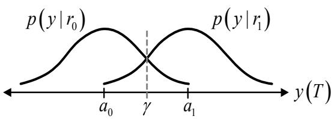

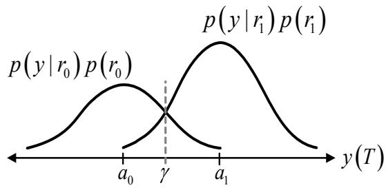  
(a) p(r ) = p(r)  
(b) p(r) < p(r)  
รูปที่ 5.13: ค่าระดับขีดเริ่มเปลี่ยน $\gamma$ สำหรับกรณี (a) $p ( r _ { 0 } ) = p ( r _ { 1 } )$ และ (b) $p ( r _ { 0 } ) < p ( r _ { 1 } )$

ดังนั้น ค่าระดับขีดเริ่มเปลี่ยนที่ดีที่สด $\gamma$ ที่จะทำให้ค่าความน่าจะเป็นของข้อผิดพลาดที่ด้านขาออกของ วงจรตรวจหาขีดเริมเปลี่ยนมีค่าน้อยที่สุด มีค่าเท่ากับ

$$
\gamma = \frac { a _ { 0 } + a _ { 1 } } { 2 }\tag{5.49}
$$

ในกรณีที่ $p ( r _ { 0 } ) \neq p ( r _ { 1 } )$ ค่าระดับขีดเริ่มเปลี่ยนที่เหมาะที่สุด $\gamma$ จะขึ้นอยู่กับ $p ( r _ { 0 } )$ และ $p ( r _ { 1 } )$ ด้วยตามสมการ (5.45) รูปที่ 5.13 แสดงตัวอย่างของค่าระดับขีดเริ่มเปลี่ยน เมื่อ $p ( r _ { 0 } ) = p ( r _ { 1 } )$ และ $p ( r _ { 0 } ) < p ( r _ { 1 } )$ จากรูปที่ 5.13(a) เมื่อ $p ( r _ { 0 } ) = p ( r _ { 1 } )$ ค่า $\gamma$ จะอยู่ณตำแหน่งกึงกลางระหว่าง $a _ { 0 }$ และ $a _ { 1 }$ พอดี ในขณะที่เมื่อ $p ( r _ { 0 } ) < p ( r _ { 1 } )$ ตามรูปที่ 5.13(b) จะหมายความว่า ความน่าจะเป็นที่วงจร ภาคส่งจะส่งสัญลักษณ์ $r _ { 1 }$ มีมากกว่า $r _ { 0 }$ ดังนั้น ค่า $\gamma$ จึงอยู่ห่างจาก $a _ { 1 }$ มากกว่า $a _ { 0 }$ เพื่อที่จะได้ทำให้ โอกาสที่ข้อมูล 7 $y ( T )$ ตกอยู่ใกล้บริเวณ $a _ { 1 }$ (เมื่อ $y ( T ) > \gamma )$ มีมากกว่า ซึ่งจะทำให้วงจรตรวจหาขีด เริ่มเปลี่ยนตัดสินใจว่า $y ( T )$ คือ $a _ { 1 }$ อย่างไรก็ตามในทางปฏิบัติ มักจะตั้งสมมุติฐานว่า ระบบสื่อสาร ส่งข้อมูลด้วย $p ( r _ { 0 } ) = p ( r _ { 1 } )$ เพื่อให้ข้อมูลมีลักษณะ เป็นตัวแปรสุ่มและจะทำให้ง่ายต่อการวิเคราะห์ ระบบ

## 5.2.4 การคำนวณหาความน่าจะเป็นของข้อผิดพลาด

พิจารณารูปที่ 5.13(a) เมื่อ $p ( r _ { 0 } ) = p ( r _ { 1 } )$ วงจรภาครับจะเกิดข้อผิดพลาด ก็ต่อเมื่อ ระบบส่งสัญญาณ $r _ { 0 } ( t )$ แต่วงจรตรวจหาขีดเริ่มเปลี่ยนตัดสินใจว่าข้อมูล $a _ { 1 }$ ถูกส่งมา (นั่นคือ สัญญาณรบกวนภายใน

ระบบทำให้ $y ( T ) > \gamma )$ ดัง $\stackrel { \circ } { \mathbb { H } } \mathbb { H }$

$$
p ( e | r _ { 0 } ) = p ( \mathrm { H } _ { 1 } | r _ { 0 } ) = \int _ { \gamma } ^ { \infty } p ( y | r _ { 0 } ) d y\tag{5.50}
$$

ในทำนองเดียวกัน ข้อผิดพลาดจะเกิดขึ้น ถ้าระบบส่งสัญญาณ $r _ { 1 } ( t )$ แต่วงจรตรวจหาขีดเริมเปลียน ตัดสินใจว่าข้อมูล $a _ { 0 }$ ถูกส่งมา (นันคือ สัญญาณรบกวนในระบบทำให้ $y ( T ) < \gamma )$ เพราะฉะนั้น ความน่าจะเป็นของข้อผิดพลาดสำหรับกรณีนี้ คือ

$$
p ( e | r _ { 1 } ) = p ( \mathrm { H } _ { 0 } | r _ { 1 } ) = \int _ { - \infty } ^ { \gamma } p ( y | r _ { 1 } ) d y\tag{5.51}
$$

ญ ดังนั้น ความน่าจะเป็นของข้อผิดพลาดรวมของทั้งระบบ (สำหรับระบบไบนารี) หรืออัตราข้อผิดพลาด บิต (BER) หาได้จาก

$$
P _ { e } = \sum _ { i = 0 } ^ { 1 } p ( e | r _ { i } ) p ( r _ { i } ) = p ( e | r _ { 0 } ) p ( r _ { 0 } ) + p ( e | r _ { 1 } ) p ( r _ { 1 } )\tag{5.52}
$$

ในกรณีที่ $p ( r _ { 0 } ) = p ( r _ { 1 } )$ สมการ (5.52) จะลดรูปเป็น

$$
P _ { e } = \frac { 1 } { 2 } p ( e | r _ { 0 } ) + \frac { 1 } { 2 } p ( e | r _ { 1 } )\tag{5.53}
$$

และเนื่องจาก ความสมมาตรของฟังก์ชันความหนาแน่นความน่าจะเป็น $p ( e | r _ { 0 } ) = p ( e | r _ { 1 } )$ ดังนั้นจะ ได้ว่า

$$
P _ { e } = p ( e | r _ { 1 } ) = p ( e | r _ { 0 } ) = \int _ { \gamma } ^ { \infty } p ( y | r _ { 0 } ) d y\tag{5.54}
$$

แทนค่า $\gamma$ จากสมการ (5.49) และค่า $p ( y | r _ { 0 } )$ จากสมการ (5.40) ลงในสมการ (5.54) จะได้เป็น

$$
P _ { e } = \int _ { \frac { a _ { 0 } + a _ { 1 } } { 2 } } ^ { \infty } \frac { 1 } { \sqrt { 2 \pi \sigma ^ { 2 } } } \exp \left. - \frac { ( y - a _ { 0 } ) ^ { 2 } } { 2 \sigma ^ { 2 } } \right. d y\tag{5.55}
$$

จัดรูปสมการ (5.55) โดยการเปลี่ยนตัวแปรดังต่อไปนี้ ให้ $u = ( y - a _ { 0 } ) / \sigma$ จะได้ $d y = \sigma d u$ ดังนั้น

$$
{ \begin{array} { l l l } { P _ { e } } & { = } & { \displaystyle \int _ { \frac { a _ { 1 } - a _ { 0 } } { 2 \sigma } } ^ { \infty } { \frac { 1 } { \sqrt { 2 \pi } } } \exp \left. - { \frac { u ^ { 2 } } { 2 } } \right. d u } \\ & { = } & { \displaystyle Q \left( { \frac { a _ { 1 } - a _ { 0 } } { 2 \sigma } } \right) } \end{array} }\tag{5.56}
$$

เมื่อฟังก์ชัน $Q$ นิยามโดย $\begin{array} { r } { Q ( x ) = \frac { 1 } { \sqrt { 2 \pi } } \int _ { x } ^ { \infty } e ^ { - u ^ { 2 } / 2 } } \end{array}$ du [9, 36, 37] และ $\sigma ^ { 2 } = N _ { 0 } / 2$

จากสมการ (5.56) $P _ { e }$ จะมีค่าลดลงได้ ก็ต่อเมื่อ $( a _ { 1 } - a _ { 0 } ) / \sigma$ มีค่าเพิ่มขึ้น ซึ่งสามารถทำได้โดย การออกแบบวงจรกรองภาครับที่เหมาะกับสัญญาณ $r _ { 1 } ( t ) - r _ { 0 } ( t )$ นั้นเอง เพราะฉะนั้น ค่า รNR ณ เวลา $t = T$ สามารถเขียนให้อยู่ในรูปของ

$$
\mathrm { S N R } _ { T } = \frac { ( a _ { 1 } - a _ { 0 } ) ^ { 2 } } { \sigma ^ { 2 } } = \frac { 2 E _ { d } } { N _ { 0 } }\tag{5.57}
$$

เมื่อ $\sigma ^ { 2 } = N _ { 0 } / 2$ คือ กำลังเฉลี่ยของสัญญาณรบกวนที่ด้านขาออกของวงจรชักตัวอย่าง, และ $E _ { d }$ คือ พลังงานของผลต่างของสัญญาณที่ส่ง ซึ่งนิยามโดย

$$
E _ { d } = \int _ { - \infty } ^ { \infty } \{ r _ { 1 } ( t ) - r _ { 0 } ( t ) \} ^ { 2 } d t\tag{5.58}
$$

ดังนั้น ความน่าจะเป็นของข้อผิดพลาดในสมการ (5.56) สามารถจัดรูปใหม่ได้เป็น

$$
P _ { e } = Q \left( { \frac { 1 } { 2 } } { \sqrt { \mathrm { S N R } _ { T } } } \right) = Q \left( { \sqrt { \frac { E _ { d } } { 2 N _ { 0 } } } } \right)\tag{5.59}
$$

ค่าพลังงานของผลต่างของสัญญาณที่ส่ง $E _ { d }$ ในสมการ (5.58) สามารถกระจายได้เป็น

$$
E _ { d } = \int _ { 0 } ^ { T } r _ { 1 } ^ { 2 } ( t ) d t + \int _ { 0 } ^ { T } r _ { 0 } ^ { 2 } ( t ) d t - 2 \int _ { 0 } ^ { T } r _ { 1 } ( t ) r _ { 0 } ( t ) d t\tag{5.60}
$$

โดยที่ สองพจน์ แรก ทางด้านขวาของสมการ (5.60) คือ พลังงานของสัญญาณ $r _ { 1 } ( t )$ และ $r _ { 0 } ( t )$ (นั่นคือ $E _ { r _ { 1 } }$ และ $E _ { r _ { 0 } } )$ นั่นเอง ในทางปฏิบัติ มักจะอ้างถึง "พลังงานบิตเฉลี่ย (average bit energy)" $E _ { b }$ ในการคำนวณต่างๆ ซึ่งค่า $E _ { b }$ นี้จะนิยามโดย

$$
E _ { b } = \frac { 1 } { 2 } \left\{ \int _ { 0 } ^ { T } r _ { 1 } ^ { 2 } ( t ) d t + \int _ { 0 } ^ { T } r _ { 0 } ^ { 2 } ( t ) d t \right\}\tag{5.61}
$$

สำหรับพจน์สุดท้ายทางด้านขวาของสมการ (5.60) จะสัมพันธ์กับค่าสัมประสิทธิ์สหสัมพันธ์ข้าม (crosscorrelation coefficient) ดังนี้

$$
\rho = \frac { 1 } { E _ { b } } \int _ { 0 } ^ { T } r _ { 1 } ( t ) r _ { 0 } ( t ) d t\tag{5.62}
$$

เมื่อ $- 1 \leq \rho \leq 1$ แทนค่าสมการ (5.61) และ (5.62) ลงในสมการ (5.60) จะได้

$$
E _ { d } = 2 E _ { b } - 2 E _ { b } \rho = 2 E _ { b } ( 1 - \rho )\tag{5.63}
$$

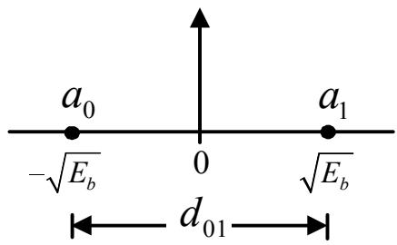  
รูปที่ 5.14: ตำแหน่งของสัญญาณแอนติโพแดล

ดังนั้น สมการ (5.59) เขียนใหม่ได้เป็น

$$
P _ { e } = Q \left( \sqrt { \frac { E _ { b } ( 1 - \rho ) } { N _ { 0 } } } \right)\tag{5.64}
$$

## BER ของสัญญาณแอนติโพแดล

ถ้าสัญญาณไบนารี $r _ { 0 } ( t ) = - r _ { 1 } ( t )$ (ฝนั่นคือ $a _ { 0 } = - a _ { 1 } )$ สัญญาณรูปแบบนี้จะเรียกกันว่า "สัญญาณ แอนติโพแดล (antipodal signal)" ดังแสดงในรูปที่ 5.14 ในกรณีนี้จะได้ว่า พลังงานของบิต ${ { E } _ { { { r } _ { 0 } } } } =$ $- \sqrt { E _ { b } } , E _ { r _ { 1 } } = \sqrt { E _ { b } } .$ และค่าสัมประสิทธิ์สหสัมพันธุ์ข้าม $\rho$ มีค่าเท่ากับ

$$
\rho = \frac { 1 } { E _ { b } } \int _ { 0 } ^ { T } r _ { 1 } ( t ) r _ { 0 } ( t ) d t = - \frac { 1 } { E _ { b } } \int _ { 0 } ^ { T } r _ { 1 } ^ { 2 } ( t ) d t = - 1
$$

ดังนั้น จากสมการ (5.64) BER ของระบบสื่อสารที่ใ้สัญญาณแอนติโพแดลในการส่งข้อมูล จะมีค่า เท่ากับ

$$
P _ { e } = Q \left( \sqrt { \frac { E _ { b } ( 1 - ( - 1 ) ) } { N _ { 0 } } } \right) = Q \left( \sqrt { \frac { 2 E _ { b } } { N _ { 0 } } } \right)\tag{5.65}
$$

จากการสังเกตสมการ (5.65) จะพบว่า BER ของระบบจะ ขึ้นอยู่กับค่า $E _ { b } / N _ { 0 }$ เท่านั้น ไม่ได้ขึ้นกับ รูปร่างของสัญญาณที่ใช้ในการส่งข้อมูล $a _ { 0 }$ และ $a _ { 1 }$

นอกจากนี้ ยังสามารถแสดงค่า BER ในรูปของระยะทางระหว่างข้อมูล $a _ { 0 }$ และ $a _ { 1 }$ ได้เช่นกัน จากรูปที่ 5.14 ระยะทางระหว่างข้อมูล $a _ { 0 }$ และ $a _ { 1 }$ คือ $d _ { 0 1 }$ ซึ่งมีค่าเท่ากับ $2 \sqrt { E _ { b } }$ ดังนั้น $E _ { b } = d _ { 0 1 } ^ { 2 } / 4$

  
รูปที่ 5.15: ตำแหน่งของสัญญาณเชิงตั้งฉาก

แทนค่า $E _ { b }$ นี้ลงในสมการ (5.65) จะไดต้เป็น

$$
P _ { e } = Q \left( \sqrt { \frac { d _ { 0 1 } ^ { 2 } } { 2 N _ { 0 } } } \right) = Q \left( \sqrt { \frac { E _ { d } } { 2 N _ { 0 } } } \right)\tag{5.66}
$$

เมื่อ $\begin{array} { r } { d _ { 0 1 } ^ { 2 } = E _ { d } = \int _ { - \infty } ^ { \infty } \{ r _ { 1 } ( t ) - r _ { 0 } ( t ) \} ^ { 2 } d t } \end{array}$

## BER ของสัญญาณเชิงตั้งฉาก

สัญญาณเชิงตั้งฉาก (orthogonal signal) คือ สัญญาณไบนารี $r _ { 0 } ( t )$ และ $r _ { 1 } ( t )$ ที่มีพลังงานบิต $E _ { r _ { 0 } } = E _ { r _ { 1 } } = \sqrt { E _ { b } }$ และค่าสัมประสิทธิ์สหสัมพันธ์ข้าม $\rho$ เท่ากับ

$$
\rho = \frac { 1 } { E _ { b } } \int _ { 0 } ^ { T } r _ { 1 } ( t ) r _ { 0 } ( t ) d t = 0
$$

ดังแสดงในรูปที่ 5.15 นั่นคือ สัญญาณทั้งสองจะทำมุมกัน $9 0 ^ { \mathrm { o } }$ ในกรณีนี้ จะได้ว่า $d _ { 0 1 } = \sqrt { 2 E _ { b } }$ ดังนั้น BER ของระบบสื่อสารที่ใช้สัญญาณเชิงตั้งฉากในการส่งสัญญาณ จะมีค่าเท่ากับ e

$$
P _ { e } = Q \left( \sqrt { \frac { d _ { 0 1 } ^ { 2 } } { 2 N _ { 0 } } } \right) = Q \left( \sqrt { \frac { E _ { d } } { 2 N _ { 0 } } } \right) = Q \left( \sqrt { \frac { E _ { b } } { N _ { 0 } } } \right)\tag{5.67}
$$

## ตัวอย่างการคำนวณ BER

ข้อมูลบิต $a _ { 0 }$ และ $a _ { 1 }$ ตัวอย่างที่ 5.7 พิจารณาระบบสื่อสารไบนารี (binary communication system)ที่ส่งสัญญาณ $r _ { 0 } ( t )$ และ $r _ { 1 } ( t )$ ที่มีรูปคลื่นของสัญญาณตามรูปที่ 5.16 สัญญาณ $r ( t )$ จะถูกรบกวนด้วย AพGN ที่มีความ ซ หนาแน่นสเปกตรัมกำลังแบบสองด้านเท่ากับ $N _ { 0 } / 2$ และถูกกรองด้วยวงจรกรองเหมาะสุด จากนั้น ก็ จะถูกทำการชักตัวอย่างที่เวลา $t = T$ ถ้ากำหนดให้ $N _ { 0 } = 1 0 ^ { - 1 2 }$ วัตต์/เฮิรตซ์ จงคำนวณหาค่า BER ของระบบนี้

  
$\mathfrak { J } ^ { \mathrm { q l } } \overset { \mathrm { d } } { \mathfrak { n } }$ 5.16: รูปคลื่นของสัญญาณ $r _ { 0 } ( t )$ และ $r _ { 1 } ( t )$ ที่ใช้ในระบบสื่อสาร

วิธีทำ จากรูปคลื่นของสัญญาณในรูปที่ 5.16 จะ พบว่า $r _ { 0 } ( t ) = - r _ { 1 } ( t )$ นันแสดงว่า ระบบสื่อสาร ใช้สัญญาณแอนติโพแดลในการส่งข้อมูล เนื่องจาก BER ของสัญญาณแอนติโพแดลมีค่าตามสมการ (5.65) นั่นคือ

$$
P _ { e } = Q \left( { \sqrt { \frac { 2 E _ { b } } { N _ { 0 } } } } \right)
$$

ดังนั้น ในการที่จะหาค่า $P _ { e }$ ได้ จะ ต้องทราบค่าพลังงานเฉลี่ยของบิต $E _ { b }$ ก่อนซึ่งสามารถหาได้ ดังต่อไปนี้ เริ่มต้นด้วยการหาพลังงานของสัญญาณ $r _ { 0 } ( t )$ จาก

$$
\begin{array} { l l l } { { E _ { r _ { 0 } } } } & { { = } } & { { \displaystyle \int _ { 0 } ^ { 3 \times 1 0 ^ { - 6 } } | r _ { 0 } ( t ) | ^ { 2 } d t } } \\ { { } } & { { = } } & { { ( 2 \times 1 0 ^ { - 3 } ) ^ { 2 } ( 1 \times 1 0 ^ { - 6 } ) + ( 1 \times 1 0 ^ { - 3 } ) ^ { 2 } ( 2 \times 1 0 ^ { - 6 } ) } } \\ { { } } & { { = } } & { { 6 \times 1 0 ^ { - 1 2 } ~ \mathrm { J o u l e s } } } \end{array}
$$

เนื่องจาก $r _ { 0 } ( t ) ~ = - r _ { 1 } ( t )$ เพราะฉะ $\stackrel { \circ } { \mathbb { H } } \mathbb { H }$ พลังงานของสัญญาณ $r _ { 1 } ( t )$ มีค่าเท่ากับ $r _ { 0 } ( t )$ นั่นคือ $E _ { r _ { 0 } } = E _ { r _ { \frac { . } { . } } }$ ดังนั้น e

$$
E _ { b } = \frac { E _ { r _ { 0 } } + E _ { r _ { 1 } } } { 2 } = 6 \times 1 0 ^ { - 1 2 } ~ \mathrm { \ J o u l e s }
$$

แทนค่า $E _ { b }$ ใน $P _ { e }$ จะได้ว่า

$$
{ \begin{array} { l l l } { P _ { e } } & { = } & { Q \left( { \sqrt { \frac { 2 ( 6 \times 1 0 ^ { - 1 2 } ) } { 1 0 ^ { - 1 2 } } } } \right) } \\ & { = } & { Q \left( { \sqrt { 1 2 } } \right) } \\ & { = } & { 0 . 0 0 0 2 6 6 } \end{array} }
$$

จะเห็นได้ว่า BER ของระบบจะไม่ขึนกับรูปร่างของสัญญาณ $r _ { 0 } ( t )$ และ $r _ { 1 } ( t )$ ดังนั้นไม่ว่า ท- $r _ { 0 } ( t )$ และ $r _ { 1 } ( t )$ จะมีรูปร่างอย่างไรก็ตาม ตราบใดที่สัญญาณ $r _ { 0 } ( t )$ และ $r _ { 1 } ( t )$ มีพลังงานเท่ากัน ค่า BER ของ ระบบก็จะมีค่าเท่าเดิม

ตัวอย่างที่5.8นี้ พิจารณาระบบสื่อสารไบนารีที่ใช้ระบบสัญญาณแบบขั้วเดียว (unipอlar signaling) โดยที่

$$
\begin{array} { r c l } { { r _ { 0 } ( t ) } } & { { = } } & { { 0 , \quad 0 \leq t \leq T } } \\ { { } } & { { } } & { { } } \\ { { r _ { 1 } ( t ) } } & { { = } } & { { A , \quad 0 \leq t \leq T } } \end{array}
$$

เมื่อ A คือ ค่าคงตัว รูปที่ 5.17 แสดงตัวอย่างสัญญาณ $r ( t )$ ที่สอดคล้องกับลำดับข้อมูล {1, 0, 1, 1, 0, 1, 0} สัญญาณ $r ( t )$ จะถูกรบกวนด้วย AพGย ที่มีความหนาแน่นสเปกตรัมกำลังแบบสองด้านเท่า กับ $N _ { 0 } / 2$ และถูกกรองด้วยวงจรกรองเหมาะสุด จากนั้น ก็จะถูกทำการชักตัวอย่างที่เวลา 2 $t = T$ จง คำนวณหาค่า BER ของระบบนี้ ในรูปของฟังก์ชั้น Q

ญ วิธีทำ เนื่องจากสัญญาณ $r _ { 0 } ( t )$ และ $r _ { 1 } ( t )$ มีลักษณะเป็นสัญญาณเชิงตั้งฉาก เพราะว่าค่าสัมประสิทธิ สหสัมพันธ์ข้าม $\begin{array} { r } { \rho = \int _ { 0 } ^ { T } r _ { 1 } ( t ) r _ { 0 } ( t ) d t = 0 } \end{array}$ ดังนั้น BER สำหรับสัญญาณเชิงตั้งฉาก สามารถหาได้

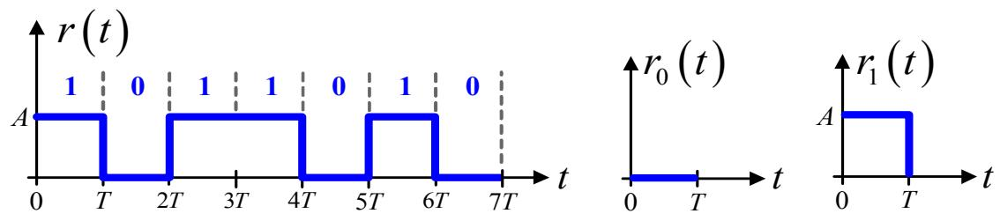  
รูปที่ 5.17: สัญญาณ r(t) ที่สอดคล้องกับลำดับข้อมูล {1, 0, 1, 1, 0, 1, 0} เมื่อใช้ระบบสัญญาณแบบ ขั้วเดียว (หรือสัญญาณเชิงตั้งฉาก)

จากสมการ (5.67) นั่นคือ

$$
P _ { e } = Q \left( \sqrt { \frac { E _ { d } } { 2 N _ { 0 } } } \right) = Q \left( \sqrt { \frac { A ^ { 2 } T } { 2 N _ { 0 } } } \right)
$$

เมื่อ พลังงานของผลต่างของสัญญาณที่ส่ง $\begin{array} { r } { E _ { d } = \int _ { 0 } ^ { T } ( A - 0 ) ^ { 2 } d t = A ^ { 2 } T } \end{array}$

ในทำนองเดียวกัน ค่า BER ก็สามารถที่จะหาจากพลังงานบิตเฉลี่ย $E _ { b }$ ได้เช่นกัน ตามสมการ (5.67) นั่นคือ

$$
P _ { e } = Q \left( \sqrt { \frac { E _ { b } } { N _ { 0 } } } \right) = Q \left( \sqrt { \frac { A ^ { 2 } T } { 2 N _ { 0 } } } \right)
$$

โดยที่ ${ \cal E } _ { b } = ( { \cal E } _ { r _ { 0 } } + { \cal E } _ { r _ { 1 } } ) / 2 = A ^ { 2 } T / 2$ เมื่อ Ero = 0 และ $\begin{array} { r } { E _ { r _ { 1 } } = \int _ { 0 } ^ { T } ( A ) ^ { 2 } d t = A ^ { 2 } T } \end{array}$

ตัวอย่างที่ 5.9 พิจารณาระบบสื่อสารแบบไบนารีที่ใช้ระบบสัญญาณแบบสอง $\stackrel { \circ } { \boldsymbol { \mathbb { I } } } \boldsymbol { \mathbb { I } }$ (bipolar signaling) โดยที่

$$
\begin{array} { r l r } { r _ { 0 } ( t ) } & { = } & { - A , \quad 0 \le t \le T } \\ & { } & \\ { r _ { 1 } ( t ) } & { = } & { A , \quad 0 \le t \le T } \end{array}
$$

เมื่อ A คือ ค่าคงตัว รูปที่ 5.18 แสดงตัวอย่างสัญญาณ r(t) ที่สอดคล้องกับลำดับข้อมูล {1, 0, 1, 1, 0, 1,0} สัญญาณ r(t) จะ ถูกรบกวนด้วย AพGN ที่มีความหนาแน่นสเปกตรัมกำลังแบบสองด้านเท่า

  
รูปที่ 5.18: สัญญาณ r(t) ที่สอดคล้องกับลำดับข้อมูล {1, 0, 1, 1, 0, 1, 0} เมื่อใช้ระบบสัญญาณแบบ สองขั้ว (หรือสัญญาณแอนติโพแดล)

กับ $N _ { 0 } / 2$ และถูกกรองด้วยวงจรกรองเหมาะสุด จากนัน ก็จะถูกทำการชักตัวอย่างที่เวลา $t = T$ จง คำนวณหาค่า BER ของระบบนี้ ในรูปของฟังก์ชัน Q

ญ ญ วิธีทำ เนื่องจาก $r _ { 0 } ( t ) = - r _ { 1 } ( t )$ เพราะฉะนั้น สัญญาณทั้งสองมีลักษณะเป็นแบบสัญญาณแอนติ โพแดล ซึ่ง BER สำหรับสัญญาณแอนติโพแดล สามารถหาได้จากสมการ (5.66) นั่นคือ

$$
P _ { e } = Q \left( { \sqrt { { \frac { E _ { d } } { 2 N _ { 0 } } } } } \right) = Q \left( { \sqrt { { \frac { 2 A ^ { 2 } T } { N _ { 0 } } } } } \right)
$$

เมื่อ พลังงานของผลต่างของสัญญาณที่ส่ง $\begin{array} { r } { E _ { d } = \int _ { 0 } ^ { T } [ A - ( - A ) ] ^ { 2 } d t = ( 2 A ) ^ { 2 } T } \end{array}$

ในทำนองเดียวกัน ค่า BER ก็สามารถที่จะหาจากพลังงานบิดเฉลี่ย $E _ { b }$ ได้เช่นกัน ตามสมการ (5.65) นั่นคือ

$$
P _ { e } = Q \left( \sqrt { \frac { 2 E _ { b } } { N _ { 0 } } } \right) = Q \left( \sqrt { \frac { 2 A ^ { 2 } T } { N _ { 0 } } } \right)
$$

โดยที่ $E _ { b } = ( E _ { r _ { 0 } } + E _ { r _ { 1 } } ) / 2 = A ^ { 2 } T$ เนืองจาก $\begin{array} { r } { E _ { r _ { 0 } } = E _ { r _ { 1 } } = \int _ { 0 } ^ { T } ( A ) ^ { 2 } d t = A ^ { 2 } T } \end{array}$

จากตัวอย่างที่ 5.8 และ 5.9 ประสิทธิ ภาพในรูปของ BER ของระบบสื่อสารที่ใช้ระบบสัญญาณ $P _ { e } = Q \left( \sqrt { 2 E _ { b } / N _ { 0 } } \right)$ ด $P _ { e } = Q \left( \sqrt { E _ { b } / N _ { 0 } } \right)$   
แบบสองขัว จะดีกว่าการใช้ระบบสัญญาณแบบขั้วเดียว   
ดังแสดงในรูปที่ 5.19 ั้นี้เนื่องจาก ถ้าพิจารณาจากตำแหน่งของระบบสัญญาณแบบขั้วเดียว (ั่นคือ

  
รูปที่ 5.19: ประสิทธิภาพของระบบสื่อสารไบนารีที่ใช้ระบบสัญญาณแบบขั้วเดียวและระบบสัญญาณ แบบสองขั้ว

สัญญาณเชิงตั้งฉาก) ในรูปที่ 5.15 และตำแหน่งของระบบสัญญาณแบบสองขั้ว (นั่นคือ สัญญาณ แอนติโพแดล) ในรูปที่ 5.14 จะ พบว่า ระยะห่างของ ข้อมูลบิตสำหรับสัญญาณ แอนติโพแดลจะมีค่า มากกว่าระยะ ห่าง ของ ข้อมูลบิตสำหรับสัญญาณเชิงตั้งฉาก ซึ่งหมายความว่า โอกาส ที่วงจร ตรวจหา จะ ตัดสินใจผิดพลาดก็จะ มีน้อยกว่า จึงทำให้ระบบสัญญาณแบบสองขั้วมีค่า BER น้อยกว่าระบบ สัญญาณแบบขั้วเดียว

## 5.3 การแทรกสอดระหว่างสัญลักษณ์

การแทรกสอดระหว่างสัญลักษณ์ (IS: intersรymbol interference) คือ ปรากฎการณ์ที่สัญญาณพัลส์ e ลำดับที่ k ที่ส่งออกจากต้นทาง ไปรบกวนหรือแทรกสอดกับสัญญาณ พัลส์ที่อยู่ติดๆ กัน (นั่นคือ สัญญาณพัลส์ลำดับที่ k-i เมื่อ i เป็นเลขจำนวนเต็มที่ไม่เท่ากับค่าศูนย์) วิธีการสังเกตว่าช่องสัญญาณ

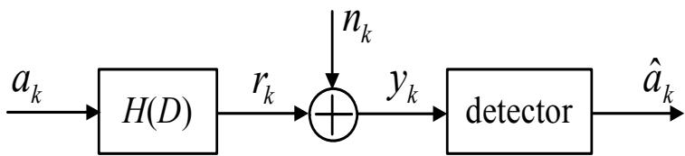  
รูปที่ 5.20: แบบจำลองช่องสัญญาณที่ไม่ต่อเนื่องทางเวลา

สื่อสาร (communication channel) ที่ใช้งานก่อให้เกิด ISI หรือไม่ สามารถทำได้โดยการส่งสัญญาณ พัลส์หนึ่งพัลส์เข้าไปในช่องสัญญาณ ถ้าสัญญาณพัลส์ที่ด้านขาออกของช่องสัญญาณมีมากกว่าหนึ่ง พัลส์แสดงว่า ช่องสัญญาณนี้ก่อให้เกิด ISI

ให้พิจารณาแบบจำลองช่องสัญญาณที่ไม่ต่อเนื่องทางเวลา ในรูปที่ 5.20 เมื่อ ลำดับข้อมูลอินพุต $a _ { k }$ ที่มีคาบเวลาของบิต (bit period) T ถูกส่งผ่านไปยังช่องสัญญาณ H(D) ที่กำหนดโดย

$$
H ( D ) = \sum _ { k = 0 } ^ { \nu } h _ { k } D ^ { k }\tag{5.68}
$$

เมื่อ $h _ { k }$ คือ ค่าสัมประสิทธิตัวที่ k ของช่องสัญญาณ, V คือ หน่วยความจำ (memory) ของช่องสัญญาณ (หรือ $\nu + 1$ คือจำนวนแท็ป (tap) ของช่องสัญญาณ), และ D คือ ตัวดำเนินการหน่วงเวลา $T$ หน่วย ข้อมูลเอาต์พุต $r _ { k }$ ของช่องสัญญาณจะถูกรบกวนด้วย AWGN $n _ { k }$ ซึ่งมีค่าเฉลี่ยเท่ากับค่าศูนย์ และค่า ความแปรปรวน5(variance)เท่ากับค่า $\sigma ^ { 2 }$ หรือเขียนเป็นสัญลักษณ์ได้ว่า $n _ { k } \sim \mathcal N ( 0 , \sigma ^ { 2 } )$ จากนั้น วงจรตรวจหาก็จะทำการตัดสินใจหาค่าประมาณของข้อมูลอินพุต $a _ { k }$ จากข้อมูล $y _ { k }$ ที่ได้รับ นั่นคือ การ หาค่า $\hat { a } _ { k }$

ถ้ากำหนดให้ช่องสัญญาณ H(D) เป็นระบบเชิงเส้นที่ไม่แปรเปลี่ยนตามเวลา (ระบบ LTI) ดังนั้น ข้อมูลเอาต์พุตของช่องสัญญาณ (channel output) $r _ { k }$ คือ ผลลัพธ์ที่ได้จากการทำคอนโวลูชันระหว่าง ข้อมูลอินพุต $a _ { k }$ และผลตอบสนองอิมพัลส์ของระบบ $h _ { k }$ นันคือ

$$
\begin{array} { l } { r _ { k } } \\ { \ } \\ { \displaystyle = \ \sum _ { i = 0 } ^ { \nu } a _ { k - i } h _ { i } } \\ { \displaystyle = \ \underbrace { a _ { k } h _ { 0 } } _ { \mathrm { w a n t e d ~ s i g n a l } } + \underbrace { a _ { k - 1 } h _ { 1 } + \ldots + a _ { k - \nu } h _ { \nu } } _ { \mathrm { I S I } } } \end{array}\tag{5.69}
$$

จากสมการ (5.69) สัญญาณที่ระบบต้องการ คือ $a _ { k } h _ { 0 }$ เท่านั้น ส่วนพจน์อื่นๆ เป็นส่วนที่ก่อให้ เกิด ISI ดังนั้น อาจจะกล่าวได้ว่า ปรากฎการณ์ IS1 เกิดขึ้นเมื่อสัญญาณเอาต์พุตของช่องสัญญาณ ณ เวลาปัจจุบัน เป็นฟังก์ชันของสัญญาณอินพุตไม่เฉพาะ ณ เวลาปัจจุบันเท่านั้น แต่ยังเป็นฟังก์ชัน ของสัญญาณอินพุต ณ เวลาในอดีตและในอนาคตด้วย เช่น จากสมการ (5.69) จะเห็นว่า สัญญาณ เอาต์พุตของช่องสัญญาณ $r _ { k }$ เป็นฟังก์ชันของสัญญาณอินพุต ณ เวลาในปัจจุบัน $a _ { k }$ และในอดีต $a _ { k - i }$ หรืออาจจะสรุปได้ว่า ถ้าช่องสัญญาณ $H ( D )$ ไม่มีหน่วยความจำ (นั่นคือ $\nu = 0 )$ สัญญาณ เอาต์พุตของช่องสัญญาณก็จะไม่มี ISI

ยกตัวอย่างเช่น จากรูปที่ 5.7 เนื่องจาก $g ( t )$ คือ ผลตอบสนองอิมพัลส์ของช่องสัญญาณที่มีค่า เฉพาะช่วงเวลา 0 ถึง T (ซึ่งถือว่า ช่องสัญญาณนี้ไม่มีหน่วยความจำ)เมื่อข้อมูลอินพุต $a _ { k }$ ผ่าน ช่องสัญญาณนี้ ผลลัพธ์ที่ได้ คือ สัญญาณ $r ( t )$ ก็จะไม่มี IS1 ปะปนอยู่เพราะฉะนั้น เมื่อพิจารณา จากรูปร่างของสัญญาณ $r ( t )$ แล้ว สามารถที่จะระบุได้ทันทีว่าช่วงเวลาไหน ข้อมูล $a _ { k }$ มีค่าเป็นบิด 1 หรือบิต $^ { - 1 }$ ได้โดยง่าย แต่ถ้าช่องสัญญาณ $g ( t )$ มีค่าของสัญญาณเกินช่วงเวลา T ก็จะส่งผลทำให้ เกิด ISI ดังแสดงในรูปที่ 5.21 ซึ่งจะเห็นได้ว่า สัญญาณพัลส์ที่เกิดจากแต่ละ $a _ { k }$ ซ้อนเหลื่อมกันทำให้ รู้ ญ สัญญาณรวมที่ได้ (เส้นกราฟสีเทา) มีความผิดเพี้ยนเกิดขึ้น ดังนั้น จึงเป็นการยากที่จะบอกได้ว่าช่วง เวลาไหน ข้อมูล $a _ { k }$ มีค่าเป็นอะไร

## 5.3.1 การตรวจสอบระดับความรุนแรงของ IS1

โดยทั่วไป ระดับความรุนแรงของ ISI สามารถสังเกตเห็นได้จาก "แผนภาพดวงตา (eye dagram)" ซึ่งได้จากการนำสัญญาณแอนะล็อกที่ต้องการแสดงเป็นแผนภาพดวงตาในแต่ละช่วงเวลา หรือในทาง ฮาร์ดดิสก์ไดรฟ์จะ เรียกกันว่า "บิตเซลล์ (bit cel)" T มาวางซ้อนเหลื่อมกัน ดังแสดงในรูปที่ 5.22 จะเห็นได้ว่า ผลลัพธ์ ที่ได้จะมีลักษณะ คล้ายดวงตาของมนุษย์ ดังนั้น จึงเรียกกันว่า แผนภาพดวงตา

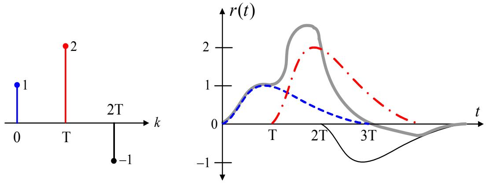  
รูปที่ 5.21: ตัวอย่างแสดงการเกิดการแทรกสอดระหว่างสัญลักษณ์ (IS1)

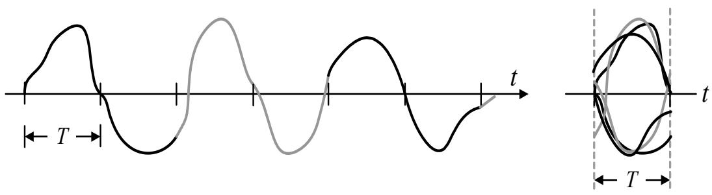  
รูปที่ 5.22: ตัวอย่างการสร้างแผนภาพดวงตา

รู โดยแผนภาพดวงตานี้จะทำให้ทราบถึงระดับความรุนแรงของสัญญาณรบกวนและ IS1 กล่าวคือ ถ้า ลักษณะของดวงตาหรี่ๆ หรือปิด แสดงว่า สัญญาณรบกวนและ ISI มีความรุนแรงมาก ในทางตรงกัน ข้าม ถ้าลักษณะของดวงตาเปิดกว้าง แสดงว่า สัญญาณรบกวนและ ISI มีความรุนแรงน้อย

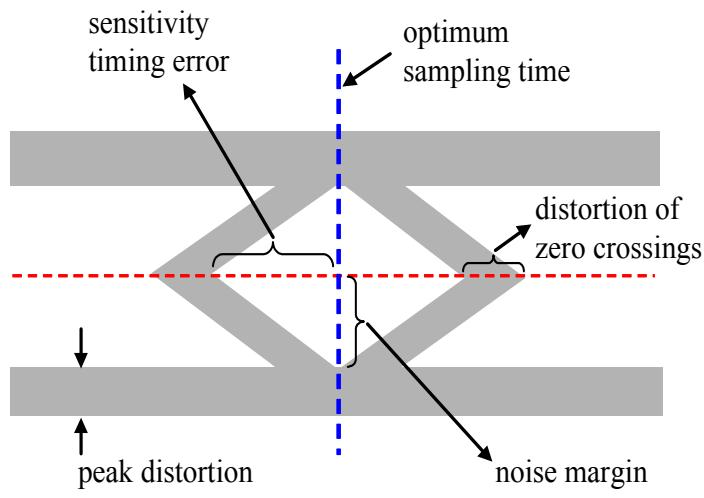  
รูปที่ 5.23: รายละเอียดของแผนภาพดวงตา

ในทางปฏิบัติ แผนภาพดวงตาจะบอกให้ทราบถึง เวลาที่เหมาะที่สุดสำหรับการชักตัวอย่าง (Opti1- mum sampling time), ความไวต่อ ข้อผิดพลาดทางเวลา (sensitivity timing error), ความผิดเพี้ยน รู้ ของค่าสูงสุด (peak distortion), ขอบเขตของสัญญาณรบกวน (noise margin),และ ความผิดเพียน จุดตัดค่าศูนย์ (distortion of zero crossings) ดังแสดงในรูปที่ 5.23 [9] จะ เห็นได้ว่า เวลาที่ดีที่สุด สำหรับการชักตัวอย่าง คือ ณ จุดกึงกลางของบิตเซลล์ รูปที่ 5.24 แสดงตัวอย่างแผนภาพดวงตาของ ช่องสัญญาณ $H ( D ) = 1 - D ^ { 2 }$ สำหรับ รNR ต่างๆ วัดที่ด้านขาเข้าของวงจรตรวจหา เมื่อ SNR นิยามโดย

$$
\mathrm { S N R } = 1 0 \log _ { 1 0 } \left( \frac { E _ { b } } { N _ { 0 } } \right)\tag{5.70}
$$

มีหน่วยเป็นเดซิเบล (dB: decibel) เมื่อ $E _ { b }$ คือ พลังงานของสัญญาณต่อ หนึ่งบิต, $\sigma ^ { 2 } = N _ { 0 } / 2$ คือ กำลังของสัญญาณรบกวน จะเห็นได้ว่า เมื่อ รNR มีค่าน้อย สัญญาณรบกวนก็จะมีความรุนแรง มาก ทำให้ลักษณะของดวงตาเกือบจะปิด ในทางตรงกันข้าม เมื่อ รNR ของระบบมีค่ามาก สัญญาณ รบกวนก็จะมีความรุนแรงน้อย จึงทำให้ลักษณะของดวงตาเปิดกว้าง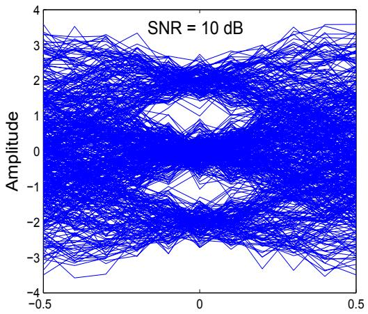  
(a) Time

  
(b) Time  
รูปที่ 5.24: ตัวอย่างแผนภาพดวงตาของช่องสัญญาณ $H ( D ) = 1 - D ^ { 2 }$ สำหรับ (a) SNR = 10 dB และ (b) SNR = 30 dB

## 5.3.2 การคำนวณหาค่าระดับความรุนแรงของ IS1

นอกจากการพิจารณาระดับความรุนแรงของ ISI โดยใช้แผนภาพดวงตาแล้ว ระดับความรุนแรงของ ISI ที่เกิดจากช่องสัญญาณ สามารถที่จะ คำนวณออกมาเป็นตัวเลขได้เช่นกัน ให้พิจารณาแบบจำลอง ระบบสื่อสารในรูปที่ 5.20 ข้อมูลเอาต์พุตของช่องสัญญาณ $r _ { k }$ สามารถเขียนเป็นสมการทางคณิตศาสตร์ ได้ ตามสมการ (5.69) นั่นคือ

$$
r _ { k } = a _ { k } * h _ { k } = \sum _ { i = 0 } ^ { \nu } a _ { k - i } h _ { i }
$$

ดังนั้น ค่าระดับความรุนแรงของ ISI สามารถหาได้จาก

$$
\xi = \frac { \sum _ { k } \left| h _ { k } \right| - \operatorname* { m a x } _ { k } \left| h _ { k } \right| } { \operatorname* { m a x } _ { k } \left| h _ { k } \right| }\tag{5.71}
$$

เมื่อ maxk $| h _ { k } |$ คือ ค่าสูงสุดของ $h _ { k }$ ที่เป็นไปได้ ถ้า $\xi = 0$ หมายถึง ช่องสัญญาณไม่ก่อให้เกิด IS1 แต่ถ้า $\xi > 0$ หมายถึง ช่องสัญญาณจะก่อให้เกิด ISI โดยที่ ค่า $\xi$ ที่ได้ยิ่งมาก แสดงว่าระดับความรุน แรงของ ISI ก็จะยิงมาก

ตัวอย่างที่ 5.10 จงพิจารณาว่าช่องสัญญาณใดก่อให้เกิด ISI มากกว่า ระหว่าง $H _ { 1 } ( D ) = 1 - D ^ { 2 }$ และ $H _ { 2 } ( D ) = 1 + D - D ^ { 2 } - D ^ { 3 }$

วิธีทำ จากที่โจทย์กำหนดให้ ช่องสัญญาณ $H _ { 1 } ( D )$ มีค่า - $\xi _ { 1 }$ คือ

$$
\xi _ { 1 } = \frac { ( | 1 | + | 0 | + | - 1 | ) - | 1 | } { | 1 | } = 1
$$

ในขณะที่ ช่องสัญญาณ $H _ { 2 } ( D )$ มีค่า 2 - $\xi _ { 2 }$ คือ

$$
\xi _ { 2 } = \frac { ( | 1 | + | 1 | + | - 1 | + | - 1 | ) - | 1 | } { | 1 | } = 3
$$

เนื่องจาก $\xi _ { 2 } > \xi _ { 1 }$ แสดงว่า ช่องสัญญาณ $H _ { 2 } ( D )$ ก่อให้เกิด ISI มากกว่าช่องสัญญาณ $H _ { 1 } ( D )$ ซึ่ง สามารถอธิบายได้ด้วยหลักความจริงทั่วไปที่ว่า ถ้ากำหนดให้ช่องสัญญาณ 2 ช่องสัญญาณมีพลังงาน เท่ากัน ช่องสัญญาณที่มีจำนวนแท็ป (หรือหน่วยความจำ) มาก ก็มีโอกาสที่จะก่อให้เกิด Iร1 มาก

## 5.3.3 ผลกระทบของ IS1 ต่ออัตราข้อผิดพลาดบิต

ในหัวข้อนี้จะ พิจารณาถึงผลกระทบของ ISI ต่ออัตราข้อผิดพลาดบิต6 (BER) ให้พิจารณาแบบจำลอง ระบบสื่อสารตามรูปที่ 5.20 โดยทั่วไป เมื่อ รNR ของระบบเพิ่มขึ้น ประสิทธิ ภาพรวมในรูปของ BER ก็จะลดลง ดังนั้น ถ้ากำหนดให้ระบบ A เป็นระบบที่ไม่มี ISI และมีประสิทธิภาพในรูปของ BER ตาม เส้นกราฟ A ในรูปที่ 5.25 ถ้าเพิ่มระดับความรุนแรงของสัญญาณรบกวนให้มากขึ้น ค่า BER ของ ระบบใหม่นี้ จะกลายเป็นเส้นกราฟ B ดังนั้น สมมุติว่า ถ้าต้องการรักษาระดับ BER ของระบบใหม่ให้ มีค่าเท่ากับ BER ของระบบเดิม เช่น ทีระดับ $\mathrm { B E R } = 1 0 ^ { - 5 }$ แสดงว่า จะต้องเพิ่ม รNR เข้าไปในระบบ ใหม่ให้มากขึ้น ตามทิศทางของลูกศรที่แสดงในรูปที่ 5.25(a) อย่างไรก็ตาม ถ้าในระบบมี IS1 (นั่นคือ $\nu > 0 )$ ค่า BER ของระบบที่ได้จะกลายเป็นเส้นกราฟ C ซึ่งหมายความว่า เมื่อ ระบบทำงานถึง BER ระดับหนึ่งแล้ว ไม่ว่าจะเพิ่ม รNR เข้าไปในระบบมากขึ้นเท่าใดก็ตาม ค่า BER ที่ได้ก็จะไม่ลดลง ซึ่ง ปรากฎการณ์ลักษณะนี้จะ เรียกกันว่า "พื้นข้อผิดพลาด (error floor)"

  
รูปที่ 5.25: อัตราข้อผิดพลาดบิต (BER) ของ (a) ระบบที่มีเฉพาะสัญญาณรบกวนอย่างเดียว และ (b) ระบบที่มีทั้งสัญญาณรบกวนและ IS1

โดยสรุปก็คือ ถ้าระบบถูกรบกวนโดยสัญญาณรบกวนเพียงอย่างเดียว (ไม่มี Iร1) เมื่อเพิ่ม SNR ของระบบ BER ก็จะลดลงเสมอ แต่ถ้าในระบบมี ISI เมื่อเพิ่ม SNR ของระบบ BER จะลดลงจนถึง ณ ระดับหนึ่งที่ซึ่งไม่ว่าจะเพิ่ม รNR เข้าไปในระบบมากขึ้นอีกเท่าใดก็ตาม BER ที่ได้ก็จะไม่ลดลง ดังนั้น จึงเป็นสิ่งสำคัญที่จะต้องหาวิธีในการกำจัดหรือลดผลกระทบของ ISI ในระบบให้ได้มากที่สุด เพื่อช่วยทำให้ระบบมีประสิทธิภาพมากขึ้น (เมื่อเพิ่ม รNR เข้าไปในระบบ) วิธี หนึ่งที่สามารถช่วยลด ผลกระทบของ ISI ได้ ก็คือ การใช้อีควอไลเซอร์ ซึ่งจะอธิบายต่อไปในหัวข้อที่ 5.6

## 5.4 ทฤษฎีบทของในควิตส์

ให้พิจารณาแบบจำลองช่องสัญญาณเสมือนจริง (realistic channel model) ในรูปที่ 5.26 เมื่อ $a _ { k }$ คือ ลำดับข้อมูลอินพุต, $G _ { t } ( f )$ คือ วงจรกรองภาคส่ง (tranรmitting filter) ในโดเมนความถี่, $G _ { c } ( f )$ คือ ช่องสัญญาณในโดเมนความถี่, $G _ { r } ( f )$ คือ วงจรกรองภาครับ (receiving filter) ในโดเมนความถี, และ พ(t) คือ สัญญาณรบกวน ถ้ากำหนดให้

$$
G ( f ) = G _ { t } ( f ) G _ { c } ( f ) G _ { r } ( f )\tag{5.72}
$$

  
รูปที่ 5.26: แบบจำลองช่องสัญญาณเสมือนจริง

คือ ผลตอบสนองรวมเชิงความถี่ของทั้งระบบ ซึ่งมีคู่การแปลงฟูเรียร์ในโดเมนเวลา คือ Q $g ( t )$ นั่นคือ $g ( t ) \Longleftrightarrow G ( f )$ จะได้ว่า สัญญาณ r(t) สามารถเขียนเป็นสมการทางคณิตศาสตร์ได้ ดังนี้

$$
r ( t ) = \sum _ { m } a _ { m } g ( t - m T ) + n ( t )\tag{5.73}
$$

เมื่อ $n ( t )$ คือ สัญญาณรบกวนที่ถูกกรองซึ่งมีผลการแปลงฟูเรียร์ คือ $\begin{array} { r } { N ( f ) = W ( f ) G _ { r } ( f ) } \end{array}$ , และ $W ( f )$ คือ ผลการแปลงฟูเรียร์ของ $w ( t )$

จากนั้น วงจรชักตัวอย่าง (sampler) ก็จะทำการชักตัวอย่างสัญญาณ $r ( t )$ ที่เวลา $t _ { k } = k T$ เมื่อ k เป็นเลขจำนวนเต็ม นั่นคือ

$$
\begin{array} { l c l } { { r _ { k } = r ( t ) | _ { t = k T } = r ( k T ) } } & { { = } } & { { \displaystyle \sum _ { m } a _ { m } g ( k T - m T ) + n ( k T ) } } \\ { { } } & { { = } } & { { \displaystyle a _ { k } g ( 0 ) + \sum _ { m \neq k } a _ { m } g ( k T - m T ) + n ( k T ) } } \end{array}\tag{5.74}
$$

ซื เมื่อ $n ( k T )$ คือ ขนาดของสัญญาณรบกวนที่เวลา $k T$ พจน์แรกทางด้านขวาของสมการ (5.74) ถือ ว่าเป็นข้อมูล ที่ระบบต้องการ ส่วนพจน์ที่สองทางด้านขวาของสมการ (5.74) คือ IS1 ที่เกิดขึ้นจาก ระบบ ในทางอุดมคติ วงจรภาครับต้องการให้สัญญาณเอาต์พุตของวงจรชักตัวอย่าง $r ( k T )$ มีค่าเท่า กับ $a _ { k } g ( 0 ) + n ( k T )$ (นั่นคือ ไม่มี 1S1) เพื่อที่ว่าจะได้สามารถใช้งานวงจรตรวจหาที่มีรูปแบบง่ายๆ เช่น วงจรตรวจหาขีดเริมเปลี่ยน สำหรับถอดรหัสข้อมูล $r _ { k }$ ซึ่งจะ ช่วยทำให้ประหยัดค่าใช้จ่ายในการ สร้างวงจรตรวจหาข้อมูล อย่างไรก็ตาม ความต้องการที่จะให้ $r ( k T ) = a _ { k } g ( 0 ) + n ( k T )$ จะเกิดขึ้น

ได้ ก็ต่อเมื่อ

$$
g ( k T ) = \left\{ \begin{array} { l l } { { 1 , } } & { { k = 0 } } \\ { { 0 , } } & { { \mathrm { e l s e } } } \end{array} \right.\tag{5.75}
$$

เท่า $\stackrel { \circ } { \mathbb { H } } \mathbb { H } ^ { 7 }$ เพราะว่า จะทำให้พจน์ที่สองทางด้านขวามือของสมการ (5.74) มีค่าเป็นค่าศูนย์

สัญญาณพัลส์ที่มีคุณสมบัติเป็นไปตามสมการ (5.75) จะ เรียกกันทั่วไปว่า "สัญญาณพัลส์ไนควิตส์ (Nyquist pนse)" โดยที่ สัญญาณ พัลส์ไในควิตส์ที่น่าสนใจในระบบสื่อสารสามารถแบ่งออกเป็น 3 แบบ คือ

1) สัญญาณพัลส์ในควิตส์อุดมคติ (ideal Nyquist pulse)

2) สัญญาณพัลส์ RC (raised-cosine)

3) สัญญาณพัลส์ RRC (root-raised cosine)

ซึ่งมีรายละเอียดังต่อไปนี้

## 5.4.1 สัญญาณพัลส์ในควิตส์อุดมคติ

สัญญาณพัลส์ไนควิตส์อุดมคติ $g _ { I } ( t )$ จะนิยามโดย

$$
g _ { I } ( t ) = \operatorname { s i n c } \left( { \frac { t } { T } } \right) = { \frac { \sin ( \pi t / T ) } { \pi t / T } }\tag{5.76}
$$

เมื่อ sinc(t) คือ ฟังก์ชันซิงก์ (sinc function) ซึ่งมีรูปร่างของสัญญาณ ดังที่แสดงในรูปที่ 5.27(ซ้าย) จะ เห็นได้ว่า สัญญาณ พัลส์ในควิตส์อุดมคติ $g _ { I } ( t )$ มีคุณสมบัติสอดคล้องกับข้อกำหนดตามสมการ (5.75) นั่นคือ e $g _ { I } ( k T ) = 1$ เมื่อ $k = 0$ และ $g _ { I } ( k T ) = 0$ เมื่อ k เป็นเลขจำนวนเต็มใดๆ ที่ไม่ เท่ากับค่าศูนย์ ถ้าใช้การแปลงฟูเรียร์ที่ต่อเนื่องทางเวลา (continuous-time Fourier transform) เพื่อ ทำการแปลงสัญญาณ $g _ { I } ( t )$ ให้เป็นสัญญาณในโดเมนความถี่ ผลลัพธ์ที่ได้ คือ

$$
G _ { I } ( f ) = T \Pi ( f T )\tag{5.77}
$$

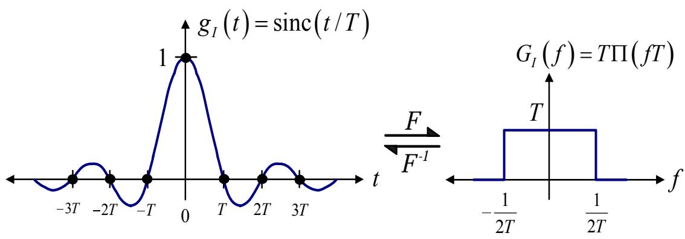  
รูปที่ 5.27: คู่การแปลงฟูเรียร์ของสัญญาณพัลส์ในควิตส์อุดมคติ

เมื่อ $\Pi ( f T )$ คือ สัญญาณพัลส์รูปสี่เหลี่ยมในโดเมนความถี่ ซึ่งนิยามโดย

$$
\Pi ( f T ) = { \left\{ \begin{array} { l l } { 1 , } & { - { \frac { 1 } { 2 T } } \leq f \leq { \frac { 1 } { 2 T } } } \\ { 0 , } & { { \mathrm { e l s e } } } \end{array} \right. }\tag{5.78}
$$

ดังแสดงในรูปที่ 5.27(ขวา)

สัญญาณ พัลส์ไในควิตส์ อุดมคติมีความสำคัญมากในเรื่องของ "กระบวนการสร้างสัญญาณแอนะ ล็อกให้กลับคืนมา (analog signal reconstruction)" ตัวอย่างเช่น ให้พิจารณาสัญญาณแอนะล็อก 3 สัญญาณ ในรูปที่5.28 คือ สัญญาณ A, B, และ C เมื่อ T คือ คาบเวลาของบิต ถ้าทำการชัก ตัวอย่างสัญญาณแอนะล็อกทั้งสามสัญญาณ ณ เวลา $t = k T$ เมือ k = 1, 2, 3, และ 4 แล้ว จะได้ ข้อมูลแซมเปิลออกมา 4 บิต คือ {1, 1, -1, 1} เหมือนกัน (ดูรูปที่ 5.28) อย่างไรก็ตาม ในทางกลับ กัน ถ้าต้องการสร้างสัญญาณแอนะล็อกจากข้อมูลแซมเปิล {1, 1, −1, 1} นี้ จะมีสัญญาณแอนะล็อก เพียงสัญญาณเดียวเท่านั้น ที่สามารถสร้างกลับคืนมาได้เหมือนเดิม โดยจะสอดคล้องกับทฤษฎีบท การชักตัวอย่าง ที่กล่าวไว้ว่า [9, 38] "ข้อมูลแซมเปิลที่ได้จากการชักตัวอย่างจะมีคุณสมบัติเที่ยบเท่า กับสัญญาณ แอนะล็อก ก็ต่อเมื่อ ความถี่การ ชัก ตัวอย่าง (sampling frequency) มีค่ามากกว่าหรือ เท่ากับสองเท่าของความถีสูงสุดของสัญญาณ แอนะล็อกนั้น" (ศึกษารายละเอียดได้ในหัวข้อที่ 5.5) ในทางปฏิบัติ สัญญาณ แอนะล็อกสามารถถูกสร้างกลับคืนมาได้จากข้อมูลแซมเปิล โดยการส่งข้อมูล แซมเปิลนั้นผ่านเข้าไปในวงจรกรองผ่านต่ำอุดมคติ (ideal low-pass filter) นั่นคือ เปรียบเสมือนกับ การนำข้อมูลแซมเปิลมาทำคอนโวลู ชันกับฟังก์ชันซิงก์ (สัญญาณพัลส์ไนควิตส์ อุดมคติ) รูปที่ 5.29 แสดงสัญญาณ แอนะล็อกที่สร้างจาก ข้อมูลแซมเปิล {1, 1, –1, 1} จะ เห็นได้ว่า สัญญาณ พัลส์ ที่เกิด จากข้อมูลบิตข้างเคียงจะไม่แทรกสอดกับสัญญาณพัลส์ของข้อมูลบิตที่ต้องการ ณ ตำแหน่งทีทำการ ซักตัวอย่าง ตราบใดที่ในระบบไม่มีจิตเตอร์ทางเวลา8 (timing jitter)

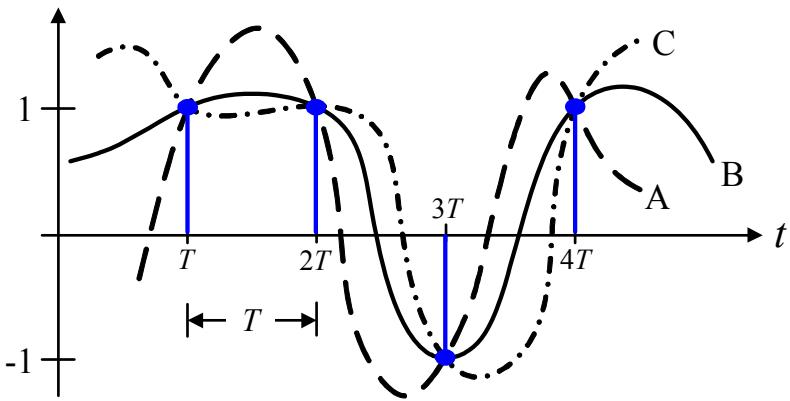  
รูปที่ 5.28: สัญญาณแอนะล็อก 3 สัญญาณ ที่ทำการชักตัวอย่าง ณ เวลา t = kT แล้วได้ข้อมูล แซมเปิล 4 บิต คือ {1, 1, −1, 1} เหมือนกัน

## 5.4.2 แบนด์วิดท์ที่น้อยที่สุดทางทฤษฎี

แบนด์วิดท์ (baทฝพdth)ของสัญญาณ คือ ช่วงของแถบความถี่ด้านบวกที่มีขนาดของสเปกตรัมเชิง แอมพลิจูดไม่เท่ากับค่าศูนย์ มีหน่วยเป็นเฮิรตซ์ (Hz: hertz) ตัวอย่างเช่น พิจารณาจากรูปที่ 5.30 จะ ได้ว่า แบนด์วิดท์ของสัญญาณแถบความถี่ฐาน (baseband signal) คือ $W = f _ { \mathrm { m a x } }$ และแบนด์วิดท์ 6ร ของสัญญาณผ่านแถบ (bandpass signal) คือ $W = 2 f _ { \operatorname* { m a x } }$ นอกจากนี้ แบนด์วิดท์ของสัญญาณ ยังสามารถที่จะนิยามได้หลายแบบ โดยจะขึ้นอยู่กับเงื่อนไขที่กำหนดมาให้ เช่น แบนด์วิดท์แบบศูนย์ ถึงศูนย์ (null-to-null bandwidth), แบuด์วิดท์แบบ 3 dB (3-dB bandwidth), หรือแบนด์วิดท์แบบ ครึ่งกำลัง (half-power bandwidth) เป็นต้น ดังนั้น ในการที่จะหาแบนด์วิดท์ของสัญญาณ จะต้องระบุ เงื่อนไขของแบนด์วิดท์ให้ชัดเจนก่อนว่าต้องการแบนด์วิดท์แบบใด เนื่องจาก แบนด์วิดท์แต่ละประเภท จะมีค่าต่างกัน

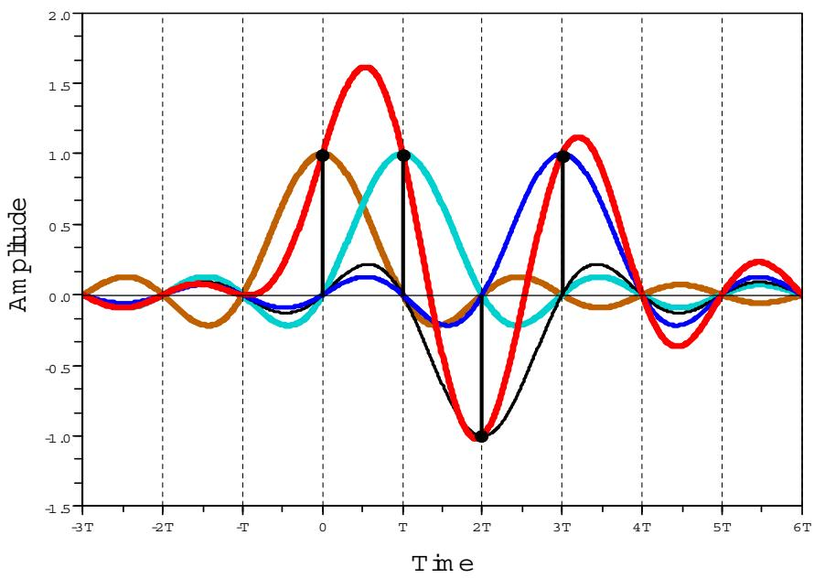  
รูปที่ 5.29: ผลรวมของสัญญาณพัลส์ในควิตส์อุดมคติหลายๆ สัญญาณที่ห่างกันหนึ่งบิตเซลล์ 1

  
รูปที่ 5.30: แบนด์วิดท์ของ (ซ้าย) สัญญาณแถบความถี่ฐาน และ (ขวา) สัญญาณผ่านแถบ

ในหนังสือเล่มนี้ จะพิจารณาเฉพาะ แบนด์วิดท์แบบศูนย์ถึงศูนย์เท่านั้น ให้พิจารณาสัญญาณพัลส์ ญ ที่ใช้ในระบบสื่อสาร ตามรูปที่ 5.27 ในทางทฤษฎี [9] จะได้ว่ "แบนด์วิดท์ที่น้อยที่สุด (min่imum bandwidth)," $W _ { 0 }$ , ในการที่จะตรวจหา (detect) ข้อมูลที่ถูกส่งด้วยอัตราเร็ว $R _ { s }$ สัญลักษณ์ต่อวินาที (symbol per second) โดยปราศจาก ISI คือ

$$
W _ { 0 } = \frac { R _ { s } } { 2 } \quad ( \mathrm { H z } )\tag{5.79}
$$

เมื่อ $R _ { s } = 1 / T$ และ $T$ คือ คาบเวลาของสัญลักษณ์ (symbol period) นอกจากนี้ ในการพิจารณา ว่าแบนด์วิดท์ของแต่ละระบบได้ถูกใช้งานอย่างคุ้มค่าหรือไม่ สามารถพิจารณาได้จาก "ประสิทธิภาพ แบนด์วิดท์ (bandwidth efficiency)," η, ซึ่งนิยามโดย

$$
\eta = \frac { R _ { s } } { W _ { 0 } }\tag{5.80}
$$

มีหน่วยเป็น บิตต่อวินาทีต่อเฮิรตซ์(bits/second/hertz) กล่าวคือ ถ้าระบบมีค่า $\eta$ มาก ก็แสดงว่ามี การใช้งานแบนด์วิดท์ของระบบอย่างคุมค่า ตัวอย่างเช่น สัญญาณพัลส์ในควิตส์อุดมคติจะมีแบนด์วิดท์ ที่น้อยที่สุดเท่ากับ

$$
W _ { 0 } = { \frac { 1 } { 2 T } } = { \frac { R _ { s } } { 2 } } \quad \mathrm { ( H z ) }
$$

และมีประสิทธิภาพแบนด์วิดท์เท่ากับ

$$
\eta = \frac { R _ { s } } { ( R _ { s } / 2 ) } = 2 \mathrm { ( b i t s / s e c o n d / H z ) }
$$

## 5.4.3 สัญญาณพัลส์ RC

ในทางปฏิบัติ สัญญาณพัลส์ไในควิตส์อุดมคติไม่สามารถที่จะ ถูกสร้างจากวงจรอิเล็กทรอนิกส์ใดๆ ได้ เนื่องจาก สัญญาณในโดเมนความถี่ $G _ { I } ( f )$ มีการเปลี่ยนแปลงอย่างฉับพลัน และสัญญาณในโดเมน เวลา $g _ { I } ( t )$ มีค่าตลอดช่วงเวลา $- \infty < t < \infty$ ดังแสดงในรูปที่ 5.27 วิธีการแก้ปัญหานี้คือ ยอม ให้สัญญาณ $G _ { I } ( f )$ มีการเปลี่ยนแปลงอย่างช้าๆ ซึ่งจะสอดคล้องกับสัญญาณที่เรียกกันว่า "สัญญาณ พัลส์ RC (raised-cosine pulse)," $G _ { R C } ( f )$ , ซึ่งนิยามโดย

$$
G _ { R C } = \left\{ \begin{array} { l l } { 1 , } & { | f | < 2 W _ { 0 } - W } \\ { \cos ^ { 2 } \left( \frac { \pi } { 4 } \frac { | f | + W - 2 W _ { 0 } } { W - W _ { 0 } } \right) , } & { 2 W _ { 0 } - W < | f | < W } \\ { 0 , } & { | f | > W } \end{array} \right.\tag{5.81}
$$

  
รูปที่ 5.31: คู่การแปลงฟูเรียร์ของสัญญาณพัลส์ RC

เมื่อ $W _ { 0 } = 1 / ( 2 T )$ คือ แบนด์วิดท์ไนควิตส์ที่น้อยสุด, $W$ คือ แบนด์วิดท์สัมบูรณ์ (absolute bandwidth) ซึ่งมีค่าเท่ากับ $W _ { 0 } \leq W \leq 2 W _ { 0 } , W - W _ { 0 }$ คือ แบuด์วิดท์เกิน (excess bandwidth), และ $r = ( W - W _ { 0 } ) / W _ { 0 }$ คือ ตัวประกอบโรลล์ออฟ (roll-off factor) ซึ่งมีค่า $0 \leq r \leq 1$

รูปที่ 5.31(บน) แสดงรูปร่างของสัญญาณ $G _ { R C } ( f )$ จะเห็นได้ว่า เมื่อ $r = 0$ จะได้เป็นสเปกตรัม รูปสี่เหลี่ยมรูปเดียวกันกับสเปกตรัมของสัญญาณพัลส์ไในควิตส์อุดมคติ นอกจากนี้จะได้ว่า ผลการ แปลงฟูเรียร์ผกผันของ $G _ { R C } ( f )$ คือ

$$
g _ { R C } ( t ) = 2 W _ { 0 } \operatorname { s i n c } ( 2 W _ { 0 } t ) { \frac { \cos [ 2 \pi ( W - W _ { 0 } ) t ] } { 1 - [ 4 ( W - W _ { 0 } ) t ] ^ { 2 } } }\tag{5.82}
$$

ซึ่งมีรูปร่างตามรูปที่ 5.31(ล่าง) สำหรับสัญญาณพัลส์ RC แบนด์วิดท์สัมบูรณ์จะมีค่าเท่ากับ

$$
W = { \frac { R _ { s } } { 2 } } ( 1 + r ) \quad \mathrm { ( H z ) }\tag{5.83}
$$

ตัวอย่างที่ 5.11 ระบบโทรศัพท์จะทำการรับและส่งสัญญาณเสียงที่มีแบนด์วิดท์เท่ากับ 3500 เฮิรตซ์ จงหาอัตราการส่งข้อมูล ถ้ากำหนดให้รูปร่างของสัญญาณไบนารี (ที่ได้จากการแปลงสัญญาณเสียง เป็นลำดับ PCM แล้ว) มีรูปร่างเป็นสัญญาณพัลส์ RC และมีค่าตัวประกอบโรลล์ออฟเท่ากับ $r = 0 . 2 5$

วิธีทำ อัตราการส่งข้อมูล $R _ { s }$ สามารถหาได้จากสมการ (5.83) นั้นคือ

$$
R _ { s } = { \frac { 1 } { T } } = { \frac { 2 W } { 1 + r } } = { \frac { 2 ( 3 5 0 0 ) } { 1 + 0 . 2 5 } } = 5 6 0 0 \quad { \mathrm { b p s } }
$$

## 5.4.4 สัญญาณพัลส์ RRC

พิจารณาจากรูปที่ 5.26 การที่จะทำให้ $G ( f ) = G _ { t } ( f ) G _ { c } ( f ) G _ { r } ( f )$ มีผลตอบสนองเชิงความถี่เป็น $G _ { I } ( f )$ หรือ $G _ { R C } ( f )$ ทำได้ยาก เนื่องจาก ในทางปฏิบัติ ไม่สามารถทราบได้แน่นอนว่าช่องสัญญาณ $G _ { c } ( f )$ มีผลตอบสนองเชิงความถี่เป็นอย่างไร ดังนั้น สิ่งที่สามารถจะทำได้ คือ การออกแบบ Q $G _ { t } ( f )$ และ $G _ { r } ( f )$ เพื่อให้ผลตอบสนองเชิงความถี $G _ { t } ( f ) G _ { r } ( f )$ มีค่าเท่ากับ

$$
G _ { t } ( f ) G _ { r } ( f ) = G _ { R C } ( f )\tag{5.84}
$$

o ด บ $G _ { t } ( f ) = G _ { r } ( f )$ V เพราะฉะนัน ถ้าก่าหนดให้ จะได้ว่า

$$
G _ { t } ( f ) = G _ { r } ( f ) = \sqrt { G _ { R C } ( f ) }\tag{5.85}
$$

ซึ่งจะเรียกันทั่วไปว่า ผลตอบสนองเชิงความถี่ของสัญญาณพัลส์ RRC

หลังจากที่ออกแบบให้ $G _ { t } ( f ) G _ { r } ( f ) \ = \ G _ { R C } ( f )$ แล้ว ก็จะ เหลือเพียงช่องสัญญาณ $G _ { c } ( f )$ ที่จะ ต้องหาวิธีในการทำให้ผลตอบสนองรวมของทั้งระบบมีลักษณะ เป็นสัญญาณพัลส์ในควิตส์ ซึ่ง วิธีการที่ใช้กันทั่วไปในทางปฏิบัติ คือการนำอีควอไลเซอร์มาใช้ในการจัดการกับช่องสัญญาณ (ศึกษา รายละเอียดได้ในหัวข้อที่ 5.6) เพื่อทำให้ $G ( f ) = G _ { t } ( f ) G _ { c } ( f ) G _ { r } ( f )$ มีค่าเท่ากับผลตอบสนองเชิง ความถี่ของสัญญาณพัลส์ไในควิตส์

  
รูปที่ 5.32: ลักษณะของสัญญาณที่มีแถบความถี่จำกัด

## 5.5ทฤษฎีบทการชักตัวอย่าง

ทฤษฎีบทการ ชัก ตัวอย่าง ของไน ควิตส์ (Nyquist's sampling theorem) จะ กล่าวถึง เงื่อนไขที่ทำ ให้ข้อมูล แซมเปิล ที่ได้จากการ ชักตัวอย่างสัญญาณแอนะล็อกไม่มีการสูญเสียข่าวสาร ดังนั้น ข้อมูล แซมเปิล นี้จึงสามารถ นำมาสร้างกลับคืนเป็นสัญญาณแอนะล็อกได้เหมือนเดิม โดยไม่มีข้อผิดพลาด เกิดขึ้น การที่จะทำเช่นนี้ได้นั้น สัญญาณแอนะ ล็อกจะต้องเป็น "สัญญาณที่มีแถบความถี่จำกัด (bandlimited รigกลl)" และ ความถีการชักตัวอย่างจะ ต้องมากกว่าหรือเท่ากับสองเท่าของความถี่สูงสุดของ สัญญาณแอนะล็อก

ถ้ากำหนดให้ $x ( t )$ คือ สัญญาณแอนะล็อกที่เป็นฟังก์ชันของค่าจริง โดยมีผลการแปลงฟูเรียร์เท่า กับ $X ( f )$ ดังนั้น สัญญาณ $x ( t )$ จะถูกเรียกว่าเป็นสัญญาณที่มีแถบความถี่จำกัด ก็ต่อเมื่อ

$$
X ( f ) = 0 , \quad | f | > f _ { \operatorname* { m a x } }\tag{5.86}
$$

เมื่อ $f _ { \mathrm { m a x } }$ คือ ความถี่ สูงสุดของสัญญาณ $x ( t )$ ดังแสดงในรูปที่ 5.32 ดังนั้น ถ้าต้องการให้ข้อมูล แซมเปิลที่ได้จากการชักตัวอย่างมีคุณสมบัติเทียบเท่ากับสัญญาณแอนะล็อก จะต้องทำการชักตัวอย่าง สัญญาณ x(t) ด้วยความถี

$$
f _ { s } \geq 2 f _ { \operatorname* { m a x } }\tag{5.87}
$$

เมื่อ $f _ { s } = 1 / T _ { s }$ คือ ความถีการชักตัวอย่าง และ $T _ { s }$ คือ คาบการชักตัวอย่าง (ช่วงเวลาระหว่างข้อมูล แซมเปิลที่ติดกัน) กล่าวคือ ข้อมูลแซมเปิล $\{ x _ { k } \} = \{ x ( k T _ { s } ) \}$ จะมีคุณสมบัติเทียบเท่ากับสัญญาณ x(t) จากสมการ (5.87) ความถีการชักตัวอย่างต่ำสุด จะถูกเรียกว่า "ความถี่ไในควิตส์ (Nyqนist frequency)" นันคือ $f _ { N } = 2 f _ { \operatorname* { m a x } }$ แต่ถ้าทำการชักตัวอย่างสัญญาณ x(t) ด้วยความถี $f _ { s } < 2 f _ { \operatorname* { m a x } }$ จะก่อให้เกิดปรากฎการณ์ที่เรียกว่า "ความผิดเพี้ยนภาพ (aliลร์ing)" ซึ่งเป็นสิ่งที่ไม่ต้องการในทุกงาน ประยุกต์ เนื่องจาก ข้อมูลแซมเปิลที่ได้จะมีการสูญเสียข่าวสาร กล่าวคือ เมื่อนำข้อมูลแซมเปิลที่ได้จาก การชักตัวอย่างที่ความถี่ $f _ { s } < 2 f _ { \operatorname* { m a x } }$ มาสร้างกลับคืนให้เป็นสัญญาณแอนะล็อก สัญญาณแอนะล็อก ที่ได้จะมีรูปร่างผิดเพี้ยนไปจากของเดิม (ศึกษารายละเอียดเพิ่มเติมได้ในหัวข้อที่ 5.5.3)

ทฤษฎีบทการชักตัวอย่างถูกนำมาใช้งานในหลายๆ ด้าน ตัวอย่างเช่น

ระบบเสียงดิจิทัลของแผ่นซีดี (CD: compact disc)ความถี่สูงสุดของสัญญาณที่ต้องการจะ บันทึกลงไปในแผ่นซีดีเพลงมีค่าเท่ากับ 20 KHz (กิโลเฮิรตซ์) แต่ระบบใช้ความถี่การชักตัวอย่าง เท่ากับ 44.1 หHz เนื่องจาก อัตราการชักตัวอย่างในควิตส์ คือ $2 \times 2 0 = 4 0$ kHz แสดงว่า ระบบจะสำรองแบนด์วิดท์ไว้ 4.1 kHz สำหรับทำหน้าที่เป็น แถบป้องกัน (guard band)

ระบบโทรศัพท์ สัญญาณเสียง (speech signal) มีแบนด์วิดท์เท่ากับ 3.4 kHz และระบบ โทรศัพท์ใช้ความถี่การชักตัวอย่างเท่ากับ 8 kHz เนื่องจาก อัตราการชักตัวอย่างในควิตส์ คือ 2 × 3.4 = 6.8 kHz แสดงว่า ระบบจะสำรองแบนด์วิดท์ไว้ 1.2 kHz สำหรับทำหน้าที่เป็นแถบ ป้องกัน

ตัวอย่างที่ 5.12 กำหนดให้สัญญาณ x(t) = 10 cos(2000πt) cos(8000πt) จงหาความถี่การชัก ตัวอย่างต่ำสุดที่สอดคล้องกับทฤษฎีบทการชักตัวอย่าง

วิธีทำ สัญญาณ x(t) สามารถจัดรูปใหม่ได้เป็น

$$
\begin{array} { l c l } { x ( t ) } & { = } & { 1 0 \cos ( 2 0 0 0 \pi t ) \cos ( 8 0 0 0 \pi t ) } \\ { } & { } & { } \\ { } & { = } & { 5 \cos ( 6 0 0 0 \pi t ) + 5 \cos ( 1 0 0 0 0 \pi t ) } \\ { } & { } & { } \\ { } & { = } & { 5 \cos ( 2 \pi ( 3 0 0 0 ) t ) + 5 \cos ( 2 \pi ( 5 0 0 0 ) t ) } \end{array}
$$

จะเห็นได้ว่า ความถี่สูงสุดของสัญญาณ x(t) คือ 5000 เฮิรตซ์ ดังนั้น ความถี่ การชักตัวอย่างต่ำสุด หรือความถี่ไนควิตส์ จะมีค่าเท่ากับ $f _ { N } = 2 f _ { \mathrm { m a x } } = 2 \times 5 0 0 0 = 1 0 0 0 0$ เฮิรตซ์

## 5.5. ทฤษฎีบทการชักตัวอย่าง

## 5.5.1 กระบวนการชักตัวอย่าง

หลักการทำงานของกระบวนการชักตัวอย่างสามารถที่จะถูกอธิบายได้โดยอาศัยสมการทางคณิตศาสตร์ ดังต่อไปนี้ ข้อมูลแซมเปิล $\{ x _ { k } \}$ ที่ได้จากการชักตัวอย่างสัญญาณแอนะล็อก $x ( t )$ สามารถเขียนให้อยู่ ในรูปของ ผลคูณระหว่างสัญญาณ $x ( t )$ และ ขบวนสัญญาณอิมพัลส์เดลตา (delta impulse train) นั่นคือ

$$
\begin{array} { r c l } { { \{ x _ { k } \} } } & { { = } } & { { \displaystyle x ( t ) \times \sum _ { m = - \infty } ^ { \infty } \delta ( t - m T _ { s } ) } } \\ { { } } & { { = } } & { { \displaystyle \sum _ { m = - \infty } ^ { \infty } x ( m T _ { s } ) \delta ( t - m T _ { s } ) } } \end{array}\tag{5.88}
$$

เนื่องการ คู่การแปลงฟูเรียร์ของขบวนสัญญาณอิมพัลส์เดลตา คือ

$$
\sum _ { m = - \infty } ^ { \infty } \delta ( t - m T _ { s } ) \Longleftrightarrow \frac { 1 } { T _ { s } } \sum _ { k = - \infty } ^ { \infty } \delta ( f - k f _ { s } )\tag{5.89}
$$

เมื่อ $T _ { s } = 1 / f _ { s }$ และอาศัยหลักความจริงที่ว่า การคูณกันของสัญญาณในโดเมนเวลามีค่าเท่ากับการ

$$
X ( e ^ { j \omega } ) ~ = ~ X ( f ) * \frac { 1 } { T _ { s } } \sum _ { k = - \infty } ^ { \infty } \delta ( f - k f _ { s } )\tag{5.90}
$$

$$
= \ \frac { 1 } { T _ { s } } \sum _ { k = - \infty } ^ { \infty } X ( f - k f _ { s } )\tag{5.91}
$$

เมื่อ $\omega = 2 \pi f$ คือ ความถี่เชิงมุม จากสมการ (5.91) จะพบว่า สเปกตรัมของผลลัพธ์ที่ได้จากการ ชักตัวอย่าง $X ( e ^ { j \omega } )$ มีค่าเท่ากับ สเปกตรัมของสัญญาณ $X ( f )$ ที่ถูกถ่วงน้ำหนักด้วยตัวประกอบการ คูณเท่ากับ $1 / T _ { s }$ ที่ซ้ำกันไปเรื่อยๆ โดยมีระยะห่างกันเท่ากับ $f _ { s }$ เฮิรตซ์ $\mathfrak { J } ^ { \mathrm { q l } } \overset { \mathrm { d } } { \underset { \mathfrak { V } } { \mathrm { ~ } } }$ 5.33 แสดงขั้นตอนการ ชักตัวอย่างสัญญาณแอนะล็อกในโดเมนเวลาและในโดเมนความถี่

## 5.5.2 กระบวนการสร้างสัญญาณแอนะล็อกให้กลับคืนมา

กำหนดให้สัญญาณแอนะล็อก $x ( t )$ มีแถบความถีจำกัด และมีผลการแปลงฟูเรียร์เท่ากับ $X ( f )$ ตาม รูปที่ 5.32 ถ้าความถี่ที่ใช้ในการชักตัวอย่างสัญญาณ $x ( t )$ มีค่าเท่ากับ $f _ { s } \geq 2 f _ { \operatorname* { m a x } }$ ข้อมูลแซมเปิล

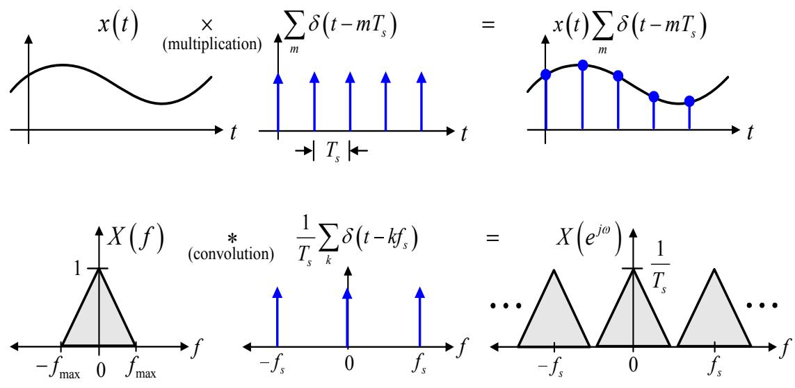

รูปที่ 5.33: กระบวนการชักตัวอย่างในโดเมนเวลา (บน) และโดเมนความถี่ (ล่าง)  
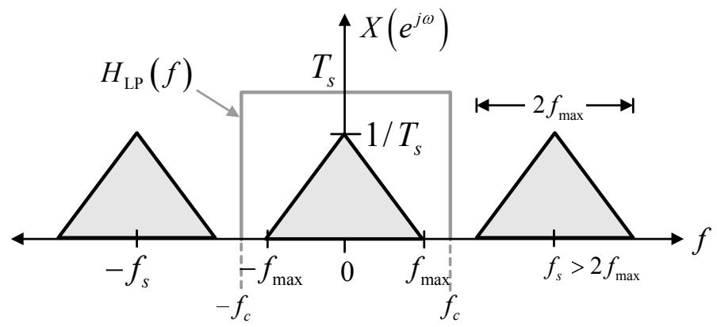  
รูปที่ 5.34: สเปกตรัมของ ข้อมูลแซมเปิล $\{ x _ { k } \}$ ที่ได้จากการชักตัวอย่าง สัญญาณ $x ( t )$ ที่ความถี่ $f _ { s } \geq 2 f _ { \operatorname* { m a x } }$ พร้อมทั้งแสดงขั้นตอนการสร้างสัญญาณแอนะล็อกให้กลับคืนมา

$\{ x _ { k } \}$ ที่ได้จะมีสเปกตรัม $X ( e ^ { j \omega } )$ ตามรูปที่ 5.34

กระบวนการสร้างสัญญาณ แอนะล็อกให้กลับคืนมา (signal reconstruction process)คือ การ สร้างสัญญาณแอนะล็อก $\tilde { { \boldsymbol { x } } } ( t )$ จากข้อมูลแซมเปิล $\{ x _ { k } \}$ ดังแสดงในรูปที่ 5.35 โดยที่ ถ้าความถี่การ

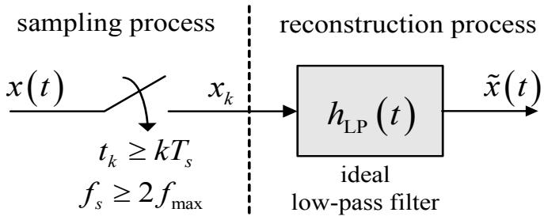  
รูปที่ 5.35: กระบวนการชักตัวอย่างและกระบวนการสร้างสัญญาณแอนะล็อกให้กลับคืนมา

ชักตัวอย่างที่ใช้มีค่า $f _ { s } \geq 2 f _ { \operatorname* { m a x } }$ แล้ว จะสามารถทำให้สัญญาณ $\tilde { { \boldsymbol { x } } } ( t ) = { \boldsymbol { x } } ( t )$ ได้ โดยการนำข้อมูล แซมเปิล $\{ x _ { k } \}$ ไปผ่านวงจรกรองผ่านต่ำอุดมคติที่มีผลตอบสนองอิมพัลส์ เท่ากับ

$$
h _ { \mathrm { L P } } ( t ) = \operatorname { s i n c } \left( \frac { \pi t } { T _ { s } } \right) = \frac { \sin ( \pi t / T _ { s } ) } { \pi t / T _ { s } }\tag{5.92}
$$

และมีผลการแปลงฟูเรียร์ คือ

$$
\begin{array} { r } { H _ { \mathrm { L P } } ( f ) = T _ { s } \Pi ( T _ { s } f ) = \left\{ \begin{array} { l l } { T _ { s } , } & { | f | \leq \frac { f _ { s } } { 2 } } \\ { 0 , } & { \mathrm { e l s e } } \end{array} \right. } \end{array}\tag{5.93}
$$

กล่าวคือ ความถี่ตัดของวงจรกรองผ่านต่ำอุดมคติที่ใช้ จะต้องมีค่าเท่ากับ

$$
f _ { c } = f _ { s } / 2 \quad \mathrm { ( H z ) }\tag{5.94}
$$

หลักการทำงานของกระบวนการสร้างสัญญาณ แอนะล็อกให้กลับคืนมา สามารถที่จะ อธิบายใน โดเมนความถี่ได้ดังต่อไปนี้ สัญญาณ $\tilde { { \boldsymbol { x } } } ( t ) = { \boldsymbol { x } } ( t )$ ก็ต่อเมื่อ สัญญาณ ${ \tilde { x } } ( t )$ มีผลการแปลงฟูเรียร์ เท่ากับ $X ( f )$ ตามรูปที่ 5.32 เพราะฉะนั้น สเปกตรัม $X ( e ^ { j \omega } )$ ในรูปที่ 5.34 จะมีค่าเท่ากับ $X ( f )$ ได้ ก็ต่อเมื่อ นำ $X ( e ^ { j \omega } )$ มาคูณกับ $H _ { \mathrm { L P } } ( f )$ นั่นคือ

$$
X ( f ) = X ( e ^ { j \omega } ) \times H _ { \mathrm { L P } } ( f )\tag{5.95}
$$

เมื่อ $\begin{array} { r c l } { H _ { \mathrm { L P } } ( f ) } & { = } & { T _ { s } \Pi ( T _ { s } f ) } \end{array}$ ตามสมการ (5.93) และมีผลการแปลงฟูเรียร์ผกผัน $h _ { \mathrm { L P } } ( t ) =$ sin $( \pi t / T _ { s } ) / ( \pi t / T _ { s } )$ ตามสมการ (5.92) โดยอาศัย หลัก ความจริงที่ว่า การคูณกันของสัญญาณใน

โดเมนความถี่จะมีค่าเท่ากับการทำคอนโวลูชันของสัญญาณในโดเมนเวลา เพราะฉะนั้น ผลการแปลง ฟูเรียร์ผกผันของสมการ (5.95) คือ

$$
\begin{array} { r c l } { x ( t ) } & { = } & { \displaystyle \sum _ { m = - \infty } ^ { \infty } x ( m T _ { s } ) \delta ( t - m T _ { s } ) * \mathrm { s i n c } ( \pi t / T _ { s } ) } \\ & { = } & { \displaystyle \sum _ { m = - \infty } ^ { \infty } x ( m T _ { s } ) \mathrm { s i n c } \left( \frac { \pi ( t - m T _ { s } ) } { T _ { s } } \right) } \end{array}\tag{5.96}
$$

(5.97)

สมการ (5.96) หมายถึง การส่งข้อมูลแซมเปิล $\{ x _ { k } \}$ ผ่านเข้าไปในวงจรกรองผ่านต่ำอุดมคติ แล้วได้ สัญญาณเอาต์พุตออกมาเป็นสัญญาณ $x ( t )$ ตามรูปที่ 5.35 (นั่นคือ สัญญาณ $x ( t )$ ได้มาจากการทำ คอนโวลูชันระหว่างข้อมูลแซมเปิล $\{ x _ { k } \}$ และผลตอบสนองอิมพัลส์ของวงจรกรองผ่านตำอุดมคติ) ใน ขณะที่สมการ (5.97) จะ เรียกกันว่า "สูตรการประมาณค่าในช่วงของในควิตส์และแชนนอน (Nyquist-Shannon interpolation formula)" ซึ่งมีความหมายคือ ข้อมูลแต่ละ แซมเปิลจะ ถูก คูณ ด้วยฟังก์ชัน ซิงก์ โดยที่ จุดศูนย์กลางของฟังก์ชันซิงก์จะถูกเลื่อนออกไป ตามเวลาของแต่ละแซมเปิล จากนั้น ก็นำ ญ สัญญาณทั้งหมดมารวมกันเป็นสัญญาณเดียว ดังตัวอย่างที่แสดงในรูปที่ 5.29

## 5.5.3ความผิดเพียนภาพ

ความผิด เพี้ยน ภาพ (aliaรing) เกิดจากการใช้ความถี่การชักตัวอย่าง $f _ { s }$ น้อยกว่าสองเท่าของความ ถี่สูงสุดของสัญญาณแอนะล็อก หรือการใช้ความถี่การ ชักตัวอย่างน้อยกว่าความถี่ไนควิตส์ นั่นคือ $f _ { s } ~ < ~ f _ { N }$ เมื่อ $f _ { N } ~ = ~ 2 f _ { \mathrm { m a x } }$ รูปที่ 5.36 แสดงความผิดเพี้ยนภาพซึ่งเกิดจากการใช้ความถี่การ ชักตัวอย่าง $f _ { s } ~ < ~ 2 f _ { \operatorname* { m a x } }$ จะเห็นได้ว่า เมื่อใช้ $f _ { s } ~ < ~ 2 f _ { \operatorname* { m a x } }$ สเปกตรัมของสัญญาณที่ได้จากการ ชักตัวอย่างสัญญาณจะซ้อนเหลื่อมกันทำให้เกิดความผิดเพี้ยนภาพ ซึ่งจะส่งผลทำให้เมื่อต้องการที่จะ สร้างสัญญาณ แอนะล็อกให้กลับคืนมาจาก ข้อมูลแซมเปิล ที่ได้จากการ ชัก ตัวอย่างด้วยความถี $f _ { s } \ <$ $2 f _ { \mathrm { m a x } }$ สัญญาณแอนะล็อกที่ได้จะมีรูปร่างผิดเพี้ยนไปจากของเดิม

รูปที่ 5.37 แสดงตัวอย่างการชักตัวอย่างสัญญาณ $x ( t ) = \cos ( 2 \pi f t )$ เมื่อ $f = 1$ เฮิรตซ์ ด้วย ความถีการชักตัวอย่าง $f _ { s } = 1 . 5$ เฮิรตซ์ และ $f _ { s } = 4$ เฮิรตซ์ จากรูปที่ 5.37(a) ถ้าทำการชักตัวอย่าง สัญญาณโดยใช้ $f _ { s } < 2 f _ { \operatorname* { m a x } }$ เมื่อสร้างสัญญาณ แอนะล็อกให้กลับคืนมาจาก ข้อมูลแซมเปิล $\{ x _ { k } \}$ สัญญาณแอนะล็อกที่ได้จะรูปร่างไม่เหมือนเดิม (เกิดความผิดเพี้ยนภาพขึ้น) อย่างไรก็ตาม ถ้าทำการ ชัก ตัวอย่างสัญญาณโดยใช้ $f _ { s } \ \ge \ 2 f _ { \mathrm { m a x } }$ สัญญาณ แอนะล็อกที่สร้างกลับคืนมาจาก ข้อมูลแซมเปิล $\{ x _ { k } \}$ ก็จะ เหมือนเดิม ตามที่แสดงรูปที่ 5.37(b) เพราะฉะนั้น ความผิดเพี้ยนภาพจึงเป็นสิ่งที่ต้อง หลีกเลี่ยงในงานประยุกต์ทุกประเภท โดยทั่วไป วิธีการป้องกันการเกิดความผิดเพี้ยนภาพสามารถทำ ได้หลายวิธี เช่น

  
$f _ { s } < 2 f _ { \operatorname* { m a x } }$

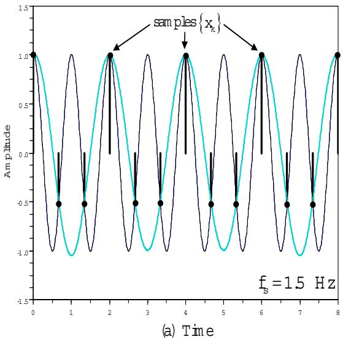  
Anabg signal x(t) = cos( 2π f) , f= 1 H z

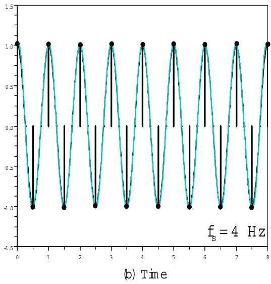  
Reconstucted signal fom  
รูปที่ 5.37: ตัวอย่างการชักตัวอย่างสัญญาณ x(t) ที่มีความถี่ 1 เฮิรตซ์ ด้วยความถี่ (a) $f _ { s } = 1 . 5$ เฮิรตซ์ (เกิดความผิดเพี้ยนภาพ) และ (b) $f _ { s } = 4$ เฮิรตซ์ (ไม่เกิดความผิดเพี้ยนภาพ)

  
รูปที่ 5.38: แบบจำลองช่องสัญญาณพร้อมอีควอไลเซอร์

เพิ่มความถี่การชักตัวอย่าง (เพิ่ม $f _ { s } )$

ใช้วงจรกรองต่อต้านความผิดเพี้ยนภาพ (anti-aliasing filter)

หมายเหตุ ในทางปฏิบัติ วงจรภาครับ (recยเver) ของระบุบสื่อสารทั่วไป (รวมทั้งของฮาร์ดดิสก์ไดรฟ์) จะใช้วงจรกรองผ่านต่ำที่มีความถี่ตัดเท่ากับ $f _ { c }$ เฮิรตซ์ เพื่อทำหน้าที่ในการกำจัดสัญญาณรบกวนที่อยู ภายนอกช่วงแถบความถี่ $f _ { c }$ ให้หมดไป นอกจากนี้ วงจรกรองผ่านต่ำยังช่วยทำหน้าที่ในการจำกัดแถบ ความถี่ของสัญญาณที่ได้รับให้อยู่ภายในช่วงแถบความถี่ $f _ { c }$ เพื่อที่จะทำให้สามารถกำหนดความถี่การ ชักตัวอย่าง $f _ { s }$ ที่เหมาะสมได้ (นั่นคือ $f _ { s } \geq 2 f _ { c } )$ เพื่อป้องกันการเกิดความผิดเพี้ยนภาพที่วงจรชัก ตัวอย่าง

## 5.6 อีควอไลเซอร์

อีควอไลเซอร์ (eqนลlizer) ทำหน้าที่ได้หลายลักษณะ ได้แก่ ช่วยในการปรับรูปร่างหรือคุณลักษณะ ของสัญญาณที่ได้รับให้เป็นไปตามที่ระบบต้องการ, ช่วยลดผลกระทบของ IS1 ที่แฝงอยู่ในสัญญาณ ที่ได้รับ, หรือช่วยลดผลกระทบที่เกิดจากความผิดเพี้ยนแบบเชิงเส้น เป็นต้น ให้พิจารณาแบบจำลอง ช่องสัญญาณในรูปที่5.38 และสมมุติว่าระบบนี้มีคุณสมบัติสเตชันเนรีแบบไวด์เซนส์ (พรร) โดยที่ สัญญาณที่วงจรภาครับได้รับสามารถเขียนเป็นสมการทางคณิตศาสตร์ได้ คือ

$$
s _ { k } = a _ { k } * h _ { k } + n _ { k }\tag{5.98}
$$

  
รูปที่ 5.39: โครงสร้างของอีควอไลเซอร์แบบเส้นตัดขวาง $\begin{array} { r } { F ( D ) = \sum _ { i = - K } ^ { K } f _ { i } D ^ { i } } \end{array}$

เมื่อ $a _ { k }$ คือ ข้อมูลอินพุตบิตที่มีคุณลักษณะการแจกแจงแบบเกาส์เซียน และมีพลังงานเท่ากับ $E _ { a }$ $\begin{array} { r } { H ( D ) = \sum _ { k = 0 } ^ { \nu } h _ { k } D ^ { k } } \end{array}$ คือ ผลตอบสนองอิมพัลส์ของช่องสัญญาณในโดเมน $D , h _ { k }$ คือ สัมประสิทธิ์ ลำดับที่ k ของช่องสัญญาณ, และ $n _ { k }$ คือ AพGN ที่มีค่าเฉลี่ยเท่ากับค่าศูนย์ และค่าความแปรปรวน เท่ากับ $\sigma ^ { 2 }$ นั่นคือ $n _ { k } \sim \mathcal N ( 0 , \sigma ^ { 2 } )$ และสมมุติว่า ข้อมูล $a _ { k }$ และ $n _ { k }$ ไม่มีสหสัมพันธ์กัน

วัตถุประสงค์ของวงจรภาครับ คือ ต้องการที่จะหาค่า $a _ { k }$ จากข้อมูล $s _ { k }$ ดังนั้น เพื่อช่วยให้วงจร ตรวจหามีความง่ายและราคาถูก จึงมีการนำอีควอไลเซอร์ $F ( D )$ มาใช้ช่วยในการปรับคุณสมบัติของ ข้อมูล $s _ { k }$ ให้เป็นข้อมูล $y _ { k }$ ที่เหมาะสมกับระบบ และง่ายต่อการถอดรหัสข้อมูล จากนั้น จึงส่งข้อมูล $y _ { k }$ ไปยังวงจรตรวจหา ถ้ากำหนดให้อีควอไลเซอร์มีผลตอบสนองในโดเมน $D$ คือ

$$
F ( D ) = \sum _ { k = - K } ^ { K } f _ { k } D ^ { k }\tag{5.99}
$$

เมื่อ $f _ { k }$ คือ ค่าสัมประสิทธิ์ลำดับที่ k ของอีควอไลเซอร์ และแท็ปศูนย์กลาง (center tap) อยูที่ตำแหน่ง $k = 0$ เพราะฉะนั้น อีควอไลเซอร์ $F ( D )$ จะมีจำนวนแท็ป (tap) ทั้งหมด $2 K + 1$ แท็ปโดยทั่วไป อีควอไลเซอร์ที่นิยมนำมาใช้งานจะมีลักษณะโครงสร้างตามรูปที่ 5.39 ซึ่งเรียกกันว่า อีควอไลเซอร์ แบบ TDL (tapped-delay-line equalizer)" หรือ "อีควอไลเซอร์แบบเส้นตัดขวาง (transversal equalizer)"

จากรูปที่ 5.39 ข้อมูลเอาต์พุต $y _ { k }$ ของอีควอไลเซอร์สามารถที่จะเขียนให้อยู่ในรูปของสมการทาง คณิตศาสตร์ได้ คือ

$$
{ \begin{array} { l l l } { y _ { k } } & { = } & { s _ { k } * f _ { k } } \\ & { = } & { \displaystyle \sum _ { i = - K } ^ { K } s _ { k - i } f _ { i } } \\ & { = } & { \underbrace { s _ { k + K } f _ { - K } + \ldots + s _ { k + 1 } f _ { - 1 } } _ { \mathrm { I S I } } + \underbrace { s _ { k } f _ { 0 } } _ { { \mathrm { w a n t e d ~ s i g n a l } } } + \underbrace { s _ { k - 1 } f _ { 1 } + \ldots + s _ { k - K } f _ { K } } _ { \mathrm { I S I } } } \end{array} }\tag{5.100}
$$

จากสมการ (5.100) จะ พบว่า อีควอไลเซอร์ในสมการ (5.99) จะก่อให้เกิดการหน่วงเวลาในระบบ เป็นจำนวน K หน่วย ซึ่งหมายความว่า เมื่อป้อนข้อมูลอินพุต $s _ { 0 } \ \left( s _ { k } \right.$ ลำดับที่ $k = 0 )$ เข้าไปใน อีควอไลเซอร์ จะ ยังไม่ได้ข้อมูลเอาต์พุต 0 ออกมาทันที เนื่องจาก อีควอไลเซอร์มีการหน่วงเวลา เป็นจำนวน K หน่วย ซึ่งหมายความว่า ระบบจะ ต้องรอไปจนกระทั่งข้อมูลอินพุตลำดับที่ $K , \ s _ { K } .$ ถูกส่งเข้าไปในอีควอไลเซอร์ (นันคือ ต้องรอเป็นระยะเวลา K หน่วย) อีควอไลเซอร์จึงจะให้ข้อมูล เอาต์พุต $y _ { 0 }$ ออกมา $( y _ { 0 }$ จะสอดคล้องกับ $s _ { 0 } )$ สำหรับการใช้งานอีควอไลเซอร์ในระบบการประมวลผล สัญญาณของฮาร์ดดิสก์ไดรฟ์ อีควอไลเซอร์ที่มีจำนวนแท็ปมากจะช่วยทำให้สามารถปรับรูปร่างของ สัญญาณให้เป็นไปตามที่ระบบต้องการได้ง่าย แต่ผลเสียก็คือ จะก่อให้เกิดการหน่วงเวลาในระบบมาก ซึ่งจะส่งผลกระทบต่อการทำงานของระบบไทมมิ่งริคัฟเวอรี9 (timing recovery) นั่นคือ ระบบการเข้า จังหวะระหว่างสัญญาณที่ได้รับกับวงจรชักตัวอย่าง

ก่อนที่จะนำอีควอไลเซอร์มาใช้งานในระบบสือสาร สิงที่จะต้องทำ คือ การหาค่าสัมประสิทธิแต่ละ แท็ปของอีควอไลเซอร์ให้เหมาะสมกับความต้องการของแต่ละงานประยุกต์ ในทางปฏิบัติอีควอไลเซอร์ ที่ใช้งานกันทั่วไปมีหลายแบบ ในหนังสือเล่มนี้จะอธิบายเฉพาะอีควอไลเซอร์ต่อไปนี้

1) อีควอไลเซอร์แบบ zero-forcing (zero-forcing equalizer)

2) อีควอไลเซอร์แบบ MMsE (minimum mean-square error equalizer)

3) อีควอไลเซอร์แบบ DFE (decision feedback equalizer)

4) อีควอไลเซอร์แบบปรับตัว (adaptive equalizer)

## 5.6.1 อีควอไลเซอร์แบบ zero-forcing

จากสมการ (5.100) จะ เห็นได้ว่า ข้อมูลเอาต์พุตของอีควอไลเซอร์ $y _ { k }$ มี ISI ปะปนอยู่ อีควอไลเซอร์ แบบ zero-forcing จะทำหน้าที่กำจัด IS1 ในสัญญาณที่ได้รับให้หมดไป การออกแบบอีควอไลเซอร์ แบบ zero-forcing สามารถทำได้ดังต่อไปนี้ จากสมการ (5.100) สามารถเขียนให้อยู่ในรูปของเมทริกซ์ ได้คือ

$$
\left[ \begin{array} { c } { y _ { - K } } \\ { y _ { - K + 1 } } \\ { \vdots } \\ { y _ { 0 } } \\ { \vdots } \\ { \vdots } \\ { y _ { K - 1 } } \\ { y _ { K } } \\ { \vdots } \end{array} \right] = \left[ \begin{array} { c c c c c c c } { s _ { 0 } } & { s _ { - 1 } } & { s _ { - 2 } } & { \cdots } & { s _ { - 2 K + 1 } } & { s _ { - 2 K } } \\ { s _ { 1 } } & { s _ { 0 } } & { s _ { - 1 } } & { \cdots } & { s _ { - 2 K + 2 } } & { s _ { - 2 K + 1 } } \\ { \vdots } & { \vdots } & { \ddots } & { \ddots } & { \ddots } & { \vdots } \\ { s _ { K } } & { s _ { K - 1 } } & { s _ { K - 2 } } & { \cdots } & { s _ { - K + 1 } } & { s _ { - K } } \\ { \vdots } & { \vdots } & { \ddots } & { \ddots } & { \ddots } & { \vdots } \\ { s _ { 2 K - 1 } } & { s _ { 2 K - 2 } } & { s _ { 2 K - 3 } } & { \cdots } & { s _ { 0 } } & { s _ { - 1 } } \\ { s _ { 2 K - 1 } } & { s _ { 2 K - 1 } } & { s _ { 2 K - 2 } } & { \cdots } & { s _ { 1 } } & { s _ { 0 } } \\ { s _ { 2 K - 1 } } & { s _ { 2 K - 1 } } & { s _ { 2 K - 2 } } & { \cdots } & { s _ { 1 } } & { s _ { 0 } } \end{array} \right] \cdot \left[ \begin{array} { c } { f _ { - K } } \\ { f _ { - K + 1 } } \\ { \vdots } \\ { f _ { 0 } } \\ { \vdots } \\ { f _ { K - 1 } } \\ { f _ { K } } \end{array} \right]\tag{5.101}
$$

นันคือ

$$
\mathbf { y } = \mathbf { S } \mathbf { f }\tag{5.102}
$$

ถ้าเมทริกซ์ S เป็นเมทริกซ์จัตุรัส (รqนลre matrix) จะได้ว่า ค่าสัมประสิทธิ์ของอีควอไลเซอร์สามารถ คำนวณหาได้จากการแก้สมการ (5.102) ซึ่งจะได้ผลลัพธ์ คือ

$$
\mathbf { f } = \mathbf { S } ^ { - 1 } \mathbf { y }\tag{5.103}
$$

อีควอไลเซอร์แบบ zero-forcing จะทำให้ข้อมูลเอาต์พุตของอีควอไลเซอร์ ณ ตำแหน่งที่ต้องการ มี รู้   
ความผิดเพี้ยนที่เกิดจาก ISI น้อยที่สุด ซึ่งสามารถทำได้โดยการเลือกค่าสัมประสิทธิ์ของอีควอไลเซอร์   
ที่ทำให้ข้อมูลเอาด์พุตของอีควอไลเซอร์ ณ ตำแหน่งอื่นๆ มีค่าเป็นศูนย์ กล่าวคือ ข้อมูลเอาด์พุตของ

  
รูปที่ 5.40: สัญญาณพัลส์ที่มีความผิดเพี้ยน

อีควอไลเซอร์จะต้องมีค่าเท่ากับ

$$
y _ { k } = \left\{ \begin{array} { l l } { a _ { k } + w _ { k } , } & { k = 0 } \\ { 0 , } & { k = \pm 1 , \pm 2 , \ldots , \pm K } \end{array} \right.\tag{5.104}
$$

เมื่อ $a _ { k }$ คือ ข้อมูลอินพุตบิต (ตามรูปที่ 5.38), และ $w _ { k }$ คือ สัญญาณรบกวน $n _ { k }$ ที่ถูกกรองโดย อีควอไลเซอร์ $F ( D )$ หรือกล่าวอีกนัยหนึ่งได้คือ ข้อมูลเอาต์พุตของอีควอไลเซอร์ตัวที่ $k , \ y _ { k }$ ,จะมีค่า เท่ากับข้อมูลอินพุตบิตตัวที่ k, $a _ { k }$ , รวมกับสัญญาณรบกวนที่ถูกกรองตัวที่ k, $w _ { k }$

ตัวอย่างที่ 5.13 กำหนดให้ลำดับข้อมูล $\{ s _ { k } \}$ ที่จะเข้ามาที่อีควอไลเซอร์ คือ $\{ - 0 . 1 , 0 . 3 , 0 . 9 , - 0 . 2 \}$ 0.1} ดังแสดงในรูปที่ 5.40 ถ้าวงจรภาครับใช้อีควอไลเซอร์ตามรูปที่ 5.39 ที่มีจำนวนแท็ปเท่ากับ 3 แท็ป นั่นคือ $\{ f _ { - 1 } , f _ { 0 } , f _ { 1 } \}$ จงหาค่าสัมประสิทธิ์ ของอีควอไลเซอร์แบบ zero-forcing เพื่อที่จะ ทำให้ ข้อมูลเอาต์พุตมีค่าเป็น $\left\{ y _ { - 1 } , y _ { 0 } , y _ { 1 } \right\} = \left\{ 0 , 1 , 0 \right\}$

วิธีทำ จากสมการ (5.101) สามารถเขียนสมการแสดงความสัมพันธ์ระหว่างข้อมูลอินพุตและ ข้อมูล

เอาต์พุตของอีควอไลเซอร์ในรูปของเมทริกซ์ได้ คือ

$$
 \begin{array} { r l } { { \left[ \begin{array} { l } { 0 } \\ { 1 } \\ { 1 } \end{array} \right] } } &  = { \begin{array} { r l } { { \left[ \begin{array} { l l l } { s _ { 0 } } & { s _ { - 1 } } & { s _ { - 2 } } \\ { s _ { 1 } } & { s _ { 0 } } & { s _ { - 1 } } \\ { s _ { 2 } } & { s _ { 1 } } & { s _ { 0 } } \end{array} \right] } } & { { \left[ \begin{array} { l } { f _ { - 1 } } \\ { f _ { 0 } } \\ { f _ { 1 } } \end{array} \right] } } \\ { = } & { { \left[ \begin{array} { l l l } { 0 . 9 } & { 0 . 3 } & { - 0 . 1 } \\ { - 0 . 2 } & { 0 . 9 } & { 0 . 3 } \\ { 0 . 1 } & { - 0 . 2 } & { 0 . 9 } \end{array} \right] } { \left[ \begin{array} { l } { f _ { - 1 } } \\ { f _ { 0 } } \\ { f _ { 1 } } \end{array} \right] } } \end{array} } \end{array}
$$

จากสมการ (5.103) จะได้ว่า ค่าสัมประสิทธิ์ ของอีควอไลเซอร์ มีค่าเท่ากับ

$$
\left[ \begin{array} { r } { f _ { - 1 } } \\ { f _ { 0 } } \\ { f _ { 1 } } \end{array} \right] = \left[ \begin{array} { r } { - 0 . 2 9 3 8 } \\ { 0 . 9 6 3 6 } \\ { 0 . 2 4 6 8 } \end{array} \right]
$$

ดังนั้น เมื่อลำดับข้อมูล $\left\{ s _ { k } \right\} = \left\{ - 0 . 1 , 0 . 3 , 0 . 9 , - 0 . 2 , 0 . 1 \right\}$ ผ่านเข้าไปในอีควอไลเซอร์จะได้ผลลัพธ์ เป็น

$$
\{ y _ { - 3 } , y _ { - 2 } , y _ { - 1 } , y _ { 0 } , y _ { 1 } , y _ { 2 } , y _ { 3 } \} = \{ 0 . 0 2 9 4 , - 0 . 1 8 4 5 , 0 . 0 , 1 . 0 , 0 . 0 , 0 . 0 4 7 0 , 0 . 0 2 4 6 8 \}
$$

จะเห็นได้ว่า ขนาดของแซมเปิลที่ก่อให้เกิดผลกระทบของ ISI มากสุด คือ 0.1845 และผลกระทบรวม ทั้งหมดที่เกิดจาก ISI มีค่าเท่ากับ 0.2855 นอกจากนี้จะพบว่า อีควอไลเซอร์ที่มี 3 แท็ปจะพยายาม บังคับให้แซมเปิลที่อยูข้างๆ แซมเปิลที่ต้องการมีค่าเป็นค่าศูนย์ เพราะฉะนั้น ถ้าใช้อีควอไลเซอร์ที่มี 64ุ่ ส จำนวนแท็ปมากขึ้น ก็อาจจะช่วยทำให้โอกาสที่แซมเปิลที่อยู่ข้างๆ แซมเปิลที่ต้องการมีค่าเป็นค่าศูนย์ หลายแซมเปิลมากขึ้น

ในทางปฏิบัติ อีควอไลเซอร์แบบ zero-forc์ing สามารถที่จะถูกออกแบบให้มีประสิทธิภาพมากขึ้น กว่าเดิมได้ (โดยเฉพาะอย่างยิ่ง ในกรณีที่ระบบมี IS1 และสัญญาณรบกวนที่รุนแรง) โดยการเลือกค่า สัมประสิทธิ ของอีควอไลเซอร์ที่ทำให้ข้อผิดพลาดกำลังสองเฉลี่ย (MSE) ของ ISI ทุกพจน์ เมื่อรวม

4 น ไม่ใช่เมทริกซ์จัตุรัสอีกต่อไป เพราะว่า จะต้องนำเอาข้อมูลอินพุตของอีควอไลเซอร์ทุกแซมเปิลมาใช้ใน การคำนวณหาค่าสัมประสิทธิ์ของอีควอไลเซอร์ ดังนั้น คำตอบของสมการ (5.102) สามารถหาได้โดย การนำเมทริกซ์ $\mathbf { S } ^ { \mathrm { T } }$ มาคูณทั้งสองข้างของสมการ (5.102) จะได้เป็น

$$
\mathbf { S } ^ { \mathrm { T } } \mathbf { y } = \mathbf { S } ^ { \mathrm { T } } \mathbf { S } \mathbf { f }\tag{5.105}
$$

เมื่อ $( \cdot ) ^ { \mathrm { T } }$ คือ ตัวดำเนินการสลับเปลี่ยน (transpose operator) ของเมทริกซ์, และ $\mathbf { S } ^ { \mathrm { T } }$ S จะมีลักษณะ เป็นเมทริกซ์จัตุรัส โดยการแก้สมการ (5.105) จะได้ว่า ค่าสัมประสิทธิ์ของอีควอไลเซอร์ มีค่าเท่ากับ

$$
\mathbf { f } = \left( \mathbf { S } ^ { \mathrm { T } } \mathbf { S } \right) ^ { - 1 } \mathbf { S } ^ { \mathrm { T } } \mathbf { y }\tag{5.106}
$$

หรือจัดรูปใหม่ได้เป็น

$$
\mathbf { f } = \mathbf { R } _ { s s } ^ { - 1 } \mathbf { r } _ { s y }\tag{5.107}
$$

โดยที่ ${ \bf R } _ { s s } = { \bf S } ^ { \mathrm { T } } { \bf S }$ คือ เมทริกซ์อัตสหสัมพันธ์ (auto-correlation matrix) ของ ข้อมูลอินพุตของ อีควอไลเซอร์ และ ${ \bf r } _ { s y } = { \bf S } ^ { \mathrm { T } } { \bf y }$ คือ เวnเตอร์สหสัมพันธ์ ข้าม (cross-correlation vector) ในทาง ปฏิบัติค่าของ $\mathbf { R } _ { s s }$ และ $\mathbf { r } _ { s y }$ เป็นสิ่งที่ไม่สามารถที่จะ คำนวณไว้ล่วงหน้า ทำให้ไม่สามารถหาค่า สัมประสิทธิของอีควอไลเซอร์ก่อนการใช้งานจริงได้ อย่างไรก็ตาม สิ่งที่ทุกงานประยุกต์ใช้ในทางปฏิบัติ ก็คือ เมื่อเริ่มต้นการส่งสัญญาณ ระบบจะทำการส่งข้อมูลที่เรียกว่า "สัญญาณทดสอบ10 (test signal)" ผ่านช่องสัญญาณไปยังวงจรภาครับ จากนั้นวงจรภาครับจะนำเอาข้อมูลที่ได้รับมาใช้ในการหาค่า สัมประสิทธิ์ของอีควอไลเซอร์

## อีควอไลเซอร์แบบ zero-forcing ในโดเมน D

ในกรณีที่กำหนดแบบจำลองช่องสัญญาณมาให้ ตามรูปที่ 5.38 จะสามารถบอกได้ทันที่ว่า อีควอไลเซอร์ รู   
แบบ zero-forcing สำหรับระบบนี คือ

$$
F ( D ) = { \frac { 1 } { H ( D ) } }
$$

ซึ่งจะทำให้ได้ว่า ข้อมูลเอาต์พุตของอีควอไลเซอร์ คือ

$$
y _ { k } = a _ { k } + w _ { k }\tag{5.108}
$$

เมื่อ $w _ { k }$ คือ สัญญาณรบกวนที่ถูกกรองโดยอีควอไลเซอร์ โดยมีผลตอบสนองในโดเมน $D$ คือ

$$
W ( D ) = { \frac { N ( D ) } { H ( D ) } }\tag{5.109}
$$

และ N(D) คือ ผลตอบสนองในโดเมน D ของ $n _ { k }$ จากสมการ (5.108) ข้อมูล $y _ { k }$ จะไม่มีISI หลงเหลืออยู่นั้นคือ อีควอไลเซอร์แบบ zero-forcing จะ ช่วยกำจัด IS1 ให้หมดไป จากนั้น ข้อมูล $y _ { k }$ จะถูกส่งไปที่วงจรตรวจหา เพื่อหาค่า $a _ { k }$ ถ้าสมมุติว่า $w _ { k }$ มีค่าน้อยมาก วงจรภาครับก็สามารถ ที่จะใช้วงจรตรวจหาแบบง่ายๆ $\bigstar _ { 6 0 } ^ { \boldsymbol { \mathrm { ~ \circ ~ } } }$ (เช่น วงจรตรวจหาขีดเริ่มเปลี่ยน) ซึ่งถือว่าเป็นข้อดีที่สำคัญของ การใช้งานอีควอไลเซอร์แบบ zero-forcing อย่างไรก็ตาม ข้อเสียหลักที่ทำให้อีควอไลเซอร์แบบ zeroforcing ไม่เป็นที่นิยมใช้งานจริง คือ สัญญาณรบกวน $w _ { k }$ อาจจะถูกขยายให้มีค่ามากได้ ถ้าสเปกตรัม เชิงแอมพลิจูดของ $H ( D ) = H ( e ^ { j \omega } ) = 0$ ณ บางช่วงความถี่ $f$ ปรากฎการณ์นี้จะ เรียกกันว่า "“การขยายสัญญาณรบกวน (ทoise enhancement)" สำหรับในทางฮาร์ดดิสก์ไดรฟ์ อีควอไลเซอร์แบบ zero-forcing นี้จะเรียกกันว่า "อีควอไลเซอร์แบบผลตอบสนองเต็ม11 (full-response equalizer)"

## 5.6.2 อีควอไลเซอร์แบบ DFE

อีควอไลเซอร์แบบ DFE (decision feedback equalizer) ได้ถูกพัฒนาขึ้นมา เพื่อแก้ไขปัญญาเรื่องการ ขยายสัญญาณรบกวนของอีควอไลเซอร์แบบ zero-forตiทg โดยข้อมูลที่จะถูกส่งเข้าไปทำการถอดรหัส

  
รูปที่ 5.41: แบบจำลองช่องสัญญาณพร้อมทั้งอีควอไลเซอร์แบบ DFE

ข้อมูลที่วงจรตรวจหาจะไม่มี Iร1 ปะปน และสัญญาณรบกวนก็จะไม่ถูกขยาย อีควอไลเซอร์แบบ DFE มีลักษณะการทำงานตามรูปที่ 5.41

จากรูปที่ 5.41 ข้อมูลที่จะถูกส่งเข้าไปทำการถอดรหัสข้อมูลที่วงจรตรวจหา $y _ { k }$ สามารถเขียนเป็น สมการทางคณิตศาสตร์ได้ คือ

$$
y _ { k } = s _ { k } - z _ { k }\tag{5.110}
$$

เนื่องจาก $s _ { k } = ( a _ { k } * h _ { k } ) + n _ { k }$ และ $z _ { k } = ( 1 - h _ { k } ) * \hat { a } _ { k }$ แทนค่า $s _ { k }$ และ $z _ { k }$ ลงในสมการ (5.110) จะได้เป็น

$$
{ \begin{array} { l l l } { y _ { k } } & { = } & { \left[ \left( a _ { k } * h _ { k } \right) + n _ { k } \right] - \left[ { \hat { a } } _ { k } * \left( 1 - h _ { k } \right) \right] } \\ & & { } \\ & { = } & { \left[ \left( a _ { k } - { \hat { a } } _ { k } \right) * h _ { k } \right] + n _ { k } + { \hat { a } } _ { k } } \end{array} }\tag{5.111}
$$

ถ้าสมมุติให้ $a _ { k } = \hat { a } _ { k }$ สมการ (5.111) จะลดรูปได้เป็น

$$
y _ { k } = a _ { k } + n _ { k }\tag{5.112}
$$

เปรียบเทียบสมการ (5.108) และ (5.112) จะพบว่า ข้อมูล $y _ { k }$ ของอีควอไลเซอร์แบบ DFE ในสมการ (5.112) จะไม่มีองค์ประกอบของ IS1 และสัญญาณรบกวนก็ไม่ถูกขยาย

โดยทั่วไปอีควอไลเซอร์แบบ DFE จะ มีประสิทธิ ภาพดีกว่าอีควอไลเซอร์แบบ zero-forcing แต่ ข้อเสียที่สำคัญของอีควอไลเซอร์แบบ DFE ก็คือ อาจจะก่อให้เกิดปัญหาเรื่อง "การแพร่กระจายของ ข้อผิดพลาด (error propagation)" ซึ่งจะ เกิดขึ้นเมื่อ $a _ { k } \neq \hat { a } _ { k }$ สำหรับค่า k ใดๆ นั่นคือ เมื่อสมมุติฐาน $a _ { k } = \hat { a } _ { k }$ ที่เวลา k ไดๆ ไม่เป็นจริง ข้อมูลเอาต์พุตของวงจรตรวจหา $\hat { a } _ { i }$ เมื่อ $i > k$ ก็จะมีโอกาส ผิดพลาดทั้งหมด ดังนั้นปัญหาเรืองการแพร่กระจายของ ข้อผิดพลาดเป็นสิ่ง ที่ควรจะ หลีกเลี่ยงในทุก งานประยุกต์

## 5.6.3 อีควอไลเซอร์แบบ MMSE

พิจารณาแบบจำลองช่องสัญญาณในรูปที่ 5.38 อีควอไลเซอร์แบบ MMรE (minimum mean-square error) ถูก พัฒนาขึ้นมาเพื่อประนีประนอมข้อดีและ ข้อเสียของอีควอไลเซอร์แบบ zero-forcing และ แบบ DFE โดยอีควอไลเซอร์แบบ MMรE จะถูกออกแบบเพื่อทำให้ข้อผิดพลาดกำลังสองเฉลี่ยระหว่าง ข้อมูลที่ได้รับ $y _ { k }$ และข้อมูลที่ต้องการ $a _ { k }$ มีค่าน้อยสุด หรืออาจจะกล่าวได้ว่า อีควอไลเซอร์แบบ MMSE จะทำให้ค่า

$$
\mathrm { M S E } = E \left[ \left( y _ { k } - a _ { k - d } \right) ^ { 2 } \right]\tag{5.113}
$$

มีค่าน้อยสุด เมื่อ $E [ \cdot ]$ คือ ตัวดำเนินการค่าคาดหมาย (expectation operator), d คือ ปริมาณการ หน่วงเวลาที่เกิดจากอีควอไลเซอร์, และสมมุติให้ $\hat { a } _ { k - d } = a _ { k - d }$

เนื่องจาก ปริมาณการหน่วงเวลาที่เกิดจากอีควอไลเซอร์ d ได้ถูกใส่เข้าไปในสมการ (5.113) แล้ว ดังนั้น เพื่อให้สะดวกต่อการอธิบายวิธีการออกแบบอีควอไลเซอร์แบบ MMรE จะนิยามตัวแปรใหม่ ขึ้นมา สำหรับค่าสัมประสิทธิ์แต่ละแท็ปของอีควอไลเซอร์ นั้นคือ - $c _ { k } = f _ { k - K }$ เพราะฉะนัน ถ้ากำหนด ให้อีควอไลเซอร์ คือ

$$
\mathbf { c } = { \left[ \begin{array} { l } { c _ { 0 } } \\ { c _ { 1 } } \\ { c _ { 2 } } \\ { \vdots } \\ { c _ { N - 1 } } \end{array} \right] } = { \left[ \begin{array} { l } { f _ { - K } } \\ { \vdots } \\ { f _ { 0 } } \\ { \vdots } \\ { f _ { K } } \end{array} \right] }
$$

เมื่อ $N = 2 K { + } 1$ คือ จำนวนแท็ปทั้งหมดของอีควอไลเซอร์, และเวกเตอร์ $\mathbf { \bar { s } } = [ s _ { k } , s _ { k - 1 } , s _ { k - 2 } , . . . ,$ ญ $s _ { k - N + 1 } ] ^ { \mathrm { T } }$ ดังนั้น ข้อมูลเอาต์พุตของอีควอไลเซอร์ ณ เวลา k จะมีค่าเท่ากับ

$$
y _ { k } = \mathbf { c } ^ { \mathrm { { T } } } \mathbf { s } = \mathbf { s } ^ { \mathrm { { T } } } \mathbf { c }\tag{5.114}
$$

ให้พิจารณากรณีที่ข้อมูลทั้งหมดที่รับส่งภายในระบบเป็นค่าจริง (real value) เพราะฉะ $\stackrel { \circ } { \mathbb { H } } \mathbb { H }$ สมการ (5.113) สามารถจัดรูปใหม่ได้ คือ

$$
\mathrm { M S E } = E [ y _ { k } ^ { 2 } ] - 2 E [ y _ { k } a _ { k - d } ] + E [ a _ { k - d } ^ { 2 } ]\tag{5.115}
$$

แทนค่า $y _ { k }$ จากสมการ (5.114) เข้าไปในสมการ (5.113) จะได้

$$
\begin{array} { l l l } { { \mathrm { M S E } } } & { { = } } & { { E \left[ { \bf { c } } ^ { \mathrm { T } } { \bf { s } } { \bf { s } } ^ { \mathrm { T } } { \bf { c } } \right] - 2 E \left[ a _ { k - d } { \bf { c } } ^ { \mathrm { T } } { \bf { s } } \right] + E _ { a } } } \\ { { } } & { { = } } & { { { \bf { c } } ^ { \mathrm { T } } E \left[ { \bf { s } } { \bf { s } } ^ { \mathrm { T } } \right] { \bf { c } } - 2 { \bf { c } } ^ { \mathrm { T } } E \left[ a _ { k - d } { \bf { s } } \right] + E _ { a } } } \\ { { } } & { { = } } & { { { \bf { c } } ^ { \mathrm { T } } { \bf { R } } _ { s s } { \bf { c } } - 2 { \bf { c } } ^ { \mathrm { T } } { \bf { p } } + E _ { a } } } \\ { { } } & { { } } & { { } } \\ { { \quad = } } & { { ( { \bf { c } } - { \bf { R } } _ { s s } ^ { - 1 } { \bf { p } } ) ^ { \mathrm { T } } { \bf { R } } _ { s s } ( { \bf { c } } - { \bf { R } } _ { s s } ^ { - 1 } { \bf { p } } ) - { \bf { p } } ^ { \mathrm { T } } { \bf { R } } _ { s s } ^ { - 1 } { \bf { p } } + E _ { a } } } \end{array}\tag{5.116}
$$

(5.117)

เมื่อ C $\mathbf { c }$ ถือว่าเป็นค่าเชิงกำหนด (deterministic value), $E _ { a } = E \left[ a _ { k - d } ^ { 2 } \right] = E \left[ a _ { k } ^ { 2 } \right]$ คือ พลังงานของ ข้อมูลอินพุตบิต $a _ { k }$ , เมทริกซ์อัตสหสัมพันธ์ของข้อมูล $\{ s _ { k } \}$ คือ

$$
\mathbf { R } _ { s s } = E \left[ \mathbf { s } \mathbf { s } ^ { \mathrm { T } } \right]\tag{5.118}
$$

และเวกเตอร์สหสัมพันธ์ข้ามระหว่าง $a _ { k }$ และ $\{ s _ { k } \}$ คือ

$$
\mathbf { p } = E \left[ a _ { k - d } \mathbf { s } \right]\tag{5.119}
$$

อีควอไลเซอร์แบบ MMSE จะ ถูกออกแบบเพื่อให้ค่า MSE ในสมการ (5.117) มีค่าน้อยที่สุด เนื่องจาก เมทริกซ์ $\mathbf { R } _ { s s }$ ในสมการ (5.118) จะมีคุณสมบัติสมมาตร นั่นคือ

$$
{ \bf R } _ { s s } ^ { \mathrm { T } } = { \bf R } _ { s s }\tag{5.120}
$$

และอาศัยหลักความจริงที่ว่า

$$
\mathbf { b } ^ { \mathrm { T } } \mathbf { R } _ { s s } \mathbf { b } \geq 0\tag{5.121}
$$

สำหรับทุกเวกเตอร์ b [37] เพราะฉะนั้น สมการ (5.117) จะมีค่าน้อยที่สุด ก็ต่อเมื่อ

$$
\mathbf { c } - \mathbf { R } _ { s s } ^ { - 1 } \mathbf { p } = 0\tag{5.122}
$$

## 5.6. อีควอไลเซอร์

ดังนั้น ค่าสัมประสิทธิ์ของอีควอไลเซอร์แบบ MMรE หาได้จาก

$$
{ \bf c } _ { \mathrm { M M S E } } = { \bf R } _ { s s } ^ { - 1 } { \bf p }\tag{5.123}
$$

และค่า MSE ต่ำสุดที่เกิดขึ้น คือ

$$
\mathrm { M S E } _ { \operatorname* { m i n } } = E _ { a } - \mathbf { p } ^ { \mathrm { T } } \mathbf { R } _ { s s } ^ { - 1 } \mathbf { p }\tag{5.124}
$$

ข้อสังเกต สำหรับการออกแบบอีควอไลเซอร์แบบ MMSE คือ อีควอไลเซอร์ทีได้เป็นแบบไม่ปรับตัว (not adaptive) และไม่จำเป็นต้องนำข้อมูลจริง $\{ a _ { k } \}$ และ $\{ s _ { k } \}$ มาใช้ในการคำนวณหาค่าเมทริกซ์ $\mathbf { R } _ { s s }$ และเวกเตอร์ $\mathbf { p }$ แต่จะใช้เพียงค่าทางสถิติของ $\{ a _ { k } \}$ และ $\{ s _ { k } \}$ เท่านั้น ตามที่จะอธิบายในหัวข้อ ถัดไป

การหาค่า $\mathbf { R } _ { s s }$ และ p เมื่อกำหนดช่องสัญญาณ $H ( D )$ มาให้

จากแบบจำลองช่องสัญญาณในรูปที่ 5.38 ถ้ากำหนดให้ช่องสัญญาณ $H ( D )$ คือ

$$
H ( D ) = \sum _ { k = 0 } ^ { \nu } h _ { k } D ^ { k }\tag{5.125}
$$

ดังนั้น ข้อมูลที่วงจรภาครับได้รับ $s _ { k }$ สามารถเขียนให้อยู่ในรูปของเมทริกซ์ได้ คือ

$$
\begin{array}{c} [ \begin{array} { c } { s _ { k } } \\ { s _ { k - 1 } } \\ { \vdots } \\ { s _ { k - N + 2 } } \\ { s _ { k - N + 1 } } \\ { s _ { k - N + 1 } } \end{array} ] = [ \begin{array} { c c c c c c c c } { h _ { 0 } } & { \cdots } & { h _ { \nu } } & { 0 } & { 0 } & { \cdots } & { 0 } \\ { 0 } & { h _ { 0 } } & { \cdots } & { h _ { \nu } } & { 0 } & { 0 } & { 0 } \\ { \vdots } & { \ddots } & { \ddots } & { \ddots } & { \ddots } & { \ddots } & { \vdots } \\ { 0 } & { \cdots } & { 0 } & { h _ { 0 } } & { \cdots } & { h _ { \nu } } & { 0 } \\ { 0 } & { \cdots } & { 0 } & { 0 } & { h _ { 0 } } & { \cdots } & { h _ { \nu } } \end{array} ] \underbrace { a _ { k - N + 1 } } _ { \mathbf { a } _ { k - N + 1 } } [ \begin{array} { c } { a _ { k } } \\ { a _ { k - 1 } } \\ { \vdots } \\ { a _ { k - N + 2 } } \\ { a _ { k - N + 1 } } \\ { a _ { k - N + 1 } } \end{array} ] + \underbrace { a _ { k - N + 1 } } _ { \mathbf { n } _ { k - N + 1 } }  \\ { \mathbf { H } } \end{array} ] \underbrace { b _ { k - N + 1 } } _ { \mathbf { a } _ { k } } ,\tag{5.126}
$$

หรือ

$$
\mathbf { s } = \mathbf { H } \mathbf { a } + \mathbf { n }\tag{5.127}
$$

เมทริกซ์ $\mathbf { R } _ { s s }$ สามารถหาค่าได้โดยการแทนค่า s จากสมการ (5.127) ลงในสมการ (5.118) จะได้ ผลลัพธ์เป็น

$$
\begin{array} { r c l } { \mathbf { R } _ { s s } } & { = } & { E \left[ \mathbf { s } \mathbf { s } ^ { \mathrm { T } } \right] } \\ & { = } & { E \left[ ( \mathbf { H } \mathbf { a } + \mathbf { n } ) ( \mathbf { H } \mathbf { a } + \mathbf { n } ) ^ { \mathrm { T } } \right] } \\ & { = } & { \mathbf { H } E \left[ \mathbf { a } \mathbf { a } ^ { \mathrm { T } } \right] \mathbf { H } ^ { \mathrm { T } } + E \left[ \mathbf { n } \mathbf { n } ^ { \mathrm { T } } \right] } \end{array}\tag{5.128}
$$

เมื่อ $E \left[ \bf { a n } ^ { \mathrm { T } } \right] = E \left[ \bf { n } \bf { a } ^ { \mathrm { T } } \right] = 0$ เพราะว่าข้อมูล $a _ { k }$ และ $n _ { k }$ ไม่มีสหสัมพันธ์กัน, และเนื่องจาก สมาชิกแวที่ : และแนวตั้งที $j$ ของเมทริกซ์ $E [ \mathbf { a a } ^ { \mathrm { T } } ]$ และ $E [ \mathbf { n n } ^ { \mathrm { T } } ]$ มีค่าเท่ากับ

$$
E \left[ \mathbf { a } \mathbf { a } ^ { \mathrm { T } } \right] _ { ( i , j ) } = E [ a _ { k - i } a _ { k - j } ] = \left\{ \begin{array} { l l } { 0 , } & { i \neq j } \\ { E _ { a } , } & { i = j } \end{array} \right.
$$

และ

$$
E \left[ \mathbf { n } \mathbf { n } ^ { \mathrm { T } } \right] _ { ( i , j ) } = E [ n _ { k - i } n _ { k - j } ] = \left\{ \begin{array} { l l } { 0 , } & { i \neq j } \\ { \sigma ^ { 2 } , } & { i = j } \end{array} \right.
$$

e $\stackrel { \sim } { \ 9 } \mathfrak { g } \overset { \circ } { \ u } \mathfrak { H }$ สมการ (5.128) สามารถจัดรูปใหม่ได้เป็น ตามลำดับ

$$
\mathbf { R } _ { s s } = E _ { a } \mathbf { H } \mathbf { H } ^ { \mathrm { T } } + \sigma ^ { 2 } \mathbf { I }\tag{5.129}
$$

เมื่อ I คือ เมทริกซ์เอกลักษณ์ (identity matrix) ที่มีจำนวน N แถว และ N แนวตั้ง

ในทำนองเดียวกัน เวกเตอร์ p ก็สามารถที่จะหาค่าได้ โดยการแทนค่า s จากสมการ (5.127) ลง ในสมการ (5.119) ซึ่งจะได้ผลลัพธ์เป็น

$$
\begin{array} { l l l } { \mathbf { p } } & { = } & { E \left[ a _ { k - d } ( \mathbf { H } \mathbf { a } + \mathbf { n } ) \right] } \\ & { } & \\ { \mathbf { \phi } = } & { \mathbf { H } E [ a _ { k - d } \mathbf { a } ] + E [ a _ { k - d } \mathbf { n } ] } \end{array}\tag{5.130}
$$

เนืองจาก $E [ a _ { k - d } \mathbf { n } ] = 0$ และ

$$
E [ a _ { k - d } \mathbf { a } ] = E \left[ \begin{array} { c } { E [ a _ { k - d } a _ { k } ] } \\ { E [ a _ { k - d } a _ { k - 1 } ] } \\ { \vdots } \\ { E [ a _ { k - d } a _ { k - d } ] } \\ { \vdots } \\ { E [ a _ { k - d } a _ { k - N + 1 } ] } \end{array} \right] = E _ { a } \mathbf { e } _ { d }
$$

เมื่อเวกเตอร์แนวตั้ง $\mathbf { e } _ { d }$ ที่มีจำนวนสมาชิกเท่ากับ N ตัว โดยที่ สมาชิกแต่ละตัวมีค่า ดังนี้

$$
\mathbf { e } _ { d } = [ 0 , \cdots , 0 , \underbrace { 1 } _ { ( d + 1 ) ^ { t h } } , 0 , \cdots , 0 ] ^ { \mathrm { T } }
$$

นั่นคือ สมาชิกทุกตัวในเวกเตอร์ $\mathbf { e } _ { d }$ มีค่าเท่ากับค่าศูนย์ยกเว้นสมาชิกตัวที่ $d + 1$ ที่มีค่าเท่ากับค่า ป่ส หนึ่ง ดังนั้น สมการ (5.130) สามารถจัดรูปใหม่ได้เป็น

$$
\mathbf { p } = E _ { a } \mathbf { H } \mathbf { e } _ { d }\tag{5.131}
$$

เมื่อได้เมทริกซ์ $\mathbf { R } _ { s s }$ และเวกเตอร์ $\mathbf { p }$ แล้ว ก็ แทนค่าลงในสมการ (5.123) ก็จะได้ค่าสัมประสิทธิ์ แต่ละ แท็ปของอีควอไลเซอร์แบบ MMSE ตามที่ต้องการ โดยทั่วไป อีควอไลเซอร์แบบ MMSE จะ มีประสิทธิ ภาพดีกว่าอีควอไลเซอร์แบบ zero-forcing และ แบบ DFE โดยเฉพาะอย่างยิ่ง เมื่อระบบ มีสัญญาณรบกวนและ IS1 ที่รุนแรง สำหรับรายละเอียดเพิ่มเติมเกี่ยวกับการออกแบบอีควอไลเซอร์ แบบ MMรE ที่ใช้ในระบบการประมวลผลสัญญาณของฮาร์ดดิสก์ไดรฬ์ สามารถศึกษาได้ในบทที่ 3 ของหนังสือ "การประมวลผลสัญญาณสำหรับการจัดเก็บข้อมูลดิจิทัล เล่ม 2 : การออกแบบวงจรภาค $\yen 10$ [6]

## 5.6.4 อีควอไลเซอร์แบบปรับตัว

ในทางปฏิบัติ มันเป็นการยากที่จะทราบว่าค่า H และ $\sigma ^ { 2 }$ คืออะไร ดังนั้น อีควอไลเซอร์ที่ใช้งานจริง มักจะ ทำการปรับค่าสัมประสิทธิ์ แต่ละ แท็ปของอีควอไลเซอร์ ตลอดเวลาในระหว่างที่รับ ข้อมูลใหม่ๆ เข้ามา อีควอไลเซอร์ที่ทำงานลักษณะนี้ จะเรียกันว่า "อีควอไลเซอร์แบบปรับตัว (adaptive equaizer)" ซึ่งมีโครงสร้างเหมือนกับอีควอไลเซอร์แบบ TDL หรืออีควอไลเซอร์แบบเส้นตัดขวาง (ตามรูป ที่5.39) แต่จะมีการใส่อัลกอริทึมที่ใช้ในการปรับค่าสัมประสิทธิ์เข้าไปในอีควอไลเซอร์ เพื่อใช้ในการ ชดเชียความไม่แน่นอนของคุณลักษณะของช่องสัญญาณ

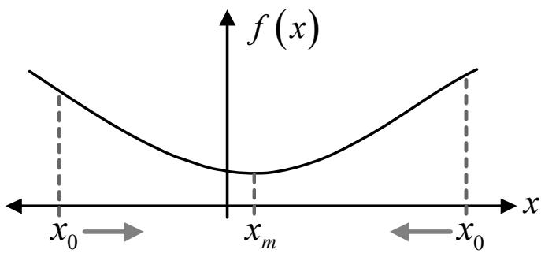  
รูปที่ 5.42: ตัวอย่างฟังก์ชัน f (x)

## อัลกอริทึม steepest descent

กำหนดให้f(x) เป็นฟังก์ชันค่าจริงของตัวแปรอิสระ x ที่มีกราฟตามรูปที่ 5.42 อัลกอริทีม steepest descent หรืออัลกอริทึมเกรเดียนต์ (gradient algorithm) จะทำการหาค่าของ x ที่ทำให้ฟังก์ชัน f (x) มีค่าต่ำสุด โดยมีขั้นตอนการทำงาน ดังนี้

1) กำหนดค่าเริ่มต้น $x = x _ { 0 }$ เมื่อ $x _ { 0 }$ คือ ค่าคงตัวใดๆ

2) สำหรับ $k = 1$ ถึง L

$$
2 . 1 ) \ x _ { k + 1 } = x _ { k } - \mu f ^ { \prime } ( x _ { k } )
$$

ซู คือ จำนวนครั้งของการวนซ้ำ (number of iterations), คือ ขนาดของการก้าวกระโดด (step เมื่อ $L$ $\mu$ size) มีค่าเท่ากับ $0 < \mu < 1$ , และ $f ^ { \prime } ( x _ { k } )$ คือ อนุพันธุ์ของฟังก์ชัน $f ( x )$ ที่ค่า $x = x _ { k }$ โดยทั่วไป ประสิทธิภาพของอัลกอริทึม steepest descent จะขึ้นอยู่กับพารามิเตอร์ $\mu$ นั่นคือ

## 5.6. อีควอไลเซอร์

ถ้า $\mu$ มีค่าน้อยเกินไป จะทำให้เสียเวลานาน กว่าที่จะได้ค่า $x$ ที่ต้องการ หรืออาจจะกล่าวได้ว่า ค่า $\mu$ ที่น้อยเกินไป จะส่งผลทำให้อัตราการลูเข้า (convergence rate) $\stackrel { \triangledown } { \boldsymbol { \mathfrak { B } } } \boldsymbol { 1 }$

ถ้ำ $\mu$ มีค่ามากเกินไป อาจจะทำให้เกิดการลู่ออก (divergence) ทำให้ไม่ได้ค่า x ที่ต้องการ

ตัวอย่างที่ 5.14 กำหนดให้

$$
f ( x ) = 3 x e ^ { x ^ { 2 } } + \frac { 3 x } { 2 + x ^ { 2 } } - 5
$$

จงใช้อัลกอริทึม steepest descent เพื่อคำนวณหาค่า $x _ { k }$ สำหรับ $k = 2$ เมื่อกำหนดให้ $x _ { 0 } = 0$ และ $\mu = 0 . 2$

วิธีทำ จากฟังก์ชัน . $f ( x )$ e $f ( x )$ ได้ คือ ที่กำหนด สามารถหาค่าอนุพันธ์ของ

$$
f ^ { \prime } ( x ) = { \frac { d f ( x ) } { d x } } = ( 3 x ) e ^ { x ^ { 2 } } ( 2 x ) + e ^ { x ^ { 2 } } ( 3 ) + { \frac { ( 2 + x ^ { 2 } ) ( 3 ) - ( 3 x ) ( 2 x ) } { ( 2 + x ^ { 2 } ) ^ { 2 } } }
$$

จากอัลกอริทึม steepest descent จะได้ค่า $x _ { k }$ เมื่อ ซี $k = 0 ,$ 1, และ $2 \ \stackrel { \circ } { \ 9 } \Im \stackrel { \circ } { \ \mathcal { H } }$

$$
x _ { k }
$$

$$
x _ { 0 } = 0
$$

$$
x _ { 1 } = x _ { 0 } - \mu f ^ { \prime } ( x _ { 0 } ) = 0 - ( 0 . 2 ) f ^ { \prime } ( 0 ) = - 0 . 9
$$

$$
2 \ | \ x _ { 2 } = x _ { 1 } - \mu f ^ { \prime } ( x _ { 1 } ) = ( - 0 . 9 ) - ( 0 . 2 ) f ^ { \prime } ( - 0 . 9 ) = - 4 . 5 2 4 
$$

เพราะฉะนัน จะได้ ะ V $x _ { 2 } = - 4 . 5 2 4$ ตามทีต้องการ 4ี น

## อัลกอริทึม steepest descent แบบ N มิติ

ในกรณีที่ f เป็นฟังก์ชันของตัวแปรอิสระจำนวนมากกว่าหนึ่งตัว นั้นคือ $f ( \mathbf { x } )$ เมื่อ สู ${ \bf x } = [ x _ { 1 } , x _ { 2 } , \dots .$ $x _ { N } ] ^ { \mathrm { T } }$ อัลกอริทึม steepest deรcent ยังสามารถที่จะนำมาประยุกต์ใช้ในการหาค่าเวกเตอร์ x ที่ทำให้ ฟังก์ชัน $f ( \mathbf { x } )$ มีค่าต่ำสุดได้ ตามขั้นตอนต่อไปนี้

1) กำหนดค่าเริ่มต้น $\mathbf { x } = \mathbf { x } _ { 0 }$ เมื่อ $\mathbf { x } _ { \mathrm { 0 } }$ คือ เวกเตอร์ค่าคงตัวใดๆ

2) สำหรับ $k = 1$ ถึง L

$$
2 . 1 ) \ \mathbf { x } _ { k + 1 } = \mathbf { x } _ { k } - \mu \nabla f ( \mathbf { x } _ { k } )
$$

เมื่อ $\nabla$ คือ ตัวดำเนินการเกรเดียนต์ (gradient operator) $\frac { d } { 9 } 、$ งนิยามโดย

$$
\nabla f ( \mathbf { x } ) = \left[ \begin{array} { c } { \frac { \partial f ( \mathbf { x } ) } { \partial x _ { 1 } } } \\ { \frac { \partial f ( \mathbf { x } ) } { \partial x _ { 2 } } } \\ { \vdots } \\ { \frac { \partial f ( \mathbf { x } ) } { \partial x _ { N } } } \end{array} \right]
$$

ในทำนองเดียวกัน ประสิทธิภาพของอัลกอริทึม steepest descent แบบ N มิติ (dimension) ก็จะขึ้น อยู่กับพารามิเตอร์ $\mu$ เช่นกัน ตามที่อธิบายไว้ข้างต้น

## ตัวอย่างที่ 5.15 กำหนดให้

$$
f ( x , y ) = x ^ { 2 } - y ^ { 2 } - 3 x + 3 y + 2 x y
$$

จงใช้อัลกอริทึม steepest descent แบบ N มิติ เพื่อคำนวณหาค่า $x _ { k }$ และ $y _ { k }$ สำหรับ $k = 2$ เมื่อ กำหนดให้ $x _ { 0 } = 0 , y _ { 0 } = 0 .$ , และ $\mu = 0 . 1$

วิธีทำ จากฟังก์ชัน $f ( x , y )$ ที่กำหนด ค่าเกรเดียนต์ของ $f ( x , y )$ ม่คาเทากับ 2 - e

$$
\nabla f ( x , y ) = { \left[ \begin{array} { l } { { \frac { \partial f ( x , y ) } { \partial x } } } \\ { { \frac { \partial f ( x , y ) } { \partial y } } } \end{array} \right] } = { \left[ \begin{array} { l } { 2 x - 3 + 2 y } \\ { - 2 y + 3 + 2 x } \end{array} \right] }
$$

จากอัลกอริทึม รtepest deรcent แบบ N มิติสามารถเขียนสมการสำหรับปรับค่า $x _ { k }$ และ $y _ { k }$ ได้ ดังนี้

$$
x _ { k + 1 } = x _ { k } - \mu { \frac { \partial f ( x _ { k } , y _ { k } ) } { \partial x } } = x _ { k } - \mu ( 2 x _ { k } - 3 + 2 y _ { k } )
$$

$$
y _ { k + 1 } = y _ { k } - \mu { \frac { \partial f ( x _ { k } , y _ { k } ) } { \partial y } } = y _ { k } - \mu ( - 2 y _ { k } + 3 + 2 x _ { k } )
$$

## 5.6. อีควอไลเซอร์

หรือเขียนให้อยู่ในรูปของเมทริกซ์ได้ คือ

$$
\underbrace { \left[ \begin{array} { l } { x _ { k + 1 } } \\ { y _ { k + 1 } } \end{array} \right] } _ { \mathbf { x } _ { k + 1 } } = \underbrace { \left[ \begin{array} { l } { x _ { k } } \\ { y _ { k } } \end{array} \right] } _ { \mathbf { x } _ { k } } - \underbrace { \mu } _ { \mathbf { \nabla } \cdot \underbrace { 2 } y _ { ( \mathbf { x } _ { k } ) } } \underbrace { \left[ \begin{array} { l } { 2 x _ { k } - 3 + 2 y _ { k } } \\ { - 2 y _ { k } + 3 + 2 x _ { k } } \end{array} \right] } _ { \nabla f ( \mathbf { x } _ { k } ) }
$$

เพราะฉะนัน ค่า $x _ { k }$ และ $y _ { k }$ เมื่อ ซี $k = 0 ,$ 1, และ 2 สามารถหาได้ $\stackrel { \sim } { \ 9 } \stackrel { \mathrm { q } } { \mathstrut } \stackrel { \mathrm { q } } { \mathstrut }$

<table><tr><td>k</td><td> $x _ { k }$ </td><td> $y _ { k }$ </td></tr><tr><td>o</td><td>0</td><td>0</td></tr><tr><td>1</td><td> $0 - ( 0 . 1 ) ( - 3 ) = 0 . 3$ </td><td> $0 - ( 0 . 1 ) ( 3 ) = - 0 . 3$ </td></tr><tr><td>2</td><td> $( 0 . 3 ) - ( 0 . 1 ) [ 2 ( 0 . 3 ) - 3 + 2 ( - 0 . 3 ) ] = 0 . 6$ </td><td> $- 0 . 3 - ( 0 . 1 ) [ - 2 ( - 0 . 3 ) + 3 + 2 ( 0 . 3 ) ] = - 0 . 7 2$ </td></tr></table>

ดังนั้น จะได้ว่า e V บ1 $x _ { 2 } = 0 . 6$ และ $y _ { 2 } = - 0 . 7 2$ ตามทีต้องการ บ

## ความสัมพันธ์กับอีควอไลเซอร์แบบ MMSE

จากวิธีการออกแบบอีควอไลเซอร์แบบ MMรE ที่อธิบายในหัวข้อที่ 5.6.3 จะ พบว่า ค่าสัมประสิทธิ แต่ละ แท็ปของอีควอไลเซอร์แบบ MMรE จะ ถูกออกแบบมา เพื่อให้ค่า MSE ในสมการ (5.116) มีค่าน้อยสุด ดังนั้น อาจจะกล่าวได้ว่า ฟังก์ชันที่ต้องการทำให้มีค่าน้อยสุด (หรือที่เรียกกันว่า cost function)คือ

$$
f ( \mathbf { c } ) = \mathrm { M S E } = \mathbf { c } ^ { \mathrm { T } } \mathbf { R } _ { s s } \mathbf { c } - 2 \mathbf { c } ^ { \mathrm { T } } \mathbf { p } + E _ { a }\tag{5.132}
$$

ซึ่งค่าเกรเดียนต์ของฟังก์ชัน $f ( \mathbf { c } )$ รู 2 e นีจะมีค่าเท่ากับ

$$
\nabla f ( \mathbf { c } ) = 2 \mathbf { R } _ { s s } \mathbf { c } - 2 \mathbf { p }\tag{5.133}
$$

ถ้าสมมุติว่า ฟังก์ชัน $f ( \mathbf { c } )$ มีลักษณะ เป็นฟังก์ชันกำลังสอง (quadratic function) และ มีจุดต่ำ สุดเพียงจุดเดียว ดังนั้น ค่าสัมประสิทธิ์ของอีควอไลเซอร์ที่เหมาะ $\stackrel { \mathrm { d } } { \bar { \boldsymbol { \nabla } } } \underset { \boldsymbol { \widehat { \mathbf { f } } } } { \boldsymbol { \widehat { \mathbf { f } } } } \underset { \boldsymbol { \widehat { \mathbf { f } } } } { \boldsymbol { \widehat { \mathbf { f } } } }$ (optimum coefficients) $\mathbf { c } _ { \mathrm { o p t } }$ สามารถหาได้ โดยการกำหนดให้ค่า $\nabla f ( \mathbf { c } )$ ในสมการ (5.133) มีค่าเท่ากับค่าศูนย์ นั่นคือ

$$
\mathbf { c } _ { \mathrm { o p t } } = \mathbf { R } _ { s s } ^ { - 1 } \mathbf { p }\tag{5.134}
$$

ซึ่งจะมีค่าเท่ากับ ${ \bf c } _ { \mathrm { M M S E } }$ ในสมการ (5.123) ดังนั้น การหาค่าสัมประสิทธิ ของอีควอไลเซอร์โดยการ ะ ทำให้ค่า $\nabla f ( \mathbf { c } )$ มีค่าน้อยสุด จะรับประกันได้ว่า ค่าสัมประสิทธิ์ ของอีควอไลเซอร์ที่ได้ $\mathbf { c } _ { \mathrm { o p t } }$ จะลู่เข้า (converge) สู่ค่า CMMsE ถ้าเลือกใช้ค่า $\mu$ ที่เหมาะสม

## อัลกอริทึม LMS

การปรับค่าสัมประสิทธิ ของอีควอไลเซอร์ตามอัลกอริทึม steepest descent โดยการทำให้ฟังก์ชัน $f ( \mathbf { c } )$ ในสมการ (5.132) มีค่าน้อยสุด สามารถทำได้โดยใช้สมการ ต่อไปนี้

$$
\mathbf { c } _ { k + 1 } = \mathbf { c } _ { k } - { \frac { \mu } { 2 } } \nabla f ( \mathbf { c } _ { k } )\tag{5.135}
$$

โดยที่ค่า $\nabla f ( \mathbf { c } _ { k } )$ สามารถหาได้โดยการแทนค่าเมทริกซ์ $\mathbf { R } _ { s s }$ จากสมการ (5.118) และเวกตอร์ P จากสมการ (5.119) ลงในสมการ (5.133) จะได้เป็น

$$
{ \begin{array} { l l l } { \nabla f ( \mathbf { c } _ { k } ) } & { = } & { 2 \left( E \left[ \mathbf { s } _ { k } \mathbf { s } _ { k } ^ { \mathrm { T } } \right] \mathbf { c } _ { k } - E \left[ { \hat { a } } _ { k - d } \mathbf { s } _ { k } \right] \right) } \\ & { = } & { 2 E \left[ \mathbf { s } _ { k } \left( \mathbf { s } _ { k } ^ { \mathrm { T } } \mathbf { c } _ { k } - { \hat { a } } _ { k - d } \right) \right] } \\ & { = } & { 2 E [ \mathbf { s } _ { k } ( y _ { k } - { \hat { a } } _ { k - d } ) ] } \\ & { = } & { 2 E [ \mathbf { s } _ { k } e _ { k } ] } \end{array} }\tag{5.136}
$$

เมื่อ $y _ { k } = \mathbf { s } _ { k } ^ { \mathrm { T } } \mathbf { c } _ { k }$ และ $e _ { k } = y _ { k } - { \hat { a } } _ { k - d }$ คือ ข้อผิดพลาดที่เกิดขึ้นตามแบบจำลองช่องสัญญาณในรูป ที่ 5.38 แทนค่า $\nabla f ( \mathbf { c } _ { k } )$ จากสมการ (5.136) ลงในสมการ (5.135) จะได้ผลลัพธ์เป็น

$$
{ \bf c } _ { k + 1 } = { \bf c } _ { k } - \mu E [ e _ { k } { \bf s } _ { k } ]\tag{5.137}
$$

ในทางปฏิบัติ การหาค่าคาดหมาย $E [ e _ { k } \mathbf { s } _ { k } ]$ ทำได้ยาก ดังนั้น วิธีการแก้ปัญหา คือ การแทนค่า $E [ e _ { k } \mathbf { s } _ { k } ]$ ด้วยค่าประมาณ (estimate) เช่น ค่าเฉลี่ยของตัวอย่าง (sample mean) นั้นคือ [35]

$$
\hat { E } [ e _ { k } \mathbf { s } _ { k } ] = \frac { 1 } { L _ { a } } \sum _ { i = 0 } ^ { L _ { a } - 1 } e _ { k - i } \mathbf { s } _ { k - i }\tag{5.138}
$$

เมื่อ $L _ { a }$ คือ ความยาวทั้งหมดของลำดับข้อมูล $\{ s _ { k } \}$ จากนั้น ก็ทำการประยุกต์ใช้ค่าประมาณนี้เข้าไป

ในอัลกอริทึม steepest descent ทำให้สมการ (5.137) สามารถจัดให้อยู่ในรูปใหม่ได้เป็น

$$
\mathbf { c } _ { k + 1 } = \mathbf { c } _ { k } - { \frac { \mu } { L _ { a } } } \sum _ { i = 0 } ^ { L _ { a } - 1 } e _ { k - i } \mathbf { s } _ { k - i }\tag{5.139}
$$

นอกจากนี้ ถ้าไช้ค่าเฉลียของตัวอย่างเพียงหนึงจุด นี้อ้งใช้ว่ $( L _ { a } = 1 )$ จะได้ว่า V

$$
\hat { E } [ e _ { k } \mathbf { s } _ { k } ] = e _ { k } \mathbf { s } _ { k }\tag{5.140}
$$

เพราะฉะนั้น สมการปรับค่าสัมประสิทธิ์ของอีควอไลเซอร์ในสมการ (5.139) จะมีค่าเท่ากับ

$$
\mathbf { c } _ { k + 1 } = \mathbf { c } _ { k } - \mu \{ e _ { k } \mathbf { s } _ { k } \}\tag{5.141}
$$

สมการนีู้้จักกันทั่วไปในชื่อว่า "อัลกอริทึมกำลังสองเฉลี่ยที่น้อยสุด (LMS: least mean square)" หรือที่เรียกกันว่า "อัลกอริทึม LMร" ซึ่งเป็นที่นิยมใช้งานกันมากในงานประยุกต์ต่างๆ เพราะว่ามี ข้อดีหลายประการ คือ

1) อัลกอริทึม LMร สามารถทำงานได้โดยไม่จำเป็นต้องทราบว่า ข้อมูลอินพุตและ ช่องสัญญาณมี คุณลักษณะอย่างไร

2) ถ้า $\mu$ ที่ใช้มีค่าน้อยเพียงพอ สามารถรับประกันได้ว่า ผลลัพธ์ค่า c ที่ได้จากอัลกอริทึม LMS จะ มีค่าเข้าสู่ค่า CMMSE (แต่อาจจะใช้เวลานานพอสมควร)

3) เป็นอัลกอริทึมที่มีความทนทาน, เสถียรภาพ, และง่ายต่อการสร้างเป็นวงจรอิเล็กทรอนิกส์ โดยสรุปแล้ว จากแบบจำลองระบบในรูปที่ 5.38 ถ้าต้องการใช้งานอีควอไลเซอร์แบบปรับตัว โดยใช้ อัลกอริทึม LMร จะมีขันตอนการทำงาน ดังนี้

1) กำหนดค่าเริ่มต้น $\mathbf { c } _ { 0 }$ เป็นเวกเตอร์ใดๆ

2) สำหรับ k = 1 ถึง L (เมื่อ $L \leq L _ { a } )$

2.1) คำนวณหาค่าข้อผิดพลาด $e _ { k } = y _ { k } - { \hat { a } } _ { k } .$ −d

2.2) ปรับค่าสัมประสิทธิ์ของอีควอไลเซอร์ $\mathbf { c } _ { k + 1 } = \mathbf { c } _ { k } - \mu \{ e _ { k } \mathbf { s } _ { k } \}$

สำหรับรายละเอียดอื่นๆ เกี่ยวกับอัลกอริทึม LMร เช่น เงื่อนไขของการลู่เข้าของอัลกอริทึม LMS และอื่นๆ สามารถศึกษาเพิ่มเติมได้จาก [35]

## ภาวะการทำงานของอีควอไลเซอร์แบบปรับตัว

ปัญหาของการใช้งานอีควอไลเซอร์แบบปรับตัว คือ ในช่วงเริ่มต้นของกระบวนการปรับค่าสัมประสิทธิ แต่ละแท็ปของอีควอไลเซอร์ ระบบจะไม่ทราบว่าค่า $\mathbf { c } _ { 0 }$ ที่ดี ควรจะมีค่าเป็นอะไร ดังนั้น ถ้าข้อมูล $\hat { a } _ { k }$ −d ที่ใช้ในการคำนวณหาค่าข้อผิดพลาด $e _ { k }$ ไม่มีความน่าเชื่อถือ อัลกอริทึม LMร ก็อาจจะทำให้ได้ค่า สัมประสิทธิ์ของอีควอไลเซอร์ที่ผิดพลาดได้ ในทางกลับกัน ถ้าค่า $\hat { a } _ { k - d }$ มีความน่าเชื่อถือ อัลกอริทึม LMS ก็จะทำงานได้อย่างมีประสิทธิภาพ เพราะฉะนั้น ในทางปฏิบัติ ข้อมูลที่รับส่งในระบบจะประกอบ ไปด้วยข้อมูล 2 ส่วนหลัก คือ

1) ส่วนแรกจะเป็นสัญญาณทดสอบ หรือที่เรียกว่า preamble ข้อมูลในส่วนนี้ จะ เป็นที่รู้กันทั้ง วงจรภาคส่งและวงจรภาครับว่า ข้อมูล preamble มีลักษณะแบบใด และโดยทั่วไป ข้อมูล preamble นี้ จะมีจำนวนไม่กี่บิต

2) ส่วนที่สองจะ เป็นข้อมูลจริง (real data) ที่จะ ถูกนำมาใช้งาน โดยทั่วไป ข้อมูลในส่วนนี้จะ มี ne ลักษณะ เป็นข้อมูลสุ่ม (raทdom data) ที่มีจำนวนหลายบิต (ขึ้นกับลักษณะ ของงานประยุกต์ เช่น ในฮาร์ดดิสก์ไดรฟ์ ข้อมูลส่วนนี้จะมีจำนวนประมาณ 4096 บิต)

## ดังนั้น อีควอไลเซอร์แบบปรับตัวก็จะทำงานเป็น 2 ภาวะ ตามลักษณะของข้อมูล ดังนี้

1) ภาวะการได้มา (acquisition mode) หรือภาวะ การฝึกอบรม (training mode) จะเป็นการทำงาน ในช่วงเริ่มต้น โดยในช่วงนี้อีควอไลเซอร์แบบปรับตัวจะใช้ข้อมูล preamble ช่วยในการคำนวณ หาค่าสัมประสิทธิ ของอีควอไลเซอร์ที่เหมาะสม เนื่องจากอีควอไลเซอร์ทราบว่าข้อมูล preลmble คืออะไร ดังนั้น อีควอไลเซอร์สามารถใช้ค่า $\mu$ (ขนาดของการก้าวกระโดด) ที่มีค่ามากได้ เพื่อ ช่วยทำให้สามารถได้ค่าสัมประสิทธิ์ของอีควอไลเซอร์ที่เหมาะสมโดยเร็วที่สุด

2) ภาวะ การติดตาม (tracking mode) ในช่วงนี้อีควอไลเซอร์ แบบปรับตัวจะใช้ข้อมูลจริงในการ ปรับค่าสัมประสิทธิ์ ของอีควอไลเซอร์ เนื่องจากข้อมูลจริงมีลักษณะ เป็นข้อมูลสุ่ม (random data) ซึ่งหมายความว่า อีควอไลเซอร์ไม่สามารถมั่นใจได้ว่า ข้อมูล $\hat { a } _ { k - d }$ จะมีความน่าเชื่อถือและ ถูกต้อง 100% เพราะฉะนั้น อีควอไลเซอร์ควรที่จะใช้ค่า $\mu$ ที่มีค่าน้อยในการปรับค่าสัมประสิทธิ ของอีควอไลเซอร์ เพื่อป้องกันข้อผิดพลาดที่อาจจะเกิดขึ้น

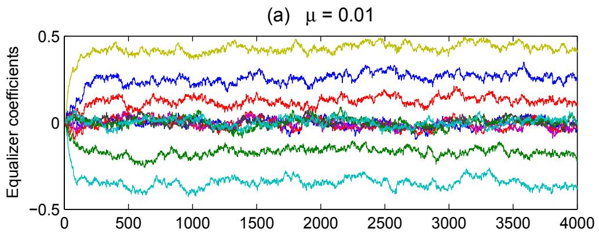

(b) µ = 0.001  
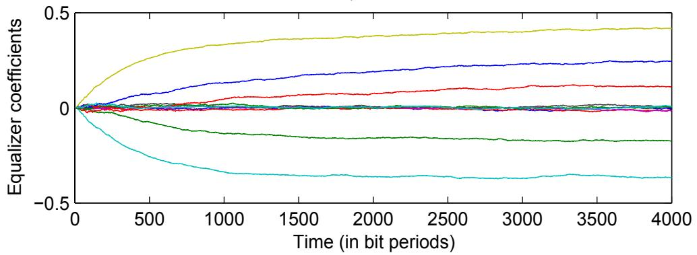  
$\mu = 0 . 0 1$ และ (b) $\mu = 0 . 0 0 1$

พิจารณาแบบจำลองช่องสัญญาณในรูปที่ 5.38 เมื่อกำหนดให้ $H ( D ) = 1 - D ^ { 2 }$ และอีควอไลเซอร์ ที่ใช้เป็นแบบปรับตัว (ตามอัลกอริทึม LMร) ที่มีจำนวนแท็ปเท่ากับ 11 แท็ป โดยที่ อีควอไลเซอร์นี้ จะทำการปรับตัวเพื่อให้ข้อมูลเอาต์พุตของอีควอไลเซอร์มีค่าใกล้เคียง $a _ { k }$ มากที่สุด รูปที่ 5.43 แสดง ค่าสัมประสิทธิของอีควอไลเซอร์ทั้ง 11 แท็ป เมื่อ ระบบใช้ขนาดของการก้าวกระโดด $\mu$ เท่ากับ 0.01 และ 0.001, ข้อมูลอินพุต $a _ { k } \in \{ \pm 1 \}$ จำนวน 4000 บิต, ทำงานที่ $E _ { b } / N _ { 0 } = 9 ~ \mathrm { d B }$ ,และสมมุติว่า ข้อมูลอินพุตทั้งหมดนี้เป็น preamble นั่นคือ อีควอไลเซอร์ทำงานในภาวะการได้มาเท่านั้น จากรูปจะ เห็นได้ว่า เมื่อช้ค่า µ ท่มีขนาดใหญ่ ค่าสัมประสิทธิ์ แต่ละแท็ปของอีควอไลเซชอร์จะเปลี่ยนแปลงอย่าง $\mu$ รุนแรง (อาจจะก่อให้เกิดข้อผิดพลาดได้ง่าย โดยเฉพาะอย่างยิ่ง เมื่ออีควอไลเซอร์ทำงานในภาวะการ ติดตาม) และลู่เข้าสู่ตำแหน่งที่ต้องการเร็ว (fast convergence) ในทางตรงกันข้าม ถ้าใช้ค่า $\mu$ ที่มีขนาด เล็กค่าสัมประสิทธิ์แต่ละ แท็ปขอังอรซพิสิงอย่างช้าๆ (ก่อให้เกิดข้อผิดพลาดน้อย เมื่อทำงานในภาวะ การติดตาม) และลู่เข้าสู่ตำแหน่งที่ต้องการช้า (รlow convergence) เพราะฉะนั้น ในทางปฏิบัติ อีควอไลเซอร์แบบปรับตัวจะใช้µ ขนาดใหญ่สำหรับทำงานในภาวะการได้มา และใช้ $\mu$ $\mu$ ขนาดเล็กสำหรับทำงานในภาวะการติดตาม

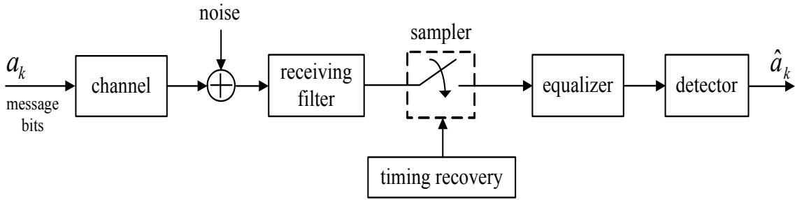  
รูปที่ 5.44: แบบจำลองระบบการประมวลผลสัญญาณของฮาร์ดดิสก์ไดรฟ์

## 5.7 ฮาร์ดดิสก์ไดรฟ์กับระบบสื่อสารดิจิทัล

ในส่วนนี้จะสรุปถึงความสัมพันธ์ระหว่างระบบการประมวลผลสัญญาณของฮาร์ดดิสก์ไดรฟ์กับระบบ สื่อสารดิจิทัล โดยทั่วไป ลักษณะ การทำงานของระบบการประมวลผลสัญญาณ ของฮาร์ดติสก์ไดรฟ์ สามารถที่จะจำลองให้อยู่ในรูปของระบบสื่อสารดิจิทัลอย่างง่ายได้ ดังแสดงในรูปที่ 5.44 โดยที

$a _ { k }$ คือ ข้อมูลบิตที่ต้องการจะบันทึกลงไปในสื่อบันทึกของฮาร์ดดิสก์ไดรฟ์

ช่องสัญญาณ (channel) คือ ผลตอบสนองอิมพัลส์ที่หัวอ่าน (read head) ได้รับ

สัญญาณรบกวน (ทoiรอ) คือ สัญญาณรบกวนต่างๆ เช่น สัญญาณรบกวนความร้อน และ สัญญาณรบกวนสื่อบันทึก (media noise) เป็นต้น

วงจรกรองภาครับ (recยived filter) โดยทั่วไป ฮาร์ดดิสก์ไดรฟ์จะใช้วงจรกรองผ่านต่ำ (lowpass fIter) เพื่อทำหน้ำที่ จำกัดแถบความถี่ของสัญญาณที่ได้รับ และลดผลกระทบที่เกิดจาก สัญญาณรบกวนให้น้อยลง

## 5.8. สรุปท้ายบท

วงจรชักตัวอย่าง (sampler) ทำหน้าที่แปลงสัญญาณแอนะล็อกไปเป็นลำดับดิจิทัล (digital sequence) ก่อนที่จะส่งต่อไปยังอีควอไลเซอร์

ไทมมิ่งริดัฟเวอรี (timing recovery) ทำหน้าที่ควบคุมการทำงานของวงจรชักตัวอย่าง เพื่อให้ เกิดการเข้าจังหวะ (รynchronization) ระหว่างวงจร ชักตัวอย่างกับสัญญาณ แอนะ ล็อกที่ได้รับ เพื่อให้ได้ข้อมูลแซมเปิลที่ดีที่สุดออกมา ก่อนที่จะนำไปทำการประมวลผลขั้นต่อไป

อีควอไลเซอร์ (eqนลizer) ทำหน้าที่ในการปรับรูปร่างหรือคุณลักษณะของสัญญาณที่ได้รับ ให้ เป็นไปตามที่ระบบต้องการ

วงจรตรวจหา (detector) ทำหน้าที่ถอดรหัส ข้อมูลเอาต์พุต ของอีควอไลเซอร์ เพื่อ ตัดสินใจว่า ข้อมูลบิต $a _ { k }$ ที่ส่งมาจากต้นทางคืออะไร

$\hat { a } _ { k }$ คือ ค่าประมาณของข้อมูลบิต $a _ { k }$ ที่ได้จากวงจรตรวจหา

สำหรับรายละเอียดของแต่ละส่วนประกอบ (component) ที่กล่าวมาข้างตั้นี้ สามารถศึกษาได้ในบท ที่ 6

## 5.8สรุปท้ายบท

ระบบการประมวลผลสัญญาณของฮาร์ดดิสก์ไดรฟ์สามารถที่จะ พิจารณาว่าเป็น ระบบสื่อสารแบบแถบ ความถีฐาน (baseband communication system) ดังนั้นในบทนี้จึงได้อธิบายถึงทฤษฎีพื้นฐานต่างๆ ญ ที่เกียวข้องกับระบบสือสาร เช่น ระบบการส่งสัญญาณแถบความถีฐาน, การกลำรหัสพัลส์, การกลำ แอมพลิจูดของพัลส์, คุณสมบัติของสัญญาณรบกวน, วงจรกรองเหมาะสุด, การคำนวณหาความน่า จะเป็นของข้อผิดพลาด, การแทรกสอดระหว่างสัญลักษณ์, ทฤษฎีบทของในควิตส์, ทฤษฎีบทการ ชัก ตัวอย่าง, และ อีควอไลเซอร์ เป็นต้น เพื่อให้ผู้อ่านสามารถเข้าใจถึง ภาพรวมและ หลักการทำงาน ของระบบสื่อสารดิจิทัล รวมทั้งทำให้มองเห็นถึงความสัมพันธ์ระหว่างระบบสื่อสารดิจิทัลกับระบบการ ประมวลผลสัญญาณของฮาร์ดดิสก์ไดรฟ์ ซึ่งจะเป็นประโยชน์ต่อการวิเคราะห์และออกแบบระบบการ ประมวลผลสัญญาณของฮาร์ดดิสก์ไดรฟ์

## 5.9 แบบฝึกหัดท้ายบท

1. จงคำนวณหาความถีการชักตัวอย่างต่ำสุดที่สอดคล้องกับทฤษฎีบทการชักตัวอย่างของสัญญาณ x(t) ต่อไปนี้

1.1) $x ( t ) = 2 \sin ( 1 0 0 \pi t ) \sin ( 1 0 0 0 \pi t )$

1.2) x(t) = 5 sin(100πt) cos(1000πt)

1.3) $x ( t ) = 1 0 \cos ( 1 0 0 \pi t ) \cos ( 1 0 0 0 \pi t )$

2. การส่งสัญญาณเสียงในรูปการกล้ำรหัสพัลส์ (PCM) ของระบบโทรศัพท์ด้วยอัตราบิต 56000 บิตต่อวินาที จงหาความถี่การชัก ตัวอย่างที่ เป็นไปได้, จำนวนระดับของการแจงหน่วย, และ จำนวนบิตต่อการชักตัวอย่างหนึ่งครั้ง โดยกำหนดให้สัญญาณเสียงที่จะทำการชัก ตัวอย่างมี แบนด์วิดท์เท่ากับ 3200 เฮิรตซ์

3. จงแสดงว่าฟังก์ชันของสัญญาณ h(t) มีค่าจากการแปลงฟูเรียร์เป็นไปตามเงื่อนไข ต่อไปนี้

$$
\sum _ { k = - \infty } ^ { \infty } { \cal H } \left( \omega + \frac { 2 \pi k } { T } \right) = 1 \mathrm { ~ f o r ~ } | \omega | \le \frac { \pi } { T }
$$

เมื่อกำหนดให้ $h ( n T )$ 2 e มีค่าเท่ากับ

$$
h ( n T ) = \left\{ \begin{array} { l l } { \frac { 1 } { T } , } & { n = 0 } \\ { 0 , } & { \mathrm { e l s e } } \end{array} \right.
$$

ซึ่งจะเป็นการพิสูจน์ว่า สัญญาณ h(t) มีลักษณะ เป็นสัญญาณพัลส์ไนควิตส์

4.ระบบสื่อสารไบนารีส่งสัญญาณแบบสองขั้ว $r _ { 0 } ( t ) = - 1$ โวลต์ และ $r _ { 1 } ( t ) = + 1$ โวลต์ เมื่อ $0 \leq t \leq T$ , และ $E _ { r _ { 0 } } = E _ { r _ { 1 } } = 1$ โวล $\mathring { \varphi } ^ { 2 }$ ไปยังปลายทาง สัญญาณที่วงจรภาครับได้รับ จะถูก รบกวนด้วยสัญญานรบกวนเกาส์สีขาวที่มีความหนาแน่นสเปกตรัมกำลังแบบสองด้านเท่ากับ 0.2 โวลต์2 ก่อนที่จะถูกส่งผ่านไปยังวงจรกรองเหมาะสุด และทำการชักตัวอย่างที่เวลา $t = T$ จากนั้น จึงส่งลำดับข้อมูลดิจิทัลที่ได้ไปยังวงจรตรวจหาขีดเริ่มเปลี่ยน จงคำนวณหาค่าระดับขีด เริ่มเปลี่ยน γ ที่ดีที่สุด ถ้ากำหนดให้ความน่าจะเป็นก่อน (a-priori probability) ของข้อมูลที่จะ ส่ง คือ

4.1) $p ( r _ { 0 } ) = 0 . 2$

4.2) $p ( r _ { 0 } ) = 0 . 5$

4.3) $p ( r _ { 0 } ) = 0 . 8$

5. จงใช้อัลกอริทึม steepest descent เพื่อคำนวณหาค่า $x _ { k }$ สำหรับ $k = 3$ ของฟังก์ชัน $f ( x )$ ต่อไปนี้ เมื่อกำหนดให้ $x _ { 0 } = 0$ และ $\mu = 0 . 1$

5.1) $f ( x ) = x ^ { 2 } + 3$

5.2) $\textstyle f ( x ) = { \frac { 3 x } { 2 x - 3 } }$

5.3) $f ( x ) = 2 x ^ { 3 } + 3 x e ^ { 2 x }$

5.4) $\begin{array} { r } { f ( x ) = 3 x ^ { 2 } - \frac { 2 x } { x ^ { 2 } + 1 } - 1 } \end{array}$

5.5) $f ( x ) = x ^ { 2 } e ^ { 3 x } - 2 x + 2$

6. จงใช้อัลกอริทึม steepest descent แบบ N มิติ เพื่อคำนวณหาค่า $x _ { k }$ และ $y _ { k }$ สำหรับ $k = 3$ ของฟังก์ชัน $f ( x , y )$ ต่อไปนี้เมื่อกำหนดให้ x0 = 0, y0 = 0, และ $\mu = 0 . 1$

6.1) $f ( x , y ) = 2 x ^ { 2 } - 3 y$

6.2) $f ( x , y ) = ( x + y ) ^ { 2 }$

6.3) $f ( x , y ) = x ^ { 2 } + 2 y ^ { 3 } - 3 x y + 2 x$

6.4) $f ( x , y ) = x ^ { 2 } e ^ { x } - 3 y ^ { 2 } - x y + 2 x - 3 y$

6.5) $f ( x , y ) = x ^ { 2 } y ^ { 2 } + 2 e ^ { x } e ^ { y } +$ + 3xy