# กระบวนการเขียนและการอ่านข้อมูลใน ฮาร์ดดิสก์ไดรฟ์

ในบทนี้จะอธิบายถึงหลักการพื้นฐานของกระบวนการเขียนและการอ่านข้อมูลในฮาร์ดดิสก์ไดรฟ์ เพื่อ ทำให้ผู้อ่านเข้าใจถึงภาพรวมของการทำงานของฮาร์ดดิสก์ไดรฟ์ว่า แต่ละกระบวนการประกอบไปด้วย ขั้นตอนอะไรบ้าง นอกจากนี้ยังกล่าวถึงสถาปัตยกรรมช่องสัญญาณอ่าน ซึ่งถือว่าเป็นหัวใจสำคัญ ของชึ้นส่วนอิเล็กทรอนิกส์ ที่ทำหน้าที่ในการประมวลผลสัญญาณของฮาร์ดดิสก์ไดรฟ์เพราะฉะนั้น เนื้อหาในบทนี้จะช่วยทำให้ผู้อ่านสามารถทำการวิเคราะห์ระบบการประมวลผลสัญญาณของฮาร์ดดิสก์ ไดรฟ์ได้ง่ายขึ้นน

## 6.1บทนำ

ในปัจจุบันนี้ อุปกรณ์อิเล็กทรอนิกส์ต่างๆ เช่น คอมพิวเตอร์, โทรศัพท์เคลื่อนที่, เครื่องเล่นเพลง แบบพกพา, และกล้องถ่ายรูปดิจิทัล เป็นต้น มีความต้องการเนื้อที่ในการจัดเก็บข้อมูลมากขึ้นเรื่อยๆ เทคโนโลยีการบันทึกระบบแม่เหล็ก แบบดิจิทัล (digital magnetic recording) ถือได้ว่าเป็น วิธีการ หลักที่ใช้ในการจัดเก็บข้อมูลของงานประยุกต์ (application) ต่างๆ รวมไปถึง ฮาร์ดดิสก์ไดรฟ์ (hard disk drive), แผ่นบันทึก (floppy disk), และแถบแม่เหล็ก (magnetic tape) อย่างไรก็ตาม ทุกงาน ประยุกต์จะ ตั้งอยู่บนพื้นฐานของหลักการทำงานเดียวกันซึ่งเกี่ยวข้องกับ หัวอ่าน (read head), หัว เขียน (write head), และสื่อบันทึกแม่เหล็ก (magnetic media) ดังแสดงในรูปที่ 6.1 โดยที่ หัวอ่าน และหัวเขียนแบบอินดักที่ฟ (inฝนctive head) จะทำมาจากสารแม่เหล็กรูปเกือกม้าที่มีค่าสภาพลบล้าง แม่เหล็ก1 (coercivity) ต่ำ และค่าสภาพให้ซึมผ่านได้ (permeability) สูง [1] โดยจะ มีขดลวดพันอยู รอบๆ ในขณะที่ สื่อบันทึกมักจะทำมาจากสารแม่เหล็กที่มีค่าสภาพลบล้างแม่เหล็กสูง

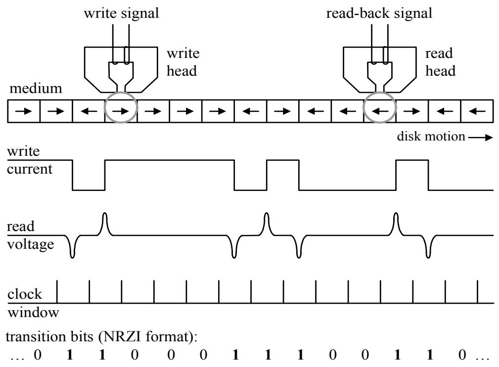

Le หนังสือเล่มนี้ จะอธิบายเฉพาะเทคโนโลยีการบันทึกข้อมูล 2 แบบ คือ การบันทึกแบบแนวนอน   
(longitudinal recording) และ การบันทึกแบบแนวตั้ง (perpendicular recording) โดยทีเทคโนโลยี   
การบันทึกแบบแนวนอนเป็นเทคโนโลยีที่ใช้ในการบันทึกข้อมูลของฮาร์ดดิสก์ไดรฟ์ตั้งแต่อดีตจนถึง

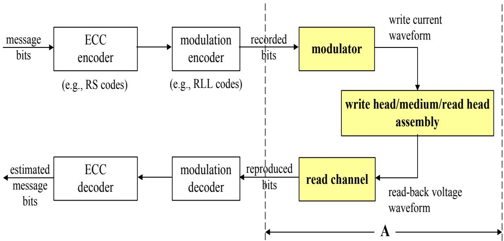  
รูปที่ 6.2: แบบจำลองทั่วไปของระบบการจัดเก็บข้อมูลดิจิทัลในฮาร์ดดิสก์ไดรฟ์

ปัจจุบัน นั้นคือ สภาพความเป็นแม่เหล็ก (magnetization) ของสื่อบันทึกจะขนานกับระนาบของจาน บันทึกแม่เหล็ก (magnetic disk) ดังที่แสดงในรูปที่ 6.1 ในขณะที่ เทคโนโลยีการบันทึกแบบแนวตั้ง ได้เริ่มที่จะนำมาใช้สำหรับการบันทึกข้อมูลของฮาร์ดดิสก์ไดรฟ์ในปัจจุบัน กล่าวคือ สภาพความเป็น แม่เหล็กของสื่อบันทึกจะตั้งฉากกับระนาบของจานบันทึกแม่เหล็ก ในปัจจุบันนี้งานวิจัยด้านเทคโนโลยี การบันทึกข้อมูลแบบแนวตังได้ดำเนินไปอย่างรวดเร็ว เพราะว่า สามารถช่วยเพิมขนาดความจุของฮาร์ด ดิสก์ไดรฟ์ได้หลายสิบเท่า เมื่อเทียบกับการใช้เทคโนโลยีการบันทึกข้อมูลแบบแนวนอน [19]

ระบบการจัดเก็บข้อมูลดิจิทัล (digital data storage system) ในฮาร์ดดิสก์ไดรฟ์สามารถจำลอง   
เป็นแผนภาพทั่วไปได้ ตามรูปที่ 6.2 เมือ บิตข่าวสาร (meรรage bits) จะถูกทำการเข้ารหัสโดย "วงจร   
เข้ารหัส แก้ไขข้อผิดพลาด (error-correction code (ECC) encoder)" โดยที่ รหัส RS (Reed Solomon   
code) [42, 43] เป็นรหัสที่นิยมนำมาใช้ในการเข้ารหัสแก้ไขข้อผิดพลาดของฮาร์ดดิสก์ไดรฟ์ในปัจจุบัน ญ   
จากนั้น ข้อมูลที่เข้ารหัส แล้วก็จะถูกทำการเข้ารหัสอีกครั้งหนึ่งด้วย "วงจรเข้ารหัสมอดูเลชัน (modu-

lation eทcอder)" เพื่อทำหน้าที่ในการปรับคุณสมบัติของข้อมูลให้เหมาะสมกับช่องสัญญาณของฮาร์ด ดิสก์ไดรฟ์ เช่น ทำให้ลำดับข้อมูลมีรูปแบบตามที่ต้องการ หรือทำให้ลำดับข้อมูลไม่มีส่วนประกอบ ไฟฟ้ากระแสตรง (d.c. component) เป็นต้น รหัส ที่นิยมใช้กันทั่วไปในวงจรเข้ารหัสมอดูเลชัน คือ รหัส RLL (run-length limited code) [44] ข้อมูลเอาต์พุต ที่ได้จากวงจร เข้ารหัส มอดูเลชันจะ ถือ ว่าเป็นข้อมูลที่จะ ถูก เขียนเข้าไปในสื่อบันทึก ซึ่งจะ เรียกกันว่า "บิตที่จะ ถูก บันทึก (recorded bit)" หลังจากนั้น บิตที่จะ ถูกบันทึกก็จะ ถูกส่งไปยัง "วงจรมอดูเลเตอร์ (mอdนlator)" เพื่อแปลงข้อมูลบิต ให้อยู่ในรูปคลื่นกระแสไฟฟ้าเขียน (write current waveform) จากนั้น รูปคลื่นกระแสไฟฟ้าเขียนก็ จะถูกป้อนไปยังหัวเขียน เพื่อทำการเขียนข้อมูลลงไปในสื่อบันทึก

สำหรับขั้นตอนในการอ่านข้อมูล หัวอ่านจะทำการอ่านข้อมูลจากสื่อบันทึก เมื่อหัวอ่านเคลื่อนที่ มาถึงบริเวณที่มีการเปลี่ยนแปลงสภาพความเป็นแม่เหล็ก3 (ดูรูปที่ 6.1) จะได้ผลลัพธ์ออกมาเป็น สัญญาณรูปคลื่นแรงดันไฟฟ้า ที่เรียกว่า "สัญญาณ read-bลck" สำหรับรายละเอียดของกระบวนการ เขียนและการอ่านข้อมูลจะอธิบายในหัวข้อที่ 6.2 และ 6.3 ตามลำดับ จากนั้น สัญญาณ read-back ก็ จะถูกส่งเข้าไปทำการประมวลผลในช่องสัญญาณอ่าน (read chaททel) ซึ่งประกอบไปด้วยส่วนประกอบ ต่างๆ ได้แก่ วงจรกรองผ่านต่ำ (LPF: low-pass filter), วงจรชักตัวอย่าง (sampler หรือ analogto-digital converter), อีควอไลเซอร์ (equalizer), และวงจรตรวจหา (detector) เป็นต้น โดยข้อมูล เอาต์พุตที่ได้ก็จะถูกทำการถอดรหัสด้วย วงจรถอดรหัสมอดูเลชัน (modนlation decoder) และวงจร ถอดรหัส แก้ไขข้อผิดพลาด (ECC decoder) เพื่อหาค่าประมาณของบิตข่าวสาร ที่ต้องการจะ นำมาใช้ งาน

## 6.2 กระบวนการเขียนข้อมูล

รายละเอียดของกระบวนการเขียนข้อมูลในฮาร์ดดิสก์ไดรฟ์สามารถแสดงเป็นแผนภาพได้ตามรูปที่ 6.3 โดยที่ แต่ละบล็อกมีหลักการทำงาน ดังต่อไปนี้

## 6.2. กระบวนการเขียนข้อมูล

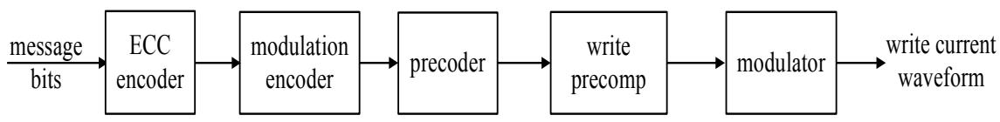

รูปที่ 6.3: แผนภาพกระบวนการเขียนข้อมูล  
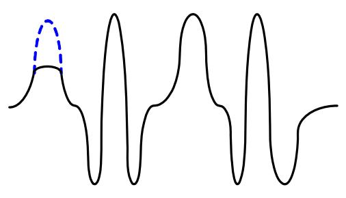  
(a) single bit error

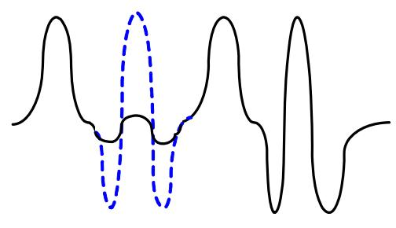  
(b) burst of errors  
รูปที่ 6.4: ประเภทของข้อผิดพลาด (a) ข้อผิดพลาดแบบบิตเดียว และ (b) ข้อผิดพลาดแบบหลายบิต ติดกัน โดยที่ เส้นปะแสดงรูปร่างของสัญญาณที่ควรจะเป็น เมื่อไม่มีข้อผิดพลาด

## 6.2.1 วงจรเข้ารหัสแก้ไขข้อผิดพลาด

ข้อผิดพลาด (error) ที่เกิดขึ้นบ่อยในระบบการประมวลผลสัญญาณของฮาร์ดดิสก์ไดรฟ์สามารถแบ่ง ออกได้เป็น 2 ประเภทหลัก คือ ข้อผิดพลาดแบบบิตเดียว (single bit error) และ ข้อผิดพลาดแบบ หลายบิตติดกัน (burst of errors) ดังแสดงในรูปที่ 6.4 โดยทั่วไป ข้อผิดพลาดแบบบิตเดียวมักจะเกิด จากการแทรกสอด (interfereทce) ของสัญญาณรบกวนที่มีค่าแอมพลิจูดมากในช่วงระยะเวลาสั้นๆ ซึ่ง จะส่งผลกระทบทำให้ได้เป็นสัญญาณ พัลส์ส่วนเกินหรือสัญญาณพัลส์ที่ถูกลดทอน ดังแสดงในรูปที่ 6.4(a) โดยที่ เส้นปะ (daรhed line) แสดงรูปร่างของสัญญาณที่ควรจะ เป็น เมื่อไม่มีข้อผิดพลาด ใน ขณะที่ ข้อผิดพลาดแบบหลายบิตติดกัน มักจะ เกิดจากกรณีที่สื่อบันทึกมีข้อบกพร่อง (defec) เช่น มี รอยขีดข่วน หรือมีสิ่งสกปรกบนสื่อบันทึก เป็นต้น ซึ่งจะส่งผลกระทบทำให้เกิดข้อผิดพลาดหลายบิต ติดกันที่วงจรภาครับ (receiver) ตามรูปที่ 6.4(b) ในทางปฏิบัติ ข้อผิดพลาดแบบหลายบิตติดกันจะก่อ ให้เกิดผลเสียหายกับประสิทธิภาพรวมของระบบมากกว่าข้อผิดพลาดแบบบิตเดียว

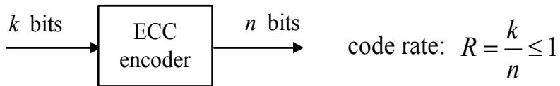  
รูปที่ 6.5: แผนภาพการเข้ารหัสแก้ไขข้อผิดพลาด

รหัสแก้ไขข้อผิดพลาด (ECC: error-correction code) มีทำหน้าที่ช่วยในการแก้ไขข้อผิดพลาดที เกิดขึ้นในระบบ โดยที่ รหัส RS (Reed Solomon) [44] จะ เป็น ECC ประเภทหนึ่งที่นิยมใช้มาก ในฮาร์ดดิสก์ไดรฟตั้งแต่อดีตจนถึงปัจจุบัน ทั้งนี้เป็นเพราะว่า รหัส RS มีความสามารถในการแก้ไข ข้อผิดพลาดแบบหลายบิตติดกันได้อย่างมีประสิทธิภาพ สำหรับขั้นตอนในการเข้ารหัสที่วงจรภาคส่ง (transmiter) $\stackrel { \circ } { \mathbb { H } } \mathbb { H }$ วงจรเข้ารหัส ECC (ECC encoder) จะทำการเข้ารหัสข้อมูลทีละบล็อกๆ ละ k บิต และได้ข้อมูลเอาต์พุตออกมาทีละบล็อกๆ ละ ท บิต ตามรูปที่ 6.5 โดยที่ "อัตรารหัส (code rate)" จะ นิยามโดย

$$
R = { \frac { k } { n } }\tag{6.1}
$$

เนื่องจาก จำนวนบิตเอาต์พุตจะมีมากกว่าหรือเท่ากับจำนวนบิตอินพุตเสมอ ดังนั้น $R \leq 1$ เสมอ จากนั้นที่วงจรภาครับ วงจรถอดรหัส ECC (ECC decoder) ก็จะทำหน้าที่ในการถอดรหัสข้อมูลทีละ บล็อกๆ ละ ท บิต และได้ข้อมูลเอาต์พุตออกมาทีละบล็อกๆ ละ k บิต โดยทั่วไปแล้ว ระบบการจัดเก็บ ข้อมูลดิจิทัลในฮาร์ดดิสก์ไดรฟ์จะยอมให้มีอัตราข้อผิดพลาดบิต (BER: bit-error rate) BER < 10–9 เมื่อวัด ณ ด้านขาเข้าของวงจรถอดรหัส ECC

สำหรับความสามารถของรหัส RS ที่จะ แก้ไขข้อผิดพลาดจำนวนกี่บิตติดกันนั้น จะขึ้นอยู่กับพารา มิเตอร์ที่ใช้ในรหัส RS ซึ่งถูกกำหนดโดยพารามิเตอร์ $( n , k )$ นั่นคือ รหัส RS มีความสามารถที่จะ

ตรวจหา4 (detect) ข้อผิดพลาดแบบหลายบิตติดกันที่มีความยาวไม่เกิน $( n - k )$ บิต

แก้ไข (correct) ข้อผิดพลาดแบบหลายบิตติดกันที่มีความยาวไม่เกิน $( n - k ) / 2$ บิต

ตัวอย่างเช่น รหัส RS แบบ (31, 15) จะมีความสามารถในการตรวจหาข้อผิดพลาดแบบหลายบิตติด กันที่มีความยาวไม่เกิน 31 - 15 = 16 บิต และมีความสามารถในการแก้ไขข้อผิดพลาดแบบหลายบิต ติดกันที่มีความยาวไม่เกิน $( 3 1 - 1 5 ) / 2 = 8$ บิต

โดยสรุปแล้ว ข้อดีของการเข้ารหัส ECC คือ ช่วยทำให้ข้อผิดพลาดในระบบน้อยลง ซึ่งจะส่งผล ทำให้ความน่าเชื่อถือ ของการจัดเก็บข้อมูลในฮาร์ดดิสก์ไดรฟ์เพิ่มสูงขึ้น กล่าวคือวงจรถอดรหัส EC-C สามารถที่จะแก้ไขข้อผิดพลาดที่เกิดขึ้นที่วงจรภาครับได้อย่างอัตโนมัติ ส่วนข้อเสียของการเข้ารหัส ECC ก็คือ จำนวนบิตเอาต์พุตจะมีมากกว่าจำนวนบิตอินพุต โดยที่ ข้อมูลบิตที่เพิ่มขึ้นมานี้ จะเรียกว่า “บิตส่วนเกิน (redundant bit)" ซึ่งไม่ได้เป็นข้อมูลที่ผู้ใช้ (user) ต้องการจะเก็บเข้าไปในสื่อบันทึก แต่ จะเป็นข้อมูลที่มีไว้ช่วยในการแก้ไขข้อผิดพลาดที่วงจรถอดรหัส ECC ดังนั้น บิตส่วนเกินจะทำให้เกิด การสูญเสียเนื้อที่การจัดเก็บข้อมูลในสื่อบันทึก ตัวอย่างเช่น แทนที่ผู้ใช้จะเก็บข้อมูลข่าวสารได้ 100 บิต ก็อาจจะเก็บข้อมูลข่าวสารได้เพียง 90 บิต เพราะต้องเหลือเนื้อที่ไว้สำหรับเก็บบิตส่วนเกินอีก 10 ญ บิต เพราะฉะนั้น เนื้อที่การจัดเก็บข้อมูลในสื่อบันทึกจะสูญเสียไป 10% เป็นต้น

## ทำไมการใช้รหัส ECC จึงช่วยเพิ่มความจุของฮาร์ดดิสก์ไดรฟ์

ผู้อ่านอาจจะ สงสัยว่า ทำไมในระบบการประมวลผลสัญญาณของฮาร์ดดิสก์ไดรฟ์จึงยังใช้การเข้ารหัส ECC ทั้งๆ ที่การเข้ารหัส ECC จะทำให้เกิดบิตส่วนเกินขึ้นมาในระบบ ซึ่งจะทำให้สูญเสียเนื้อที่การ จัดเก็บข้อมูลที่ต้องการในสื่อบันทึก อย่างไรก็ตาม ในความเป็นจริงแล้ว การเข้ารหัส ECด จะช่วยเพิ่ม ความจุของฮาร์ดดิสก์ไดรฟ์ได้ ดังที่จะอธิบายต่อไปนี้

ให้พิจารณาระบบ 2 ระบบ คือ ระบบ A ซึ่งใช้งานรหัส ECC และระบบ B ซึ่งไม่ใช้งานรหัส ECC ถ้ากำหนดให้รหัส ECC ที่ระบบ A ใช้งาน มีความสามารถในการแก้ไขข้อผิดพลาดที่เกิดขึ้นจำนวน Be 1 บิด ต่อข้อมูลหนึ่งบล็อกที่มีขนาด 16 บิต ซึ่งภายในข้อมูลหนึ่งบล็อกจะประกอบไปด้วย ข้อมูลที่ ต้องการจำนวน 8 บิต และบิตส่วนเกิน 8 บิด ดังนั้น ระบบ A จะเกิดข้อผิดพลาดขึ้น ก็ต่อเมื่อ มี ข้อผิดพลาดเกิดขึ้นในระบบมากกว่าหรือเท่ากับ 2 บิต ถ้าสมมุติให้ ความน่าจะเป็นของข้อผิดพลาด (probability of error) ในระบบมีลักษณะ การแจกแจงทวินาม (binomial distribution) และให้ $q _ { i }$ แทนความน่าจะเป็นที่จะ เกิดข้อผิดพลาดจำนวน 1 บิต ของระบบ i (เมือ i เท่ากับ A หรือ B) เพราะฉะนัน ความน่าจะเป็นทีระบบ A จะเกิดข้อผิดพลาด สามารถหาได้จากสมการ (4.39) นันคือ

$$
P _ { e } \approx { \binom { 1 6 } { 2 } } q _ { A } ^ { 2 } ( 1 - q _ { A } ) ^ { 1 6 - 2 } = 1 2 0 q _ { A } ^ { 2 } ( 1 - q _ { A } ) ^ { 1 4 }\tag{6.2}
$$

ถ้ากำหนดให้ อัตราข้อผิดพลาดบิต BER = $P _ { e } = 1 0 ^ { - 9 }$ เป็นระดับที่ฮาร์ดดิสก์ไดรฟ์สามารถทำงาน ได้อย่างมีประสิทธิภาพ เมื่อแก้สมการ (6.2) แล้ว จะได้ $q _ { A } \approx 3 \times 1 0 ^ { - 6 }$ ซึ่งหมายความว่า ระบบ A จะเกิดข้อผิดพลาด ก็ต่อเมือ ความน่าจะเป็นที่จะ เกิดข้อผิดพลาดจำนวน 1 บิต มีค่าเท่ากับ $3 \times 1 0 ^ { - 6 }$ ในทำนองเดียวกัน เนื่องจาก ระบบ B เป็นระบบที่ไม่ใช้รหัส ECC ดังนั้น ระบบ B จะเกิดข้อผิดพลาด ก็ต่อเมื่อ ความน่าจะเป็นที่จะเกิดข้อผิดพลาดจำนวน 1 บิต มีค่าเท่ากับ $q _ { B } = 1 0 ^ { - 9 }$

ถ้าสมมุติให้ BER ในระบบเกิดจากสัญญาณรบกวนแบบสุ่ม (random ทoise) เท่านั้น เพราะฉะนั้น อัตราส่วนค่ากำลังเฉลี่ยของสัญญาณที่ต้องการต่อค่ากำลังเฉลี่ยของสัญญาณรบกวน (รNR: รignalto-noise ratio) ที่ระบบต้องการเพื่อให้ได้ BER ตามที่กำหนด สามารถที่จะคำนวณหาได้ ตัวอย่างเช่น ถ้าต้องการให้ระบบ A และ B ยังคงสามารถทำงานได้อย่างมีประสิทธิภาพ เพราะฉะนั้น ระบบ B (ไม่ ใช่รหัส ECC) จะ ต้องมี $\mathrm { { B E R } } = q _ { B } = 1 0 ^ { - 9 }$ ซึ่งจะเกิดขึ้นได้ ก็ต่อเมื่อ ระบบ B ใช้ SNR = 22 เดซิเบล (dB) ในทำนองเดียวกัน ระบบ A (ใช้รหัส ECC) จะมี $q _ { A } = 3 \times 1 0 ^ { - 6 }$ เพื่อทำให้ได้ BER $= 1 0 ^ { - 9 }$ ก็ต่อเมื่อระบบ A ใช้ SNR = 19 dB (ค่า SNR ที่ใช้จะขึ้นอยูกับค่า $q _ { i }$ ไม่ได้ขึ้นกับ BER) ดังนั้น จะถือได้ว่า ระบบ A จะมีอัตราการขยาย (gain) เท่ากับ 3 dB เมื่อเปรียบเทียบกับระบบ B ซึ่ง ในทางปฏิบัติ ค่าอัตราการขยายที่ได้มาจากการใช้รหัส ECC นี้ จะเรียกว่า "อัตราการขยายการเข้ารหัส (coding gain)" [42, 43] โดยที่ ค่าอัตราการขยายการเข้ารหัสในรูปของ รNR นี้ จะช่วยเพิ่ม “"ความ หนาแน่นการบันทึก (recording density)" ข้อมูลในฮาร์ดดิสก์ไดรฟ์ได้

พิจารณากรณีที่สัญญาณรบกวนหลักที่ เกิดขึ้นในระบบ คือ สัญญาณรบกาวนสื่อบันทึก (media noise) ในหนังสือ [1] ได้กล่าวว่า "การลดความกว้างของแทร็ก (track พidth) ลงครึ่งหนึ่ง จะ เป็นผล ทำให้ระบบสูญเสีย SNR ไป 3 dB" ดังนั้น ถึงแม้ว่า ระบบ A (ใช้รหัส ECC) จะต้องสูญเสียเนื้อที่การ จัดเก็บข้อมูลในฮาร์ดดิสก์ไดรฟ์ไป 50% สำหรับบิตส่วนเกิน แต่เนื่องจาก ระบบ A มีอัตราการขยาย การเข้ารหัส 3 dB (เมื่อเทียบกับระบบ B) ทำให้สามารถลดความกว้างของแทร็กในฮาร์ดดิสก์ไดรฟ์ ของระบบ A ลงครึ่งหนึ่งได้ ซึ่งก็หมายความว่า ระบบ A จะมีเนื้อที่การจัดเก็บข้อมูลเพิ่มขึ้น 100% ซี เพราะฉะนั้น อัตราการขยายสุทธิ ที่เกิดจากการใช้รหัส ECC คือ ความจุ (capaตity)ของการจัดเก็บ ข้อมูลในฮาร์ดดิสก์ไดรฟ์จะเพิ่มขึ้นประมาณ 100% – 50% = 50% ดังนั้น จึงสามารถที่จะสรุปได้ว่า การใช้รหัส ECC จะช่วยเพิ่มความจุของการจัดเก็บข้อมูลได้

## 6.2. กระบวนการเขียนข้อมูล

## แนวโน้มการใช้งานรหัส ECC ในอนาคต

การใช้งานฮาร์ดดิสก์ไดรฟ์ในปัจจุบันจะพบว่า วงจรถอดรหัส ECC จะทำงานเป็นอิสระ (independent) กับวงจรตรวจหาสัญลักษณ์ (รymbol detector) อย่างไรก็ตาม จากการศึกษาค้นคว้าพบว่า [45] ถ้า ออกแบบให้วงจรถอดรหัส ECด และวงจรตรวจหาสัญลักษณ์สามารถทำงานร่วมกันได้ ประสิทธิภาพ รวมของระบบที่ได้ก็จะ เพิ่มขึ้นอย่างมาก ดังนั้น แนวโน้มการใช้งานรหัส ECด ในอนาคต ระบบการ ประมวลผลสัญญาณของฮาร์ดดิสก์ไดรฟ์

อาจจะ นำเทคนิคการใช้งานร่วมกันระหว่าง วงจรถอดรหัส ECC และวงจรตรวจหาสัญลักษณ์มา ใช้งานจริงนั้น มีความเป็นไปได้สูง โดยรหัส ECC ที่จะนำมาใช้นอกเหนือไปจากรหัส RS ได้แก่ รหัส LDPC (low-density parity-check) [46] หรือรหัสเทอร์โบ (turbo code) [47] เป็นต้น

## 6.2.2 วงจรเข้ารหัสมอดูเลชัน

โดยทั่วไป รหัสมอดูเลชัน (modนlation code) จะทำหน้าที่ในการจัดการกับความผิดเพี้ยน (distortion) ของช่องสัญญาณ และสัญญาณรบกวนต่างๆ ที่เกิดขึ้นระหว่างการส่งสัญญาณ สำหรับในระบบการ บันทึกแม่เหล็ก (magnetic recording system) รหัสมอดูเลชันจะทำหน้าที่ได้หลายๆ แบบ ได้แก่ ทำให้ ส่วนประกอบไฟฟ้ากระ แสตรงหมดไป (หรือทำให้เหลือน้อยที่สุด), ช่วยปรับคุณสมบัติของสัญญาณ ให้เหมาะสมกับช่องสัญญาณ เพื่อทำให้สัญญาณที่ส่งไปมีความผิดเพี้ยนน้อยที่สุด, ช่วยเพิ่มระยะห่าง ของ "บิตเปลี่ยนสถานะ (traทรitioก bit)" ที่จะเขียนลงไปในสื่อบันทึก, และช่วยลดผลกระทบของการ แทรกสอดระหว่างสัญลักษณ์ (IS1: intersymbol interference) เป็นต้น

รหัสมอดูเลชันที่นิยมใช้กันทั่วไปในฮาร์ดดิสก์ไดรฟ์ คือ รหัส RLL (run-length limited) [44] ซึ่งเป็นรหัสที่ทำหน้าที่ในการกำหนดจำนวนของบิตเปลี่ยนสถานะ บิต "0" และบิต "1" (ตามรูปแบบ ของ NRZ1) ที่เรียงติดกันในลำดับข้อมูลที่ต้องการจะเขียนลงไปในสื่อบันทึก โดยทั่วไป รหัส RLL จะ ถูกกำหนดด้วยพารามิเตอร์ $k / n \ ( d , k )$ เมื่อ

พารามิเตอร์ k คือ จำนวนอินพุตบิตที่จะทำการเข้ารหัส 1 ครั้ง

พารามิเตอร์ ท คือ จำนวนเอาต์พุตบิตที่ได้จากการเข้ารหัส 1 ครั้ง (อัตรารหัส = k/n)

พารามิเตอร์ d คือ เลขจำนวนเต็ม ซึ่งกำหนดจำนวนของบิต 0 ที่น้อยที่สุด ที่อยู่ระหว่างบิต 1

ตารางที่ 6.1: กฎการเข้ารหัส Miller (เมื่อ $x = 0$ ถ้าบิตก่อนหน้า x เป็น 1 มิฉะนั้น x = 1)
<table><tr><td>ข้อมูลอินพุตบิต</td><td>ข้อมูลเอาต์พุตบิต</td></tr><tr><td>0</td><td>x0</td></tr><tr><td>1</td><td>01</td></tr></table>

พารามิเตอร์ k คือ เลขจำนวนเต็ม ซึ่งกำหนดจำนวนของบิด 0 ที่มากที่สุด ที่อยู่ระหว่างบิด 1

เนื่องจาก ข้อมูลที่จะเขียนลงไปในสื่อบันทึกอยู่ในรูปแบบ NRZ1 นั่นคือ บิต 1 ใช้แทนตำแหน่งที่ มีการเปลี่ยนสถานะ (traกรเtioท) สภาพความเป็นแม่เหล็กเกิดขึ้น ซึ่งเมื่อหัวอ่านอ่านข้อมูลตรงส่วน นี้แล้ว จะ ได้ผลลัพธ์ เป็น "สัญญาณพัลส์เปลี่ยนสถานะ (tranรition pulse)" ออกมา เพราะฉะนั้น พารามิเตอร์ d จะช่วยทำให้บิต 1 สองบิตอยู่ห่างกัน เพื่อลดผลกระทบของ Iรา์ ส่วนพารามิเตอร์ k จะช่วยรับประกันว่า ลำดับข้อมูลที่จะเขียนลงไปในสื่อบันทึก จะมีบิตเปลี่ยนสถานะ เกิดขึ้นสม่ำเสมอ เป็นระยะๆ เพื่อที่จะช่วยทำให้ระบบไทมมิ่งริคัฟเวอรี6 (timing recovery system) สามารถทำงานได้ อย่างมีประสิทธิภาพ7

ตัวอย่างที่ 6.1 พิจารณารหัส Miller 1/2 (1, 3) ซึ่งมีกฎการเข้ารหัส (coding rule) ตามตารางที่ 6.1 จงเข้ารหัสข้อมูล {1, 0, 1, 1, 1, 0, 0, 1} ด้วยรหัส Miller

## 6.2. กระบวนการเขียนข้อมูล

วิธีทำ จากตารางที่ 6.1 ข้อมูลที่ได้จากการเข้ารหัส {1, 0, 1, 1, 1, 0, 0, 1} ด้วยรหัส Miller คือ

$$
\{ 0 1 \ 0 0 \ 0 1 \ 0 1 \ 0 1 \ 0 0 \ 1 0 \ 0 1 \}
$$

จะเห็นได้ว่า ข้อมูลเอาต์พุตที่ได้จะสอดคล้องกับพารามิเตอร์ d = 1 และ k = 3 เนื่องจาก รหัส Miller มีอัตรารหัสเท่ากับ 1/2 นั้นคือ ข้อมูลอินพุด 1 บิดต จะให้ข้อมูลเอาต์พุตออกมา 2 บิต

จากตัวอย่างข้างต้นจะพบว่า การใช้รหัส Miler จะทำให้สูญเสียเนื้อที่การจัดเก็บข้อมูลที่ต้องการ ในฮาร์ดดิสก์ไดรฟ์ไป 50% (สามารถดูจากอัตรารหัสก็ได้) ดังนั้น รหัส Miller จึงไม่เป็นที่นิยมใช้ งานในปัจจุบัน โดยสรุปแล้ว รหัส RLL ที่ดี ควรที่จะมีอัตรารหัสเข้าไใกล้ค่า 1 ให้มากที่สุด เพื่อที่จะ ช่วยทำให้เกิดการสูญเสียเนื้อที่การจัดเก็บข้อมูลที่ต้องการในฮาร์ดดิสก์ไดรฟ์น้อยที่สุด นอกจากนี้ โดย De ทั่วไปแล้ว การเข้าและถอดรหัส RLL จะกระทำโดยการใช้ "ตารางค้นหา (l0ok-นp table)" กล่าวคือ รหัส RLL แต่ละ แบบ จะ มีตาราง ค้นหาสำหรับการเข้ารหัส และ การถอดรหัส (เช่น ตารางที่ 6.1) จากนั้น ในการเข้ารหัส (encoding) ข้อมูล ก็จะดูว่า ข้อมูลบิตที่ด้านขาเข้าของวงจรเข้ารหัสคืออะไร ตรงกับข้อมูลส่วนไดในตารางค้นหา แล้วก็ให้ข้อมูลเอาต์พุตบิตออกมา เช่นเดียวกัน ในการถอดรหัส (decoding) ข้อมูล ก็จะดูว่าข้อมูลบิตที่ด้านขาเข้าของวงจรถอดรหัส คืออะไร ตรงกับข้อมูลส่วนใดใน ตารางค้นหา แล้วก็จะสร้างข้อมูลเอาต์พุตบิตออกมา สำหรับผู้สนใจสามารถศึกษารายละเอียดของรหัส RLL รวมทั้งวิธีการออกแบบรหัส RLL อย่างง่าย ได้ในบทที่ 8 ของหนังสือ "“การประมวลผลสัญญาณ สำหรับการจัดเก็บข้อมูลดิจิทัล เล่ม 2 : การออกแบบวงจรภาครับ" [6]

## 6.2.3วงจรเข้ารหัสก่อน

การทำงานของอีควอไลเซอร์ (eqนลlizer) สามารถแบ่งออกเป็น 2 ส่วน คือ ส่วนที่หนึ่งจะอยู่ที่วงจร ภาคส่ง และอีกส่วนหนึ่งจะอยู่ที่วงจรภาครับ ส่วนของอีควอไลเซอร์ที่อยู่ที่วงจรภาคส่งจะเรียกว่า "วงจร เข้ารหัสก่อน (precoder)" ซึ่งจะช่วยลดภาระการทำงานของอีควอไลเซอร์ที่วงจรภาครับได้ ในหัวข้อนี้ จะสรุปถึงหลักการทำงานของวงจรเข้ารหัสก่อน สำหรับรายละเอียดการออกแบบวงจรเข้ารหัสก่อนให้ เหมาะสมกับช่องสัญญาณแต่ละประเภท สามารถศึกษาได้จาก [48]

วงจร เข้ารหัสก่อนจะทำหน้าที่ในการเข้ารหัสข้อมูลอีกลักษณะ หนึง เพือ ช่วยป้องกันไม่ไห้ลำดับ ข้อมูลที่เขียนลงไปในสื่อบันทึกมีแบบข้อมูล (data patterท)ที่ไม่ต้องการ8 และช่วยเพิ่ม ระยะทาง ยุคลิค (Euclidean distance) [49] ของข้อมูลที่ถูกเข้ารหัส ซึ่งจะ ช่วยทำให้ BER ของระบบน้อยลง ได้ สำหรับวงจรเข้ารหัสก่อนที่นิยมใช้ในฮาร์ดดิสก์ไดรฟ์จะมีฟังก์ชันถ่ายโอน (transfer function) เช่น $P ( D ) = 1 / ( 1 \oplus D )$ หรือ $P ( D ) = 1 / ( 1 \oplus D ^ { 2 } )$ เป็นต้น โดยที่ เครื่องหมาย  คือ ตัวดำเนินการ XOR (excในรive OR) ที่มีลักษณะ การทำงาน ตามตารางที่6.2 การทำงานของวงจรเข้ารหัสก่อนนั้น ไม่ยาก ดังแสดงในตัวอย่างต่อไปนี้

ตารางที่ 6.2: การทำงานของตัวดำเนินการ XOR
<table><tr><td>การดำเนินการ</td><td>ผลลัพธ์ที่ได้</td></tr><tr><td> $0 \oplus 0$ </td><td>0</td></tr><tr><td> $0 \oplus 1$ </td><td>1</td></tr><tr><td> $1 \oplus 0$ </td><td>1</td></tr><tr><td>1 1</td><td>0</td></tr></table>

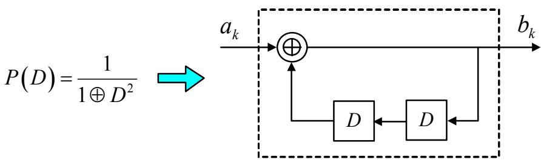  
รูปที่ 6.6: วงจรเข้ารหัสก่อน $P ( D ) = 1 / ( 1 \oplus D ^ { 2 } )$

ตัวอย่างที่ 6.2 จงเข้ารหัสข้อมูล $a _ { k } = \{ 0 , 1 , 1 , 0 , 1 , 0 , 1 , 0 , 0 , 1 , 1 \}$ ด้วยวงจรเข้ารหัสก่อน $P ( D ) =$ $1 / ( 1 \oplus D ^ { 2 } )$

## 6.2. กระบวนการเขียนข้อมูล

วิธีทำ วงจรเข้ารหัสก่อน $P ( D ) = 1 / ( 1 \oplus D ^ { 2 } )$ สามารถเขียนเป็นแผนภาพบล็อกได้ตามรูปที่ 6.6 โดยที่ ข้อมูลเอาต์พุต $b _ { k }$ สามารถเขียนให้อยู่ในรูปของสมการคณิตศาสตร์ได้ คือ

$$
b _ { k } = a _ { k } \oplus a _ { k - 2 }
$$

ซู จะได้ว่า e $a _ { k } = \{ 0 , 1 , 1 , 0 , 1 , 0 , 1 , 0 , 0 , 1 , 1 \}$ $b _ { k } = \{ 0 , 1 , 1 , 1 , 0 , 1 , 1 , 1 , 1 , 0 , 0 \}$ ดังนั้น เมื่อ

## 6.2.4 ความไม่เป็นเชิงเส้นในกระบวนการเขียน

ในทางปฏิบัติ กระบวนการเขียนจะ มีความไม่เป็นเชิงเส้น (noทliกทearity) มากกว่ากระบวนการอ่าน อย่างไรก็ตาม ในการวิเคราะห์ระบบการประมวลผลสัญญาณของฮาร์ดดิสก์ไดรฟ์ มักจะตั้งสมมุติฐาน ว่า สัญญาณ read-back ที่ได้จากหัวอ่านมีคุณสมบัติการซ้อนทับ (superposition) กล่าวคือ สัญญาณ read-back สามารถแสดงให้อยู่ในรูปของผลรวมเชิงเส้นของสัญญาณพัลส์เปลี่ยนสถานะ ตามทฤษฎี ของการกล้ำแอมพลิจูดของพัลส์ (PAM: pulse amplitude modulation) ซึ่งจะช่วยทำให้สามารถเขียน สัญญาณ read-bลck ในรูปของสมการทางคณิตศาสตร์ได้9 แต่ถ้าระบบมีความไม่เป็นเชิงเส้นเกิดขึ้น คุณสมบัติการซ้อนทับของสัญญาณ read-back ก็จะไม่เป็นจริง ซึ่งจะส่งผลทำให้วงจรภาครับทำงาน ผิดพลาดได้ง่าย ดังนั้น ในส่วนนี้จะอธิบายถึงความไม่เป็นเชิงเส้นที่เกิดขึ้นในกระบวนการเขียน 4 ประเภท [1, 5, 11, 43] คือ การลบล้างบางส่วน (partial erasure), การเลือนตำแหน่งของการเปลียน สถานะ แบบแข็ง (HTs: hard transition shift), การบันทึกทับ (overwrite), และ การเลือนตำแหน่ง ของการเปลี่ยนสถานะ แบบไม่เป็นเชิง เส้น (NLTS: nonlinear transition shift) ซึ่งมีรายละเอียด ดังต่อไปนี้

## การลบล้างบางส่วน

ปรากฎการณ์การลบล้างบางส่วน (partiลl eraรure) หรือที่เรียกกันว่า "“การสูญเสียแอมพลิจูดแบบไม่ เป็นเชิงเส้น (nonlinear amplitude loss)" เกิดจากการไหล ซึม (percolation) ของอนุภาคแม่เหล็ก บริเวณที่มีการเปลี่ยนสถานะในสื่อบันทึก ดังแสดงในรูปที่ 6.7 นั่นคือ อาณาเขตของแทร็ก (track)

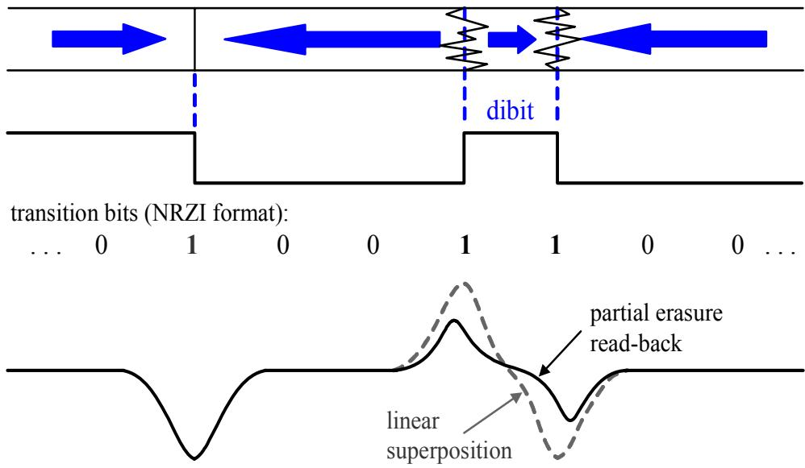  
รูปที่ 6.7: ตัวอย่างลักษณะของการลบล้างบางส่วน

เริ่มที่จะ ถูกลบออกไปบางส่วน โดยจะ ส่งผลกระทบทำให้สัญญาณพัลส์ที่ได้จากหัวอ่าน ณ จุดนี้มี แอมพลิจูดลดลง อันเนื่องมาจากความกว้างของแทร็ก (track พidth) ที่แคบลง ซึ่งจะทำให้คุณสมบัติ การซ้อนทับแบบเชิงเส้น (linear superposition) ของสัญญาณ read-back ผิดเพี้ยนไป โดยทั่วไปแล้ว ป ปรากฎการณ์การลบล้างบางส่วนนี้จะพบบ่อยที่ความจุข้อมูลของฮาร์ดดิสก์ไดรฟ์สูงๆ

## การเลื่อนตำแหน่งของการเปลี่ยนสถานะแบบแข็ง

ในระบบการบันทึกแม่เหล็ก การลบข้อมูลเก่าสามารถทำได้โดยการเขียนข้อมูลใหม่เข้าไปทับข้อมูลเก่า โดยตรง ปรากฎการณ์ ที่ เรียกว่า "การ เลื่อนตำแหน่งของการเปลี่ยนสถานะ แบบอ่อน (ETS: easy transition shift)" จะเกิดขึ้นเมือ สนามแม่เหล็กของหัวเขียน (head magnetic feld) มีทิศทางเดียวกัน กับสนามแม่เหล็กตกค้าง (remanent magnetic fled) ในสื่อบันทึก ณ บริเวณที่ต้องการ จะ เขียน ข้อมูลทับลงไป ในขณะที่ ปรากฎการณ์ที่เรียกว่า "การเลื่อนตำแหน่งของการเปลี่ยนสถานะแบบแข็ง (HTS: hard tranรition shift)" จะ เกิดขึนเมือ สนามแม่เหล็กของหัวเขียนมีทิศทางตรงกันข้ามกับ สนามแม่เหล็กตกค้างในสื่อบันทึก ณ บริเวณที่ต้องการจะ เขียนข้อมูลทับลงไป โดยทั่วไปผลกระทบ ที่เกิดจาก ETS จะไม่รุนแรง (สามารถเพิกเฉยได้) เมื่อเทียบกับผลกระทบที่เกิดจาก HTS

  
รูปที่ 6.8: ตัวอย่างลักษณะของการเลื่อนตำแหน่งของการ เปลี่ยนสถานะ แบบแข็ง (HTร) และการ เลื่อนตำแหน่งของการเปลี่ยนสถานะแบบอ่อน (ETS)

ปรากฎการณ์ HTร จะทำให้การเขียนข้อมูลเข้าไปในสื่อบันทึกเป็นไปด้วยความยากลำบากเพราะว่า หัวอ่านจะต้องใช้สนามแม่เหล็กที่มีความเข้มแม่เหล็กมากกว่าสนามแม่เหล็กตกค้างในสื่อบันทึกค่อน ข้างมาก เพื่อที่จะ สามารถ เขียนข้อมูลลงไปในสื่อบันทึกได้ ดังนั้น HTร จะส่งผลทำให้ตำแหน่งที่ เกิดการเปลี่ยนสถานะในสื่อบันทึกเลื่อนช้าออกไปจากตำแหน่งที่ควรจะ เป็นค่อนข้างมาก เมื่อเทียบ กับ ETS ดังแสดงในรูปที่ 6.8 ในระหว่างกระบวนการเขียน ระบบไม่สามารถทราบล่วงหน้าได้ว่า สนามแม่เหล็กตกค้างในสื่อบันทึกมีทิศทางเป็นอย่างไร ดังนั้น HTร จึงไม่สามารถที่จะ ถูกป้องกันได้ โดยการใช้เทคนิค "การชดเชยก่อนการเขียน (พrite precompensation)" ซึ่งจะกล่าวต่อไปในหัวข้อที 6.2.5

## การบันทึกทับ

ในการเขียนข้อมูลใหม่เข้าไปทับข้อมูลเก่าในสื่อบันทึก หรือที่เรียกว่า "การบันทึกทับ (overwrite)" สนามแม่เหล็กของหัวเขียนจะต้องมีค่ามากกว่าสนามแม่เหล็กตกค้างในสื่อบันทึก เพื่อที่จะได้ไม่มีข้อ ผิดพลาดเกิดขึ้น ในขณะที่หัวอ่านอ่านข้อมูลในสื่อบันทึก พารามิเตอร์ "อัตราส่วนการบันทึกทับ (OW: overwrite ratio)" ได้ถูกนิยามขึ้นมา เพื่อใช้บ่งบอกถึงความสามารถของสื่อบันทึกในการที่จะ เขียน ข้อมูลใหม่ทับข้อมูลเก่า

ะ

สู สู ปี่ ส เข้าไปในสื่อบันทึก จากนั้น ก็ทำการเขียนข้อมูลใหม่รูปคลื่น   
ต้นฉบับรูปคลิ่นสีเหลียมที่มีความถี $f _ { 1 }$   
สี่เหลี่ยมที่มีความถี่ $f _ { 2 }$ เข้าไปในสื่อ บันทึกเพื่อ ทับข้อมูลเดิม (โดยทั่วไป จะใช้ $f _ { 2 } = 2 f _ { 1 } )$ ดังนั้น ซื   
อัตราส่วนการบันทึกทับ Oพ คือ อัตราส่วนระหว่างระดับของสัญญาณของข้อมูลใหม่ $V _ { f _ { 2 } } ( f _ { 1 } )$ เนือง   
มาจาก สัญญาณความถี่ $f _ { 1 }$ ที่ยังคงหลงเหลืออยู และระดับของสัญญาณต้นฉบับ $V _ { f _ { 1 } } ( f _ { 1 } )$ นั่นคือ

$$
\mathrm { O W } = 2 0 \log _ { 1 0 } \left( \frac { V _ { f _ { 2 } } ( f _ { 1 } ) } { V _ { f _ { 1 } } ( f _ { 1 } ) } \right)\tag{6.3}
$$

มีหน่วยเป็นเดซิเบล (dB) ในทางปฏิบัติ ระบบการบันทึกแม่เหล็กสามารถที่จะเขียนและอ่านข้อมูลใน สื่อบันทึกได้อย่างมีประสิทธิ ภาพ ก็ต่อเมื่อ OW < —30 dB [1]

## การเลื่อนตำแหน่งของการเปลี่ยนสถานะแบบไม่เป็นเชิงเส้น

การเลื่อนตำแหน่งของการเปลี่ยนสถานะแบบไม่เป็นเชิงเส้น (NLTS: nonlinear transition shift) คือ การเปลี่ยนแปลงตำแหน่งการเปลี่ยนสถานะ (traทรitioก pอรition) ในสื่อบันทึก โดยมีสาเหตุมาจาก สนามสถิตเชิงแม่เหล็ก (magnetostatic feld) ของการเปลี่ยนสถานะ ที่ถูกเขียนเข้าไปในสื่อบันทึก ก่อนหน้านี้ ซึ่งมีทิศทาง (หรือประจุ) ตรงกันข้ามกับสนามแม่เหล็กของหัวเขียนที่จะทำการเขียนบิต เปลี่ยนสถานะ ตัวถัดไปลงไปในสื่อบันทึก NLTS จะ มีผลกระทบอย่างมากต่อ ประสิทธิภาพรวมของ ระบบ โดยเฉพาะอย่างยิ่ง ที่ความจุข้อมูลของฮาร์ดดิสก์ไดรฟ์สูงๆ ทั้งนี้เป็นเพราะว่า ที่ความจุข้อมูลสูง ข้อมูลบิดตทั้งหมดที่ต้องการเขียนลงในสื่อบันทึกจะถูกบีบให้อยูใกล้กันมากขึ้น ทำให้โอกาสที่จะเกิด รู   
ปรากฎการณ์ NTLร ก็จะมีมากขึ้น

ในทางปฏิบัติ บิตเปลี่ยนสถานะจะถูกเขียนเข้าไปในสื่อบันทึกได้ ก็ต่อเมื่อ ผลรวมของสนามการ ลบล้างสภาพแม่เหล็ก (demagnetizing feld), $H _ { d }$ , ที่เกิดจากบิตเปลี่ยนสถานะตัวก่อน และสนาม เขียน (write field), $H _ { h }$ ,มีค่าเท่ากับสภาพลบล้างแม่เหล็ก (coercivity), $H _ { c }$ , ของสื่อบันทึก ตาม ความสัมพันธุ์ต่อไปนี้ [11, 20]

$$
H _ { d } ( x _ { 0 } - \epsilon ) + H _ { h } ( x _ { 0 } - \epsilon ) = H _ { c }\tag{6.4}
$$

เมื่อ $x _ { 0 }$ คือ ตำแหน่งที่ต้องการจะ เขียนบิตเปลี่ยนสถานะ ลงไป และ  คือ ปริมาณของการเลื่อน ตำแหน่งการเปลี่ยนสถานะ (traทรitioก รhift) ถ้า  มีค่าน้อยมาก ค่า  สามารถที่จะ คำนวณหาได้

  
รูปที่ 6.9: สนามการลบล้างสภาพแม่เหล็กในสื่อบันทึกที่ใช้กับการบันทึกแบบแนวนอนและแบบแนว ตั้งเมื่อเทียบกับสนามการทำให้เป็นแม่เหล็กที่ได้จากหัวเขียน [50]

จากการกระจายอนุกรมเทย์ เลอร์ (Taylor series expansion) รอบจุด $x _ { 0 }$ นั่นคือ [20]

$$
\epsilon \approx \frac { H _ { d } ( x _ { 0 } ) } { \left( \left. \frac { d H _ { h } } { d x } \right| _ { x = x _ { 0 } } \right) }\tag{6.5}
$$

โดยที่ตัวส่วน (denominator) คือ เกรเดียนต์ สนามเขียน (write-field gradient) สมการ (6.5) บอกให้ทราบว่า ปริมาณของการเลื่อนตำแหน่งการเปลี่ยนสถานะจะ เป็นสัดส่วนโดยตรงกับสนามการ ลบล้างสภาพแม่เหล็กในสื่อบันทึก ณ ตำแหน่งที่ต้องการเขียนบิตเปลี่ยนสถานะลงไป แต่เป็นสัดส่วน ผกผันกับเกรเดียนต์สนามเขียน รูปที่ 6.9 แสดงสนามการลบล้างสภาพแม่เหล็กในสื่อบันทึกที่ใช้ ลู่ๆ ญ กับการบันทึกแบบแนวนอนและแบบแนวตั้ง เมือเทียบกับสนามการทำให้เป็นแม่เหล็ก (mลgทะtization feld) ที่ได้จากหัวเขียน เมื่อ x คือ ระยะทางระหว่างตำแหน่งที่กำลังจะทำการเขียนบิตเปลี่ยน สถานะลงไปกับตำแหน่งการเปลี่ยนสถานะที่มีอยู่ในสื่อบันทึกก่อนหน้านี้ และ a คือ ความกว้างของ การเปลี่ยนสถานะ (tranรition พidth) จะเห็นได้ว่า สนามการลบล้างสภาพแม่เหล็กในสื่อบันทึกที่ใช กับการบันทึกแบบแนวนอนและแบบแนวตั้งจะแตกต่างกัน เพราะฉะนัน ผลกระทบที่เกิดจาก NLTร ะ

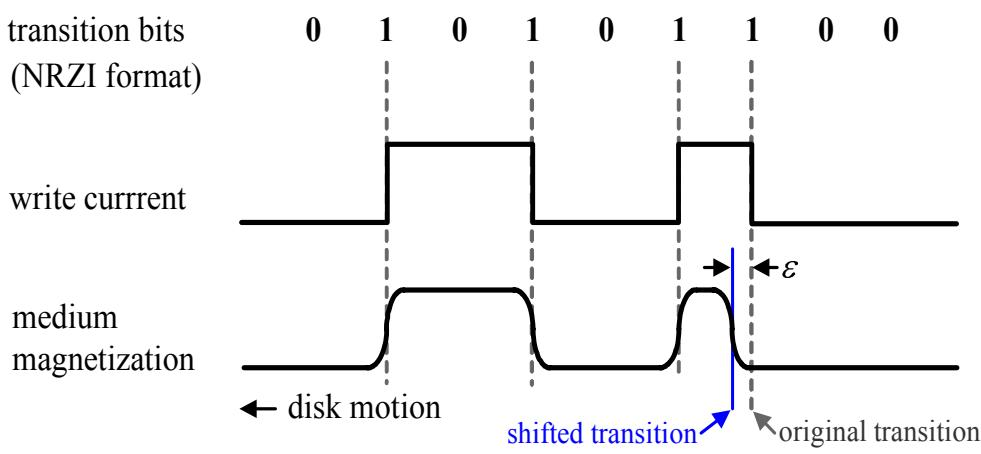  
รูปที่ 6.10: ผลกระทบที่เกิดจาก NTLS ในระบบการบันทึกแบบแนวนอน

## NLTS ในระบบการบันทึกแบบแนวนอน

ในการเขียนบิตเปลี่ยนสถานะติดกันสองบิดเข้าไปในสื่อบันทึก ตำแหน่งที่เกิดการเปลี่ยนสถานะของ บิตตัวที่สองจะถูกเลื่อนตำแหน่งเข้ามาหาตำแหน่งที่เกิดการเปลี่ยนสถานะของบิตตัวแรก ดังแสดงใน รูปที่ 6.10 นั้นคือ NLTร มีผลทำให้ตำแหน่งการเปลี่ยนสถานะจะถูกเขียนลงไปในสื่อบันทึกก่อนที่ ควรจะเป็น โดยที่ ปริมาณการเลื่อนของตำแหน่งการเปลี่ยนสถานะ  จะยิ่งมาก ถ้าระยะห่างระหว่าง บิตเปลี่ยนสถานะ ของตัวปัจจุบันและ ตัวก่อนหน้านี้อยู่ไใกล้กันมาก ในทำนองเดียวกัน ปริมาณการ เลือนของตำแหน่งการเปลี่ยนสถานะ จะยิงน้อย ถ้าระยะห่างระหว่างบิตเปลียนสถานะของตัวปัจจุบัน และตัวก่อนหน้านือยู่ห่างกันมาก

## NLTS ในระบบการบันทึกแบบแนวตั้ง

จากรูปที่ 6.9 จะพบว่า เมื่อระยะทาง $| x / a |$ เพิ่มขึ้น ปริมาณของสนามการลบล้างสภาพแม่เหล็กใน สื่อบันทึก ที่ใช้กับการบันทึกแบบแนวตั้งจะ มีค่าเพิ่มขึ้น ซึ่งจะ ตรงกันข้ามกับกรณี ของสื่อบันทึกที่ใช้ กับการบันทึกแบบแนวนอน รูปที่ 6.11 แสดงผลกระทบที่เกิดจาก NTL ในระบบการบันทึกแบบ

## 6.2. กระบวนการเขียนข้อมูล

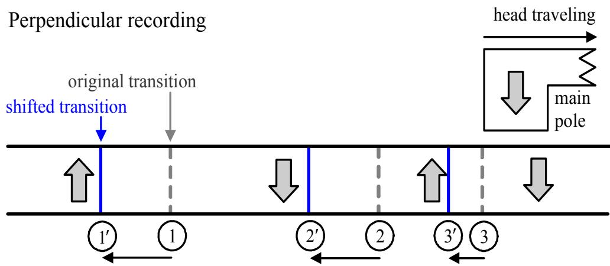  
รูปที่ 6.11: ผลกระทบที่เกิดจาก NTLS ในระบบการบันทึกแบบแนวตั้งเมื่อ เส้นปะ แสดงตำแหน่ง การเปลี่ยนสถานะที่ต้องการจะเขียนลงไปในสื่อบันทึก และ เส้นทึบแสดงการเลื่อนของตำแหน่งการ เปลี่ยนสถานะ

แนวตั้ง โดยที่ เส้นปะ (daรed line) แสดง ตำแหน่งการเปลี่ยนสถานะ ที่ต้องการจะ เขียนลงไปใน สื่อบันทึก และเส้นทึบ (รolid line) แสดงการเลื่อนของตำแหน่งการเปลี่ยนสถานะที่เป็นผลมาจาก สนามการลบล้างสภาพแม่เหล็กของตำแหน่งการเปลี่ยนสถานะก่อนหน้านี้ จากรูปที่ 6.11 การบันทึก ข้อมูลจะเริ่มจากการเขียนการเปลี่ยนสถานะเอกเทศ (iรolated traทรition)ณ ตำแหน่งที่ 1 และ การ เปลี่ยนสถานะไดบิต (dibit traทรเtion) ณ ตำแหน่งที่ 2 และ 3 จะเห็นได้ว่า การเปลี่ยนสถานะ ณ ตำแหน่งที่ 1 และ 2 เผชิญกับสนามการลบล้างสภาพแม่เหล็กสูงสุด เนื่องจาก ไม่มีการเปลี่ยนสถานะ ก่อนหน้านี้ที่อยู่ไใกล้ๆ ดั้งนั้น จึงทำให้การเปลี่ยนสถานะทั้งสองตำแหน่งถูกเลื่อนเป็นระยะทางคงที่มา ณ ตำแหน่งใหม่ที่1' และ 2′ ตามลำดับ ในขณะที่ การเปลี่ยนสถานะ ณ ตำแหน่งที่ 3 ซึ่งอยู่ใกล้ กับตำแหน่งการเปลี่ยนสถานะที่ 2′ เผชิญกับสนามการลบล้างสภาพแม่เหล็กที่น้อยกว่า (ดูรูปที่ 6.10) จึงเป็นผลทำให้การเปลี่ยนสถานะ ณ ตำแหน่งที่ 3 ถูกเลื่อนเป็นระยะทางสั้นๆ มา ณ ตำแหน่งใหม่ ที่3′ ถ้ากำหนดให้ตำแหน่งที่ 1' เป็นจุดอ้างอิง จะพบว่า การเปลี่ยนสถานะ ณ ตำแหน่งที่ 3′ เป็น เพียงการเปลี่ยนสถานะที่ถูกเลื่อนให้ห่างออกไปจากตำแหน่งการเปลี่ยนสถานะที่ 2′ การเลื่อนนี้จะถูก พิจารณาว่าเป็น NLTS ของการบันทึกแบบแนวตั้ง ซึ่งจะต่างจากผลกระทบของ NLTS ของการบันทึก

แบบแนวนอน ที่มีแนวโน้มที่จะดึงตำแหน่งการเปลี่ยนสถานะของตัวปัจจุบันให้เข้ามาใกล้กับตำแหน่ง -7   
การเปลี่ยนสถานะของตัวก่อนหน้านี้

เนื่องจาก ระดับความรุนแรงของ NTLS จะขึ้นอยู่กับลักษณะ ของแบบข้อมูล (data patterท)ที่ ต้องการจะเขียนเข้าไปในสื่อบันทึก ในทางปฏิบัติ ระบบสามารถที่จะทราบล่วงหน้าได้ว่า ข้อมูลรูปแบบ ใดที่กำลังจะ ถูกเขียนเข้าไปในสื่อบันทึก เพราะฉะนั้น นักวิจัยจึงสามารถที่จะ ออกแบบเทคนิคต่างๆ เพื่อใช้ในการป้องกันหรือลดผลกระทบที่เกิดจาก NLTS ได้ โดยเทคนิคนี้จะ เรียกกันว่า "การชดเชย ก่อนการเขียน (พrite precompensation)"ซึ่งสามารถที่จะช่วยลดปัญหาที่เกิดจาก NLTร ได้อย่างมี ประสิทธิ ภาพ [1, 5] สำหรับหลักการทำงานของการชดเชยก่อนการเขียนจะอธิบายในหัวข้อที่ 6.2.5

โดยสรุปแล้ว ความไม่เป็นเชิงเส้นต่างๆ ที่เกิดขึ้นระหว่างกระบวนการเขียนข้อมูล เช่น HTร หรือ NLTS เป็นต้น จะส่งผลทำให้สัญญาณ์read-bak ที่ได้จากหัวอ่านมีคุณลักษณะไม่สอดคล้องกับ คุณสมบัติการซ้อนทับ นั่นคือ สัญญาณ read-back ไม่สามารถ แสดงให้อยู่ในรูปของผลรวมเชิงเส้น ของสัญญาณพัลส์ เปลี่ยนสถานะได้ ดังนั้น ถ้าส่งสัญญาณ read-back ที่ได้รับผลกระทบจากความไม่ เป็นเชิงเส้นในระบบ เข้าไปในวงจรภาครับ ผลลัพธ์ที่ได้จะมีข้อผิดพลาดมาก ทั้งน้เป็นเพราะว่า วงจร ตรวจหา PRML10 (partial-response maximum-likelihood) ที่นิยมใช้กันทั่วไปในวงจรภาครับของ ฮาร์ดดิสก์ไดรฟ์ ถูกออกแบบมาบนสมมุติฐานที่ว่า สัญญาณ read-back สามารถเขียนให้อยู่ในรูปของ ผลรวมเชิงเส้นของสัญญาณพัลส์เปลี่ยนสถานะได้ เพราะฉะนั้น ถ้ายอมให้ผลกระทบที่เกิดจากความ ไม่เป็นเชิงเส้นเพียงเล็กน้อยผ่านเข้าไปในวงจรตรวจหา PRML แล้ว จะส่งผลทำให้เกิดข้อผิดพลาดใน รูปของ BER สูงมาก [1]

## 6.2.5 การชดเชยก่อนการเขียน

เทคนิคการชดเชยก่อนการเขียน (พrite precompensation) ถูกนำมาใช้เพื่อลดผลกระทบที่ เกิดจาก NLTS เนื่องจาก ระดับความรุนแรงของ NLTS จะขึ้นอยู่กับรูปแบบของข้อมูลที่จะ เขียน เข้าไปในสื่อ บันทึก ดังนัน ระบบจึงสามารถที่จะ คำนวณหาปริมาณการเลือนตำแหน่งของการเปลี่ยนสถานะได้ โดยใช้เทคนิคต่างๆ เช่น เทคนิคการพิจารณารูปร่างสัญญาณพัลส์ที่ถูกสกัดออกมา (extracted pulse

## 6.2. กระบวนการเขียนข้อมูล

shape) [52] หรือเทคนิคในโดเมนความถี่ [53] เป็นต้น

หลักการทำงานโดยทั่วไปของการชดเชยก่อนการเขียน มีดังต่อไปนี้ สำหรับระบบการบันทึกแบบ แนวนอน เมื่อเกิด NLTร ขึ้นระหว่างจากเขียนบิตเปลี่ยนสถานะลงไปในสื่อบันทึก ตำแหน่งการ เปลี่ยนสถานะ ของบิต ตัวปัจจุบันจะ ถูกเลื่อน ตำแหน่งเข้ามาหาตำแหน่งการเปลี่ยนสถานะ ของ บิตตัว ก่อนหน้านี้ เพราะฉะนั้น ปัญหานี้สามารถที่จะแก้ไขได้โดยการทำการหน่วงเวลาในการเขียนบิตเปลี่ยน สถานะ เข้าไปในสื่อบันทึก เพื่อเป็นการชดเชยผลกระทบที่เกิดจาก NLTร กล่าวคือ ถ้ากำหนดให้ แทนปริมาณการเลื่อนตำแหน่งของการเปลี่ยนสถานะ การชดเชยก่อนการเขียนจะทำให้ตำแหน่งการ เปลี่ยนสถานะของบิตตัวปัจจุบันถูกเลื่อนออกไปให้ไกลขึ้นเป็นปริมาณเท่ากับ  ซึ่งเมื่อ NLTร เกิด ขึ้น ผลลัพธ์สุทธิที่ได้ ก็คือ ตำแหน่งการเปลี่ยนสถานะของบิตตัวปัจจุบันก็จะถูกเลื่อนกลับมาอยู่ ณ ตำแหน่งที่ต้องการ นั้นคือ - € = 0 สำหรับรายละเอียดและวิธีการของการชดเชยก่อนการ เขียน สามารถศึกษาเพิ่มเติมได้ใน [43, 52, 53]

## 6.2.6วงจรมอดูเลเตอร์

วงจรมอดูเลเตอร์ (moฝนโลtor) จะทำหน้าที่แปลงข้อมูล บิตให้อยู่ในรูปคลื่นกระแสไฟฟ้ารูปสี่เหลี่ยม (rectangular current waveform) ที่เรียกกันว่า "กระ แสไฟฟ้าเขียน (write current)" (ดูรูปที่ 6.1) จากนั้น กระแสไฟฟ้าเขียนจะ ถูก ป้อนไป ยังขดลวดของหัวเขียน (write head) ทำให้เกิดเป็นสนาม เขียนแม่เหล็ก (magnetic write feld) บริเวณช่องว่าง (gap) ระหว่างสื่อบันทึกกับหัวเขียน โดยทั่วไป สนามเขียนแม่เหล็กจะต้องมีขนาดหรือความเข้มมากกว่าสภาพลบล้างแม่เหล็กของสื่อบันทึก เพื่อที่จะ ได้สามารถทำให้สื่อบันทึก ณ บริเวณนั้นมีสภาพความเป็นแม่เหล็กตามทิศทางของสนามเขียนแม่เหล็ก ที่ป้อนเข้าไป นอกจากนี้ การเปลี่ยนสถานะสภาพความเป็นแม่เหล็ก (magnetization tranรition) ของ สื่อบันทึก สามารถทำได้โดยการเปลี่ยนแปลงทิศทางของสนามแม่เหล็กสำหรับเขียน (หรือทิศทางของ กระแสไฟฟ้าเขียน) เพื่อให้สอดคล้องกับการเขียนข้อมูลบิด 0 และบิต 1

ในทางปฏิบัติแล้ว ระบบการจัดเก็บข้อมูลดิจิทัลในฮาร์ดดิสก์ไดรฟ์จะใช้ "การบันทึกแบบไบนารี (binary recording)" นั่นคือ สภาพความเป็นแม่เหล็กที่อยู่ในสื่อบันทึกจะมีเพียง 2 ทิศทางเท่านั้น11 หรือกล่าวอีกนัยหนึ่งคือ ระบบสามารถบันทึกข้อมูลได้เพียง 2 ระดับ (หรือ 2 ค่า) เท่านั้น ซึ่งต่าง จากการบันทึก ข้อมูลของดีวีดี (DVD) ที่สามารถบันทึกข้อมูลได้หลายๆ ระดับ ทั้งนี้ เป็นเพราะว่า โดย ปกติกระบวนการเขียนข้อมูล มีความไม่เป็นเชิงเส้นอยู่พอสมควร ดังนั้น ถ้าทำการบันทึกข้อมูลมาก กว่าสองระดับลงไปในสื่อบันทึกของฮาร์ดดิสก์ไดรฟ์ ผลกระทบที่เกิดจากความไม่เป็นเชิงเส้นก็จะยิ่งมี ความรุนแรงมากขึ้น ซึ่งจะส่งผลทำให้ประสิทธิภาพรวมของระบบแย่ลงมาก [5]

## รูปแบบข้อมูล

ในระบบการบันทึกแม่เหล็ก รูปแบบของข้อมูลที่ใช้ในการสร้างรูปคลื่นกระแสไฟฟ้าแบบรูปสี่เหลี่ยมจะ มี 2 แบบ คือ

1) NRZ (non-return-to-zero) โดยที่ แอมพลิจูดของรูปคลื่นกระแสไฟฟ้าจะบอกให้เห็นถึงข้อมูล บิตแบบไบนารี กล่าวคือ แอมพลิจูดสูงจะใช้แทนข้อมูลบิต "1" และ แอมพลิจูดต่ำจะใช้แทน ข้อมูลบิต “0"

2) NRzI (non-return-to-zero interleaved) โดยที่ ข้อมูลบิต "1" หมายถึง มีการเปลี่ยนสถานะ ของรูปคลื่นกระแสไฟฟ้า และข้อมูลบิต "0" หมายถึง ไม่มีการเปลี่ยนสถานะของรูปคลื่นกระแส ไฟฟ้า

รูปที่ 6.12 แสดงตัวอย่างลักษณะของข้อมูลแบบ NRZ และ NRZI เมื่อ ข้อมูลบิตช่องสัญญาณ (chan nel bit) คือ ข้อมูลจริงที่ต้องการจะเขียนลงไปในสื่อบันทึก จะเห็นได้ว่า ข้อมูลบิตช่องสัญญาณ และ ข้อมูลแบบ NRZ จะเหมือนกัน ซึ่งต่างจากข้อมูลแบบ NRZI แต่ข้อมูลทั้งหมดมีรูปคลื่นกระแสไฟฟ้า รูปสี่เหลี่ยมเหมือนกัน

อย่างไรก็ตาม ในการวิเคราะห์ระบบการประมวลผลสัญญาณของฮาร์ดติสก์ไดรฟ์ ข้อมูลแบบ N-RZI มักจะถูกนำมาใช้ในการอธิบายลักษณะการเกิดสัญญาณ read-back กล่าวคือ เมื่อหัวอ่านเคลื่อน ที่มาถึงบริเวณที่มีการเปลี่ยนสถานะ ก็จะเกิดการเหนี่ยวนำสนามแม่เหล็กทำให้ได้ผลลัพธ์ออกมาเป็น สัญญาณพัลส์ที่เรียกกันว่า "สัญญาณ พัลส์เปลี่ยนสถานะ (traทรitioก pนlรe)" ซึ่งเปรียบเสมือนกับ การนำข้อมูลบิต 1 มาคูณ กับสัญญาณผลตอบสนองการเปลียนสถานะ (traทรitioก reรponse) ของ ช่องสัญญาณ เพราะฉะนั้น ตำแหน่งที่มีการเปลี่ยนสถานะของสนามแม่เหล็กในสื่อบันทึกจึงสามารถ ที่จะถูกแทนได้ด้วยข้อมูลบิต 1 และตำแหน่งที่ไม่มีการเปลี่ยนสถานะของสนามแม่เหล็กในสื่อบันทึก จะถูกแทนด้วยข้อมูลบิต 0 (ดูรายละเอียดเพิ่มเติมได้ในหัวข้อที่ 6.3.3)

  
รูปที่ 6.12: ลักษณะของข้อมูลแบบ NRZ และ NRZI

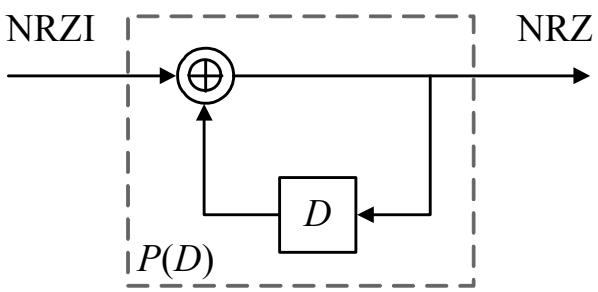  
รูปที่ 6.13: แบบจำลองแสดงความสัมพันธ์ของรูปแบบข้อมูล NRZ และ NRZI

ความสัมพันธ์ของข้อมูล NRZ และ NRZI

โดยทั่วไป ข้อมูลแบบ NRZ และ NRZI จะมีความสัมพันธ์กัน ดังแสดงในรูปที่ 6.13 ซึ่งสามารถเขียน

ให้อยู่ในรูปสมการทางคณิตศาสตร์ได้ คือ

$$
\mathrm { N R Z } = \left( { \frac { 1 } { 1 \oplus D } } \right) \mathrm { N R Z I }\tag{6.6}
$$

หรือ

$$
\mathrm { N R Z I } = ( 1 \oplus D ) \mathrm { N R Z }\tag{6.7}
$$

เมื่อ ซ $D$ คือ ตัวดำเนินการหน่วงเวลาหนึ่งหน่วย และเครื่องหมาย $\oplus$ คือ ตัวดำเนินการ XOR

ตัวอย่างที่ 6.3 จากรูปที่ 6.13 ถ้ากำหนดให้ ข้อมูลแบบ NRZ คือ {0, 1, 0, 0, 1, 1, 0} จงคำนวณหา ข้อมูลแบบ NRZI

วิธีทำ ถ้ากำหนดให้ $a _ { k }$ แทนข้อมูลแบบ NRZ และ $b _ { k }$ แทนข้อมูลแบบ NRZI ดังนั้น จากสมการ (6.7) จะได้ว่า

$$
b _ { k } = ( 1 \oplus D ) a _ { k } = a _ { k } \oplus a _ { k - 1 }
$$

ญ เนืองจาก $\{ a _ { k } \} = \{ 0 , 1 , 0 , 0 , 1 , 1 , 0 \}$ เพราะฉะนัน ข้อมูลแบบ NRZI จะ มีค่าเท่ากับ $\left\{ b _ { k } \right\} =$ {0, 1, 1, 0, 1, 0, 1, 0}

โดยสรุปแล้ว ข้อมูลแบบ NRZ บิต $^ { \ 6 } 1 ^ { \dag }$ จะใช้แทนสภาพความเป็นแม่เหล็กของสื่อบันทึกในหนึ่ง ทิศทาง และ บิต "0" จะ ใช้แทนสภาพความเป็นแม่เหล็ก ของสื่อ บันทึกในทิศทางที่ตรงกันข้าม ใน ขณะที่ ข้อมูลแบบ NRZ1 บิต "1" หมายถึง มีการเปลี่ยนสถานะสภาพความเป็นแม่เหล็กของสื่อ บันทึก และบิต "0" หมายถึง ไม่มีการเปลี่ยนสถานะสภาพความเป็นแม่เหล็กของสื่อบันทึก

## 6.2.7 คุณสมบัติของสื่อบันทึกที่ดี

ในการที่จะเลือกวัสดุแม่เหล็กมาทำเป็นสื่อบันทึกข้อมูลของฮาร์ดดิสก์ไดรฟ์ จะ ต้องคำนึงถึงคุณสมบัติ ต่างๆ ดังนี้ [1]

มีสภาพลบล้างแม่เหล็ก (cอerc์ivity) สูง เพื่อช่วยทำให้เกิดการเปลี่ยนสถานะแบบฉับพลันได้

## 6.3. กระบวนการอ่านข้อมูล

มีสภาพแม่เหล็กตกค้าง (remanent magnetization) สูง และสื่อบันทึกที่ใช้มีความหนาน้อยๆ เพื่อช่วยทำให้สัญญาณ read-back ที่ได้มีแอมพลิจูดสูงและมีคุณภาพดี

มีลูปฮิสเทอรีซิส (hysteresis loop) ที่มีลักษณะเป็นรูปสี่เหลี่ยมให้มากที่สุด เพื่อทำให้สามารถ ae สร้างการเปลี่ยนสถานะแบบฉับพลันได้ รวมทั้งทำให้ได้อัตราส่วนการบันทึกทับ (Overพrite ratio)ที่ดี

2 พินผิวของสือบันทึกจะต้องมิความเริยบ (รmoothness)มาก

มีโครงสร้างเกรน (graiท) แบบละเอียดที่มีขนาดเล็ก และมีการแจกแจงเอกรูป (uniform distribution) เพื่อช่วยลดสัญญาณรบกวนสื่อบันทึก (media ทoise) ที่จะเข้าไปในสัญญาณ readback

## 6.3 กระบวนการอ่านข้อมูล

ในระหว่างกระบวนการอ่านข้อมูล หัวอ่านจะทำการตรวจจับการเปลี่ยนแปลง ฟลักซ์ แม่เหล็ก (magnetic ปนx) ณ ตำแหน่งที่มีการเปลี่ยนสถานะของสภาพความเป็นแม่เหล็ก ซึ่งเป็นผลทำให้เกิดเป็น สัญญาณพัลส์แรงดันไฟฟ้าเหนี่ยวนำในขดลวด ตามกฎของฟาราเดย์ (Faraday's โaพ) สำหรับบริเวณ ที่มีการเปลี่ยนสถานะเอกเทศ (isolate transition) หัวอ่านจะให้สัญญาณพัลส์แรงดันไฟ้า ที่เรียก กันว่า "สัญญาณพัลส์เปลี่ยนสถานะ (traทรitioก pนlse)" เนื่องจาก กระบวนการอ่านข้อมูลในฮาร์ด ดิสก์ไดรฟ์สามารถประมาณได้ว่า มีคุณลักษณะ เป็นแบบเชิงเส้น (ซึ่งต่างจากกระบวนการ เขียนที่มี ญ   
คุณลักษณะไม่เป็นเชิงเส้นมากกว่า) เพราะฉะนั้น สัญญาณ read-back สามารถที่จะแสดงให้อยูในรูป ของผลรวมของสัญญาณพัลส์เปลี่ยนสถานะ ที่สอดคล้องกับบิตเปลี่ยนสถานะได้ โดยที่ สัญญาณพัลส์ เปลี่ยนสถานะ ที่ติดกันจะมีเครื่องหมายประจุตรงกันข้ามกัน ซึงจะอธิบายรายละเอียดต่อไปในหัวข้อที่ 6.3.3

## 6.3.1 ประเภทของหัวอ่าน

หัวอ่าน (read head) ในฮาร์ดดิสก์ไดรฟ์จะทำหน้าที่ในการแปลงฟลักซ์แม่เหล็กให้เป็นแรงดันไฟฟ้าใน รูปของสัญญาณ read-back หัวอ่านที่ใช้มีหลายประเภท เช่น

1) หัวแม่เหล็กแบบเฟร์ไรต์ (ferrt) เริ่มนำมาใช้งานในช่วงปี ค.ศ. 1970 โดยทำงานได้ดี เมื่อ ใช้เป็นหัวเขียน แต่ทำงานได้ไม่ดี เมื่อใช้เป็นหัวอ่าน เพราะว่า สัญญาณ read-back ที่ได้จะ มี แอมพลิจูดน้อย

2) หัวแม่เหล็กแบบ MR (magneto-resistive) เริ่มนำมาใช้งานในช่วงปี ค.ศ. 1990 สามารถทำงาน ได้ดี เมื่อใช้เป็นหัวอ่าน เพราะหัวอ่านแบบ MR นี้มีความไว (seกรitivity) ต่อการเปลี่ยนแปลง ของสนามแม่เหล็ก ทำให้สัญญาณ read-back ที่ได้มีแอมพลิจูดสูง

3)หัวแม่เหล็กแบบ GMR (giant magneto-resistive) เริ่มนำมาใช้งานในช่วงปี ค.ศ. 1997 สามารถ ทำงานได้อย่างมีประสิทธิมากกว่าหัวแม่เหล็กแบบ MR

4) หัวแม่เหล็กแบบ TMR (tunneling magneto-resistive) [1] ถือได้ว่าเป็นหัวแม่เหล็ก ที่กำลัง เป็นที่นิยมใช้ในปัจจุบัน เพราะว่า มีประสิทธิภาพดีกว่าหัวแม่เหล็กแบบอื่นๆ

โดยทั่วไปแล้ว หัวแม่เหล็กยิ่ดี ก็ะส่งผลทำให้ประสิทธิภาพรวมของระบบดีขึ้น

## 6.3.2 ประเภทของการรบกวน

ในทางปฏิบัติ สัญญาณ read-back ที่ได้จากหัวอ่านจะ ถูกทำให้ผิดเพี้ยน (distort) เนื่องมาจากปัจจัย ต่างๆ เช่น สัญญาณรบกวน (noise), ความผิดเพี้ยน (distortion), และการแทรกสอด (interference) ที่เกิดขึ้นภายในระบบการบันทึกแม่เหล็ก ซึ่งสามารถสรุปรายละเอียดได้ดังนี้

## สัญญาณรบกวน

สัญญาณรบกวน (กoiรe) จะ เกิดจากความไม่แน่นอนทางด้านกายภาพ และจำเป็นที่จะต้องถูกจัดการ ด้วยวิธีการทางสถิติ โดยเฉพาะอย่างยิ่ง เมื่อความจุของฮาร์ดดิสก์ไดรฟียิ่งสูง ความรุนแรงของสัญญาณ รบกวนก็จะยิ่งมาก สัญญาณรบกวนที่พบบ่อยในฮาร์ดดิสก์ไดรฟ์มีสาเหตุมาจาก

1) สื่อบันทึก สัญญาณรบกวนสื่อบันทึก (media ทoise) เกิดจากความไม่แน่นอนของสภาพ ความเป็นแม่เหล็กในสื่อบันทึก ซึ่งถือว่าเป็นสัญญาณรบกวนที่ก่อให้เกิดผลกระทบต่อระบบ มากที่สุด โดยเฉพาะอย่างยิ่งสำหรับระบบการบันทึกแบบแนวตั้ง โดยทั่วไป สัญญาณรบกวน สื่อบันทึกสามารถแบ่งออกเป็น 3 ประเภทหลัก คือ

## 6.3. กระบวนการอ่านข้อมูล

สัญญาณรบกวนการเปลี่ยนสถานะ (traทร์tioท ทoiรe) เกิดจากการแกว่งไปแกว่งมา (fluctuation) หรือความไม่แน่นอน (นncertainty) ของสภาพความเป็นแม่เหล็ก ณ บริเวณ ตำแหน่งที่มีการเปลี่ยนสถานะในสื่อบันทึก โดยที่ ระดับความรุนแรงของสัญญาณรบกวน ซู แบบนี้จะขึ้นอยู่กับลักษณะของแบบข้อมูลที่จะ เขียนลงไปในสื่อบันทึก สัญญาณรบกวน การเปลี่ยนสถานะจะมีผลกระทบต่อจานบันทึกฟิล์มบาง (thin-film disk) มากที่สุด โดย ทั่วไป เมื่อความจุข้อมูลของฮาร์ดดิสก์ไดรฟ์สูงขึ้น ความรุนแรงของสัญญาณรบกวนการ เปลี่ยนสถานะก็จะยิ่งสูง

สัญญาณรบกวนเนืองจากภาวะ เกรนหยาบ (particulate หรือ granularity noise) เกิด จากการกระจายแบบสุ่ม (random dispersion) ของอนุภาค แม่เหล็ก (magnetic par-ญ ticle) หรือที่เรียกกันว่า "เกรน (grain)" ในสื่อบันทึก ดังนั้น ถ้าเกรนในสื่อบันทึกมี ความหยาบมากเท่าใด ก็จะทำให้สัญญาณรบกวนแบบนี้มีความรุนแรงมากขึ้น สัญญาณ อื้ธส รบกวนเนืองจากภาวะ เกรนหยาบถือว่าเป็น สัญญาณรบกวนหลักที่เกิดขึ้นบ่อยในแถบ แม่เหล็ก (magnetic tape), แผ่นบันทึก (floppy disk), และจานบันทีึกฟิล์มบาง นอกจาก นี้ระดับความรุนแรงของสัญญาณรบกวนนี้จะไม่ขึ้นกับ (หรือเป็นอิสระต่อ) ความจุข้อมูล ของฮาร์ดดิสก์ไดรฟ์

สัญญาณรบกวนจากแถบเสียง (moฝนโลtioก กอiรe)เกิดจากความไม่แน่นอนของสภาพ ความเป็น แม่เหล็กของสื่อบันทึกเป็นสัดส่วนกับสภาพความเป็นแม่เหล็กที่ถูกบันทึกลง ไประหว่างตำแหน่งการเปลี่ยนสถานะ (นั่นคือ บริเวณที่ไม่มีการเปลี่ยนแปลงสถานะ) เสียงรบกวนจากแถบเสียงถือว่าเป็น สัญญาณรบกวนหลักที่เกิดขึ้นบ่อยในจานบันทึก ฟิล์มบาง โดยทั่วไป ระดับความรุนแรงของเสียงรบกวนจากแถบเสียงจะต่ำลง เมื่อความจุ ข้อมูลของฮาร์ดติสก์โดรฟ์สูขึ้น

2) หัวแม่เหล็ก (magnetic head) สัญญาณรบกวนเนืองจากหัวแม่เหล็ก (head noise) เกิดจาก คุณสมบัติทางกายภาพของวัสดุที่นำมาใช้ทำหัวแม่เหล็ก สัญญาณรบกวนนี้มีอยู่2 แบบที่พบ บ่อย คือ สัญญาณรบกวนแบบ Barkhausen และ สัญญาณรบกวนแบบ Johnรoท [1]

3) วงจรขยายก่อน (preamplifier) สัญญาณรบกวนอิเล็กทรอนิกส์ (electronics noise) เกิด จากการแกว่งไปแกว่งมาแบบสุ่มของอิเล็กตรอนในอุปกรณ์อิเล็กทรอนิกส์ต่างๆ กล่าวคือ เมื่อ อุปกรณ์อิเล็กทรอนิกส์ถูกใช้งานไปสักระยะหนึ่งจะทำให้เกิดความร้อนเกิดขึ้น ซึ่งความร้อนที่ เกิดขึ้นนี้มาจากการเคลื่อนที่ไปมาของอิเล็กตรอน ทำให้มีการแผ่พลังงานหรือความร้อนออกมา สัญญาณรบกวนอิเล็กทรอนิกส์ นี้ จะรู้จักกันในชื่อว่า "สัญญาณรบกวนความร้อน (thermal noise)" ซึ่งโดยทั่วไปจะมีลักษณะเป็นสัญญาณรบกวนสีขาว (พhite noise)

## ความผิดเพียน

ความผิดเพี้ยน (distortion) จะทำให้คุณสมบัติการซ้อนทับของสัญญาณ read-back ผิดเพี้ยนไป ความ รู   
ผิดเพี้ยนที่ เกิดจากกระบวนการเขียน (พrite distortion)ได้แก่การ เลื่อนตำแหน่งของการเปลี่ยน สถานะ แบบแข็ง (HTร) และการเลื่อนตำแหน่งของการเปลี่ยนสถานะ แบบไม่เป็นเชิงเส้น (NLTS) เป็นต้น ส่วนความผิดเพี้ยนที่เกิดจากกระบวนการอ่านข้อมูล (read distortion) ได้แก่ การลบล้างบาง ส่วน (partial erasure) และความไม่เป็นเชิงเส้นของหัวแม่เหล็ก เป็นต้น

## การแทรกสอด

การแทรกสอด (interference) จะส่งผลกระทบทำให้สัญญาณ read-back ที่ได้มีูปร่างผิดเพี้ยนไปจาก ที่ควรจะ เป็น การแทรกสอดที่ พบบ่อยในฮาร์ดดิสก์ไดรฟ์สามารถแบ่งออกเป็น 2 ประเภทใหญ่ คือ การแทรกสอดแบบ on-track และแบบ off-track [1]

## 6.3.3 แบบจำลองสัญญา ณ read-back

เมื่อหัวอ่านเคลื่อนที่มาถึงตำแหน่งที่มีการเปลี่ยนสถานะสภาพความเป็นแม่เหล็กของสื่อบันทึก หัวอ่าน จะให้สัญญาณพัลส์เปลี่ยนสถานะ หรือที่เรียกว่า "ผลตอบสนองการเปลี่ยนสถานะ (traทร์tioก response)" $g ( t )$ หรือ $- g ( t )$ ตามทิศทางของสภาพความเป็นแม่เหล็ก (ดูรูปที่ 6.1) สำหรับระบบการ บันทึกแบบแนวนอน สัญญาณพัลส์เปลี่ยนสถานะ หรือที่รูจักันในชื่อว่า "สัญญาณพัลส์ Lorentzian" สามารถเขียนให้อยู่ในรูปของสมการทางคณิตศาสตร์ได้ คือ [5]

$$
g ( t ) = \frac { 1 } { 1 + \left( \frac { 2 t } { \mathrm { P W } _ { 5 0 } } \right) ^ { 2 } }\tag{6.8}
$$

เมื่อ $\mathrm { P W _ { 5 0 } }$ คือ ความกว้างของสัญญาณพัลส์ $g ( t )$ วัด ณ ตำแหน่งที่สัญญาณพัลส์มีความสูงเป็น ครึ่งหนึ่งของความสูงสูงสุด สำหรับการบันทึกแบบแนวตั้ง สัญญาณพัลส์เปลี่ยนสถานะจะมีรูปสมการ ซู คือ [54]

$$
g ( t ) = \mathrm { { e r f } \left( \frac { 2 t \sqrt { l n 2 } } { P W _ { 5 0 } } \right) }\tag{6.9}
$$

เมื่อ $\ln ( \cdot )$ คือ ลอการิทึมธรรมชาติ (natural logarithm), erf() คือ ฟังก์ชันข้อผิดพลาด (error function) ซึ่งนิยามโดย erf $\begin{array} { r } { \dot { \mathbf { \Psi } } ( x ) = \frac { 2 } { \sqrt { \pi } } \int _ { 0 } ^ { x } e ^ { - t ^ { 2 } } d t } \end{array}$ , และ $\mathrm { P W _ { 5 0 } }$ คือ ความกว้างของพัลส์ $g ^ { \prime } ( t )$ หรือ อนุพันธ์ ของ $g ( t )$ วัด ณ ตำแหน่งที่สัญญาณพัลส์มีความสูงเป็นครึ่งหนึ่งของความสูงสูงสุด

ในระบบการบันทึก ข้อมูล ของฮาร์ดดิสก์ไดรฟ์ ความหนาแน่นของการบันทึก แบบนอร์มอลไลซ์ (ND: normalized recording density) ซึงนิยามโดย

$$
\mathrm { N D } = { \frac { \mathrm { P W } _ { 5 0 } } { T } }\tag{6.10}
$$

คือความหนาแน่นของการบันทึกข้อมูล [5] เมื่อ $T$ คือ คาบเวลาของข้อมูลหนึ่งบิต หรือที่เรียกกัน ว่า “บิตเซลล์ (bit cell)" ในทางปฏิบัติค่า ND นี้จะ เป็นตัวบ่งบอกว่า บริเวณ $\mathrm { P W _ { 5 0 } }$ สามารถที่จะ จัดเก็บข้อมูลได้จำนวนกี่บิด ดังนั้น ถ้ากำหนดให้ e $T$ เป็นค่าคงที่เมื่อ ค่า $\mathrm { P W _ { 5 0 } }$ หรือNDเพิ่ม ขึ้น ก็หมายความว่า ฮาร์ดดิสก์ไดรฟ์สามารถจุข้อมูลได้มากขึ้น รูปที่ 6.14 แสดงผลตอบสนองการ ญ เปลี่ยนสถานะสำหรับการบันทึกแบบแนวนอนและแบบแนวตั้ง ณ ระดับ ND ต่างๆ จากรูปจะพบว่า สัญญาณพัลส์เปลี่ยนสถานะของทั้งสองระบบจะครอบคลุมช่วงเวลาหลายบิตเซลล์ โดยเฉพาะอย่างยิ่ง เมื่อ ND มีค่าเพิ่มขึ้น หรืออีกนัยหนึ่ง คือ ISI จะมีความรุนแรงมากขึ้น เมื่อ ND มีค่าเพิ่มขึ้น เนื่องจาก โอกาสที่สัญญาณพัลส์เปลี่ยนสถานะที่อยู่ใกล้กันจะมาซ้อนเหลื่อมกัน มีความเป็นไปได้สูง นอกจากนี้ รูปที่ 6.15 แสดงความสัมพันธ์ระหว่าง ND และ $\mathrm { P W _ { 5 0 } }$ ซึ่งมีคุณสมบัติเป็นไปตามสมการ (6.10)

ในกรณีที่ หัวอ่านเคลื่อนที่มาถึงบริเวณที่มีตำแหน่งการเปลี่ยนสถานะติดกันสองครั้ง สัญญาณ สธ พัลส์สุทธิที่ได้ จะเรียกกันว่า "สัญญาณพัลส์ไดบิต (dibit pulse)"หรือ "ผลตอบสนองไดบิต (dibit response)"[5] ซึ่งมีค่าเท่ากับ

$$
m ( t ) = g ( t ) - g ( t - T )\tag{6.11}
$$

ดังแสดงในรูปที่ 6.16 ถ้าใช้การแปลงฟูเรียร์ที่ต่อเนื่องทางเวลา (ดูรายละเอียดในหัวข้อที่ 3.2) กับ

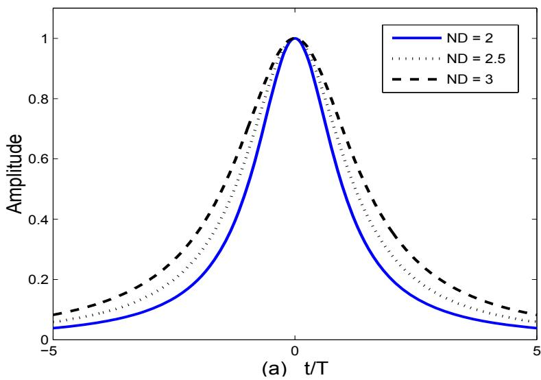

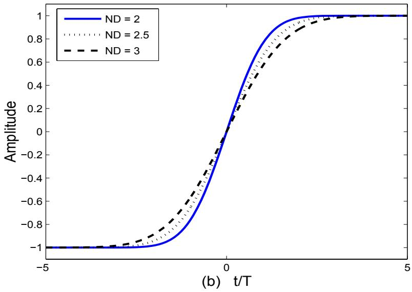  
$\mathfrak { J } ^ { \mathrm { q l } } \overset { \mathrm { d } } { \mathfrak { n } }$ 6.14: สัญญาณพัลส์เปลี่ยนสถานะ สำหรับการบันทึก (a) แบบแนวนอน และ (b) แบบแนวตั้ง

สัญญาณ $m ( t )$ จะได้ว่า ผลตอบสนองเชิงความถี่ของ $m ( t )$ สำหรับระบบการบันทึกแบบแนวนอน คือ

$$
M ( \Omega ) = \exp \{ - \pi | \Omega | \mathrm { N D } \} ( 1 - \exp \{ - j 2 \pi \Omega \} )\tag{6.12}
$$

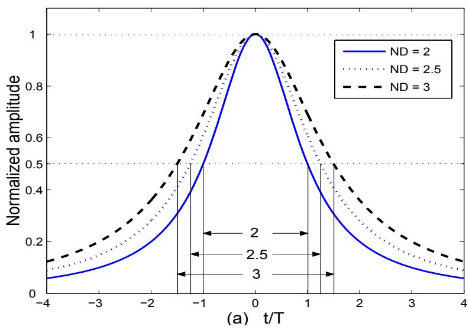

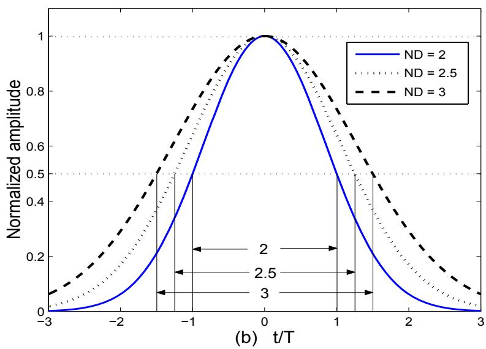  
รูปที่ 6.15: ความสัมพันธ์ระหว่าง ND และ $\mathrm { P W _ { 5 0 } }$ สำหรับการบันทึก (a) แบบแนวนอน และ (b) แบบแนวตัง  
เมื่อ $\exp \{ \cdot \}$ คือ ฟังก์ชันเลขี้กำลัง ในขณะที่ ผลตอบสนองเชิงความถี่ของ $m ( t )$ สำหรับระบบการ

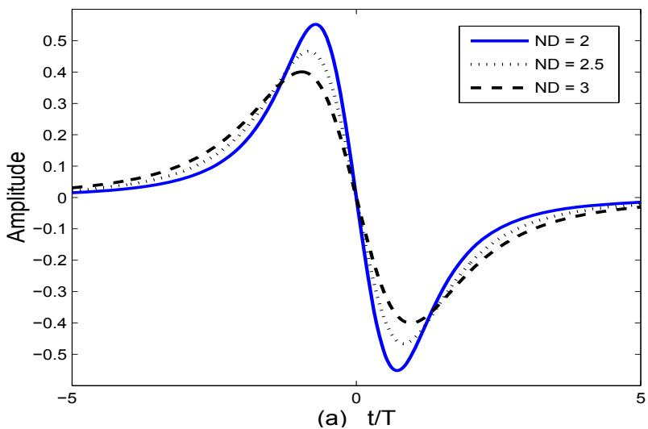

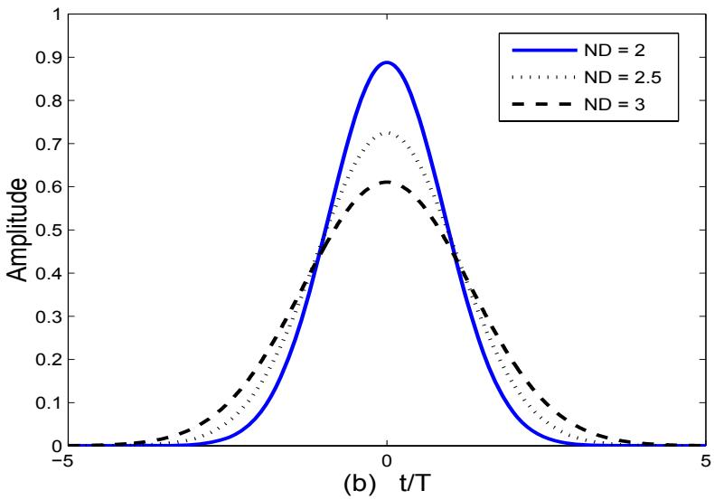  
รูปที่ 616: ผลตอบสนองไดบิต สำหรับการบันทึก (a) แบบแนวนอน และ (b) แบบแนวตั้ง

บันทึ่กแบบแนวตั้ง คือ

$$
M ( \Omega ) = \frac { T } { j \pi \Omega } \exp \left\{ - \frac { \pi ^ { 2 } \Omega ^ { 2 } \mathrm { N D } ^ { 2 } } { \ln ( 1 6 ) } \right\} ( 1 - \exp \{ - j 2 \pi \Omega \} )\tag{6.13}
$$

เมื่อ $\Omega = f T$ คือ ความถี่แบบนอร์มอลไลซ์ (normalized frequency), $f$ คือ ความถี่ มีหน่วยเป็น เฮิรตซ์ (Hz: hertz), |x| คือ ค่าสัมบูรณ์ของ x, และ $j = \sqrt { - 1 }$ คือ หน่วยจินตภาพ รูปที่ 6.17 แสดง ผลตอบสนองเชิงความถี่ของสัญญาณพัลส์ไดบิต

จากรูปที่ 6.17 จะพบว่า เมื่อ ND เพิ่มขึ้น รูปร่างของผลตอบสนองเชิงความถี่ของสัญญาณพัลส์ ไดบิต ทั้งสองแบบจะ ถูกบีบให้มาอยู่ ณ บริเวณความถี่ต่ำ12 นอกจากนี้ยังพบว่า ช่องสัญญาณ ของ การบันทึกแบบแนวนอนจะมีสเปกตรัมค่าศูนย์(รpectral ทนll) ณ ตำแหน่งที่ความถี่ $f = 0 \stackrel { \mathrm { \tiny ~  } } { \mathrm { \tiny ~ \textmedskip ~ } }$ หมายถึง ไม่มีส่วนประกอบไฟฟ้ากระแสตรง ในขณะที่ช่องสัญญาณของการบันทึก แบบแนวตั้งจะ มี ส่วนประกอบไฟฟ้ากระแสตรง

## 6.3.4 ความหนาแน่นผู้ใช้

พิจารณาแบบจำลองในรูปที่ 6.2 เมื่อ ข้อมูล ข่าวสาร (messรage bits) ถูกเข้ารหัสด้วยวงจร เข้ารหัส ECC และวงจร เข้ารหัสมอดูเลชัน ผลลัพธ์ทีได้เรียกว่า บิตที่ จะ ถูกบันทึก (recorded bits) ซึ่งจะ มี จำนวนบิตมากกว่าจำนวนบิตของข้อมูลข่าวสาร จำนวนของบิตที่ จะ ถูกบันทึกภายในบริเวณ $\mathrm { P W _ { 5 0 } }$ จะเป็นตัวกำหนดค่าความหนาแน่นของการบันทึกแบบนอร์มอลไลซ์ ND ตามสมการ (6.10) หรืออาจ จะเรียกสั้นๆ ว่า "ความหนาแน่นช่องสัญญาณ (channel density)" โดยที่ ค่า ND $\stackrel { \alpha } { \ P }$ จะส่งผลต่อผล ตอบสนองของสัญญาณพัลส์เปลี่ยนสถานะ ตามที่แสดงในรูปที่ 6.14

อย่างไรก็ตาม ในการวิเคราะห์ระบบการประมวลผลสัญญาณของฮาร์ดดิสก์ไดรฟ์ จะ นิยามคำว่า “ความหนาแน่นผู้ใช้ (แser deทรity)" เพื่อใช้อ้างถึงจำนวนข้อมูลบิตของผู้ใช้ (นั่นคือ ข้อมูลข่าวสาร จริงๆ ไม่นับบิตส่วนเกิน) ที่จะถูกบันทึกภายในบริเวณ $\mathrm { P W _ { 5 0 } }$ ถ้ากำหนดให้ $D _ { u }$ แทนความหนาแน่น ผู้ใช้ และ R แทนอัตรารหัส (code rate) ดังนั้น ความหนาแน่นช่องสัญญาณและความหนาแน่นผู้ใช้ จะมีความสัมพันธ์กันดังนี้

$$
\mathrm { N D } = { \frac { D _ { u } } { R } }\tag{6.14}
$$

และเนืองจาก $R \leq 1$ เพราะฉะนัน ซ $\mathrm { N D } \geq D _ { u }$ เสมอ

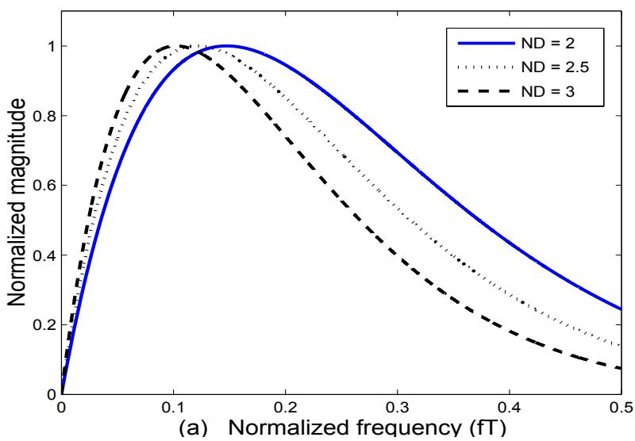

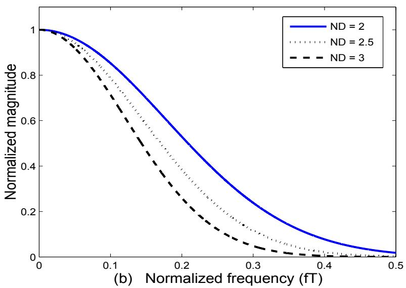  
รูปที่ 6.17: ผลตอบสนองเชิงความถี่ ของสัญญาณพัลส์ไดบิต สำหรับการบันทึก (a) แบบแนวนอน และ (b) แบบแนวตัง

## 6.4 แบบจำลองช่องสัญญาณการบันทึกระบบแม่เหล็ก

โดยทั่วไป ช่องสัญญาณของระบบการบันทึกแม่เหล็กสามารถจำลองได้เป็น 2 แบบ คือ แบบจำลอง ช่องสัญญาณ เสมือนจริง (realistic channel model) และ แบบจำลอง ช่องสัญญาณ อุดมคติ (ideal

  
รูปที่ 6.18: แบบจำลองช่องสัญญาณเสมือนจริง  
channel model) โดยที่ แบบจำลองช่องสัญญาณเสมือนจริงจะมีลักษณะการทำงานใกล้เคียงกับระบบ จริง ในขณะที่ แบบจำลองช่องสัญญาณอุดมคติมักจะนิยมใช้ในการศึกษา และวิเคราะห์หลักการทำงาน ซี เบื้องต้นของระบบการประมวลผลสัญญาณของฮาร์ดดิสก์ไดรฟ์ เนื่องจาก เป็นแบบจำลองที่ไม่ซับซ้อน และง่ายต่อความเข้าใจ

## 6.4.1 แบบจำลองช่องสัญญาณเสมือนจริง

ระบบการบันทึกแม่เหล็กสามารถแสดงให้อยู่ในรูปของแบบจำลองทางคณิตศาสตร์ได้ ตามรูปที่ 6.18 ปี่ ส   
เมื่อ ลำดับข้อมูลอินพุตแบบไบนารี $a _ { k } \in \{ 0 , 1 \}$ ที่มีคาบเวลาของบิตเท่ากับ Tจะถูกส่งผ่านไปยัง วงจรหาอนุพันธ์ อุดมคติ (ideal differentiator) $1 - D$ เมื่อ D คือ ตัวดำเนินการหน่วงเวลา T หน่วย ทำให้ได้เป็นลำดับข้อมูลเปลี่ยนสถานะ $b _ { k } \in \{ - 1 , 0 , 1 \}$ เมื่อ ซ $b _ { k } = \pm 1$ หมายถึง การเปลียนสถานะ แบบบวก (positive transition) หรือแบบลบ (negative transition) และ $b _ { k } = 0$ หมายถึง ไม่มีการ เปลี่ยนสถานะ

ลำดับข้อมูลเปลี่ยนสถานะ $b _ { k }$ จะ ถูกส่งผ่านไปยังช่องสัญญาณที่มีผลตอบสนองอิมพัลส์เท่ากับ ผลตอบสนองการเปลี่ยนสถานะ $g ( t )$ และถูกรบกวนด้วยสัญญาณรบกวน $n ( t )$ สัญญาณ readback, $p ( t )$ , จะ ถูกส่งผ่านไปยังวงจรกรองผ่านตำ (LPF: low-pass filter) เพือกำจัดสัญญาณรบกวน ที่อยู่นอกแถบความถี (out-of-band ทoise) จากนั้น ก็จะ ถูกทำการชักตัวอย่าง ณ เวลาที่ถูกควบคุม โดยระบบไทมมิ่งริคัฟเวอรี (timing recovery) ข้อมูลเอาตีพุตของวงจรชักตัวอย่างจะถูกส่งผ่านไปยัง อีควอไลเซอร์ และวงจรตรวจหาสัญลักษณ์ (sรymbo1 detector) เพื่อ หาลำดับข้อมูลอินพุตที่เป็นไปได้ มากทีสุด (most likely input sequence) นันคือ หาค่าประมาณของ $a _ { k }$ หรือ $\hat { a } _ { k }$

วงจรตรวจหาสัญลักษณ์ที่นิยมใช้ในระบบการบันทึกแม่เหล็ก คือ "วงจรตรวจหาวีเทอร์บิ (Viterbi detector)"[55] อย่างไรก็ตาม เนืองจาก ความ ซับซ้อน (complexity) ของวงจรตรวจหาวีเทอร์บิ \_1 รู จะ เพิ่ม ขึ้น แบบเลขชี้กำลัง ตามจำนวนหน่วยความจำของ ช่องสัญญาณ (channel memory) ดังนั้น อีควอไลเซอร์จึงเป็นสิ่งจำเป็นที่จะต้องถูกนำมาใช้งาน เพื่อ ทำหน้าที่ในการปรับรูปร่างผลตอบสนอง รวมของทั้งระบบให้เป็นผลตอบสนองที่ต้องการ ที่เรียกกันว่า "ผลตอบสนองทาร์เก็ต13 (target re-รponse)" H(D) [5] และช่วยทำให้ความซับซ้อนของวงจรตรวจหาวีเทอร์บิลดลงได้ (ในบทที $3 \textrm { -- } 4$ ของหนังสือ "การประมวลผลสัญญาณสำหรับการจัดเก็บข้อมูลดิจิทัล เล่ม 2 : การออกแบบวงจรภาค รับ" [6] จะอธิบายรายละเอียดการออกแบบทาร์เก็ตและอีควอไลเซอร์ [56, 57, 58] และแสดงให้เห็น ว่าความซับซ้อนของวงจรตรวจหาวีเทอร์บิมีค่าเท่ากับ $2 ^ { L - 1 }$ เมื่อ L คือ จำนวนแท็ปของทาร์เก็ต และ L—1 หมายถึง จำนวนหน่วยความจำของทาร์เก็ต) เทคนิคการใช้งานร่วมกันระหว่างอีควอไลเซอร์และ วงจรตรวจหาวีเทอร์บิ จะเรียกกันว่า "เทคนิดค PRML (partial-response maximum-likelihood)" ซึ่ง เป็นเทคนิคที่ใช้กันทั่วไปในระบบการประมวลผลสัญญาณของฮาร์ดดิสก์ไดรฟ์

หมายเหตุ เทคนิค PRML ยังคงถูกนำมาใช้ในกระบวนการการตรวจหาข้อมูลของทั้งระบบการบันทึก แบบแนวนอน และระบบการบันทึกแบบแนวตั้ง เพียงแต่พารามิเตอร์ต่างๆ ที่ใช้ในวงจรภาครับจะต่าง กัน เช่น ทาร์เก็ตที่ใช้ในระบบการบันทึกแบบแนวนอนจะต่างจากทาร์เก็ตที่ใช้ในระบบการบันทึกแบบ แนวตั้ง เป็นต้น ดังนั้น ผู้ใช้งานจะ ต้องเลือกใช้พารามิเตอร์ต่างๆ ให้เหมาะสมกับช่องสัญญาณของ แต่ละระบบ เพื่อที่จะทำให้ได้ประสิทธิภาพรวมของระบบสูงสุด

## ที่มาของแบบจำลองทางคณิตศาสตร์ของสัญญาณ read-back

แบบจำลองทางคณิตศาสตร์ของการสร้างสัญญาณ read-back, $p ( t )$ , ตามที่แสดงในรูปที่ 6.18 ได้ มาจากการสังเกตในห้องทดลอง กล่าวคือ เริ่มต้นนักวิจัยได้ทำการเขียนลำดับข้อมูล $\{ a _ { k } \}$ ลงไปใน สื่อบันทึก โดยที่ ลำดับข้อมูล $\{ a _ { k } \}$ จะ ถูก แปลงให้เป็น กระแสไฟฟ้าเขียน (write current) ตาม รูปแบบของ NRz นั้นคือ ข้อมูลบิดต 1 แทนด้วยสัญญาณไฟฟ้าที่มีแอมพลิจูดสูง และข้อมูลบิต 0 แทนด้วยสัญญาณไฟฟ้าที่มีแอมพลิจูดต่ำ จากนั้น กระแสไฟฟ้าเขียนก็จะถูกป้อนเข้าไปที่หัวเขียน เพื่อ ทำการ เขียนข้อมูลลงไปในสื่อบันทึก ในกระบวนการอ่านข้อมูล หัวอ่านจะให้สัญญาณพัลส์เปลี่ยน สถานะ $g ( t )$ ทุกครั้งที่อ่านข้อมูล ณ บริเวณที่มีการเปลี่ยนสภาพความเป็นแม่เหล็กของสื่อบันทึก ซึ่งได้ผลลัพธ์ออกมาเป็นสัญญาณ read-back $p ( t )$ ตามรูปที่ 6.19 เมื่อสมมุติว่า ไม่มีสัญญาณรบกวน ในระบบ นั่นคือ $n ( t ) = 0$ สำหรับทุกค่า t

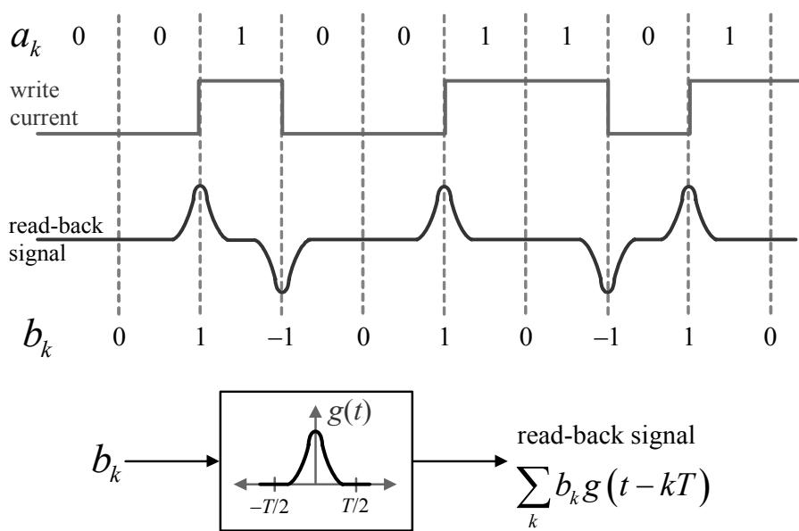  
รูปที่ 6.19: ตัวอย่างแสดงที่มาของแบบจำลองทางคณิตศาสตร์ของสัญญาณ read-back

เนื่องจาก นักวิจัยทราบว่า ลำดับข้อมูล $\{ a _ { k } \}$ ,สัญญาณพัลส์ $g ( t )$ , และสัญญาณ read-back $\stackrel { \mathrm { d } } { \boldsymbol { \ P } }$ สอดคล้องกับ $\{ a _ { k } \}$ คืออะไร ดังนั้น นักวิจัยจึงพยายามที่จะหาความสัมพันธ์ของทั้งสามสิ่งนี้ และได้ ข้อสรุปว่า ถ้านำลำดับข้อมูล $\{ a _ { k } \}$ มาผ่านวงจรกรอง $1 - D$ จะได้เป็นลำดับข้อมูล $\{ b _ { k } \}$ ตามรูปที่ 6.19 นั่นคือ $b _ { k } = a _ { k } - a _ { k - 1 }$ จากนั้นก็นำลำดับข้อมูล $\{ b _ { k } \}$ มาทำการกล้ำสัญญาณกับสัญญาณพัลส์ $g ( t )$ ตามหลักการของ "การกล้ำแอมพลิจูดของพัลส์ (PAM)" ก็จะได้เป็นสัญญาณ read-back ตาม ที่ต้องการ นอกจากนี้ เพื่อให้สัญญาณ rอad-back มีความเสมือนจริงมากขึ้น จึงได้มีการใส่สัญญาณ รบกวน $n ( t )$ เข้าไปในแบบจำลองช่องสัญญาณ เสมือนจริงในรูปที่ 6.18 ข้อสังเกต ค่าสัมบูรณ์ของ ลำดับข้อมูล $\{ b _ { k } \}$ ก็คือ ลำดับข้อมูลเปลี่ยนสถานะ (transition sequence) ตามรูปแบบของ NRZI นันเอง

  
รูปที่ 6.20: แบบจำลองช่องสัญญาณอุดมคติ

## 6.4.2 แบบจำลองช่องสัญญาณอุดมคติ

ถ้าสมมุติให้ กระบวนการอีควอไลเซชันเป็นแบบสมบูรณ์ (perfect equalization) แบบจำลองในรูปที 6.18 จะสามารถลดรูปได้เป็น แบบจำลองช่องสัญญาณอุดมคติ ดังแสดงในรูปที่ 6.20 โดยที่ ลำดับ ข้อมูลอินพุตแบบไบนารี $a _ { k }$ ที่มี คาบเวลาของบิต เท่ากับ T จะ ถูกกล้ำสัญญาณ (modulate) กับ สัญญาณพัลส์ในควิตส์ อุดมคติ (ideal Nyquist pulse) $q ( t ) = \sin ( \pi t / T ) / ( \pi t / T )$ [37] และ ถูก รบกวนด้วยสัญญาณรบกวน $n ( t )$ สัญญาณที่วงจรภาครับได้รับ $p ( t )$ จะถูกส่งผ่านไปยังวงจรกรอง ผ่านตำ เพื่อกำจัดสัญญาณรบกวนที่อยู่นอกแถบความถี จากนั้น ก็จะถูกทำการชักตัวอย่าง ณ เวลาที ถูกควบคุมโดยระบบไทมมิ่งริคัฟเวอรี จากนั้น ข้อมูลเอาต์พุตของวงจรชักตัวอย่างก็จะถูกส่งผ่านไปยัง วงจรตรวจหาสัญลักษณ์ เพื่อทำการหาลำดับข้อมูลอินพุตที่เป็นไปได้มากที่สุด

ทาร์เก็ตแบบผลตอบสนองบางส่วน หรือที่เรียกว่า "ทาร์เก็ตแบบ PR (partial response)" [59] ที่เป็นที่ยอมรับในการบันทึกแบบแนวนอน จะมีรูปสมการเป็น [5]

$$
H ( D ) = ( 1 - D ) ( 1 + D ) ^ { n }\tag{6.15}
$$

$$
H ( D ) = ( 1 + D ) ^ { n }\tag{6.16}
$$

เมื่อ n คือ เลขจำนวนเต็มบวก จากสมการ (6.16) จะพบว่า ระบบการบันทึกแบบแนวตั้งจะไม่มีพจน์ (1 – D) ทั้งนี้เป็นเพราะว่า ช่องสัญญาณการบันทึกแบบแนวตั้งมีส่วนประกอบไฟฟ้ากระแสตรง (ดู รูปที่ 6.17) รูปที่ 6.21 เปรียบเทียบผลตอบสนองเชิงความถี่ของทาร์เก็ตแบบต่างๆ โดยที่ ตัวเลขที่อยู ในเครื่องหมายวงเล็บสี่เหลี่ยม [.] แสดงค่าสัมประสิทธิ์แต่ละแท็ปของทาร์เก็ต ตัวอย่างเช่น "PR4 $[ 1 \ 0 \ - 1 ] ^ { \cdots }$ หมายถึง ทาร์เก็ตแบบ PR4 (PR class-IV) ที่มีฟังก์ชันถ่ายโอนในโดเมน D คือ $H ( D ) =$ $1 - D ^ { 2 }$ หรือ "EEPR2 [1 4 6 4 1]" หมายถึง ทาร์เก็ตแบบ EEPR2 ที่มีฟังก์ชันถ่ายโอนในโดเมน Dคือ $H ( D ) = 1 + 4 D + 6 D ^ { 2 } + 4 D ^ { 3 } + D ^ { 4 }$ เป็นต้น

จากรูปที่ 6.21 จะ พบว่า เมื่อช่องสัญญาณมีค่า ND เพิ่มขึ้น ทาร์เก็ตที่ใช้ก็ควรที่จะมีจำนวนแท็ป มากขึ้น (มีค่า ท มากขึ้น) เพื่อที่จะทำให้ผลตอบสนองของทาร์เก็ตมีลักษณะใกล้เคียงกับผลตอบสนอง ของ ช่องสัญญาณให้มากที่สุด ซึ่งจะ ส่งผลทำให้วงจรตรวจหาวีเทอร์บิทำงานได้อย่างมีประสิทธิภาพ มากขึ้น (ศึกษารายละเอียดส่วนนี้เพิ่มเติมได้ในบทที่ 3 ของหนังสือ "การประมวลผลสัญญาณสำหรับ การจัดเก็บข้อมูลดิจิทัล เล่ม 2 : การออกแบบวงจรภาครับ" [6]) นอกจากนี้ จากสมการ (6.15) และ (6.16) จะพบว่า ค่าสัมประสิทธิของทาร์เก็ตแบบ PR ทุกตัวจะเป็นเลขจำนวนเต็ม อย่างไรก็ตาม ถ้าใช้ ทาร์เก็ตที่มีค่าสัมประสิทธิ์เป็นเลขจำนวนจริง ซึ่งจะเรียกว่า "ทาร์เก็ตแบบผลตอบสนองบางส่วนแบบ ทั่วไป (GPR: generalized partial response)" หรือที่เรียกกันว่า "ทาร์เก็ตแบบ GPR" ประสิทธิภาพ รวมของระบบที่ได้จะมีมากกว่าการใช้ทาร์เก็ตแบบ PR [22, 56]

## 6.5 การแทรกสอดระหว่างสัญลักษณ์ในสัญญาณ read-back

ในหัวข้อนี้จะ แสดงให้เห็นถึงผลกระทบที่เกิดจากการมีสัญญาณพัลส์ เปลี่ยนสถานะติดกันสองพัลส์ ดังแสดงในรูปที่ 6.22 ผลรวมของสัญญาณพัลส์เปลี่ยนสถานะติดกันสองพัลส์ จะ เรียกว่า "ผลตอบ สนองไดบิต (dibit response)"หรือ "ผลตอบสนองสัญลักษณ์ (symbol response)" จะเห็นได้ว่า เมื่อ ND เพิ่มขึ้น แอมพลิจูดของสัญญาณพัลส์ไดบิตจะลดลง และ จุดสูงสุดของสัญญาณพัลส์ไดบิตก์ จะเคลื่อนที่ห่างออกไปจากตำแหน่งปกติ ปรากฏการณ์นี้จะเรียกว่า "การแทรกสอดระหว่างสัญลักษณ์ (ISI: intersymbol interference)" ซึ่งถือว่าเป็นสาเหตุหลักของข้อผิดพลาดที่เกิดขึ้นใน กระบวนการ ตรวจหาจุดสูงสุด (peak detection proceรs) โดยเฉพาะอย่างยิ่ง ที่ ND สูงๆ ทั้งนี้เป็นเพราะว่า ที่ ND สูง สัญญาณพัลส์ เปลี่ยนสถานะจะครอบคลุมช่วงเวลาหลายบิตเซลล์ (ดูในรูปที่ 6.22) ดังนั้น โอกาส ที่สัญญาณ พัลส์ เปลี่ยนสถานะสองพัลส์ จะ ซ้อนเหลื่อมกัน ก็จะ มีความเป็นไปได้สูง และ เมื่อสัญญาณ พัลส์ซ้อนเหลื่อมกันมาก ก็จะทำให้ความรุนแรงของ ISI มาก ฉะนั้นอาจจะสรุปได้ว่า ND ยิ่งสูง ความ รุนแรงของ ISI ในสัญญาณ read-back ก็จะ ยิ่งมาก

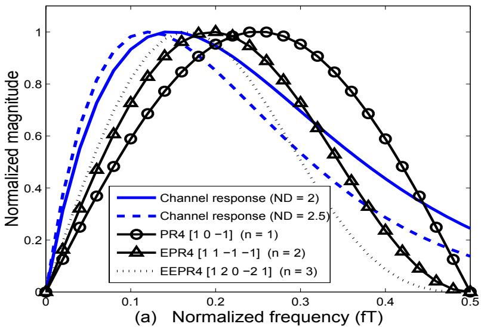

  
(b) Normalized frequency (fT)  
รูปที่ 6.21: ผลตอบสนองเชิงความถี่ของทาร์เก็ตแบบต่างๆ สำหรับช่องสัญญาณการบันทึก (a) แบบ

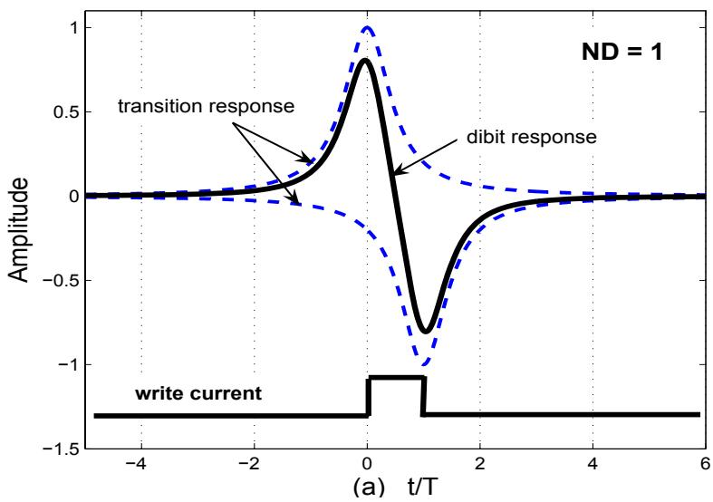

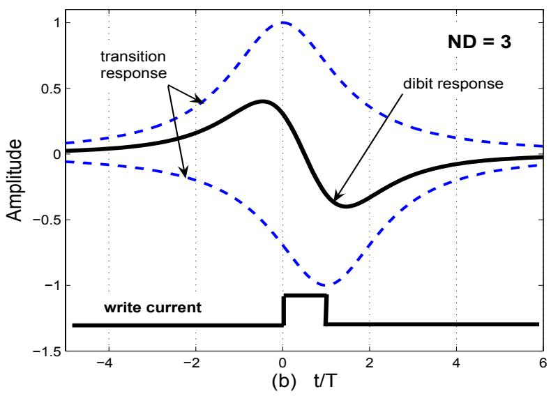  
รูปที่ 6.22: ผลรวมของสัญญาณพัลส์เปลี่ยนสถานะติดกันสองพัลส์ สำหรับ (a) ND = 1 และ (b) ND = 3

  
รูปที่ 6.23: ตัวอย่างสัญญาณ read-back ที่ ND ต่างๆ ที่สอดคล้องกับข้อมูลบิดเปลี่ยนสถานะ {0, 0, 1, 0, 1, 1, 1, 1, 0, 1, 0, 1}

รูปที่ 6.23 แสดงตัวอย่างสัญญาณ read-back ที่ ND ต่างๆ เนื่องจาก เวลาที่หัวอ่านอ่านข้อมูล ตรงบริเวณที่มีการเปลี่ยนสถานะ (ซึ่งตรงกับตำแหน่งที่แสดงด้วยบิดเปลี่ยนสถานะ ค่า "1") จะได้ ผลลัพธ์ออกมาเป็นสัญญาณพัลส์เปลี่ยนสถานะ ดังนั้น โดยทั่วไป ค่าของบิตเปลี่ยนสถานะค่า 1 จะ ตรงกับตำแหน่งที่เป็นจุดสูงสุดหรือจุดต่าสุดของสัญญาณ จากรูปที่ 6.23 สังเกตจะ พบว่า บริเวณที่มี บิตเปลี่ยนสถานะ ติดกันหลายๆ บิต (บริเวณที่ล้อมรอบด้วยวงรีเส้นปะ) สัญญาณ read-back ที่ได้ สำหรับ ND ค่ามาก จะมีลักษณะผิดเพี้ยนไปจากที่ควรจะเป็น ทำให้ยากต่อการถอดรหัสข้อมูลโดยใช้ วงจรตรวจหาจุดสูงสุด (peak detector)

ในทางปฏิบัติ การจัดการกับ ISI ที่แฝงอยู่ในสัญญาณ read-back สามารถทำได้ 2 วิธี คือ

1) การป้องกันหรือหลีกเลี่ยงไม่ให้เกิด ISI ซึ่งสามารถทำได้โดยการใช้เทคนิคต่างๆ เช่น การชดเชย ก่อน (precompensation), อีควอไลเซชันช่องสัญญาณอ่าน (read-channel equalization), หรือ การใช้รหัส RLL เป็นต้น

2) การจัดการกับ ISI โดยตรง ซึ่งสามารถทำได้โดยการใช้เทคนิค PRML ในวงจรภาครับ ซึ่งเป็น ที่นิยมใช้กันทั่วไปในระบบการประมวลผลสัญญาณของฮาร์ดดิสก์ไดรฟ์

## 6.6 สถาปัตยกรรมช่องสัญญาณอ่าน

ชิบช่องสัญญาณอ่าน (read-channel chip) ถือว่าเป็นหัวใจทางด้านอิเล็กทรอนิกส์ของฮาร์ดดิสก์ไดรฟ์ เพราะจะ ทำหน้าที่ในการนำสัญญาณ read-back ที่ได้จากหัวอ่าน มาทำการถอดรหัส ข้อมูลโดยให้เกิด ข้อผิดพลาดน้อยที่สุด ดังนั้น ก่อนที่นักวิจัยจะสามารถปรับปรุงประสิทธิภาพของระบบการประมวลผล สัญญาณของฮาร์ดดิสก์ไดรฟ์ให้ดีขึ้นได้ จำเป็นจะต้องทราบก่อนว่า ชิบช่องสัญญาณอ่านประกอบไป ด้วยส่วนประกอบอะไรบ้าง และ แต่ละส่วนประกอบทำหน้าที่อะไร รูปที่ 6.24 แสดงสถาปัตยกรรม ช่องสัญญาณอ่าน โดยที่ หน้าที่การทำงานของแต่ละส่วนประกอบสามารถสรุปได้ ดังต่อไปนี้

## 6.6.1 วงจรขยายก่อน

เนื่องจาก สัญญาณ read-back ที่ได้จากหัวอ่านมีแอมพลิจูด (ขนาดของสัญญาณ) น้อยมาก ประมาณ 300 มิลลิโวลต์ เมื่อวัดจากจุดสูงสุดถึงจุดต่ำสุดของสัญญาณ ดังนั้น ก่อนที่จะนำสัญญาณ reลad-back นี้ไปทำการประมวลผลในขั้นตอนต่อไป มีความจำเป็นที่จะต้องนำสัญญาณนี้ไปผ่านวงจรขยายก่อน (pre-ampplifer) เพื่อขยายสัญญาณให้มี แอมพลิจูดมากเพียงพอ (ถึงระดับหลายๆ สิบเท่าของมิลลิ โวลต์) ที่จะทำให้วงจรภาครับสามารถทำงานได้อย่างมีประสิทธิภาพ

## 6.6.2 วงจรคู่ควบไฟฟ้ากระแสสลับ

วงจรคู่ควบไฟฟ้ากระแสสลับ (a.c. coupling) จะทำหน้าที่กำจัดออฟเซต (offset) ของไฟฟ้ากระแสตรง ที่แฝงอยู่ในสัญญาณ read-back รวมทั้งปรับเส้นเชื่อมฐาน (baseline) ของสัญญาณ read-back ให้ ถูกต้อง กล่าวคือ ทำให้ค่าเฉลี่ยรวมของสัญญาณ read-back มีค่าเป็นค่าศูนย์

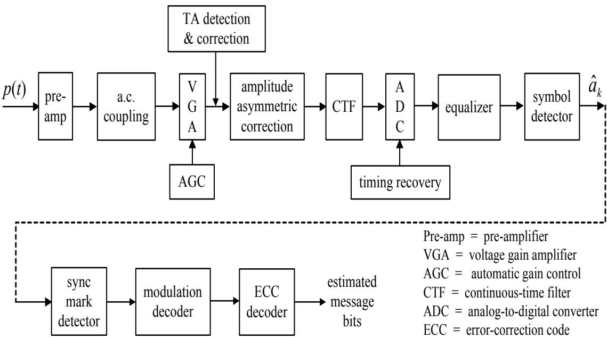  
รูปที่ 6.24: สถาปัตยกรรมช่องสัญญาณอ่าน

## 6.6.3 วงจรขยายแบบแปรผันได้

วงจรขยายแบบแปรผันได้ (VGA: variable gain amplifer) จะทำหน้าที่ควบคุมระดับแอมพลิจูดของ (ADC: analog-to-digital converter) หรือที่รูจักกันว่า "วงจรชักตัวอย่าง (sampler)" สามารถทำงาน ได้อย่างมีประสิทธิภาพ ในทางปฏิบัติ วงจรขยายแบบแปรผันได้นี้จะถูกควบคุมการทำงานโดย "วงจร ควบคุมอัตราการขยายแบบอัตโนมัติ (AGC: automatic gain control)" ซึ่งจะทำหน้าที่ในการคำนวณ หาค่าอัตราการขยายที่จะใช้ในการขยายสัญญาณ read-back ในแต่ละช่วงเวลา

ถ้าอัตราการขยายมาก เกินไป ก็จะส่งผล ทำให้ข้อมูล เอาต์พุต ที่ได้จากวงจร ชักตัวอย่างมี ค่าหยาบ โดยเฉพาะบริเวณที่เป็นจุดสูงสุดและ จุดต่ำสุดของสัญญาณ แต่ถ้าอัตราการขยายน้อยเกินไปก็จะทำให้ เกิดสัญญาณรบกวนการแจงหน่วย (qนaทtizatioก ทoise) มาก ซึ่งจะส่งผลทำให้ประสิทธิ ภาพรวมของ ระบบในรูปอัตราข้อผิดพลาดบิต (BER) แย่ลง

## 6.6.4 วงจรควบคุมอัตราการขยายแบบอัตโนมัติ

โดยทั่วไป ระดับแอมพลิจูดของสัญญาณ read-back ที่ได้จากหัวอ่านจะ แกว่งไปแกว่งมาค่อนข้างมาก เพราะฉะนั้น วงจรควบคุมอัตราการ ขยายแบบอัตโนมัติ (AGC) จะ ทำให้สัญญาณ เอาต์พุตที่ได้จาก วงจรขยายแบบแปรผันได้ (VGA) มีระดับแอมพลิจูดของสัญญาณค่อนข้างคงที่ ในทางปฏิบัติ วงจร ควบคุมอัตราการขยายแบบอัตโนมัติเป็นวงจรแบบแอนะล็อก และสามารถสร้างได้ 2 รูปแบบ คือ แบบ ที่ไม่ใช้ข้อมูลเข้าช่วย (non-data-aided AGC) และแบบที่ใช้ข้อมูลเข้าช่วย (data-aided AGC) สำหรับ รายละเอียดหลักการทำงานของวงจรควบคุมอัตราการขยายแบบอัตโนมัติสามารถศึกษาเพิ่มเติมได้จาก [5, 43]

## 6.6.5 การตรวจหาและการแก้ไขความขรุขระเชิงความร้อน

ในระหว่างกระบวนการอ่านข้อมูล หัวอ่านแบบ MR (magneto-resistive) จะรับรู้การเปลี่ยนแปลงของ ฟลักซ์แม่เหล็ก ณ บริเวณที่มีการเปลี่ยนสถานะของสภาพความเป็นแม่เหล็กตามลักษณะของข้อมูลที เขียนลงไปในสื่อบันทึก ทำให้เกิดเป็นสัญญาณพัลส์แรงดันไฟฟ้าที่เรียกว่า "สัญญาณ read-back" ใน กรณีที่พื้นผิวของสื่อบันทึกมีความขรุขระ (asperity) เมื่อตัวสไลเดอร์ (slider) เคลื่อนที่มากระทบกับ บริเวณที่มีความขรุขระ ทั้งพื้นผิวของตัวสไลเดอร์และที่ปลายของส่วนที่ขรุขระจะถูกทำให้ร้อนขึ้น ซึ่ง จะส่งผลทำให้เกิดเป็นแรง ดันไฟฟ้าส่วนเกินชั่วครู (transient voltage) ที่เรียกว่า "ความ ขรุขระเชิง ความร้อน (TA: thermal asperity)" เข้าไปในสัญญาณ read-back ที่หัวอ่านอ่านค่าได้ [60]

TA ถือว่าเป็นปัญหาที่สำคัญต่อกระบวนการการตรวจหาข้อมูล เพราะว่า TA จะส่งผลทำให้ระบบ ไทมมิ่งริคัฟเวอรีสูญเสียการเข้าจังหวะ (loss of synchronization) ซึ่งจะ เป็นผลทำให้ประสิทธิ ภาพ รวมของระบบแย่มาก ดังนั้น ถ้าไม่มีอัลกอริทึมการตรวจหาและการแก้ไข TA (TA deteตtioก and รู correctioท algorithm)[61] จากการทดลองพบว่า ประสิทธิ ภาพรวมของระบบจะแย่มากหรือน้อยขึน อยู่กับความรุนแรงของ TA

## แบบจำลองของความขรุขระเชิงความร้อน

แบบจำลองของสัญญาณ TA ที่เป็นที่นิยมใช้ แสดงในรูปที่ 6.25 [62] เนื่องจาก มีความสอดคล้อง กับสัญญาณจริงที่ได้จากหัวอ่าน เมื่อมี TA เกิดขึ้น จากรูปที่ 6.25 สัญญาณ TA จะ ถูกกำหนดด้วย

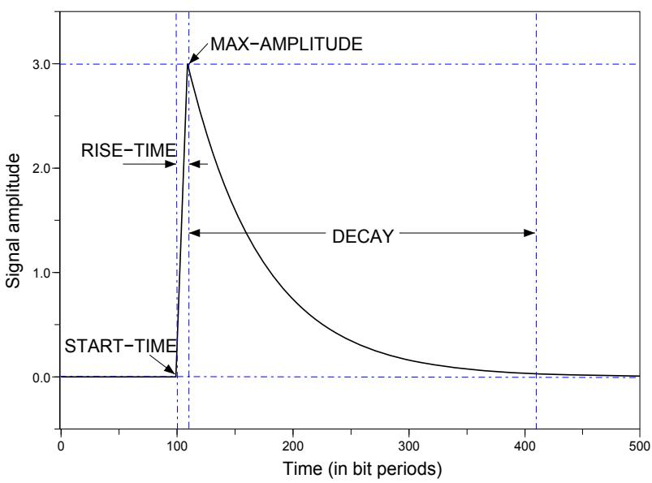  
รูปที่ 6.25: แบบจำลองสัญญาณ TA

พารามิเตอร์ 4 ตัว คือ

1) START-TIME เป็นตัวกำหนดเวลาเริมต้นของสัญญาณ TA

2) RISE-TIME เป็นตัวกำหนดเวลาที่สัญญาณ TA ต้องใช้ ในการที่จะทำให้สัญญาณ TA เปลี่ยน ค่าจากค่าศูนย์ไปจนถึงค่าแอมพลิจูดสูงสุด ที่กำหนดโดยพารามิเตอร์ MAX-AMPLITUDE

3) MAX-AMPLITบDE เป็นตัวกำหนดค่าแอมพลิจูดสูงสุดของสัญญาณ TA

4) DECAY เป็นตัวกำหนดเวลาที่สัญญาณ TA ต้องใช้ ในการที่จะ ทำให้แอมพลิจูดของสัญญาณ TA ลดลงเหลือ 1% ของค่าแอมพลิจูดสูงสุด โดยสมมุติว่า สัญญาณ TA มีการลดลงแบบเลขชี้ กำลัง (exponential decay)

โดยการใช้แบบจำลองสัญญาณ TA นี้ สัญญาณ TA สามารถที่จะถูกจำลองได้หลายรูปแบบ ตาม สภาพที่พบในการทดสอบผลิตภัณฑ์ ตัวอย่างเช่น รูปที่ 6.26 แสดงสัญญาณ read-back (วัดที่อินพุต ของวงจรกรองผ่านต่ำ) ที่ได้รับผลกระทบจาก TA ลักษณะต่างๆ เมื่อ START-TIME = 400T และ

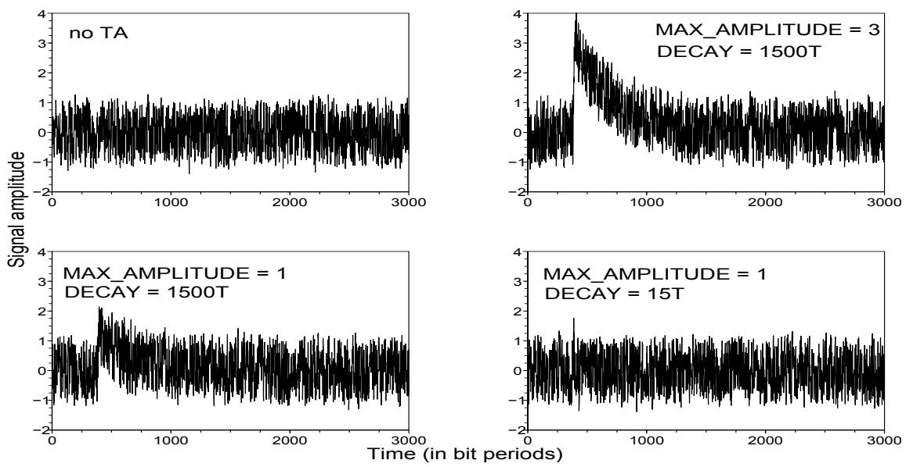  
รูปที่ 6.26: ตัวอย่างสัญญาณ read-back ที่ได้รับผลกระทบจาก TA ลักษณะต่างๆ

RISE-TIME = 10T จะเห็นได้ชัดว่า ทันที่ที่ตัวสไลเดอร์มากระทบกับความขรุขระของพื้นผิวบนสื่อ บันทึก ก็จะก่อให้เกิดสัญญาณ TA ซึ่งเป็นผลทำให้สัญญาณ read-back เปลี่ยนแปลงไปอย่างทันที รู่รู หลังจากนั้น ความร้อนที่ตัวสไลเดอร์และที่พื้นผิวของส่วนที่ขรุขระก็จะค่อยๆ เย็นลง ทำให้สัญญาณ read-bลck กลับมาอยู่ในลักษณะเดิม สังเกตจากรูปที่ 6.26 อาจจะคาดเดาได้ว่า ถ้าสัญญาณ TA มีค่า MAX-AMPLITUDE และ DECAY มาก ประสิทธิ ภาพของระบบก็จะยิ่งไม่ดี

รูปที่ 6.27 เปรียบเทียบประสิทธิภาพของระบบที่ได้รับผลกระทบจาก TA ลักษณะต่างๆ ตามที่ แสดงในรูปที่ 6.26 โดยสมมุติว่า ระบบทั้งหมดมีการชักตัวอย่างสัญญาณที่สมบูรณ์ 14 (perfect timing) จะเห็นได้ว่า แม้ว่าระบบจะมีการชักตัวอย่างสัญญาณที่สมบูรณ์ แต่ถ้าสัญญาณ read-back ได้รับ ผลกระทบจากสัญญาณ TA ประสิทธิภาพของระบบในรูป BER ที่ได้ ก็จะไม่ดี สำหรับรายละเอียด เรื่องผลกระทบของสัญญาณ TA ต่อระบบไทมมิ่งริคัฟเวอรี สามารถศึกษาเพิ่มเติมได้จาก [63]

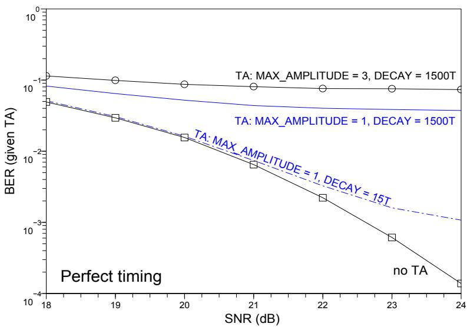  
รูปที่ 6.27: ประสิทธิภาพ BER ของระบบ โดยสมมุติว่า ระบบมีการชักตัวอย่างสัญญาณที่สมบูรณ์

## 6.6.6วงจรจุดต่อผลรวม

ในชิปช่องสัญญาณอ่านบางรุ่น อาจจะมีวงจรจุดต่อผลรวม (ธumming jนnction) เพิ่มขึ้นมา ก่อนที่จะ ส่งสัญญาณ read-back ต่อไปยัง วงจรการแก้ไขความไม่สมมาตรของแอมพลิจูด (amplitนde asymmetric correction) โดยวงจรจุดต่อผลรวมจะทำหน้าที่ในการจัดการกับองค์ประกอบไฟฟ้ากระ แสตรง ที่ยังหลงเหลืออยูในสัญญาณ read-back ให้หมดไป นอกจากนี้ยังทำให้ค่าเฉลี่ยของสัญญาณ readback อยู่ที่บริเวณเส้นเชื่อมฐาน (baseline) มากขึ้น ซึ่งเส้นเชื่อมฐานนี้จะ ถูกใช้เป็นสเกล (scale) กึ่งกลางของกระบวนการในการชักตัวอย่างสัญญาณ เพื่อที่จะทำให้ข้อมูลเอาต์พุตของวงจรชักตัวอย่าง มีคุณภาพดี

## 6.6.7 วงจรการแก้ไขความไม่สมมาตรของแอมพลิจูด

โดยทั่วไป หัวอ่านแบบ MR มักจะทำให้สัญญาณ read-back ที่ได้ มีสัญญาณพัลส์เปลี่ยนสถานะที่เป็น บวกและสัญญาณพัลส์ เปลี่ยนสถานะที่เป็นลบ มีรูปร่างไม่สมมาตรกัน (aรymmetry) [64] กล่าวคือ รูปร่าง ของสัญญาณ พัลส์ เปลี่ยนสถานะ ที่ เกิดขึ้นจากการ เปลี่ยน สถานะ แม่เหล็ก แบบบวก (positive สถานะ แม่เหล็กแบบลบ (negative magnetic transition) ทั้งนี้เป็นเพราะว่า ความไม่สมมาตร ของ แอมพลิจูด (amplitนde asymmetric) เกิดขึน เนืองจาก หัวอ่านMR มีความเข้มสนามแม่เหล็ก เอนเอียง (bias) ไปในทิศทางใดทิศทางหนึ่ง

เพราะฉะนั้น เมื่อเกิดความไม่สมมาตรของแอมพลิจูดขึ้นในระบบ จะส่งผลทำให้สัญญาณ readback ทีได้ ไม่มีคุณสมบัติการซ้อนทับ (นั่นคือ ไม่สามารถเขียนสัญญาณ read-back ในรูปของสมการ คณิตศาสตร์ได้) ซึ่งถ้าส่งสัญญาณ rลad-back นี้เข้าไปในกระบวนการตรวจหาข้อมูล ก็จะก่อให้เกิด ข้อผิดพลาดจำนวนมาก วงจรการแก้ไขความไม่สมมาตรของแอมพลิจูด (amplitนde asymmetric correction) จึงเป็นสิ่งจำเป็นที่จะ ต้องใช้ เพื่อสร้างคุณสมบัติความเป็นเชิงเส้นของสัญญาณ read-back ให้กลับคืนมา สำหรับรายละเอียดของขั้นตอนการแก้ไขความไม่สมมาตรของแอมพลิจูดสามารถศึกษา เพิ่มเติมได้จาก [64]

## 6.6.8 วงจรกรองที่ต่อเนืองทางเวลา

วงจรกรองที่ต่อเนื่องทางเวลา (CTF: continนous-time filter)ที่ใช้ในระบบการประมวลผลสัญญาณ ของฮาร์ดดิสก์ไดรฟ์ คือ วงจรกรองผ่านต่ำ (LPF: 1oW-paรร filter) เช่น วงจรกรองผ่านต่ำบัตเทอร์เวิร์ต อันดับที่ 7 (7th-order Butterworth low-pass filter) เป็นต้น ซึ่งจะทำหน้าที่ในการจำกัดพลังงานของ สัญญาณให้อยูภายในช่วงแถบความถี่ ที่ กำหนด โดยให้สอดคล้องกับอัตราการ ชัก ตัวอย่างสัญญาณ ที่วงจร ชัก ตัวอย่าง เพื่อป้องกันปัญหาความผิดเพี้ยนภาพ นอกจากนี้วงจรกรองผ่านต่ำยังช่วยกำจัด สัญญาณรบกวนที่อยู่นอกช่วงแถบความถี่ (out-of-baทd ทoise) ที่ต้องการ ไม่ให้ผ่านเข้าไปในกระบวน การตรวจหาข้อมูลในวงจรภาครับ

ในชิบช่องสัญญาณอ่าน พารามิเตอร์ที่ผู้ใช้งานสามารถปรับเปลี่ยนค่าได้ภายในวงจรกรองผ่านต่ำ จะมี 2 ตัว คือ

1) ความถี่ตัด (cut-off frequency) ซึ่งเป็นตัวกำหนดความถี่สูงสุดที่จะ ยอมให้สัญญาณผ่านไปได้ และ

2) ตัวเพิ่ม (bออรter) ซึ่งจะช่วยเพิ่มพลังงานของสัญญาณที่ความถี่สูง (บริเวณความถี่ตัด) เพื่อให้ สัญญาณที่ผ่านวงจรกรองผ่านต่ำออกไปตรงตามคุณลักษณะที่ต้องการ

## 6.6.9 วงจรเปลี่ยนสัญญาณแอนะ ล็อกเป็นสัญญาณดิจิทัล

วงจรเปลี่ยนสัญญาณแอนะ ล็อกเป็นสัญญาณดิจิทัล (ADC) หรือที่รูจักกันว่า "วงจรชักตัวอย่าง (sam pler)" จะทำหน้าที่ในการชักตัวอย่างสัญญาณแอนะล็อกให้ได้ออกมาเป็น "ข้อมูลวิยุต (discrete data)" ที่ผ่านการแจงหน่วย (quantization) แล้ว หรือที่เรียกกันว่า "แซมเปิล (sample)" โดยที่ ตำแหน่ง ของเวลาที่ ADC จะทำการชักตัวอย่างจะถูกควบคุมโดยระบบไทมมิ่งริคัฟเวอรี

ถ้าสมมุติว่า ระบบไทมมิ่งริคัฟเวอรีทำงานได้อย่างสมบูรณ์ คุณภาพของแซมเปิลที่ได้จาก ADC จะ ขึ้นอยู่กับจำนวนบิตที่ใช้ในการแทนข้อมูลหนึ่งแซมเปิล กล่าวคือ

•ถ้าใช้จำนวนบิตมาก แสดงว่ามีการแบ่งระดับของการแจงหน่วยหลายระดับ สัญญาณรบกวน การแจงหน่วยก็จะมีค่าน้อย แต่ ADC จะมีความซับซ้อนสูงและมีราคาแพง

ถ้าใช้จำนวนบิตน้อย แสดงว่ามีการแบ่งระดับของการแจงหน่วยไม่มาก สัญญาณรบกวนการ แจงหน่วยก็จะมีค่ามาก แต่ ADC จะมีความซับซ้อนตำและมีราคาถูก

อย่างไรก็ตาม ADC ที่ใช้สำหรับฮาร์ดดิสก์ไดรฟ์ในปัจจุบันนี้ จะใช้ข้อมูล 6 บิตสำหรับแทนข้อมูลหนึ่ง แซมเปิล

นอกจากนี้ อัตราการชักตัวอย่าง (sampling rate) ที่ใช้ใน ADC สามารถทำได้ 2 แบบ คือ

1) การชักตัวอย่างแบบอัตราสัญลักษณ์ (รymbol-rate sampling) หมายถึง ความถีการชักตัวอย่าง $f _ { s }$ จะเท่ากับความถี่ของการส่งข้อมูล นั้นคือ $f _ { s } = 1 / T$ เมื่อ $T$ คือ คาบเวลาของการส่งข้อมูล หนึ่งบิต (คาบเวลาของหนึ่งบิตเซลล์) ตัวอย่างเช่น ถ้าวงจรภาคส่งส่งข้อมูลมา 100 บิต ADC ก็จะทำการชักตัวอย่างจำนวน 100 ครั้ง เป็นต้น

2) การชักตัวอย่างแบบเกินจริง (Over-sampling) หมายถึง ความถี่การชักตัวอย่าง $f _ { s }$ จะมากกว่า ความถีของการส่งข้อมูล นันคือ $f _ { s } > 1 / T$ ตัวอย่างเช่น ถ้าวงจรภาคส่งส่งข้อมูลมา 100 บิต ADC ก็จะทำการชักตัวอย่างมากกว่า 100 ครั้ง เป็นต้น

การชักตัวอย่างแบบเกินจริงจะทำให้ได้จำนวนของแซมเปีลออกมามากกว่าที่ต้องการ ซึ่งหมายความ ว่า ระบบไทมมิ่งริคัฟเวอรีจะมีข้อมูลมากขึ้น สำหรับใช้ในกระบวนการเข้าจังหวะ ดังนั้น โดยทั่วไปแล้ว ไทมมิ่งริดัฟเวอรีที่ใช้อัตราการชักตัวอย่างแบบเกินจริงมักจะมีประสิทธิภาพดีกว่าไทมมิ่งริคัฟเวอรีที่ใช้ อัตราการชักตัวอย่างแบบอัตราสัญลักษณ์ (ศึกษารายละเอียดได้ใน [65]) อย่างไรก็ตาม ADC ที่ใช้ การชักตัวอย่างแบบเกินจริงจะ มีราคาแพงมาก (เนื่องจาก อัตราข้อมูลในฮาร์ดดิสก์ไดรฟ์สูงมากอยู่ แล้ว) เพราะฉะนั้น ในการตัดสินใจว่า จะนำไทมมิ่งริคัฟเวอรีที่ใช้อัตราการชักตัวอย่างแบบเกินจริงมา ใช้งานหรือไม่ จะต้องประนีประนอมระหว่างค่าใช้จ่ายที่เพิ่มขึ้น และประสิทธิภาพที่จะได้รับ

## 6.6.10 อีควอไลเซอร์

อีควอไลเซอร์ (equaizeาr) คือ วงจรกรองประเภทหนึ่งที่ทำหน้าที่ช่วยลดผลกระทบที่เกิดจาก ISI ให้ น้อยลง นอกจากนี้ ยังช่วยปรับผลตอบสนองรวมของระบบให้อยู่ในรูปของผลตอบสนองที่ต้องการ ที่ เรียกว่า "ผลตอบสนองทาร์เก็ต (target response)"ซึ่งจะ ช่วยทำให้วงจรตรวจหาสัญลักษณ์ สามารถ ทำงานได้ง่ายขึ้น อย่างไรก็ตาม ข้อเสียของการใช้งานอีควอไลเซอร์เมื่อวางอีควอไลเซอร์ไว้หลัง ADC คือ จะก่อให้เกิดปริมาณหน่วงเวลา (delay) จำนวนมากในไทมมิ่งลูป (timing loop) ซึ่งจะส่งผลทำให้ อัตราการลู่เข้า (convergence rate) ของระบบไทมมิ่งริคัฟเวอรีซ้าลง (ศึกษารายละ เอียดเพิ่มเติมได้ใน บทที่ 2 ของหนัางสือ "การประมวลผลสัญญาณสำหรับการจัดเก็บข้อมูลดิจิทัล เล่ม 2 : การออกแบบ วงจรภาครับ" [6]]

รูปที่ 6.28 แสดงตัวอย่างค่าสัมประสิทธิ์แต่ละ แท็ปของอีควอไลเซอร์ (เมื่อใช้งานในระบบที่ ND =0.5 และ 2.5) ที่ถูกออกแบบมา เพื่อให้สัญญาณเอาต์พุตที่ได้จากอีควอไลเซอร์มีรูปร่างเหมือนกับ ทาร์เก็ตแบบ PR4 นั้นคือ H(D) = 1 - D2 ซึ่งหมายความว่า ถ้ากำหนดให้ข้อมูลอินพุตมีค่าที เป็นไปได้อยูภายในเซต {−1, 1} และ ถ้าการอีควอไลเซชันเป็นแบบสมบูรณ์ (perfect equalization) ดังนั้น ข้อมูลเอาต์พุตของอีควอไลเซอร์จะ มีค่าที่เป็นไปได้อยู่ภายในเซต {−2, 0, 2} จากรูปที่ 6.28 อีควอไลเซอร์จำนวน 21 แท็ป ถูกนำมาใช้งานโดยมีแท็ปศูนย์กลาง (center tap) อยู่ที่ตำแหน่ง k = 0 นั่นคือ อีควอไลเซอร์นี้จะก่อให้เกิดปริมาณหน่วงเวลาเป็นจำนวน 10 บิตเซลล์ ซึ่งหมายความว่า เมื่อ ข้อมูลอินพุตตัวที่ k ถูกส่งเข้าไปในอีควอไลเซอร์ แต่ข้อมูลเอาต์พุตที่ได้จากอีควอไลเซอร์ ณ เวลา ขณะนั้น จะสอดคล้องกับข้อมูลอินพุตตัวที่ k - 10

รูปที่ 6.29 แสดงตัวอย่างสัญญาณ read-back ด้านขาเข้าและด้านขาออกของอีควอไลเซอร์ที่ ND = 0.5 (IS1 ไม่รุนแรง) เมื่อสมมติว่า ไม่มีสัญญาณรบกวนในระบบ จากรูปจะ เห็นได้ว่า แซมเปิล ด้านขาเข้าของอีควอไลเซอร์ (รูปที่ 6.29(a)) มีค่าค่อนข้างกระจัดกระจาย แต่เมื่อแซมเปิลเหล่านี้ผ่าน เข้าไปในอีควอไลเซอร์ ข้อมูล เอาต์พุตที่ได้จะที่ สอดคล้องกับทาร์เก็ต แบบ PR4 กล่าวคือ แซมเปิล

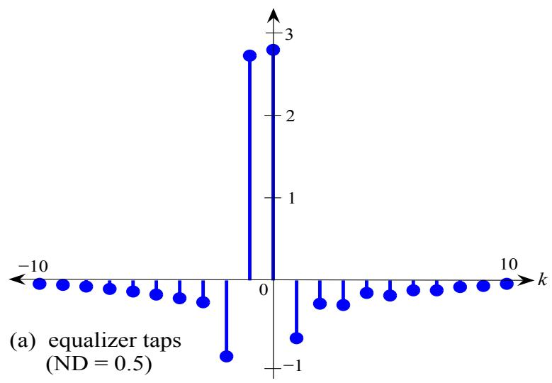

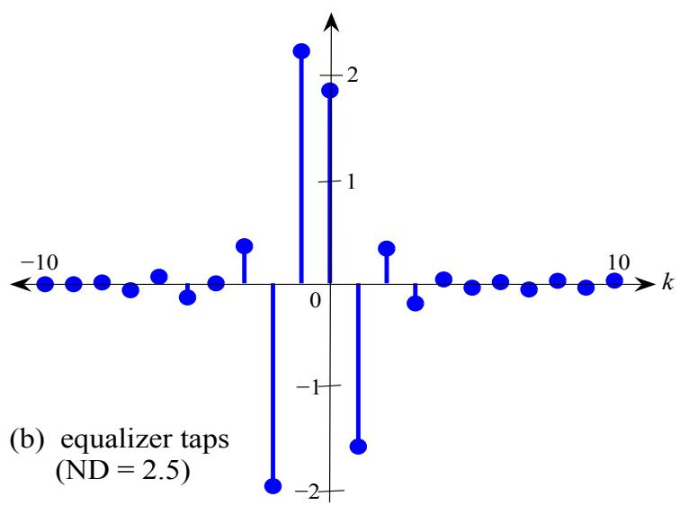  
รูปที่ 6.28: ค่าสัมประสิทธิ์ของแต่ละ แท็ปของอีควอไลเซอร์เมื่อใช้งานในระบบที่ (a) ND = 0.5 และ (b) ND = 2.5

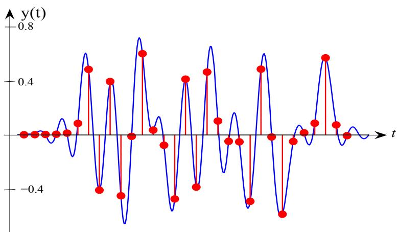  
(a) signal before equalization (ND = 0.5)

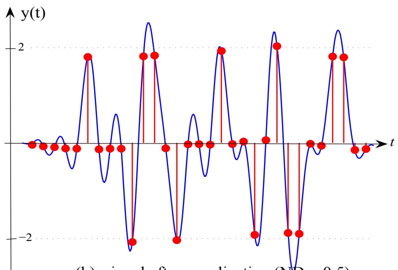  
(b) signal after equalization (ND = 0.5)  
รูปที่ 6.29: ข้อมูลแซมเปิล (a) ด้านขาเข้าของอีควอไลเซอร์ และ (b) ด้านขาออกของอีควอไลเซอร์ ที่ ND = 0.5

0.5 ซึ่งจะ ช่วยทำให้วงจรตรวจหาสัญลักษณ์ทำงานได้ง่ายขึ้น ในทำนองเดียวกัน รูปที่ 6.30 แสดง ตัวอย่างสัญญาณ read-back ด้านขาเข้าและ ด้านขาออกของอีควอไลเซอร์ที่ ND = 2.5 (ถือว่า ISI รุนแรง) เมื่อ ไม่มีสัญญาณรบกวนในระบบ ในกรณีนี้จะพบว่า แซมเปิลด้านขาเข้าของอีควอไลเซอร์มี ค่ากระจัดกระจาย อย่างไรก็ตามเมื่อแซมเปิลเหล่านี้ผ่านอีควอไลเซอร์ ข้อมูลเอาต์พุตที่ได้ก็ยังสอดคล้อง

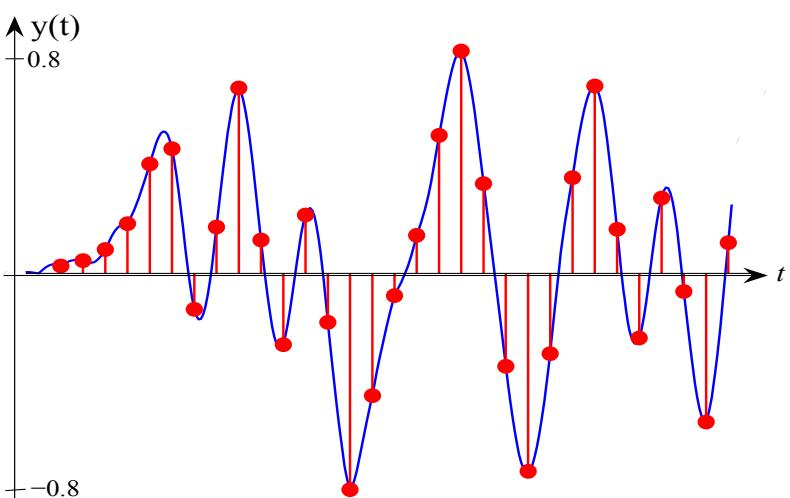  
(a) signal before equalization (ND = 2.5)

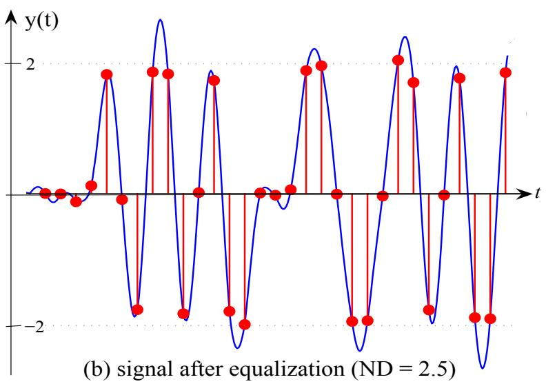  
รูปที่ 6.30: ข้อมูลแซมเปิล (a) ด้านขาเข้าของอีควอไลเซอร์ และ (b) ด้านขาออกของอีควอไลเซอร์ ที่ ND = 2.5

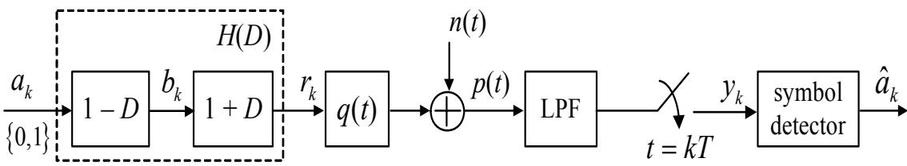  
รูปที่ 6.31: แบบจำลองช่องสัญญาณ PR4 อุดมคติ

## 6 ๘ กับทาร์เก็ตแบบ PR4 เช่นเดิม

โดยสรุปแล้ว ไม่ว่าในระบบจะมีIS1 มากน้อยเพียงใดก็ตาม อีควอไลเซอร์ที่ถูกออกแบบมาให้ เหมาะสมกับทาร์เก็ตที่ต้องการ ก็ยังคงสามารถช่วยปรับรูปร่างของสัญญาณ read-back ให้เป็นไปตาม ทาร์เก็ตที่ต้องการได้ ซึ่งจะช่วยทำให้วงจรตรวจหาสัญลักษณ์ทำงานได้ง่ายและมีประสิทธิภาพมากขึ้น

## ทำไมถึงต้องปรับสัญญาณพัลส์ให้อยู่ในรูปแบบที่ต้องการ?

พิจารณาแบบจำลองช่องสัญญาณ PR4 อุดมคติ นั่นคือ $H ( D ) = ( 1 - D ) ( 1 + D )$ ดังแสดงใน รูปที่ 6.31 โดยที่ ลำดับข้อมูลอินพต $a _ { k } \in \{ 0 , 1 \}$ จะถูกกรองด้วย $H ( D )$ (เมื่อ $b _ { k }$ คือ บิตเปลี่ยน สถานะ และ $r _ { k }$ คือ เอาต์พุตของช่องสัญญาณ) และ ถูกกล้ำสัญญาณด้วยฟังก์ชันซิงก์ (sinc function) $q ( t ) = \sin ( \pi t ) / ( \pi t )$ สัญญาณ read-back $p ( t )$ ซึ่งถูกรบกวนด้วยสัญญาณรบกวน ท(t) จะ ถูกส่ง ผ่านไปยังวงจรกรองผ่านต่ำ (LPF) และถูกทำการชักตัวอย่างด้วยความถี่ $f _ { s } ~ = ~ 1 / T$ เมื่อ T คือ คาบเวลาของหนึ่งบิตเซลล์ จากนั้น ข้อมูลเอาต์พุตที่ได้จากวงจรชักตัวอย่างจะ ถูกส่งไปยังวงจรตรวจหา สัญลักษณ์ เพื่อตัดสินใจว่า ข้อมูลบิตที่ส่งมาจากต้นทางคืออะไร ไห้พิจารณา 3 กรณี ต่อไปนี้

1) กรณีที่ระบบมีบิตเปลี่ยนสถานะเพียงบิตเดียว เช่น เมื่อ $\{ a _ { k } \} = \{ \{ \ . . . , 0 , 0 , 0 , 0 , 0 , 1 , 1 \}$ 1, 1, 1, . . . } จะได้ว่า $\{ b _ { k } \} = \{ \ . . . , 0 , 0 , 0 , 0 , 0 , 1 , 0 , 0 , 0 , 0 , . . . \ \}$ ดังนั้น สัญญาณ $p ( t )$ ที่ได้ คือ สัญญาณพัลส์เปลี่ยนสถานะเอกเทศ (isolated transition pulse) ตามรูปที่ 6.32 ซึ่งเกิดจากผลรวมของสัญญาณซิงก์สองสัญญาณที่ห่างกันเป็นเวลา T หน่วย ถ้าส่งสัญญาณ $p ( t )$ ไปยังวงจรชักตัวอย่าง แซมเปิลเอาต์พุตที่ได้จะเป็น $\left\{ y _ { k } \right\} = \left\{ \begin{array} { l l } { \ldots , 0 , 0 , 0 , 1 , 1 , 0 , 0 , 0 , } \end{array} \right.$ $0 , \ldots \}$

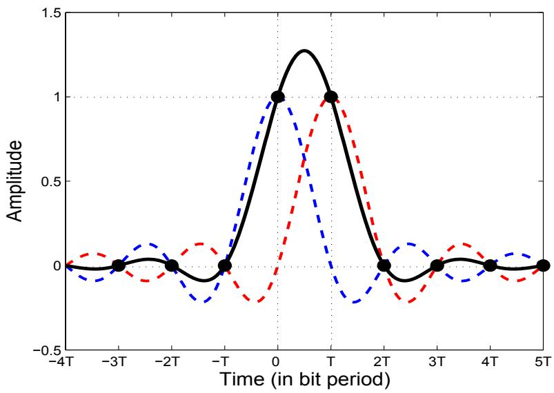  
รูปที่ 6.32: สัญญาณพัลส์เปลี่ยนสถานะซึ่งเกิดจากผลรวมของสัญญาณซิงก์สองสัญญาณ

2) กรณีที่ระบบมีบิตเปลี่ยนสถานะ 2 บิตติดกัน เช่น เมื่อ $\left\{ a _ { k } \right\} = \left\{ \begin{array} { l l } { \ldots , 0 , 0 , 0 , 0 , 1 , 0 , 0 , 0 , } \end{array} \right.$ $0 , \ldots \}$ จะได้ว่า $\{ b _ { k } \} = \{ \ . . . , 0 , 0 , 0 , 0 , 1 , - 1 , 0 , 0 , 0 , . . . \ \}$ ดังนั้น สัญญาณ $\mathbf { \Lambda } _ { p ( t ) } \mathbf { \Lambda } _ { \vec { \boldsymbol { \mathfrak { n } } } } ^ { \mathbf { d } }$ ได้จะเรียกว่า สัญญาณพัลส์ไดบิต (dibit pulse) ตามรูปที่ 6.33 ซึ่งเกิดจากผลรวมของสัญญาณ พัลส์เปลี่ยนสถานะ 2 สัญญาณที่ห่างกันเป็นเวลา T หน่วย ถ้าส่งสัญญาณ $p ( t )$ ไปยังวงจรชัก ตัวอย่าง แซมเปิลเอาต์พุตที่ได้จะเป็น $\{ y _ { k } \} = \{ \ . . . , 0 , 0 , 0 , 1 , 0 , - 1 , 0 , 0 , 0 , 0 , . . . \ \}$

3) กรณีที่ระบบมีบิตเปลี่ยนสถานะ 3 บิตติดกัน เช่น เมื่อ $\left\{ a _ { k } \right\} = \{ \mathbf { \Omega } . . . , 0 , 0 , 0 , 1 , 0 , 1 , 1$ จะได้ว่า ญ $1 , 1 , \ldots \}$ $\{ b _ { k } \} = \{ \ . . . , \ 0 , \ 0 , \ 0 , \ 1 , \ - 1 , \ 1 , \ 0 , \ 0 , \ 0 , \ . . . \ \}$ ดังนั้น สัญญาณ p(t) ที่ได้จะเรียกว่า สัญญาณพัลส์ไตรบิต (tribit pนlse) ตามรูปที่ 6.34 ซึ่งเกิดจากผลรวมของ สัญญาณพัลส์เปลี่ยนสถานะ 3 สัญญาณ โดยที่ แต่ละสัญญาณพัลส์ห่างกันเป็นเวลา T หน่วย ถ้าส่งสัญญาณ $p ( t )$ ไปยังวงจรชักตัวอย่าง แซมเปิลเอาต์พุตที่ได้จะ เป็น $\{ y _ { k } \} = \{ \ . . . , 0 , 0 \}$ $\left. 0 , 1 , 0 , 0 , 1 , 0 , 0 , 0 , \dots \right\}$

จากรูปที่ 6.31 ถ้ารู้ว่าช่องสัญญาณคืออะไร (นั้นคือ รู้ว่ารูปแบบของสัญญาณที่ต้องการเป็นอย่างไร) ก็จะ ทราบความสัมพันธ์ระหว่างสัญญาณอินพุต และ สัญญาณ เอาต์พุตของช่องสัญญาณ ตัวอย่างเช่น ในกรณีนี้ช่องสัญญาณ คือ $H ( D ) = 1 - D ^ { 2 }$ e ดังนั้น จะได้ว่า

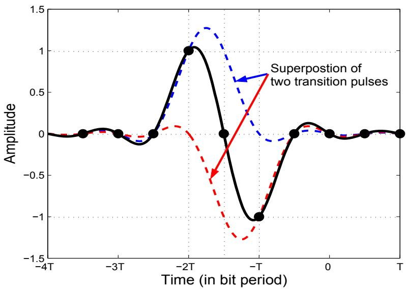

รูปที่ 6.33: สัญญาณพัลส์ไดบิตซึ่งเกิดจากผลรวมของสัญญาณพัลส์เปลี่ยนสถานะ 2 สัญญาณ  
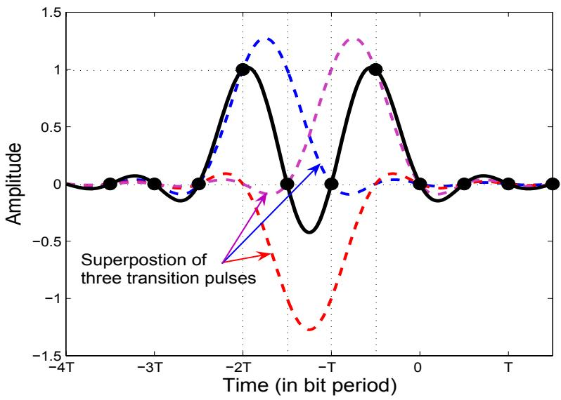  
รูปที่ 6.34: สัญญาณพัลส์ไตรบิตซึ่งเกิดจากผลรวมของสัญญาณพัลส์เปลี่ยนสถานะ 3 สัญญาณ

$$
r _ { k } = a _ { k } - a _ { k - 2 }
$$

หรืออาจจะเขียนได้ ดังนี้

$$
a _ { k } = r _ { k } + a _ { k - 2 }
$$

สมมุติว่า ระบบไม่มีสัญญาณรบกวน นั่นคือ $n ( t ) = 0$ สำหรับทุกค่า t จะได้ว่า $y _ { k } = r _ { k }$ ดังนั้น วงจร ภาครับสามารถตรวจหาข้อมูล $a _ { k }$ ได้จาก

$$
\hat { a } _ { k } = y _ { k } + \hat { a } _ { k - 2 }\tag{6.17}
$$

## ตัวอย่างเช่น

1) กรณีที่ระบบมีบิตเปลี่ยนสถานะบิตเดียว แซมเปิลเอาต์พุตที่ได้จากวงจรชักตัวอย่าง คือ $\left\{ y _ { k } \right\} =$ $\{ \ . . . , 0 , 0 , 0 , 1 , 1 , 0 , 0 , 0 , 0 , . . . \ \}$ ดังนั้น จากสมการ (6.17) จะได้ว่า $\left\{ \hat { a } _ { k } \right\} = \left\{ \begin{array} { l l } { \mathbf { \Omega } \cdot \mathbf { \Omega } \cdot \mathbf { \Omega } , 0 . } \end{array} \right.$ 0, 0, 1, 1, 1, 1, 1, 1, . . . } นันคือ $\hat { a } _ { k } = a _ { k }$

2) กรณีที่ระบบมีบิตเปลี่ยนสถานะ 3 บิตติดกัน แซมเปิลเอาต์พุตที่ได้จากวงจรชักตัวอย่าง คือ $\{ y _ { k } \} = \{ \ . . . , 0 , 0 , 0 , 1 , 0 , 0 , 1 , 0 , 0 , 0 , . . . \ \}$ ดังนั้น จากสมการ (6.17) จะได้ว่า ซ $\left\{ \hat { a } _ { k } \right\} =$ { . . ., 0, 0, 0, 1, 0, 1, 1, 1, 1, . . . } นันคือ $\hat { a } _ { k } = a _ { k }$ เช่นกัน

จากตัวอย่างที่แสดง ข้างต้น สรุปได้ว่า ในกรณีที่ระบบไม่มีสัญญาณรบกวน แต่อาจจะ มี IS1 มาก น้อยเพียงใดก็ตาม (จะมีบิตเปลี่ยนสถานะติดกันกี่บิตก็ได้) วงจรภาครับก็ ยังสามารถที่จะกู้ข้อมูลให้ กลับคืนมาได้อย่างถูกต้อง โดยใช้เพียงใช้วงจรตรวจหาแบบง่ายที่สร้างตามสมการ (6.17) ซึ่งเหตุผล นี้จึงช่วยตอบคำถามที่ว่า "ทำไมถึงต้องปรับสัญญาณพัลส์ให้อยู่ในรูปแบบที่ต้องการ?"อย่างไรก็ตาม ในทางปฏิบัติ ระบบยังคงเผชิญกับสัญญาณรบกวนต่างๆ เพราะฉะนั้น วงจรตรวจหาที่ใช้จึงต้องมีความ ซับซ้อนมากกว่าการใช้สมการเอาต์พุตของทาร์เก็ตเพียงอย่างเดียว

## 6.6.11วงจรตรวจหาสัญลักษณ์

วงจรตรวจหาสัญลักษณ์ (symbo1 detector) จะทำหน้าที่ในการตรวจหาข้อมูลบิตที่ส่งมาจากวงจรภาค ส่ง ก่อนที่ส่งผ่านไปยังกระบวนการอื่นๆ เช่น การถอดรหัส RLL และการถอดรหัส ECC วงจร

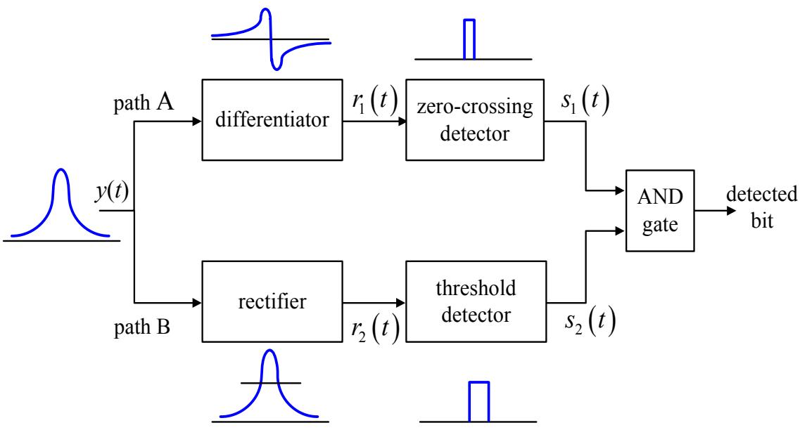  
รูปที่ 6.35: หลักการทำงานของวงจรตรวจหาจุดสูงสุด

ตรวจหาสัญลักษณ์ที่ใช้กันในฮาร์ดดิสก์ไดรฟ์ในอดีต คือ "วงจรตรวจหาจุดสูงสุด (peak detector)" แต่ในปัจจุบันนี้จะเปลี่ยนมาเป็น "วงจรตรวจหาลำดับ (sequence detector)" ซึ่งมีรายละเอียดดังนี้

## วงจรตรวจหาจุดสูงสุด

วงจรตรวจหาจุดสูงสุด (peak detector) ทำหน้าที่ในการตรวจหาข้อมูลบิตที่ส่งมาจากวงจรภาคส่ง โดย การพิจารณาจากค่าแอมพลิจูดสูงสุดหรือจุดสูงสุดของสัญญาณ เนืองจาก ข้อมูลบิตเปลี่ยนสถานะ "1" (ตามรูปแบบของ NRZ1) จะสอดคล้องกับจุดสูงสุดของสัญญาณ พัลส์ เปลี่ยนสถานะ และ ข้อมูล บิต เปลี่ยนสถานะ "0" หมายถึง สัญญาณพัลส์เปลี่ยนสถานะมีค่าแอมพลิจูดเป็นค่าศูนย์วงจรตรวจหา จุดสูงสุดจะมีลักษณะการทำงานเป็นแบบที่ละหนึ่งบิต กล่าวคือ จะทำการตัดสินใจว่า ข้อมูลที่ส่งมาคือ อะไรทีละ หนึ่งบิต ในทางปฏิบัติ วงจรตรวจหาจุดสูงสุดมักจะ ใช้งานร่วมกับรหัส RLL ในฮาร์ดดิสก์ ไดรฟ์ เพื่อหลีกเลี่ยงปัญหาที่ เกิดจาก ISI ทั้งนี้เป็นเพราะว่า ถ้าสัญญาณที่จะ ทำการตรวจหาข้อมูล มี ISI แฝงอยู่ วงจรตรวจหาจุดสูงสุดจะทำงานได้ไม่ดี

วงจรตรวจหาจุดสูงสุดมีหลักการทำงาน ตามรูปที่ 6.35 นั่นคือ สัญญาณที่เข้ามา y(t) จะถูกส่ง

แยกออกเป็น 2 เส้นทาง คือ เส้นทาง A และเส้นทาง B ซึ่งแต่ละเส้นทางมีหลักการทำงาน ดังนี้ e

1) เส้นทาง A สัญญาณ ม(t) จะ ถูกทำการหาอนุพันธ์ (differeทtiate) เพื่อให้ตำแหน่งที่เกิด จุดสูงสุดของสัญญาณกลายเป็นจุดตัดค่าศูนย์ (zero-crosรing point) บนแกน x จากนั้น ก็จะ นำสัญญาณ $r _ { 1 } ( t )$ ที่ได้ไปเข้า "วงจรตรวจหาจุดตัดค่าศูนย์ (zero-crossing detector)" เพื่อหา บริเวณที่เกิดจุดสูงสุดของสัญญาณ $y ( t )$ แล้วก็สร้างเป็นสัญญาณพัลส์รูปสี่เหลี่ยม $s _ { 1 } ( t )$ เพื่อ เป็นตัวบอกว่า จุดสูงสุดของสัญญาณ ญ(t) อยูณ บริเวณนั้น

2) เส้นทาง B สัญญาณ $y ( t )$ จะถูกส่งเข้าไปในวงจรเร็กทิไฟเออร์ (rectifier) หรือวงจรทำกระแส ตรง ทำให้ได้เป็นสัญญาณ $r _ { 2 } ( t )$ แล้วก็ส่งต่อไปยัง"วงจรตรวจหาขีดเริมเปลียน (threshod detector)" เพื่อทำการตรวจว่าสัญญาณ $r _ { 2 } ( t )$ ที่ได้นั้นมีค่าแอมพลิจูดเกินกว่าระดับขีดเริ่มเปลี่ยน หรือไม่ ถ้าแอมพลิจูดมีค่ามากกว่าระดับขีดเริ่มเปลี่ยน ก็แสดงว่าบริเวณนั้นเป็นจุดสูงสุดของ สัญญาณ $y ( t )$ จากนั้น ก็สร้างสัญญาณพัลส์รูปสีเหลี่ยม $s _ { 2 } ( t )$ ออกมา เพื่อเป็นตัวบอกว่า จุดสูงสุดของสัญญาณ $y ( t )$ อยู่ณ บริเวณนัน

หลังจากนัน วงจรเกตแอนด์ (AND gate) จะนำสัญญาณ $s _ { 1 } ( t )$ และ $s _ { 2 } ( t )$ มาทำการเปรียบเทียบ เพื่อตัดสินใจว่า ข้อมูล ณ บริเวณนั้นเป็นบิตเปลี่ยนสถานะ "1" หรือไม่ กล่าวคือ ถ้าสัญญาณพัลส์ รูปสี่เหลี่ยม $s _ { 1 } ( t )$ และ $s _ { 2 } ( t )$ อยูในบริเวณเดียวกัน แสดงว่าบริเวณนั้น คือ บิตเปลี่ยนสถานะ "1" มิฉะนันแล้ว จะเป็นบิตเปลียนสถานะ "0"

เหตุผล ที่วงจรตรวจหาจุดสูงสุดต้องใช้ทั้ง 2 เส้นทาง (ตามรูปที่ 6.35) ในการหาจุดสูงสุดของ สัญญาณ y(t) เป็นเพราะว่า

• ถ้าใช้เส้นทาง A เพียงเส้นทางเดียว อาจจะเกิดปัญหาได้ในกรณีที่ สัญญาณ $y ( t )$ มีสัญญาณ รบกวนปะปนมาก ทำให้สัญญาณ $r _ { 1 } ( t )$ ที่ได้มีจุดตัดแกน x หลายจุด ทำให้ไม่สามารถบอกได้ แน่ชัดว่า จุดตัดแกน x จุดใดที่สอดคล้องกับจุดสูงสุดของสัญญาณ y(t)

ถ้าใช้เส้นทาง B เพียงเส้นทางเดียว อาจจะเกิดปัญหาได้ในกรณีที่ บริเวณที่สัญญาณ $y ( t )$ มีค่า แอมพลิจูดมากกว่าระดับขีดเริ่มเปลี่ยนเป็นบริเวณกว้าง ทำให้สัญญาณ $s _ { 2 } ( t )$ ที่ได้มีสัญญาณ พัลส์รูปสี่เหลี่ยมค่อนข้างกว้าง ทำให้ยากต่อการตัดสินใจว่า จุดสูงสุดของสัญญาณ ม(t) อยู ณ ตำแหน่งไหน

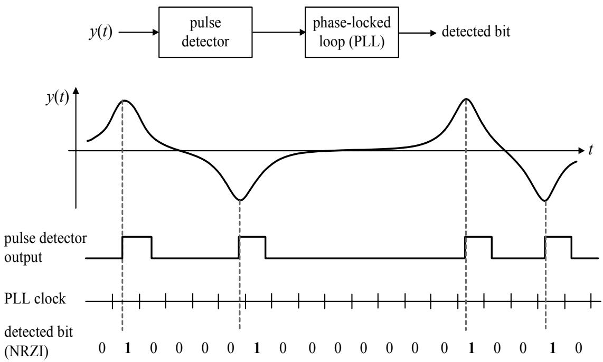  
รูปที่ 6.36: หลักการทำงานของวงจรตรวจหาจุดสูงสุดแบบไม่เข้าจังหวะ

ดังนั้น การที่วงจรตรวจหาจุดสูงสุดใช้ทั้ง 2 เส้นทางในการทำงาน จึงช่วยทำให้มั่นใจได้ว่า ตำแหน่ง 0 ของบิตเปลี่ยนสถานะ "1" ที่หาได้จากจุดสูงสุดของสัญญาณ y(t) มีความถูกต้องและน่าเชื่อถือ ในทางปฏิบัติ วงจรตรวจหาจุดสูงสุดสามารถใช้งานได้ 2 แบบ คือ

1) วงจรตรวจหาจุดสูงสุดแบบไม่เข้าจังหวะ (asynchronous peak detector)มีลักษณะการทำงาน ตามรูปที่ 6.36 สมมุติว่า สัญญาณที่ต้องการจะตรวจหาข้อมูล คือ y(t) สัญญาณนี้จะ ถูกส่ง เข้าไปใน วงจรตรวจหาสัญญาณพัลส์ (pulse detector) เพื่อสร้างสัญญาณพัลส์รูปสี่เหลี่ยม ณ ตำแหน่งที่ เป็นจุดสูงสุดหรือจุดต่ำสุดของสัญญาณ ม(t) จากนั้น สัญญาณพัลส์รูปสี่เหลี่ยมก็ จะ ถูกส่งไปเปรียบเทียบกับสัญญาณนาฟิกาที่สร้างโดย วงจรเฟสล็อกลูป (PLL: phase-locked loop) [5] ถ้าจุดสูงสุดหรือ จุดต่ำสุดของ สัญญาณ y(t) (เฉพาะ ตำแหน่ง ที่สัญญาณพัลส์ รูป สี่เหลี่ยมมีการเปลี่ยนแปลงระดับของสัญญาณจากระดับต่ำไป เป็นระดับสูง)ตกอยู่ในช่อง สัญญาณนาฬิกาใด ตำแหน่งนั้นก็จะได้ข้อมูลออกมาเป็นบิตเปลี่ยนสถานะค่า "1" มิฉะนั้นแล้ว จะเป็นค่า "0" (ตามรูปแบบข้อมูล NRZI)

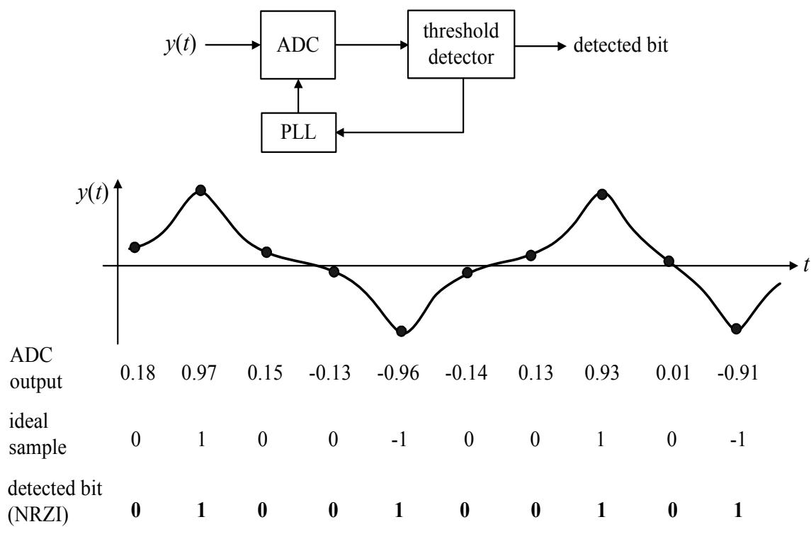  
รูปที่ 6.37: หลักการทำงานของวงจรตรวจหาจุดสูงสุดแบบเข้าจังหวะ

2) วงจรตรวจหาจุดสูงสุดแบบเข้าจังหวะ (synchronous peak detector)มีลักษณะ การทำงาน ตามรูปที่ 6.37 โดยที่ สัญญาณ ม(t) จะ ถูกทำการชักตัวอย่างแบบเข้าจังหวะกับวงจรภาคส่ง (นั่นคือ ชักตัวอย่างหนึ่งครั้งต่อหนึ่งบิดเซลล์) โดยวงจรชักตัวอย่างที่ถูกควบคุมการทำงานโดย วงจรเฟสล็อกลูป แซมเปิลเอาต์พุตที่ได้จะถูกส่งต่อไปยังวงจรตรวจหาขีดเริ่มเปลี่ยนเพื่อทำการ ตัดสินใจว่า ข้อมูลที่ส่งมาเป็นบิดเปลี่ยนสถานะค่า "0" หรือค่า "1" (ตามรูปแบบข้อมูล NRZI)

โดยสรุปแล้ว ในระบบการประมวลผลสัญญาณของฮาร์ดดิสก์ไดรฟ์ วงจรตรวจหาจุดสูงสุดจะใช้ งานร่วมกับรหัส RLL เพื่อทำให้บิตเปลี่ยนสถานะอยู่ห่างกันมากๆ โดยจะทำงานได้ดีเมื่อ ND ต่ำ การ ใช้งานวงจรตรวจหาจุดสูงสุดมีข้อดี คือ วงจรไม่ซับซ้อน และมีราคาถูก ส่วนข้อเสีย คือ วงจรตรวจหา จุดสูงสุดจะทำงานไม่ดี ถ้าสัญญาณที่ต้องการจะตรวจหาข้อมูลมี ISI แฝงอยู่มาก (นั้นคือ เมื่อทำงาน ที่ND สูง) ดังแสดงในรูปที่ 6.38 จะเห็นได้ว่า เมื่อ ND สูง ถ้าข้อมูลที่เขียนลงไปในสื่อบันทึกมีบิต เปลี่ยนสถานะ "1" ติดกันหลายบิต สัญญาณ read-back ที่ได้จะมีรูปร่างผิดเพี้ยนไป อันเนื่องมาจาก

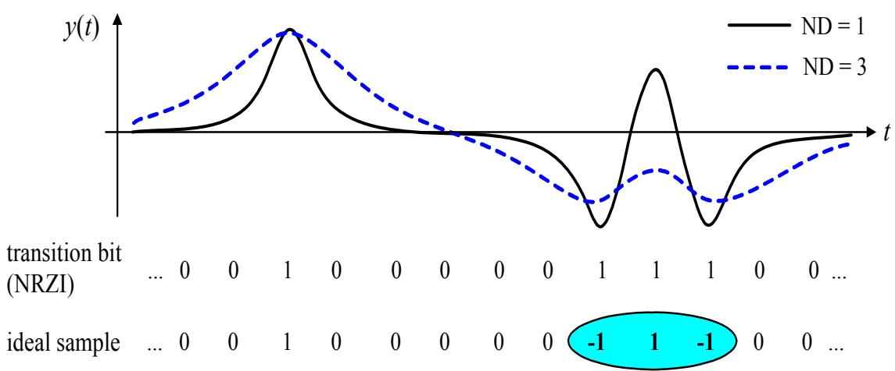  
รูปที่ 6.38: ตัวอย่างสัญญาณที่ต้องการตรวจหาข้อมูลที่ ND = 1 และ 3

ISI ซึ่งจะ ทำให้วงจรตรวจหาจุดสูงสุดทำงานผิดพลาดได้ ตัวอย่างเช่น จากรูปที่ 6.38 วงจรตรวจหา จุดสูงสุดอาจจะบอกว่าสัญญาณ ม(t) ที่ ND = 3 มีจุดสูงสุดหรือจุดต่ำสุดเพียง 2 จุดเท่านั้น แทนที่จะ เป็น 4 จุดเหมือนกับสัญญาณ y(t)ที่ ND = 1 ในปัจจุบัน วงจรตรวจหาลำดับ (sequence detector) ได้ถูกนำมาใช้งานแทนวงจรตรวจหาจุดสูงสุด เนื่องจาก ฮาร์ดดิสก์ไดรฟ์มีความจุสูงขึ้น (ND มากขึ้น)

## วงจรตรวจหาลำดับ

วงจรตรวจหาลำดับ (sequence detector)จะ ต่างจากวงจรตรวจหาจุดสูงสุดตรงที่ว่า วงจรตรวจหา จุดสูงสุดจะทำการถอดรหัส ข้อมูลทีละหนึ่งบิต ในขณะที่ วงจรตรวจหาลำดับจะทำการถอดรหัสลำดับ ข้อมูลทั้งลำดับที่เป็นไปได้มากที่สุดในคราวเดียว วงจรตรวจหาลำดับที่นิยมใช้ในฮาร์ดดิสก์ไดรฟ์ มีชื่อ เรียกว่า "วงจรตรวจหาลำดับที่ควรจะ เป็นมากสุด (MLsD: maximum-likelihood sequence detector)" เนื่องจาก มีความทนทานต่อสัญญาณรบกวนและ IS1 ได้มากกว่าวงจรตรวจหาจุดสูงสุด ดังนั้น เมื่อมีการใช้งาน MLรD แล้ว ฮาร์ดดิสก์ไดรฟ์ก็สามารถยอมให้พารามิเตอร์ d (เป็นตัวกำหนดจำนวน น้อยสุดของบิต "0" ที่อยู่ระหว่างบิต "1") ของรหัส RLL มีค่าเท่ากับค่าศูนย์ได้ ซึงจะช่วยลดจำนวน บิตโกิน (reduทdant bit) ที่จะ ต้องเขียนลงไปในสื่อบันทึก ทำให้ผู้ใช้สามารถเขียนข้อมูลข่าวสารที ต้องการลงไปในสื่อบันทึกได้มากขึ้น

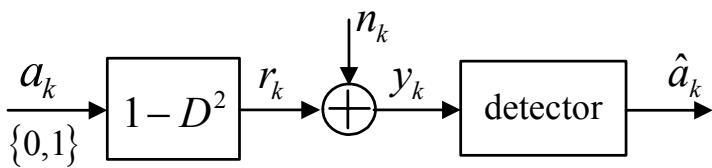  
รูปที่ 6.39: แบบจำลองช่องสัญญาณ PR4

ให้พิจารณาช่องสัญญาณ PR4 ตามรูปที่ 6.39 นั่นคือ ข้อมูลอินพุต $a _ { k } \in \{ 0 , 1 \}$ ถูกส่งผ่านไปยัง ช่องสัญญาณ $H ( D ) = 1 - D ^ { 2 }$ ได้เป็นสัญญาณเอาต์พุต $r _ { k } \in \{ 0 , \pm 1 \}$ ซึ่งจะถูกรบกวนโดยสัญญาณ รบกวนสีขาว (white noise) $n _ { k }$ ได้เป็นสัญญาณ $y _ { k }$ ซึ่งจะ ถูกนำไปถอดรหัสด้วยวงจรตรวจหา เพื่อ ตัดสินใจว่าข้อมูลบิตที่ส่งมาคืออะไร ถ้าวงจรตรวจหาที่ใช้ คือ วงจรตรวจหาจุดสูงสุดหรือวงจรตรวจหา ขีดเริ่มเปลี่ยน ก็จะทำการถอดรหัสโดยใช้เกณฑ์ ดังนี้

$$
\hat { r } _ { k } = \left\{ \begin{array} { r l } { 1 , } & { { } \mathrm { i f } \ y _ { k } > 0 . 5 } \\ { - 1 , } & { { } \mathrm { i f } \ y _ { k } < - 0 . 5 } \\ { 0 , } & { { } \mathrm { i f } \ - 0 . 5 < y _ { k } < 0 . 5 } \end{array} \right.
$$

ดังนั้นถ้าสมมุติว่า สัญญาณที่ได้รับ $\{ y _ { k } \} ~ = ~ \{ 0 . 7 , ~ 0 . 5 , ~ - 0 . 8 , ~ - 0 . 1 , ~ 0 . 7 , ~ 0 . 8 , ~ 1 . 1 , ~ 0 . 2 \}$ วงจร ตรวจหาขีดเริ่มเปลี่ยนก็อาจจะบอกว่า เอาด์พุตของช่องสัญญาณนี้ คือ $\hat { r } _ { k } = \{ 1 , \ : x , \ : - 1 , \ : 0 , \ : 1 , \ : 1 , \ : 1$ 0) โดยที่ x เป็นได้ทั้งค่า 0 หรือ 1 จะเห็นได้ว่า ข้อเสียของวงจรตรวจหาขีดเริ่มเปลี่ยน คือ ถ้าสัญญาณ ที่จะทำการถอดรหัสตกอยู่ในตำแหน่งที่ เป็นขีดเริ่มเปลี่ยน (ในที่นี้ คือ ค่า 0.5 และ -0.5) วงจร ตรวจหาขีดเริ่มเปลี่ยนจะไม่สามารถตัดสินใจค่าที่ถูกต้องได้ นอกจากนี้ วงจรตรวจหาขีดเริ่มเปลี่ยนจะ ทำการถอดรหัส ข้อมูล ทีละ หนึ่งบิต เพราะฉะนั้น วงจรตรวจหาขีดเริ่ม เปลี่ยนจะไม่สนใจว่า รูปแบบ ข้อมูลอะไรบ้างที่ไม่สามารถเกิดขึ้นได้ ตัวอย่างเช่น ในกรณีนี้สำหรับสัญญาณ PR4 ข้อมูลเอาต์พุต ของช่องสัญญาณไม่สามารถที่จะ มีบิตค่า 1 ติดกันสามบิตได้ แต่ปรากฎว่า ข้อมูลเอาต์พุตของวงจร ตรวจหาขีดเริ่มเปลี่ยนมีบิตค่า 1 ติดกันสามบิต ดังนั้น จะเห็นได้ชัดเจนว่า วงจรตรวจหาจุดสูงสุดไม่ สามารถทำงานได้ดี โดยเฉพาะอย่างยิ่งเมื่อช่องสัญญาณมี IS1

สำหรับวงจรตรวจหา MLรD จะทำการตรวจหาลำดับข้อมูล $\{ r _ { k } \}$ ที่เป็นไปได้มากที่สุดที่ทำให้เกิด

## 6.6. สถาปัตยกรรมช่องสัญญาณอ่าน

สัญญาณ $\{ y _ { k } \} = \{ 0 . 7 , \ 0 . 5 , \ - 0 . 8 , \ - 0 . 1 , \ 0 . 7 , \ 0 . 8 , \ 1 . 1 , \ 0 . 2 \}$ โดยในขั้นตอนแรก MLSD จะทำ การสร้างลำดับข้อมูล $\{ r _ { k } \}$ ที่เป็นไปได้15ทั้งหมดขึ้นมา เช่น สมมุติว่า มีลำดับข้อมูล $\{ r _ { k } \}$ ที่เป็นไปได้ ทั้งหมด 4 แบบ ได้แก่

1) ลำดับข้อมูล $\{ r _ { k } \}$ ที่1 มีค่าเท่ากับ {1, 0, −1, 0, 1, 1, 0, 0}

2) ลำดับข้อมูล $\{ r _ { k } \}$ ที่ 2 มีค่าเท่ากับ {1, 0, −1, 0, 0, 1, 1, 0}

3) ลำดับข้อมูล $\{ r _ { k } \}$ ที่ 3 มีค่าเท่ากับ {1, 0, −1, 0, 0, 0, 1, 1}

4) ลำดับข้อมูล $\{ r _ { k } \}$ ที่ 4 มีค่าเท่ากับ $\{ 1 , - 1 , - 1 , 0 , 0 , 1 , 1 , 0 \}$

จากนั้น MLSD ก็จะ ทำการหาลำดับข้อมูล $\{ r _ { k } \}$ ที่ใกล้เคียงกับสัญญาณ $\left\{ y _ { k } \right\}$ โดยพิจารณาจาก “ระยะทางกำลังสองเฉลี่ย (MSD: mean-squared distance)"ที่นิยามโดย

$$
\mathrm { M S D } = \sum _ { k = 0 } ^ { L - 1 } ( y _ { k } - \hat { r } _ { k } ) ^ { 2 }\tag{6.18}
$$

เมื่อ L คือ ความยาวของลำดับข้อมูล $\{ r _ { k } \}$ เพราะฉะนั้น ลำดับข้อมูล $\{ r _ { k } \}$ ที่ควรจะเป็นมากที่สุด (ML: maximum-likelihood) คือ ลำดับข้อมูลที่มีค่า MsD น้อยที่สุด จากสมการ (6.18) จะได้ว่า MรD ของลำดับข้อมูลที1, 2, 3, และ 4 คือ 1.77, 0.97, 2.17, และ 2.97 ตามลำดับ ดังนั้น MLรD จะตัดสินใจว่า ลำดับข้อมูลที่สอง $\{ 1 , 0 , - 1 , 0 , 0 , 1 , 1 , 0 \}$ คือ ลำดับข้อมูลที่ควรจะเป็นมากที่สุด

ในทางปฏิบัติการทำงานของ MLรD ลักษณะนี้ไม่สามารถนำมาใช้งานจริงในฮาร์ดดิสก์ไดรฟ์ได้ รั้ท เนื่องจาก ข้อมูลหนึ่งเซกเตอร์ (sector) มีจำนวนเท่ากับ 4096 บิต ดังนั้น จำนวนลำดับข้อมูลที่เป็น ได้ทั้งหมดที่ MLSD สร้างขึ้นจะมีจำนวนประมาณ $2 ^ { 4 0 9 6 }$ แบบ ถ้ากำหนดให้ MLรD มีความสามารถ ในการคำนวณ MรD โดยใช้เวลา $1 0 ^ { - 1 2 }$ วินาทีต่อหนึ่งลำดับข้อมูล จะพบว่า ระบบ ยังต้องใช้เวลา หลายล้านปีในกาคำนวณหาค่า MรD ของทุกลำดับข้อมูลที่เป็นไปได้ วิธีการแก้ไขปัญหานี้ก็คือ การนำ อัลกอริทึมวีเทอร์บิ (Viterbi algorithm) [55] มาใช้ในการสร้าง MLsD โดยผลลัพธ์ที่ได้เรียกกันว่า “วงจรตรวจหาวีเทอร์บิ (Viterbi detector)" ซึ่งจะ อธิบายรายละเอียดในบทที่ 4 ของหนังสือ "การ ประมวลผลสัญญาณสำหรับการจัดเก็บข้อมูลดิจิทัล เล่ม 2 : การออกแบบวงจรภาครับ" [6]

<table><tr><td>preamble</td><td>sync mark</td><td>data</td></tr></table>

รูปที่ 6.40: โครงสร้างทั่วไปของข้อมูลหนึ่งเซกเตอร์

## 6.6.12 วงจรตรวจหาเครื่องหมายเข้าจังหวะ

โดยทัวไป โครงสร้างของข้อมูลหนึ่งเชกเตอร์ที่ขียนลงไปในสือบันทึกจะมีลักษณะตามรูปที 6.40 เมื่อ "เครื่องหมายเข้าจังหวะ (sync mark)" เป็นรูปแบบของข้อมูลบิตเฉพาะที่รู้กันระหว่างวงจรภาคส่งและ 2น วงจรภาครับ ซึ่งจะทำหน้าที่ในการตรวจสอบการทำงานของระบบไทมมิ่งริคัฟเวอรีว่าทำงานถูกต้องหรือ ไม่กล่าวคือ ในช่วงเริ่มต้น ระบบไทมมิ่งริคัฟเวอรีจะทำงานในภาวะการได้มา (aqนเรเtioก mode) โดยใช้ข้อมูล preamble ช่วยในการทำงาน เพื่อคำนวณหาค่าออฟเซตทางเฟส (phase Offset) และ ออฟเซตทางความถี (frequency offset) เริ่มต้น ที่แฝงอยูในสัญญาณ read-back จากนั้น ก็จะเปลี่ยน เข้าสูภาวะการติดตาม (tracking mode) เมื่อทำการชักตัวอย่างสัญญาณ read-back เสร็จแล้ว ก็จะส่ง ข้อมูลแซมเปิลที่ได้ไปยังวงจรตรวจหาสัญลักษณ์ เพื่อทำการถอดรหัสข้อมูลบิต แล้วก็ส่งผลลัพธ์ที่ได้ ไปยัง "วงจรตรวจหาเครื่องหมายเข้าจังหวะ (sync mark detector)" เพื่อทำการเปรียบเทียบข้อมูลที ถอดรหัสมาได้กับรูปแบบเครื่องหมายเข้าจังหวะว่าเหมือนกันหรือไม่

ถ้าเหมือนกัน ระบบก็จะส่งข้อมูลต่อไปยังวงจรถอดรหัสมอดูเลชัน (modulation decoder) และ วงจรถอดรหัส ECC (ECC decoder)

•ถ้าไม่เหมือนกัน ระบบก็จะสั่งให้ระบบไทมมิ่งริดัฟเวอรีทำงานซ้ำ โดยทำการชักตัวอย่างสัญญาณ read-back ใหม่ และอาจจะมีการปรับค่าพารามิเตอร์ของวงจรเฟสล็อกลูปใหม่

รูปที่ 6.41 แสดงตัวอย่างสัญญาณ read-back ที่ปราศจากสัญญาณรบกวน จะเห็นได้ว่า สัญญาณ read-back ช่วง preamble และเครื่องหมายเข้าจังหวะ จะมีรูปแบบที่แน่นอนตายตัว16

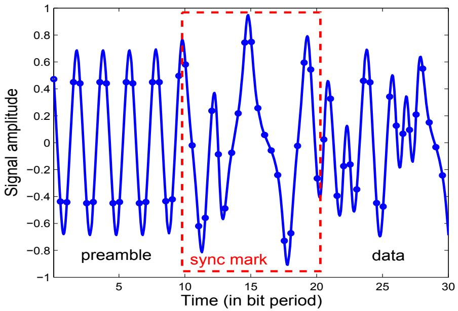  
รูปที่ 6.41: ตัวอย่างสัญญาณ read-back ที่ไม่มืองค์ประกอบของสัญญาณรบกวน

## 6.6.13วงจรถอดรหัสมอดูเลชันและวงจรถอดรหัส ECC

ข้อมูลเอาต์พุตที่ได้จากวงจรตรวจหาเครื่องหมายเข้าจังหวะ (เมื่อวงจรชักตัวอย่างทำงานได้อย่างถูกต้อง) จะถูกส่งไปยังวงจรถอดรหัสมอดูเลชัน เพื่อทำหน้าที่ถอดรหัส RLL จากนั้น ข้อมูลที่ถอดรหัสได้ก็จะ ถูกส่งเข้าไปในวงจรถอดรหัส ECด เพื่อทำหน้าที่แก้ไขข้อผิดพลาดที่อาจจะ เกิดขึ้น เพื่อให้ได้เป็นค่า be ประมาณของบิตข่าวสาร (message bit)

## 6.7สรุปท้ายบท

ในบทนี้ได้อธิบายถึงภาพรวมของกระบวนการเขียนและการอ่านข้อมูลในฮาร์ดดิสก์ไดรฟ์ ทำให้ผู้อ่าน ทราบว่า ในแต่ละกระบวนการ ประกอบไปด้วยขั้นตอนอะไรบ้าง และแต่ละขั้นตอนมีหลักการทำงาน ญ อย่างไร นอกจากนี้ ยังกล่าวถึงความไม่เป็นเชิงเส้นที่พบบ่อยในกระบวนการเขียนข้อมูลของฮาร์ดดิสก์ ไดรฟ์ ในขณะที่ กระบวนการอ่านมีความเป็นเชิงเส้นค่อนข้างมาก ทำให้สามารถแสดงสัญญาณ readback ให้อยู่ในรูปของสมการทางคณิตศาสตร์ได้ ตามคุณสมบัติการซ้อนทับ และด้วยสาเหตุนี้จึงทำให้ สามารถที่จะจำลองช่องสัญญาณการบันทึกระบบแม่เหล็ก ให้อยู่ในรูปของสมการทางคณิตศาสตร์ได้ ซึ่งเป็นประโยชน์อย่างมากต่อการวิเคราะห์ระบบการประมวลผลสัญญาณของฮาร์ดดิสก์ไดรฟ์ สุดท้าย ได้อธิบายถึงสถาปัตยกรรมช่องสัญญาณอ่าน ทำให้ทราบว่า ชิปช่องสัญญาณอ่านประกอบไปด้วยส่วน ประกอบอะไรบ้าง และ แต่ละส่วนประกอบมีหน้าที่การทำงานอย่างไร ซึ่งจะ เป็นประโยชน์มากสำหรับ การวิเคราะห์สัญญาณในฮาร์ดดิสก์ไดรฬ์

## 6.8แบบฝึกหัดท้ายบท

1. จงอธิบายความหมายของพารามิเตอร์ (d, k) ในรหัส RLL

2. จงหาค่าพารามิเตอร์ (d, k) ของรหัส RLL จากลำดับข้อมูลต่อไปนี้   
2.1) {1, 0, 1, 0, 1, 0, 1, 0, 1, 0, 1, 0, 1, 0, 1, 0, 1, 0, 1, 0, 1, 0, 1}   
2.2) {1, 0, 1, 0, 0, 1, 0, 0, 0, 1, 0, 0, 1, 0, 1, 0, 0, 0, 1, 0, 1, 0, 1}   
2.3) {1, 0, 0, 1, 0, 0, 0, 1, 0, 0, 0, 1, 0, 0, 1, 0, 0, 0, 0, 1, 0, 0, 1}   
2.4) {1, 0, 1, 0, 0, 1, 1, 0, 0, 0, 1, 0, 1, 1, 0, 0, 1, 0, 0, 0, 1, 0, 1}

3. รหัส Rร (Reed Solomon) แบบ (63, 57) จะ มีความสามารถในการตรวจหา (detect) ข้อผิดพลาดแบบหลายบิตติดกันที่มีความยาวไม่เกินกี่บิต และมีความสามารถในการแก้ไข (correct)ข้อผิดพลาดแบบหลายบิตติดกันที่มีความยาวไม่เกินกี่บิต

4.ถ้าลำดับข้อมูลด้านขาเข้าของวงจรเข้ารหัสก่อน (precoder) คือ $\left\{ a _ { k } \right\} = \left\{ 1 , 0 , 1 , 1 , 0 , 0 , 1 \right.$ 0, 1, 1, 1, 0, 1} จงวาดบล็อกแผนภาพของวงจรเข้ารหัสก่อน พร้อมทั้งหาลำดับข้อมูลด้าน ขาออกของวงจรเข้ารหัสก่อน เมื่อ วงจรเข้ารหัสก่อนมีฟังก์ชันถ่ายโอน ดังต่อไปนี้ สู

4.1) $P ( D ) = 1 / ( 1 \oplus D )$   
4.2) $P ( D ) = 1 / ( 1 \oplus D ^ { 2 } )$

## 6.8. แบบฝึกหัดท้ายบท

4.3) $P ( D ) = 1 / ( 1 \oplus D \oplus D ^ { 2 } )$

5. จงอธิบายสาเหตุของการเกิดและผลกระทบของปรากฎการณ์การลบล้างบางส่วน (pลrtลl erasure)

6. จงอธิบายสาเหตุของการเกิดและผลกระทบของปรากฎการณ์การเลือนตำแหน่งของการเปลียน สถานะ แบบแข็ง (hard transition shift)

7. จงอธิบายความแตกต่างระหว่างการเลื่อนตำแหน่งของการเปลี่ยนสถานะแบบแข็ง และการเลื่อน ตำแหน่งของการเปลียนสถานะแบบอ่อน (easy tranรition shift)

8. จงอธิบายสาเหตุของการเกิดและผลกระทบของปรากฏการณ์การบันทึกทับ (0vยาพrite)

9. จงอธิบายสาเหตุของการเกิดและผลกระทบของปรากฎการณ์การเลื่อนตำแหน่งของการเปลี่ยน สถานะ แบบไม่เป็นเชิงเส้น (nonlinear transition shift)

10. จงอธิบายหลักการทำงานของกระบวนการการชดเชยก่อนการเขียน (พrite precompenรation)

2 e 8สุส 11. จงบอกคุณสมบัติของสิอบันที่กที่ดิมาอย่างน้อย 4 ข้อ

12. จงอธิบายวิธีการที่ได้มาซึ่งสมการคณิตศาสตร์ของสัญญาณ read-back

13. จงอธิบายความแตกต่างระหว่างแบบจำลองช่องสัญญาณอุดมคติ และ แบบจำลองช่องสัญญาณ เสมือนจริง

14. จงอธิบายโครงสร้างสถาปัตยกรรมช่องสัญญาณอ่านมาโดยสังเขป

15. จงอธิบายสาเหตุและผลกระทบของความขรุขระเชิงความร้อน (thermal aรperity)

16. จงบอกปัจจัยที่ควรจะคำนึงถึงในการที่จะเปลี่ยนเทคโนโลยีการบันทึกข้อมูลแบบแนวนอน (1ongitudinal) มาเป็นแบบแนวตั้ง (perpendicular) มาอย่างน้อย 4 อย่าง พร้อมทั้งให้เหตุผล ประกอบ

17. จงอธิบายหลักการทำงานของวงจรตรวจหาจุดสูงสุด (peak detector)

18. จงอธิบายเหตุผลที่วงจรตรวจหาลำดับที่ใช้ในฮาร์ดดิสก์ไดรฟ์ จึงถูกสร้างโดยอัลกอริทึมวีเทอร์บิ (Viterbi algorithm)

19. จงอธิบายหน้าที่การทำงานของวงจรตรวจหาเครื่องหมายเข้าจังหวะ (รyทด mลrk detector)